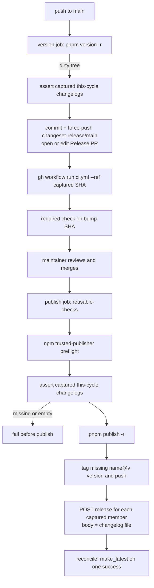

## Goal Capsule

- **Objective:** After a real npm version bump, that package has a `name@v<version>` tag and a GitHub Release whose body is the changelog `pnpm version -r` generated from consumed changeset intents. Missing either fails the publish job. The Release PR's required check actually starts so a maintainer can merge.
- **Authority hierarchy:** `AGENTS.md` / `CONSTITUTION.md` outrank this plan. Evaluator files (`.github/workflows/release.yml`, `.github/workflows/ci.yml`) land in their own commit, observed red then green. `REPO-P1` — no merge, no new credentials.
- **Stop conditions:** A dry-run against a fixture bump set fails when the changelog file is absent or empty, and succeeds when the file is the release body. The version job dispatches CI at the captured bump SHA so the required check is no longer `action_required`. Do not merge `#218`. Do not add a PAT or GitHub App secret.
- **Execution profile:** Two workflow files plus the existing Deno release scripts. Smoke the scripts with `--dry-run` / `--selftest`; do not wait on a live publish.
- **Tail ownership:** Plan author through code-complete. First live cycle after merge is a maintainer merge of a Release PR.

---

## Product Contract

### Summary

pnpm 11 does not create GitHub tags or GitHub Releases. This repo already has post-publish scripts that try. They skip a package that has no changelog file, and they create every release with `make_latest: false`. GitHub Latest is still `omp-claude-compat@v1.7.0` (published 2026-08-10T23:56:31Z). The version job opens the Release PR with `GITHUB_TOKEN`, so `pull_request` CI sits in approval-required and the required check never starts. Pending bumps sit on `#218` (`mergeable_state: blocked`).

The contract is one sentence: a real npm version bump owes a GitHub Release whose body is the pnpm-generated changeset changelog.

Product Contract preservation: bootstrap — no upstream requirements file.

### Problem Frame

A visitor to the repo Releases page sees Latest from 2026-08-10. That matches "the last release was two weeks ago." Current npm versions on 2026-08-21 do have scoped tags and non-empty per-package releases (36 public packages, 0 missing, 0 empty bodies — measured this session against `git ls-remote --tags origin` and `GET /repos/systemfsoftware/systemfsoftware/releases`). The next cycle cannot ship: `#218` is blocked because Actions check suites are `action_required` (GitHub docs: `GITHUB_TOKEN`-created `pull_request` opened/synchronize/reopened runs wait for a write-access approval). The script will also report success if a future bump has no `.changeset/changelogs/` file.

### Key Decisions

- **Notes are the pnpm 11 changeset changelog** (session-settled: user-directed — chosen over commit-derived GitHub notes: the body is what `pnpm version -r` generated from consumed intents). Governs R1, R2.
- **One GitHub Release per bumped public package**, not one combined repo release. Governs R1, R3.
- **Fail closed** on this cycle's bump set. Governs R2, R4.

### Requirements

**Release record**

- R1. When `pnpm publish -r` publishes a new version of a non-private package, that version has a git tag `name@v<version>` and a GitHub Release for that tag.
- R2. That release body's bytes are the file `pnpm version -r` wrote at `.changeset/changelogs/<name with / as !>@<version>.md`. Empty or missing file is a failed job, not a skip.
- R3. Private packages never get a tag or a GitHub Release.
- R4. A Release PR that only consumed `none` intents publishes nothing, tags nothing, creates no releases, and exits 0.

**Visibility and landing**

- R5. After a cycle that created at least one GitHub Release, `GET /repos/{owner}/{repo}/releases/latest` is one of that cycle's releases, not `omp-claude-compat@v1.7.0`.
- R6. Opening or updating `changeset-release/main` starts the required check `build · lint · typecheck · test / the gate (pnpm check:ci)` on the bump commit without a human clicking Approve workflows.

### Success Criteria

- A visitor opening Releases after a real publish sees a current release, and each bumped package's release body is the changeset changelog.
- A maintainer can merge a Release PR after review because the required check ran.

### Scope Boundaries

**In scope:** fail-closed notes, Latest pointer, starting the required check on the Release PR.

**Deferred to follow-up work:** deleting leftover unscoped semantic-release tags; committed per-package `CHANGELOG.md` (`versioning.changelog.storage: repository`); auto-merging the Release PR; a GitHub App token.

**Outside this product's identity:** replacing pnpm-native versioning; changesets/action; semantic-release.

### Assumptions

- `.changeset/changelogs/` files on the Release PR are the composed sections `pnpm version -r` wrote. Observed on `#208` / `#218` and in the create-github-releases header comment. pnpm's default `versioning.changelog.storage` is `registry` (no package `CHANGELOG.md`); that does not retract the `.changeset/changelogs/` files this repo already commits.
- `workflow_dispatch` from `GITHUB_TOKEN` creates a run (GitHub: triggering a workflow from a workflow — `workflow_dispatch` is an exception). Dispatch at the SHA captured after the force-push, not the branch name. The version job needs `actions: write` on that token (token scope, not a new secret).
- A human still approves and merges the Release PR (`REPO-P1`, ruleset review). This plan only makes the required check start.

---

## Planning Contract

### Key Technical Decisions

- KTD1. **Capture the this-cycle set once, before any tag is pushed.** Members are public packages whose `name@v<version>` is absent from `origin` — the set `tag-released-packages.mjs` would mint. Assert mode uses that captured list (tags are still absent). Create-release mode receives the same list as an argument and must not recompute “tag absent” after the tag push. Historical tags already on origin stay heal-by-skip. Rejected: fail on every current version missing a changelog (would fail the job on pre-changelog history).
- KTD2. **Start CI with `workflow_dispatch`, not a new secret.** After the version job force-pushes, capture `HEAD` and `gh workflow run ci.yml --ref` that SHA. Grant the version job `actions: write`. Rejected: PAT / GitHub App (`REPO-P1`). Rejected: leave "Approve workflows" as the landing path — that is why `#218` is blocked. Rejected: drop the required check on this branch.
- KTD3. **After the create loop, set `make_latest: true` on one successful this-cycle release.** Creates in the loop stay `false`. A mid-loop API failure must not leave Latest on the 2026-08-10 leftover if any this-cycle release exists. Arbitrary which member of the set is Latest is acceptable because the product is per-package records (R1), not a combined Latest.
- KTD4. **Keep the two Deno scripts.** Change skip-to-fail for the this-cycle set. Do not add a third orchestrator.

### High-Level Technical Design

### Sequencing

U1 (script contract) before U2 (workflow wiring). U2's version-job dispatch can land with U3 (ci.yml `workflow_dispatch`). Evaluator files stay their own commits.

---

## Implementation Units

### U1. Fail-closed releases from pnpm changelogs

- **Goal:** This-cycle public bumps cannot publish without a non-empty `.changeset/changelogs/` file, and each such bump gets a GitHub Release whose body is that file.
- **Requirements:** R1, R2, R3, R4, R5.
- **Dependencies:** none.
- **Files:**
  - `scripts/tools/create-github-releases.mjs` (modify)
  - `scripts/tools/tag-released-packages.mjs` (modify only if the this-cycle set needs a shared helper — prefer one module both call)
- **Approach:**
  1. Compute the this-cycle set with KTD1 and write it out (step output or file) so later steps reuse it.
  2. Assert mode: every captured member has a non-empty changelog file. Missing or zero-length file → `::error::` + exit 1, naming package, expected path, and that the body must be the pnpm-generated changelog.
  3. Create-release mode: take the captured list as input. POST each member's file bytes as `body`. After the loop, set `make_latest: true` on one successful this-cycle release (KTD3). Existing release is still skip.
  4. Empty captured set → log and exit 0 (R4).
- **Patterns to follow:** fail-closed `run()` already in both scripts; `--dry-run` already on create-github-releases; `--selftest` in `scripts/tools/merge-mutation-reports.mjs`.
- **Execution note:** This is packaging/CI; prove with `--dry-run` and `--selftest`, not a live publish.
- **Test scenarios:**
  - Happy path: one public package, tag absent, changelog file present and non-empty → dry-run plans exactly that release; body path is `.changeset/changelogs/<name with / as !>@<version>.md`.
  - Covers R2: changelog file missing → assert mode exits non-zero and does not print success.
  - Covers R2: changelog file exists but is empty → assert mode exits non-zero.
  - Covers R3: private package is not in the set.
  - Covers R4: every public package already has its tag on the fake remote → set empty, exit 0.
  - Covers R5: captured list of two; after creates, one of them is Latest even if the second create failed.
  - Create mode given the captured list after those tags now exist on the fake remote → still creates those two releases (must not recompute tag-absent).
  - Error: create API returns non-201/200/409 → exit non-zero.
- **Verification:** `--selftest` covers the scenarios above. `--dry-run` against this checkout reports 0 this-cycle releases while current versions are already tagged.

### U2. Start the required check on the Release PR

- **Goal:** Opening or updating `changeset-release/main` starts the required check on the bump SHA without Approve workflows, and the publish job asserts changelogs before `pnpm publish -r`.
- **Requirements:** R2, R6.
- **Dependencies:** U1 (assert mode exists).
- **Files:**
  - `.github/workflows/ci.yml` (add `workflow_dispatch`)
  - `.github/workflows/release.yml` (version job dispatch and permissions; publish job changelog assert)
  - `.github/AGENTS.md` (one sentence: Release PR CI is dispatched; do not wait on Approve workflows)
- **Approach:**
  1. Add `workflow_dispatch` to `ci.yml` so a token-triggered run is legal.
  2. Add `actions: write` to the version job permissions (token scope, not a new secret).
  3. After `pnpm version -r` on a dirty tree, run U1 assert on the captured set before opening the Release PR.
  4. After a successful force-push, `SHA=$(git rev-parse HEAD)` then `gh workflow run ci.yml --ref "$SHA"`.
  5. Publish job order: existing preflight, existing build, U1 assert on the captured set, `pnpm publish -r`, tag script, create-release with the captured list.
  6. If there is nothing to release (clean tree), do not dispatch.
  7. No new secret. `GH_TOKEN` is already `github.token`.
  8. Confirm the dispatched check name matches the ruleset string before calling U2 done.
- **Patterns to follow:** version job already uses `gh pr create` / `gh pr edit` with `GH_TOKEN`.
- **Test expectation:** none — workflow trigger. Proof is a version-job log line that the dispatch was accepted, and a CI run on that SHA that is `queued`/`in_progress`/`success`, not `action_required`.
- **Verification:** After this lands on `main`, the next `version` job that opens or updates the Release PR has a non-`action_required` check suite for GitHub Actions on the bump SHA. Do not merge `#218` as verification.

### U3. Evaluator commit split

- **Goal:** `release.yml` / `ci.yml` changes are not in the same commit as script edits they judge.
- **Requirements:** R6 (landing path).
- **Dependencies:** U1, U2 content exists.
- **Files:** `.github/workflows/release.yml`, `.github/workflows/ci.yml` (commit boundary only).
- **Approach:** Script + selftest commit first. Workflow commit second, with the version-job dispatch and publish-job changelog assert observed: before the workflow commit, a missing-changelog fixture fails only if invoked by hand; after, the publish job has the assert step in YAML.
- **Test expectation:** none — commit discipline (`CONST-E4` / Evaluator surface).
- **Verification:** `git log` shows workflow files not mixed with `scripts/tools/*` in one commit.

---

## Verification Contract

| What                  | Command / action                                                                                                                                                                      | When                      |
| --------------------- | ------------------------------------------------------------------------------------------------------------------------------------------------------------------------------------- | ------------------------- |
| Script contract       | `deno run` the release script `--selftest` (and `--dry-run` on this tree)                                                                                                             | U1                        |
| Local gate            | `pnpm check:local` after the last edit                                                                                                                                                | before PR                 |
| Required check starts | next `version` job log + check suite on `changeset-release/main` head is not `action_required`                                                                                        | U2, after merge to `main` |
| Live notes            | first real Release-PR merge after this lands: each published package has a GitHub Release whose body equals its `.changeset/changelogs/` file; Latest is one of that cycle's releases | maintainer-gated          |

---

## Definition of Done

- U1 selftest covers missing, empty, private, none-only, captured-list reuse after tags exist, and Latest reconcile after a failed later create.
- Publish job asserts changelogs after preflight and before `pnpm publish -r`.
- Version job asserts changelogs before opening the Release PR, and dispatches CI at the captured SHA with `actions: write`; no new secret.
- Evaluator workflow files are their own commit.
- `pnpm check:local` exits 0 after the last edit.
- `#218` is not merged by the agent.

---

## Risks & Dependencies

- **Publish already happened if someone reorders steps.** Mitigation: changelog assert is a step _before_ publish in `release.yml`, not only inside the create-release script.
- **`workflow_dispatch` check name differs from the ruleset context.** Ruleset requires `build · lint · typecheck · test / the gate (pnpm check:ci)` (ruleset 19622269). `ci.yml` job `checks` is named `build · lint · typecheck · test` and calls reusable `the gate (pnpm check:ci)`. If a dispatch run names the check differently, the PR stays blocked — confirm the check name on the first dispatch before calling U2 done.
- **Review still required.** Dispatch does not merge. A Release PR with a green check still needs a human.
- **Orphaned tags** (`docs/solutions/integration-issues/orphaned-tags-block-semantic-release.md`) are a semantic-release leftover. Tag script already skips tags present on the remote. Do not force-move old tags.
- **Create-release after tag push.** Mitigation: KTD1 captured list, never recompute tag-absent at create time.

---

## Sources & Research

- GitHub: [Triggering a workflow from a workflow](https://docs.github.com/en/actions/how-tos/write-workflows/choose-when-workflows-run/trigger-a-workflow) — `GITHUB_TOKEN` `pull_request` opened/synchronize/reopened runs are approval-required; `workflow_dispatch` always creates a run.
- GitHub Releases API `make_latest`: default `true`; current script sets `false`. Latest measured 2026-08-22: `omp-claude-compat@v1.7.0` created 2026-08-10T23:43:19Z.
- pnpm 11.21.0 (`package.json#packageManager`): [Release management](https://pnpm.io/versioning), [Versioning settings](https://pnpm.io/settings/versioning) — `pnpm version -r` writes changelogs; default `changelog.storage` is `registry` (no package `CHANGELOG.md`).
- In-repo: `.github/workflows/release.yml`, `scripts/tools/create-github-releases.mjs`, `scripts/tools/tag-released-packages.mjs`, `#207`, `#216` (none-only), `#218` (blocked), CONCEPTS.md intent versioning / Release PR.
- `docs/solutions/tooling-decisions/changeset-requirement-keys-on-turbo-hash.md` — this change is workflow + tools; expect no turbo `build` hash move, so no changeset unless the gate says otherwise.
- Software-wiki qmd (lex+vec, intent: pnpm changeset GitHub Release + GITHUB_TOKEN CI): no settled answer. Verbatim query recorded in session; corpus hit was ttsc toolchain, unrelated.

---

## Deferred / Open Questions

### From 2026-08-22 review

- **R2 "empty" semantic is undefined and U1 narrows it to byte-zero** — Product Contract / Requirements / R2 and Implementation Units / U1 step 2 (P1, adversarial, confidence 75)

  A heading-only changelog file has bytes but no notes. The plan currently fails only on a missing or zero-length file. Whether dependency-only or heading-only notes count as empty is a product call.

- **Released-version changelog files do not persist; body source becomes unauditable** — Assumptions / Problem Frame (P2, product-lens, confidence 75)

  The next version job deletes last cycle's per-version changelog files from main. After that, the GitHub Release body is the remaining record. Decide whether that is enough or whether those files must stay in git.
