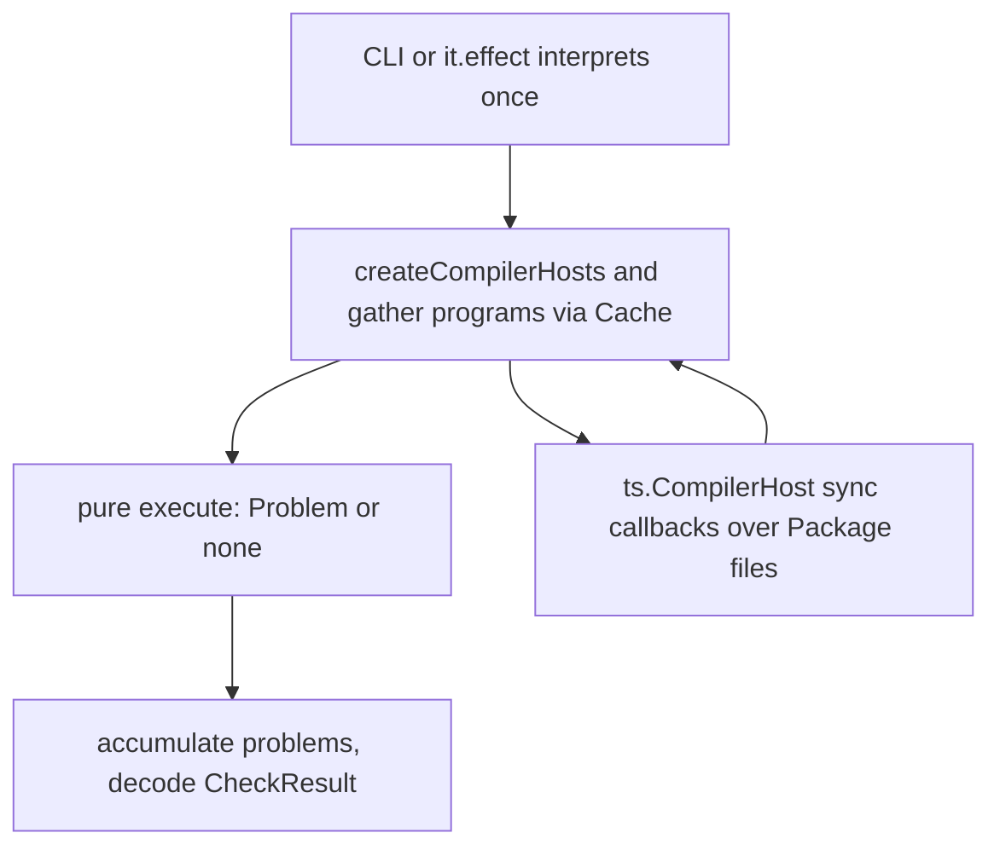

# ATTW Core Effect-Native Pipeline - Plan

## Goal Capsule

- **Objective:** Make `@systemfsoftware/arethetypeswrong-core` an Effect library on its public surface. Program construction is cached by Effect `Cache`. Domain decisions stay pure. `lru-cache` is gone. `Effect.runSync` is gone. Analysis output is unchanged.
- **Authority:** Constitution Articles I–II over this plan. Leaf `packages/testing/type-testing/arethetypeswrong/AGENTS.md` over cell-lint and mutation-gate questions. This plan over sequencing.
- **Stop:** Any `Effect.runSync` under `packages/testing/type-testing/arethetypeswrong/`, or a snapshot fixture that changes without a named analysis-behavior change.
- **Execution profile:** Standard refactor. Characterization first: existing snapshot fixtures pin output before the host class is deleted.
- **Tail:** `ce-work` owns implement, simplify, review, commit, PR, watch-to-green.

---

## Product Contract

### Summary

The package currently wears an Effect skin (`CheckPackage` service) over an imperative core (`async checkPackage` plus a class that constructs TypeScript programs). That hybrid is the defect. The published analysis becomes a lazy Effect. The TypeScript compiler-host callbacks stay synchronous because TypeScript calls them reentrantly from `createProgram`. Everything that _calls_ those callbacks is Effect.

### Problem Frame

`lru-cache` was a third-party LRU sitting inside `CompilerHostWrapper`. Replacing it with `Effect.runSync(Cache.make)` / `Effect.runSync(Cache.get)` inside a class method put an interpretation edge in the middle of the call chain. That is the same hybrid with a different store. A consumer who installs the package still sees a Promise-returning `checkPackage` and still pulls imperative construction through an `Effect.tryPromise` bridge in `CheckPackageExecutor`.

### Key Decisions

- **No `Effect.runSync` in delivered attw source.** (session-settled: user-directed — chosen over a `runSync`-in-class hybrid: interpretation belongs at the process edge.) Governs R2, R6.
- **The public analysis is an Effect, not a Promise.** (session-settled: user-directed — chosen over keeping `checkPackage: Promise<CheckResult>`: CONST-B2 forbids an eager async result on the public surface.) Governs R3.
- **Constitution decides the HOW.** (session-settled: user-directed — chosen over the user picking gather-vs-Effect-execute, lazy checkers, or converting `Package`: they asked for the constitutionally compliant design.) Governs R4, R5, R7, R8.

### Requirements

**Surface**

- R1. The core package does not depend on `lru-cache`.
- R2. No file under `packages/testing/type-testing/arethetypeswrong/` contains `runSync`.
- R3. `checkPackage` returns a lazy `Effect<CheckResult, Error>` and is not wrapped in `Effect.tryPromise` by `CheckPackageExecutor`.

**Sandwich**

- R4. A check's verdict is a pure function of already-gathered data. It does not return an Effect and does not construct a TypeScript program.
- R5. Program construction and host construction are Effects. Their only cache is Effect `Cache`.
- R6. Interpretation (`Runtime.runPromise`, `NodeRuntime.runMain`, `@effect/vitest` `it.effect`) happens at the CLI or test edge, never inside the analysis modules.

**Seam**

- R7. `ts.CompilerHost` callbacks remain synchronous closures over the in-memory package files. They do not run an Effect.

**Preservation**

- R8. Snapshot fixtures under `packages/testing/type-testing/arethetypeswrong/core/tests/__fixtures__/snapshots/` stay byte-identical.
- R9. `typescript` stays on the `attw` catalog pin. Do not move it to 7.

### Acceptance Examples

- AE1. Covers R8. Given the existing `semver@7.6.3` and `react@18.2.0` fixtures, when `checkPackage` runs as an Effect, then the decoded `CheckResult` matches the stored snapshot JSON.
- AE2. Covers R5. Given a host and three distinct root files, when the same auxiliary program is requested twice, then the second request returns the same `ts.Program` reference. After two further distinct keys fill capacity 2, the first key returns a different reference.
- AE3. Covers R2. Given the delivered tree, when the source is searched for `runSync`, then there are no hits under the attw packages.
- AE4. Covers R6. Given the delivered tree, when `packages/testing/type-testing/arethetypeswrong/core/src` is searched for `runPromise`, `runMain`, `it.effect`, or `NodeRuntime`, then there are no hits. Those names remain allowed in `cli/` and `tests/`.

### Success Criteria

- The CLI still consumes `CheckPackage.execute` as an Effect and needs no behavior change.
- `pnpm --filter @systemfsoftware/arethetypeswrong-core test` is green against the existing snapshots.
- A changeset names every publishable package whose turbo `build` hash moved.

### Scope Boundaries

- **In.** Core analysis pipeline: host construction, program cache, entrypoint info, check framework, `checkPackage`, executor, tests, lockfile, changeset. Delete the unused `createPackageFromNpm` / `createPackageFromTarballUrl` factories so `Package` stays a pure file map (CONST-S4).
- **Deferred for later.** Wiring `TypescriptAdapter` and the 2026-08-08 adapter architecture. That is a second rewrite, not this one.
- **Outside this product's identity.** Converting `Package` into an Effect service. It is a pure in-memory file map with one implementation (REPO-A2). The CLI is already Effect-native and is not rewritten. The TypeScript 6 JS bridge is not replaced.

### Actors

- A1. Adopter installing `@systemfsoftware/arethetypeswrong-core` — sees an Effect-returning `checkPackage` and no `lru-cache`.
- A2. CLI (`AttwExecutor`) — already yields `CheckPackage.execute`; stays that way.
- A3. Implementer — this plan.

---

## Planning Contract

### Key Technical Decisions

- KTD1. **Effect `Cache` with a canonical string key, capacity 2.** `Cache` stores keys in `MutableHashMap`, which matches by `Hash`/`Equal`. A fresh options object per auxiliary-program call would miss every time. Keep the existing `programKey` string (sorted `Object.entries`) and decode it in the lookup. Governs R5. (session-settled: user-directed — chosen over `lru-cache`: native Effect caching.)
- KTD2. **Optional `gather` on a check; `execute` stays pure.** CONST-P1 forbids returning an Effect from a decision. Five of seven checks never construct a program and stay untouched. `NamedExports` and `ExportDefaultDisagreement` gather programs as Effects, then decide. Governs R4.
- KTD3. **Prefetch both type-checkers after the cheap export-default guards.** CONST-B3: when a later read depends on an earlier decision, prefetch rather than interleave I/O through the decision. The ESM `externalModuleIndicator` bail still skips both programs. The per-host capacity-2 cache holds the impl+types pair. Governs R4, R5.
- KTD4. **Replace the host class with an Effect-constructed closure record.** Sync members (`getSourceFile`, `resolveModuleName`, …) stay plain functions. `createPrimaryProgram` / `createAuxiliaryProgram` return Effects and `yield*` `Cache.get`. Copy the current `ts.CompilerHost` object verbatim. Governs R5, R7.
- KTD5. **`createAuxiliaryProgram` resolution-override failure is a defect, not a typed error.** It is a programmer invariant (`changesAffectModuleResolution`), same as today. Use `Effect.dieMessage`. Throws from `ts.createProgram` stay defects. Governs R5.
- KTD6. **One interpretation edge.** `CheckPackageExecutor` yields `checkPackage` directly and maps defects to `Error('Analysis failed', { cause })` so the service error contract is unchanged. `initCjsLexer` is `Effect.tryPromise` inside `checkPackage`. Tests use `@effect/vitest` `it.effect`. Governs R3, R6.
- KTD7. **Replace in place. Do not land the unfinished adapter architecture.** CONST-S3: that architecture is a hypothetical future. Delete unused fetch factories (CONST-S4). Leave `Package` as data. Governs R8, R9.

### High-Level Technical Design

The sandwich, not a class-plus-bridge:

`ts.createProgram` calls the host callbacks reentrantly. Those callbacks read `#files` on `Package` and memoize `SourceFile`s in a plain `Map`. They model no impurity (REPO-A2). Putting `Runtime.runSync` or `Effect.async` inside them would be an interpretation edge in the middle, which R6 forbids.

### Assumptions

- Prefetching both export-default checkers after the cheap guards does not change snapshot output. If a later timing check on a many-entrypoint CJS package shows a real regression, restore laziness with a resumable `execute` that returns `{ needs: fileName }` and re-enters — do not put Effect accessors inside the boolean chains.
- The working tree already has uncommitted edits: `lru-cache` removed from `package.json` and `tsdown.config.ts`; `MultiCompilerHost.ts` already imports `Cache`/`Effect` and still calls `runSync`. Those `runSync` sites are deleted by U2. The lockfile still names `lru-cache` until U1.
- Leaf AGENTS.md still lists these packages as TOOLING in a `scripts/guards/check-lint-coverage.mjs` that does not exist in this tree. Treat that as a lint-baseline claim only. Do not add `stryker.config.json`.

### Sequencing

U1 then U2. U3 depends on U2. U4 depends on U2. U5 depends on U3 and U4. U6 depends on U5.

---

## Implementation Units

### U1. Drop the lockfile specifier

- **Goal:** The lockfile no longer names `lru-cache` as a direct dependency of the core package.
- **Requirements:** R1, R9
- **Dependencies:** none
- **Files:** `pnpm-lock.yaml`, `packages/testing/type-testing/arethetypeswrong/core/package.json`, `packages/testing/type-testing/arethetypeswrong/core/tsdown.config.ts`
- **Approach:**
  1. Confirm `lru-cache` is absent from the core manifest and from `deps.neverBundle`.
  2. Run `pnpm install --no-frozen-lockfile` from the repo root.
  3. Confirm the only lockfile change for this package is the dropped specifier. Transitive `lru-cache` entries for other packages stay.
- **Test scenarios:** Test expectation: none — lockfile/manifest only.
- **Verification:** Frozen install succeeds. `core/package.json` has no `lru-cache` key. `pnpm-workspace.yaml` `attw` catalog still pins `typescript` at `^6.0.3`.

### U2. Effect-constructed compiler host

- **Goal:** Delete `CompilerHostWrapper` and `TraceCollector`. Hosts are built by an Effect. Program construction is `Cache.get`.
- **Requirements:** R2, R5, R7
- **Dependencies:** U1
- **Files:**
  - `packages/testing/type-testing/arethetypeswrong/core/src/internal/MultiCompilerHost.ts`
  - `packages/testing/type-testing/arethetypeswrong/core/tests/compiler-host-cache.integration.test.ts` (create)
- **Approach:**
  1. Export a `CompilerHost` record: sync readers unchanged, `createPrimaryProgram` / `createAuxiliaryProgram` return `Effect<ts.Program>`.
  2. `createCompilerHosts(pkg)` returns `Effect<CompilerHosts>`.
  3. Build order inside the factory: sync memo state, then the `ts.CompilerHost` object (copy the current body), then `yield* Cache.make` with capacity 2. The lookup closes over the host and decodes `programKey` via `Object.fromEntries`. Do not key the cache on the options object — `createAuxiliaryProgram` spreads a fresh object every call, and `Equal.equals` then compares by reference.
  4. Rename every `CompilerHostWrapper` import. No alias.
  5. Resolution-override stays a defect (`Effect.dieMessage`).
- **Patterns to follow:** `packages/testing/mutation/stryker-js/cli/src/RunEventStreamAdapter.ts` — Effect `make` returning a record that mixes Effect methods with sync members.
- **Execution note:** Add the cache identity test before deleting the class, so eviction is pinned.
- **Test scenarios:**
  - Happy path: two `createAuxiliaryProgram` calls with the same root name return the same `ts.Program` reference.
  - Edge: three distinct keys at capacity 2 evict the least-recent; the first key's next request is a new reference.
  - Integration: load `tests/__fixtures__/fixtures/semver@7.6.3.tgz` via `createPackageFromTarballData` and run under `it.effect`.
- **Verification:** New test green. File has no `class` and no `runSync`.

### U3. Entrypoint info becomes an Effect

- **Goal:** The functions that construct a primary program return Effects. Pure readers stay pure.
- **Requirements:** R5
- **Dependencies:** U2
- **Files:** `packages/testing/type-testing/arethetypeswrong/core/src/internal/GetEntrypointInfo.ts`
- **Approach:**
  1. `getEntrypointInfo` and `getEntrypointResolution` return Effects because they call `createPrimaryProgram`.
  2. `getModuleKinds` and `getBuildTools` stay pure. They only call `getModuleKindForFile`.
  3. `resolveModuleName` call sites stay sync.
- **Test scenarios:** Test expectation: none on this unit — coverage is the existing entrypoint-info integration test after U6.
- **Verification:** Typecheck of this file against the new `CompilerHost` record.

### U4. Gather phase for the two program-building checks

- **Goal:** Checks that need a TypeScript program gather it as an Effect. Verdicts stay pure.
- **Requirements:** R4, R5
- **Dependencies:** U2
- **Files:**
  - `packages/testing/type-testing/arethetypeswrong/core/src/internal/DefineCheck.ts`
  - `packages/testing/type-testing/arethetypeswrong/core/src/internal/checks/NamedExports.ts`
  - `packages/testing/type-testing/arethetypeswrong/core/src/internal/checks/ExportDefaultDisagreement.ts`
- **Approach:**
  1. Add optional `gather` to `defineCheck`. Default `Gathered` is `undefined` so a two-parameter `execute` stays assignable. Leave the other five checks alone.
  2. `NamedExports`: move the node16-esm / CommonJS guards, host lookup, and the one `createAuxiliaryProgram` into `gather`. `execute` reads the gathered checker.
  3. `ExportDefaultDisagreement`: move the existing cheap guards (including `externalModuleIndicator`) plus both `createAuxiliaryProgram` calls into `gather`. Pass both checkers into `analyzeExportDefaultDisagreement` as data. Delete `getImplChecker` / `getTypesChecker`. Do not rewrite the short-circuit boolean chains — only replace those two accessors with field reads.
  4. Update the comments at the old lazy-checker sites so they no longer claim laziness the gather phase dropped.
- **Execution note:** Characterization is the existing snapshots (U6). Do not invent new example tests for the analysis logic.
- **Test scenarios:**
  - Happy path: a CJS types/impl pair that today reports `NamedExports` or `MissingExportEquals` still does, via snapshots.
  - Edge: an ESM implementation still bails before any program is built (the `externalModuleIndicator` guard stays in gather).
- **Verification:** Five untouched checks still typecheck against `AnyCheck`. The two edited checks construct programs only inside `gather`.

### U5. `checkPackage` is an Effect; the executor stops bridging

- **Goal:** The published analysis is a lazy Effect. The executor yields it.
- **Requirements:** R3, R6
- **Dependencies:** U3, U4
- **Files:**
  - `packages/testing/type-testing/arethetypeswrong/core/src/CheckPackage.ts`
  - `packages/testing/type-testing/arethetypeswrong/core/src/CheckPackageExecutor.ts`
- **Approach:**
  1. `checkPackage(pkg, options?)` returns `Effect<CheckResult, Error>`.
  2. Yield `createCompilerHosts` and `getEntrypointInfo`. Replace `await initCjsLexer()` with `Effect.tryPromise`, mapping failure to `Error('Analysis failed', { cause })`.
  3. Keep `visitResolutions` pure. Collect cells, then `Effect.forEach`. `gather` runs only on a dedup miss.
  4. In the executor, delete `Effect.tryPromise`. Yield `checkPackage(...)` and `catchAllDefect` to the same `Error('Analysis failed', { cause })` so the service type is unchanged. CLI needs no edit.
- **Test scenarios:**
  - Integration: `CheckPackageLive.execute` still returns a schema-decoded `CheckResult` (existing `check-package.integration.test.ts`).
  - Error path: a defect inside analysis still surfaces as `Error('Analysis failed')` on the service channel.
- **Verification:** Executor file has no `tryPromise`. CLI typecheck is clean.

### U6. Tests, dead fetch factories, changeset

- **Goal:** Tests drive Effects. Unreachable `fetch` factories are gone. Intent is recorded.
- **Requirements:** R1, R2, R3, R8
- **Dependencies:** U5
- **Files:**
  - `packages/testing/type-testing/arethetypeswrong/core/tests/entrypoint-info.integration.test.ts`
  - `packages/testing/type-testing/arethetypeswrong/core/tests/snapshots.integration.test.ts`
  - `packages/testing/type-testing/arethetypeswrong/core/src/CreatePackage.ts`
  - `.changeset/` (new intent)
- **Approach:**
  1. Replace `Effect.tryPromise({ try: () => checkPackage(...) })` with `yield* checkPackage(...)`.
  2. Do not regenerate snapshot JSON. A diff is a regression.
  3. Delete `createPackageFromNpm` and `createPackageFromTarballUrl` and every helper they solely own. They are not exported from `src/index.ts`.
  4. Add a `major` changeset for `@systemfsoftware/arethetypeswrong-core` (`checkPackage` is no longer a Promise), and for the CLI if its turbo build hash moved. Body: consumers no longer install `lru-cache`; they must run `checkPackage` as an Effect.
- **Test scenarios:**
  - Integration: every snapshot fixture still matches.
  - Edge: `knip:ci` does not report a leftover fetch helper.
- **Verification:** `grep -rn runSync packages/testing/type-testing/arethetypeswrong/` prints nothing. Core and CLI tests green.

---

## Verification Contract

| Gate                     | Command                                                                                                                     | Applies         | Done signal                 |
| ------------------------ | --------------------------------------------------------------------------------------------------------------------------- | --------------- | --------------------------- |
| Types                    | `pnpm --filter @systemfsoftware/arethetypeswrong-core typecheck`                                                            | After U2–U6     | exit 0                      |
| Core tests               | `pnpm --filter @systemfsoftware/arethetypeswrong-core test`                                                                 | After U6        | exit 0, snapshots unchanged |
| CLI                      | `pnpm --filter @systemfsoftware/arethetypeswrong-cli typecheck && pnpm --filter @systemfsoftware/arethetypeswrong-cli test` | After U5        | exit 0                      |
| No `runSync`             | search the attw tree for `runSync`                                                                                          | After last edit | zero hits (AE3)             |
| No interpret in core src | search `core/src` for `runPromise`, `runMain`, `it.effect`, `NodeRuntime`                                                   | After last edit | zero hits (AE4)             |
| attw typescript pin      | `catalogs.attw.typescript` in `pnpm-workspace.yaml`                                                                         | After U1        | still `^6.0.3`              |
| Local suite              | `pnpm check:local`                                                                                                          | After last edit | exit 0                      |
| Cache contract           | `compiler-host-cache.integration.test.ts`                                                                                   | U2              | AE2 holds                   |

Do not start a mutation run (REPO-D3). These packages have no `stryker.config.json`.

---

## Definition of Done

- R1–R9 hold.
- Every unit's test scenarios that apply have a green run in this session.
- Abandoned `runSync` hybrid and unused fetch factories are deleted, not aliased.
- Changeset names every publishable package whose build hash moved.
- Tree is restartable. PR watched to green is the shipping tail (`ce-work`).

---

## Appendix

### Working-tree residue

Uncommitted from the rejected hybrid: `MultiCompilerHost.ts` already imports `Cache`/`Effect` and still calls `runSync` at host construction and `getProgram`. U2 deletes both sites. Manifest already dropped `lru-cache`; lockfile has not.

### Sources

- `packages/testing/type-testing/arethetypeswrong/AGENTS.md` — TOOLING, no mutation gate, typescript `catalog:attw`
- `docs/solutions/tooling-decisions/arethetypeswrong-core-requires-js-typescript-api.md` — JS compiler API is the ceiling
- `docs/solutions/architecture-patterns/a-prohibition-must-close-transitively.md` — `runSync` search must cover the whole attw tree
- `docs/plans/2026-08-08-002-refactor-attw-effect-cli-plan.md` — adapter architecture, not this work
- `repos/effect/packages/effect/src/Cache.ts` — `Cache.make` / `Cache.get` are Effects; default TTL is infinity
- `repos/effect/packages/effect/src/MutableHashMap.ts` — key match is `Hash` then `Equal`
- Constitution CONST-P1, CONST-B2, CONST-B3, CONST-S3, CONST-S4, CONST-T5; REPO-A1, REPO-A2
