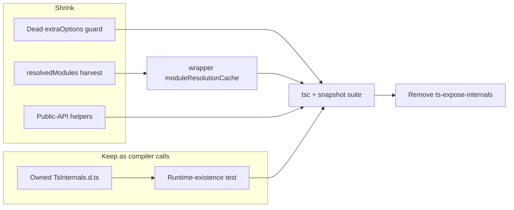

# refactor: remove ts-expose-internals from arethetypeswrong-core

## Goal Capsule

Drop the dead `ts-expose-internals` devDependency from `@systemfsoftware/arethetypeswrong-core` without changing analysis output.

The package still calls TypeScript compiler internals that exist on `typescript@6.0.3` at runtime and are absent from the public d.ts. Internals that have an exact public equivalent are replaced. The rest stay as compiler calls, declared in one owned file sized for the installed compiler, and a test fails when a declared member is missing from that compiler.

**Authority:** this plan. Product Contract over Implementation Units. Existing snapshot fixtures over any rewrite of reported problems. Repo `AGENTS.md` / `REPO-R3` for what a changeset may say.

**Stop when:** the dependency is gone, typecheck and tests pass with **no snapshot changes** (`git diff --exit-code` on the snapshot fixtures), and the new gate has been shown red on a known-bad **function** name then green after restore.

**Execution profile:** one package, characterization-first. Reset the dirty `MultiCompilerHost.ts` before any edit. Copy declaration text from the installed `ts-expose-internals` **before** uninstalling it.

**Tail:** implementer owns commit, changeset `--bump none`, PR, and `pnpm check:local` to green (`REPO-D1`).

---

## Product Contract

### Summary

Adopters of this package no longer pull a stale TypeScript-5.6 type-augmentation package. Analysis of a tarball still produces the same problems, traces, module-kind reasons, and positions as today.

### Problem Frame

`ts-expose-internals` is type-only: it republishes the compiler's entire `@internal` surface so attw-core can typecheck calls the public `typescript.d.ts` omits. Latest published version is 5.6.3 (2024-10-10). This package runs `typescript@6.0.3` via `catalog:attw`. The declarations describe a compiler the package does not run, and nothing verifies the difference.

Compiling the package with the augmentation off produces 107 errors across 11 files — functions, `SourceFile` state, `TypeChecker` methods, `bindSourceFile`, and `TypeFlags.Primitive`. No maintained package ships TS 6 internals (`ts-api-utils` covers three public-API wrappers; `tsserverlibrary.d.ts` in 6.0.3 is a 16-line re-export).

Vendoring the same augmentation locally is the same coupling with a smaller font. Rewriting the analysis onto public API only would change fidelity (`bindSourceFile`, `SourceFile.locals`/`symbol`, internal checker methods, and the `externalModuleIndicator` **node** used for reported `pos`/`end`).

### Requirements

- R1. `@systemfsoftware/arethetypeswrong-core` typechecks and builds with no `ts-expose-internals` dependency and with `compilerOptions.types` set to an empty list, not deleted.
- R2. Existing snapshot fixtures under `packages/testing/type-testing/arethetypeswrong/core/tests/__fixtures__/snapshots/` compare equal to live analysis. A snapshot diff is a defect, never something to re-record.
- R3. Internals that have no public 6.0.3 equivalent remain calls into the installed compiler, not reimplementations.
- R4. Every function declared in the owned internals file is asserted present as a function on the installed `typescript` object, with the name list derived from that file. Asserted instance members are `imports`, `path`, `scriptKind`, `symbol` after bind, and the three checker methods. Type-only names and `locals` / module-kind indicators are compile-checked, not runtime-gated. `TypeFlags.Primitive` equals the local public-flag union.
- R5. Published exports of the package do not change. `CompilerHostWrapper` stays unexported. The owned internals declaration file is not in the published tarball (`files` does not include it).

### Key Decisions

- **No-regression is the success signal** (session-settled: user-directed — chosen over a public-API-only rewrite: analysis output must not change). Governs R2, R3.
- **Do not vendor the whole ts-expose-internals surface as a local `declare module`** (session-settled: user-directed — chosen over the first approach: that is the same coupling). Governs R1, R3.
- **Keep irreducible compiler calls, typed locally and gated** (session-settled: user-approved — chosen over rewriting those checks onto public API only: reported positions and binder-derived exports have no public equivalent). Governs R3, R4.

### Success Criteria

Existing tests pass with zero snapshot edits. The new gate fails when one declared name is renamed to a symbol the compiler does not have, then passes after restore.

### Scope Boundaries

- In: attw-core dependency removal, public-API replacements, owned declarations, runtime-existence gate, docs that name the dependency, changeset `none`.
- Out: moving this package to TypeScript 7; rewriting the analysis engine onto public API only; adding `ts-api-utils` or any new runtime dependency.
- Deferred: regenerating declarations from a TypeScript source checkout (`hereby dts`) if a future compiler bump makes hand-maintenance heavy.

### Sources

- `docs/solutions/tooling-decisions/arethetypeswrong-core-requires-js-typescript-api.md` — 6-bridge ceiling; named internals; snapshot version-string note.
- `docs/solutions/build-errors/stale-api-report-outlives-toolchain.md` — a verdict must not outlive the toolchain that earned it; grounds R4.
- `packages/testing/type-testing/arethetypeswrong/core` — package under change.
- Software-wiki query (lex+vec+hyde, intent: typing compiler `@internal` APIs after dropping `ts-expose-internals`) returned no settled answer. Collection: software-wiki.

Product Contract unchanged from the confirmed scoping synthesis (ce-plan-bootstrap; no upstream brainstorm).

---

## Planning Contract

### Key Technical Decisions

- KTD1. Replace only internals that compose from public 6.0.3 API (`isPropertyAccessExpression` / `isElementAccessExpression`, `isParenthesizedExpression`, `isStringLiteralLike` / `isNumericLiteral`, `isFunctionExpression` / `isArrowFunction`, `isBlock` + `isFunctionLike`, `canHaveModifiers` + `getModifiers`, `getSignaturesOfType`). Keep path utilities, binder, package-scope lookup, `SourceFile` state, and the three checker methods as compiler calls. (session-settled: user-approved — chosen over public-API-only: fidelity.) Instantiates R3.
- KTD2. Serve `getResolvedModule` from the wrapper's own `moduleResolutionCache`, keyed the same way `getTrace` already is. Delete `Program.resolvedModules` harvesting and `createModeAwareCache`. Delete the unused `createAuxiliaryProgram(extraOptions)` guard (`changesAffectModuleResolution`); all three callers pass one argument. Instantiates R3, R5.
- KTD3. Copy remaining declarations verbatim from the installed `ts-expose-internals@5.6.3` `typescript.d.ts` **before** uninstall. That text already typechecks against 6.0.3. Do not declare members U1 removes. Instantiates R1, R3.
- KTD4. Keep `"types": []` in the package tsconfig. The base `@systemfsoftware/tsconfig/tsc/dom/library-monorepo` declares no `types`; deleting the key would auto-include every `@types/*` and change the compile environment. Instantiates R1.
- KTD5. Changeset `--bump none`. No exported name, type, or consumer-visible behaviour changes. Instantiates R5.
- KTD6. Gate names are parsed from the declaration file, not a second list. Instance members are probed on objects from `createTestPackage` + `createCompilerHosts` + `createPrimaryProgram`. Instantiates R4. Follows `stale-api-report-outlives-toolchain`.

### High-Level Technical Design

U1 and U2 can proceed in parallel after the dirty-tree reset. U3 must finish before U5 (declaration source vanishes on uninstall). U4 needs U2's flag union and U3's file.

### Assumptions

- Cache write key `containingFile` matches `sourceFile.fileName` on current fixtures. If U1 throws `Expected resolution for ...`, normalise both write and read through the wrapper's existing `toPath` rather than reverting.
- Copied 5.6.3 declaration text remains assignable to 6.0.3 public types for the members listed in U3. Typecheck is the proof.
- Flow analysis was done in-session, not by an independent spec-flow agent.

### Implementation Constraints

- Reset `packages/testing/type-testing/arethetypeswrong/core/src/internal/MultiCompilerHost.ts` to HEAD before editing. The working tree may hold an abandoned `declare module` from planning.
- Do not add runtime dependencies.
- `tsconfig.test.json` in this package is stale (`include: test` vs `tests/`) and is not the vitest path; do not extend it.
- Leaf `AGENTS.md` still names `ts-expose-internals` as a devDependency — update it in U5 so the next session does not re-add the package.

---

## Implementation Units

### U1. Shrink the host: drop dead internals

**Goal:** Remove the unused resolution-affecting-options guard and stop reading `Program.resolvedModules`.

**Requirements:** R2, R3, R5

**Dependencies:** none (after dirty-tree reset)

**Files:**

- `packages/testing/type-testing/arethetypeswrong/core/src/internal/MultiCompilerHost.ts`

**Approach:**

1. Discard uncommitted edits on this file.
2. Collapse `createAuxiliaryProgram` to `getProgram(rootNames, this.compilerOptions)`. Callers in ExportDefaultDisagreement and NamedExports already pass one argument.
3. Delete the private `resolvedModules` field and the harvest loop in `createPrimaryProgram`.
4. Make `getResolvedModule` read `moduleResolutionCache[sourceFile.fileName]` with the same module key `getTrace` uses (`noDtsResolution` and `allowJs` unset). The compiler-host hook `resolveModuleNameLiterals` already writes that cache.

**Execution note:** Characterization-first. A cache-key miss throws `Expected resolution for '<specifier>' in <file>` from InternalResolutionError — do not swallow it.

**Patterns to follow:** existing `getTrace` / `getModuleKey` pairing in the same class.

**Test scenarios:**

- Happy path: existing InternalResolutionError fixtures still report the same traces and positions.
- Error path: if a fixture throws `Expected resolution for ...`, apply the `toPath` normalisation in Assumptions; do not weaken the throw.

**Verification:** package tests pass; no snapshot diff; `changesAffectModuleResolution`, `createModeAwareCache`, and `program.resolvedModules` have no remaining references in this package.

### U2. Public-API replacements

**Goal:** Stop calling internals that the public 6.0.3 API already expresses.

**Requirements:** R2, R3

**Dependencies:** none

**Files:**

- `packages/testing/type-testing/arethetypeswrong/core/src/internal/TsCompat.ts` (create)
- `packages/testing/type-testing/arethetypeswrong/core/src/internal/GetProbableExports.ts`
- `packages/testing/type-testing/arethetypeswrong/core/src/internal/checks/ExportDefaultDisagreement.ts`
- `packages/testing/type-testing/arethetypeswrong/core/src/internal/esm/EsmBindings.ts`

**Approach:**

1. Add a small helper module of compositions named in KTD1, plus `PrimitiveTypeFlags` as the public-flag union that equals `ts.TypeFlags.Primitive` (measured 12713980 on 6.0.3: Undefined, Null, Void, String, Number, BigInt, Boolean, ESSymbol, StringLiteral, NumberLiteral, BigIntLiteral, BooleanLiteral, UniqueESSymbol, EnumLiteral, Enum, TemplateLiteral, StringMapping). Type helpers with public `ts.AccessExpression` — do not redeclare that alias.
2. Rewrite call sites: access-expression / skip-parentheses / string-or-numeric / function-or-arrow in GetProbableExports; those plus function-block, call-or-construct signatures, and Primitive in ExportDefaultDisagreement; `hasSyntacticModifier` → modifier-kind check in EsmBindings (receivers already admit `canHaveModifiers`).
3. Both GetProbableExports and ExportDefaultDisagreement already define a **local** `getNameOfAccessExpression` that returns `string | undefined` and calls `ts.getNameOfAccessExpression` inside. Keep those wrappers (they own the `=== 'exports'` / `=== 'default'` contract). Replace only the inner `ts.getNameOfAccessExpression(...)` with a distinctly named helper (e.g. `accessExpressionNameNode`) that returns the public name node. Do not import a symbol named `getNameOfAccessExpression`.
4. Confirm each `typeHasCallOrConstructSignatures` site: the internal form is a checker method; the helper takes the checker first.

**Execution note:** Snapshot suite is the fidelity gate. Do not re-record.

**Patterns to follow:** colocated internal helpers; import with the package's `.js` specifier convention.

**Test scenarios:**

- Happy path: ExportDefaultDisagreement and NamedExports / ESM-binding fixtures unchanged.
- Edge: `skipParentheses` only unwraps `ParenthesizedExpression`; no call site passes the compiler's JSDoc-assertion flag.

**Verification:** package tests pass with no snapshot diff; those `ts.*` internal names no longer appear at the rewritten sites.

### U3. Owned internals declarations

**Goal:** Typecheck the remaining compiler-internal calls without the third-party package.

**Requirements:** R1, R3

**Dependencies:** U1 (so removed members are not declared)

**Files:**

- `packages/testing/type-testing/arethetypeswrong/core/TsInternals.d.ts` (create; next to `tsconfig.json`, not under `src/`, so `files: ["dist","src","LICENSE"]` does not publish it)
- `packages/testing/type-testing/arethetypeswrong/core/tsconfig.json` (add the file to `include`)
- `packages/testing/type-testing/arethetypeswrong/core/src/internal/checks/NamedExports.ts`

**Approach:**

1. While `ts-expose-internals` is still installed, copy every overload of: path/string helpers (`combinePaths`, `ensureTrailingDirectorySeparator`, `comparePathsCaseInsensitive`, `forEachAncestorDirectory`, `toPath`, `createGetCanonicalFileName`, `getAnyExtensionFromPath`, `hasTSFileExtension`, `hasJSFileExtension`, `isDeclarationFileName`, `pathIsRelative`, `getTypesPackageName`, `unmangleScopedPackageName`); `bindSourceFile`; package-scope (`getTemporaryModuleResolutionState`, `getPackageScopeForPath` and the types they name); `SourceFile` members `symbol`, `locals`, `imports`, `externalModuleIndicator`, `commonJsModuleIndicator`, `path`, `scriptKind`; `TypeChecker` members `resolveExternalModuleSymbol`, `getExportsAndPropertiesOfModule`, `getSymbolFlags`; and `CompilerOptions.noDtsResolution` (the host still reads `options.noDtsResolution`; without this declaration, `noPropertyAccessFromIndexSignature` fails typecheck).
2. Also copy supporting types the public d.ts lacks (`Comparison`, and `GetCanonicalFileName` if referenced). If `ModuleResolutionState` pulls further internals, keep only `host`, `compilerOptions`, and `packageJsonInfoCache`. Squash `PackageJsonInfoContents` to `{ packageJsonContent: { type?: string } }` — the only read is `.contents.packageJsonContent.type`; a verbatim copy names `PackageJsonPathFields` and `VersionPaths`, which are neither public nor on this list.
3. Copy `SourceFile` optionality exactly. Do not declare `Program.resolvedModules`, `createModeAwareCache`, or `changesAffectModuleResolution`.
4. Do **not** delete the `@ts-expect-error` on `getSymbolFlags` in NamedExports. The copied 5.6.3 declaration is one-parameter; the call site passes `excludeTypeOnlyMeanings`. Either keep the suppression or extend the copied signature to `(symbol, excludeTypeOnlyMeanings?: boolean)`. The 6.0.3 runtime accepts the extra argument.
5. Add the new file to `tsconfig.json` `include` so typecheck loads it. Do not put it under `src/`.

**Test scenarios:**

- Test expectation: none for new behaviour — U4 owns the existence gate. Completeness is `tsc --noEmit` exiting 0.

**Verification:** `pnpm --filter @systemfsoftware/arethetypeswrong-core typecheck` exits 0 before U5.

### U4. Runtime-existence gate

**Goal:** Fail when a declared internal is missing from the installed compiler.

**Requirements:** R4

**Dependencies:** U2, U3

**Files:**

- `packages/testing/type-testing/arethetypeswrong/core/tests/compiler-internals.integration.test.ts` (create)
- `packages/testing/type-testing/arethetypeswrong/core/tests/__fixtures__/Utils.ts` (reuse `createTestPackage`)

**Approach:**

1. Follow `tests/entrypoint-info.integration.test.ts`: `makeFeature` / `scenario` from `@systemfsoftware/effect-gherkin-spec`.
2. Parse `function` names from `TsInternals.d.ts` at the package root (one `function Name` per line) and assert each is a function on `typescript`.
3. Build a two-file package, create hosts, run `createPrimaryProgram`, and assert `'imports' in sourceFile`, `'path' in sourceFile`, `'scriptKind' in sourceFile`; assert the three checker methods are functions; call `bindSourceFile` and assert `symbol` becomes defined.
4. Assert `ts.TypeFlags.Primitive === PrimitiveTypeFlags`.

**Execution note:** Before trusting the gate, rename one declared function, require the test to fail naming that symbol, restore, require pass.

**Test scenarios:**

- Happy path: every declared function exists on the installed compiler; instance members exist on a real program.
- Failure path: a declared name absent from the compiler fails the test (proven once by the rename drill).
- Edge: `PrimitiveTypeFlags` matches `ts.TypeFlags.Primitive` on 6.0.3.

**Verification:** the rename drill has been run; the restored suite includes this file and passes.

### U5. Delete the dependency and its traces

**Goal:** The package no longer depends on or names `ts-expose-internals`.

**Requirements:** R1, R5

**Dependencies:** U3

**Files:**

- `packages/testing/type-testing/arethetypeswrong/core/package.json`
- `packages/testing/type-testing/arethetypeswrong/core/tsconfig.json`
- `packages/testing/type-testing/arethetypeswrong/core/README.md`
- `packages/testing/type-testing/arethetypeswrong/AGENTS.md`
- `docs/solutions/tooling-decisions/arethetypeswrong-core-requires-js-typescript-api.md`
- `pnpm-lock.yaml`
- `.changeset/` (new `none` intent)

**Approach:**

1. Remove the devDependency. Set `"types": []` (KTD4). `pnpm install --no-frozen-lockfile` from the repo root.
2. Update the three docs so they still record the 6-bridge decision and no longer claim `ts-expose-internals` is a live dependency.
3. Changeset `--bump none` for `@systemfsoftware/arethetypeswrong-core`. Body names only what an adopter observes: the package no longer depends on `ts-expose-internals`. No module paths, test counts, or verification lines (`REPO-R3`).

**Test expectation:** none — removal is proven by lockfile + typecheck + `git grep`.

**Verification:** `git grep -nI ts-expose-internals -- . ':!pnpm-lock.yaml' ':!docs/plans'` prints nothing (read stdout; git grep exits 1 when clean). Build and `attw` on this package exit 0.

---

## Verification Contract

From repo root, after the last edit:

1. `pnpm --filter @systemfsoftware/arethetypeswrong-core typecheck` exits 0.
2. `pnpm --filter @systemfsoftware/arethetypeswrong-core test` exits 0, **and** `git diff --exit-code -- packages/testing/type-testing/arethetypeswrong/core/tests/__fixtures__/snapshots/` exits 0. A snapshot rewrite is a defect even if tests then pass.
3. U4 rename drill has been performed in this session.
4. `pnpm --filter @systemfsoftware/arethetypeswrong-core build` and `pnpm --filter @systemfsoftware/arethetypeswrong-core attw` exit 0.
5. `git grep` as in U5 is clean.
6. `pnpm check:local` exits 0, then PR checks watched to green.

---

## Definition of Done

- Global: R1–R5 hold; Verification Contract commands have been run in this session; abandoned `declare module` planning edit is gone; no dead helpers left from unused approaches.
- U1: host no longer references the three deleted internals; snapshots unchanged.
- U2: TsCompat exists; rewritten sites compile; snapshots unchanged.
- U3: TsInternals.d.ts covers the remaining members; NamedExports `@ts-expect-error` is gone; typecheck is green.
- U4: gate test exists and was shown red then green.
- U5: dependency, types entry, lockfile, docs, and changeset landed.

---

## Appendix

### Remaining compiler-internal surface after U1–U2

Path/string: `combinePaths`, `ensureTrailingDirectorySeparator`, `comparePathsCaseInsensitive`, `forEachAncestorDirectory`, `toPath`, `createGetCanonicalFileName`, `getAnyExtensionFromPath`, `hasTSFileExtension`, `hasJSFileExtension`, `isDeclarationFileName`, `pathIsRelative`, `getTypesPackageName`, `unmangleScopedPackageName`.

Binder / resolution: `bindSourceFile`, `getTemporaryModuleResolutionState`, `getPackageScopeForPath`.

`SourceFile`: `symbol`, `locals`, `imports`, `externalModuleIndicator`, `commonJsModuleIndicator`, `path`, `scriptKind`.

`TypeChecker`: `resolveExternalModuleSymbol`, `getExportsAndPropertiesOfModule`, `getSymbolFlags`.

### Why not ts-api-utils

Latest 2.5.0 wraps the public API only. It names `isAccessExpression` and equivalents for two other predicates. It does not cover path utilities, binder, package-scope, or Program/SourceFile internals. Adding it would be a new dependency for work U2 does in a few local helpers.
