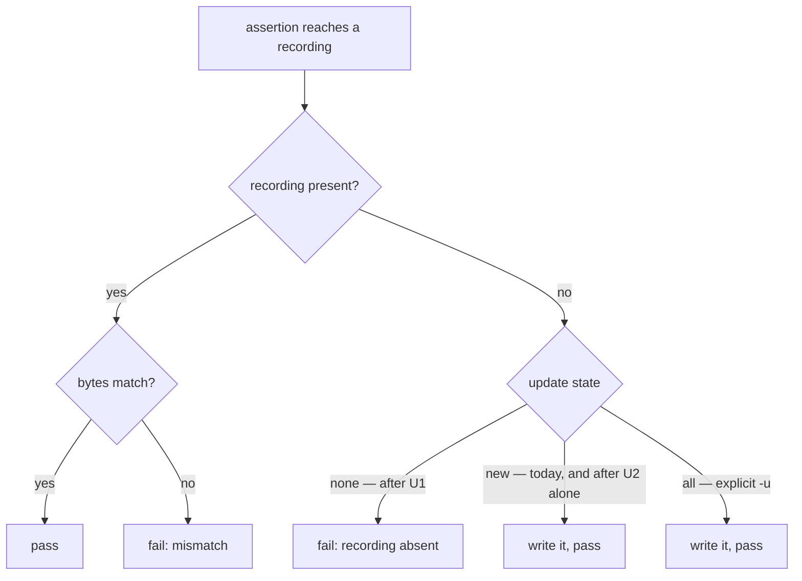

# feat: make snapshot recordings deliberate and retire the hand-rolled harness

## Goal Capsule

Make a snapshot recording in this repo something nobody can create by accident, and retire the one hand-rolled reimplementation of snapshot testing onto the runner's own mechanism.

The repo does not forbid snapshot assertions — nothing in the lint surface mentions them, and a snapshot matcher inside an existing `*.integration.test.ts` trips no rule today. What is missing is the part that makes a recording trustworthy at all: the runner sits at its default, which silently writes a missing recording and passes outside CI. One package hand-rolled the whole mechanism and reproduced that exact defect.

What this buys is precise and worth stating up front, because a bigger claim would be false: **minting a recording becomes a deliberate act that shows up in a diff.** It does not make the 55,891 lines of existing recordings reviewed, and nothing here claims it does — see Risks.

**Authority:** this plan. Product Contract over Implementation Units. `CONCEPTS.md:362` (a suffix describes a file and never scopes a check) over any convenience of adding one. The 36 existing recordings over any rewrite of their contents — they migrate byte-for-byte or the migration is wrong.

**Stop when:** deleting a recording fails the run on a machine with `CI` unset, the type-checking package asserts through the runner with `git diff --exit-code -- packages/testing/type-testing/arethetypeswrong/core/tests/__fixtures__/snapshots/` clean, and `pnpm check:local` exits 0 after the last edit.

**Execution profile:** **U2 lands before U1** — see KTD7, this ordering is load-bearing and not a preference. U1 is an Evaluator surface: its own commit, observed red before green. U3 follows U2. U4 and U5 are doctrine and independent.

**Tail:** implementer owns commits, PR, and `gh pr checks --watch --fail-fast` to green (`REPO-D1`, `REPO-D2`).

---

## Product Contract

### Summary

Creating or refreshing a snapshot recording stops being something that can happen silently. A recording that is absent fails the run instead of writing itself, and refreshing one requires explicitly asking the runner to. The type-checking package stops carrying its own private snapshot machinery and asserts through the runner instead, with all 36 recorded analyses unchanged.

The contents of those 36 recordings — 55,891 lines — remain reviewed by nobody. That is unchanged by this work and tracked as open debt in Risks.

### Problem Frame

Snapshot testing is unavailable here in the way that matters. Three things are true and only the first is widely believed:

**Nothing blocks it.** No lint rule names a snapshot matcher. `no-behaviourless-assertion` (`packages/lint/oxlint/plugins/testing/test-hygiene/src/rules/no-behaviourless-assertion.ts:59,69`) keys on `TEST_FILE` and passes any assertion whose subject derives from behaviour. `packages/testing/type-testing/arethetypeswrong/core/tests/snapshots.integration.test.ts` is currently lint-clean under the full rule set (`pnpm exec oxlint`, exit 0, zero findings), already imports `expect` from vitest, and already satisfies the three `behaviour-*` rules that key on `INTEGRATION_SUFFIX`.

**Nothing configures it.** `packages/toolchain/vitest-config/lib/base.js` sets no snapshot options. Vitest 4.1.10 therefore resolves `updateSnapshot` from its own detection: `vitest/dist/chunks/coverage.DM_a_rWm.js:365-369` yields `none` when std-env reports CI, and `new` otherwise. Under `new`, `@vitest/snapshot/dist/index.js:685` writes a missing recording and the assertion passes. Every local and agent run is therefore a run in which a recording can appear, go green, and be committed with no human ever having read the value it pins.

**One package built it privately, and worse.** `tests/snapshots.integration.test.ts:72-75` writes the recording and returns _without asserting_ when the file is absent. Deleting a golden makes the suite green. It carries a bespoke `UPDATE_SNAPSHOTS`/`U` and `TEST_FILTER`/`T` environment protocol and a `.mjs` file-IO helper to do it. Because that branch never consults Vitest's update state, no runner configuration can fix it — only replacing it can.

The prior removal of a snapshot kind is often read as a rejection of the technique. It was not. Commit `1c9e790348a` ("deps(repo)!: bump fast-check to v4, drop snapshot test kind") states its own reason: pure-rand's seed stream changed with the major, so `bounded-union.snapshot.test.ts` — which snapshotted `fc.sample(..., { seed: 1 })` output — was deterministically stale. What that commit rejected is pinning a dependency's RNG value stream. `SNAPSHOT_SUFFIX` and the `snapshot-test-requires-snapshot` rule were removed alongside it as collateral.

### Requirements

**Deliberate recordings**

- R1. A recording that is absent fails the run, in every run class, rather than being written and passed.
- R2. Creating or refreshing a recording requires explicitly telling the runner to update; no implicit path produces one.
- R3. The explicit update path works and is discoverable from the failure itself, not only from doctrine — a reader who hits the wall learns the way through it there.
- R4. A recording file that no assertion reaches is reported by the suite. Vitest's own obsolete-snapshot detection does not cover this case for file snapshots (KTD3), so this requirement is met by an explicit reconciliation in the suite, not by the runner.

**Retiring the private reimplementation**

- R5. The type-checking package's 36 recorded analyses are asserted by the runner's snapshot mechanism, not by package-local file reads and writes.
- R6. All 36 recordings survive the migration byte-for-byte, at their current paths and filenames.
- R7. The `UPDATE_SNAPSHOTS`/`U` and `TEST_FILTER`/`T` environment protocol is gone, along with the write path that made a missing recording pass.

**Doctrine**

- R8. Doctrine names the kind, states what may be recorded and what may not, states where such a test may live, and names the gate for each part.
- R9. The project vocabulary no longer asserts suffix facts that the tree falsifies.

### Key Decisions

- **No new test-kind suffix.** Governs R5, R8. `CONCEPTS.md:362` rules that a suffix describes a file and never scopes a check; the only job a snapshot suffix would do is scope the `behaviour-*` rules away from snapshot files, which is precisely the scoping the ruling forbids. See KTD1 for the boundary this imposes and what it costs.
- **The recordings are not made reviewable by this work.** Governs R6. Their size is more than an order of magnitude past the point at which the canon says review stops happening; see Risks.

### Success Criteria

- Deleting any one of the 36 recordings makes `pnpm --filter @systemfsoftware/arethetypeswrong-core test` fail, on a developer machine with no CI variable set. This is the single observation that separates the after-state from the before-state, and it is only true once **both** U2 and U1 have landed.
- The migration's diff touches test machinery only: `git diff --exit-code -- packages/testing/type-testing/arethetypeswrong/core/tests/__fixtures__/snapshots/` is clean.

### Scope Boundaries

#### Deferred to follow-up work

The census of hand-rolled expected-value comparisons found one true migration target. Every other candidate is listed here with the reason it is not converted, so a later reader does not re-litigate them.

| Site                                                                                                        | What it pins                                         | Why it is not a snapshot                                                                                                                                                                                                                                                      |
| ----------------------------------------------------------------------------------------------------------- | ---------------------------------------------------- | ----------------------------------------------------------------------------------------------------------------------------------------------------------------------------------------------------------------------------------------------------------------------------- |
| `packages/lint/oxlint/plugins/**/src/rules/__tests__/*.test.ts` (24+ RuleTester suites)                     | Exact `errors`/`output` strings per rule             | The expected text is the rule's contract with its user. Replacing a named literal with an opaque recording removes the one place a reviewer reads what the rule says. Jest's own docs put the aim of snapshots as additional value, never replacement of explicit assertions. |
| `packages/core/effect/cell/types/tests/interpreter.integration.test.ts`                                     | Hand-written expected phase names and ordering       | An **Independent oracle** (`CONCEPTS.md`) — a deliberate restatement kept so the fold has something to disagree with. Recording it from the fold destroys the disagreement and makes the check tautological.                                                                  |
| `packages/core/effect/daemon-spec/tests/schema-refutation-model.integration.test.ts`                        | `RECORDED_MODEL` obligation and blind counts         | Same oracle argument. The literal is the independent statement; a recording derived from `scanObligations` cannot refute `scanObligations`.                                                                                                                                   |
| `packages/lint/oxlint/plugins/cells/effect-workflow/src/rules/__tests__/make-boundary-kernel-drift.test.ts` | Byte identity between a vendored copy and its source | Already a **Drift gate**, whose remedy is regeneration. A snapshot would add a third copy to keep in sync.                                                                                                                                                                    |
| `packages/**/etc/*.api.md` via api-extractor                                                                | Public type surface                                  | Already a drift gate with its own regeneration command and its own turbo task. Converting it changes nothing and loses `api:check`.                                                                                                                                           |
| `packages/testing/type-testing/arethetypeswrong/cli/tests/cli-contract.integration.test.ts`                 | Live CLI stdout via targeted regex                   | Deliberately narrow assertions over a 30-tarball fixture set. Issue #72 already tracks its 173s runtime; widening it into full-output recordings makes both the runtime and the review burden worse.                                                                          |
| `agent-plugins/oxlint-guard/src/guard-*.test.ts`                                                            | Exact stderr substrings an agent receives            | The substring _is_ the contract with the agent reading it. Same argument as the RuleTester row.                                                                                                                                                                               |

Also deferred, with its trigger named so it is a debt rather than a description:

- **Narrowing the two largest recordings** (`@apollo__client-3.7.16.tgz.json` at 14,956 lines, `postcss@8.4.21.tgz.json` at 9,461) into targeted assertions. This needs its own tracked issue, opened by the implementer alongside this work and cited here, mirroring how Issue #72 carries the CLI-suite runtime. The forcing event is the next deliberate TypeScript major migration, which regenerates every recording (see Risks) and will otherwise land as an unread five-figure diff.
- `dprint.json:24` excludes `**/snapshots/*.md`, but `repos/**` on line 22 already excludes the only files that match. Dead config, unrelated to this change.

#### Outside this work

- Adding snapshot coverage to code that has none today. This plan makes recording deliberate and retires one reimplementation; it does not go looking for new places to record.
- Any change to the property-test and mutation regime governing pure decisions.
- Removing `passWithNoTests: true` from the shared config. It is a real hazard (Risks) but predates this work and is not introduced by it.

---

## Planning Contract

### Key Technical Decisions

- KTD1. **No new test-kind suffix — and the boundary that imposes.** The obvious design, re-admitting `.snapshot.test.ts` and resurrecting `snapshot-test-requires-snapshot`, is wrong twice over. First, `CONCEPTS.md:362` forbids a suffix that scopes a check, and the deleted rule was the textbook label-routed defect: it fired only on files already named `*.snapshot.test.ts`, so an author writing a snapshot matcher in an integration test was never caught (`docs/solutions/architecture-patterns/label-routed-rules-are-unfalsifiable.md:8-14`). Second, admitting the suffix _for placement alone_ does not escape the ruling — the three `behaviour-*` rules key on `INTEGRATION_SUFFIX` (`path.config.ts:13`), so a file carrying a different suffix is outside them by construction. The suffix would function as a rename-to-opt-out from four rules, which is the escape `label-routed-rules-are-unfalsifiable.md:53` names as the defect.

  **The cost, stated plainly:** this admits snapshot recording only through the use-case lane. Outside `src/` the sole sanctioned suffix is `.integration.test.ts`, so a second author who wants to record a parser output or an internal helper must express it as a Gherkin behaviour test reaching package code, or not record it. That is a real narrowing and the plan does not pretend otherwise — it is the same constraint every other test outside `src/` already lives under, and U4 states it so the second author reads it rather than discovers it. The existing workload satisfies it: `snapshots.integration.test.ts` imports `makeFeature`, has exactly one `Feature(...)` statement, imports package code, and imports only `expect` from vitest — `RUNNER_NAMES` (`path.config.ts:43`) is `it`/`test`/`describe`, so that import is legal. Measured: `pnpm exec oxlint` on that file, exit 0, zero findings.

- KTD2. **Pin `update: 'none'` in the shared runner config rather than inheriting CI detection.** Governs R1, R2. Inheriting is nearly free — Vitest already resolves `none` under CI, so GitHub Actions already fails on a missing recording with no configuration. The gap it leaves is the whole problem: locally and under an agent the resolution is `new`, and a recording appears, passes, and gets committed unreviewed. Searls's warning that developers "nuke the snapshot and record a fresh passing one" is exactly this, and the repo has already lived it at `snapshots.integration.test.ts:72`. `update?: boolean | "all" | "new" | "none"` is a valid root config key (`reporters.d.DtoKVV2s.d.ts:2865`, default `false`, which is falsy and therefore falls through to CI detection). It is a `NonProjectOptions` key (`reporters.d.DtoKVV2s.d.ts:3572`) — root config only, which is exactly where `sharedConfig.test` is spread. The escape stays: a CLI `--update`/`-u` sets `resolved.update = true`, which wins over the config value and resolves to `all` (`coverage.DM_a_rWm.js:365`).

- KTD3. **`toMatchFileSnapshot`, not `toMatchSnapshot` — accepting that it forfeits obsolete detection.** Governs R5, R6, R4. `toMatchSnapshot` pools every assertion in a file into one `__snapshots__/<basename>.snap` under auto-generated keys, which would collapse 36 independently-named recordings into one 55,891-line file and discard the per-package filenames. `toMatchFileSnapshot(path)` takes a caller-chosen path and writes the received string **verbatim** — `@vitest/snapshot/dist/index.js:807` uses the string as-is when the value is a string, line 808 skips the extra-line-break wrapper, and line 819 compares without trimming. Passing the current `JSON.stringify(analysis, null, 2) + '\n'` reproduces today's bytes exactly, at today's paths. Missing-file semantics match `.snap`: `index.js:1106-1115` reads the file, gets `undefined` when absent, and hands the same `hasSnapshot: false` to the same reconcile path.

  **The forfeit:** Vitest's obsolete-snapshot failure (`test.DNmyFkvJ.js:4314-4318`) fires on `_uncheckedKeys`, which is initialized solely from `Object.keys(this._snapshotData)` — the `.snap` manifest (`index.js:530`). Raw file snapshots are pushed to `_rawSnapshots` instead (`index.js:623-627`), and `saveRawSnapshots` only overwrites, never prunes (`index.js:463-466`). So an orphaned recording — one whose fixture was deleted — is never read and never reported. `toMatchSnapshot` would give obsolete detection for free but costs the per-file naming and produces one unreadable pooled file. The naming is worth more; R4 recovers the orphan check explicitly in U2 instead of pretending the runner provides it.

- KTD4. **Delete `tests/__fixtures__/Snapshot.schema.ts` rather than keep it as a decode boundary.** Governs R5. It exists so the test decodes a recording "through one typed boundary instead of raw `any`", which mattered when the comparison was `toEqual` over parsed JSON. Under KTD3 the comparison is string-to-string and the decode contributes nothing to the assertion. It is also not an **Independent oracle** in the `CONCEPTS.md` sense: it is composed from `src/Analysis.schema.ts`, `src/Problem.schema.ts` and `src/Resolution.schema.ts`, so a change that moves both the analysis and its shape moves the schema too and it agrees. Keeping it would be a second statement of a fact the recording already carries (`CONST-S4`).

- KTD5. **Leave the kind out of `requireTestContribution`.** `packages/testing/mutation/stryker-js/mutation-run/src/config/fork-schema.schema.ts:16-18` defaults the gate to `.workflow.property.test.ts`, `.policy.property.test.ts`, `.kernel.property.test.ts`, matched by `endsWith`. Its own description states the reason: the gate "only applies to file classes the mutation operators can express". A characterization recording over a tarball analysis is not that class, and under KTD1 there is no new suffix to add anyway.

- KTD6. **The census's other sites stay as they are.** See Scope Boundaries. The opening framing was that snapshots could replace many ad-hoc tests; the census found one, and Jest's own documentation states the aim is "not to replace existing unit tests, but to provide additional value". Two independent lines reaching the same place.

- KTD7. **U2 lands before U1, and the ordering is load-bearing.** The natural reading is to pin the config first and migrate second. That produces a U1 commit whose evidence is impossible to observe: the only recordings in the repo are written by the hand-rolled branch at `snapshots.integration.test.ts:72-75`, which never consults Vitest's update state, so `update: 'none'` changes nothing about them. Deleting a recording would pass identically before and after U1, and `CONST-E4`'s red-then-green requirement could not be met. Migrating first puts the recordings on the runner's own path — where, under today's default `new`, a deleted recording still self-writes and passes. **U2 alone therefore does not fix the silent pass**; it relocates it onto a mechanism a config can reach. U1 then closes it, and the deletion probe goes red-then-green exactly across the U1 commit boundary, on the real mechanism, satisfying `CONST-E4` as written.

### High-Level Technical Design

The change is one configuration value plus one assertion swap. What is worth drawing is the decision the runner makes about a missing recording, because that decision is the whole product.

Today the hand-rolled harness hardcodes the `H` box regardless of environment. U2 puts it on the real decision, still landing on `H` outside CI. U1 moves the default to `G` and leaves `I` reachable only by explicit request.

### Assumptions

- **Ten first-party vitest configs do not spread `sharedConfig` at all** and will not receive `update: 'none'` from U1: `omp/packages/omp-utils`, `omp/plugins/omp-agent-discipline`, `omp/plugins/omp-claude-compat`, `packages/lint/oxlint/config`, `packages/lint/oxlint/plugins/cells/cell-vocabulary`, `packages/lint/oxlint/plugins/cells/effect-workflow`, `packages/lint/oxlint/plugins/effect/entrypoint`, `packages/lint/oxlint/plugins/testing/property-testing`, `packages/lint/oxlint/plugins/testing/test-placement`, `packages/testing/specs/gherkin/storybook`. Established by `git grep -Ln sharedConfig -- '**/vitest.config.ts'`. Three further hits under `packages/testing/mutation/stryker-js/vitest-runner/testResources/` are deliberately standalone runner fixtures and are correctly excluded. U1 owns closing this list; it is not an assumption the plan rests on but a defect it fixes.
- No publishable package's turbo `build` hash moves: `turbo.json:13-23` lists `src/**` and tsconfigs as build inputs, not `tests/**`, and `@systemfsoftware/vitest-config` is `private: true`. So `REPO-R2` asks for no changeset intent. The changeset workflow computes the hash verdict itself and is the arbiter.

---

## Implementation Units

Presented in dependency order. U-IDs are stable and are not renumbered by that ordering.

### U2. Assert the recorded analyses through the runner

- **Goal:** the 36 recordings are compared by the runner rather than by package-local file IO, and an orphaned recording is reported.
- **Requirements:** R4, R5, R6, R7.
- **Dependencies:** none. This lands first (KTD7).
- **Files:**
  - `packages/testing/type-testing/arethetypeswrong/core/tests/snapshots.integration.test.ts` — modify
- **Approach:**
  1. Replace the `Then` step body (lines 69-79) with a single `toMatchFileSnapshot` against the same recording path, passed the same serialization the file currently writes — `JSON.stringify(analysis, null, 2) + '\n'` — so the bytes on disk are unchanged.
  2. **The step body must return an Effect, not a Promise.** `tapStep` in `packages/testing/specs/gherkin/effect/src/DoNotation.ts:43-46` checks `Effect.isEffect(raw)` and otherwise falls through to `return Effect.succeed(scope)`, discarding the value — and `_then` is a `tapStep` (line 82). A `Then` body written as a plain `async` closure returning `Promise<void>` is therefore **silently dropped, asserting nothing**: the same silent-pass defect this unit exists to remove, wearing a Gherkin costume. Wrap the assertion in `Effect.tryPromise`, matching the shape the `When` step two lines above already uses.
  3. Pass the recording location as a **path string, not a `URL`.** The file currently addresses recordings as `new URL('./__fixtures__/snapshots/', import.meta.url)`, but `resolveRawPath` (`@vitest/snapshot/dist/manager.js:22`) branches on `isAbsolute(rawPath)` and otherwise resolves against the test file's directory — a `file://` URL string satisfies neither and resolves wrong. Use a path relative to the test file, and keep the existing `URL` form only where `readBytes` still needs it for the fixture tarballs.
  4. Add the orphan reconciliation R4 requires, since the runner does not provide it for file snapshots (KTD3): one scenario that lists the recordings directory and asserts the set matches the fixture set the suite drove. Without it, a recording whose fixture was deleted sits unread forever.
  5. Delete the `updateSnapshots` binding and its `UPDATE_SNAPSHOTS`/`U` reads (line 33), and the `fileExists`/`writeTextFile`/`parseJson`/`readTextFile` imports that only the deleted branch used.
  6. Drop `TEST_FILTER`/`T` (line 34) — `vitest -t` covers filtering, and the local protocol is one more thing a reader has to learn.
  7. Leave the `rejectedFixture` scenario (lines 84-101) untouched. It asserts a failure and has no recording.
- **Patterns to follow:** the file's existing Gherkin shape stays exactly as it is — `makeFeature`, one `Feature(...)`, `Given`/`When`/`Then`. That is what keeps the `behaviour-*` rules satisfied and is why no suffix or rule change is needed (KTD1).
- **Test scenarios:**
  - All 36 fixtures pass against their existing recordings with no `-u`.
  - `git diff --exit-code -- packages/testing/type-testing/arethetypeswrong/core/tests/__fixtures__/snapshots/` is clean after a full run. This is R6, and it is the assertion that the migration changed machinery and not data.
  - Corrupting one byte of a recording fails with a diff naming that fixture. **This is the scenario that proves the assertion is wired at all** — under today's default update state a _deleted_ recording still self-writes and passes, so corruption, not deletion, is what U2 can prove.
  - Adding a stray `.json` file to the recordings directory with no matching fixture fails the orphan reconciliation.
  - The malformed-tarball scenario still reports a failed analysis and still has no recording.
  - The suite reports 37 scenarios plus the reconciliation scenario; a fixture silently dropped from collection is the failure mode `passWithNoTests: true` would otherwise hide.
- **Verification:** `pnpm --filter @systemfsoftware/arethetypeswrong-core test` exits 0 and leaves the recordings byte-identical; the corruption probe and the orphan probe both fail as specified.

### U1. Pin the snapshot update state in the shared runner config

- **Goal:** a missing recording fails in every run class, and recording becomes an explicit act with a discoverable way through.
- **Requirements:** R1, R2, R3.
- **Dependencies:** U2 (KTD7 — without it this unit's evidence cannot be observed).
- **Files:**
  - `packages/toolchain/vitest-config/lib/base.js` — modify
  - the ten `vitest.config.ts` files named in Assumptions — modify
- **Approach:**
  1. Add `update: 'none'` to `sharedConfig.test`, beside the existing `passWithNoTests` and `testTimeout` keys.
  2. Comment the polarity, because it deliberately inverts the file's existing `isAgent` reasoning: for run thoroughness an agent run is a development run, but for recordings an agent is the actor least likely to review a value it just minted, so no run class gets the writing default.
  3. Do not branch on `isAgent` or `isCI`. A single unconditional value is what makes the local run and the CI run agree.
  4. Close the bypass. The ten configs listed in Assumptions import `defineConfig` straight from `vitest/config` and never touch `sharedConfig`, so they keep the writing default. Migrate each to spread `sharedConfig.test` while preserving its own `include`. Exclude the three `testResources/` runner fixtures deliberately.
  5. Name the off-ramp where it is hit. Vitest's missing-recording failure reads ``Snapshot `<key>` mismatched`` (`@vitest/snapshot/dist/index.js:1002`) and says nothing about `--update`, so a first-time author — and an agent, which cannot consult doctrine mid-run — has no pointer. Put the `-u` instruction in the comment beside the config value and in U4's doctrine entry, so it is reachable from the config a reader lands on.
- **Execution note:** this is an Evaluator surface. Land it in its own commit, and observe the gate red before green: with U2 already landed, delete one recording, watch the suite pass, apply this change, watch the same deletion fail.
- **Test scenarios:**
  - With one recording deleted and no CI variable set, the owning test fails naming the absent snapshot. Before this unit — but after U2 — the same deletion passes. Both halves observed.
  - The probe's failure count is exactly one, and the suite still reports its full scenario count in both halves. A probe that goes red because the file stopped being collected is a false positive; `passWithNoTests: true` (`base.js:25`) makes that reachable, so the count is what distinguishes the two.
  - With the same recording deleted and `--update` passed, the recording is rewritten and the suite passes.
  - With every recording present and unmodified, the suite passes and `git status --porcelain` reports no change under the recordings directory.
  - A package whose vitest config builds a `projects` array still resolves `none`; `packages/core/effect/atom/atom-react` is the case to check, because `update` is a root-only option.
  - Each of the ten migrated configs still collects the same test files it did before, verified by comparing reported test counts per package.
- **Verification:** the red-then-green observation above, both halves, on a machine with `CI` unset. Plus `git grep -Ln sharedConfig -- '**/vitest.config.ts'` returning only the three `testResources/` fixtures and vendored `repos/` paths.

### U3. Delete the machinery the migration made dead

- **Goal:** the package carries no private snapshot mechanism.
- **Requirements:** R7.
- **Dependencies:** U2.
- **Files:**
  - `packages/testing/type-testing/arethetypeswrong/core/tests/__fixtures__/Snapshot.schema.ts` — delete
  - `packages/testing/type-testing/arethetypeswrong/core/tests/__fixtures__/fixture-io.mjs` — modify
- **Approach:**
  1. Delete `Snapshot.schema.ts` per KTD4, and the `SnapshotRecordSchema` import and the now-unused `Schema` import from the test.
  2. Remove `writeTextFile`, `readTextFile`, `parseJson`, `fileExists` and `readEnv` from `fixture-io.mjs` if no other consumer remains; `listDirectory` and `readBytes` are still needed to enumerate fixtures and to feed the U2 orphan reconciliation. Check for other importers before deleting each export rather than assuming this test is the only one.
  3. If every remaining export is a one-line `node:fs` passthrough, note whether the helper still earns its own file — but do not fold it in the same commit as the deletions.
- **Test scenarios:** no behavioural scenarios; this unit removes code and adds none. `Test expectation: none -- deletion only; U2's scenarios cover the behaviour that must survive it.`
- **Verification:** `pnpm --filter @systemfsoftware/arethetypeswrong-core test` and `pnpm --filter @systemfsoftware/arethetypeswrong-core lint` both exit 0, and `git grep -nI -e SnapshotRecordSchema -e Snapshot.schema -- packages` prints no lines. There is no dead-file detector in this repo — `knip` appears only inside the vendored `repos/storybook` tree — so the deleted symbol is chased by grep and the unused import by oxlint, not by a tool that does not exist here.

### U4. Record the kind, its boundary, and its home in doctrine

- **Goal:** an author reaching for a snapshot learns what may be recorded, where such a test may live, and which gate decides.
- **Requirements:** R8.
- **Dependencies:** U1 (the gate must exist before doctrine names it).
- **Files:**
  - `CONSTITUTION-ARTICLES.md` — modify (Article III, beside CONST-T5)
  - `CONCEPTS.md` — modify (a new entry under `## Test execution`)
- **Approach:**
  1. Article III already carries the slot: CONST-T5 mandates characterization coverage "over real fixtures". Extend it, or add a sibling, stating that a recorded characterization is the mechanized form of that coverage and that its gate is the runner's update state — not a lint rule, because whether a recorded value was reviewed is a semantic property no depth-0 check can decide (`docs/solutions/architecture-patterns/what-a-filename-suffix-can-enforce.md:54`). Say which parts are gated and which are review-only; do not let the rule claim more than the gate decides.
  2. State the admissible subject narrowly, and ground it. Every vendored project that uses snapshots records a **generated artifact** — `repos/tsdown/tests/utils.ts:210-226` records build output through one helper, `repos/oxc/apps/oxfmt/test/cli/cli.test.ts:18` records CLI output, `repos/effect/packages/platform/node/test/HttpApi.test.ts:1293` records an emitted OpenAPI document — and never a value a human supplied. The inadmissible case is settled in this tree by commit `1c9e790348a`: a generator's value stream under a fixed seed pins a dependency's RNG, not a contract.
  3. **State where such a test lives, and that this is the only home.** Per KTD1 the kind is admitted through the use-case lane: outside `src/` the sanctioned suffix is `.integration.test.ts` and the `behaviour-*` rules apply, so a recording is expressed as a Gherkin behaviour test reaching package code. An author whose subject is not a use case has no home for a recording, and that is deliberate. Without this paragraph the second author discovers the constraint by tripping three lint rules.
  4. State the size rule and label its gate honestly: a recording past a few dozen lines is not reviewed in practice, so a new recording expected to exceed that is written as targeted assertions in the same change that creates it. Nothing mechanical enforces this — the gate is review, and saying so is the point.
  5. Name the `-u` off-ramp, so doctrine and the config comment agree.
  6. Add the `CONCEPTS.md` entry in the format the surrounding entries use: a bolded term as an `###` heading, then one dense paragraph defining it against its neighbours. Place it under `## Test execution` beside **Run class** and **Contract lane**.
- **Test scenarios:** doctrine only. `Test expectation: none -- prose; the gate it names is U1's, and U1 carries the red-then-green evidence.`
- **Verification:** every rule the edit adds names a gate that exists, and no sentence claims a property its named gate does not decide.

### U5. Correct the vocabulary claims the tree falsifies

- **Goal:** `CONCEPTS.md` stops asserting facts about suffixes that are not true of this repo.
- **Requirements:** R9.
- **Dependencies:** none.
- **Files:**
  - `CONCEPTS.md` — modify (the `### Cell` entry and the suffix line under `## Flagged ambiguities`)
- **Approach:**
  1. Line 171 reads "no rule keys on a filename, no config enumerates a sanctioned suffix set, and a file's name grants it nothing." The tree falsifies both clauses: `packages/lint/oxlint/plugins/testing/test-placement/src/rules/path.config.ts` enumerates a sanctioned suffix set (and `SANCTIONED_TEST_DIRS` on line 3 enumerates a directory set), and `test-suffix-outside-src.ts` keys on a filename.
  2. The retirement being described is real but narrower than the sentence — it retired the thirteen **cell-role** suffixes, not the test-kind suffixes, which are live. Scope the claim to what actually happened.
  3. Line 362's "a suffix therefore describes a file and never scopes a check" is falsified in the same direction: `behaviour-test-requires-gherkin`, `behaviour-exercises-use-case` and `behaviour-one-feature-per-file` all scope themselves on `INTEGRATION_SUFFIX`. Correct it to what is true and still load-bearing — that a suffix must not be _introduced_ to scope a check, which is the form KTD1 relies on — rather than deleting the ruling, which the plan depends on.
- **Execution note:** this corrects a Doctrine surface that the rest of the plan cites as authority. Land it separately from U4 so the correction is reviewable on its own terms.
- **Test scenarios:** doctrine only. `Test expectation: none -- the claim's falsifiers are the cited paths, quoted in the commit message.`
- **Verification:** each corrected sentence is true of the tree at the commit that lands it, checkable by opening the cited files.

---

## Verification Contract

| Gate                     | Command                                                                                                     | Applies to | Signal                                                                                                                                                                                        |
| ------------------------ | ----------------------------------------------------------------------------------------------------------- | ---------- | --------------------------------------------------------------------------------------------------------------------------------------------------------------------------------------------- |
| Corruption probe         | corrupt one byte of a recording, run the package suite, restore                                             | U2         | Fails naming the fixture — proves the assertion is wired.                                                                                                                                     |
| Orphan probe             | add a stray `.json` with no fixture, run, remove                                                            | U2         | Fails the reconciliation scenario.                                                                                                                                                            |
| Deletion probe           | delete one recording, run, restore — once after U2, once after U1                                           | U1         | Passes after U2 alone; fails after U1. Exactly one failing test, full scenario count in both halves. This is the plan's central claim.                                                        |
| Recording fidelity       | `git diff --exit-code -- packages/testing/type-testing/arethetypeswrong/core/tests/__fixtures__/snapshots/` | U2         | Exit 0 after a full run — the recordings did not move.                                                                                                                                        |
| Config reach             | `git grep -Ln sharedConfig -- '**/vitest.config.ts'`                                                        | U1         | Prints only the three `testResources/` fixtures and vendored `repos/` paths. A plain `pnpm test` cannot decide this: a package that never received the setting passes identically either way. |
| Package suite            | `pnpm --filter @systemfsoftware/arethetypeswrong-core test`                                                 | U2, U3     | Exit 0.                                                                                                                                                                                       |
| Package lint             | `pnpm --filter @systemfsoftware/arethetypeswrong-core lint`                                                 | U2, U3     | Exit 0 — confirms KTD1's claim that no rule change was needed.                                                                                                                                |
| Cross-package regression | `pnpm test`                                                                                                 | U1         | Exit 0 — the setting breaks no existing package. Proves absence of breakage only; the Config reach row proves reach.                                                                          |
| Full gate                | `pnpm check:local`                                                                                          | all        | Exit 0, run after the last edit (`REPO-D1`).                                                                                                                                                  |
| PR                       | `gh pr checks --watch --fail-fast`                                                                          | all        | Exit 0 (`REPO-D2`).                                                                                                                                                                           |

Do not start a mutation run (`REPO-D3`); `.claude/hooks/guard-local-mutation.ts` blocks it. Mutation is unaffected by design: `requireTestContribution` does not cover this file class (KTD5), and the runner already resolves `none` inside the CI-hosted sandbox, so a mutant that changes analysis output is killed by a mismatched recording rather than surviving a rewrite.

---

## Definition of Done

- [ ] After U2 and U1 have both landed, deleting any recording fails the run on a machine with `CI` unset; the same deletion passes with only U2 landed. Observed, both halves, in the implementing session.
- [ ] `git diff --exit-code -- packages/testing/type-testing/arethetypeswrong/core/tests/__fixtures__/snapshots/` is clean after a full suite run — all 36 recordings byte-identical.
- [ ] The `Then` step returns an Effect, not a bare Promise — verified by the corruption probe failing, which a discarded assertion could not do.
- [ ] `git grep -Ln sharedConfig -- '**/vitest.config.ts'` prints only the three `testResources/` fixtures and vendored paths.
- [ ] `UPDATE_SNAPSHOTS`, `U`, `TEST_FILTER` and `T` appear nowhere in the package; `git grep -nI -e UPDATE_SNAPSHOTS -e TEST_FILTER -- packages` prints no lines.
- [ ] `Snapshot.schema.ts` is deleted and nothing imports it; no forwarding shim, no commented-out block, no `renamed to` note (`DEL1`).
- [ ] Doctrine names the kind, its admissible subject, its only home, and the gate for each — and no sentence claims a property its gate does not decide.
- [ ] The corrected `CONCEPTS.md` sentences are true of the tree at their landing commit.
- [ ] U1 landed in its own commit, separate from every unit it judges (`CONST-E4`).
- [ ] A tracked issue exists for narrowing the two largest recordings, and the Scope Boundaries row cites it.
- [ ] `pnpm check:local` exits 0, run after the last edit.
- [ ] No abandoned-attempt code in the diff — no scratch recordings, no disabled tests, no half-migrated branch left beside the migrated one.

---

## Risks & Dependencies

- **The recordings remain unreviewable, and this work does not change that.** They total 55,891 lines across 36 files; the largest is 14,956 and the median is in the thousands. Dodds (2017) puts the maintenance cliff at "more than a few dozen lines" and his own unreviewable-snapshot anecdote was 640 lines — these are more than an order of magnitude past it, and Searls's warning that developers "nuke the snapshot and record a fresh passing one" applies with full force. What this plan buys is that nuking becomes _deliberate_ and _visible in a diff_, not that anyone reads the values. A `-u` regeneration committed as "regen recordings" is indistinguishable in review from a careful acceptance. This is why the Goal Capsule and Summary claim deliberateness rather than trust, and why the narrowing deferral carries a forcing event rather than a hope.
- **Recorded analyses embed the compiler version string.** `docs/solutions/tooling-decisions/arethetypeswrong-core-requires-js-typescript-api.md:36,44` records that resolution traces carry it, so a deliberate TypeScript major migration regenerates recordings by design. This is the `stale-api-report-outlives-toolchain.md` class: a committed expected value whose correctness depends on a toolchain that is not in its key. U1 improves the failure mode — the churn becomes a loud mismatch rather than a silent rewrite — but does not remove the coupling, and the gate cannot distinguish a toolchain-induced mismatch from a genuine behaviour change. Both read as "recording differs".
- **`update: 'none'` will surprise someone, and the runner does not help them.** The first author to write a new snapshot assertion gets a failure instead of a recording, and Vitest's message names the key but not `--update`. That is why U1 step 5 puts the off-ramp in the config comment and U4 puts it in doctrine — the failure text itself is not ours to change. This is the intended cost of KTD2, priced deliberately: a loud stop on a novel recording is the entire point.
- **`passWithNoTests: true` (`base.js:25`) still hides an uncollected test file.** Not introduced here and not fixed here, but it is why U1's probe asserts a failure count and a scenario count rather than only asserting red.

---

## Sources & Research

- Vitest 4.1.10, read in installed source: `@vitest/snapshot/dist/index.js` (write conditions 678-685, verbatim raw write 807-819, absent raw recording 1106-1115, obsolete-set initialization 530, raw-snapshot path 623-627, save-without-prune 463-466, mismatch message 1002), `@vitest/snapshot/dist/manager.js:16-22` (`resolveSnapshotPath` and `resolveRawPath` contracts), `vitest/dist/chunks/coverage.DM_a_rWm.js:365-369` (update-state resolution from std-env `isCI`), `vitest/dist/chunks/test.DNmyFkvJ.js:4314-4318` (obsolete recordings error only under `none`), `vitest/dist/chunks/reporters.d.DtoKVV2s.d.ts:2865,3572` (`update` config key and the root-only option set).
- This repo, read this session: `packages/testing/specs/gherkin/effect/src/DoNotation.ts:43-46,82` (`tapStep` discards a non-Effect return); `git grep -Ln sharedConfig -- '**/vitest.config.ts'` (the ten bypassing configs); `pnpm exec oxlint` on the existing snapshot suite (exit 0, zero findings).
- Prior art: commit `1c9e790348a` and its removed `snapshot-test-requires-snapshot.ts`, `snapshot-test-requires-snapshot.config.ts`, and `SNAPSHOT_SUFFIX` — recovered via `git show`, reason quoted from the commit message.
- Doctrine: `CONSTITUTION-ARTICLES.md` Article III (CONST-T1..T5) and CONST-N2 at 237-246; `CONCEPTS.md:171,362`; `docs/solutions/architecture-patterns/label-routed-rules-are-unfalsifiable.md`; `docs/solutions/architecture-patterns/what-a-filename-suffix-can-enforce.md`; `docs/solutions/build-errors/stale-api-report-outlives-toolchain.md:121`.
- Vendored practice (`REPO-W4`): `repos/tsdown/tests/utils.ts:210-226` and `repos/tsdown/AGENTS.md:246-248`; `repos/oxc/apps/oxfmt/test/cli/cli.test.ts:18` and `repos/oxc/.github/workflows/ci.yml:36-38,115`; `repos/effect/packages/platform/node/test/HttpApi.test.ts:1293`; `repos/storybook/docs/writing-tests/snapshot-testing.mdx`. `repos/typia` and `repos/clanka` use snapshots not at all. No vendored project gates a self-written recording inside its test job; oxc and tsdown catch it downstream with `git diff --exit-code` after regeneration.
- External canon: Jest snapshot documentation (the commit-and-review rule, the deterministic-tests rule, the CI non-write rule since Jest 20, and "the aim of snapshot testing is not to replace existing unit tests"); Kent C. Dodds, "Effective Snapshot Testing" (2017), quoting Justin Searls's four-point critique and the 640-line anecdote; Martin Fowler, "Contract Test" (2011), for the recorded-response stub that predates the technique.
