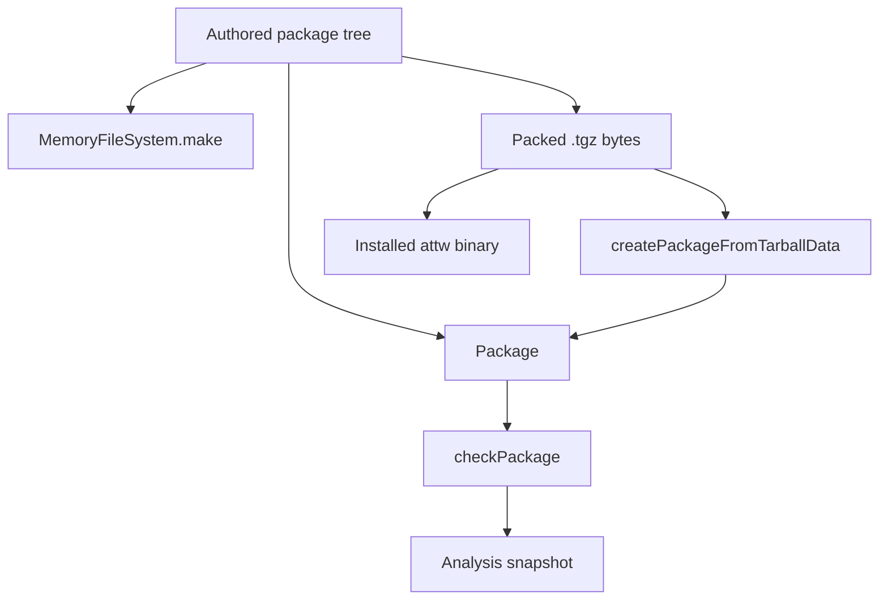

# ATTW In-Memory Fixture DSL - Plan

## Goal Capsule

- **Objective:** Publish a fixture language that constructs ATTW packages in memory so tests and adopters stop reading committed `.tgz` files.
- **Authority:** this plan; `AGENTS.md` REPO-S4 / REPO-A5 / REPO-R1; `CONCEPTS.md` (`attw`, known-bad fixture, Contract lane).
- **Stop:** every committed ATTW test tarball is gone; analysis and CLI contract tests consume authored trees; tarball extract remains one dedicated test; recipe kinds cover the old snapshot kind set.
- **Execution profile:** code. Promote the existing in-memory `Package` constructor; do not rewrite analysis onto Effect `FileSystem`.
- **Tail:** implementer owns review, changeset, PR.

---

## Product Contract

### Summary

`@systemfsoftware/arethetypeswrong-core` ships a declared constructor that builds a package file tree and a `Package` without gunzip or untar. Tests and adopters feed that `Package` to `checkPackage`. The same tree mounts on `@systemfsoftware/effect-memfs`. Production CLI still accepts real tarballs.

Product Contract preservation: new bootstrap. No upstream requirements file.

### Problem Frame

Snapshot and contract tests load opaque published archives from disk. The trees cannot be reviewed, diffed, or constructed in memory. `checkPackage` already accepts a `Package`; only the public construction path goes through `createPackageFromTarballData`.

### Key Decisions

- **Publish the constructor.** (session-settled: user-directed — chosen over a test-only helper: adopters construct packages the same way tests do.) Governs R1, R8.
- **Trees work with effect-memfs.** (session-settled: user-directed — chosen over disk-only fixture trees: tests must not need a real directory.) Governs R3.
- **Synthetic problem-class packages replace the published-package corpus.** (session-settled: user-approved — chosen over reconstructing vue/next/react: snapshot identities change; extract stays a small dedicated test.) Governs R4, R5, R6.
- **Every committed ATTW test tarball goes, including CLI copies.** (session-settled: user-approved — chosen over keeping a real-package archive set: CLI Contract lane packs trees at setup.) Governs R7.

### Requirements

**Construction**

- R1. A declared export on `@systemfsoftware/arethetypeswrong-core` builds a `Package` from an authored file tree and refuses a tree with no `package.json`.
- R2. Relative paths land under `/node_modules/<packageName>/`. Absolute paths must already use that prefix. Scoped names use `/node_modules/@scope/name/`. File bodies may be text or bytes.
- R3. The same tree converts to a value `MemoryFileSystem.make` accepts. Core does not depend on `@systemfsoftware/effect-memfs`.
- R4. Named recipes construct one synthetic package per `Problem` kind in `packages/testing/type-testing/arethetypeswrong/core/src/Types.ts`, plus a types-companion pair for `mergedWithTypes` and a known-bad tree that analysis rejects.

**Verification**

- R5. Core analysis tests call the constructor or a recipe. They do not read `tests/__fixtures__/fixtures/*.tgz`.
- R6. Analysis snapshots remain the recorded oracle. Their inputs are the recipes. Old `<published>@<version>.tgz.json` snapshots are deleted with the archives.
- R7. The CLI Contract lane still drives the installed binary against `.tgz` paths. Those bytes are packed from recipes at setup, not copied from git. `cli/tests/__fixtures__/fixtures/` is deleted.
- R8. `createPackageFromTarballData` stays. One dedicated test packs a constructor tree and asserts extract equals the in-memory `Package`. A second extract test feeds synthetic malformed gzip bytes constructed in the test, not a committed archive.
- R9. Before any fixture archive is deleted, the union of `Problem` kinds in the current snapshot JSON is a subset of the kinds the recipes produce. A kind the recipes cannot trigger is a blocked recipe: document the gap and construct that kind's bytes at test time from the closest recipe. Do not leave a committed archive.

### Actors

- A1. Adopter installing `@systemfsoftware/arethetypeswrong-core`.
- A2. Core test author.
- A3. CLI Contract lane (installed `attw` in a container).
- A4. Production CLI user (unchanged tarball / npm / pack paths).

### Key Flows

- F1. Adopter constructs a tree, builds a `Package`, runs `checkPackage`.
- F2. Adopter or test converts the tree and mounts `MemoryFileSystem.make`.
- F3. Recipe → `checkPackage` → snapshot file for that recipe.
- F4. Recipe → pack bytes → `createPackageFromTarballData` → same files as the in-memory `Package`.
- F5. Contract setup packs recipes into the container `WORKDIR/fixtures` and the installed binary reads those paths.

### Acceptance Examples

- AE1. Covers R1, R2. Given files `{ 'package.json': '{"name":"demo","version":"1.0.0"}', 'index.d.ts': 'export {}' }`. When the constructor runs with name `demo`. Then `Package.fileExists('/node_modules/demo/package.json')` is true and `checkPackage` returns an `Analysis`.
- AE2. Covers R1. Given a tree with no `package.json`. When the constructor runs. Then it throws.
- AE3. Covers R3. Given the AE1 tree. When converted and passed to `MemoryFileSystem.make`. Then `FileSystem` reads the `package.json` body.
- AE4. Covers R4, R6. Given the FalseCJS recipe. When analysed. Then the snapshot names `FalseCJS` and no other unexpected `Problem` kinds.
- AE5. Covers R8. Given a packed constructor tree. When extracted. Then file paths and UTF-8 bodies match the in-memory `Package`.
- AE6. Covers R7. Given the Contract lane after setup. When `attw` is invoked on a packed FalseCJS recipe. Then exit is non-zero and stdout matches `/FalseCJS/`.
- AE7. Covers R9. Given the current snapshot JSON files and the recipe set. When the kind-union comparison runs. Then every kind in the snapshots appears in at least one recipe analysis.

### Success Criteria

Requirements are the success criteria. The Contract lane remains the process-level proof that the installed binary still consumes tarball paths.

### Scope Boundaries

**In scope**

- Public constructor, tree type, memfs conversion, problem-class recipes, snapshot rewrite, CLI setup packing, deletion of both fixture tarball trees.

**Deferred for later**

- Hosting `checkPackage` on Effect `FileSystem`.
- Reconstructing real published packages in the DSL.

**Outside this product's identity**

- Changing analysis rules, resolution, or CLI flags.
- A4's production inputs (file `.tgz`, `from-npm`, `--pack`).

**Deferred to Follow-Up Work**

- Deduplicating `CreatePackage.extractTarball` and `TarballAdapter` extract (same gunzip/untar, two copies).

### Assumptions

- Wiki query `in-memory fixture tarball memfs package constructor DSL attw` (lex+vec+hyde, software-wiki) did not settle fixture construction. It did settle that consumer-reachable names must be declared `exports`.
- `Package` methods are enough for analysis. Memfs is a second consumer of the tree, not a new analysis host.
- Wiki query `public API surface semver fixture tarball pack known-bad` did not settle packing. Tree invariants belong on the published type.

---

## Planning Contract

### Key Technical Decisions

- KTD1. **Root export on core, not a new package.** Add the constructor to `packages/testing/type-testing/arethetypeswrong/core/src/index.ts` and `tsdown.config.ts` `entry: ['src/index.ts']`. A new package is an extra publish surface. A `./fixtures` subpath is unnecessary while the root already re-exports the whole API.

- KTD2. **Tree is the source of truth; `Package` and memfs are projections.** Promote `createTestPackage` in `packages/testing/type-testing/arethetypeswrong/core/tests/__fixtures__/Utils.ts`. Export `Package`. Emit a plain directory record for `MemoryFileSystem.make`. Do not add `@systemfsoftware/effect-memfs` to core `dependencies`.
  Tree contract (minor-version stable): relative keys prefix `/node_modules/<packageName>/`; absolute keys must already use that prefix; scoped names use `/node_modules/@scope/name/`; bodies are `string | Uint8Array`; missing `package.json` is refused; constructor arguments win if they disagree with `package.json` name or version, and that mismatch is documented. Next major is reserved for a different keying or body type.
- KTD3. **Recipes live in core as one `recipes` record.** Core tests and the Contract-lane setup are the consumers. Adopters may import the record; names inside it are not a second stability surface. Rejected: a separate recipes package (extra publish surface) and unbounded named root exports (every kind rename would be a break).
- KTD4. **Contract lane packs at setup with an in-process writer.** Write a small ustar + `fflate` Gzip helper in core (`fflate` is already a dependency). Sort entries, zero mtime. GlobalSetup writes those bytes to a temp dir and copies that dir into the container. Workspace package packs still use `pnpm pack` with `npm_config_ignore_scripts=true`. Do not commit archives. Do not spawn `npm pack` for recipes.
- KTD5. **Exports change only through tsdown.** REPO-S4. Do not hand-edit `package.json#exports`.

### High-Level Technical Design

The constructor returns a tree. Analysis reads `Package`. Memfs and tarball pack are optional projections.

Tree shape (directional): keys are POSIX paths under `/node_modules/<name>/`. No mtimes, modes, or symlinks in v1. The projector keeps those same keys for `MemoryFileSystem.make`. If memfs rejects a leading slash, change the projector or memfs rather than the constructor prefix.

### Implementation Constraints

- Core `typescript` stays `catalog:attw` (`docs/solutions/tooling-decisions/arethetypeswrong-core-requires-js-typescript-api.md`). New snapshots may embed the compiler version string.
- `pnpm --filter @systemfsoftware/arethetypeswrong-core <cmd>` from the repo root.
- New tests need an observable contract. Do not add tests that only restate the constructor.

### Sequencing

U1 → U2 and U3 in parallel after U1 → U4 after U3 → U5 last (deletes archives only when replacements are green).

---

## Implementation Units

### U1. Publish the package-tree constructor

- **Goal:** A1 can import a declared constructor and get a `Package` without a tarball.
- **Requirements:** R1, R2. KTD1, KTD2, KTD5.
- **Dependencies:** none
- **Files:**
  - `packages/testing/type-testing/arethetypeswrong/core/src/CreatePackage.ts`
  - `packages/testing/type-testing/arethetypeswrong/core/src/index.ts`
  - `packages/testing/type-testing/arethetypeswrong/core/tsdown.config.ts` (only if a new entry is required; prefer not)
  - `packages/testing/type-testing/arethetypeswrong/core/tests/package-tree.integration.test.ts`
  - `packages/testing/type-testing/arethetypeswrong/core/tests/__fixtures__/Utils.ts` (delete `createTestPackage` after callers move)
  - `packages/testing/type-testing/arethetypeswrong/core/tests/entrypoint-info.integration.test.ts`
  - `packages/testing/type-testing/arethetypeswrong/core/README.md`
- **Approach:**
  1. Lift the path-prefix and `package.json` rules from `createTestPackage` into a published constructor next to `createPackageFromTarballData`.
  2. Export `Package` so `checkPackage` is nameable.
  3. Keep `createPackageFromTarballData`.
  4. Point `entrypoint-info.integration.test.ts` at the new constructor.
- **Patterns to follow:** `createTestPackage` in `tests/__fixtures__/Utils.ts`. Public surface through `src/index.ts` only (`tsdown.config.ts` comment: drifted subpaths were removed).
- **Test scenarios:**
  - Covers AE1. Relative `package.json` plus one `.d.ts` produces `/node_modules/<name>/package.json` and a successful `checkPackage`.
  - Absolute path already under the prefix is kept.
  - Absolute path outside the prefix is refused.
  - Covers AE2. Missing `package.json` is refused.
  - Scoped name `@acme/pkg` prefixes `/node_modules/@acme/pkg/`.
  - `Uint8Array` body round-trips through `readFile` as UTF-8 text.
- **Verification:** `pnpm --filter @systemfsoftware/arethetypeswrong-core test` includes the new file. A consumer import of the new name typechecks against `dist` after `pnpm --filter @systemfsoftware/arethetypeswrong-core build`.
- **Execution note:** Implement the constructor test-first against AE1 and AE2.

### U2. Memfs projection

- **Goal:** The tree mounts on effect-memfs without a core dependency on that package.
- **Requirements:** R3. KTD2.
- **Dependencies:** U1
- **Files:**
  - `packages/testing/type-testing/arethetypeswrong/core/src/CreatePackage.ts` (or a sibling module re-exported from `index.ts`)
  - `packages/testing/type-testing/arethetypeswrong/core/tests/package-tree-memfs.integration.test.ts`
  - `packages/core/effect/filesystem/memfs/src/index.ts` (read-only: `make`, `Contents`)
  - `packages/testing/type-testing/arethetypeswrong/core/README.md`
- **Approach:**
  1. Project the tree to the directory JSON `MemoryFileSystem.make` already accepts (`packages/core/effect/filesystem/memfs/src/MemoryFileSystemShape.ts`).
  2. Keep core free of `@systemfsoftware/effect-memfs`. The memfs test package may depend on both.
  3. Keep constructor keys (`/node_modules/<name>/…`) in the memfs directory JSON. If that layout fails a read, fix the projector or memfs. Record the chosen keying in the README example.
- **Patterns to follow:** `MemoryFileSystem.make` / `layerWith` in `packages/core/effect/filesystem/memfs/src/index.ts`.
- **Test scenarios:**
  - Covers AE3. After `make`, reading `package.json` returns the authored body.
  - A missing path is a platform file error, not a throw from the projector.
  - Binary body is readable as the same bytes.
- **Verification:** the memfs test file passes. `packages/testing/type-testing/arethetypeswrong/core/package.json` still has no `effect-memfs` dependency.

### U3. Problem-class recipes and snapshot rewrite

- **Goal:** Each analysis problem kind has an authored recipe. Snapshots record those analyses.
- **Requirements:** R4, R5, R6, R9. KTD3.
- **Dependencies:** U1
- **Files:**
  - `packages/testing/type-testing/arethetypeswrong/core/src/` (recipe module, re-exported)
  - `packages/testing/type-testing/arethetypeswrong/core/tests/snapshots.integration.test.ts`
  - `packages/testing/type-testing/arethetypeswrong/core/tests/__fixtures__/snapshots/`
  - `packages/testing/type-testing/arethetypeswrong/core/tests/check-package.integration.test.ts`
  - `packages/testing/type-testing/arethetypeswrong/core/tests/compiler-host-cache.integration.test.ts`
- **Approach:**
  1. One recipe per `Problem` kind in `Types.ts`, exported on a single `recipes` record.
  2. One types-companion pair that exercises `mergedWithTypes`.
  3. One known-bad recipe whose analysis rejects the tree. Extract failure is a separate synthetic-bytes test in U4.
  4. Rewrite `snapshots.integration.test.ts` to iterate recipes, not `listDirectory` of `.tgz`.
  5. While old snapshot JSON still exists, compute the union of `problems[].kind` across those files and assert it is a subset of kinds the recipes produce (AE7). Then delete the published-package snapshot JSON.
  6. Point check-package and compiler-host tests at a recipe instead of `semver@7.6.3.tgz`.
- **Patterns to follow:** current Gherkin snapshot loop in `snapshots.integration.test.ts`. Known-bad fixture pair from `CONCEPTS.md`.
- **Test scenarios:**
  - Covers AE4. Each recipe's snapshot contains its target `kind` and stays stable under `toMatchFileSnapshot`.
  - Types-companion recipe sets `analysis.types.kind` to `@types`.
  - Known-bad recipe fails analysis (`Result.fail`). It does not have to reproduce extract failure.
  - Covers AE7. Kind-union of old snapshots is a subset of recipe kinds before those snapshots are deleted.
  - Snapshot files are named after the recipe, not a published version.
- **Verification:** `pnpm --filter @systemfsoftware/arethetypeswrong-core test` is green with no reads of `__fixtures__/fixtures`.
- **Execution note:** Land new snapshots before deleting old ones in the same unit so the suite is never without an oracle.

### U4. Tarball extract proof and CLI pack-at-setup

- **Goal:** Extract still has a test. The Contract lane still sees `.tgz` paths, packed from recipes.
- **Requirements:** R7, R8. KTD4.
- **Files:**
  - `packages/testing/type-testing/arethetypeswrong/core/tests/tarball-extract.integration.test.ts`
  - `packages/testing/type-testing/arethetypeswrong/cli/tests/__fixtures__/GlobalSetup.ts`
  - `packages/testing/type-testing/arethetypeswrong/cli/tests/cli-contract.integration.test.ts`
  - a pack helper in core used by the extract test and GlobalSetup
- **Approach:**
  1. Pack with the in-process ustar + `fflate` Gzip helper (KTD4). Sorted names, mtime 0.
  2. Assert extract equals the in-memory `Package` (paths and UTF-8 bodies).
  3. Construct malformed gzip bytes in the extract test. Assert extract fails. Do not commit an archive.
  4. GlobalSetup writes packed recipes into a temp dir and copies that dir to `${WORKDIR}/fixtures`. Remove `withCopyDirectoriesToContainer` of the committed fixtures folder.
  5. Rewrite contract scenarios that name `axios@1.4.0`, `klona@2.0.6`, `vue@3.3.4` to recipe tarball names. Keep: non-zero exit, `/FalseCJS/`, format render, JSON `packageName`, restricted entrypoints fewer than full, `--exclude-entrypoints macros` drops `macros`, `.attw.json` with `ignoreRules: ["false-cjs"]` flips exit to 0.
  6. The multi-entrypoint recipe includes an entrypoint named `macros`.
- **Test scenarios:**
  - Covers AE5. Packed constructor tree extracts to the same paths and UTF-8 bodies.
  - Synthetic malformed gzip bytes fail extract.
  - Covers AE6. Contract FalseCJS recipe: non-zero exit, stdout matches `/FalseCJS/`.
  - Restricted `--entrypoints .` on the multi-entrypoint recipe yields fewer keys than the unrestricted run.
  - `--exclude-entrypoints macros` omits `macros`.
  - Waiver file flips FalseCJS exit from non-zero to 0.
- **Verification:** `pnpm --filter @systemfsoftware/arethetypeswrong-core test` and `pnpm --filter @systemfsoftware/arethetypeswrong-cli test:contract` (container runtime required).

### U5. Delete committed tarballs and document the constructor

- **Goal:** No ATTW test `.tgz` remains. README shows constructor, memfs, and tarball paths.
- **Requirements:** R5, R7. KTD1.
- **Dependencies:** U4
- **Files:**
  - `packages/testing/type-testing/arethetypeswrong/core/tests/__fixtures__/fixtures/`
  - `packages/testing/type-testing/arethetypeswrong/cli/tests/__fixtures__/fixtures/`
  - `packages/testing/type-testing/arethetypeswrong/core/README.md`
  - `packages/testing/type-testing/arethetypeswrong/core/tests/__fixtures__/fixture-io.mjs` (delete if unused)
  - `.changeset/` via `pnpm change --bump minor` for `@systemfsoftware/arethetypeswrong-core`
- **Approach:**
  1. Delete both fixture directories after U3/U4 are green and AE7 holds.
  2. Confirm both `__fixtures__/fixtures/` directories are gone and `git ls-files` of `*.tgz` under the ATTW packages is empty. Stub URLs and packed-path helpers may still contain the `.tgz` substring.
  3. README: constructor example first, then `createPackageFromTarballData` for real archives.
  4. Changeset body names only what a registry consumer observes (new constructor, recipes, no committed test archives). No module paths, test counts, or Verification lines (REPO-R3).
- **Test expectation:** none — deletion and docs.
- **Verification:** both fixture directories are absent. `git ls-files 'packages/testing/type-testing/arethetypeswrong/**/*.tgz'` prints nothing.

---

## Verification Contract

| Gate                  | When            | Command                                                             | Done signal                             |
| --------------------- | --------------- | ------------------------------------------------------------------- | --------------------------------------- |
| Core unit/integration | After U1–U4     | `pnpm --filter @systemfsoftware/arethetypeswrong-core test`         | exit 0                                  |
| Core build / types    | After U1 export | `pnpm --filter @systemfsoftware/arethetypeswrong-core build`        | `dist/index.d.ts` names the constructor |
| Kind-union parity     | Before U5       | compare old snapshot `problems[].kind` to recipe analyses           | AE7 holds                               |
| CLI Contract lane     | After U4        | `pnpm --filter @systemfsoftware/arethetypeswrong-cli test:contract` | exit 0 with container runtime           |
| Local check           | After last edit | `pnpm check:local`                                                  | exit 0 (REPO-D1)                        |
| Changeset             | U5              | `pnpm change --bump minor`                                          | intent exists for core                  |

Do not start a mutation run (REPO-D3).

---

## Definition of Done

- R1–R9 hold. AE1–AE7 have a test or Contract scenario.
- Both `__fixtures__/fixtures/` trees are gone.
- `Package` and the constructor are declared exports. Core has no `effect-memfs` dependency.
- `createPackageFromTarballData` remains.
- README documents constructor, memfs projection, and real-tarball path.
- Changeset is consumer-observable.
- Abandoned helpers (`createTestPackage`, unused `fixture-io`) are deleted.
- `pnpm check:local` exits 0 after the last edit.

---

## Risks

- A kind the recipes cannot trigger is a blocked recipe. Mitigation: R9. Document the gap, construct bytes at test time from the closest recipe, do not keep a committed archive.
- Isolated per-kind recipes can miss combination bugs. Mitigation: expand a recipe that naturally carries a second kind, plus the multi-entrypoint contract recipe. Do not keep an archive.
- Contract lane wall time stays container-bound. Packing a few recipes is cheaper than copying ~40 archives. Still needs Docker.
- Snapshot churn on the next `catalog:attw` typescript bump continues (`arethetypeswrong-core-requires-js-typescript-api.md`).

## Sources

- `packages/testing/type-testing/arethetypeswrong/core/src/CreatePackage.ts` — `Package`, `createPackageFromTarballData`
- `packages/testing/type-testing/arethetypeswrong/core/tests/__fixtures__/Utils.ts` — `createTestPackage`
- `packages/testing/type-testing/arethetypeswrong/core/src/index.ts` — current public surface; `Package` is not exported
- `packages/core/effect/filesystem/memfs/src/index.ts` — `MemoryFileSystem.make`
- `packages/testing/type-testing/arethetypeswrong/cli/tests/__fixtures__/GlobalSetup.ts` — copies committed fixtures into the container
- `docs/solutions/tooling-decisions/arethetypeswrong-core-requires-js-typescript-api.md`
- `docs/solutions/build-errors/pack-lifecycle-hooks-mutate-dist-mid-gate.md`
- `docs/solutions/logic-errors/attw-cli-entrypoints-flags-dropped-and-empty-array-override.md`
- Software-wiki query recorded under Assumptions. No fixture-construction ruling. Export-map ruling applied as KTD1/KTD5.
