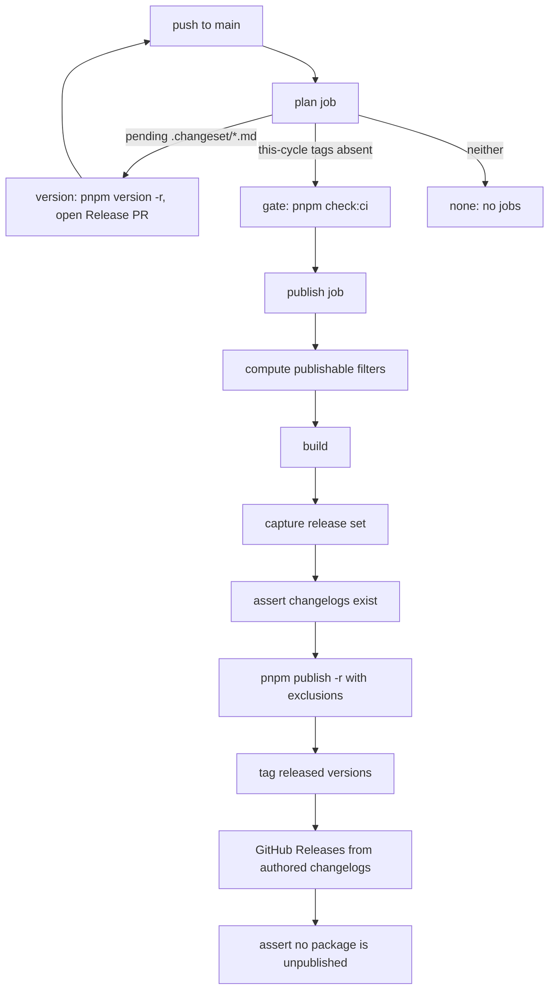

# comment-checker Tooling Parity - Plan

## Goal Capsule

**Objective.** Bring this repository to tooling parity with `systemfsoftware/comment-checker` on three axes: the Nix dev-shell provisioning of the `comment-checker` binary, the hook wiring that resolves it, and a release pipeline that actually lands GitHub Releases carrying each package's authored changelog.

**Authority hierarchy.** `CONSTITUTION.md` > root `AGENTS.md` > this plan > implementer judgement. `REPO-P1` is absolute: npm credential work and merging stay human.

**Stop conditions.**

- Stop and report if bootstrapping `@systemfsoftware/stryker-test-contribution` on npm becomes necessary to finish a unit. That needs registry credentials (`REPO-P1`).
- Stop if a unit would require editing `repos/` (`REPO-S3`).
- Do not start a mutation run (`REPO-D3`).

**Execution profile.** Six units. U1–U2 are dev-environment. U3–U4 are release-pipeline. U5 is a doctrine repair; U6 is the Evaluator that catches its defect class and ships in its own commit (Surface Classes, `CONST-E4`).

**Tail ownership.** The caller owns commit, push, PR and CI watch.

## Product Contract

### Summary

Three parity gaps, each with a direct observation behind it.

The flake supplies `dprint`, `nodejs_24` and `deno`, but not `comment-checker`, while `.claude/settings.json` registers `comment-checker` as a `PostToolUse` hook. Every edit in a session whose PATH lacks the binary emits `sh: line 1: comment-checker: command not found`; this was observed on every tool call in the session that wrote this plan. Upstream's flake fetches the release binary per target triple, wraps it in `bubblewrap`, and puts the wrapper in `devShells.default`.

The release pipeline's `publish` job hangs off `pull_request: types: [closed]`. That trigger is single-shot: run `32650470424` (PR #218, 2026-08-23T16:03Z) failed at its `Preflight` step, and no later push to `main` can retry it. `pnpm ls` reports 32 packages whose local version is ahead of npm with no tag and no GitHub Release. Upstream deleted that trigger for exactly this reason and reads durable repository state instead.

The preflight itself is the abort. One never-published package, `@systemfsoftware/stryker-test-contribution`, fails the fail-closed check, and the whole job — publish, tag, GitHub Releases — is skipped for the 32 packages that could ship. Durable-state planning alone does not clear this: the next push re-enters `publish` and aborts at the same step.

### Problem Frame

The GitHub-Release mechanism is already correct. Run `32502958871` (2026-08-21T16:26Z) shows `create-github-releases.mjs` creating 35 releases, each body read from `.changeset/changelogs/<name with / as !>@<version>.md`. Nothing about the release _body_ needs building. What fails is reaching that step at all — twice, at the trigger and at the preflight — and both failures are silent from the maintainer's seat: the version bump lands on `main`, the intents are consumed, and no artifact says the release did not happen.

### Key Decisions

- **Parity means the mechanism reaches the binary, not that upstream's every line is copied.** Upstream's hook tail is `|| exit 0`, a silent skip. This repo carries a documented learning that a guard whose skip is indistinguishable from a pass enforces nothing (`docs/solutions/integration-issues/comment-checker-hook-silently-bypasses-on-patch-mode-edit.md`). Adopt the `direnv exec` resolution step; reject the silent tail. Governs R4.
- **Fix the preflight abort in this plan, not later.** Without it, "actually doing GitHub releases" is unmet on the next push as much as on the last one. Governs R7, R8.

### Requirements

**Nix and dev shell**

- R1. `nix/comment-checker.nix` builds `comment-checker` from the `v0.1.5` GitHub release asset `comment-checker-<triple>` for `x86_64-linux`, `aarch64-linux`, `x86_64-darwin` and `aarch64-darwin`, and throws a named error on any other system.
- R2. `nix/comment-checker-bwrap.nix` wraps that binary in `bubblewrap` with no network (`--unshare-net`), a read-only bind of the working directory, and `--die-with-parent`.
- R3. `flake.nix` exposes `packages.comment-checker` and `packages.comment-checker-bwrap`, and `devShells.default` carries the wrapper so `comment-checker` resolves on PATH inside the shell. `packages.default` stays `dprint`.

**Hook wiring**

- R4. The `PostToolUse` `comment-checker` entry resolves the binary from PATH, then via `direnv exec` against the project directory, and otherwise prints a one-line instruction naming the dev shell to stderr and exits non-zero. It never exits 0 without having run the checker.
- R5. That entry carries an explicit `timeout`, as every other hook entry in `.claude/settings.json` does.

**Release phase from durable state**

- R6. The `Release` workflow triggers only on `push` to `main`. A `plan` job derives the phase from repository state: pending `.changeset/*.md` intents mean `version`; otherwise a non-empty this-cycle set from `tag-released-packages.mjs --dry-run --json` means `publish`; otherwise `none`. The `version`, `gate` and `publish` jobs gate on that output.

**Release progress under a debut package**

- R7. The publish step publishes every workspace package that already exists on npm, excluding never-published ones, so tagging and GitHub Releases run for the packages that can ship.
- R8. The job still fails, naming each never-published package and the bootstrap command, after tags and releases for the shippable set have landed.

**Doctrine repair**

- R9. `AGENTS.md` carries no merge-conflict markers, and exactly one `REPO-R2` and one `REPO-R3`.
- R10. A deterministic check fails when any tracked non-vendored text file contains a conflict marker, and it is wired into the check chain.

### Scope Boundaries

Out of scope: publishing `@systemfsoftware/stryker-test-contribution` (needs npm credentials, `REPO-P1`); adding Nix to CI beyond the `cachix/install-nix-action@v31` step `reusable-checks.yml` already runs; changing `packages.default`; adding `pnpm` to the dev shell — `flake.nix:16-18` records why corepack owns pnpm resolution.

### Acceptance Examples

- AE1. Covers R3. `nix build --no-link --print-out-paths .#comment-checker-bwrap` prints a store path containing `bin/comment-checker`, and running it with an empty JSON object on stdin exits 0 or 2, not 127.
- AE2. Covers R4. With `comment-checker` absent from PATH and `direnv` absent, the hook command prints the dev-shell instruction to stderr and exits 1.
- AE3. Covers R6. On a tree with no pending intents and every this-cycle tag already on `origin`, `plan-release.mjs` prints `phase=none`.
- AE4. Covers R6. On a tree with one file at `.changeset/<slug>.md`, it prints `phase=version`.
- AE5. Covers R7, R8. Given a workspace where exactly one package is absent from npm, the computed filter list excludes that package and includes the rest, and the final assertion exits non-zero naming it.
- AE6. Covers R10. The marker check exits non-zero on a fixture containing `<<<<<<<` at line start and exits 0 on the current tree once U5 has landed.

### Sources

- Upstream flake, hook config, phase planner and release workflow: `systemfsoftware/comment-checker@master` — `flake.nix`, `.claude/settings.json`, `scripts/tools/plan-release.ts`, `.github/workflows/release.yml`.
- The four `v0.1.5` asset hashes in R1 were re-derived this session with `nix store prefetch-file` and match upstream's flake byte for byte.
- Failing cycle: run `32650470424`, step `Preflight — every package must already exist on npm`, `unpublished: 1`, `stuck: 32`, exit 1.
- Working mechanism: run `32502958871`, `pnpm publish -r` published 35 packages and skipped the 2 already at their npm version; `create-github-releases.mjs` then reported `created 35 release(s), skipped 0`.
- Corpus checked and silent on the release-trigger question. Queries run against the `software-wiki` collection: lex `changesets release GitHub Release pull_request closed trigger`; vec `release workflow trigger durable repository state instead of pull request closed event`; plus a hyde variant stating the destroyed-merge-ref failure. Best topical hit `pages/release-gating.md` scored 13% and covers QA regression gating, not CI trigger design.

## Planning Contract

### Key Technical Decisions

- KTD1. Mirror upstream's two derivations rather than one. `nix/comment-checker.nix` returns the raw binary; `nix/comment-checker-bwrap.nix` returns the sandboxed wrapper. Each stays `callPackage`-clean, matching the single-derivation-per-file shape of `nix/dprint.nix`. Cites R1, R2.
- KTD2. Ship the wrapper, not the raw binary, in the dev shell. The wrapper is what denies the hook a network — it runs on every edit — and on a pure Nix host it also supplies the dynamic loader the raw upstream binary expects, since upstream applies no `autoPatchelfHook`. Cites R2, R3.
- KTD3. Use SRI `hash` rather than `nix/dprint.nix`'s bare hex `sha256`. The values verified this session are already SRI, so no re-encoding step can introduce an error. Cites R1.
- KTD4. `plan-release.mjs` shells out to `tag-released-packages.mjs --dry-run --json` for the this-cycle set instead of re-deriving it. `computeThisCycle` (`scripts/tools/tag-released-packages.mjs:35-44`) is the one definition of "released this cycle"; a second copy would drift (`CONST-S4`). Cites R6.
- KTD5. Partition the publish set rather than relaxing the preflight's verdict. The check keeps its fail-closed report and its non-zero exit; only its _position_ moves to after tag and release, and a new mode emits the `pnpm --filter` exclusions consumed by the publish step. Progress and a loud failure, not one at the other's expense. Cites R7, R8.
- KTD6. The marker check ships in its own commit, separate from the `AGENTS.md` text it would have caught. Surface Classes puts an Evaluator in its own commit, observed red before and green after; `CONST-E4` forbids landing an evaluator beside the work it judges. Cites R9, R10.

### High-Level Technical Design

The loop back from `version` to `push` is the durable-state property: merging the Release PR is itself a push to `main`, so the same workflow re-plans and finds `publish`. A failed `publish` leaves the tags absent, so the next push re-plans to `publish` again.

### Assumptions

- `pnpm publish -r` skips a package whose version already exists on npm. Verified, not assumed: run `32502958871` published 35 of 37 and left the 2 already-current ones alone.
- `pnpm --filter '!<name>'` excludes a package from a recursive publish. This is the one unverified mechanism; the implementer confirms it with `corepack pnpm --filter '!@systemfsoftware/tsconfig' ls -r --depth=-1 --json` before wiring it, and falls back to an allow-list of `--filter <name>` arguments if exclusion does not apply to `publish`.

### Sequencing

U1 → U2 (the hook instruction names the shell U1 creates). U3 → U4 (U4 edits steps inside the job U3 re-gates). U5 → U6 (`CONST-E4`: the Evaluator is observed red against the pre-U5 text, then green). The two release units and the two dev-environment units are independent of each other.

## Implementation Units

### U1. Flake supplies comment-checker

**Goal.** `comment-checker` resolves on PATH inside `nix develop`.

**Requirements.** R1, R2, R3.

**Files.** `nix/comment-checker.nix` (new), `nix/comment-checker-bwrap.nix` (new), `flake.nix`.

**Approach.** Follow `nix/dprint.nix`: an attrset keyed by `stdenvNoCC.hostPlatform.system` mapping to the target triple, `throw` on a missing key, `fetchurl` with SRI `hash`, `dontUnpack = true`, `install -Dm755` into `$out/bin/comment-checker`, and a `meta` block with `mainProgram`, `platforms = lib.attrNames releases` and `sourceProvenance = [ lib.sourceTypes.binaryNativeCode ]`. Hashes, verbatim: `x86_64-unknown-linux-gnu` `sha256-d/Xl2VZqnB+lFNkdtglY7N/nY6CxhgQG+arGL7FmCME=`; `aarch64-unknown-linux-gnu` `sha256-vP0Ss8eOOElpCrxryGiMn0WMBIEDtJe3LnB8FunZjok=`; `x86_64-apple-darwin` `sha256-c0mJOCcz0Zt61Da/y/n3JTFGchWJQk8cBZ8EMVYx7e8=`; `aarch64-apple-darwin` `sha256-C/f81qw86DXoZ6dL2rEt6z67IfYw09hG8iaa0vQOu2U=`. The wrapper file takes `{ bubblewrap, writeShellScriptBin, comment-checker }` and reproduces upstream's bind set, including the conditional `/lib` and `/lib64` binds that keep it working on hosts that lack them. In `flake.nix`, extend the existing `packages` `let` block with both `callPackage` calls and add the wrapper to `devShells.default.packages`; leave `default = dprint` and the pnpm comment untouched.

**Test scenarios.** No test files. The derivation is proven by building it (AE1); a unit test over a Nix expression restates the expression (`OP12`).

**Verification.** `nix build --no-link --print-out-paths .#comment-checker-bwrap`, then run the printed `bin/comment-checker` with `{}` on stdin and record the exit code. `nix flake check` for evaluation of every system attribute.

### U2. Hook resolves the binary or says how

**Goal.** No session emits a bare `command not found` for the hook, and no session silently skips it.

**Requirements.** R4, R5.

**Files.** `.claude/settings.json`.

**Approach.** Replace the bare `"command": "comment-checker"` entry. Try PATH first, then `direnv exec "$CLAUDE_PROJECT_DIR"`, then print one line to stderr naming `direnv allow` or `nix develop` and exit 1 — the same fail-loud shape the four `deno` entries in this file already use, and the shape the patch-mode-bypass learning argues for. Add `"timeout": 30`.

**Test scenarios.** None. The entry is one shell command in a config file; AE2 is its proof.

**Verification.** Run the command string in a shell with `comment-checker` and `direnv` removed from PATH and confirm the message and exit 1 (AE2). Run it inside `nix develop` and confirm the checker executes.

### U3. Release phase from durable state

**Goal.** A failed or half-finished release resumes on the next push to `main`.

**Requirements.** R6.

**Files.** `scripts/tools/plan-release.mjs` (new), `.github/workflows/release.yml`.

**Approach.** The script carries a `deno run` shebang with exact scopes (`OP15`) — read, plus `--allow-run` limited to the tools it calls. It counts pending intents by reading `.changeset` for `*.md` entries, excluding `README.md` and the `changelogs/` subdirectory, then invokes `tag-released-packages.mjs --dry-run --json` and parses the array. Diagnostics go to stderr; stdout carries only `phase=…` and the two counts, for `>> "$GITHUB_OUTPUT"`. Add a `--selftest` covering the three phases over in-memory inputs, matching the selftest convention in the two sibling scripts. In the workflow, drop the `pull_request` trigger, add a `plan` job with `outputs.phase` running `./.github/actions/install-deps` and `denoland/setup-deno@v2`, and re-gate `version`, `gate` and `publish` on `needs.plan.outputs.phase`. Delete the four-clause `if:` expressions the `pull_request` event required.

**Test scenarios.** `--selftest` asserts: pending intent present and this-cycle empty yields `version`; no intents and a non-empty this-cycle yields `publish`; no intents and an empty this-cycle yields `none`; `.changeset/README.md` alone does not count as pending; a file under `.changeset/changelogs/` does not count as pending.

**Verification.** `./scripts/tools/plan-release.mjs --selftest`. Then `./scripts/tools/plan-release.mjs` against the current tree, whose expected answer is `phase=version` — 100-plus pending intents are tracked under `.changeset/`. Then `pnpm exec actionlint` if the repo provides it, otherwise confirm the workflow parses by pushing and reading the run's job list.

### U4. Publish what can publish, then fail loudly

**Goal.** A single never-published package no longer costs 32 packages their tags and releases.

**Requirements.** R7, R8.

**Files.** `scripts/tools/check-npm-publish.sh`, `.github/workflows/release.yml`.

**Approach.** Confirm the `--filter` exclusion mechanism first (see Assumptions). Add a mode to `check-npm-publish.sh` that writes the exclusion arguments for never-published packages to a path given on the command line and exits 0, keeping the existing classification query as the single source of that verdict. In the publish job, run that mode as the first step, feed its output into the `pnpm publish -r` invocation, and move the existing `--preflight` invocation to a final step after `GitHub Releases from authored changelogs`. Preserve the `--no-git-checks` comment at `release.yml:149-152` verbatim — it explains a flag no other job may copy.

**Test scenarios.** The script is bash with a live registry query; the classification logic is unchanged and already covered by its own output. Assert the new mode's file contents against a stubbed classification (AE5) using whatever selftest hook the script already exposes; if it exposes none, verify by running the mode against the real workspace and diffing its output against the `UNPUBLISHED` section of the same run's report.

**Verification.** Run the new mode locally and confirm it emits exactly one exclusion, for `@systemfsoftware/stryker-test-contribution`, matching run `32650470424`'s `unpublished: 1`. Confirm the reordered job still ends non-zero while the release steps precede it.

### U5. Resolve the AGENTS.md conflict

**Goal.** The doctrine file states one `REPO-R2` and one `REPO-R3`.

**Requirements.** R9.

**Files.** `AGENTS.md`.

**Approach.** Delete lines 89, 92, 93 and 95 of the current file: the `<<<<<<< Updated upstream` marker, the stray `#`-prefixed duplicate `REPO-R3`, the superseded prose-only `REPO-R2`, and the `>>>>>>> Stashed changes` marker. Keep the turbo-hash `REPO-R2` and the single `REPO-R3`. The hash-based rule is the live one: `changeset-check.yml:39-42` runs `check-changeset.ts` with the event's pinned base SHA and the lockfile-installed turbo, which is the verdict the surviving rule describes.

**Test scenarios.** None — a text repair, proven by U6.

**Verification.** `git grep -nI -e '^<<<<<<< ' -e '^>>>>>>> ' -- AGENTS.md` prints nothing; read stdout, not `$?`, since `git grep` exits 1 when clean. `git grep -c 'REPO-R2' -- AGENTS.md` reports one occurrence per rule.

### U6. Gate the conflict-marker class

**Goal.** A committed conflict marker fails a command.

**Requirements.** R10.

**Files.** `scripts/guards/check-conflict-markers.ts` (new), `package.json`, `.github/workflows/reusable-checks.yml` or the `check:ci` chain.

**Approach.** `conflict-check.yml` runs `git merge-tree` against the base, so it detects a _prospective_ merge conflict and is blind to markers already committed on both sides — which is exactly how the `AGENTS.md` markers reached `main`. Add a Deno guard following `scripts/guards/check-rule-suppression.ts`: enumerate tracked files with `git ls-files`, skip `repos/` and lockfiles, and report every line matching a conflict marker at line start with its path and line number. Wire it into `check:ci` and `check:local` beside `check:suppression`. Ship this unit as its own commit (KTD6).

**Test scenarios.** `--selftest` over two fixtures: a string containing `<<<<<<<` at line start yields one finding; a string containing `<<<<<<<` mid-line, and a fenced code block quoting the markers, yield none — this plan and `AGENTS.md`'s own prose must not be false positives.

**Verification.** Observed red before and green after: run the guard at U5's parent commit and record a non-zero exit naming `AGENTS.md`; run it at U5's commit and record exit 0. Both exit codes belong in the commit body.

## Verification Contract

- `pnpm check:local` after the last edit, exit 0 (`REPO-D1`). Note it runs `./bin/dprint check`, which takes the first `dprint` on PATH — run it inside the dev shell.
- `nix build --no-link --print-out-paths .#comment-checker-bwrap` and `.#comment-checker`, plus `nix flake check`.
- `./scripts/tools/plan-release.mjs --selftest`, `./scripts/tools/tag-released-packages.mjs --selftest`, `./scripts/tools/create-github-releases.mjs --selftest`, and `deno run --allow-read scripts/guards/check-conflict-markers.ts --selftest` — each exit 0.
- `deno run --allow-read scripts/guards/check-changeset.ts --selftest`, exit 0.
- `git grep -nI -e '^<<<<<<< ' -e '^>>>>>>> ' -- . ':!repos/' ':!*.lock'` prints nothing.
- No mutation run (`REPO-D3`).
- `REPO-R2` decides whether a changeset is required by the turbo `build` hash, not by the diff. This plan touches `nix/`, `.claude/`, `.github/`, `scripts/` and `AGENTS.md`, so no publishable package's build hash is expected to move; `changeset-check.yml` is the verdict, and its answer is honoured either way.
- `gh pr checks --watch --fail-fast`, exit 0 (`REPO-D2`).

## Definition of Done

**Global.** R1–R10 satisfied. Every command in the Verification Contract run after the last edit with its exit code recorded. Abandoned experiments removed from the diff. The Evaluator in U6 lands in its own commit with its red-then-green exit codes in the body.

**Per unit.**

- U1. Both derivations build; the wrapper's binary answers on stdin rather than exiting 127.
- U2. AE2 reproduced by hand; the checker runs inside the dev shell.
- U3. Selftest green; the script answers `phase=version` on the current tree.
- U4. Exclusion list contains exactly the one never-published package; the release steps precede the final assertion.
- U5. No markers; one `REPO-R2`, one `REPO-R3`.
- U6. Guard red at U5's parent, green at U5, and wired into `check:ci` and `check:local`.

**Reported, not fixed.** `@systemfsoftware/stryker-test-contribution` still needs a maintainer to debut it on npm and register the trusted publisher. `REPO-P1` puts that outside an agent's reach. Until it happens, the publish job ends red by design (R8) while the other packages release normally.
