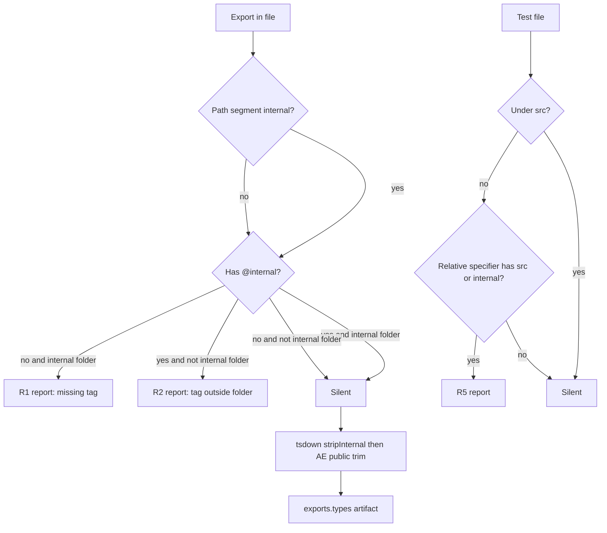

# Internal JSDoc and public test imports

## Goal Capsule

- **Objective.** Every export whose file sits under an `internal` directory carries `@internal` JSDoc. No file outside an `internal` directory carries that tag. A public barrel never writes `from './internal/'`. Names an adopter must depend on are authored as public surface. Tests that live outside `src` import the package only through its published name and subpaths. Published `.d.ts` files omit `@internal` declarations. Integration tests whose subject is an internal are deleted.
- **Product authority.** Repository owner, this session. Grounded in `CONSTITUTION.md` `CONST-E1` (prefer the gate), root `AGENTS.md` `REPO-A5` (the audience is every adopter), `CONCEPTS.md` internal folder (published `exports.types` omits that folder), and `CHK1` (a check keyed on a value its own author supplied certifies nothing).
- **Open blockers.** None.
- **Execution profile.** Code. Rules land, existing sites migrate, public barrel names are authored as public. Registration stays at `error`.
- **Stop conditions.** A name that is neither a capability nor unpublished wiring — escalate, do not hide it under `internal/` and re-export it.
- **Tail ownership.** This plan opens a PR and drives CI to green. Publish is human-controlled (`REPO-P1`).

---

## Product Contract

### Summary

Three oxlint rules plus one publish-time trim. The folder named `internal` is the only place `@internal` may appear, and every export there must carry it. Package-level tests stop reaching into `src`. Adopters who install a tarball do not see those declarations in `exports.types`.

Product Contract source: `ce-plan-bootstrap`. No upstream brainstorm.

### Problem Frame

`internal` folders exist across the tree, but the tag is optional and sometimes sits on a public re-export. Package-level `tests/*.integration.test.ts` files import `../src/...` and `../src/internal/...` (grep this session: `from ['\"](\.\./)+src/` under the workspace). Those tests certify the unpublished source tree, so a broken `exports.types` or a missing subpath can stay green. `tsconfig.build.json` already sets `stripInternal: true` on the packages that have one, so tsdown's own dts would drop a tagged declaration. `exports.types` points at the api-extractor untrimmed rollup (`dtsRollup.untrimmedFilePath`), and that rollup keeps `@internal` (`DtsRollupKind.InternalRelease` returns true unconditionally in installed `@microsoft/api-extractor@7.58.9`). An adopter who installs the tarball therefore sees internals that the folder name claimed to hide.

### Key Decisions

- Colocated tests under `src` stay free to import internals. (session-settled: user-directed — chosen over restricting every test: the request named tests living outside `src`.) Governs R6.
- Package-level tests may import sibling test helpers. (session-settled: user-directed — chosen over package-name-only including no `./helpers`.) Governs R7.
- Workspace typecheck still sees internals through `@systemfsoftware/source`. (session-settled: user-directed — chosen over workspace-blind consumers.) Governs R10.
- Integration or feature tests whose subject is an internal are deleted, not rewritten. (session-settled: user-directed — chosen over rewriting those tests onto the public API.) Governs R12.
- Published tarball types omit `@internal`. (session-settled: user-directed — chosen over annotation-only.) Governs R9.

### Requirements

**Annotation**

- R1. Every exported declaration in a file whose path has a directory segment exactly equal to `internal` carries a JSDoc `@internal` tag on that declaration. Covers `src/internal/*`, `src/internal/**`, and `src/**/internal/*`. A filename that merely contains the letters `internal` is not a match.
- R2. No file whose path lacks that segment may carry `@internal` or `@Internal`. A misplaced tag on a public re-export is the defect `docs/solutions/build-errors/dts-emitter-drops-bundled-entry-reexports.md` names: `stripInternal` then drops the whole public clause.
- R3. "Export" means `export` of a declaration, a default, a named re-export, or `export *` / `export type`. A non-exported binding in an `internal` file is silent.
- R4. The required spelling is `@internal`. The forbid arm treats `@Internal` as the same tag.

**Test import surface**

- R5. A test file that is not under `src` may not import through a relative specifier whose split segments include `src`, or that contain an `internal` segment after a `..` climb. A sibling `./internal/` under the test tree is out of this rule.
- R6. A test file under `src` is out of R5. Per Key Decision on colocated tests.
- R7. Relative imports that stay inside the test tree (`./__fixtures__/`, `./helpers`) are out of R5. Per Key Decision on sibling helpers.
- R8. The rule keys on the specifier string and the linted filename. It does not read `package.json` (`OX-TS2`).

**Published types**

- R9. The file `package.json#exports.types` names must omit declarations tagged `@internal`.
- R10. In-repo typecheck through `@systemfsoftware/source` still sees those declarations. Per Key Decision on workspace visibility.
- R11. A public signature must not mention an `@internal` type. If it does, either the type leaves `internal` or the signature changes. Untagged declarations stay in a public-trimmed rollup (`ReleaseTag.None` is kept).

**Migration**

- R12. An integration or feature test whose subject is an internal module is deleted. A package-level test that only reached into `src` to exercise public behavior is rewritten onto the package name or a subpath export.
- R13. Existing `internal` exports are tagged and misplaced tags are removed in this work. The rules flip to `error` only after the tree is clean.
- R14. A package entry barrel (`src/mod.ts`, `src/index.ts`) must not import or re-export from a specifier whose segments include `internal`. Capability names are authored in public modules. Implementation the barrel does not name stays in `internal/` and is tagged.

### Acceptance Examples

- AE1. Covers R1. Given `src/internal/Foo.ts` exporting `foo` with no tag, When lint runs, Then the export is reported.
- AE2. Covers R2. Given `src/mod.ts` with `@internal` on a public export, When lint runs, Then the tag is reported.
- AE3. Covers R5. Given `tests/x.integration.test.ts` importing `../src/internal/Foo.js`, When lint runs, Then the import is reported.
- AE4. Covers R6, R7. Given `src/foo/__tests__/foo.workflow.property.test.ts` importing `../internal/Foo.js`, or `tests/x.integration.test.ts` importing `./__fixtures__/Bar.js`, When lint runs, Then both stay silent.
- AE5. Covers R9. Given a tagged internal export and a clean `pnpm build`, When a consumer resolves `exports.types` from the packed tarball, Then that name is absent.
- AE6. Covers R12. Given `tests/node-lifetime.integration.test.ts` whose only import from the package is `../src/internal/NodeLifetime.js`, When this work lands, Then the file is gone.

### Success Criteria

- The three rules fire at `error` on a known-bad fixture and stay silent on the known-good fixtures named in each unit's test scenarios.
- `pnpm check:local` exits 0 after the last edit.
- `attw --pack .` on `@systemfsoftware/effect-daemon-spec` (rollup) and `@systemfsoftware/effect-atom` (tsdown-only) reports no resolution failure, and the packed `.d.ts` does not contain a tagged internal name that U4 claimed to hide.

### Scope Boundaries

**In scope.** Author-time rules, delivery through the existing presets, annotation of current `internal` exports, published-type trim on packages that emit `.d.ts`, rewrite or delete of package-level tests under `packages/` and `omp/`. `omp/` is in scope for R1–R5 and R12. R9 is vacuous there: `omp` packages set `dts: false` and publish no `types` condition.

**Deferred to follow-up.** Underscore prefixes (`ae-internal-missing-underscore`). Moving tests into `src`. Turning `ae-missing-release-tag` into a repo-wide obligation to tag every public export `@public`.

**Outside this product's identity.** Changing runtime JS. New plugin packages.

### Dependencies

- `@microsoft/api-extractor@7.58.9` already installed. `stripInternal` already set on the `tsconfig.build.json` files this session grepped.
- Rule authoring: `packages/lint/oxlint/plugins/AGENTS.md` (`OX-CS1`, `OX-TS1`, `OX-TS2`, `OX-EF1`, `OX-EF2`, `OX-IN1`).
- Test placement constants: `packages/lint/oxlint/plugins/testing/test-placement/src/rules/path.ts` and `path.config.ts` (`SANCTIONED_TEST_DIRS` is `tests`; colocated dir is `__tests__`).

---

## Planning Contract

### Key Technical Decisions

- KTD1. **JSDoc pair lives in `@systemfsoftware/oxlint-plugin` (meta/core).** Surface annotation is not test placement (`TP3`) and not schema (`ES2`). Core already ships in `oxlint-config.base.ts` `jsPlugins`. Governs R1–R4.
- KTD2. **Import rule lives in `@systemfsoftware/oxlint-plugin-test-placement`.** That package is the sole owner of where tests may reach (`TP3`). Adding it to that plugin's `configs.recommended` delivers it through `effect-dmmf`'s `recommendedFrom`. Governs R5–R8.
- KTD3. **Import verdict is the specifier text, not the package name.** A relative specifier whose segments include `src`, or that contain `internal` after a `..` climb, is the hit. Reading `package.json` is a disk fact `OX-TS2` forbids. Governs R5, R8.
- KTD4. **Published hide is `publicTrimmedFilePath` on packages whose `exports.types` is an api-extractor rollup, plus existing `stripInternal` on tsdown dts.** Do not point `exports.types` at tsdown's `dist/index.d.ts` on rollup packages (`docs/solutions/build-errors/exports-types-rollup-drift.md`). Untrimmed rollup stays for same-maintainer inspection if a path is already configured; `exports.types` / `apiExtractorRollups` name the public-trimmed file. Governs R9–R11.
- KTD5. **Rules stay unregistered until U3–U5 have cleaned the tree, then flip to `error` in their own commit.** `warn` is invisible under `AGENT` + `--quiet` (`docs/solutions/tooling-decisions/rule-admission-severity-and-accretion.md`). Known-bad proof is the RuleTester suite, not a committed warn. Governs R13.
- KTD6. **Do not put `@internal` on a public re-export clause.** Tag the declaration in the `internal` file. A tagged `export { publicName } from` is the strip-class failure in `docs/solutions/build-errors/dts-emitter-drops-bundled-entry-reexports.md`.
- KTD7. **A name the barrel publishes is public surface, never an `internal/` re-export.** (session-settled: user-directed — chosen over turning `internal-export-jsdoc` off, and over a mechanical `git mv` of the same file one directory up: `CONCEPTS.md` says published types omit `internal/`; if the adopter must depend on the name it is not internal.) Governs R11, R14.

### High-Level Technical Design

Authoring order: rules and suites first, then annotations, then type-path switch, then test rewrite or delete, then registration.

### Assumptions

- Oxlint JS-plugin `context.sourceCode.getCommentsBefore` sees `/** @internal */` on an export at the pinned oxlint 1.77.0. Do not call `getJSDocComment`; it throws `not supported at present`. If `getCommentsBefore` is empty, fall back to a prefix of `getText` on the same file (`OX-TS2`).
- `ReleaseTag.None` remaining in a public-trimmed rollup is acceptable. This work does not require `@public` on every public export.
- Packages that do not extend `@systemfsoftware/oxlint-config` (atom, atom-react) are out of U6 delivery. Their annotation still happens in U3. Reach after U6 is `pnpm lint` on packages that extend `base` or `strict`.

### Implementation Constraints

- `OX-CS1` static config in `*.config.ts`. `OX-EF1` message shape. `OX-EF2` fix may end in deletion. `OX-TS1` RuleTester + DAMP names. `OX-IN1` recommended is rules-only.
- Never hand-edit `package.json#exports` (`REPO-S4`). Change `apiExtractorRollups` in `tsdown.config.ts`.
- No local mutation run (`REPO-D3`).
- Evaluator commit is separate from the work it judges (`CONST-E4`, `REPO` Surface Classes).

### Sequencing

U1 and U2 are independent. U3 needs the rule messages from U1. U4 needs U3 tags. U5 depends on U2. U7 authors remaining barrel-from-internal sites as public surface. U6 stays at `error`; do not turn the require-tag rule off.

### Sources and Research

- Installed `@microsoft/api-extractor@7.58.9` `lib-commonjs/generators/DtsRollupGenerator.js` `_shouldIncludeReleaseTag`: `InternalRelease` always includes; `PublicRelease` keeps `Public` and `None` only.
- `https://api-extractor.com/pages/setup/configure_rollup/` — untrimmed stays on typings so sibling packages can call internals; this repo instead points `exports.types` at the rollup an adopter installs.
- Wiki query this session (`software-wiki`, lex+vec+hyde, intent: internal JSDoc / public test imports / published dts). Hits: source-export-condition, publish-surface. Settled: workspace source vs published rollup are different surfaces; a green in-repo typecheck does not prove the tarball. Unsettled: the annotation rule and the test-import rule. External Phase 1.3 research was not run.

Software-wiki query (not a path to re-open from the clone): collection `software-wiki`; searches `@internal JSDoc dts rollup stripInternal public API test import` (lex), the TypeScript internal-export / test-import question (vec), and the hypothetical passage on folder-gated `@internal` plus package-level import bans (hyde).

---

## Implementation Units

### U1. JSDoc `@internal` pair

- **Goal.** Two core rules: require the tag on `internal`-folder exports; forbid the tag elsewhere.
- **Requirements.** R1, R2, R3, R4.
- **Dependencies.** None.
- **Files.**
  - create `packages/lint/oxlint/plugins/meta/core/src/rules/internal-export-jsdoc.ts` and `.config.ts`
  - create `packages/lint/oxlint/plugins/meta/core/src/rules/no-internal-jsdoc-outside.ts` and `.config.ts`
  - create `packages/lint/oxlint/plugins/meta/core/src/rules/__tests__/internal-export-jsdoc.test.ts`
  - create `packages/lint/oxlint/plugins/meta/core/src/rules/__tests__/no-internal-jsdoc-outside.test.ts`
  - modify `packages/lint/oxlint/plugins/meta/core/src/index.ts` (`rules` map only; `configs.recommended` waits for U6)
  - modify `packages/lint/oxlint/plugins/meta/core/README.md` rules table
- **Approach.**
  1. Detect `internal` by `directoriesOf(filename).includes('internal')`, same segment walk as `packages/lint/oxlint/plugins/testing/test-placement/src/rules/path.ts`.
  2. Visit export declarations. A missing tag in an `internal` file reports. A present `@internal`/`@Internal` outside that folder reports.
  3. Read the tag with `context.sourceCode.getCommentsBefore(node)`. Never call `getJSDocComment`. If the comment array is empty, take a prefix of `getText` on the same node. Do not open other files.
  4. Messages follow `OX-EF1`. R2's `fix` names deletion of the tag. R1's `fix` names adding `@internal` on the declaration, not on a public barrel.
- **Patterns to follow.** `packages/lint/oxlint/plugins/testing/test-hygiene/src/rules/damp-test-naming.ts` (config split, `defineRule`). `path.ts` for segments.
- **Test scenarios.**
  - Happy: `src/internal/a.ts` exporting `foo` with `@internal` is silent.
  - Happy: `src/mod.ts` exporting `foo` with no tag is silent.
  - Edge: `src/internalize.ts` (file, not folder) with no tag is silent.
  - Edge: `src/feature/internal/a.ts` missing the tag is reported (nested `internal`).
  - Edge: `export type { X }` and `export * from './x.js'` in an `internal` file missing the tag are reported.
  - Error: `@Internal` outside `internal` is reported.
  - Error: `@internal` on `export { publicName } from './public.js'` in `src/mod.ts` is reported.
- **Verification.** `pnpm --filter @systemfsoftware/oxlint-plugin test` exits 0. Rules are loadable and not in any consumer config yet.
- **Execution note.** Author the suites first. The suite is the known-bad / known-good pair.

### U2. Package-level tests import only the public specifier shape

- **Goal.** A test outside `src` cannot relative-import `src` or `internal`.
- **Requirements.** R5, R6, R7, R8.
- **Dependencies.** None.
- **Files.**
  - create `packages/lint/oxlint/plugins/testing/test-placement/src/rules/tests-import-public-api.ts` and `.config.ts`
  - create `packages/lint/oxlint/plugins/testing/test-placement/src/rules/__tests__/tests-import-public-api.test.ts`
  - modify `packages/lint/oxlint/plugins/testing/test-placement/src/index.ts` (`rules` map only; recommended waits for U6)
  - modify `packages/lint/oxlint/plugins/testing/test-placement/README.md` rules table
- **Approach.**
  1. Skip when `isUnderSrc(filename)` (`path.ts`).
  2. Skip when the basename is not a test (`isTestFile`).
  3. On `ImportDeclaration`, `ExportNamedDeclaration`, `ImportExpression` (literal source), and `TSImportEqualsDeclaration` with a relative source, split the specifier on `/` and report if a segment is `src` or (after a `..`) `internal`.
  4. Package-name specifiers and `./helpers` stay silent.
  5. `fix` per `OX-EF2`: rewrite onto the published name when the imported binding is public; delete the test when the subject is an internal.
- **Patterns to follow.** `in-source-test-targets-private.ts` (filename gate then AST). `path.config.ts` for `TEST_BASENAME`.
- **Test scenarios.**
  - Happy: `tests/a.integration.test.ts` importing `@systemfsoftware/effect-gherkin-spec` is silent.
  - Happy: same file importing `./__fixtures__/x.js` is silent.
  - Happy: `src/foo/__tests__/foo.workflow.property.test.ts` importing `../internal/Foo.js` is silent.
  - Error: `tests/a.integration.test.ts` importing `../src/mod.js` is reported.
  - Error: same file importing `../src/internal/Foo.js` is reported.
  - Edge: `export { x } from '../src/mod.js'` in a test file is reported.
  - Edge: `await import('../src/mod.js')` in a test file is reported.
- **Verification.** `pnpm --filter @systemfsoftware/oxlint-plugin-test-placement test` exits 0.

### U3. Annotate current internals

- **Goal.** Every current `internal` export carries `@internal`. No file outside those folders keeps the tag.
- **Requirements.** R1, R2, R3, R4, R11, R13.
- **Dependencies.** U1 (message and tag placement).
- **Files.** Every `packages/**/src/**/internal/**/*.ts` and `omp/**/src/**/internal/**/*.ts` that exports. Public files that currently carry `@internal` (this session: `packages/core/effect/atom/atom/src/Registry.ts`, `packages/core/effect/schema/law/src/Weaken.ts`, `packages/testing/mutation/stryker-js/mutation-run/src/stryker.ts`, `packages/testing/type-testing/arethetypeswrong/core/TsInternals.d.ts`).
- **Approach.**
  1. Census exports under an `internal` segment. Add the tag on the declaration, never on a public barrel re-export (KTD6).
  2. Remove the tag from files that are not under `internal`, or move the declaration into `internal` if it is not public.
  3. If a public signature names an internal type, either un-internal that type or change the signature (R11).
- **Patterns to follow.** `packages/core/effect/atom/atom/src/internal/Core.ts` (`/** @internal */` on each export).
- **Test expectation:** none — annotation only. U1's suite owns the contract. Completeness is the U6 lint run.
- **Verification.** A throwaway `oxlint -D` of the unregistered rules against the tree reports zero findings before U6 registers them. Do not commit that severity.

### U4. Point published types at the trimmed artifact

- **Goal.** `exports.types` names a file that omits `@internal`.
- **Requirements.** R9, R10, R11.
- **Dependencies.** U3.
- **Files.**
  - each package `api-extractor.json` that has `dtsRollup.enabled: true`: add `publicTrimmedFilePath` next to the existing `untrimmedFilePath`
  - each matching `tsdown.config.ts` `apiExtractorRollups`: point at the public-trimmed filename
  - packages that ship tsdown dts only (no rollup, e.g. `packages/core/effect/atom/atom`): keep `stripInternal: true`; no api-extractor change (`packages/core/effect/atom/AGENTS.md` forbids adding one)
- **Approach.**
  1. Set `publicTrimmedFilePath` to the existing `dist/<name>.d.ts` slot that `apiExtractorRollups` already names. That is the file `exports.types` claims.
  2. Move `untrimmedFilePath` to `dist/<name>-untrimmed.d.ts`. api-extractor writes untrimmed last (`Extractor.js:173-177` in 7.58.9); the two paths must differ or untrimmed overwrites the public file.
  3. Leave `apiExtractorRollups` pointed at `dist/<name>.d.ts`. Do not hand-edit `package.json#exports`.
  4. Confirm `stripInternal: true` remains on `tsconfig.build.json` for tsdown-only packages. The untrimmed file may still sit in the tarball; it is not on `exports.types`.
- **Patterns to follow.** `packages/core/effect/daemon-spec/tsdown.config.ts` (`apiExtractorRollups` + `injectApiExtractorTypes`). `docs/solutions/build-errors/exports-types-rollup-drift.md`.
- **Test expectation:** none for the config edit. Proof is the packed types.
- **Verification.** Delete `dist/`, run `build`, then `attw --pack .` on `@systemfsoftware/effect-daemon-spec` and `@systemfsoftware/effect-atom`. Open the file `exports.types` names and confirm a tagged internal name from U3 is absent.

### U5. Rewrite or delete package-level source reach-ins

- **Goal.** No test outside `src` imports `../src/...`. Internals-subject integration tests are gone.
- **Requirements.** R5, R7, R12.
- **Dependencies.** U2. Coordinate with U3 if a deleted test was the only client of an internal.
- **Files.** Every `packages/**/tests/**` and `omp/**/tests/**` (and package-level `__tests__/`) whose imports match `from ['\"](\.\./)+src/`. This session's grep opened on that pattern; treat the live grep as the census, not a frozen count.
- **Approach.**
  1. Classify each file: subject is an internal → delete. Subject is public, import is a convenience → rewrite to the package name or a declared subpath.
  2. Keep `./__fixtures__` and other sibling helpers.
  3. `packages/core/effect/atom/atom/tests/node-lifetime.integration.test.ts` importing `../src/internal/NodeLifetime.js` is a delete (AE6).
  4. `packages/core/effect/atom/atom-react/tests/*.integration.test.ts` importing `../src/index.js` rewrite onto `@systemfsoftware/effect-atom-react` (or the package's real name).
- **Patterns to follow.** TP5: a behaviour test that only restates an internal decision is deleted, not rehoused. `OX-EF2`.
- **Test expectation:** none new. Existing integration tests that remain must still pass after the specifier change.
- **Verification.** The U2 rule run via throwaway `oxlint -D` on `packages/**/tests` and `omp/**/tests` reports zero findings. Remaining integration tests in the touched packages still pass under that package's `test` script.

### U6. Register the rules at error

- **Goal.** The three rules reach every package the shared config already reaches, at `error`, in a commit that contains no production-site edits.
- **Requirements.** R13.
- **Dependencies.** U1, U2, U3, U4, U5.
- **Files.**
  - `packages/lint/oxlint/plugins/meta/core/src/index.ts` `configs.recommended`
  - `packages/lint/oxlint/config/src/oxlint-config.base.ts` (core rule ids, matching the existing explicit list)
  - `packages/lint/oxlint/plugins/testing/test-placement/src/index.ts` `configs.recommended` (effect-dmmf `recommendedFrom` picks it up)
  - both plugins' `etc/*.api.md` via `api:update`, never hand-edited
  - `.changeset/` intents for the plugin packages (new exported rule names) and for any package whose published types lost a name (consumer-visible break; `REPO-R1` / `REPO-R3`)
- **Approach.**
  1. Own commit. No annotation or test rewrite in this commit (`CONST-E4`).
  2. Severity is `error`. Not `warn`.
  3. README rows already added in U1/U2; regenerate API reports here if the recommended map is published surface.
- **Test expectation:** none — registration. The suites in U1/U2 already cover behavior.

### U7. Author barrel-published names as public surface

- **Goal.** No entry barrel writes `from './internal/'`. Capability names live in public modules. `internal-export-jsdoc` stays at `error`.
- **Requirements.** R11, R14.
- **Dependencies.** U3, U6.
- **Files.**
  - `packages/core/effect/daemon-spec/src/mod.ts`
  - `packages/core/effect/daemon-spec/src/LoopTags.ts` (new public module; Worker discriminants)
  - `packages/core/effect/daemon-spec/src/WithLeaderLock.ts` (new public module; capability)
  - `packages/core/effect/daemon-spec/src/SupervisionLeader.ts` (absorb `LeaderConfig` port; delete `src/internal/SupervisionLeader.ts`)
  - same for `SupervisionTask.ts` / `SupervisionWorker.ts` ports
  - `packages/core/effect/daemon-spec/src/BuildDynamicExecutor.ts` only if `run.dynamic` remains an alias of that function — otherwise a public wrapper whose signature names only public types
  - remaining `src/internal/*` that the barrel does not name stay tagged
- **Approach.**
  1. For each `export { X } from './internal/…'` on `mod.ts`, decide: capability or leak. Capability is authored as a public module (ports live with the public kernel). Leak is dropped from the barrel.
  2. Do not `git mv` an internal file and call it done. Public modules are written as public: no `@internal`, no `internal/` path, barrel imports `./LoopTags.js`.
  3. Implementation the barrel does not name stays under `internal/` with the tag.
  4. Keep `internal-export-jsdoc` at `error` in `oxlint-config.base.ts` and the plugin recommended map.
- **Patterns to follow.** `packages/core/effect/atom/atom/src/ResultValues.ts` after it left `internal/` because `Result.ts` re-exports it. Architecture audit F1/F1b/F1c on this barrel.
- **Test scenarios.**
  - Happy: `mod.ts` has zero specifiers containing an `internal` segment.
  - Happy: packed `exports.types` still lists `withLeaderLock`, `PollLoopTag`, `LeaderConfig`.
  - Error: a remaining `internal/` export without `@internal` is reported by `internal-export-jsdoc`.
  - Error: `@internal` on a public module is reported by `no-internal-jsdoc-outside`.
- **Verification.** `rg "from '\\./internal/" packages/core/effect/daemon-spec/src/mod.ts` prints zero lines. `pnpm --filter @systemfsoftware/effect-daemon-spec build` exits 0. `pnpm --filter @systemfsoftware/effect-daemon-spec lint` exits 0.

---

## Verification Contract

| Gate                                                                                                          | When                | Done signal                                                     |
| ------------------------------------------------------------------------------------------------------------- | ------------------- | --------------------------------------------------------------- |
| `pnpm --filter @systemfsoftware/oxlint-plugin test`                                                           | After U1            | exit 0                                                          |
| `pnpm --filter @systemfsoftware/oxlint-plugin-test-placement test`                                            | After U2            | exit 0                                                          |
| Package `build` + `attw --pack .` on `@systemfsoftware/effect-daemon-spec` and `@systemfsoftware/effect-atom` | After U4            | exit 0; packed types omit a tagged internal                     |
| Touched packages' `test` scripts                                                                              | After U5            | exit 0                                                          |
| `pnpm lint`                                                                                                   | After U6            | exit 0 on packages that extend `base` or `strict`               |
| `pnpm check:local`                                                                                            | After the last edit | exit 0                                                          |
| PR checks                                                                                                     | After open          | `gh pr checks --watch --fail-fast` exit 0 (`REPO-D1`/`REPO-D2`) |

No local mutation run.

---

## Definition of Done

- R1–R13 hold on the tree the PR contains.
- U1 and U2 suites cover every listed scenario and fail if the tag or the specifier check is removed.
- U6 is a distinct commit from U3–U5.
- Changesets name only what an adopter observes (`REPO-R3`).
- Abandoned scratch (throwaway `oxlint -D` configs, census notes) is not in the diff.
- PR watched to green.

---

## Risks

- **Public signature names an internal type.** Public-trim or `stripInternal` then emits a broken `.d.ts`. Mitigation: R11; stop condition if the type is load-bearing.
- **`ae-forgotten-export` forces a type public.** Wiki publish-surface page records this hostility. Mitigation: do not export the type from the entry; keep it file-local or un-internal it on purpose.
- **Oxlint JS plugin cannot see JSDoc.** Mitigation: `getCommentsBefore`, then prefix `getText`. Never `getJSDocComment` (throws on oxlint 1.77.0). If both are empty in RuleTester, stop and report; do not invent a disk walk.
- **Registration is not delivery.** `docs/solutions/architecture-patterns/constraint-reaches-only-via-window-or-gate.md`. Reach is `pnpm lint` on packages that extend `base` or `strict`. atom and atom-react keep their own configs and do not get these rules unless they opt in.
- **Large test rewrite.** The live grep is the census. Do not freeze a file count in this plan.

## Alternatives considered

- **One new plugin package.** Rejected. Existing plugins already own the two concerns (`TP3`, core as the surface plugin already in `jsPlugins`).
- **Point `exports.types` at tsdown `dist/index.d.ts` and drop the rollup.** Rejected on rollup packages. The rollup exists to inline `bundledPackages` (`exports-types-rollup-drift.md`).
- **Commit the rules at `warn` until the tree is clean.** Rejected. `warn` is silent under `AGENT --quiet`.
