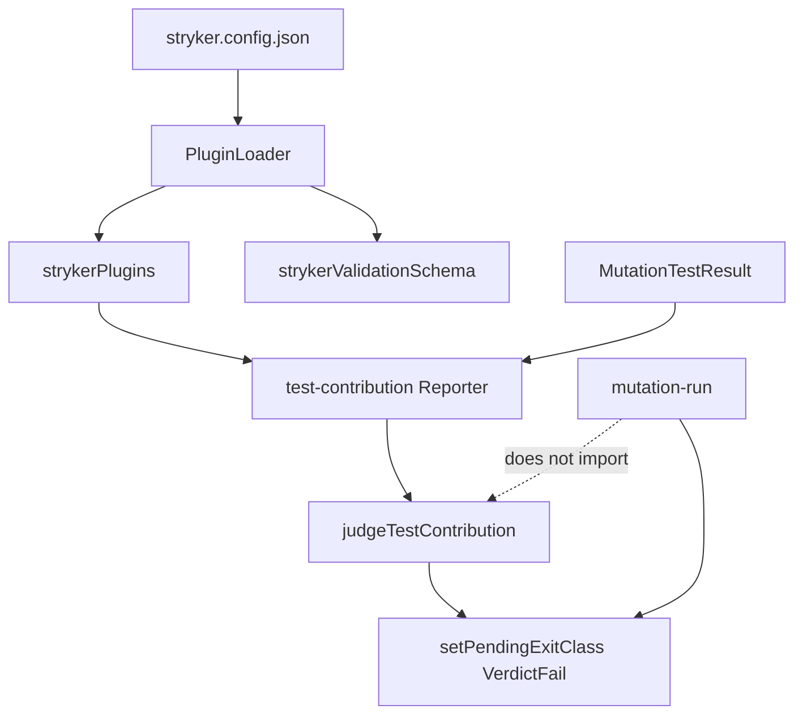

# Extract requireTestContribution to a Stryker addon - Plan

## Goal Capsule

- **Objective.** Move `requireTestContribution` out of `@systemfsoftware/stryker-js-mutation-run` into a published Stryker addon package. Adopters install and declare the addon. The engine no longer judges test contribution.
- **Authority.** This plan. Product Contract over Implementation Units. `REPO-A5` for adopter-visible surface. `DEL1` for a complete removal. `CONST-E4` for evaluator isolation.
- **Execution profile.** Extract the existing pure decision first. Wire a Reporter plugin. Cut the engine over. Do not change the contribution algorithm.
- **Stop conditions.** Stop if a cycle appears between the addon and `mutation-run`, or if failing a run from a Reporter cannot use the published `exit-classification` export.
- **Tail.** `ce-work` implements. LFG owns simplify, review, commit, PR, and CI watch.

---

## Product Contract

### Summary

An adopter who wants the contribution gate installs `@systemfsoftware/stryker-test-contribution`, lists it in `plugins`, lists `test-contribution` in `reporters`, and sets `requireTestContribution`. An adopter who does not install it never gets the gate. This repo turns the gate on by default for every config that extends the mutation-run base preset. That is a runtime flip: today no in-tree config sets a non-null suffix list, the fork-schema default never reaches `OptionsValidator`, and only hex-schema sets `null`. Root `AGENTS.md` already states the gate as repo policy. R11 implements that policy instead of preserving the accidental off.

### Problem Frame

`judgeTestContribution` lives in `packages/testing/mutation/stryker-js/mutation-run/src/test-contribution.ts`. The engine's report helper fails the run. The verdict envelope embeds the same judgement. The fork schema documents the option.

That couples an Evaluator surface to the mutation engine. An adopter of mutation-run cannot take the engine without taking the gate's code, and cannot take the gate without taking the engine's internals. `@systemfsoftware/stryker-plugins` already ships Ignore-kind plugins. Folding a Reporter evaluator into that package would mix two jobs.

### Requirements

**Packaging**

- R1. A new published package `@systemfsoftware/stryker-test-contribution` lives at `packages/testing/mutation/plugins/stryker-test-contribution` and is picked up by the existing `packages/testing/mutation/plugins/*` workspace glob.
- R2. The package exports `strykerPlugins` containing one `PluginKind.Reporter` named `test-contribution`, and exports `strykerValidationSchema` that declares `requireTestContribution`.
- R3. The package publishes the pure decision (`judgeTestContribution`, `contributionByTestFile`, `toothlessTestFiles`, `suffixesToRequire`, and the verdict types) on the main export so tests and adopters can call it without a deep import.

**Behaviour**

- R4. The contribution algorithm is unchanged from `packages/testing/mutation/stryker-js/mutation-run/src/test-contribution.ts` as of this plan.
- R5. When the reporter is loaded and `requireTestContribution` names at least one suffix, a failed verdict records `ExitClass.VerdictFail` through `@systemfsoftware/stryker-js-mutation-run/exit-classification` and logs the same messages the engine helper logs today.
- R6. When the reporter is not listed, or the plugin is not installed, a run does not judge test contribution and does not fail for it.
- R7. `null`, omitted, empty, or non-string `requireTestContribution` still means the check is off (`suffixesToRequire`).

**Engine cutover**

- R8. `mutation-run` deletes `src/test-contribution.ts` and every import of it. The report helper no longer calls `determineTestContribution`.
- R9. `forkOptionsSchema` and `packages/testing/mutation/stryker-js/mutation-run/schema/stryker-schema.json` no longer declare `requireTestContribution`.
- R10. `VerdictEnvelope` no longer carries `testContribution`. Machine-mode consumers that read that field must install the addon and read its logs or call the published judge themselves.
- R11. `packages/testing/mutation/stryker-js/mutation-run/src/config/base-preset.ts` lists the addon in `plugins`, lists `test-contribution` in `reporters`, and sets `requireTestContribution` to `['.workflow.property.test.ts', '.policy.property.test.ts', '.kernel.property.test.ts']`. This is a default-on flip for inheritors, not a no-op. A child that sets `null` stays off. A child that replaces `reporters` wholesale must re-list `test-contribution` or the reporter does not run. `plugins` always merge parent-then-child (`extends-step.ts`), so a child `plugins` array cannot drop the inherited addon loader.
- R12. After the move, `mutation-run` has no `mutate` list. Delete `packages/testing/mutation/stryker-js/mutation-run/stryker.config.json` rather than keep a config that mutates nothing.

**This repo**

- R13. Packages that already set `requireTestContribution: null` keep that opt-out. hex-schema is the known case (`packages/core/hex/hex-schema/stryker.config.json`).
- R14. Root `AGENTS.md` still names `requireTestContribution: null` as the opt-out. It must not name `mutation-run/src/test-contribution.ts` as the gate's home.

### Key Decisions

- **Separate package, not a new subpath of `@systemfsoftware/stryker-plugins`.** Governs R1. The existing package is Ignore-kind Effect ignorers. This gate is an Evaluator Reporter.
- **Explicit plugin and reporter declaration.** Governs R2, R6, R11. Presence is a `plugins` + `reporters` line, not an import-time registry mutation.
- **Engine does not import the addon.** Governs R8, R10. The addon imports the engine's published `exit-classification`. The reverse edge is a workspace cycle.
- **Drop `testContribution` from the verdict envelope.** Governs R10. Keeping the field would force `mutation-run` to depend on the addon.
- **Base preset turns the documented repo gate on at runtime.** Governs R11. Plugin JSON Schema contributions do not inject Effect-schema decoding defaults. `OptionsValidator` decodes `StrykerOptionsSchema`, which does not own this option. Putting the three suffixes on the base preset is the first time inheritors actually receive them.

### Scope Boundaries

- In: new addon package, move of the decision and its tests, Reporter wiring, engine deletion, base-preset wiring, leaf AGENTS/README, changesets.
- Out: changing sole-kill or bail rules. Folding into `@systemfsoftware/stryker-plugins`. Moving `setPendingExitClass` into plugin-api. New property tests. A mutation run (REPO-D3).
- Deferred: a machine-mode event emitted by the addon that replaces the removed envelope field.

### Actors

- A1. Adopter of mutation-run who does not want the gate.
- A2. Adopter who installs the addon.
- A3. In-repo package that extends the base preset.

### Key Flows

- F1. Addon-on run
  - **Trigger:** Config lists the plugin, the reporter, and a non-empty suffix list.
  - **Actors:** A2, A3
  - **Steps:** Loader imports `strykerPlugins` and `strykerValidationSchema`. Broadcast constructs `test-contribution`. On `onMutationTestReportReady` the reporter judges and may set `VerdictFail`.
  - **Covered by:** R2, R5, R7
- F2. Engine-only run
  - **Trigger:** Config does not list the addon.
  - **Actors:** A1
  - **Steps:** No reporter runs. Exit class is unchanged by contribution.
  - **Covered by:** R6, R8

### Acceptance Examples

- AE1. Covers R5, R7. Given a report where `idle.workflow.property.test.ts` has zero sole kills and `disableBail` is true. When the reporter wraps up. Then the pending exit class includes `VerdictFail` and the log names that file.
- AE2. Covers R6, R8. Given the same report and no `test-contribution` reporter. When the run finishes. Then no contribution verdict is recorded and exit class is not set for it.
- AE3. Covers R10. Given a machine-mode envelope built by `buildVerdictEnvelope`. When the report's config still contains `requireTestContribution`. Then the envelope object has no `testContribution` key.
- AE4. Covers R11, R13. Given a package that only extends the base preset. When options resolve. Then `requireTestContribution` is the three workflow/policy/kernel suffixes. A child that sets `null` keeps the check off.

### Assumptions

- The published `exit-classification` module uses one process-wide pending set, so a Reporter in the same process can fail the run the helper fails today.
- `BroadcastReporter` swallows reporter throws. The addon must not rely on throwing `wrapUp`.
- No out-of-repo consumer of `VerdictEnvelope.testContribution` is measured. The field removal is an ALPHA break (`REPO-R1`).

---

## Planning Contract

### Key Technical Decisions

- KTD1. **New package `@systemfsoftware/stryker-test-contribution`.** Chosen over a subpath of `@systemfsoftware/stryker-plugins`: that package's job is Ignore-kind equivalent-mutant filters. This package's job is an Evaluator Reporter. Instantiates R1.
- KTD2. **Reporter plugin + `strykerValidationSchema`, same shape as `packages/testing/mutation/stryker-js/vitest-runner/src/index.ts`.** Chosen over a library-only extract: a library the engine always imports is not an addon. Instantiates R2, R6.
- KTD3. **Addon depends on `@systemfsoftware/stryker-js-mutation-run` only for `./exit-classification`.** Chosen over teaching plugin-api a fail-run token: the token already exists and is exported. Instantiates R5. Forbids the reverse dependency.
- KTD4. **Remove `VerdictEnvelope.testContribution`.** Chosen over a null field or an engine import of the judge: a leftover field is a shim (`DEL1`); an engine import is a cycle with KTD3. Instantiates R10.
- KTD5. **Put the default suffix list on the base preset, not on engine schema defaults.** Chosen over keeping `withDecodingDefaultKey` on `forkOptionsSchema`: that default is documentation. Runtime decode is `StrykerOptionsSchema`, which never applied it. Instantiates R9, R11.
- KTD6. **Delete `mutation-run`'s `stryker.config.json` when `mutate` would be empty.** Chosen over a 100% score over zero mutants. Instantiates R12.
- KTD7. **Move `tests/test-contribution.integration.test.ts` with the decision.** Retarget schema-default scenarios at the addon's `strykerValidationSchema`. Engine envelope tests drop contribution assertions. Instantiates R4.

### High-Level Technical Design

The addon is present only when `plugins` names it and `reporters` names `test-contribution`. Disabling it is removing those declarations.

### Implementation Constraints

- Scaffold from `packages/testing/mutation/plugins/stryker-plugins` (tsdown, attw, oxlint, vitest include, api-extractor). Do not copy ignorer AST code.
- Reporter constructor injects `commonTokens.options` and `commonTokens.logger`, same as `packages/testing/mutation/stryker-js/mutation-report/src/json-reporter.ts`.
- Enumerate a `stryker-plugins` entry only if tsdown would mangle `strykerPlugins`. A package whose barrel is the plugin entry can export it from `src/mod.ts` the way `@systemfsoftware/stryker-plugins` does.
- Do not hand-edit `package.json#exports`. Change `tsdown.config.ts` (`REPO-S4`).
- Do not start a mutation run (`REPO-D3`). The new package's `stryker.config.json` may list `src/test-contribution.ts` for humans. Agents do not execute it.
- Changesets: new package `minor`; `mutation-run` `major` with `BREAKING CHANGE` for R9 and R10. Bodies name only adopter-visible facts (`REPO-R3`).

### Sequencing

U1 then U2 then U3. U2 needs the package name and reporter name from U1. U3 needs the engine to stop judging before docs claim the new home.

### Risks

- Cycle: addon → mutation-run → addon. Mitigation: mutation-run lists the addon only as a string in the base preset, never as a `package.json` dependency.
- Empty mutate on mutation-run after the move. Mitigation: R12 / KTD6.
- A child that replaces `reporters` drops `test-contribution`. `plugins` cannot drop the addon loader: `extends-step.ts` appends the child's descriptors onto the parent's. Mitigation: document the reporters case. hex-schema overrides `plugins` and sets `requireTestContribution: null`; the inherited loader still arrives, the null keeps the check off.

---

## Implementation Units

### U1. Addon package and moved decision

- **Goal.** The published addon package exists and owns the unchanged judge plus its tests.
- **Requirements.** R1, R2, R3, R4, R5, R7
- **Files.**
  - `packages/testing/mutation/plugins/stryker-test-contribution/` (create: package.json via tsdown, tsconfigs, oxlint, vitest, attw, api-extractor, LICENSE, README, AGENTS.md, `src/mod.ts`, `src/test-contribution.ts`, `src/test-contribution-reporter.ts`, `src/require-test-contribution.schema.ts`, `tests/test-contribution.integration.test.ts`, `tests/test-contribution-reporter.integration.test.ts`)
  - `packages/testing/mutation/stryker-js/mutation-run/src/test-contribution.ts` (copy source from; do not delete until U2)
- **Approach.** Copy the decision file. Add a Reporter that calls `judgeTestContribution(report, options['requireTestContribution'], options.disableBail)` on `onMutationTestReportReady` and records `VerdictFail` on `failed`. Export `strykerPlugins` and `strykerValidationSchema` from the barrel. Move the Gherkin feature. Point default-suffix scenarios at the addon schema document, not `forkCoreSchema`. Add reporter scenarios for AE1.
- **Patterns.** `packages/testing/mutation/plugins/stryker-plugins` for scaffold. `packages/testing/mutation/stryker-js/vitest-runner/src/index.ts` for schema contribution. `packages/testing/mutation/stryker-js/mutation-report/src/json-reporter.ts` for Reporter injection.
- **Dependencies.** None.
- **Test scenarios.**
  - Every existing `test-contribution.integration.test.ts` scenario still passes against the moved module.
  - `strykerPlugins` has one Reporter named `test-contribution`.
  - `strykerValidationSchema.properties.requireTestContribution` exists and documents the three default suffixes.
  - Given AE1's report, constructing the reporter and calling `onMutationTestReportReady` records `VerdictFail`.
  - `suffixesToRequire(null)` and `suffixesToRequire(undefined)` stay undefined.
- **Verification.** `pnpm --filter @systemfsoftware/stryker-test-contribution test` and `pnpm --filter @systemfsoftware/stryker-test-contribution build`.

### U2. Engine cutover

- **Goal.** mutation-run no longer judges contribution. The base preset turns the addon on for inheriting configs.
- **Requirements.** R6, R8, R9, R10, R11, R12
- **Files.**
  - `packages/testing/mutation/stryker-js/mutation-run/src/test-contribution.ts` (delete)
  - `packages/testing/mutation/stryker-js/mutation-run/src/reporting/mutation-test-report-helper.ts` (modify)
  - `packages/testing/mutation/stryker-js/mutation-run/src/verdict-envelope.ts` (modify)
  - `packages/testing/mutation/stryker-js/mutation-run/src/config/fork-schema.schema.ts` (modify)
  - `packages/testing/mutation/stryker-js/mutation-run/schema/stryker-schema.json` (modify)
  - `packages/testing/mutation/stryker-js/mutation-run/src/config/base-preset.ts` (modify)
  - `packages/testing/mutation/stryker-js/mutation-run/stryker.config.json` (delete)
  - `packages/testing/mutation/stryker-js/mutation-run/tests/test-contribution.integration.test.ts` (delete)
  - `packages/testing/mutation/stryker-js/mutation-run/tests/verdict-envelope.integration.test.ts` (modify)
  - `packages/testing/mutation/stryker-js/mutation-run/tests/__fixtures__/option-document.schema.ts` (modify or delete leftover requireTestContribution helpers)
  - `packages/testing/mutation/stryker-js/mutation-run/AGENTS.md` (modify)
  - `packages/testing/mutation/stryker-js/mutation-run/tests/resolve-extends.integration.test.ts` (modify if it asserts plugin lists)
- **Approach.** Delete the decision and helper method. Strip `testContribution` from the envelope type and builder. Remove the option from fork schema and the committed JSON schema. Extend the base preset per R11. Delete `stryker.config.json` knowing it also drops that file's `plugins` / `reporters` / `checkers` / `ignorers` overrides; after deletion the package inherits the base preset only. Update resolve-extends expectations if they pin the base `plugins` / `reporters` arrays.
- **Patterns.** `DEL1`: no re-export of `judgeTestContribution` from mutation-run.
- **Dependencies.** U1
- **Test scenarios.**
  - `git grep -nI -e 'test-contribution' -- packages/testing/mutation/stryker-js/mutation-run` has no source import of the deleted module. AGENTS/README may name the addon.
  - Envelope tests no longer expect `testContribution` (AE3).
  - resolve-extends still sees the two ignorer plugin specifiers and now also `@systemfsoftware/stryker-test-contribution` and reporter `test-contribution`.
  - A helper-only report path does not call `setPendingExitClass` for contribution.
  - A composition test that loads the addon plugin, lists `test-contribution`, feeds a report with one in-scope toothless file, and reads `resolveExitCode(getPendingExitClasses(), null)` equals `1`.
- **Verification.** `pnpm --filter @systemfsoftware/stryker-js-mutation-run test` and `pnpm --filter @systemfsoftware/stryker-js-mutation-run build`.

### U3. Repo surface and release intent

- **Goal.** Docs and changesets match the new home. hex-schema opt-out still works.
- **Requirements.** R13, R14
- **Files.**
  - `AGENTS.md` (modify only if it names the old file path)
  - `packages/testing/mutation/stryker-js/mutation-run/AGENTS.md` (modify)
  - `packages/testing/mutation/plugins/stryker-test-contribution/README.md` (create in U1; finish adopter install snippet here if U1 left a stub)
  - `.changeset/` (create two intents)
- **Approach.** Point remaining path mentions at the addon. Write a `minor` intent for the new package and a `major` intent for mutation-run. hex-schema config is already `null`; do not add a second opt-out.
- **Dependencies.** U2
- **Test scenarios.**
  - `git grep -nI -e 'src/test-contribution.ts' -- . ':!*.lock' ':!docs/plans'` is empty, or the only hits are the new package.
  - hex-schema still has `"requireTestContribution": null`.
- **Verification.** `pnpm change --bump minor` / `pnpm change --bump major` produce reviewable bodies. `pnpm check:local` after the last edit.

---

## Verification Contract

| Gate         | Command                                                                                           | Applies         | Done when                           |
| ------------ | ------------------------------------------------------------------------------------------------- | --------------- | ----------------------------------- |
| Addon tests  | `pnpm --filter @systemfsoftware/stryker-test-contribution test`                                   | U1              | exit 0                              |
| Addon build  | `pnpm --filter @systemfsoftware/stryker-test-contribution build`                                  | U1              | exit 0                              |
| Engine tests | `pnpm --filter @systemfsoftware/stryker-js-mutation-run test`                                     | U2              | exit 0                              |
| Engine build | `pnpm --filter @systemfsoftware/stryker-js-mutation-run build`                                    | U2              | exit 0                              |
| Removal      | `git grep -nI -e 'from .*test-contribution' -- packages/testing/mutation/stryker-js/mutation-run` | U2              | no matches                          |
| Local suite  | `pnpm check:local`                                                                                | after last edit | exit 0                              |
| Mutation     | none                                                                                              | —               | agents do not start one (`REPO-D3`) |

---

## Definition of Done

- R1–R14 hold. AE1–AE4 are covered by tests that would fail if the behaviour regressed.
- `mutation-run` has no `src/test-contribution.ts` and no `testContribution` on the envelope.
- Base preset declares the addon. Engine-only configs do not judge.
- Changesets exist for the new package and for the mutation-run break.
- Abandoned scaffold and unused fork-schema helpers are gone.
- `pnpm check:local` exits 0 after the last edit.

---

## Appendix

### Sources

- `packages/testing/mutation/stryker-js/mutation-run/src/test-contribution.ts` — decision to move.
- `packages/testing/mutation/stryker-js/mutation-run/src/reporting/mutation-test-report-helper.ts` — current fail-run path.
- `packages/testing/mutation/stryker-js/mutation-run/src/plugins/plugin-loader.ts` — `strykerPlugins` + `strykerValidationSchema`.
- `packages/testing/mutation/stryker-js/mutation-run/src/config/options-validator.ts` — decode is `StrykerOptionsSchema`, not plugin JSON defaults.
- `packages/testing/mutation/stryker-js/vitest-runner/src/index.ts` — schema contribution pattern.
- `packages/testing/mutation/plugins/stryker-plugins` — sibling plugin scaffold.
- `docs/solutions/architecture-patterns/label-routed-rules-are-unfalsifiable.md` — suffix lists are not mutate-scope instruments.
- `docs/solutions/architecture-patterns/provenance-ritual-gates.md` — evaluator isolation.
- Software-wiki query (lex+vec+hyde, intent: Should Stryker requireTestContribution live in the mutation-run engine or in a separate Reporter plugin addon package, and how should plugin options, exit codes, and evaluator isolation work?). Collection: software-wiki (676 docs). No settled extract-vs-keep answer. Closest axiom is explicit manifest-declared plugin discovery, which this plan already requires via `plugins` and `reporters`.

Product Contract preservation: ce-plan-bootstrap; no upstream brainstorm.
