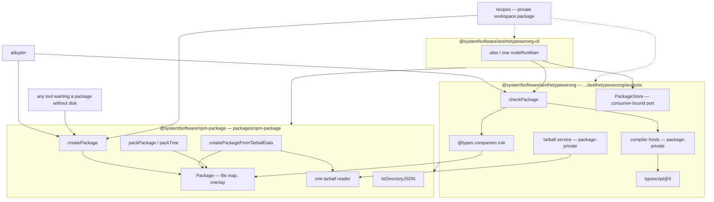

# ATTW Package Split - Capability-Named Tree, Analyser, CLI - Plan

## Goal Capsule

- **Objective:** `@systemfsoftware/arethetypeswrong-core` stops existing. Three published packages replace it: a generic in-memory npm package at a flat capability-named path, the type-resolution analyser named `@systemfsoftware/arethetypeswrong`, and the unchanged-in-purpose CLI. `recipes` publishes from nowhere and the TypeScript compiler hosts stay package-private.
- **Authority:** this plan; issue #230; `AGENTS.md` REPO-A3 / REPO-A5 / REPO-S4 / REPO-R1 / REPO-R2 / REPO-R3 / REPO-D1; `CONSTITUTION.md` CONST-S4 / CONST-E4; the leaf `packages/testing/type-testing/arethetypeswrong/AGENTS.md`.
- **Stop:** no workspace package is named `@systemfsoftware/arethetypeswrong-core`; the tree package builds, tests and typechecks with the analyser absent from its dependency closure; no published `exports["."].types` names `recipes`, `createCompilerHosts`, or a binding ending in `Adapter`; `pnpm version -r --dry-run` exits 0; `pnpm check:local` exits 0.
- **Execution profile:** code, packaging-heavy. The moved source is behaviour-preserving — the existing integration tests are the oracle, and they move with the code they cover. Two units add genuinely new behaviour (the unified tarball reader, the generic overlay) and carry their own scenarios.
- **Tail:** implementer owns simplification, review, changesets, PR. Two debut npm publishes are human-owned and outside the PR.

---

## Product Contract

### Summary

`packages/testing/type-testing/arethetypeswrong/core` splits in three. The in-memory package model — `Package`, `createPackage`, `createPackageFromTarballData`, `packPackage`, `packTree`, `toDirectoryJSON` — becomes `@systemfsoftware/npm-package` at `packages/npm-package`, carrying no `typescript` dependency and naming nothing about type resolution. What is left is the analyser: it keeps `checkPackage`, gains the `@types`-companion rule that used to live on the tree class, and publishes as `@systemfsoftware/arethetypeswrong` from `packages/testing/type-testing/arethetypeswrong/analysis`. The CLI keeps `attw` and its single `nodeRunMain`, and depends on both. The recipe corpus stops being a published export.

Product Contract preservation: new bootstrap from issue #230. Its Acceptance Criteria are carried forward as R1-R12 without narrowing; R13-R18 are plan-discovered obligations the issue does not name.

### Problem Frame

One package holds three unrelated things. The tree code models an npm package as a file map and needs no type knowledge: `pack.ts` imports no TypeScript at all, and `CreatePackage.ts` reaches `typescript` at exactly four call sites, three of which are path string helpers (`ts.ensureTrailingDirectorySeparator` at `CreatePackage.ts:65,79`, `ts.combinePaths` at `CreatePackage.ts:220` and `TarballAdapter.ts:94`). Only `ts.hasTSFileExtension` at `CreatePackage.ts:75`, inside `containsTypes`, is genuinely type-aware — and that member, along with `typesPackage` and `mergedWithTypes`, is the analyser's `@types` companion rule wearing the tree class as a host.

Nothing outside the subtree imports the package: the sole dependant is the CLI. So the cost today is not a broken consumer, it is an absent one — a tool that wants an npm package without touching disk must install the analyser and its `typescript@6` bridge to get it. `core` also names a position in a diagram rather than a capability, which the corpus rules out directly: a name must answer "of what?", and `core` and `util` are junk-drawer names that abandon package-private scope.

The split also removes duplication the single package concealed. `extractTarball` exists twice — `CreatePackage.ts:190-224` and `TarballAdapter.ts:67-98` — both gunzip via `fflate`, untar via `@andrewbranch/untar.js`, strip the leading tarball prefix, read `package.json` for name and version, and re-root every entry under `/node_modules/<name>/`. They differ only in how they validate the manifest and in what they return.

### Key Decisions

- **The tree package is named for the thing it models: one npm package.** Chosen over `npm-package-tree`: the model is a single package with one `packageName` and one `packageVersion`, and in npm vocabulary a "package tree" is a dependency graph, which is what an adopter searching for the name would expect to find. Governs R2, R3.
- **The analyser is renamed, not wrapped.** Chosen over keeping `-core` published as a re-export shim: a shim leaves the layer-named name resolvable, so no consumer migrates and the removal is fictional. Governs R1, R5, R6.
- **The compiler hosts stay inside the analyser.** Chosen over a fourth published package: only `checkPackage` binds them, so publishing them yields a directory with a manifest and one inbound edge. Governs R6.
- **The recipe corpus is a private workspace package, not an export and not a duplicate.** Chosen over duplicating it into two test trees: it has two consumers in two different packages, and a private package publishes nothing. Governs R7, R9.

### Requirements

**Naming and placement**

- R1. No path introduced or renamed by this change, and no `package.json` `"name"` it touches, contains a layer token as a whole directory component or a whole hyphen-delimited npm segment — including any ancestor directory of a package this change creates. The tokens are `core`, `kernel`, `shell`, `adapter`, `adapters`, `executor`, `executors`, `util`, `utils`, `common`, `shared`, `misc`. The tokens remain legal as file-name suffixes, so `TarballAdapter.ts` may keep its filename, and the match is on whole components, so a directory named `core-adjacent` is not a violation while one named `core` is.
- R2. A published package exists whose `"name"` contains no `arethetypeswrong` segment, whose `dependencies` contain no `typescript`, whose built output contains no `typescript` import of any form, and whose built `exports["."].types` names `Package`, `createPackage`, `createPackageFromTarballData`, and `packPackage`.
- R3. That package's directory is matched by a `pnpm-workspace.yaml` glob that `scripts/tools/workspace-map.ts` accepts.

**Published surfaces**

- R4. The tree package's `exports["."].types` names none of `checkPackage`, `containsTypes`, `mergedWithTypes`, `typesPackage`, `recipes`, or a binding ending in `Adapter`.
- R5. `@systemfsoftware/arethetypeswrong` declares the tree package as a dependency, and its own `exports["."].types` names `checkPackage` and does not name `recipes`, `packPackage`, `packTree`, `createCompilerHosts`, or a binding ending in `Adapter`.
- R6. No published package exports the compiler hosts, and the published set resulting from this change is exactly `@systemfsoftware/npm-package`, `@systemfsoftware/arethetypeswrong`, and `@systemfsoftware/arethetypeswrong-cli`.
- R7. `recipes` appears in no `exports` map and no `files` list in any package.
- R8. `nodeRunMain(` appears exactly once across both the arethetypeswrong subtree and the tree package, in the CLI entry, and the `attw` bin stays on the CLI.

**Behaviour preserved**

- R9. The recipe corpus keeps its current identity — one synthetic package per `Problem` kind, plus the types-companion pair and the known-bad tree — and both the analyser's snapshot lane and the CLI's contract lane still drive it.
- R10. `checkPackage` remains the analyser's capability entrypoint with an unchanged call shape: a `Package` plus options in, an `Effect` out.
- R11. Reading a tarball produces the same `Package` file map, package name and package version as before the two extractors were unified, including for the zero-padded-gzip input the current code tolerates.
- R12. `pnpm --filter <tree> test` and `typecheck` pass with the analyser absent from the tree package's resolved dependency closure; `pnpm --filter <analysis> test`, `pnpm --filter @systemfsoftware/arethetypeswrong-cli test`, and `typecheck` for both pass.
- R17. The tree package imports nothing from the analyser, at any specifier and in any file, including its tests. In particular its tarball reader validates the manifest with its own schema rather than the analyser-owned `TarballPackageJsonSchema`.

**Release mechanics**

- R13. No pending change intent names a package absent from the workspace. Every one of the 14 pending `.changeset/*.md` files that names `@systemfsoftware/arethetypeswrong-core` is repaired in this change, in its frontmatter and in its body.
- R14. Each package whose name or exported surface changed carries a `.changeset/` intent naming it, and each new npm name carries a manifest `version` equal to its intended debut version.
- R15. Every `@systemfsoftware/*` edge introduced in `dependencies`, `devDependencies` or `peerDependencies` uses the `workspace:` protocol, except where a registry `catalog:` edge is deliberately used to avoid closing a workspace cycle.
- R16. No stale textual reference to `arethetypeswrong-core` or `arethetypeswrong/core` survives in a file that governs behaviour — manifests, configs, workflow and Dependabot files, the workspace catalog comments, the leaf `AGENTS.md`, and the packages' `README.md`. Historical records are exempt: consumed changelogs under `.changeset/changelogs/`, `.changeset/ledger.yaml`, and prior plans and solution documents under `docs/` are the record of what happened and are not rewritten.
- R18. The tree package ships a `README.md` that teaches a reader who has never seen this repository to do the three things the package exists for: build a package from an authored file tree, pack it to tarball bytes, and read one back. The analyser's changeset body states the migration a current `-core` consumer performs, including that their imports now split across two packages and which published names were dropped.

Requirement ID note: R17 and R18 were added after review and are numbered after R16 rather than inserted, so no existing ID moved.

### Scope Boundaries

- The existing `packages/core/*` families carry the same defect and are out of scope. No new work is placed inside them and none of them is renamed here.
- No cell conversion. See KTD9 — the issue's own prose forbids adding cell machinery here.
- No `typescript` version move. The analyser stays on `catalog:attw` (`typescript@^6.0.3`) because the JS compiler API is the analysis driver.
- No new mutation config. Mutation is opt-in per package via `stryker.config.json`, and neither new package gets one.

R13 and R16 are not adjacent cleanup smuggled in. Both are caused by this change and would break without it: renaming a package makes 14 pending intents name a non-member, which aborts the next release plan outright, and leaves configs pointing at a package that no longer exists. They are in scope because the change creates them.

#### Deferred to Follow-Up Work

Deliverables this change defers:

- Deprecating `@systemfsoftware/arethetypeswrong-core` on npm (`npm deprecate`) so installs of the old name point at the new ones. It is a registry operation, not a repo change, and it is only correct once the replacement names are actually published. Note it is a one-name-to-two redirect and a deprecation message can only carry prose, so the migration itself is carried by R18's changeset body, not by the deprecation.

#### Pre-existing drift, untouched

Neither item below is created by this change, and neither is a non-goal in the sense of "we chose not to build it" — they are defects that predate the branch:

- The orphaned root turbo tasks — `//#check:exports`, `//#check:runtime-deps`, `//#check:lint-coverage`, `//#check:publish-config`, `//#check:umbrella-completeness`, `//#check:exported-wiring` — name root scripts and guard files that no longer exist. They are unreachable from `gate:tasks`, so they neither fail nor protect anything.
- The committed merge-conflict markers in the root `AGENTS.md` around REPO-R2/REPO-R3, present on `origin/main` as well as this branch. A governing document currently states REPO-R2 twice with different content.

### Sources

- Issue #230, whose Acceptance Criteria are R1-R12.
- `repos/deno-std` — the vendored flat-capability layout the placement follows: one directory per capability at the tree root, each with its own manifest, and `internal/` as the only grouping noun.
- npm registry, queried this session: `@systemfsoftware/arethetypeswrong` and `@systemfsoftware/npm-package` both return 404; `@systemfsoftware/arethetypeswrong-core` and `-cli` both return 200.
- `repos/tsdown/src/features/pkg/attw.ts:140-147` — a vendored third-party integration against the upstream `@arethetypeswrong/core`, showing the shape an adopter outside this checkout actually binds: `createPackageFromTarballData(tarball)` then `checkPackage(pkg, options)`, both ordinary functions and no Effect service.
- Software wiki corpus, queried for the extraction-boundary and naming question. It answers both: the capability-naming doctrine (a name must answer "of what?"; layer names and junk drawers are the losers) and the port-publicity rule (a port is public if and only if a consumer binds it at their own composition, and a test requirement alone never widens the public surface). Corpus paths are not cited here — the corpus does not ship with the clone.
- Institutional learnings under `docs/solutions/` that bear on the packaging: `tooling-decisions/tsdown-manages-publishconfig-during-build.md`, `tooling-decisions/changeset-requirement-keys-on-turbo-build-hash.md`, `tooling-decisions/first-publish-under-oidc-trusted-publishing.md`, `tooling-decisions/arethetypeswrong-core-requires-js-typescript-api.md`, `tooling-decisions/registry-consumption-of-self-hosted-forks.md`, `build-errors/exports-types-rollup-drift.md`, `build-errors/dts-emitter-drops-bundled-entry-reexports.md`, `build-errors/tsdown-private-dependency-bare-import-dist.md`, `runtime-errors/pnpm-versioning-unknown-package-deleted-intent.md`, `runtime-errors/pnpm-internal-range-breaks-recursive-versioning.md`.

---

## Planning Contract

### Key Technical Decisions

- KTD1. **The tree package is `@systemfsoftware/npm-package` at `packages/npm-package`.** The deciding criterion is that the name must be free on npm and must name the thing modelled. It models one npm package: `Package` carries a single `packageName` and `packageVersion` and a file map rooted at `/node_modules/<packageName>/` (`CreatePackage.ts:10-93`). `@systemfsoftware/npm-package` returns 404 on the registry, so it is available, and it is the name issue #230's own target table gives. Rejected: `npm-package-tree`, because in npm vocabulary a package tree is a dependency graph — `@npmcli/arborist` describes itself as managing `node_modules` trees and `npm ls` prints one — so the name would send an adopter looking for a graph API and would ship an implementation shape as the capability. Rejected: `npm-tarball` and `npm-archive`, which name the transport rather than the model. Rejected: `package-tree` and `package-map`, which drop the `npm-` qualifier that says which kind of package. The dead unscoped `npm-package@1.0.0` squat is not a reason to avoid the scoped name: the scope disambiguates completely, and an unscoped squat under a different owner is not a name collision. No maintained third-party package covers the capability — `@npmcli/arborist` and `libnpmpack` operate on a real on-disk tree, `pacote` downloads, `npm-packlist` globs, `tar-stream` and `fflate` are codecs, and `memfs` is the projection target rather than a replacement — so extraction rather than adoption is the move. Governs R2, R3.
- KTD2. **`typescript` leaves the tree package by replacing three path helpers, not by shimming them.** `ts.ensureTrailingDirectorySeparator` and `ts.combinePaths` are string operations over POSIX-style paths; the tree package already carries `posixJoin` at `CreatePackage.ts:99`. The fourth call, `ts.hasTSFileExtension` inside `containsTypes`, is not replaced — it leaves with the member. Rejected: keeping `typescript` for the helpers, which the issue names as a non-counting outcome and which would make the generic package install a compiler. The requirement is written against the built output as well as the manifest (R2), because a dynamic `import('typescript')` would satisfy a manifest-only check while violating the intent. Governs R2.
- KTD3. **The two `extractTarball` implementations unify into one in the tree package, and the analyser's tarball service wraps it.** The surviving implementation keeps the streaming-`Gunzip` workaround and the zero-padded-gzip tolerance both copies carry, and returns the file map the `Package` constructor wants; the analyser's service adapts that to its own `ExtractedTarball` shape. Rejected: moving the Effect service itself into the tree package, which would put a binding ending in `Adapter` on the tree's published surface (R4) and force `effect` service machinery on a consumer that only wants bytes in and a file map out. Governs R4, R11, and CONST-S4.
- KTD4. **The tree's `Package` gains a generic overlay; the `@types` companion rule moves to the analyser.** `mergedWithTypes` reaches the private `#files` of another instance, so the merge primitive has to live on the class — but "merge two file trees, later wins" is generic and "the second tree is the `@types` companion of the first" is not. The tree class therefore exposes an unbranded overlay returning a new `Package` and carrying no companion metadata; the analyser holds the companion identity separately. Rejected: keeping `typesPackage` on the tree class, which fails R4 outright. Because the overlay drops the metadata `mergedWithTypes` used to attach, the analyser must hold that identity itself and pair it with the merged tree at the call site — U4 names the shape. Governs R4, R5.
- KTD5. **Four of the five `*Adapter` services are deleted from the analyser's published surface; the one a consumer binds is renamed.** The warrant is adopter-level, not in-tree, because REPO-A5 makes every adopter the audience and this checkout only the first one. What an adopter actually binds against this API is the ordinary function pair: the vendored third-party integration at `repos/tsdown/src/features/pkg/attw.ts:140-147` calls `createPackageFromTarballData` and then `checkPackage`, binding no Effect service at all. No adopter-side binding of `TarballAdapter`, `TypescriptAdapter`, `LexerAdapter` or `ResolverAdapter` exists anywhere reachable, and in-tree the CLI binds only `PackageStoreAdapter` and `PackageStoreAdapterStub` (`cli/src/AttwExecutor.ts:5-6`). By the corpus rule that a port is public if and only if a consumer binds it at their own composition, the four unbound services become package-private and the bound one is renamed to a capability noun without the `Adapter` suffix. This is a real published break, not a no-op: `core/dist/index.d.ts` currently exports all four along with their layers and stubs, so R14's changeset must be a major that enumerates the dropped names (R18). The analyser's own `tests/adapters.integration.test.ts` reaches the newly private ports by relative source path, which is a package-internal path and not the public surface. Governs R5, R18.
- KTD6. **The recipe corpus becomes a private workspace package.** It has two consumers in two packages — the analyser's snapshot and check-package lanes, and the CLI contract lane's `GlobalSetup.ts:1`, which packs every recipe into a tarball and copies the directory into the container. A `"private": true` package publishes nothing: `pnpm ls -r --json` filtered on `.private != true` excludes it, so `pack-all.mjs`, the npm preflight and the release plan never see it. It carries no `files` field deliberately — nothing packs a private package, so `files` would buy nothing, and adding one would put the string `recipes` into a `files` list and violate R7. Rejected: duplicating the corpus into both test trees, which satisfies R7 by making the two lanes drift apart; and deep-importing the analyser's test tree from the CLI, which `turbo boundaries` exists to reject. Governs R7, R9.
- KTD7. **Exports maps change only through `tsdown.config.ts`.** REPO-S4, and the existing config already documents why: the map used to be hand-written and had drifted to four dead subpaths. The analyser also keeps its deliberate absence of a source condition, because publishing one makes every consumer compile files that reach TypeScript's internal API.
- KTD8. **Both new barrels use explicit named re-exports, never `export *`.** The dts bundler prunes re-export clauses that name only value bindings of a non-entry leaf it inlines, so an `export *` barrel can ship a `.d.ts` missing the names R2 and R5 require. Nineteen of the current barrel's 24 lines are `export *`; converting them to named clauses is what makes the R2/R5 checks meaningful rather than incidental.
- KTD9. **The analyser is not converted to a cell.** Issue #230's target diagram labels `checkPackage` as `Cell.apply` and the decide phase as `Workflow.make`. That label is declined here, not overlooked, and the issue's own prose is the warrant: its Orientation paragraph reads "The leaf `AGENTS.md` exempts this tooling from cell lint and mutation gates — do not add either here." An instruction not to add cell machinery in this change outranks a diagram label about the analyser's eventual internals when the two disagree. Three further facts support it: the subtree contains no cell-type usage at all, so there is nothing to preserve (a search for `Cell.`, `Workflow.` and `effect-cell-types` across `packages/testing/type-testing/arethetypeswrong` returns nothing); none of the issue's ten Acceptance Criteria, six Non-Counting Outcomes or three Boundaries mentions a cell, a workflow or a decide phase, so a conversion would ship with no success predicate; and `Cell.apply` is a different call shape from today's, which the issue's own Boundary — "`checkPackage` stays the analyser's capability entrypoint" — and R10 both pin. Doing it would need its own issue carrying its own success predicate and an amendment to the leaf's tooling exemption. U9 rewrites that leaf's stale package names while keeping the exemption clause intact, which is not the same as editing the rule.
- KTD10. **One PR, not a stack.** The layers are not independently green against trunk: the analyser cannot be renamed before its consumers move, and the tree package cannot pass R12 while its source still lives in the analyser. A stack whose bottom layer is red alone was never a stack.
- KTD11. **Debut versions: the tree package at `0.1.0`, the analyser at `4.0.0`.** A new package's manifest `version` is published verbatim as its debut, so the manifest string is the decision, not a placeholder. The asymmetry is the signal, not an inconsistency: the tree package starts a line and says so with `0.1.0`, while the analyser continues the `-core` line's `3.0.0` across a renaming break so a migrating consumer reading the two changelogs side by side sees a sequence rather than a restart. The cold registry reader who never saw `-core` meets a package whose first version is `4.0.0` and no `1`-`3`; R18's changeset body is where that is explained, because the body is the only thing such a reader has.

### High-Level Technical Design

The dependency shape after the split. Dashed edges are dev-only.

The member-by-member disposition of today's `core/src`, which is the part an implementer most needs to not re-derive:

| Today                                                                                                       | Goes to                                    | Why                                                                                                                      |
| ----------------------------------------------------------------------------------------------------------- | ------------------------------------------ | ------------------------------------------------------------------------------------------------------------------------ |
| `Package` file map, `tryReadBytes`, `tryReadFile`, `readFile`, `fileExists`, `directoryExists`, `listFiles` | tree                                       | No type knowledge; `directoryExists`/`listFiles` lose their `ts.ensureTrailingDirectorySeparator` call to a local helper |
| `containsTypes`                                                                                             | analyser, as a function over `listFiles`   | The only genuinely type-aware member; it is the `@types` companion rule                                                  |
| `typesPackage` field, `mergedWithTypes`                                                                     | analyser; tree keeps a generic overlay     | R4 forbids both names on the tree's surface                                                                              |
| `createPackage`, `toDirectoryJSON`, `DirectoryJSON`                                                         | tree                                       | Authored-tree construction and the memfs projection are transport-free                                                   |
| `createPackageFromTarballData`, `extractTarball`                                                            | tree                                       | The bytes-to-file-map path; its `ts.combinePaths` call goes to a local helper                                            |
| `packPackage`, `packTree`, the ustar builder                                                                | tree                                       | `pack.ts` already imports no TypeScript                                                                                  |
| `TarballAdapter` service, layers, error                                                                     | analyser, package-private                  | No adopter or in-tree consumer binds it; it wraps the tree's reader                                                      |
| `PackageStoreAdapter` service, layers                                                                       | analyser, renamed off the `Adapter` suffix | The CLI's composition binds it                                                                                           |
| `TypescriptAdapter`, `LexerAdapter`, `ResolverAdapter`                                                      | analyser, package-private                  | No adopter or in-tree consumer binds them                                                                                |
| `createCompilerHosts`                                                                                       | analyser, stays package-private            | One inbound edge, from `checkPackage`                                                                                    |
| `recipes`                                                                                                   | private workspace package                  | Two cross-package test consumers, published from nowhere                                                                 |
| Everything else — schemas, checks, `internal/`, resolution matrix                                           | analyser                                   | The product                                                                                                              |

### Assumptions

- The analyser keeps its published `files` list but drops `src` from it, so no unexported source ships. The current `files: ["dist", "src", "LICENSE"]` publishes source that no export condition points at, which is dead weight in the tarball.
- The tree package does not wire the schema-law or schema-vite plugins, so it needs no generated `schema-laws.test.ts` placeholder. The analyser's existing placeholder (a two-line `export {}` the `effect-schema-vite` plugin rewrites) moves with its directory.
- The tree package may devDepend on `@systemfsoftware/effect-memfs` with the `workspace:` protocol without closing a cycle. `memfs` does dev-depend on the CLI, but through the registry catalog (`packages/core/effect/filesystem/memfs/package.json:53` declares `"@systemfsoftware/arethetypeswrong-cli": "catalog:attw"`), which is the repo's documented mechanism for exactly this: a consumer that must not close a workspace cycle resolves through the catalog instead of `workspace:^`. Only a `workspace:` edge would close one.

### Risks and Dependencies

- **A pending intent naming a vanished package fails the entire release plan, not just the intent.** Renaming `-core` removes that name from the workspace, and 14 pending `.changeset/*.md` files name it: `array-type-spelling`, `attw-effect-native-cache`, `attw-in-memory-package-dsl`, `attw-kernel-renames`, `cell-type-tests-never-published`, `cyan-wombats-own`, `debut-releases-gain-oidc`, `lint-toolchain-rehash-only`, `modern-ends-know`, `package-class-is-public`, `parse-error-is-constructed`, `peer-ranges-accept-compatible-rc`, `projections-collapsed-into-ports`, `update-effect-rc-111-and-tsgo`. `pnpm version -r` refuses the whole plan with `ERR_PNPM_VERSIONING_UNKNOWN_PACKAGE`, deterministically, on every subsequent push to `main`. This is the highest-consequence item in the change and it is invisible to every PR check except the dry-run in U8.
- **Two of those intents mix claims about both halves of the split** and cannot be re-pointed by editing a name. `attw-in-memory-package-dsl` opens with "`checkPackage` can now analyse a package built entirely in memory" and then describes `createPackage`, `toDirectoryJSON`, `recipes`, `packPackage` and `packTree`; `package-class-is-public` announces the `Package` class as a public export. After the split those sentences describe two different packages and one thing that is no longer published at all. Since a changeset body ships verbatim to a consumer who has never seen this repository, re-pointing the frontmatter alone would publish a false claim.
- **Neither new npm name exists, and OIDC trusted publishing cannot debut a package.** Both `@systemfsoftware/arethetypeswrong` and `@systemfsoftware/npm-package` return 404 today. The release workflow's preflight fails closed on exactly this class, which is the good outcome — the alternative is `pnpm publish -r` publishing what it can reach and aborting mid-batch on an OIDC auth error, leaving a partial publish. Resolving it is a one-time maintainer action from a maintainer machine, it needs npm >= 11.15.0 and interactive 2FA, and publishing is human-owned under REPO-P1. It is a handoff item, not a PR step.
- **The repo's own workspace map accepts only `<dir>/*` globs.** `scripts/tools/workspace-map.ts:70` throws on any `packages:` entry that does not end in `/*`, and `:141-146` derives a prefix by stripping the `/*` and then enumerates the prefix's _subdirectories_ looking for a manifest. So a bare `packages/npm-package` entry hard-errors the map, and a `packages/npm-package/*` entry parses but looks for manifests one level too deep and reports the package under `outside`. The entry that works is `packages/*`, which is also what the issue names.
- **The exports contract is checked by a build artifact, not by source.** R2, R4, R5 and R7 are claims about a built package. A `.d.ts` that silently loses a name to the dts bundler's re-export pruning passes every source-level check. The verification for those requirements therefore reads the built declaration file on a clean `dist`, and KTD8 is what makes that reading stable.
- **Renaming a directory plus a package name plus a dependency edge in one change is where `workspace:` protocol slips happen.** A bare range on an internal edge produces `ERR_PNPM_VERSIONING_INTERNAL_RANGE` from the same dry-run that catches the stale intents, which is why R13 and R15 share a gate.
- **The CLI contract lane is the only cross-package consumer of the recipe corpus** and it runs in a container against a stub registry, so a mistake in KTD6's wiring surfaces as a testcontainers failure minutes into `test:contract` rather than as a type error.

### Sequencing

U1 through U3 stand up the tree package and can be verified before anything is renamed. U4 is the pivot: it renames the analyser and re-points it at the tree package, so U1-U3 must land first. U5 and U6 shrink the analyser's surface and can proceed in either order once U4 is in. U7 re-points the CLI and depends on U4, U5 and U6. U8 repairs the release plan and must come after every manifest edit. U9 is the audit that makes R1 and R16 checkable rather than assumed, and it runs last because it reads the finished tree.

---

## Implementation Units

### U1. Register and scaffold `packages/npm-package`

- **Goal:** a workspace-registered, buildable published package at the flat capability-named path, with a README that teaches its capability.
- **Requirements:** R1, R3, R14, R18. KTD1, KTD11.
- **Dependencies:** none.
- **Files:**
  - `pnpm-workspace.yaml` — add the `packages/*` glob
  - `packages/npm-package/package.json`
  - `packages/npm-package/tsdown.config.ts`
  - `packages/npm-package/tsconfig.json`, `tsconfig.build.json`, `tsconfig.node.json`, `tsconfig.test.json`
  - `packages/npm-package/vitest.config.ts`
  - `packages/npm-package/oxlint.config.ts`
  - `packages/npm-package/src/index.ts` — created here as an empty-surface placeholder so the build has its entry; U2 fills it
  - `packages/npm-package/README.md`, `LICENSE`, `.attw.json`
- **Approach:**
  1. Add `- packages/*` to the `packages:` list in `pnpm-workspace.yaml`. It must end in `/*` or `pnpm map` throws, and the prefix must be the parent of the package directory or the map looks one level too deep. `packages/*` also matches `packages/core`, `packages/testing`, `packages/lint` and `packages/toolchain`, which carry no `package.json` and are therefore skipped by both pnpm and the map.
  2. Run `pnpm install` after editing the workspace file. Every later `pnpm --filter` and `pnpm map` invocation depends on the new entry being installed.
  3. Copy the config set from `packages/testing/type-testing/arethetypeswrong/core`, which is the closest publication shape: same `type: module`, same `.mjs`/`.d.ts` out-extensions, same `prepack`. Strip what does not apply — the analyser's `tsconfig.build.json` models TypeScript's internal API and the tree package needs none of that, and its `vitest.config.ts` schema-plugin wiring is deliberately not copied.
  4. Manifest: `version` is `0.1.0` per KTD11; `repository.directory` is exactly `packages/npm-package`, because npm rejects a mismatch against the physical path at publish; `files` lists `dist`, `README.md` and `LICENSE` and not `src`.
  5. Runtime dependencies are `@andrewbranch/untar.js`, `fflate` and `effect` only. No `typescript`. Nothing private in `dependencies` — a private workspace helper there leaves a bare import in `dist` that breaks outside the monorepo.
  6. `tsdown.config.ts` owns the exports map (KTD7), single entry `src/index.ts`, and lists the runtime dependencies under `deps.neverBundle`.
  7. The README is the adoption thesis of the whole split, so it is content, not a placeholder: it shows building a package from an authored file tree, packing it to bytes, and reading bytes back, and it states that the package carries no TypeScript dependency and knows nothing about type resolution. It names no path inside this repository.
- **Patterns to follow:** `packages/testing/type-testing/arethetypeswrong/core/{package.json,tsdown.config.ts,oxlint.config.ts}`. The oxlint config is one line extending `@systemfsoftware/oxlint-config/base`.
- **Test expectation: none — scaffolding with no behaviour.** Verification is that the package is discoverable and builds.
- **Verification:** `pnpm map` exits 0, lists the package, and reports nothing under `outside`; `pnpm --filter @systemfsoftware/npm-package build` produces `dist/index.mjs` and `dist/index.d.ts`; the generated `exports` map appears in `package.json` without having been hand-edited; `repository.directory` string-equals the package's physical path.

### U2. Move the tree source in, drop `typescript`, unify the tarball reader

- **Goal:** the tree package holds the whole tree capability, imports no `typescript` and nothing from the analyser, and reads a tarball through exactly one implementation.
- **Requirements:** R2, R4, R11, R17. KTD2, KTD3, KTD4, KTD8.
- **Dependencies:** U1.
- **Files:**
  - `packages/npm-package/src/Package.ts` (from `core/src/CreatePackage.ts`)
  - `packages/npm-package/src/pack.ts` (from `core/src/pack.ts`)
  - `packages/npm-package/src/Tarball.ts` — the unified reader and its own manifest schema
  - `packages/npm-package/src/Path.ts` — the local POSIX helpers
  - `packages/npm-package/src/index.ts` — named re-exports only
  - deleted: `core/src/pack.ts`; reduced: `core/src/CreatePackage.ts`
- **Approach:**
  1. Move the file map, the accessors, `createPackage`, `toDirectoryJSON` and `DirectoryJSON`, `createPackageFromTarballData`, and all of `pack.ts`.
  2. Replace `ts.ensureTrailingDirectorySeparator` and `ts.combinePaths` with local helpers beside the existing `posixJoin`. Delete the `typescript` import. Do not reintroduce it dynamically.
  3. Move `containsTypes`, the `typesPackage` field and `mergedWithTypes` out — they are U4's inbound work. In their place the class exposes one generic overlay: given another `Package`, return a new `Package` whose file map is this one's entries overridden by the other's, carrying this package's own name and version and no companion metadata. Neither input is mutated.
  4. Unify the two extractors into `Tarball.ts`: keep the streaming `Gunzip` push and the zero-padded-gzip tolerance, and re-root entries under `/node_modules/<name>/` through the local path helper. Validate `{name, version}` with a schema defined in this file — do not import `TarballPackageJsonSchema` from the analyser's `NpmRegistry.schema.ts`, which stays behind (R17). `createPackageFromTarballData` calls it.
  5. `index.ts` re-exports by name — `Package`, `createPackage`, `createPackageFromTarballData`, `packPackage`, `packTree`, `toDirectoryJSON`, `DirectoryJSON` — never `export *` (KTD8).
- **Patterns to follow:** the surviving reader keeps the comment at `CreatePackage.ts:191` explaining why the streaming API is used; that comment is the reason the workaround survives a refactor.
- **Test scenarios:**
  - A tarball packed by `packPackage` from an authored tree, read back by `createPackageFromTarballData`, yields the same file map, package name and package version as the source `Package`.
  - A tarball whose gzip stream is zero-padded still reads, producing the same result as the unpadded bytes — this is the tolerance both old copies carried and the one behaviour a naive unification drops.
  - A tarball with no `package.json` under the leading prefix fails with an error naming the missing path.
  - A tarball whose `package.json` is valid JSON but lacks `name`, or lacks `version`, fails rather than producing a `Package` with an undefined name.
  - A scoped package name round-trips: entries land under `/node_modules/@scope/name/` on both the pack and the read side.
  - `createPackage` refuses a tree with no `package.json`, and relative paths land under `/node_modules/<packageName>/` while an already-absolute path under that prefix is left alone.
  - `listFiles` and `directoryExists` behave identically for a directory argument given with and without a trailing separator — the behaviour that came from `ts.ensureTrailingDirectorySeparator` and now comes from the local helper.
  - `tryReadBytes` returns the raw bytes for a binary body even after `tryReadFile` has been called on a different path, so the text-decode cache does not corrupt a byte body the packer will read.
  - The overlay returns a new `Package` in which the other tree's entry wins for a colliding path and both trees' unique entries survive; neither input is mutated; the result carries the receiver's name and version.
  - `toDirectoryJSON` projects the same tree to a value keyed by the same paths, with `null` preserved for the entries that carry it.
- **Verification:** a search for `typescript` across `packages/npm-package/src` returns nothing, and a search for `typescript` and for `arethetypeswrong` across the built `packages/npm-package/dist` returns nothing; `pnpm --filter @systemfsoftware/npm-package typecheck build` passes.

### U3. Move the tree tests in and prove independence

- **Goal:** the tree package's tests live with it and pass with the analyser absent from its resolved dependency closure.
- **Requirements:** R12, R17.
- **Dependencies:** U2.
- **Files:**
  - `packages/npm-package/tests/package-tree.integration.test.ts` (from `core/tests/`)
  - `packages/npm-package/tests/package-tree-memfs.integration.test.ts` (from `core/tests/`)
  - `packages/npm-package/tests/tarball-extract.integration.test.ts` (from `core/tests/`)
  - deleted from `core/tests/`: the same three files
- **Approach:**
  1. Move the three tree-facing test files; re-point their imports from the old package name to the tree package's name.
  2. Any assertion in them that reaches `checkPackage`, `containsTypes` or `mergedWithTypes` stays behind in the analyser — split the file rather than dragging an analysis assertion into a package that cannot import the analyser.
  3. The memfs test needs `@systemfsoftware/effect-memfs` as a devDependency, on the `workspace:` protocol. This does not close a cycle: `memfs` reaches the CLI through the registry catalog, not a workspace edge (`packages/core/effect/filesystem/memfs/package.json:53`), which is the repo's documented mechanism for that case.
- **Test scenarios:** the moved scenarios are U2's oracle and are not restated here. The unit's own claim is independence, verified by command rather than by assertion.
- **Verification:** `pnpm --filter @systemfsoftware/npm-package test typecheck` passes; and the analyser appears nowhere in the tree package's _resolved_ dependency closure, not merely absent from its manifest — check the installed tree, since a devDependency could reintroduce it transitively.

### U4. Rename the analyser and re-point it at the tree package

- **Goal:** `packages/testing/type-testing/arethetypeswrong/analysis` publishes `@systemfsoftware/arethetypeswrong@4.0.0`, depends on the tree package, and owns the `@types` companion rule.
- **Requirements:** R1, R5, R10, R15. KTD4, KTD8, KTD11.
- **Dependencies:** U3.
- **Files:**
  - directory move: `.../arethetypeswrong/core/` to `.../arethetypeswrong/analysis/`
  - `.../analysis/package.json` — name, version, `repository.directory`, dependency on the tree package, `files` without `src`
  - `.../analysis/src/TypesCompanion.ts` — `containsTypes` and the companion identity
  - `.../analysis/src/index.ts` — named re-exports
  - `.../analysis/tsdown.config.ts` — add the tree package to `neverBundle`
  - every `.../analysis/src/**` file that used the moved members
  - `.../analysis/tests/snapshots.integration.test.ts`, `check-package.integration.test.ts`, `entrypoint-info.integration.test.ts`, `adapters.integration.test.ts` — all four still import the old package name at their first lines and must be re-pointed
- **Approach:**
  1. Move the directory before editing anything inside it, so the diff reads as a rename plus edits rather than a delete plus add. The existing `packages/testing/type-testing/arethetypeswrong/*` glob keeps matching, so no workspace entry changes.
  2. Rename the package to `@systemfsoftware/arethetypeswrong`, set `version` to `4.0.0`, and correct `repository.directory` to the new physical path.
  3. Add `@systemfsoftware/npm-package` to `dependencies` with the `workspace:` protocol, and to `deps.neverBundle` in `tsdown.config.ts` so it stays an external import in `dist` rather than being inlined.
  4. Land `containsTypes` as a function over a `Package`'s `listFiles`, keeping `ts.hasTSFileExtension` as its predicate — this is the one place `typescript` is genuinely required for the tree-adjacent behaviour.
  5. Land the companion identity that `typesPackage` and `mergedWithTypes` used to carry. Because the tree's overlay returns a `Package` with no companion metadata (KTD4), the analyser holds the companion's name, version and resolved URL in its own value and pairs it with the merged tree — a pair of the overlaid `Package` and the companion identity, threaded to wherever `checkPackage` reads `typesPackage` today. R11 requires the resolution trace to come out identical, so the pairing must reach every current reader of that field, not just the merge site.
  6. Convert `index.ts` from 19 `export *` lines to named clauses (KTD8). The survivor set is today's 24 exported groups minus the tree members, `recipes`, and the four unbound services U6 removes — the schemas, problem and resolution types, `CheckPackage`/`CheckPackageLive`, and the entrypoint and module-kind surfaces all stay, because the CLI imports them. Enumerate them from the current barrel rather than from memory.
  7. Check whether the `injectTypes` helper at the top of the config is still needed once the barrel is named clauses, and delete it if the generated map already carries `types` per entry.
- **Patterns to follow:** the directory-move-then-edit ordering and the `repository.directory`-matches-physical-path rule both come from the prior packages-folder restructuring. The `neverBundle` addition mirrors how the CLI already externalises its dependency on the analyser.
- **Test scenarios:**
  - `checkPackage` over the `TypesCompanion` recipe pair reports the same problem set, and the same resolution trace including the companion's name and version, as before the move — this is the assertion that proves the relocated companion rule is equivalent to the old `mergedWithTypes` path.
  - `containsTypes` returns true for a tree carrying a `.d.ts` and false for a tree of only `.js`, for both the root directory and a nested one.
  - A tree whose only type file sits outside the queried directory reports false, so the directory argument is still honoured.
  - `checkPackage` still accepts a `Package` constructed by the tree package's `createPackage` and returns an `Effect`, with no change to its call shape.
- **Verification:** `pnpm --filter @systemfsoftware/arethetypeswrong test typecheck build` passes; the built `dist/index.d.ts` names `checkPackage`; nothing under `.../analysis` imports the old package name.

### U5. Make the recipe corpus a private workspace package

- **Goal:** `recipes` reaches both test lanes and no published surface.
- **Requirements:** R7, R9. KTD6.
- **Dependencies:** U4.
- **Files:**
  - `packages/testing/type-testing/arethetypeswrong/recipes/package.json` — `"private": true`, deliberately no `files` field
  - `packages/testing/type-testing/arethetypeswrong/recipes/src/index.ts` (from `core/src/recipes.ts`)
  - `packages/testing/type-testing/arethetypeswrong/recipes/tsconfig*.json`
  - `.../analysis/tests/check-package.integration.test.ts`, `.../analysis/tests/snapshots.integration.test.ts` — re-pointed
  - `.../analysis/package.json` — devDependency on the recipes package
  - deleted: `.../analysis/src/recipes.ts`
- **Approach:**
  1. Create the private package. It is matched by the existing `packages/testing/type-testing/arethetypeswrong/*` glob, so `pnpm-workspace.yaml` needs no further change. Follow the `@systemfsoftware/vitest-config` shape: `"private": true`, a root `exports` entry, no publish scripts. Omit `files` on purpose — nothing packs a private package, and adding the field would put the string `recipes` in a `files` list and break R7.
  2. Its runtime dependency is the tree package (recipes call `createPackage`), on the `workspace:` protocol. It must not depend on the analyser — the recipes are file trees, not analyses, and `recipes.ts` imports only `createPackage` today.
  3. Move `recipes.ts` in and re-point the two analyser tests to the new package name, added to the analyser's `devDependencies`.
  4. The `TypesCompanion` pairing at `snapshots.integration.test.ts:36` currently calls `pkg.mergedWithTypes(...)`; it now goes through U4's analyser-side companion composition.
- **Patterns to follow:** `packages/toolchain/vitest-config/package.json` for the private-package manifest shape.
- **Test scenarios:**
  - Every `Problem` kind the analyser reports is produced by at least one recipe, asserted against the kind set rather than against a snapshot — a snapshot regenerated from the system under test is a silent pass.
  - The known-bad recipe is still rejected by `checkPackage`, and the types-companion pair still produces the companion analysis.
  - The recipe corpus is importable from a package that does not depend on the analyser, which is what the CLI lane needs in U7.
- **Verification:** `pnpm --filter @systemfsoftware/arethetypeswrong test` passes; `pnpm ls -r --depth=-1 --json` filtered on `.private != true` does not list the recipes package.

### U6. Shrink the analyser's port surface

- **Goal:** no published binding of the analyser ends in `Adapter`, and the compiler hosts stay package-private.
- **Requirements:** R5, R6. KTD5.
- **Dependencies:** U4.
- **Files:**
  - `.../analysis/src/index.ts`
  - `.../analysis/src/PackageStoreAdapter.ts` — bindings renamed; the file name may stay, since a layer token is legal as a file suffix
  - `.../analysis/src/TarballAdapter.ts` — now wraps the tree package's reader; no longer exported from the barrel
  - `.../analysis/src/CheckPackageExecutor.ts` — an internal binder of the store port, at its import, its type requirement and its yield
  - `.../analysis/tests/adapters.integration.test.ts` — currently imports all five services by package name; switches to relative source paths
- **Approach:**
  1. Drop `TarballAdapter`, `TypescriptAdapter`, `LexerAdapter` and `ResolverAdapter` and their layers, stubs and errors from the barrel. Keep the modules — only the barrel re-export goes, since the analyser still binds them internally.
  2. Rename the one consumer-bound port off the suffix: the service, its live layer and its stub become capability-named. Its `Context.Service` tag string moves from `'@systemfsoftware/arethetypeswrong-core/PackageStoreAdapter'` to `'@systemfsoftware/arethetypeswrong/PackageStore'`. The four package-private services keep their tag strings' shape but must also have the old package prefix re-pointed, or the next maintainer copies a prefix naming a package that no longer exists — all five tags carry it today.
  3. The rename reaches `CheckPackageExecutor.ts`, which binds the store port internally at three points: its import, its context type requirement, and its `yield`. It is not a consumer-facing change but it will not typecheck if missed.
  4. Re-point `TarballAdapter.ts` at the tree package's unified reader, adapting the file map to its `ExtractedTarball` shape rather than re-implementing gunzip and untar.
  5. `adapters.integration.test.ts` reaches the newly private services by relative source path — a package-internal path, not the public surface. All five of its current imports go through the package name and must change.
  6. Confirm `createCompilerHosts` is absent from the barrel; it is already only imported by `CheckPackage.ts:7`.
- **Test scenarios:**
  - The renamed store port's live layer resolves a spec to a tarball reference and its stub returns the injected tarball, unchanged from the current behaviour — the CLI binds both.
  - The tarball service, reached internally, returns the same `ExtractedTarball` for a given tarball as it did before it delegated to the tree package, including the `/node_modules/<name>/` re-rooting and the omission of the top-level `package.json` entry.
  - The four newly private services still work when bound internally, proving the removal was a surface change and not a behaviour change.
- **Verification:** the built `dist/index.d.ts` contains no exported name ending in `Adapter`, none of the four removed service names, and no `createCompilerHosts`; `pnpm --filter @systemfsoftware/arethetypeswrong test typecheck build` passes.

### U7. Re-point the CLI

- **Goal:** the CLI compiles and its contract lane runs against the three-package shape, with one `nodeRunMain`.
- **Requirements:** R8, R12, R15.
- **Dependencies:** U4, U5, U6.
- **Files:**
  - `.../cli/package.json` — dependency on the analyser under its new name, dependency on the tree package, devDependency on the recipes package
  - `.../cli/tsdown.config.ts` — `neverBundle` entries
  - `.../cli/src/AttwExecutor.ts`, `GetExitCode.schema.ts`, `GetExitCode.ts`, `ProblemUtils.ts`, `Profiles.ts`, `Render.ts`, `RenderAscii.ts`, `RenderTyped.ts` — the eight importers of the old package name
  - `.../cli/tests/__fixtures__/GlobalSetup.ts`
- **Approach:**
  1. Manifest edits, all on the `workspace:` protocol: replace the `@systemfsoftware/arethetypeswrong-core` dependency with `@systemfsoftware/arethetypeswrong`, add `@systemfsoftware/npm-package` as a dependency, and add the private recipes package as a devDependency (the contract lane needs it, production does not).
  2. Re-point all eight `src` import sites, and update `AttwExecutor.ts` to the renamed store port and stub.
  3. `GlobalSetup.ts:1` splits into two imports: `packPackage` from the tree package and `recipes` from the recipes package. Its `WORKSPACE_PACKAGES` list at lines 24-27 names the tarballs the container installs and must carry the new analyser name.
  4. Add the tree package to `deps.neverBundle` alongside the analyser, so neither is inlined into the CLI's `dist`.
  5. `main.ts` needs no change: it wires only CLI-local ports and holds the single `nodeRunMain` at line 42.
- **Patterns to follow:** the existing `neverBundle` list in `cli/tsdown.config.ts` already externalises the analyser; the new entry is the same shape.
- **Test scenarios:**
  - The contract lane installs the packed tarballs into the container, relinks the `attw` bin, and the binary runs — the existing precondition assertions carry over unchanged under the new package names.
  - `attw` over each packed recipe tarball produces the same exit code and the same problem rendering per kind as before the split.
  - The `--pack` path and the from-registry path both still resolve through the renamed store port.
  - A recipe whose entrypoint set includes `./macros` still has it excluded from the CLI's reported entrypoints, preserving the assertion at `cli-contract.integration.test.ts:146-149`.
- **Verification:** `pnpm --filter @systemfsoftware/arethetypeswrong-cli test typecheck build` passes; `pnpm --filter @systemfsoftware/arethetypeswrong-cli test:contract` passes.

### U8. Repair the release plan

- **Goal:** the pending intents describe only live workspace packages and make only true claims, and every changed publishable surface carries an intent.
- **Requirements:** R13, R14, R15, R18.
- **Dependencies:** U1 through U7 — every manifest edit must be in the tree before the plan is computed.
- **Files:**
  - the 14 `.changeset/*.md` files named in Risks
  - new `.changeset/*.md` intents for the tree package, the analyser, and the CLI
- **Approach:**
  1. For the 12 intents whose bodies describe analyser behaviour or are `none` rehash bookkeeping, re-point the frontmatter name to `@systemfsoftware/arethetypeswrong`. An intent left naming the vanished package aborts the whole plan.
  2. For the two mixed intents, editing the name is not enough, because the body would then publish a false claim. `attw-in-memory-package-dsl` splits: the `checkPackage` sentence stays with the analyser, the `createPackage`/`toDirectoryJSON`/`packPackage`/`packTree` sentences become an intent on the tree package, and the `recipes` sentence goes — it names something no package publishes any more. `package-class-is-public` moves wholly to the tree package, since `Package` is now that package's export.
  3. Author the new intents with `pnpm change --bump`. The bumps: `minor` for the tree package's debut surface, `major` for the analyser (renamed package, removed exports). For the CLI, run `pnpm change` and then reconcile the level against what the dry-run's plan actually shows, rather than assuming the existing `patch` in `attw-in-memory-package-dsl-cli` still fits after its dependency edges changed.
  4. Write the bodies for the consumer, not for this repository. A changeset body ships verbatim as the published CHANGELOG entry, read by someone who installed from a registry and has never seen this repo. No module path, no file, no gate or script name, no test count, no review severity. The analyser's body must carry the R18 migration: the package was renamed, the in-memory package model now installs separately so imports split across two packages, and these published names were dropped. It should also account for the version jump, since the reader meets a package whose first version is `4.0.0`.
  5. Cross-check the analyser's body against its own built `exports["."].types` rather than against the diff — the note is a claim about the published artifact.
- **Test expectation: none — release metadata with no runtime behaviour.** The dry-run is the check.
- **Verification:** `pnpm version -r --dry-run` exits 0 and its plan names no package absent from the workspace; a search for `arethetypeswrong-core` across `.changeset/*.md` returns nothing in frontmatter or bodies; `pnpm exec commitlint` accepts the commits.

### U9. Audit the names and sweep the stale references

- **Goal:** R1 and R16 are checked facts rather than assumptions.
- **Requirements:** R1, R2, R4, R5, R6, R7, R8, R16, R18.
- **Dependencies:** U1 through U8.
- **Files:**
  - `.../arethetypeswrong/AGENTS.md` — the leaf delta, whose heading and every clause name `core`
  - `.../analysis/README.md`, `.../cli/README.md`
  - `.github/dependabot.yml:27`
  - `pnpm-workspace.yaml` — the `catalogs.attw` comment block at lines 72-80 names the old package
- **Approach:**
  1. Run the layer-token audit over `git ls-files` and over every `package.json` `"name"` the change touches. Match whole path components and whole hyphen-delimited npm segments, not substrings, so `core-adjacent` does not trip and a nested `core/` does not escape.
  2. Read the three built `dist/index.d.ts` files on a clean `dist` and check the surface claims: the tree names `Package`, `createPackage`, `createPackageFromTarballData`, `packPackage` and none of the forbidden set; the analyser names `checkPackage` and none of the forbidden set; neither names `createCompilerHosts` or any binding ending in `Adapter`.
  3. Check the published set is exactly the three named in R6, by name and not by count.
  4. Sweep the stale textual references in files that govern behaviour. Leave the historical record alone — consumed changelogs, `.changeset/ledger.yaml`, and prior plans and solution documents under `docs/` record what happened and are not rewritten.
  5. Rewrite the leaf `AGENTS.md` delta to name the packages it now governs, keeping its three live clauses intact: the `prepack`/`prepare` build requirement, the tooling exemption from cell lint and mutation gates, and the `catalog:attw` pin. Renaming stale package names in that file is not the same as changing the rules it states. Note that the tree package sits outside this leaf's directory, so the exemption does not cover it — and it needs no coverage, because it has no cell-suffixed files and no `stryker.config.json`.
  6. Read the tree package's README as a cold reader would and confirm it teaches the three capabilities R18 names and cites no path inside this repository.
- **Test expectation: none — this unit is the audit.** Its output is the evidence for the Definition of Done.
- **Verification:** the audit commands in the Verification Contract all pass; `pnpm check:local` exits 0.

---

## Verification Contract

Each row names the command that decides the requirement. A requirement whose gate is a built artifact is read from `dist` after a clean build, never from source.

| Requirement                       | Gate                                                                                                                                                                                                                                                                                                                                                                                                        |
| --------------------------------- | ----------------------------------------------------------------------------------------------------------------------------------------------------------------------------------------------------------------------------------------------------------------------------------------------------------------------------------------------------------------------------------------------------------- |
| R1 layer tokens                   | `git ls-files` and every touched `package.json` `"name"`, matched on whole path components and whole hyphen-delimited segments — no hit                                                                                                                                                                                                                                                                     |
| R2 tree surface, no `typescript`  | `packages/npm-package/dist/index.d.ts` names the four required bindings; the manifest's `dependencies` has no `typescript`; a search for `typescript` under both `packages/npm-package/src` and the built `dist` is empty                                                                                                                                                                                   |
| R3 workspace membership           | `pnpm map` exits 0 (it throws on a non-`/*` glob), lists the package, and reports nothing under `outside`                                                                                                                                                                                                                                                                                                   |
| R4 tree surface exclusions        | `packages/npm-package/dist/index.d.ts` names none of `checkPackage`, `containsTypes`, `mergedWithTypes`, `typesPackage`, `recipes`, or a binding ending in `Adapter`                                                                                                                                                                                                                                        |
| R5 analyser surface               | `.../analysis/dist/index.d.ts` names `checkPackage` and none of `recipes`, `packPackage`, `packTree`, `createCompilerHosts`, or a binding ending in `Adapter`; the manifest declares the tree package                                                                                                                                                                                                       |
| R6 hosts private, three published | No built `dist/index.d.ts` names `createCompilerHosts`, any binding ending in `Adapter`, or the four removed service names; `pnpm ls -r --depth=-1 --json` filtered on `.private != true` contains exactly `@systemfsoftware/npm-package`, `@systemfsoftware/arethetypeswrong` and `@systemfsoftware/arethetypeswrong-cli` from this change's directories, checked by name rather than by a repo-wide count |
| R7 recipes unpublished            | No manifest anywhere names `recipes` in an `exports` map or a `files` list — both fields checked; the recipes package is `"private": true` and has no `files` field                                                                                                                                                                                                                                         |
| R8 one entry point                | A search for `nodeRunMain(` under `packages/testing/type-testing/arethetypeswrong` returns exactly one match, in the CLI entry, and under `packages/npm-package` returns none                                                                                                                                                                                                                               |
| R9, R10, R11 behaviour            | `pnpm --filter @systemfsoftware/npm-package test`, `pnpm --filter @systemfsoftware/arethetypeswrong test`, `pnpm --filter @systemfsoftware/arethetypeswrong-cli test`                                                                                                                                                                                                                                       |
| R12, R17 independence             | `pnpm --filter @systemfsoftware/npm-package test typecheck` passes, and the analyser is absent from that package's _resolved_ dependency closure in the installed tree, not merely from its manifest; then `typecheck` for the analyser and the CLI                                                                                                                                                         |
| R13, R15 release plan             | `pnpm version -r --dry-run` exits 0; a search for `arethetypeswrong-core` across `.changeset/*.md` is empty in both frontmatter and bodies                                                                                                                                                                                                                                                                  |
| R14 intents                       | Each changed publishable package name appears in the frontmatter of at least one `.changeset/*.md`; each new package's manifest `version` is its intended debut (`0.1.0` and `4.0.0`); `pnpm exec commitlint` accepts the commits                                                                                                                                                                           |
| R16 stale references              | A search for `arethetypeswrong-core` and `arethetypeswrong/core` outside `.changeset/changelogs/`, `.changeset/ledger.yaml` and `docs/` is empty                                                                                                                                                                                                                                                            |
| R18 adopter docs                  | The tree package's `README.md` shows construction, packing and reading, and names no in-repo path; the analyser's changeset body names the rename, the two-package import split, and the dropped published names                                                                                                                                                                                            |
| Contract lane                     | `pnpm --filter @systemfsoftware/arethetypeswrong-cli test:contract`                                                                                                                                                                                                                                                                                                                                         |
| Whole tree                        | `pnpm check:local` exits 0, run after the last edit                                                                                                                                                                                                                                                                                                                                                         |
| Surface soundness                 | `pnpm --filter <pkg> attw` for each of the three packages, each of which defines the `attw` script                                                                                                                                                                                                                                                                                                          |

Not a gate in this change: mutation. Neither new package carries a `stryker.config.json`, mutation discovery reads only `stryker.config.json` owners, and no agent starts a mutation run.

---

## Definition of Done

**Global**

- Every requirement R1-R18 has its gate in the Verification Contract run and passing.
- `pnpm check:local` exits 0, run after the last edit.
- The PR is open and `gh pr checks --watch --fail-fast` exits 0.
- No abandoned-attempt code in the diff: no re-export shim for the old package name, no commented-out former export, no duplicate of a moved module left beside its replacement, and no `*.bak` or `old/` directory. A search for `arethetypeswrong-core` outside the historical record returns nothing.
- The tree left restartable: `pnpm install` from a clean checkout succeeds and the CLI's `attw` bin resolves.

**Per unit**

| Unit | Done when                                                                                                                                                                                                        |
| ---- | ---------------------------------------------------------------------------------------------------------------------------------------------------------------------------------------------------------------- |
| U1   | `pnpm map` exits 0 and lists the tree package; it builds; its exports map was generated rather than hand-written; its README teaches the three capabilities                                                      |
| U2   | No `typescript` in the tree package's `src` or its built `dist`; nothing imported from the analyser; one tarball reader; the U2 scenarios pass                                                                   |
| U3   | The tree package tests and typechecks with the analyser absent from its resolved dependency closure                                                                                                              |
| U4   | The analyser publishes under the new name, depends on the tree package, its built types name `checkPackage`, and the companion trace is unchanged                                                                |
| U5   | The recipes package is private, both lanes drive it, and no manifest names `recipes` in `exports` or `files`                                                                                                     |
| U6   | No published binding ends in `Adapter`; the four removed services and the compiler hosts are absent from every built `.d.ts`; `CheckPackageExecutor` and the adapters test both compile against the renamed port |
| U7   | The CLI builds, its contract lane passes, and exactly one `nodeRunMain(` remains                                                                                                                                 |
| U8   | `pnpm version -r --dry-run` exits 0; no pending intent names the vanished package in frontmatter or body; the two mixed intents are split and correctly attributed                                               |
| U9   | The layer-token audit and the built-surface checks pass; the published set is the three named packages; the leaf `AGENTS.md` names the packages it now governs with its rule clauses intact                      |

**Human-owned, outside this PR**

Both new npm names are unpublished, and OIDC trusted publishing cannot debut a package: the release workflow's preflight will fail closed until a maintainer runs the one-time bootstrap from a maintainer machine. It needs npm >= 11.15.0 and interactive 2FA, and publishing is human-owned. Deprecating the old name on npm belongs to the same sitting. Neither is a step an agent takes, and neither blocks merging this PR — but the next release does not run until the first is done.
