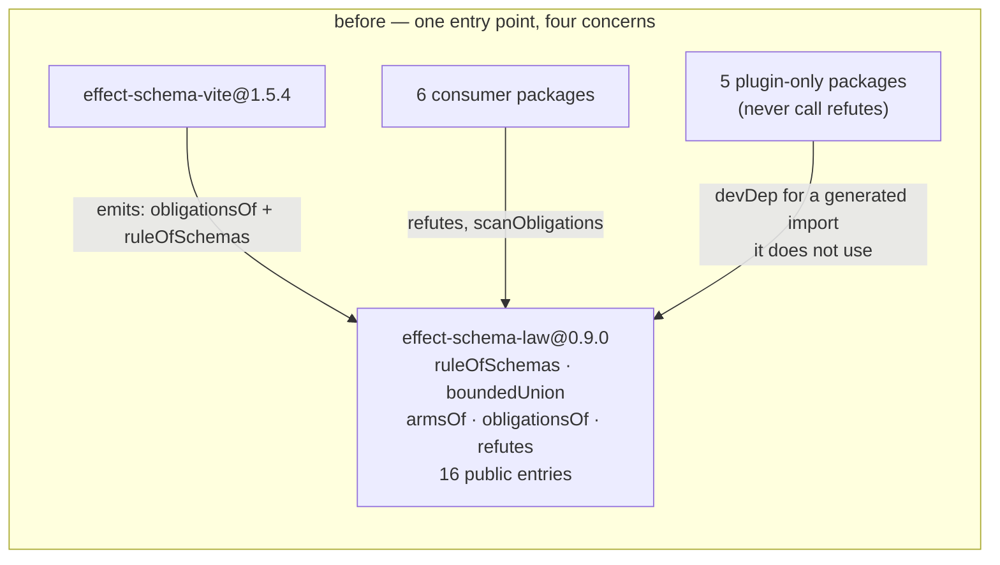
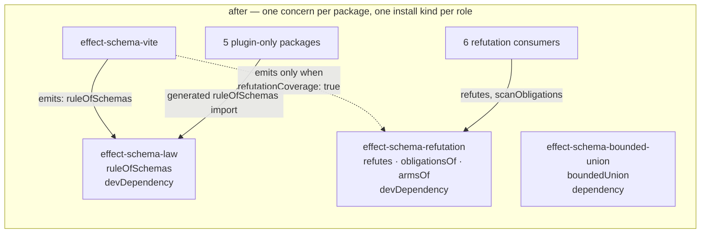
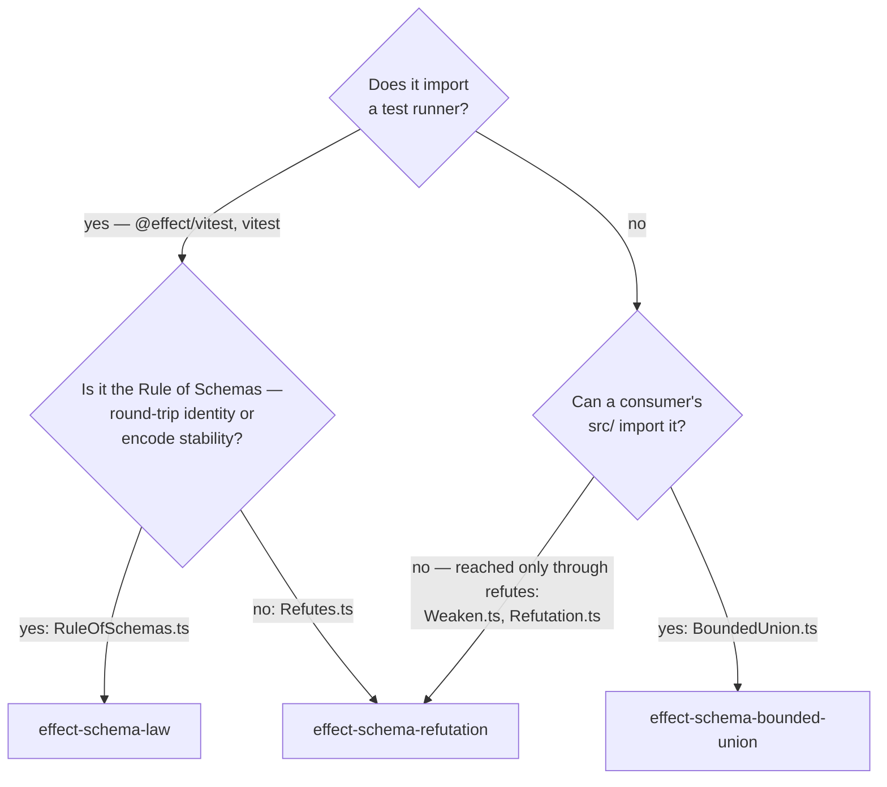

# refactor: split `effect-schema-law` down to the Rule of Schemas

## Summary

`@systemfsoftware/effect-schema-law` v0.9.0 publishes four unrelated concerns through one entry point. Its namesake — `ruleOfSchemas`, the two codec laws the Effect docs call [the Rule of Schemas](https://www.effect.website/docs/v3/schema/introduction#the-rule-of-schemas) — is 1.3KB of `src/RuleOfSchemas.ts`. Riding alongside it are a 37KB refutation-adequacy subsystem (`src/Weaken.ts`, `src/Refutation.ts`, `src/Refutes.ts`) and an 11.4KB runtime union combinator (`src/BoundedUnion.ts`).

Three packages come out of one: the law keeps `ruleOfSchemas`, refutation adequacy gets its own name, and the union combinator gets a package a consumer can take as a real `dependency` rather than reaching into a devDependency test helper. The Vite plugin stops emitting the refutation half unconditionally.

---

## Problem Frame

A consumer installs `@systemfsoftware/effect-schema-law` for the two codec laws and receives three concerns they did not ask for. Four measured symptoms:

1. **One entry point, four concerns.** `packages/core/effect/schema/law/src/mod.ts` re-exports `boundedUnion`, `armsOf`/`Arm`, `obligationsOf`/`scanObligations`/`dischargedBy`/`WITNESS_BUDGET`/`Obligation`/`ObligationScan`/`BlindArm`, `refutes`/`adequacyReport`/`discriminates`/`RefusalGenerators`/`AdequacyReport`, and `ruleOfSchemas` — sixteen names. `etc/effect-schema-law.api.md` reports the same sixteen public entries; one of them is the package's namesake.

2. **The install kind is wrong for one export.** `README.md:63` instructs installing as a devDependency — "it's a test helper". But `boundedUnion` returns a codec: `BoundedUnion.ts:52` is `S.Union([...base, ...recur]).annotate(...)`, and its decode, encode and equivalence are `S.Union`'s (`README.md:24`). The Vite plugin only ever walks a consumer's `src/`, so a recursive union that is to be law-tested has to be _declared_ in `src/` — and declaring it with `boundedUnion` puts a devDependency-documented package into that consumer's published runtime import graph. `README.md:47-50` dodges the tension by declaring the fixture in the test file beside the `ruleOfSchemas` call, which is the one location the plugin cannot reach. No in-repo caller resolves it either way: `boundedUnion(` outside the law package's own in-source block returns no matches. The export is therefore documented for a usage its own tooling forbids.

3. **The Vite plugin forces the refutation subsystem on every consumer.** `packages/core/effect/schema/vite/src/mod.ts:437` emits `import { obligationsOf, ruleOfSchemas } from '@systemfsoftware/effect-schema-law'` and `:448-460` emits an obligation-coverage `it(...)` that throws when a schema reaches an obligation no `refutes` call discharges. `InlineSchemaTestsOptions` (`vite/src/mod.ts:9-12`) carries one field, `dir` — there is no opt-out. Five in-repo packages run `inlineSchemaTests()` and call `refutes` nowhere: `packages/testing/mutation/plugins/stryker-plugins`, `packages/testing/mutation/plugins/stryker-test-contribution`, `packages/testing/type-testing/arethetypeswrong/analysis`, `packages/testing/type-testing/arethetypeswrong/cli`, `omp/plugins/omp-agent-discipline` — a `refutes\(` grep across those trees returns no matches. Each declares the law devDependency to satisfy a generated import for machinery it never uses.

4. **Consumers and the namesake want different halves.** Every hand-written in-repo import of this package reaches for `refutes` or `scanObligations` — `packages/core/hex/hex-schema` (7 modules), `packages/core/effect/daemon-spec` (4 modules plus `tests/schema-refutation-model.integration.test.ts:6`), `packages/testing/mutation/stryker-js/cli/src/Survivors.workflow.ts:462`, `omp/packages/omp-utils` (2 modules), `omp/plugins/omp-claude-compat` (2 modules). `ruleOfSchemas` has zero hand-written in-repo importers; it arrives only through the string the Vite plugin emits.

The argument that put the refutation subsystem here is `docs/plans/2026-08-05-005-feat-schema-refutation-adequacy-plan.md:212`, KTD1, verbatim:

> KTD1. **The kernels live in `packages/effect-schema-law`.** It already owns `ruleOfSchemas`, exports through a flat `src/mod.ts`, ships `@effect/vitest` and `effect` as peers, and carries no `stryker.config.json` — so a new `*.kernel.ts` needs no mutate-glob negotiation. The colocated `<cell>.kernel.property.test.ts` scheme is already the package's convention.

Every clause is a fact about this checkout's tooling — an existing barrel, existing peers, an absent mutation config, an in-repo file-naming scheme. `REPO-W7` disqualifies that class of warrant outright, and `REPO-A5` supplies the audience the clause never names: someone who installs the package and shares none of this repository's conventions. Read against that audience, KTD1 states no reason at all. The last clause is additionally stale — the package holds zero `*.property.test.ts` files today; `vitest.config.ts:8` runs every test through `includeSource: ['src/**/*.ts']`.

---

## Requirements

- **R1** — `@systemfsoftware/effect-schema-law`'s public surface is exactly `ruleOfSchemas`. Its `etc/effect-schema-law.api.md` reports one entry.
- **R2** — no package installs or declares a dependency edge for machinery it does not use. Every surviving edge resolves a symbol that package actually imports.
- **R3** — refutation adequacy ships as one published package with its own name, exports map, API report and attw run: `refutes`, `adequacyReport`, `discriminates`, `RefusalGenerators`, `AdequacyReport`, `obligationsOf`, `scanObligations`, `dischargedBy`, `WITNESS_BUDGET`, `Obligation`, `ObligationScan`, `BlindArm`, `armsOf`, `Arm`.
- **R4** — `boundedUnion` ships from a package installable as a `dependency`, whose only peer is `effect` and which imports no test runner.
- **R5** — the Vite plugin's generated suite emits the round-trip laws only. Obligation coverage is opt-in through an explicit option; when off, the generated file names no refutation symbol and no refutation package.
- **R6** — every in-repo consumer imports each symbol from the package that owns it after the split, with the matching manifest edge, and no dead edge survives.
- **R7** — the lint exemption keyed on the harness module specifier follows `refutes` to its new package. No rule text names a package that no longer exports the symbol the text describes.
- **R8** — no forwarding export, alias, deprecation shim, or "moved to X" note remains anywhere in the tree (`DEL1`). `git grep` for each moved symbol returns hits only in its new home and its real consumers.
- **R9** — every publishable package whose turbo `build` hash moves ships a `.changeset/` intent, with a body written for someone who installed from a registry and has never seen this repository (`REPO-R2`, `REPO-R3`).
- **R10** — `pnpm check:local` exits 0 after the last edit, and the PR is watched to green (`REPO-D1`).

---

## Assumptions

Recorded rather than confirmed — this plan was authored headless, so inferred bets land here instead of in a confirmation prompt.

- **A1** — `@systemfsoftware/effect-schema-bounded-union` is worth a package for one 53-line export. R1 forces the export out of the law package; the two alternative homes each reintroduce the defect being fixed (KTD3). This is the cost of not doing either.
- **A2** — the coverage assertion is vacuous today in the five packages that run the plugin and call `refutes` nowhere. This is a deduction, not a guess: `vite/src/mod.ts:448-460` builds `covered` only from schemas named in `REFUTED`, so with no `refutes` call `REFUTED` is empty, `covered` is empty, and any exported schema reaching one obligation is `naked` and throws. Those suites are green, therefore their exported schemas reach zero obligations. What default-off does forfeit is future coverage: a refinement added to one of those packages later would have been caught. U5 measures per package rather than resting on the deduction, and any package whose assertion is live opts in.
- **A3** — the four `//#check:*` turbo tasks naming `scripts/guards/check-exports.mjs`, `validate-publish-config.mjs`, `check-lint-coverage.mjs` and `check-runtime-deps.mjs` are orphaned: `scripts/guards/` holds only `check-changeset.ts`, `check-forbidden-lines.ts` and `check-remote-main.ts`, and no root script or workflow invokes those task names. A new package therefore does not have to satisfy them. Pre-existing and out of scope — do not fix them here.
- **A4** — the corpus does not settle how many packages a test-helper library should become. Queried this session against the `software-wiki` collection with three typed sub-queries under the intent "Deciding whether a published test-helper package should be split so that a law/property-test registrar, a refutation-adequacy analysis core, and a runtime schema combinator each ship separately, and where a test registrar belongs relative to a runtime combinator in a published exports map"; lex `package split exports map peer dependency test registrar runtime combinator`, vec `where should a property-test law helper live relative to runtime schema combinators in a published package boundary`, hyde on the runner-peer/subpath rule. Two candidates read. The corpus settles that a package's consumer-reachable surface is exactly its manifest entry-point map and that every other path is encapsulated — which this plan honours — and answers nothing about package count. Re-runnable verbatim.

---

## Scope Boundaries

**In scope.** The three-way package split; the Vite plugin's option surface and generated output; consumer import and manifest re-pointing; the one load-bearing lint specifier and its fixture; doctrine and prose naming the moved symbols; changeset intents.

**Out of scope (true non-goals).**

- The tautology of generated laws (`docs/solutions/design-patterns/generated-schema-laws-are-tautological.md`). The split moves the machinery; it does not change what a generated law proves.
- `WITNESS_BUDGET = 256`, `numRuns` (`law/vitest.setup.ts`: 1000 in CI, 100 local), and the refutation properties' runtime. Moved code carries these unchanged; retuning them is a separate question.
- `ruleOfSchemas`' own signature and the two property names it registers.

**Deferred to follow-up work.**

- The four orphaned `//#check:*` turbo tasks and the stale comment at `.github/workflows/reusable-checks.yml:30` claiming `//#check:exported-wiring` runs inside `gate:tasks` (it is absent from the `gate:tasks` task list in `package.json:16`). Real rot, unrelated to this objective.
- `@systemfsoftware/effect-schema-extensions` being a re-export alias of `@systemfsoftware/hex-schema` (`extensions/src/mod.ts` is one line) while publishing two entry points. Noticed while costing KTD3; not this change.

---

## High-Level Technical Design

Package boundaries, before and after. Edge labels are the symbols that cross.





Where each module lands follows three questions, asked in this order:



Be precise about which question does the work. The runner question is the boundary three independent published projects already draw (see Sources), and it is what sends `BoundedUnion.ts` out of a runner-bound package entirely. It does **not** separate `Refutes.ts` from `RuleOfSchemas.ts`: `RuleOfSchemas.ts:1` and `Refutes.ts:1,5` both import a runner, so Q1 puts them on the same side. Q2 is what splits them, and Q2 is the directive — not a derivation. The directive's warrant is the page the user named: [Effect's "The Rule of Schemas"](https://www.effect.website/docs/v3/schema/introduction#the-rule-of-schemas) states one rule, that encoding and immediately decoding returns the original value. Singular. A rejection contract is a different property with a different name, so it is a different package.

---

## Key Technical Decisions

**KTD1. `effect-schema-law` keeps `ruleOfSchemas` and nothing else.** _(session-settled: user-directed — chosen over adding subpath exports to the existing package: a subpath still ships one version, one changelog and one peer set to every consumer, so a law-only consumer still installs and resolves the refutation code.)_ Governs R1. The package name states a law; the surface should be that law. `Refutes.ts` also imports a runner, so the runner question does not separate them — R1 does, and R1 is the directive.

**KTD2. Refutation adequacy is one package, not three.** `Refutes.ts:6` imports from `./Refutation.js`, which imports `armsOf` from `./Weaken.js` at `Refutation.ts:4` — a linear chain with no branch. `armsOf`, `Arm`, `dischargedBy`, `WITNESS_BUDGET`, `Obligation`, `ObligationScan`, `BlindArm`, `AdequacyReport`, `RefusalGenerators`, `discriminates` and `adequacyReport` have zero in-repo importers; the chain is reached through `refutes`. Splitting it further would be structure for a hypothetical consumer (`CONST-S3`), and `docs/solutions/architecture-patterns/label-routed-rules-are-unfalsifiable.md` records the cost: a folder split under another name destroys change-locality. `CONCEPTS.md` already names this one concept — "Refutation adequacy", with "Schema weakening", "Witness", "Refutation obligation" and "Obligation node" as its vocabulary — so the package is named for it.

**KTD3. `boundedUnion` gets its own package, installable as a `dependency`.** Governs R4. R1 forces it out of the law package on its own — a codec constructor is not the Rule of Schemas — so the only open question is where it goes, and the answer is decided by two properties: it imports no test runner (`BoundedUnion.ts:2-3` is `effect` and `effect/testing`), and it returns a value a consumer's schema module holds (`BoundedUnion.ts:52`). The second property is what makes its install kind `dependency` rather than `devDependency`, and it is a claim about reach, not about an observed caller: no in-repo caller of `boundedUnion(` exists outside the law package's own in-source block, and the README's example (`README.md:47-50`) declares its fixture in the test file — the one place the Vite plugin never walks. That is the defect, not the counter-evidence: the documented usage is unreachable by the tooling the package exists to serve, so a real consumer's recursive union has to be declared in `src/`, where a devDependency does not resolve. Three homes were costed and two reintroduce the defect this change exists to fix:

- _`effect-schema-extensions`_ — rejected. It declares `dependencies: { "@systemfsoftware/hex-schema": "workspace:^" }` (`extensions/package.json:53-55`), so a consumer wanting one union combinator installs every hex codec. That is R2's violation one package over. Its leaf also demands branded codecs (`extensions/AGENTS.md:11`), which a combinator is not.
- _Stay in `effect-schema-law`_ — rejected. Fails R1, and leaves a runtime codec inside a package documented as a devDependency.
- _Its own package_ — chosen. One export, `effect` as the only peer, no runner import, no transitive codecs. `CONST-S4` argues against adding a package for 53 lines; the two alternatives each force an unrelated install on the consumer, which is the defect named in the objective, so the addition is earned.

**KTD4. Obligation coverage becomes an opt-in Vite option, default off.** Governs R5. `InlineSchemaTestsOptions` gains `refutationCoverage?: boolean` (default `false`). Off: `generateSchemaLaws` emits the law import and the `ruleOfSchemas` calls, and nothing else — no `effect/SchemaAST` type import, no `REFUTED` set, no `EXPORTED` roster, no coverage `it(...)`, and no reference to the refutation package. On: it emits all of it, importing the refutation symbols from `@systemfsoftware/effect-schema-refutation`. Default off is what R2 requires — the plugin's advertised job (`vite/package.json:13`) is injecting round-trip tests, so refutation coverage is the extra a consumer asks for. The refutation peer is declared `optional` in `peerDependenciesMeta` so an install with the option off warns about nothing.

**KTD5. The cross-package name-disjointness check is deleted, not carried across a package edge.** `Refutes.ts:229-230` calls `refutes(Hexish, …)` and then `ruleOfSchemas('Hexish', Hexish)` on one schema in one file — a check that the two registrars' property-name prefixes do not collide (`∀b_`/`∀g_`/`∀s_` against `∀x_`, per the convention at `Refutes.ts:79-80`). The plan's first draft kept it by giving the refutation package a devDependency on the law package; an adversarial pass defeated that, and the objection wins. The two prefixes are literal string constants in two files, so a collision requires someone deliberately editing one to match the other, and the consequence when it happens is two identically-named entries in a test report — cosmetic. Paid for that: a permanent edge that makes the refutation package's release graph depend on the law package's, so a `ruleOfSchemas` signature change forces a refutation rebuild and bump although no refutation symbol moved. `CONST-E3` prices a check against what it prevents, and this one does not clear its price. U1 therefore drops the `ruleOfSchemas` call and its import from the moved block; the `refutes(Hexish, …)` call stays. This is a deliberate, declared removal of a check (`CONST-W3`), not a gate weakened to make the change pass — nothing in this plan needs it gone to be green. The refutation package takes no dependency on the law package. Both new packages take `@systemfsoftware/arethetypeswrong-cli` as `catalog:attw`, never `workspace:^`, which is what keeps the attw dev-cycle described at `packages/testing/type-testing/arethetypeswrong/analysis/vitest.config.ts:4-8` from closing.

**KTD6. The lint exemption re-keys to one specifier, not two.** Governs R7. `packages/lint/oxlint/plugins/testing/test-placement/src/rules/in-source-test-targets-private.ts:100-103` keys an exemption on `'@systemfsoftware/effect-schema-law'`, and its own doc comment opening at `:87` states what the exemption is for: a `refutes(Admitted, …)` call discharging a per-declaration obligation. `refutes` is the only symbol it serves, and `ruleOfSchemas` is never hand-written in a consumer's `src/` — it is generated. So the constant takes the refutation specifier and the law specifier is removed, not kept alongside it (`DEL1`).

---

## Alternatives Considered

**One package, three subpath exports** (`effect-schema-law`, `.../refutation`, `.../bounded-union`). Rejected. It is the shape Effect itself uses for `effect/testing`, and it would satisfy encapsulation. But a subpath does not separate what the objective requires separating: one version, one changelog, one peer set and one install kind reach every consumer regardless of which subpath they import, so a law-only consumer still resolves the refutation code and still cannot take `boundedUnion` as a `dependency`. Effect's case differs in the fact that decides it — `effect/testing` is a subpath of the _runtime_ package every consumer already installs, whereas here there is no runtime package for refutation to hide behind.

**Split by purity — a runner-free analysis package plus a registrar package.** This is what the external boundary rule alone would suggest: `armsOf`/`obligationsOf`/`scanObligations`/`dischargedBy` import no runner, while `refutes` imports `it` and `expect`. Rejected as the _primary_ cut because it puts `ruleOfSchemas` and `refutes` in one package, which is precisely what R1 forbids, and because the runner-free half has zero consumers that do not arrive through `refutes` (KTD2). The rule still does real work here: it is what sends `boundedUnion` out of a runner-bound package entirely (KTD3).

**Keep the coverage assertion mandatory and give it a second package.** Rejected: it preserves the forced opt-in verbatim and merely renames the package doing the forcing.

**A three-valued `refutationCoverage: 'auto' | true | false`, defaulting to `'auto'`**, resolving at plugin-config time by probing whether `@systemfsoftware/effect-schema-refutation` is installed. Proposed by the adversarial pass to avoid silently dropping the assertion. Rejected: it makes a gate's verdict depend on install state, so the same source tree passes or fails according to what happens to be in `node_modules`. `CONST-E3` names that shape exactly — a coin flip wearing an exit code — and green from it is indistinguishable from luck. The demand behind the proposal is legitimate and is met instead by measurement: U5 determines per package whether the assertion is live before the default flips, and any package whose assertion is live opts in explicitly.

**Reading "the rules of schema" in the plural**, so that a rejection contract counts as a rule and `refutes` stays in the law package — a two-package split that would delete KTD3 and KTD5 outright and save roughly fourteen config files. Rejected on the user's own citation: the page named in the objective defines "The Rule of Schemas" as one rule, that encode-then-decode returns the original value. `refutes` asserts a different property, under different property names, with a different generator contract. The saving is real and the reading is not.

---

## Output Structure

```
packages/core/effect/schema/
├── law/                          # reduced
│   ├── src/
│   │   ├── RuleOfSchemas.ts      # unchanged
│   │   └── mod.ts                # one export
│   ├── etc/effect-schema-law.api.md
│   ├── AGENTS.md · README.md · package.json
│   └── (Weaken.ts, Refutation.ts, Refutes.ts, BoundedUnion.ts deleted)
├── refutation/                   # new
│   ├── src/{Weaken,Refutation,Refutes,mod}.ts
│   ├── etc/effect-schema-refutation.api.md
│   ├── AGENTS.md · README.md · LICENSE · package.json
│   ├── tsconfig{,.build,.node}.json · tsdown.config.ts · api-extractor.json
│   ├── oxlint.config.ts · vitest.config.ts · vitest.setup.ts
│   └── .attw.json · .gitignore
├── bounded-union/                # new
│   ├── src/{BoundedUnion,mod}.ts
│   ├── etc/effect-schema-bounded-union.api.md
│   ├── AGENTS.md · README.md · LICENSE · package.json
│   ├── tsconfig{,.build,.node}.json · tsdown.config.ts · api-extractor.json
│   ├── oxlint.config.ts · vitest.config.ts · vitest.setup.ts
│   └── .attw.json · .gitignore
├── extensions/                   # untouched
└── vite/                         # option surface + codegen change
```

`pnpm-workspace.yaml` already carries the `packages/core/effect/schema/*` glob (confirmed in `pnpm map` output), so both new directories are picked up without a workspace edit. `turbo.json` defines tasks by name, not by package, so it needs no entry either.

Five config files are byte-identical across the two existing siblings and are copied verbatim into each new package — verified by matching blob hashes in `git ls-files -s`: `.attw.json`, `.gitignore`, `LICENSE`, `oxlint.config.ts`, `tsconfig.build.json`. The rest carry a per-package delta: `package.json` (name, `repository.directory`, homepage, description, keywords, peer/dev sets), `tsdown.config.ts` (the `typesMap` `.` value), `tsconfig.json` (nothing package-specific beyond its `references`), `tsconfig.node.json` (the `include` list, which names `vitest.setup.ts` only when the package has one), `api-extractor.json` (generic via `<unscopedPackageName>`; the law copy lacks the `tsdoc-undefined-tag` entry the vite copy carries — copy the vite variant), `vitest.config.ts` (`includeSource` and `setupFiles`, both needed wherever in-source blocks run).

---

## Implementation Units

### U1. Create `@systemfsoftware/effect-schema-refutation`

- **Goal** — the refutation-adequacy chain ships as its own published package, tests running, API report generated.
- **Requirements** — R3, R8; KTD2, KTD5.
- **Dependencies** — none.
- **Files**
  - create `packages/core/effect/schema/refutation/src/Weaken.ts`, `.../Refutation.ts`, `.../Refutes.ts` — moved verbatim from `packages/core/effect/schema/law/src/`, in-source blocks included
  - create `packages/core/effect/schema/refutation/src/mod.ts`
  - create `packages/core/effect/schema/refutation/package.json`, `tsconfig.json`, `tsconfig.build.json`, `tsconfig.node.json`, `tsdown.config.ts`, `api-extractor.json`, `oxlint.config.ts`, `vitest.config.ts`, `vitest.setup.ts`, `.attw.json`, `.gitignore`, `LICENSE`, `README.md`, `AGENTS.md`
  - create `packages/core/effect/schema/refutation/etc/effect-schema-refutation.api.md` via `pnpm --filter @systemfsoftware/effect-schema-refutation api:update`
- **Approach**
  1. Copy the law package's config set, then apply the deltas listed under Output Structure. `tsdown.config.ts`'s `typesMap['.']` becomes `./dist/effect-schema-refutation.d.ts`; keep `define: { 'import.meta.vitest': 'undefined' }`, which is what makes every in-source block statically dead in the build.
  2. `src/mod.ts` re-exports the union of what `law/src/mod.ts:2-11` and `:13` exported from these three modules: `armsOf`, `Arm`, `BlindArm`, `dischargedBy`, `Obligation`, `ObligationScan`, `obligationsOf`, `scanObligations`, `WITNESS_BUDGET`, `AdequacyReport`, `adequacyReport`, `discriminates`, `RefusalGenerators`, `refutes`. `Weaken.ts`'s `safeEncodedArbitrary` and `safeTypeArbitrary` stay unexported from the barrel — `Refutation.ts` is their only caller, and the law barrel never exported them.
  3. Delete the two lines `Refutes.ts:229-230`'s block ends with — the `ruleOfSchemas('Hexish', Hexish)` call and the `ruleOfSchemas` entry in the block's dynamic import of `./RuleOfSchemas.js` — per KTD5. The `refutes(Hexish, …)` call at `:229` stays, and `Hexish` keeps its declaration. Nothing else in the three moved modules references the law package, so after this the refutation package imports it nowhere.
  4. `package.json`: peers `@effect/vitest` (`catalog:peers`), `effect` (`catalog:peers`), `vitest` (`*`) — the same set the law package declares, because `Refutes.ts:1,5` imports `it` and `expect`. devDependencies mirror the law package's, with `@systemfsoftware/arethetypeswrong-cli` as `catalog:attw` (KTD5) and **no** edge to `@systemfsoftware/effect-schema-law`. Drop `@systemfsoftware/effect-gherkin-spec`: no moved module imports it.
  5. `vitest.config.ts` carries `includeSource: ['src/**/*.ts']` and `setupFiles: ['./vitest.setup.ts']`; `vitest.setup.ts` copies the law package's `fc.configureGlobal({ numRuns: isCI ? 1000 : 100 })` unchanged.
- **Execution note** — land this unit with the law package still intact. Both packages then export the same symbols briefly, which is what lets U1's tests be observed green before U3 deletes the originals.
- **Patterns to follow** — `packages/core/effect/schema/law/` for the config set; `packages/core/effect/schema/vite/api-extractor.json` for the `tsdoc-undefined-tag` variant.
- **Test scenarios**
  - The three in-source blocks all run: the test output names properties from `Weaken.ts`, `Refutation.ts` and `Refutes.ts`. A block that silently stops running is the failure mode `includeSource` omission produces, so read the property names, not the exit code.
  - The refutation package's manifest names `@systemfsoftware/effect-schema-law` nowhere, and `git grep -nI 'effect-schema-law' -- packages/core/effect/schema/refutation` prints nothing. This is KTD5's observable consequence; a surviving edge means step 3 was skipped.
  - `pnpm --filter @systemfsoftware/effect-schema-refutation api:check` exits 0 and `etc/effect-schema-refutation.api.md` lists exactly the 14 entries from step 2.
  - `pnpm --filter @systemfsoftware/effect-schema-refutation attw` exits 0 — the `exports.types` / rollup pairing is the defect recorded in `docs/solutions/build-errors/exports-types-rollup-drift.md`, and a fresh package is where it reappears.
- **Verification** — build, typecheck, lint, test, attw and api:check all pass for the new package, and the test output names properties from all three moved modules.

### U2. Create `@systemfsoftware/effect-schema-bounded-union`

- **Goal** — the union combinator ships from a package a consumer can install as a `dependency`.
- **Requirements** — R4, R8; KTD3.
- **Dependencies** — none. Runs concurrently with U1; disjoint files.
- **Files**
  - create `packages/core/effect/schema/bounded-union/src/BoundedUnion.ts` — moved verbatim from `packages/core/effect/schema/law/src/BoundedUnion.ts`, in-source block included
  - create `packages/core/effect/schema/bounded-union/src/mod.ts`
  - create the same config set as U1, plus `README.md` and `AGENTS.md`
  - create `packages/core/effect/schema/bounded-union/etc/effect-schema-bounded-union.api.md`
- **Approach**
  1. Same config copy as U1, with `typesMap['.']` pointing at `./dist/effect-schema-bounded-union.d.ts`.
  2. `package.json`: peer `effect` only. `BoundedUnion.ts:2-3` imports `effect` and `effect/testing`, and `effect/testing/FastCheck` re-exports `fast-check`, which `effect` itself declares as a dependency — so no `fast-check` peer and no runner peer. devDependencies carry `@effect/vitest` and `vitest` for the in-source block, `@systemfsoftware/arethetypeswrong-cli` as `catalog:attw`, and the usual toolchain set.
  3. `README.md` documents the install as `pnpm add` — not `-D`. This is the correction the unit exists to make; say why in one line: the combinator returns a codec a consumer's schema module keeps.
  4. Keep the `/// <reference types="vitest/import-meta" />` pragma at `BoundedUnion.ts:1`; the in-source block needs it and `tsconfig.build.json` is shared, so nothing else compensates.
- **Patterns to follow** — U1's config set once written; `packages/core/effect/schema/extensions/package.json:72-74` for a peer set of `effect` alone.
- **Test scenarios**
  - The in-source block runs and its property names appear in the test output, including the depth-bounding properties that quantify over seeds.
  - `attw` exits 0.
  - `api:check` exits 0 and the report lists exactly `boundedUnion`.
  - Typecheck passes with the peer set reduced to `effect` — a missed `@effect/vitest` or `fast-check` requirement surfaces here, not at publish.
- **Verification** — the package's own `build`, `typecheck`, `lint`, `test`, `attw` and `api:check` all pass.

### U3. Reduce `effect-schema-law` to the Rule of Schemas

- **Goal** — the law package publishes one symbol and carries no trace of the other three concerns.
- **Requirements** — R1, R8; KTD1.
- **Dependencies** — U1, U2 (the moved code must exist and be green before the originals are deleted).
- **Files**
  - delete `packages/core/effect/schema/law/src/Weaken.ts`, `.../Refutation.ts`, `.../Refutes.ts`, `.../BoundedUnion.ts`
  - modify `packages/core/effect/schema/law/src/mod.ts` — becomes `export * from './RuleOfSchemas.js'`
  - modify `packages/core/effect/schema/law/package.json` — description, keywords, devDependency set
  - modify `packages/core/effect/schema/law/etc/effect-schema-law.api.md` via `api:update`
  - modify `packages/core/effect/schema/law/README.md`, `.../AGENTS.md`
- **Approach**
  1. Delete the four modules and reduce the barrel to one line.
  2. `package.json`: drop `fast-check` from devDependencies if nothing in the reduced package imports it (`RuleOfSchemas.ts:3` uses `effect/testing`'s re-export, not the bare package — confirm by reading before deleting). Drop `@systemfsoftware/effect-gherkin-spec`, which no surviving module imports. Peers stay `@effect/vitest`, `effect`, `vitest` — `RuleOfSchemas.ts:1` imports `it`. Remove the `law-testing` / `roundtrip` keyword drift only if a keyword now names a removed concern.
  3. `README.md`: delete the entire "Recursive schemas" section (`README.md:20-55`) — it documents `boundedUnion`. Per `DEL1` it leaves no pointer; the combinator's own README carries that content. Keep the devDependency install instruction at `README.md:63`, which is now true of everything the package ships.
  4. `AGENTS.md`: LAW-L1 and LAW-L2 stay, their `check:` commands unchanged. LAW-L3's `check:` currently reads "review — the vite plugin's integration test proves TaggedError is excluded from auto-discovery" — re-read `packages/core/effect/schema/vite/tests/inline-schema-tests.integration.test.ts` and either name the assertion that actually proves it or restate the check as what a reviewer decides. A rule whose check names evidence that does not exist is the defect `ADOC-A1` and `CONST-E1` both name.
- **Execution note** — run `pnpm --filter @systemfsoftware/effect-schema-law api:update` and read the diff: the report must go from sixteen entries to one. That diff is the unit's primary evidence.
- **Test scenarios**
  - The law package's suite still runs and `ruleOfSchemas`' two properties are registered — after the deletion, the package has no in-source block of its own, so confirm the suite is not silently empty. If it is, that is a finding for U3, not a pass: state it and decide whether the package needs a minimal in-source block exercising `ruleOfSchemas`.
  - `api:check` exits 0 against the regenerated one-entry report.
  - `attw` exits 0 — the rollup shrank, so the `exports.types` target is re-derived.
  - `git grep -nI -e boundedUnion -e armsOf -e obligationsOf -e scanObligations -e dischargedBy -e WITNESS_BUDGET -e adequacyReport -e discriminates -- packages/core/effect/schema/law` prints nothing. Read stdout, not the exit code: `git grep` exits 1 when clean.
- **Verification** — the law package's full task set passes, the API report lists one entry, and the grep above is empty.

### U4. Re-point in-repo refutation consumers

- **Goal** — every package that imports `refutes` or `scanObligations` resolves it from the refutation package, and no dead law edge survives.
- **Requirements** — R2, R6, R8.
- **Dependencies** — U1.
- **Files**
  - modify `packages/core/hex/hex-schema/package.json` and `src/{ColonHex,HexBytes,HexString,PrefixedHex,StrictHex,Uint8arrayFromPrefixedHex}.schema.ts` plus `src/PrefixedHex.ts` — seven modules; `PrefixedHex.ts` is the `scanObligations` importer and is easy to miss beside the six `*.schema.ts` files
  - modify `packages/core/effect/daemon-spec/package.json`, `src/DaemonHealth.schema.ts`, `src/DaemonPolicy.schema.ts`, `src/internal/RestartDecision.schema.ts`, `src/internal/RestartDecision.workflow.ts`, `tests/schema-refutation-model.integration.test.ts`
  - modify `packages/testing/mutation/stryker-js/cli/package.json`, `src/Survivors.workflow.ts`
  - modify `omp/packages/omp-utils/package.json`, `src/TomlLoader.schema.ts`, `src/ToolInput.schema.ts`
  - modify `omp/plugins/omp-claude-compat/package.json`, `src/HookOutput.schema.ts`, `src/HookVerdict.workflow.ts`
- **Approach**
  1. In each importing module, change the specifier only. Every `refutes` import is a dynamic `await import(...)` inside an `if (import.meta.vitest !== void 0)` block; `daemon-spec/tests/schema-refutation-model.integration.test.ts:6` is the one static import. The imported names and call sites do not change.
  2. In each manifest, replace the `@systemfsoftware/effect-schema-law` devDependency with `@systemfsoftware/effect-schema-refutation`, _except_ where that package's generated `src/schema-laws.test.ts` still imports `ruleOfSchemas` — those keep the law edge and gain the refutation edge. Decide per package by whether it runs `inlineSchemaTests()`: `hex-schema`, `daemon-spec`, `stryker-js/cli`, `omp-utils` and `omp-claude-compat` all do, so all five keep both edges.
  3. Verify the specifier list is exhaustive before editing: `git grep -nI 'effect-schema-law' -- packages omp` and reconcile against the file list above. A missed dynamic import fails at test time, not at typecheck.
- **Execution note** — do the specifier swap and the manifest edit for one package first (`hex-schema` is the densest, seven modules) and run that package's suite before touching the rest. A wrong specifier in a dynamic import inside a vitest guard fails only when the block executes.
- **Test scenarios**
  - Each touched package's suite passes and its refusal properties still appear by name in the output — a broken dynamic import makes the block throw at collection, so a green run with missing property names is the failure to watch for.
  - `daemon-spec`'s `tests/schema-refutation-model.integration.test.ts` passes: it asserts the obligation-count model against `scanObligations`, which is the sharpest single check that the moved code behaves identically.
  - `turbo boundaries` (via `pnpm check:boundaries`) exits 0 — it is the gate that catches an import with no declared manifest edge.
  - `git grep -nI 'effect-schema-law' -- packages omp` prints only: the law package itself, the Vite plugin's emitted string and manifest edges, the five plugin-only packages' manifests, and the lint rule's constant until U6 re-keys it. Any other hit is a missed re-point. Two known survivors are U5's and U7's to fix, not U4's — the Vite integration fixtures at `vite/tests/inline-schema-tests.integration.test.ts:81,93` and the two prose comments at `packages/lint/oxlint/plugins/effect/schema/src/rules/__tests__/schema-declaration-location.test.ts:314,358`.
- **Verification** — every touched package's `test`, `typecheck` and `lint` pass; `pnpm check:boundaries` exits 0.

### U5. Make obligation coverage an opt-in Vite option

- **Goal** — the generated suite carries the round-trip laws only, unless the consumer asks for coverage.
- **Requirements** — R5, R2; KTD4.
- **Dependencies** — U1 (the refutation package must exist to be named in the emitted import).
- **Files**
  - modify `packages/core/effect/schema/vite/src/mod.ts` — `InlineSchemaTestsOptions`, `generateSchemaLaws`, `inlineSchemaTests`
  - modify `packages/core/effect/schema/vite/tests/inline-schema-tests.integration.test.ts` — including the two fixture import strings at `:81` and `:93`, which name `refutes` from the law package and would resolve to nothing after U3
  - modify `packages/core/effect/schema/vite/package.json` — peer and dev edges, `peerDependenciesMeta`
  - modify `packages/core/effect/schema/vite/etc/effect-schema-vite.api.md` via `api:update`
  - modify `packages/core/effect/schema/vite/README.md`, `.../AGENTS.md`
  - modify the five opting-in consumers' `vitest.config.ts`: `packages/core/hex/hex-schema`, `packages/core/effect/daemon-spec`, `packages/testing/mutation/stryker-js/cli`, `omp/packages/omp-utils`, `omp/plugins/omp-claude-compat`
- **Approach**
  1. `InlineSchemaTestsOptions` gains `refutationCoverage?: boolean`, documented with its default and with what turning it on requires of the consumer (installing the refutation package).
  2. `generateSchemaLaws` takes the flag through to its emission. The law-only branch emits: the `vitest` `it` import is no longer needed at all when coverage is off — check whether anything else in the emitted file uses it before dropping it. Emit the law import and the `ruleOfSchemas` calls. The coverage branch additionally emits the `effect/SchemaAST` type import, the refutation import, the `REFUTED` set, the `EXPORTED` roster and the coverage `it(...)`.
  3. `findRefutesCallSites` and `findRefutedIdentities` key on the callee name `refutes` and not on a module specifier, so they need no change — but they are only reachable from the coverage branch. Skip that scan entirely when the flag is off: it is a full second directory walk (`vite/src/mod.ts:221-261`) and running it to discard the result is waste.
  4. `package.json`: the law peer stays required; add `@systemfsoftware/effect-schema-refutation` as a peer with `peerDependenciesMeta: { "@systemfsoftware/effect-schema-refutation": { "optional": true } }`, plus a devDependency for the tests.
  5. Decide the flag per package by measurement, not by A2's deduction. For each of the ten plugin consumers, run its suite with `refutationCoverage: true` first and read whether the coverage test asserts anything — a package whose exported schemas reach zero obligations passes it vacuously. Set `refutationCoverage: true` in every package where the assertion is live; leave the rest at the default. The expected outcome is the five `refutes` callers on, the five non-callers off, but the measurement decides, not the expectation. Record the per-package verdict in the PR body so the next reader does not have to re-derive it.
- **Execution note** — write the two integration cases before changing the emitter, and confirm the coverage-off case fails against today's emitter. That red is the proof the assertion is real; the existing suite asserts nothing about the emitted import line or the coverage block (verified this session), so a test written after the change would pass vacuously.
- **Test scenarios**
  - Default (flag absent): the generated file contains `ruleOfSchemas` calls, and the strings `obligationsOf`, `REFUTED`, `EXPORTED`, `effect/SchemaAST` and `effect-schema-refutation` appear nowhere in it. Assert on absence explicitly — this is R5's whole content.
  - `refutationCoverage: true`: the generated file imports `obligationsOf` from `@systemfsoftware/effect-schema-refutation`, imports `ruleOfSchemas` from `@systemfsoftware/effect-schema-law`, and contains the coverage `it(...)`.
  - `refutationCoverage: true` with a fixture whose schema reaches an obligation no `refutes` call discharges: the coverage test fails and its message names that schema. Reuse the fixtures at `tests/inline-schema-tests.integration.test.ts:80-96`, which already build `refutes` call sites — re-point their import strings to the refutation package as part of this unit rather than adding new fixtures beside them.
  - A fixture with no exported schemas still emits the `// no schemas found` short-circuit (`vite/src/mod.ts:414`) under both flag values.
  - Each of the five opted-in consumers' suites passes with the flag on, and each of the five defaulted consumers' suites passes with the coverage test gone.
- **Verification** — the Vite package's suite passes with cases for both branches; `api:check` reflects the widened option type; all ten plugin consumers' suites pass.

### U6. Re-key the lint exemption

- **Goal** — the exemption follows `refutes` to the refutation package.
- **Requirements** — R7, R8; KTD6.
- **Dependencies** — U1.
- **Files**
  - modify `packages/lint/oxlint/plugins/testing/test-placement/src/rules/in-source-test-targets-private.ts`
  - modify `packages/lint/oxlint/plugins/testing/test-placement/src/rules/__tests__/in-source-test-targets-private.test.ts`
  - modify `packages/lint/oxlint/plugins/testing/test-placement/AGENTS.md`
  - modify `packages/lint/oxlint/plugins/effect/schema/src/rules/no-schema-law-duplicate.config.ts`
- **Approach**
  1. `SCHEMA_LAW_SOURCE` at `:100` takes `'@systemfsoftware/effect-schema-refutation'`. Rename the constant and `isSchemaLawSource` to name refutation, and update the doc comment opening at `:87`, which currently says "this package's `inlineSchemaTests()` plugin" — that sentence describes a different package's plugin and is worth correcting while the comment is being touched.
  2. The RuleTester fixture at `__tests__/in-source-test-targets-private.test.ts:30` imports the law specifier inside a `refutes` block under a passing-case name. Re-point it. This fixture is the rule's only proof the exemption fires; left unchanged it would pass while testing nothing.
  3. `no-schema-law-duplicate.config.ts:12` and `:24` name the law package in prose only — the rule reports on callee names from `GENERATED_LAW_NAMES` and reads no specifier. Update the two strings so the message names the package that actually exports `refutes`. Do not add a specifier check: the rule's mechanism is unchanged and adding one would be scope the objective did not ask for.
  4. `test-placement/AGENTS.md` TP4 (lines 30-34) names "the combinator from `@systemfsoftware/effect-schema-law`" — re-point it. Its `check:` at `:34` names two greps over `packages/oxlint-plugins/test-placement/src`, a path that has not existed since the restructure recorded in `docs/plans/2026-08-20-001-refactor-packages-folder-structure-plan.md`; the real path is `packages/lint/oxlint/plugins/testing/test-placement/src`. Correct it in the same edit. This is in scope, not creep: `ADOC-A12`'s V4 is a `check:` naming a path no command executes, and leaving a broken gate in a rule block this unit is already rewriting would ship a rule that cannot be checked.
- **Test scenarios**
  - `in-source-test-targets-private`'s RuleTester suite passes, and the re-pointed exemption case is a _pass_ case — confirm it by breaking the specifier in the fixture and observing the case go red, then restoring. Otherwise a silently-exempt-nothing rule looks identical to a working one.
  - A fixture importing the _old_ law specifier inside a `refutes` block is now reported, not exempted. This is the case that proves the re-key took effect rather than widened.
  - `no-schema-law-duplicate`'s suite passes unchanged — its logic is untouched, so any movement here is a mistake.
  - `pnpm --filter @systemfsoftware/oxlint-plugin-test-placement lint` and the effect-schema plugin's `lint` both exit 0.
- **Verification** — both plugin suites pass, and the negative case above is observed red before the fixture is corrected.

### U7. Move the doctrine and prose

- **Goal** — every document naming a moved symbol names the package that now exports it; nothing points back.
- **Requirements** — R8.
- **Dependencies** — U3, U5, U6.
- **Files**
  - create `packages/core/effect/schema/refutation/AGENTS.md`, `.../README.md` (in U1; content settled here)
  - create `packages/core/effect/schema/bounded-union/AGENTS.md`, `.../README.md` (in U2; content settled here)
  - modify `packages/core/effect/schema/law/AGENTS.md`, `.../README.md` (in U3)
  - modify `packages/core/effect/schema/vite/AGENTS.md`, `.../README.md`
  - modify `packages/lint/oxlint/plugins/effect/schema/AGENTS.md`, `.../README.md`
  - modify `packages/lint/oxlint/plugins/effect/schema/src/rules/__tests__/schema-declaration-location.test.ts` — the explanatory comments at `:314` and `:358` cite `effect-schema-law/src/BoundedUnion.ts` and `effect-schema-law/src/Refutes.ts` as the real-world cases their fixtures model. Both paths stop existing at U3. Re-point them to the new packages; the fixtures and assertions themselves do not change.
  - modify `README.md` (root package table)
- **Approach**
  1. The refutation leaf inherits the concept vocabulary already fixed in `CONCEPTS.md` — "Refutation adequacy", "Schema weakening", "Witness", "Refutation obligation", "Obligation node". Do not redefine those terms in the leaf; name them and let the glossary hold the definitions.
  2. Each new leaf earns its rules by `ADOC-A12`: a rule gets four fields only when its harm is surprising _and_ its failure silent. The law leaf's LAW-L3 is the model of an earned block — calling `ruleOfSchemas` on a `TaggedError` fails for a reason nobody predicts. A rule restating "the build must pass" gets one line or gets cut.
  3. Every load-bearing rule in a new leaf names its gate (`ADOC-A1`), and a gate that is a command must be a command someone can run from the repo root today — not a path asserted in prose beside one.
  4. Root `README.md:20`: the table row names the law package. Correct the row's description to the reduced surface and add rows for the two new packages, matching the existing column shape.
  5. The Vite leaf at `vite/AGENTS.md:5` describes generating `ruleOfSchemas` tests; extend it with the coverage option and what opting in requires. `vite/README.md:8`'s install line pins `'@systemfsoftware/effect-schema-law@0.6.1'`, three minor versions stale — correct it to the peer range the manifest declares rather than a literal version.
- **Test scenarios** — `Test expectation: none` — documentation. The check is R8's grep in U9 plus review of whether each new rule names a gate that runs.
- **Verification** — `git grep -nI 'effect-schema-law' -- packages omp README.md` returns only the load-bearing hits enumerated in U4's scenario, now reduced by U6's re-key: the law package itself, the Vite plugin's emitted string and manifest edges, and the five plugin-only packages' manifests. No document contains a "moved to", "renamed", "formerly" or "see instead" pointer for a moved symbol.

### U8. Changeset intents

- **Goal** — every publishable package whose `build` hash moves declares an intent a registry consumer can act on.
- **Requirements** — R9.
- **Dependencies** — U3, U5.
- **Files** — create files under `.changeset/`
- **Approach**
  1. Author with `pnpm change --bump <none|patch|minor|major> --summary "<entry>"` per `.changeset/README.md:7`. Bumps follow what a consumer observes from outside (`REPO-R2`): `@systemfsoftware/effect-schema-law` **major** (fifteen of sixteen exports removed — the precedent for a breaking surface removal is `.changeset/arethetypeswrong-renamed.md`, which used `major`); `@systemfsoftware/effect-schema-refutation` and `@systemfsoftware/effect-schema-bounded-union` **minor** debut entries (the precedent for a debut is `.changeset/npm-package-in-memory-tree.md`); `@systemfsoftware/effect-schema-vite` **major** (a generated-output default changed and a peer was added).
  2. Every consumer package whose `build` hash moves needs an intent too. Do not guess the set: the `changeset-check` workflow compares each package's `build` hash between the PR's pinned base and head, so let it name them and answer with intents for exactly those. Many consumer edits are inside `if (import.meta.vitest !== void 0)` blocks that `tsdown` compiles out, but the hash reads source and manifest, not output — so the edit moves the hash and the intent is required even where the published bytes do not change (`none` is the honest bump exactly when no exported name, type or behaviour moved).
  3. Bodies obey `REPO-R3`: what a consumer observes or must do, and nothing else. No module path, no file name, no gate name, no test count, no plan or unit ID. The law entry names each removed export and the package that now provides it; the bounded-union entry states that the install is a `dependency`, not a devDependency, and why that matters for a schema declared in `src/`.
- **Test scenarios** — `Test expectation: none` — release metadata. The gate is `.github/workflows/changeset-check.yml`, which blocks the PR when a moved hash is unnamed.
- **Verification** — the `changeset-check` job passes on the PR.

### U9. Whole-tree verification

- **Goal** — the split holds across every gate that actually runs.
- **Requirements** — R10, and the grep half of R8.
- **Dependencies** — U1 through U8.
- **Files** — none.
- **Approach**
  1. `pnpm check:local` after the last edit. It runs `./bin/dprint check`, `pnpm check:boundaries` (`turbo boundaries`), `pnpm check:forbidden-lines`, `gate:tasks` (`lint`, `lint:tsgo`, `typecheck`, `test`, `test:types`, `attw`, `api:check` across every package) and `gate:dist` (`build`). It is `s=0; … || s=1` throughout, so it reports every failure rather than stopping at the first — read the whole output.
  2. Run the R8 greps and read stdout, not exit codes.
  3. Do not start a mutation run (`REPO-D3`).
- **Test scenarios**
  - `pnpm check:local` exits 0.
  - `git grep -nI -e boundedUnion -e armsOf -e obligationsOf -e scanObligations -e dischargedBy -e WITNESS_BUDGET -e adequacyReport -e discriminates -- packages omp` prints hits only in the new owning packages and their real consumers.
  - `git grep -nI 'effect-schema-law' -- packages omp README.md` matches the enumerated load-bearing set exactly.
  - Three fresh API reports exist and each lists the surface its package's KTD specifies: law 1 entry, refutation 14, bounded-union 1 — sixteen in total, conserving the sixteen the law package publishes today minus the one check KTD5 deletes, which exported nothing.
- **Verification** — `pnpm check:local` exits 0; `gh pr checks --watch --fail-fast` exits 0.

---

## Verification Contract

| Gate                   | Command                                                                                                                                                                                                                | Covers     | Passing condition                                                      |
| ---------------------- | ---------------------------------------------------------------------------------------------------------------------------------------------------------------------------------------------------------------------- | ---------- | ---------------------------------------------------------------------- |
| New-package tasks      | `pnpm --filter @systemfsoftware/effect-schema-refutation build lint typecheck test attw api:check`                                                                                                                     | U1         | exits 0; test output names properties from all three moved modules     |
| New-package tasks      | `pnpm --filter @systemfsoftware/effect-schema-bounded-union build lint typecheck test attw api:check`                                                                                                                  | U2         | exits 0; API report lists only `boundedUnion`                          |
| Reduced surface        | `pnpm --filter @systemfsoftware/effect-schema-law api:check`                                                                                                                                                           | U3         | exits 0 against a one-entry report                                     |
| Consumer re-point      | `pnpm --filter @systemfsoftware/hex-schema --filter @systemfsoftware/effect-daemon-spec --filter @systemfsoftware/stryker-js-cli --filter @systemfsoftware/omp-utils --filter @systemfsoftware/omp-claude-compat test` | U4         | exits 0; refusal property names present in output                      |
| Declared edges         | `pnpm check:boundaries`                                                                                                                                                                                                | U4, U5     | exits 0 — catches an import with no manifest edge                      |
| Codegen branches       | `pnpm --filter @systemfsoftware/effect-schema-vite test`                                                                                                                                                               | U5         | exits 0; both flag branches asserted, including absence assertions     |
| Coverage-off red first | revert U5's emitter change, run the new default-branch case, restore                                                                                                                                                   | U5         | red while reverted, green after — proves the absence assertion is real |
| Lint re-key            | `pnpm --filter @systemfsoftware/oxlint-plugin-test-placement test`; `pnpm --filter @systemfsoftware/oxlint-plugin-effect-schema test`                                                                                  | U6         | exits 0                                                                |
| Exemption is live      | break the specifier in the re-pointed RuleTester fixture, run, restore                                                                                                                                                 | U6         | red while broken, green after                                          |
| No stray package edge  | `git grep -nI 'effect-schema-law' -- packages/core/effect/schema/refutation`                                                                                                                                           | U1, KTD5   | prints nothing                                                         |
| No trace               | the two `git grep` invocations in U9                                                                                                                                                                                   | U7, U8, R8 | stdout matches the enumerated sets                                     |
| Whole tree             | `pnpm check:local`                                                                                                                                                                                                     | all        | exits 0 after the last edit                                            |
| Release metadata       | `changeset-check` job on the PR                                                                                                                                                                                        | U8         | passes                                                                 |
| CI                     | `gh pr checks --watch --fail-fast`                                                                                                                                                                                     | all        | exits 0                                                                |

Mutation is not in this contract: no agent starts a mutation run (`REPO-D3`), and the merged Mutation workflow report is advisory.

---

## Risks

**A moved in-source block stops running and nothing goes red.** The highest-probability failure in the whole change. Every test in the law package today runs through `vitest.config.ts:8`'s `includeSource: ['src/**/*.ts']`; there are no `*.test.ts` files at all. A new package whose `vitest.config.ts` omits `includeSource` has a passing, empty suite. Mitigation: U1 and U2 both verify by reading property names out of the test output, not by reading an exit code, and U9 re-checks that three packages' outputs name distinct property sets.

**The five defaulted plugin consumers lose future coverage.** A2 deduces from the green tree that their coverage assertion is vacuous _today_; the loss is prospective — a refinement added to one of those packages later would have been caught and now will not be. Mitigation: U5 decides the flag by measurement rather than by the deduction, so a package whose assertion is already live opts in; and the five that stay off pay one line to opt in whenever a refinement arrives. The deduction itself is falsifiable and cheap to re-run: turn the flag on for a defaulted package and see whether the coverage test asserts anything.

**KTD5's deleted check has no replacement.** Dropping the `ruleOfSchemas` call from the moved in-source block means nothing observes a property-name prefix collision between the two packages. Accepted deliberately (`CONST-W3`) — the collision requires someone editing one literal prefix to match the other, and its consequence is a duplicated name in a report. If that ever stops being true, the replacement is a static check over both files, not a package edge.

**The `attw` / `exports.types` pairing on a fresh package.** `docs/solutions/build-errors/exports-types-rollup-drift.md` records this exact defect hitting `effect-schema-extensions`, `effect-schema-law` and `hex-schema` in one PR series: `exports.types` pointed at a rollup the `build` script never produced. Two new packages is two new chances. Mitigation: `attw` is in `gate:tasks`, so `pnpm check:local` catches it; `REPO-S4` also forbids hand-editing the exports map, so the fix is always in `tsdown.config.ts`.

**A missed dynamic import specifier.** Every consumer `refutes` import is `await import('…')` inside a vitest guard. A wrong specifier is invisible to `typecheck` and `lint`, and surfaces only when the block executes. Mitigation: U4 reconciles a `git grep` against its file list before editing and verifies per package rather than in bulk.

**Peer-set drift on the bounded-union package.** Reducing the peer set to `effect` alone rests on `effect/testing/FastCheck` re-exporting `fast-check` and `effect` declaring `fast-check` as a dependency (read this session in the vendored tree). If that changes upstream, the package under-declares. Mitigation: U2's typecheck runs against the reduced set; `attw` checks resolution from a consumer's position.

---

## Definition of Done

- The three packages exist with the surfaces KTD1, KTD2 and KTD3 specify, each confirmed by its own API report.
- `boundedUnion`'s package documents a `dependency` install; the law and refutation packages document `devDependency`.
- The Vite plugin emits no refutation symbol by default, proved by an absence assertion that was observed red against the unchanged emitter.
- Every in-repo consumer resolves each symbol from its owning package, with matching manifest edges, and `pnpm check:boundaries` exits 0.
- The lint exemption names the refutation package, and its fixture was observed red with a broken specifier.
- No forwarding export, alias, shim or "moved to" note anywhere; both R8 greps match their enumerated sets.
- Changeset intents exist for every package the `changeset-check` job names, with `REPO-R3`-clean bodies.
- `pnpm check:local` exits 0 after the last edit; the PR is open and `gh pr checks --watch --fail-fast` exits 0. Merge stays human (`REPO-P1`).

---

## Sources & Research

**The deciding external rule.** Read from the vendored tree and from fetched manifests this session: what imports the test runner ships in its own package with the runner as a peer dependency; runner-agnostic code ships in the runtime package, gated behind a subpath so a consumer pays nothing unless they import it.

- Effect places its law and arbitrary surface _inside_ the runtime package at the `./testing` subpath (`repos/effect/packages/effect/package.json:32`, published form at `:74`), and `TestSchema` there carries the round-trip check directly (`repos/effect/packages/effect/src/testing/TestSchema.ts:150-160`, `verifyLosslessTransformation`). `effect/testing/FastCheck.ts:90` is `export * from "fast-check"`, and `fast-check` is a hard dependency of `effect` (`repos/effect/packages/effect/package.json:116-119`) — so the property surface costs a consumer no extra install. The only thing hived off is the runner binding: `@effect/vitest` is its own package (`repos/effect/packages/vitest/package.json:2`) that peer-depends on `effect` and `vitest`.
- `fast-check` v4.9.0 ships no runner integration at all — `vitest` appears only in its devDependencies — while `@fast-check/vitest` is a separate package peer-depending on `vitest`. The rule it reveals: a core cannot hard-depend on a runner the user chose, so the runner binding is always a separate package plus a peer.
- `valibot` v1.4.2 publishes only a runtime entry and ships no test-integration surface whatever — the strict pole of the same rule.

No project in that set puts a free-running law registrar in a package a consumer must install alongside the runtime. That is what sends `boundedUnion` out of a runner-bound package (KTD3) and what makes the law and refutation packages devDependencies with the runner as a peer.

**The in-repo argument this plan overturns.** `docs/plans/2026-08-05-005-feat-schema-refutation-adequacy-plan.md:212` (KTD1, quoted in full under Problem Frame). Every clause is a fact about this checkout's tooling, which `REPO-W7` disqualifies as a warrant, and the last clause is stale besides.

**Recorded learnings that constrain the work.**

- `docs/solutions/build-errors/exports-types-rollup-drift.md` — `exports.types` must name the rollup the build produces; this exact defect hit three packages in one series.
- `docs/solutions/architecture-patterns/label-routed-rules-are-unfalsifiable.md` — a folder split under another name destroys change-locality. The reason KTD2 keeps the refutation chain in one package.
- `docs/solutions/design-patterns/generated-schema-laws-are-tautological.md` — a generated law draws from the schema's own arbitrary, so it covers what the schema accepts and nothing it rejects. Why the refutation half exists at all, and why the split must keep `refutes` a legal spelling for a refusal.
- `docs/solutions/test-failures/effect-schema-law-failure-diagnosis.md` — a failing law test is a schema bug; the diagnosis rules apply to any moved registrar.
- `docs/plans/2026-08-23-002-refactor-attw-package-split-plan.md` — the shape the most recent package split used: create the new package, pivot the analyser, migrate consumers, then docs and changesets, delivered as one PR rather than a stack. Recorded gotchas: changeset re-pointing, a registry 404 on a debut package, and the workspace glob.

**Measured this session, in this tree.** Package inventory and workspace globs from `pnpm map`. Config-file identity across siblings from `git ls-files -s` blob hashes. The gate chain from `package.json:16-20`. The orphaned `//#check:*` tasks from `turbo.json:199-294` against the three files in `scripts/guards/`. Changeset conventions from `.changeset/README.md:7` and the two precedent intents named in U8. Consumer and coupling inventory from `git grep` over `packages`, `omp`, `scripts`, `.github` and `.claude`.

**Corpus.** Queried and recorded in A4; it settles that a package's reachable surface is exactly its manifest entry-point map, and does not answer the package-count question.

**The challenge, recorded with the decision (`CONST-W2`).** The written plan was put to an adversarial pass and a factual audit before any implementation began. Both were read-only and neither could edit the plan. Outcomes, so a reader can see which decisions survived a real attack and which did not:

- **KTD5 reversed.** The first draft kept the cross-package name-disjointness check by giving the refutation package a devDependency on the law package. The objection — a permanent release-graph edge bought to detect a deliberate-only, cosmetic collision — won on `CONST-E3`'s pricing test. The check is now deleted outright, and the deletion is declared rather than quiet.
- **KTD4 held; its proposed replacement rejected.** The pass proposed a three-valued `refutationCoverage` defaulting to `'auto'`, resolving by probing `node_modules`. Rejected as a gate whose verdict depends on install state. The legitimate demand underneath it — do not drop the assertion on an unverified assumption — was accepted and turned into U5's per-package measurement, and A2 was rewritten from an assumption into a deduction from the green tree plus a falsifiable re-check.
- **KTD3 held on a corrected warrant.** The pass showed the first draft's evidence was wrong: no in-repo caller of `boundedUnion` exists, and the README's example declares its fixture in a test file, not in a consumer's `src/`. The decision stands because R1 forces the export out regardless, and the install-kind argument was restated as a claim about reach — the documented usage is unreachable by the plugin that walks only `src/` — rather than as an observed caller.
- **KTD1 and KTD2 held**, with one honesty correction adopted: the runner question does not separate `Refutes.ts` from `RuleOfSchemas.ts`, so the plan no longer claims the law/refutation cut is derived. The directive makes that cut, and the directive's own warrant is the Effect page the objective named.
- **Factual corrections applied.** Sixteen public entries, not fourteen (the arithmetic error was in the barrel count, not the split). Seven hex-schema modules, not six. Two Vite integration fixtures at `vite/tests/inline-schema-tests.integration.test.ts:81,93` and two prose comments at `packages/lint/oxlint/plugins/effect/schema/src/rules/__tests__/schema-declaration-location.test.ts:314,358` name the law package and were absent from the original follow-on-edit list; both are now owned, by U5 and U7. Several line citations were off by one to three lines and were corrected against the files.
