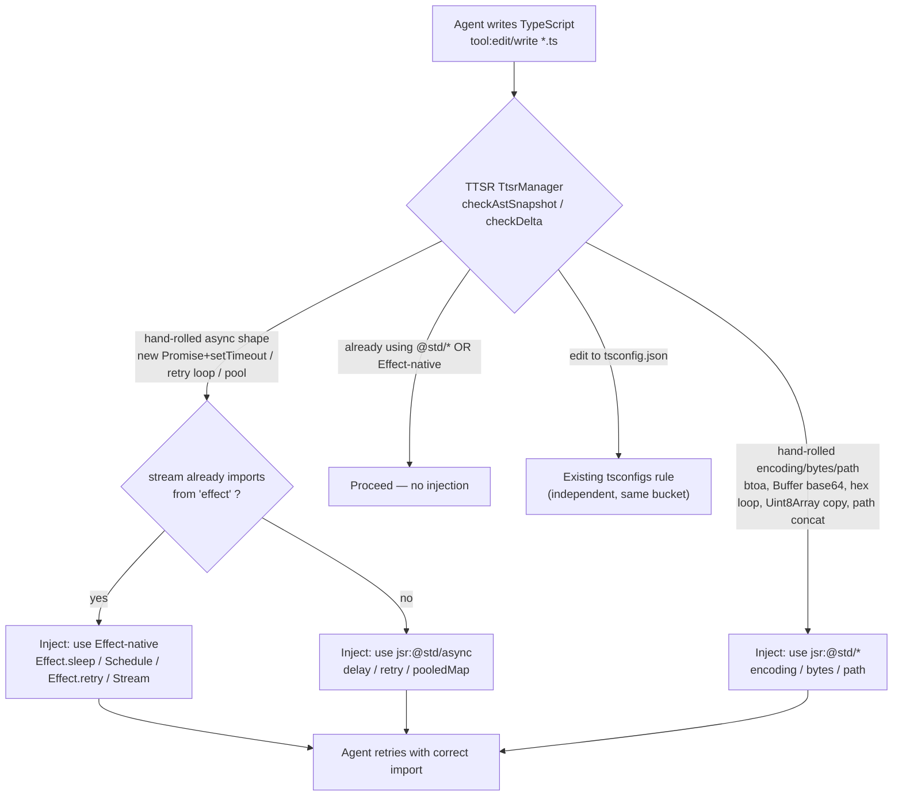

- **Objective.** Add a portable TTSR rule to `@systemfsoftware/omp-typescript-discipline` (installable in any repo via `omp plugin link`) that steers the agent away from hand-rolling primitives covered by JSR `@std/*`, centred on encoding (base64/hex/URL) and async (delay/debounce/retry/pool) with extensible coverage for `bytes`/`path`/`streams`. **In Effect workspaces the rule yields to Effect-native primitives** (`Effect.sleep`/`Schedule`/`Stream`) — precedence is `Effect > @std/* > hand-rolled` — detected portably via `from "effect"` imports, not via this workspace's catalog.
- **Authority hierarchy.** `AGENTS.md` (workspace invariants, `REPO-A1` sandwich; `REPO-A5` audience is every adopter, never this checkout) > `CONSTITUTION.md` > `omp/AGENTS.md` (DMMF, `S.TaggedError`) > this plan. This checkout is the first adopter, never the scope — per `REPO-A5` every design decision must name what an external installer observes (emitted `.md` rule, `omp ttsr list`/`test` behaviour, import specifier advice), never what this repo's `pnpm-workspace.yaml` or `.claude/deno.jsonc` happens to contain.
- **Stop conditions.** Stop and surface if (a) no regex can separate hand-rolled from legitimate use with a measured per-rule false-positive budget <0.5% on clean fixtures; (b) `omp ttsr test` cannot distinguish the new rule's trigger from the existing `tsconfigs` rule without cross-firing; (c) guidance would require a consumer to configure a repo-specific resolver — portable advice is `jsr:@std/*` (Deno/`pnpm` `jsr:` catalog) and `npm:@jsr/std__*` fallback, stated once.
- **Execution profile.** Direct implementation — no characterization of legacy parser needed. Rule is additive and additive-only; verify with `omp ttsr test`/`scan` fixtures and `omp/scripts/smoke-plugin.mjs`.
- **Tail ownership.** `omp/plugins/omp-typescript-discipline` owns the rule and its fixtures; removal is deleting the single `.md` file — no downstream package coupling. The rule ships via the published plugin tarball; this repo's own `catalog` is not the source of truth for consumers.

---

## Product Contract

### Summary

Any TypeScript project that installs `@systemfsoftware/omp-typescript-discipline` — via `omp plugin link` in any checkout — pays the same cost when an agent re-invents encoding, async timing, byte, or path primitives that already ship as tested `jsr:@std/*` modules. The fix is a single portable OMP TTSR rule that fires when the agent writes TypeScript that reinvents those primitives and injects the canonical `@std/*` (or Effect-native when `from "effect"` is present) import — verified identically in any repo via `omp ttsr list`/`test`/`scan` with no dependency on this workspace's `pnpm` catalog.

### Problem Frame

In any adopter, the AI's cheapest completion for base64 is a private loop and for delay is `await new Promise(r => setTimeout(r, ms))` — both reinvent correctness that `jsr:@std/encoding` and `jsr:@std/async` (or Effect-native `Effect.sleep`/`Schedule` when `effect` is imported) already own. An oxlint rule cannot reliably catch the reinvention (type-unaware, costly `N×p` budget per `docs/solutions/tooling-decisions/rule-admission-severity-and-accretion.md`), and a post-hoc review comment is silent. TTSR is the portable instrument that decides at generation time: it watches the edit/write stream, matches the reinvention, and rewinds with the correct import — whether the consumer resolves `jsr:` via `pnpm` catalog, Deno, or `npm:@jsr/std__*`.

- R1. A new rule file is added under `omp/plugins/omp-typescript-discipline/rules/` (e.g., `no-hand-rolled-std.md`) that ships with the existing plugin package — no new plugin, no workspace package; it loads in any checkout that installs the plugin with no workspace-specific setup.
- R2. The rule fires on hand-rolled encoding primitives: `btoa`/`atob`, `Buffer.from(..., 'base64')`/`toString('base64')`, manual hex loops (`charCodeAt`/`toString(16)` tables), and ad-hoc URL percent-encoding loops — directing to `jsr:@std/encoding` (`encodeBase64`/`decodeBase64`, `encodeHex`/`decodeHex`) importable portably as `jsr:@std/encoding` (Deno) or `jsr:` catalog / `npm:@jsr/std__encoding` (Node/pnpm). Encoding has no Effect-native overlap.
- R3. The rule fires on hand-rolled async primitives: `new Promise(resolve => setTimeout(resolve` as `delay`, manual debounce/throttle with `setTimeout`/`clearTimeout` closure state, retry loops (`for`/`while` with `try`/`catch` + `setTimeout`), and manual concurrency pooling — directing to `jsr:@std/async` (`delay`, `debounce`, `retry`, `pooledMap`/`pool`) **unless the edited file already imports from `"effect"`** (portable signal `from "effect"` or `from "effect/…"` in the stream), in which case the async row directs to Effect-native primitives (see R9). Detection is import-textual, not `package.json`/`pnpm-workspace.yaml` membership.
- R4. The rule extends, without hard requirement, to two high-value adjacent surfaces where reinvention recurs: `bytes` (manual `Uint8Array` concat/copy/equality loops → `@std/bytes`) and `path` (string concatenation with `"/"`/`"\\"` or `split("/")` path surgery → `@std/path`). Coverage beyond R2/R3 must not inflate the false-positive budget past the target.
- R5. Trigger uses stream-time detection (`condition` regex, and `astCondition` only if regex alone cannot hit the precision target) and is scoped to `tool:edit`/`tool:write` for TypeScript/JavaScript source globs — `**/*.{ts,tsx,mts,cts,js,jsx,mjs,cjs}` in any checkout. No scope on plain text/thinking streams.
- R6. Enforcement rewinds generation at the tool stream — `interruptMode: tool-only` per `omp://ttsr-injection-lifecycle.md:3` (`always`/`prose-only`/`tool-only`/`never`; global default `always`, rule overrides to `tool-only`) — via `agent.abort()` + 50ms retry with `<system-interrupt>` injection; it does not block CI as a lint `deny` would and does not use `never`'s deferred `<system-reminder>` that would let the hand-rolled code land first. Scope `tool:` ensures `text`/`thinking` never fire.
- R7. The rule names the portable canonical import forms — `jsr:@std/<module>` (Deno) and `jsr:` catalog / `npm:@jsr/std__*` (Node/pnpm) — with one illustrative catalog pin example, but does **not** require the consumer to have that pin pre-existing; the plugin remains dependency-free and installable via `omp plugin link`.
- R8. The rule is falsifiable in any checkout: a companion fixture set exists proving it triggers on known-bad samples and stays silent on known-good `@std/*` and Effect-native samples, via `omp ttsr test`/`scan` — per `CONST-E1`/`CONST-E3` gate discipline.
- R9. In workspaces that import `effect` the rule never steers from Effect-native toward `@std/*`: precedence `Effect-native > @std/* > hand-rolled` holds. The rule body states it portably ("if you already import from `effect`, prefer `Effect.sleep`/`Schedule`/`Stream`; otherwise use `@std/async`") and the trigger treats Effect-native lexemes (`Effect.sleep`, `Effect.retry`, `Schedule.`, `Stream.`, `Effect.timeout`, `Effect.forEach`) as known-good; async reinvention in a file that already imports `effect` suggests Effect-native primary with `@std/async` fallback.

### Scope Boundaries

- In scope: one portable markdown rule file plus its body guidance table (primitive → Effect / `@std/*` import → one-line example), and minimal verification fixtures/scripts needed to falsify it in any checkout via `omp ttsr test`/`scan`.
- Out of scope: migrating existing hand-rolled call sites — the rule is forward-looking in any adopter. Also out of scope: requiring the consumer to have a specific `jsr:` catalog pin or Deno lock pre-existing, and creating an oxlint rule parallel to the TTSR rule (TTSR is the chosen instrument per `shipped-runtime-enforcement`).
- Deferred to follow-up work: autofix/code-mod scripts, expanding coverage to `@std/fs`, `@std/streams`, `@std/crypto`, `@std/yaml`, and editor-layer diagnostics — each needs its own false-positive measurement in a generic consumer setup.

### Success Criteria

- `omp ttsr list` shows the new rule alongside `tsconfigs` with `condition` + `scope` populated; `omp ttsr test --file <bad>.ts` triggers only the new rule; `omp ttsr test --file good-std.ts` (using `@std/*`) and `good-effect.ts` (using `Effect.sleep`/`Schedule`) each trigger none — Effect-native and `@std/*` are both known-good; hand-rolled inside an Effect file still triggers and its injection offers Effect primary.

---

## Planning Contract

### Key Technical Decisions

- KTD1. One broad TTSR rule, not N narrow rules. The reinvention surface is one decision — "use the std lib" — with one remediation — "import from `jsr:@std/*`". Splitting into per-primitive rules multiplies `N` in the suite false-positive budget `1-(1-p)^N` and diagnostic volume, while the agent needs one injection, not five. The rule body instead carries a table of primitives → modules; the trigger is a disjunction.
- KTD2. Regex `condition` primary, `astCondition` only if regex precision fails. `condition` operates on streamed edit payloads (including hashline digests via `matcherDigest`) and is the mechanism the existing `tsconfigs` rule uses; it is introspectable via `omp ttsr test`. `astCondition` is reserved for cases where syntax shape (e.g., `for` loop copying bytes) cannot be separated from legitimate loops by lexemes alone.
- KTD3. Interrupt on tool writes, not on prose — `interruptMode: tool-only`. This rewinds generation at the point the hand-rolled code is streamed (`agent.abort()` + 50ms retry via `ttsr-interrupt.md` when matched), which is the cheap enforcement `shipped-runtime-enforcement` wants — not a lint `deny` that blocks CI. `omp://ttsr-injection-lifecycle.md:3` defines `always`/`prose-only`/`tool-only`/`never`; global default `interruptMode` is `always` and rule-level overrides it. Choosing `tool-only` matches the existing `tsconfigs` rule and prevents double-firing on `text`/`thinking`; `never` would only prepend a `<system-reminder>` to the tool result via `afterToolCall` without aborting, which lets the hand-rolled code land before the reminder — wrong for a discipline rule. `repeatMode` stays default `once` (re-trigger after `10` turns via `after-gap` only if measured reinvention recurs across turns — not assumed now).
- KTD4. Scope to `tool:edit`/`tool:write` per-file globs, not `globs` and not `text`/`thinking`. `omp://rulebook-matching-pipeline.md:6` distinguishes `scope: "tool:edit(*.ts), tool:write(*.ts)"` (stream allowlist, per-file path globs) from top-level `globs` (global file-path gate). Scope to `tool:edit(**/*.{ts,tsx,mts,cts,js,jsx,mjs,cjs})` + `tool:write(...)` so thinking text like "consider base64" never triggers; thinking is not monitored by default and must be opted in — we do not opt in.
- KTD5. Plugin `omp-typescript-discipline` is the correct carrier, not a new plugin. `omp/plugins/omp-typescript-discipline` already publishes `@systemfsoftware/omp-typescript-discipline@1.0.0` as the TypeScript configuration discipline; std-primitive discipline is the same audience and trigger surface. Adding a second plugin would incur distribution cost (second dir + second link) with no new capability port.
- KTD6. No new runtime `catalog:` entries committed by this change and no new workspace-specific install step required. The rule body cites portable import specifiers (`jsr:@std/encoding`, `jsr:@std/async`, etc. — resolvable as `jsr:@std/*` in Deno or via `jsr:` catalog / `npm:@jsr/std__*` in Node/pnpm, one illustrative example only) and notes the pattern, but does not edit this repo's `pnpm-workspace.yaml`. Shipping a pin without a consumer is speculative (`CONST-S3`) and would bind the rule to this checkout, violating `REPO-A5`; consumers add the pin when they adopt the import.
- KTD7. Effect-native precedence over `@std/*` for async primitives, detected portably. When a file's stream already contains `from "effect"` (or `from "effect/…"`) the stdlib for anything that composes/times/retries is Effect — `Effect.sleep`, `Schedule.exponential`/`Schedule.recurs`, `Effect.retry({ schedule })`, `Effect.timeout`, `Effect.forEach({ concurrency })`, `Stream` — and the agent must not be steered toward `jsr:@std/async`. Precedence `Effect > @std/async > hand-rolled` is enforced two ways: (a) the rule body states it explicitly as a portable heuristic ("if you already import from `effect`, prefer Effect-native; otherwise use `@std/async`") and its async table has two columns — Effect-native (primary) and `@std/async` (fallback) — so the injection never suggests `@std/delay` when `effect` is in scope; (b) the trigger treats existing Effect-native usage as known-good and excludes `Effect.`/`Schedule.`/`Stream.` lexemes from the async branch. Encoding/bytes/path have no Effect-native overlap. Rejected: two separate rules — doubles `N` and volume for one decision with a branch; one table with precedence note keeps `N=2`.

### High-Level Technical Design

_Figure: single TTSR addition with portable precedence branch for async — text-stream import signal, not `pnpm-workspace.yaml` membership. Two rules share the bucket but fire on disjoint shapes._

### Assumptions

- The OMP host loads `omp/plugins/*/rules/*.md` via `bucketRules` → `TtsrManager.addRule` where any non-empty `condition`/`astCondition` registers as TTSR-only and is tested by `omp ttsr list`/`test`/`scan` (per `docs/rulebook-matching-pipeline.md` and `docs/ttsr-injection-lifecycle.md`). Assumed verified by prior `tsconfigs` rule shipping in `0.1.0`. Behaviour is identical in any checkout that installs the plugin.
- `jsr:@std/*` resolves portably as `jsr:@std/*` in Deno or via `jsr:` catalog / `npm:@jsr/std__*` in Node/pnpm — the guidance cites the `jsr:` form and notes the fallback once; no consumer-side `.npmrc` or workspace `catalog` pre-existence is assumed.
- `repos/deno-std` at `release-` tag prefix is an in-repo reference for module inventory, not a build input the rule vendors; the consumer need not have it.
- Effect precedence is an **advisory heuristic in the rule body**, not a machine gate on `package.json` or catalog membership. TTSR `condition` cannot read `package.json` at match time — the text stream is the only input — so the rule's async guidance offers both arms and the agent applies the branch by the presence of `from "effect"` in the stream. Existing Effect-native lexemes are excluded from the async trigger so they never misfire; falling back to `@std/async` in an Effect file is a non-blocking style variance, not a suite failure.

### System-Wide Impact

- **Effect workspaces —-portably any consumer that imports `effect`.** In such files the async guidance must not pull toward `@std/async` — that would regress typed errors, interruption, and `Schedule` composition (exemplars in this repo: `packages/core/effect/atom/src/Atom.ts:1928` `Effect.sleep`, `packages/core/effect/daemon-spec/src/Backoff.ts:8` `Schedule.exponential`; portable signal is `from "effect"`, not a pinned `4.0.0-rc.111` catalog entry). The precedence note plus excluded Effect lexemes prevents cross-firing; verification must include an `effect-good` fixture that is portable.
- **Non-Effect workspaces — any consumer without an `effect` import.** `@std/async` is the correct remedy and the same rule's fallback arm fires without mention of Effect.
- **No new dependencies or build coupling in any checkout.** The TTSR rule ships as markdown; it adds no `dependencies` and does not change the consumer's `catalog` or lock. Adopters who choose `@std/*` add the pin then.

### Research

- Local: `omp/plugins/omp-typescript-discipline/rules/tsconfigs.md:1-13` frontmatter shape via `omp://rulebook-matching-pipeline.md:1` (`Rule` shape `condition?: string[]`, `scope`, `interruptMode`), `omp://ttsr-injection-lifecycle.md:1` (`TtsrManager.addRule`, `checkDelta`/`checkSnapshot`, per-file `matcherDigest`/`matcherEntries`, `repeatMode`) and this repo's precedent for the rule as a portable TTSR injection (not a lint `deny`).
- Portable resolver precedent: `jsr:@std/*` as `jsr:@std/*` in Deno and as `jsr:` catalog / `npm:@jsr/std__*` in Node/pnpm (one illustrative example). `repos/deno-std` module list confirms `encoding`, `async` (`delay`/`debounce`/`retry`/`pooledMap`), `bytes`, `path` are available at `1.x` in any checkout.
- Enforcement economics: `docs/solutions/tooling-decisions/rule-admission-severity-and-accretion.md` (`N×p` suite budget); Effect precedence signal is `from "effect"` in the stream (portable, not a workspace catalog entry) — `Effect.sleep` exemplars exist in this repo (`Atom.ts:1928`, `Backoff.ts:8`) but are not the source of truth for consumers.
- Prior art `2026-08-03-001-fix-jsonc` measured false-positive divergence between hand-rolled and std parsers narrowly; this rule's false-positive budget inherits that discipline.

---

## Implementation Units

### U1. Author the `no-hand-rolled-std` TTSR rule

- **Goal.** Ship the single markdown rule that fires on hand-rolled primitives and guides to `Effect-native` or `jsr:@std/*` per precedence.
- **Requirements.** R1, R2, R3, R4, R5, R6, R7, R9.
- **Dependencies.** None.
- **Files.**
  - `omp/plugins/omp-typescript-discipline/rules/no-hand-rolled-std.md` (create)
  - `omp/plugins/omp-typescript-discipline/package.json` (modify only if description warrants "and std primitive discipline"; otherwise leave — `REPO-S4` governs `publishConfig.exports` via `tsdown.config.ts`, not hand-edits)
- **Approach.**
  1. Name the file `no-hand-rolled-std.md` (kebab, rule name derived from filename per `buildRuleFromMarkdown`).
  2. Frontmatter: `description: "Prefer Effect / JSR @std/* over hand-rolled encoding, async, bytes, and path primitives"` (or equivalent — must mention both Effect and @std), `condition:` single regex disjunction for R2/R3 patterns but **exclude Effect lexemes** from async branch (negative lookahead or alternate grouping that skips `Effect\.sleep|Effect\.retry|Schedule\.|Stream\.|Effect\.timeout|Effect\.forEach`) so existing Effect usage never triggers; e.g., `btoa\s*\(|atob\s*\(|Buffer\.from\([^)]*['"]base64['"]|...|(?<!Effect\.|Schedule\.|Stream\.)new\s+Promise\s*\(\s*\w+\s*=>\s*setTimeout` — tuned during impl and verified via `omp ttsr test` against `good-effect.ts`; keep as single-line string which `parseFrontmatter` normalizes to `condition: string[]`), `scope:` list of `tool:edit(**/*.{ts,tsx,mts,cts,js,jsx,mjs,cjs})` and `tool:write(...)` mirrors (per `omp://rulebook-matching-pipeline.md:6` — `scope` is the allowlist, not top-level `globs`), `interruptMode: tool-only` (overrides global `always`; `never` would only emit `<system-reminder>` via `afterToolCall` and let the hand-rolled write land — wrong for this rule; see `omp://ttsr-injection-lifecycle.md:3-4`),
  3. Body: one-paragraph harm, then **precedence banner** `> Effect-native > @std/* > hand-rolled — in packages that depend on effect, use Effect; elsewhere use @std/*`, then table `Hand-rolled signal → Effect-native (if in scope) → @std/* (fallback) → Import example` with rows: `new Promise+setTimeout → Effect.sleep → delay from jsr:@std/async`; `retry loop → Effect.retry({ schedule: Schedule.exponential }) → retry from @std/async`; `pool/concurrency → Effect.forEach({ concurrency }) / Stream → pooledMap from @std/async`; encoding/bytes/path rows keep single `@std/*` column (no Effect overlap). Follow with one-line `catalog:` pin note and closing "when not to apply" including "already using Effect-native or @std/*".
  4. Keep ≤70 lines (precedence table justifies +10 over prior 60); detail routes to Appendix — `ADOC-A6`/`A8`.
- **Patterns to follow.** `omp/plugins/omp-typescript-discipline/rules/tsconfigs.md` frontmatter shape and `scope` glob syntax; `docs/rulebook-matching-pipeline.md` frontmatter parsing; `packages/core/effect/atom/src/Atom.ts:1928` and `daemon-spec/src/Backoff.ts:8` for Effect-native exemplars.
- **Test scenarios.**
  - Body contains `description`, `condition`, `scope` with at least one `tool:edit` and `tool:write` glob — verified by `omp ttsr list --json | jq`.
  - Condition regex compiles in JS (`new RegExp(condition)`) and skips Effect lexemes (manual unit: `Effect.sleep` string does not match).
  - Rule appears in TTSR bucket, not always-apply/rulebook.
- **Verification.** `omp ttsr list` shows two rules (`tsconfigs`, `no-hand-rolled-std`) with `condition` non-empty and `scope` containing `tool:` entries; `node omp/scripts/smoke-plugin.mjs omp/plugins/omp-typescript-discipline/dist/index.js` still passes if plugin has dist (or `pnpm --filter @systemfsoftware/omp-typescript-discipline build` then smoke).

### U2. Verification harness — fixtures, `omp ttsr test`/`scan`, and changeset

- **Goal.** Prove the rule triggers precisely, respects Effect precedence, and ships.
- **Requirements.** R8, R9.
- **Dependencies.** U1.
- **Files.**
  - `omp/plugins/omp-typescript-discipline/tests/fixtures/no-hand-rolled-std/{bad-encoding.ts,bad-async.ts,bad-bytes.ts,bad-path.ts,good-std.ts,good-effect.ts}` (create — minimal 5-10 line samples)
  - `.changeset/no-hand-rolled-std-ttsr.md` (create)
- **Approach.**
  1. Bad fixtures: `bad-encoding.ts` with `btoa(data)` and `Buffer.from(x, 'base64')`; `bad-async.ts` with `await new Promise(r => setTimeout(r, 100))` and `let t; function debounce(fn){clearTimeout(t); t=setTimeout(fn,200)}`; `bad-bytes.ts` with `for (let i=0;i<a.length;i++) out[i]=a[i]` concat; `bad-path.ts` with `const p = dir + "/" + name`. Good fixtures: `good-std.ts` imports `encodeBase64` from `jsr:@std/encoding`, `delay` from `jsr:@std/async`, `concat` from `jsr:@std/bytes`, `join` from `jsr:@std/path`; `good-effect.ts` uses `Effect.sleep`, `Effect.retry({ schedule: Schedule.exponential(Duration.millis(10)) })`, `Effect.forEach(arr, fn, { concurrency: 4 })`, `Schedule.spaced` — none must trigger.
  2. Run `omp ttsr test --file <bad>` for each bad — expect matched rule `no-hand-rolled-std`; `omp ttsr test --file good-std.ts` and `good-effect.ts` — expect zero matches. Crucially, `good-effect.ts` proves async branch excludes Effect lexemes; a regression where `Effect.sleep` triggers is a P1 failure. Run `omp ttsr scan omp/plugins/omp-typescript-discipline/tests/fixtures` — expect exactly the four bad files flagged.
  3. Measure false-positive budget: `omp ttsr scan` over both good fixtures plus a sample of `packages/**/{src,tests}/**/*.ts` (head 20 files, half from Effect workspaces) — target <0.5% firing on clean files; adjust regex breadth if exceeded (prefer narrowing over adding `astCondition`).
  4. Write changeset `---\n"@systemfsoftware/omp-typescript-discipline": patch\n---\nEnforce JSR @std/* over hand-rolled primitives with Effect-native precedence (Effect > @std/* > hand-rolled)` with consumer-visible note, no internal paths.
- **Patterns to follow.** `scripts/guard-no-hand-rolled-jsonc.mjs --selftest` pattern for known-good/known-bad fixtures; `omp ttsr test`/`scan` usage from `docs/ttsr-injection-lifecycle.md`; changeset shape from `.changeset/omp-typescript-discipline-plugin.md`.
- **Test scenarios.**
  - Known-bad: each `bad-*.ts` triggers, and `--rule no-hand-rolled-std` isolates it from `tsconfigs` rule.
  - Known-good std: `good-std.ts` does not trigger; nor does a `tsconfig.json` edit trigger the new rule (disjoint scopes).
  - Known-good Effect: `good-effect.ts` with `Effect.sleep`/`Schedule`/`Effect.retry`/`Stream` does not trigger — validates precedence exclusion. Counter-test: editing `good-effect.ts` to add a `new Promise(r=>setTimeout)` alongside existing Effect code must still trigger (hand-rolled within Effect workspace is still wrong — should suggest Effect, not @std).
  - Gate falsifiability: deleting the rule file makes `omp ttsr list` lose the entry and `omp ttsr test --file bad-encoding.ts` go silent.
  - Budget: scan of 20 clean source files yields zero unexpected fires, or fires are enumerated and narrowed before landing.
- **Verification.** `omp ttsr list --json` includes the rule; `omp ttsr test` on all fixtures matches expectation (including Effect precedence); `pnpm --filter @systemfsoftware/omp-typescript-discipline exec tsc --noEmit` and repo `pnpm check:agents` (knip) pass; changeset file exists.

---

## Verification Contract

| Gate                   | Command                                                                                                                                                                       | When                                           | Covers                                                               |
| ---------------------- | ----------------------------------------------------------------------------------------------------------------------------------------------------------------------------- | ---------------------------------------------- | -------------------------------------------------------------------- |
| Type / discipline lint | `pnpm --filter @systemfsoftware/omp-typescript-discipline exec tsc --noEmit` or `pnpm check:local` subset for `omp/*`                                                         | After U1                                       | Frontmatter compiles, no stray edits                                 |
| TTSR listing           | `omp ttsr list` and `omp ttsr list --json`                                                                                                                                    | After U1, U2                                   | Rule is TTSR-bucketed with condition+scope                           |
| TTSR matching (std)    | `omp ttsr test --file <bad                                                                                                                                                    | good-std>.ts`per fixture;`omp ttsr scan <dir>` | After U2                                                             |
| TTSR matching (Effect) | `omp ttsr test --file good-effect.ts` (must be silent); `omp ttsr test --file bad-async.ts` containing hand-rolled inside Effect file (must trigger toward Effect suggestion) | After U2                                       | Effect-native known-good excluded, precedence branch fires correctly |
| Plugin smoke           | `node omp/scripts/smoke-plugin.mjs omp/plugins/omp-typescript-discipline/dist/index.js` (build first if needed)                                                               | After U1                                       | Plugin still loads; zero-handler regression caught                   |
| Changeset              | `pnpm check:changeset` (or `scripts/guards/check-changeset.ts` path if present)                                                                                               | After U2                                       | Release intent present for turbo-hash-affecting plugin               |

## Definition of Done

- Global: rule file lands in `omp/plugins/omp-typescript-discipline/rules/no-hand-rolled-std.md` with `description`, `condition` (Effect-excluding async branch), `scope` (tool globs), `interruptMode: tool-only`, precedence banner `Effect > @std/* > hand-rolled`, and body table mapping hand-rolled signals to Effect-native or `jsr:@std/*` imports; `omp ttsr list`/`test`/`scan` passes on both `good-std.ts` and `good-effect.ts`; plugin smoke passes; changeset ships; branch leaves tree restartable (`pnpm check:agents` clean).
- U1 done when `omp ttsr list` shows the new rule in TTSR bucket and `omp ttsr test` on a single bad sample triggers it and on `good-effect.ts` does not.
- U2 done when all fixtures behave (bad triggers, good-std silent, good-effect silent, hand-rolled inside Effect file still triggers toward Effect), false-positive scan on clean samples <0.5%, and changeset exists.

---

## Appendix

### Sources & Research

- Local: `omp/plugins/omp-typescript-discipline/rules/tsconfigs.md:1-13` frontmatter shape via `omp://rulebook-matching-pipeline.md:1` (`Rule` shape `condition?: string[]`, `scope`, `interruptMode: never|prose-only|tool-only|always`, `globs` vs `scope`) and `omp://ttsr-injection-lifecycle.md:1` (`TtsrManager.addRule`, `checkDelta`/`checkSnapshot`/`checkAstSnapshot`, `interruptMode` override, `repeatMode`, per-file `matcherDigest`/`matcherEntries` and language inference); `omp/AGENTS.md:10-33` DMMF.
- Portable resolver precedent: `jsr:@std/*` as `jsr:@std/*` in Deno and as `jsr:` catalog / `npm:@jsr/std__*` in Node/pnpm (one illustrative example; not a workspace `pnpm-workspace.yaml:32-34` requirement). `repos/deno-std` module list confirms `encoding`, `async` (`delay`/`debounce`/`retry`/`pooledMap`), `bytes`, `path` are available at `1.x` in any checkout.
- Enforcement economics: `docs/solutions/tooling-decisions/rule-admission-severity-and-accretion.md` (`N×p` suite budget, warn dominated under `--quiet`, autofix preference).
- Std inventory: `repos/deno-std` `encoding` (`encodeBase64`/`decodeBase64`, `encodeHex`/`decodeHex`), `async` (`delay`, `debounce`, `retry`, `pooledMap`), `bytes` (`concat`, `equals`, `copy`), `path` (`join`, `relative`, `isAbsolute`) — version `1.x` majors.
- Effect inventory (portable signal `from "effect"`): exemplars in this repo `packages/core/effect/atom/src/Atom.ts:1928` `Effect.sleep`, `packages/core/effect/daemon-spec/src/Backoff.ts:8` `Schedule.exponential`; not the source of truth for consumers — any checkout with `from "effect"` gets Effect precedence.

### Risks

- Regex breadth vs precision: encoding/async patterns share lexemes with legitimate code (`setTimeout` itself is not hand-rolling; only wrapper shapes are). Mitigation: scope to tool writes only, prefer narrow alternations, measure false-positive budget on 20 clean files before landing, and fall back to `astCondition` for loop-shape detection if regex fires too eagerly.
- Effect vs `@std/async` conflict: the same `setTimeout` hand-roll could plausibly suggest either Effect or `@std/async`; suggesting the wrong one wastes a retry cycle and teaches the agent the wrong stdlib. Mitigation: precedence banner + excluded Effect lexemes in trigger + `good-effect.ts` fixture that asserts `Effect.sleep`/`Schedule` never triggers the async branch; hand-rolled inside Effect file still triggers but injection text offers Effect primary with `@std/async` fallback, so mis-routing is advisory, not a hard failure (per Assumptions).
- Second rule raises suite `N` from 1→2: at `p=1%` each, suite false-positive `≈2%`; at `p=5%` each, `≈9.75%`. Budget requires per-rule `p<0.5%` for suite `P≈1%`. Mitigation: keep regex deterministic, carry known-good fixtures for both `good-std.ts` and `good-effect.ts`, avoid hard abort — TTSR warn-with-retry is visible, oxlint `warn` is not (per admission doc).

### Open Questions

- None blocking. Deferred: whether a follow-up `astCondition` for manual `Uint8Array` concat loops is warranted after measuring regex precision on real scans.
