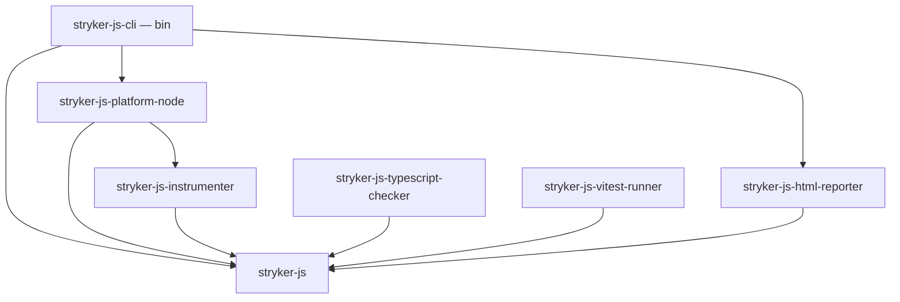
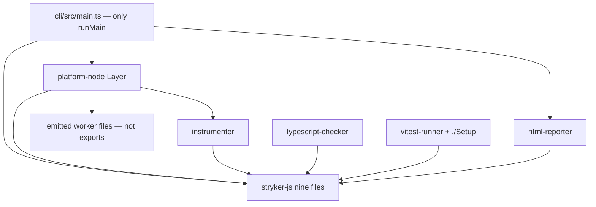

# Flatten Stryker-js onto Concept Modules and Platform-Node - Plan

## Goal Capsule

- **Objective:** Replace the stryker-js publish graph with a rootless language package of nine enumerated concept modules, a Node platform package, a CLI composition root, and four contaminated drivers, so architecture-conformance PASSes.
- **Product authority:** Session 2026-08-25: flatten to sandwich files; cell taxonomy stays dead; current `exports` are not law; no wildcard export maps; `internal` is not a specifier; host package is `stryker-js-platform-node` (not a bare `node`).
- **Open blockers:** None.
- **Execution profile:** one PR; implement units in dependency order; no local mutation run.
- **Product Contract preservation:** Product Contract unchanged.
- **Tail:** `ce-work` then LFG shipping (simplify, review, commit-push-PR, babysit).

---

## Product Contract

### Summary

Publish `@systemfsoftware/stryker-js` as the mutation-testing language: nine concept files, enumerated specifiers, no platform.
Publish `@systemfsoftware/stryker-js-platform-node` as the Node host: one inert `Layer`.
Keep the CLI as the only `runMain`.
Three driver packages exist today (instrumenter, typescript-checker, vitest-runner). They quarantine Babel, TypeScript, and Vitest. `@systemfsoftware/stryker-js-html-reporter` is a new package carved from the report grab-bag's HTML reporter; it quarantines `mutation-testing-elements`. The grab-bag's remaining reporters become unpublished built-ins of the platform package.

### Problem Frame

The subsystem is this repo's mutation gate and a published engine. The as-is graph fails its own law: `mutation-run` ships `@effect/platform-node` inside the embedder API; `plugin-api/core` is a junk drawer; `mutation-report` charges `mutation-testing-elements` for every reporter; `mutation-run/config/base` charges Babel to every JSON `extends`; `internal/` worker paths are treated as public specifiers; layer folders (`config/`, `sandbox/`, `mutators/`) carve by kind. There is one real `Workflow.make` in the tree. Renaming today's seven packages while leaving the Node host inside the run description is the same unit.

### Key Decisions

- Sandwich + only `.workflow.ts` / `.schema.ts` suffixes. (session-settled: user-directed — chosen over keep-folders and over restoring 13-role cell suffixes: a suffix is a drifted key.) Governs R3.
- Current public API is not the accused set. (session-settled: user-directed — chosen over mapping today's `exports` into new names.) Governs R1, R2, R4.
- Module = concept = file; specifiers are enumerated; `exports` contains no `*` pattern. (session-settled: user-directed — chosen over `./*` and over `./internal/*: null`.) Governs R4, R5.
- Host package is `@systemfsoftware/stryker-js-platform-node`. (session-settled: user-directed — chosen over bare `stryker-node`: that name reads as a chain node.) Governs R2.
- CLI composes; the language package does not. (session-settled: user-directed — chosen over a `polkadot-api`-style facade that pulls Node and Babel into plugin authors.) Governs R1, R6.
- Non-HTML reporters are unpublished built-ins of the platform package. (session-settled: user-approved — chosen over a grab-bag report package: only HTML has contamination.) Governs R2.

### Requirements

**Publish graph**

- R1. The published language package is `@systemfsoftware/stryker-js`. It depends on Effect and not on `@effect/platform-node`, `@babel/*`, `typescript`, `vitest`, or `mutation-testing-elements`. Gate: its manifest `dependencies` / `peerDependencies` contain none of those names; importing every declared entry in a fresh process performs no I/O.
- R2. The other published packages are exactly: `@systemfsoftware/stryker-js-platform-node`, `@systemfsoftware/stryker-js-cli`, `@systemfsoftware/stryker-js-instrumenter`, `@systemfsoftware/stryker-js-typescript-checker`, `@systemfsoftware/stryker-js-vitest-runner`, `@systemfsoftware/stryker-js-html-reporter`. The HTML reporter package is new. No `@systemfsoftware/stryker-js-plugin-api`, `@systemfsoftware/stryker-js-mutation-run`, or `@systemfsoftware/stryker-js-mutation-report` remains resolvable. Gate: `git ls-files` under those three directories is empty; `pnpm install` has no workspace package by those names; a repo-wide search for those three names outside those directories returns zero hits.
- R3. Shipped source under the language and platform packages uses only `.workflow.ts` and `.schema.ts` as role suffixes. A `.workflow.ts` file is produced by `Workflow.make`. Layer-named directories (`core/`, `config/`, `sandbox/`, `mutators/`, `parsers/`, `utils/`) do not exist in shipped `src/`. Gate: a suffix census over those `src/` trees; `Workflow.make` appears in every `*.workflow.ts`; path segments matching that list count 0.

**Language surface**

- R4. `@systemfsoftware/stryker-js` `exports` enumerates exactly: `.`, `./Mutant`, `./Plugin`, `./Checker`, `./TestRunner`, `./Reporter`, `./Ignorer`, `./Evaluator`, `./Schema`, `./Run`, `./package.json`. No key contains `*`. Gate: the published tarball's `package.json#exports` key set equals that list.
- R5. Each of those nine concept specifiers is one file that names one capability. `.` re-exports those nine as namespaces and does not `export * from` a module. A published symbol has one specifier. Gate: `export * from` is absent from every declared entry; each exported binding appears under one specifier in the `.d.ts` rollups.
- R6. Importing `@systemfsoftware/stryker-js` or any of its subpaths constructs descriptions only. It does not spawn a process, read a config file, or open a sandbox. Gate: the import-purity check on every R4 specifier.

**Concept capabilities**

- R7. `./Mutant` is the mutant / location / file / plan vocabulary. `./Plugin` is `declarePlugin`, `PluginKind`, and the plugin-authoring vocabulary plugin authors import today — `RunConfiguration`, `SandboxDirectory`, `PluginEnvironment`, and `ContributionOf`. `./Checker`, `./TestRunner`, `./Reporter`, `./Ignorer`, `./Evaluator` are the five plugin ports (Evaluator carries `ExitClass`). `./Schema` is the options schema and the base preset as that entry's default export (the existing extends resolver reads `.default`). `./Run` is `runMutationTest`, `MutationRunStages`, and `RunEnvironment`. Gate: each subpath's rollup contains that capability's names and does not contain another concept's constructors; the `./Plugin` rollup contains the authoring vocabulary named above.

**Platform, CLI, drivers**

- R8. `@systemfsoftware/stryker-js-platform-node` `exports` enumerates `.` and `./package.json` only. `.` is an inert `Layer` that can sandbox, load plugins, and run workers. Worker scripts are files the layer opens by URL; they are not specifiers. Clear-text, progress, and JSON reporters are unpublished built-ins of this package. Gate: published `exports` key set is those two; resolving any `internal` or reporter specifier throws `ERR_PACKAGE_PATH_NOT_EXPORTED`; importing `.` performs no I/O.
- R9. `@systemfsoftware/stryker-js-cli` publishes a `bin` and no library export map beyond `package.json`. It is the only `runMain` / `NodeRuntime.runMain` in the subsystem. Gate: `exports` has no `.`; a search for those run primitives under the seven packages' `src/` returns exactly one site, in the CLI.
- R10. `@systemfsoftware/stryker-js-instrumenter` `.` is `instrument` plus its option/result/error schemas and carries the Babel substrate. `@systemfsoftware/stryker-js-typescript-checker` `.` is the TypeScript checker plugin. `@systemfsoftware/stryker-js-html-reporter` `.` is the HTML reporter plugin and carries `mutation-testing-elements` and `mutation-testing-metrics`. `@systemfsoftware/stryker-js-vitest-runner` enumerates `.` (the Vitest plugin) and `./Setup` (the file a consumer Vitest config imports). Gate: each driver's published `exports` key set matches; each named substrate appears only on that driver's manifest.

**Behaviour and conformance**

- R11. Observable CLI behaviour for every fixture the contract lane already exercises is unchanged. Gate: `pnpm --filter @systemfsoftware/stryker-js-cli test:contract` exits 0 in CI.
- R12. Architecture-conformance on `packages/testing/mutation/stryker-js` is PASS: zero SURVIVED findings under the skill's `verdict.ts`. Gate: that command exits 0 on a findings file whose sweep table is reconciled.

### Acceptance Examples

- AE1. A sibling `stryker.config.json` extends the base preset without depending on `@systemfsoftware/stryker-js-platform-node` or the instrumenter. **Covers R7, R1.**
- AE2. `import "@systemfsoftware/stryker-js-platform-node/internal/checker-worker"` throws `ERR_PACKAGE_PATH_NOT_EXPORTED`. **Covers R8.**
- AE3. A file named `config-merge.workflow.ts` that exports a plain `mergeRecords` and never calls `Workflow.make` is not shippable. **Covers R3.**
- AE4. A plugin author depends only on `@systemfsoftware/stryker-js` and does not receive `@babel/core` or `mutation-testing-elements` in their tree. **Covers R1, R10.**
- AE5. When `exports` contains `"./*"` or `"./internal/*"`, R4 / R8 fail. **Covers R4, R8.**

### Scope Boundaries

- `packages/testing/mutation/plugins/**` change only where the new specifiers force a compile.
- Every in-repo `stryker.config.json` that extends `@systemfsoftware/stryker-js-mutation-run/config/base` is re-pointed at `@systemfsoftware/stryker-js/Schema` in the same change, including the CLI's own config and the contract-lane fixture. The package allowlist that names the removed run package is updated with it.
- `repos/**` is read-only.
- HTML, Svelte, and the RegExp mutator stay as user-visible capabilities unless a later product decision retires them.
- No local mutation run by an agent.

<!-- ce-section: work-relationships -->

### How This Work Fits Together

This plan owns the publish graph, the enumerated language surface, and the platform/CLI split.

- Depends on the cell taxonomy already being deleted (`docs/plans/2026-08-16-001-refactor-cell-class-collapse-plan.md`).
- Supersedes the 08-23 sandwich rewrite's package map (`docs/plans/2026-08-23-002-refactor-strykerjs-effect-restructure-plan.md`) where that map kept `mutation-run` as the Node host and `plugin-api` as a second description package.
- Can proceed independently of leftover third-party deletions inside a driver once that driver's substrate list in R10 holds.

### Dependencies / Assumptions

- Seven packages exist under `packages/testing/mutation/stryker-js/` today; `util` is already gone.
- Old-to-new map: plugin-api → `@systemfsoftware/stryker-js`; mutation-run → split between `@systemfsoftware/stryker-js` `./Run` and `@systemfsoftware/stryker-js-platform-node`; mutation-report → split between `@systemfsoftware/stryker-js-html-reporter` and the platform package's built-ins.
- The contract lane is the behaviour pin; no new golden-output harness.
- `Workflow.make` lives in `@systemfsoftware/effect-cell-types`.

### Outstanding Questions

- None blocking. AE5 (tautological acceptance example) stays deferred under Deferred / Open Questions.

### Sources / Research

- As-is graph: `packages/testing/mutation/stryker-js/*/package.json` (seven packages; `mutation-run` depends on `@effect/platform-node`; `mutation-report` depends on `mutation-testing-elements` and lists `mutation-run` with no `src/` import).
- One `Workflow.make`: `packages/testing/mutation/stryker-js/cli/src/survivors-admission.workflow.ts`.
- One `NodeRuntime.runMain`: `packages/testing/mutation/stryker-js/cli/src/main.ts`.
- Layer to move: `packages/testing/mutation/stryker-js/mutation-run/src/run-layers.ts` (`makeRunLayer`).
- Plugin authoring types: `packages/testing/mutation/stryker-js/plugin-api/src/plugin/`.
- Preset: `packages/testing/mutation/stryker-js/mutation-run/src/config/base-preset.ts` (default export; resolver reads `.default`).
- Contract lane: `packages/testing/mutation/stryker-js/cli/tests/cli-contract.integration.test.ts` and `vitest.contract.config.ts` (`test:contract` exists).
- tsdown generates `package.json#exports` (`REPO-S4`). Pattern: `packages/testing/mutation/stryker-js/mutation-run/tsdown.config.ts`. CLI bin-only: `packages/testing/mutation/stryker-js/cli/tsdown.config.ts` (`exports.exclude`).
- Workspace glob `packages/testing/mutation/stryker-js/*` auto-registers new directories.
- Effect surface (vendored): `repos/effect/packages/effect/src/index.ts` namespace barrel; internals are not a product API.
- Prior plan whose package map this replaces: `docs/plans/2026-08-23-002-refactor-strykerjs-effect-restructure-plan.md`.
- Extraction-coverage: `docs/solutions/architecture-patterns/extraction-strands-the-origins-gate.md`.

---

## Planning Contract

### Key Technical Decisions

- KTD1. **tsdown owns `exports`.** Language `tsdown.config.ts` lists entries `index`, `Mutant`, `Plugin`, `Checker`, `TestRunner`, `Reporter`, `Ignorer`, `Evaluator`, `Schema`, `Run`. Platform lists `index` plus worker files under `exports.exclude`. Never edit `package.json#exports` by hand (`REPO-S4`). Governs R4, R8, R9.
- KTD2. **`Workflow.make` is only for pure decisions.** Config merge, mutant plan, and exit class become `*.workflow.ts`. Sandbox, plugin load, worker spawn, and FS stay in platform-node. Governs R3.
- KTD3. **Workers are emitted files.** tsdown builds them; they are not specifiers. The Layer opens them with `new URL(..., import.meta.url)`. No `import.meta.url === process.argv[1]` self-detect. Governs R8, R9.
- KTD4. **`mutation-testing-report-schema` lives on the language package.** `mutation-testing-metrics` and `mutation-testing-elements` live only on `@systemfsoftware/stryker-js-html-reporter`. Governs R1, R10.
- KTD5. **Hard cut, major changeset.** No deprecation window. One PR. `pnpm change` covers every package whose turbo `build` hash moves, including the three deletions. Governs R2.
- KTD6. **Import-purity smoke is a package test.** Import every R4 specifier in a fresh process and assert no I/O. That is the R6 gate. Governs R6.
- KTD7. **Moved tests move with the code.** Do not leave an empty suite behind a green command (`docs/solutions/architecture-patterns/extraction-strands-the-origins-gate.md`). Governs R11.

### High-Level Technical Design

`@systemfsoftware/stryker-js` is a new directory at `packages/testing/mutation/stryker-js/stryker-js/` (workspace glob picks it up). Platform-node and html-reporter are sibling directories under `packages/testing/mutation/stryker-js/`.

### Assumptions

- Thirteen in-repo `stryker.config.json` files extend `@systemfsoftware/stryker-js-mutation-run/config/base`. All re-point in U6.
- Pending `.changeset/` files that name the three deleted packages are rewritten or replaced in U6 so they do not silently non-release the new graph.
- `logging/` from plugin-api is unpublished: ports that need a logger take it as a parameter or through `RunEnvironment`, not a `./Logging` specifier.

### Sequencing

U1 → U2 → (U3 ∥ U4) → U5 → U6 → U7.

---

## Implementation Units

### U1. Scaffold the three new packages

- **Goal:** Create `@systemfsoftware/stryker-js`, `@systemfsoftware/stryker-js-platform-node`, and `@systemfsoftware/stryker-js-html-reporter` so later units have a home.
- **Requirements:** R2, R4, R8, R10
- **Files:**
  - `packages/testing/mutation/stryker-js/stryker-js/package.json`
  - `packages/testing/mutation/stryker-js/stryker-js/tsdown.config.ts`
  - `packages/testing/mutation/stryker-js/platform-node/package.json`
  - `packages/testing/mutation/stryker-js/platform-node/tsdown.config.ts`
  - `packages/testing/mutation/stryker-js/html-reporter/package.json`
  - `packages/testing/mutation/stryker-js/html-reporter/tsdown.config.ts`
  - matching `turbo.json`, `tsconfig.json`, `vitest.config.ts`, `oxlint.config.ts` copied from `plugin-api` / `mutation-report`
- **Approach:** Follow `plugin-api/tsdown.config.ts` for enumerated language entries and `cli/tsdown.config.ts` `exports.exclude` for platform workers. Do not hand-write `exports` (KTD1). Language depends on `effect` and `mutation-testing-report-schema` only (KTD4). Platform depends on `@effect/platform-node` and the language package. HTML reporter depends on the language package plus `mutation-testing-elements` and `mutation-testing-metrics`.
- **Test scenarios:**
  - After `pnpm --filter @systemfsoftware/stryker-js build`, published `exports` keys equal R4's list.
  - Platform published `exports` keys are `.` and `./package.json` only.
- **Verification:** `pnpm --filter @systemfsoftware/stryker-js attw` and the two sibling `attw` scripts exit 0.
- **Dependencies:** none

### U2. Fold plugin-api into nine concept files

- **Goal:** The language package is the mutation-testing language.
- **Requirements:** R1, R5, R6, R7
- **Files:**
  - `packages/testing/mutation/stryker-js/stryker-js/src/Mutant.ts`
  - `packages/testing/mutation/stryker-js/stryker-js/src/Plugin.ts`
  - `packages/testing/mutation/stryker-js/stryker-js/src/Checker.ts`
  - `packages/testing/mutation/stryker-js/stryker-js/src/TestRunner.ts`
  - `packages/testing/mutation/stryker-js/stryker-js/src/Reporter.ts`
  - `packages/testing/mutation/stryker-js/stryker-js/src/Ignorer.ts`
  - `packages/testing/mutation/stryker-js/stryker-js/src/Evaluator.ts`
  - `packages/testing/mutation/stryker-js/stryker-js/src/Schema.ts`
  - `packages/testing/mutation/stryker-js/stryker-js/src/Run.ts`
  - `packages/testing/mutation/stryker-js/stryker-js/src/index.ts`
  - sources today under `packages/testing/mutation/stryker-js/plugin-api/src/`
  - `packages/testing/mutation/stryker-js/mutation-run/src/config/base-preset.ts`
- **Approach:** One file per specifier. `index.ts` is `export * as Mutant from "./Mutant.ts"` (and the other eight). No `export * from`. `Plugin.ts` owns `declarePlugin`, `PluginKind`, `RunConfiguration`, `SandboxDirectory`, `PluginEnvironment`, `ContributionOf`. `Schema.ts` default-exports the base preset from `base-preset.ts`. `Run.ts` holds `runMutationTest`, `MutationRunStages`, `RunEnvironment` as descriptions — no `@effect/platform-node`. Move plugin-api tests that pin those types with the files (KTD7). Add the R6 import-purity smoke (KTD6).
- **Test scenarios:**
  - Importing `@systemfsoftware/stryker-js/Plugin` yields `RunConfiguration` and `SandboxDirectory`.
  - Importing `@systemfsoftware/stryker-js/Schema` then reading `.default` yields the base preset.
  - Importing every R4 specifier performs no I/O.
  - Language manifest has none of `@effect/platform-node`, `@babel/*`, `typescript`, `vitest`, `mutation-testing-elements`.
- **Verification:** language package `vitest run` and the import-purity smoke exit 0.
- **Dependencies:** U1

### U3. Move the Node host into platform-node

- **Goal:** `makeRunLayer` and workers live in `@systemfsoftware/stryker-js-platform-node`.
- **Requirements:** R3, R8, R9
- **Files:**
  - `packages/testing/mutation/stryker-js/mutation-run/src/run-layers.ts`
  - `packages/testing/mutation/stryker-js/mutation-run/src/checker/checker-worker.ts`
  - `packages/testing/mutation/stryker-js/mutation-run/src/worker-pool/`
  - `packages/testing/mutation/stryker-js/mutation-run/src/test-runner/child-process-test-runner-worker.ts`
  - `packages/testing/mutation/stryker-js/mutation-run/src/` (remaining Node-coupled stages)
  - `packages/testing/mutation/stryker-js/mutation-report/src/` except `html-reporter.ts`
  - `packages/testing/mutation/stryker-js/platform-node/src/`
- **Approach:** Move `makeRunLayer` to the platform package's `.`. Workers stay files; exclude them from `exports` (KTD3). Clear-text, progress, JSON, and progress-stream reporters become unpublished built-ins of this package (not specifiers). Pure stage decisions that remain become `*.workflow.ts` with `Workflow.make` (KTD2). No `runMain` here.
- **Test scenarios:**
  - `import "@systemfsoftware/stryker-js-platform-node/internal/checker-worker"` throws `ERR_PACKAGE_PATH_NOT_EXPORTED`.
  - Importing `.` performs no I/O.
  - Search for `NodeRuntime.runMain` / `runMain` under the seven packages' `src/` still has exactly one hit, in the CLI.
  - Every shipped `*.workflow.ts` contains `Workflow.make`.
- **Verification:** platform-node `vitest run` and `attw` exit 0.
- **Dependencies:** U2

### U4. Carve the HTML reporter

- **Goal:** HTML reporting is its own contaminated package.
- **Requirements:** R10
- **Files:**
  - `packages/testing/mutation/stryker-js/mutation-report/src/html-reporter.ts`
  - `packages/testing/mutation/stryker-js/html-reporter/src/`
- **Approach:** Move `makeHtmlReporter` and its tests. Depend on the language package, `mutation-testing-elements`, and `mutation-testing-metrics`. Export `.` and `./package.json` only.
- **Test scenarios:**
  - HTML reporter manifest lists `mutation-testing-elements`; language and platform-node do not.
  - A plugin author depending only on `@systemfsoftware/stryker-js` does not receive `mutation-testing-elements`.
- **Verification:** html-reporter `vitest run` and `attw` exit 0.
- **Dependencies:** U2

### U5. Point CLI and drivers at the new graph

- **Goal:** The CLI is the only composition root. Drivers compile against the language package.
- **Requirements:** R9, R10, R11
- **Files:**
  - `packages/testing/mutation/stryker-js/cli/src/main.ts`
  - `packages/testing/mutation/stryker-js/cli/src/cli-run.ts`
  - `packages/testing/mutation/stryker-js/cli/package.json` (via tsdown / workspace deps)
  - `packages/testing/mutation/stryker-js/cli/tests/cli-contract.integration.test.ts`
  - `packages/testing/mutation/stryker-js/cli/global-setup.ts`
  - `packages/testing/mutation/stryker-js/typescript-checker/src/`
  - `packages/testing/mutation/stryker-js/vitest-runner/src/`
  - `packages/testing/mutation/stryker-js/vitest-runner/tsdown.config.ts`
  - `packages/testing/mutation/stryker-js/instrumenter/src/`
- **Approach:** CLI depends on language + platform-node + html-reporter. It provides the platform Layer and calls `runMain` once. Retarget plugin-api imports to the nine specifiers. Rename vitest `./stryker-setup` entry to `./Setup`. Update the contract-lane allowlist and fixture extends to `@systemfsoftware/stryker-js/Schema`. Keep `test:contract` as the script name.
- **Test scenarios:**
  - `pnpm --filter @systemfsoftware/stryker-js-cli test:contract` exits 0.
  - A consumer Vitest config can import `@systemfsoftware/stryker-js-vitest-runner/Setup`.
- **Verification:** CLI `test:contract` and the three driver `vitest run` scripts exit 0.
- **Dependencies:** U3, U4

### U6. Delete the old graph and migrate the repo

- **Goal:** The three accused packages are gone and nothing in the repo names them.
- **Requirements:** R2
- **Files:**
  - `packages/testing/mutation/stryker-js/plugin-api/`
  - `packages/testing/mutation/stryker-js/mutation-run/`
  - `packages/testing/mutation/stryker-js/mutation-report/`
  - every in-repo `stryker.config.json` that extends `@systemfsoftware/stryker-js-mutation-run/config/base`
  - `packages/lint/oxlint/plugins/meta/recommended/scripts/guard-no-behavior.mjs`
  - `.changeset/` (new intent plus any pending files that name the deleted packages)
- **Approach:** Delete the three trees. Re-point extends to `@systemfsoftware/stryker-js/Schema`. Update the allowlist. Author a changeset whose body a registry consumer can read (KTD5). Rewrite stale pending changesets that still list the deleted names. Do not leave forwarding shims (`DEL1`).
- **Test scenarios:**
  - `git ls-files` under the three directories is empty.
  - Repo-wide search for the three package names outside those directories returns zero hits.
- **Verification:** that search prints zero lines; `pnpm install` has no workspace package by those names.
- **Dependencies:** U5

### U7. Prove conformance and the contract

- **Goal:** The gates named in R11 and R12 pass after the last edit.
- **Requirements:** R3, R11, R12
- **Files:** none new unless a gate needs a fixture path updated
- **Approach:** Run the contract lane. Run architecture-conformance on `packages/testing/mutation/stryker-js`. Census suffixes on language and platform `src/`. Run `pnpm check:local` after the last edit.
- **Test scenarios:**
  - Contract lane green.
  - Conformance verdict PASS (zero SURVIVED).
  - Suffix census: only `.workflow.ts` / `.schema.ts` as role suffixes; every `.workflow.ts` contains `Workflow.make`.
- **Verification:** `pnpm --filter @systemfsoftware/stryker-js-cli test:contract` exits 0; architecture-conformance `verdict.ts` exits 0; `pnpm check:local` exits 0.
- **Dependencies:** U6

---

## Verification Contract

| Gate          | Command                                                                         | Applies             | Done when                                  |
| ------------- | ------------------------------------------------------------------------------- | ------------------- | ------------------------------------------ |
| Contract lane | `pnpm --filter @systemfsoftware/stryker-js-cli test:contract`                   | U5, U7              | exit 0                                     |
| Language attw | `pnpm --filter @systemfsoftware/stryker-js attw`                                | U1, U2              | export key set equals R4                   |
| Platform attw | `pnpm --filter @systemfsoftware/stryker-js-platform-node attw`                  | U1, U3              | export key set is `.` and `./package.json` |
| Import purity | language package import-purity smoke                                            | U2                  | no I/O on R4 specifiers                    |
| Deleted names | repo-wide search for the three removed package names                            | U6                  | zero hits                                  |
| Conformance   | architecture-conformance `verdict.ts` on `packages/testing/mutation/stryker-js` | U7                  | zero SURVIVED                              |
| Local suite   | `pnpm check:local`                                                              | U7, after last edit | exit 0                                     |

No agent starts a mutation run.

---

## Definition of Done

- R1–R12 hold under the gates in the Verification Contract.
- U1–U7 complete; abandoned scaffold gone.
- Product Contract IDs unchanged.
- One PR; CI watched to decided.
- No `plugin-api`, `mutation-run`, or `mutation-report` directory or workspace name remains.

## Deferred / Open Questions

### From 2026-08-25 review

- **Fifth acceptance example restates the export-map gates** — Acceptance Examples (P3, adversarial, confidence 75)

  An acceptance example that restates a gate rather than strengthening it gives reviewers false confidence that the language and platform export maps are double-checked. The verification surface is illusory. The example fails when exports contain a wildcard or an internal specifier because those keys are already forbidden by the enumerated key-set gates.
