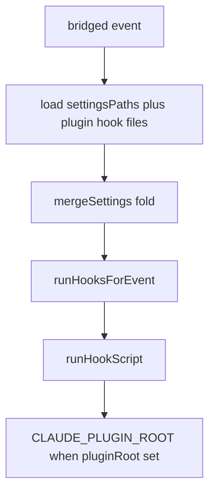

# Load Claude plugin hooks.json in omp-claude-compat - Plan

## Goal Capsule

**Objective.** For every enabled OMP-installed Claude Code plugin that has both `.claude-plugin/plugin.json` and `hooks/hooks.json`, dispatch every `type: command` hook on the matching bridged event with the same matcher and exit-code contract as project settings hooks, with `CLAUDE_PLUGIN_ROOT` set to that plugin's root, and with no project `.claude/settings.json` required.

**Authority hierarchy.** Issue 259 Product Contract > `CONSTITUTION.md` > root `AGENTS.md` > this plan > implementer judgement. `REPO-P1` is absolute.

**Stop conditions.**

- Stop if a unit would edit `repos/` (`REPO-S3`).
- Stop and ask before changing `MANAGED_SETTINGS_PATH` or `disableAllHooks` semantics (issue 259 Boundaries).
- Do not start a mutation run (`REPO-D3`).

**Execution profile.** Three units. Write the gatekeeper integration test first so a missing `hooks/hooks.json` load fails before production code exists. Then load and merge plugin sources. Then stamp `CLAUDE_PLUGIN_ROOT` on the child.

**Tail ownership.** LFG owns commit, push, PR, and CI watch after this plan returns.

---

## Product Contract

### Summary

`omp-claude-compat` catalogs only user, project, local, and managed `.claude/settings.json` files (`omp/plugins/omp-claude-compat/src/internal/SettingsPaths.ts:6-11`). Claude Code also runs hooks from an enabled plugin's `hooks/hooks.json` (Claude Code hooks reference, Hook locations table). A Write that a plugin PostToolUse hook would block therefore succeeds unless the user copies the hook into project settings.

The hook child env is `{ OMP_PROJECT_DIR, CLAUDE_PROJECT_DIR }` (`RunHookScriptExecutor.ts:64-70`). Plugin commands such as `"${CLAUDE_PLUGIN_ROOT}/hooks/run.ts"` cannot resolve even if the file were loaded.

### Problem Frame

The bridge already interprets settings hooks. The missing catalog is the plugin hook file. Installing [comment-checker](https://github.com/systemfsoftware/comment-checker) via `omp plugin install` therefore never runs the plugin's own PostToolUse hook.

### Key Decisions

- **Keep the settings catalog and `disableAllHooks` lattice unchanged.** Plugin files are extra non-managed sources in the existing fold. Governs R1, R6, R7.
- **Require both `plugin.json` and `hooks/hooks.json`.** A plugin with only the manifest is a no-op. Governs R5.
- **Merge, do not replace.** Settings hooks and plugin hooks that match the same event both run. Governs R4.
- **Do not require a project settings copy.** The gatekeeper fixture plants no `.claude/settings.json`. Governs R1, R8.

### Requirements

**Load and dispatch**

- R1. Every enabled OMP-installed Claude Code plugin that contains `.claude-plugin/plugin.json` and `hooks/hooks.json` contributes its `type: command` hooks to the same effective hook set `mergeSettings` already builds from settings files.
- R2. Those hooks dispatch on every bridged event they declare (`HookCatalog.ts` `BRIDGED_EVENTS`: PreToolUse, PostToolUse, PostToolUseFailure, UserPromptSubmit, SessionStart, SessionEnd, Stop, PreCompact, PostCompact), with the same matcher and exit-code contract as settings hooks.
- R3. The hook child for a plugin command observes `CLAUDE_PLUGIN_ROOT` equal to that plugin's root.
- R4. When a project `.claude/settings.json` hook and a plugin `hooks/hooks.json` hook match the same event, both run.
- R5. A plugin with `.claude-plugin/plugin.json` and no `hooks/hooks.json` leaves settings-only dispatch unchanged.
- R6. `settingsPaths` still returns exactly user, project, local, and managed paths. `MANAGED_SETTINGS_PATH` is unchanged.
- R7. `disableAllHooks` keeps today's meaning: a managed `true` empties every source; a non-managed `true` skips non-managed sources and keeps managed ones (`HookSettings.ts:193-221`). Plugin hook files are non-managed sources.

**Verification**

- R8. `pnpm --filter @systemfsoftware/omp-claude-compat test` exits 0 and includes a test that fails when plugin `hooks/hooks.json` is not loaded in a fixture with no project `.claude/settings.json`.
- R9. A plugin PostToolUse matcher for Write/Edit that exits 2 with stderr produces the same block/feedback contract as the equivalent project-settings hook in `tests/post-tool-review-feedback.integration.test.ts`.

### Actors

- A1. OMP session using `@systemfsoftware/omp-claude-compat`.
- A2. Enabled Claude Code plugin installed by `omp plugin install` (npm or marketplace).

### Key Flows

- F1. Plugin-only PostToolUse block
  - **Trigger:** Tool result for Write; plugin `hooks/hooks.json` matches Write; no project settings file.
  - **Actors:** A1, A2
  - **Steps:** Discover enabled plugin root; decode `hooks/hooks.json`; run command with `CLAUDE_PLUGIN_ROOT`; interpret exit 2 as the existing PostToolUse feedback contract.
  - **Covered by:** R1, R2, R3, R8, R9
- F2. Settings and plugin both match
  - **Trigger:** Same event; both sources declare a matching command hook.
  - **Actors:** A1, A2
  - **Steps:** Load settings sources; load plugin sources; `mergeSettings` concatenates; both commands run.
  - **Covered by:** R4
- F3. Manifest without hook file
  - **Trigger:** Enabled plugin has `plugin.json` only.
  - **Actors:** A1, A2
  - **Steps:** Skip that plugin; settings-only dispatch is unchanged.
  - **Covered by:** R5

### Acceptance Examples

- AE1. Covers R1, R8, R9. Given a temp home whose OMP registry lists one enabled plugin with `.claude-plugin/plugin.json` and a `hooks/hooks.json` PostToolUse Write matcher that exits 2 with stderr `blocked by plugin`, and a project cwd with no `.claude/settings.json`, when the agent writes a file, then the objection reaches the agent and the write is still reported as succeeded.
- AE2. Covers R3. Given AE1's plugin command prints `CLAUDE_PLUGIN_ROOT` to stderr and exits 0, when the write runs, then stderr contains that plugin's root path.
- AE3. Covers R4. Given a project settings PostToolUse hook that records `settings` and a plugin PostToolUse hook that records `plugin`, when the write runs, then both records exist.
- AE4. Covers R5. Given a project settings PostToolUse hook and an enabled plugin with `.claude-plugin/plugin.json` but no `hooks/hooks.json`, when the write runs, then only the settings hook runs.
- AE5. Covers R2. Given the same plugin `hooks/hooks.json` also declares a PreToolUse Write matcher that exits 2, when a Write tool call is dispatched via `onToolCall`, then that PreToolUse hook runs. Plant no project settings for this event. Export `onToolCall` from `HookPublic.ts`.
- AE6. Covers R2, KTD3. Given a plugin SessionStart command that writes a sentinel file and no project settings, when `onSessionStart` runs, then the sentinel exists.
- AE7. Covers R5, KTD5. Given a project settings PostToolUse hook and an enabled plugin whose `hooks/hooks.json` is not valid JSON, when the write runs, then only the settings hook runs and no plugin command is spawned.
- AE8. Covers R3, KTD4. Given a plugin command using args form (`command` is a binary, `args` contains `${CLAUDE_PLUGIN_ROOT}/hooks/run.sh`), when the write runs, then the child receives the expanded plugin-root path.

### Scope Boundaries

**Deferred for later**

- HTTP, MCP, prompt, and agent hook transports stay skipped (`HookSettings.schema.ts` `UnsupportedHook`).
- Skill-frontmatter and subagent-frontmatter hook locations from the Claude Code Hook locations table.
- Changing `disableAllHooks` so plugin hooks survive a project-level disable.

**Outside this product's identity**

- Editing `repos/oh-my-pi` (`REPO-S3`).
- Requiring the consumer to copy plugin hooks into `.claude/settings.json`.
- Loading a plugin-root `.claude/settings.json` instead of `hooks/hooks.json`.

### Sources

- Issue 259 body (goal, definitions, non-counting outcomes, acceptance, boundaries).
- `omp/plugins/omp-claude-compat/src/internal/SettingsPaths.ts`, `LoadSettingsExecutor.ts`, `RunHookScriptExecutor.ts`, `HookSettings.ts`, `HookDispatcherExecutor.ts`, `HookCatalog.ts`.
- `tests/post-tool-review-feedback.integration.test.ts` and `tests/__fixtures__/HookDispatcherFixture.ts`.
- Vendored enabled-plugin and marketplace-root enumeration: `repos/oh-my-pi/packages/coding-agent/src/extensibility/plugins/loader.ts` (`getEnabledPlugins`, `collectPluginsAtRoot`); `repos/oh-my-pi/packages/coding-agent/src/discovery/helpers.ts` (`listClaudePluginRoots`).
- Claude Code hooks reference (Hook locations; merge across levels) and plugins reference (`hooks/hooks.json` wrapper; `${CLAUDE_PLUGIN_ROOT}` in command strings), retrieved 2026-08-26.
- Wiki query (no path cited): merge is a fold; sibling hooks all run; discovery is manifest-declared. Query: "How should a compatibility bridge load Claude Code plugin hooks/hooks.json for enabled plugins and set CLAUDE_PLUGIN_ROOT without replacing project settings hooks". Corpus: software-wiki. No settled answer for OMP registry path layout.

Product Contract preservation: Product Contract authored here (`product_contract_source: ce-plan-bootstrap`).

---

## Planning Contract

### Key Technical Decisions

- KTD1. Discover enabled Claude plugin roots from disk. Order: parse Claude `~/.claude/plugins/installed_plugins.json` (drop `enabled: false`; keep `scope: local` only when its project path matches cwd); parse OMP user `~/.omp/plugins/installed_plugins.json` (same enable rule; same plugin id replaces Claude); parse project `.omp/plugins/installed_plugins.json` (same enable rule; same id replaces user); then add npm/link packages under those plugin `node_modules` trees that carry `.claude-plugin/plugin.json` and are not lockfile-disabled. Do not import `listClaudePluginRoots`. Reimplement over `FileSystem`. Issue 259 defines a Claude Code plugin as a directory containing `.claude-plugin/plugin.json`; a root-only Agent Plugins `plugin.json` is out of scope.
- KTD2. `SettingsSource` gains optional `pluginRoot`. After `parseSettings` succeeds on a plugin `hooks/hooks.json`, attach `pluginRoot` on that source. When `mergeSettings` concatenates, copy each command hook and stamp `pluginRoot` onto the copy. Do not mutate the decoded objects in place. Plugin sources are `managed: false`. Spawn reads `pluginRoot` from the copied command.
- KTD3. Add `readonly homeDir: string` to `HookSession`. Every dispatcher handler uses `ctx.homeDir`. Production sets it from `homedir()`. Tests pass a temp home. Do not plant fixtures under the real home. `collectSettingsGapsWithPaths` receives the same `homeDir` and the plugin `hooks/hooks.json` paths that load produced.
- KTD4. A plugin hook child's env is `{ OMP_PROJECT_DIR, CLAUDE_PROJECT_DIR, CLAUDE_PLUGIN_ROOT }`, built by adding `CLAUDE_PLUGIN_ROOT` to the existing two-key object at `RunHookScriptExecutor.ts:66`. Do not inherit `process.env`. Also substitute `${CLAUDE_PLUGIN_ROOT}` in `command` and `args` before spawn so args form (no shell) resolves. Settings hooks keep the two-key env.
- KTD5. A missing `hooks/hooks.json` is not an error (R5). Unreadable or undecodable `hooks/hooks.json` returns null from the plugin load step, matching `loadSettingsFile`. The dispatch fold treats null as absent. `collectSettingsGaps` reports that path as malformed, same as a settings file.
- KTD6. Pipeline assumption on the issue's "ask first" boundary: do not change `MANAGED_SETTINGS_PATH` or `disableAllHooks`. Plugin files follow the non-managed arm.

### High-Level Technical Design

`loadSettingsWithPaths` stays the single composition edge. Plugin discovery is I/O on `FileSystem`. Registry parse and the enable/shadow fold are pure.

### Assumptions

- Marketplace enablement is `installed_plugins.json` with `enabled !== false` (`listClaudePluginRoots` at `repos/oh-my-pi/packages/coding-agent/src/discovery/helpers.ts:958`).
- npm/link enablement is the lockfile `enabled` flag plus not listed in project `disabled` (`collectPluginsAtRoot` at `loader.ts:135-142`).
- `os.homedir()` is acceptable in production; tests inject home (KTD3).
- Expanding `${CLAUDE_PLUGIN_ROOT}` in command/args is sufficient; `${OMP_PLUGIN_ROOT}` is out of scope.

### Implementation Constraints

- `FileSystem` is the existing I/O port. Do not add a PluginManager requirement (`REPO-A2`).
- Do not export a second settings projection (`REPO-A3`).
- New tests only for the observable contracts in R8–R9 and AE1–AE5 (`REPO-T` / OP12).
- Test-first for U1: the gatekeeper must be red before the loader exists.

### Sequencing

U1 (failing integration contract) → U2 (discover, load, merge) → U3 (`CLAUDE_PLUGIN_ROOT` on the child). U3 can land in the same change as U2 if the gatekeeper already asserts AE2.

### System-Wide Impact

Every `loadSettingsWithPaths` and `collectSettingsGapsWithPaths` call site in `HookDispatcherExecutor.ts` must receive the same `homeDir`. A site that still uses only `settingsPaths(homedir(), ctx.cwd)` will dispatch plugin hooks on tool events and omit them from the session-start coverage report, or the reverse.

`collectSettingsGaps` should read each loaded plugin `hooks/hooks.json` with the same malformed/unsupported-type reporting as a settings path. That is coverage, not a second runner.

The host (`repos/oh-my-pi`) does not load `hooks/hooks.json` today. If it later does, this bridge would double-run plugin commands. That is a host change and is out of scope here.

### Risks

- **Registry shape drift.** Enable and shadow rules are copied from vendored helpers, not imported. Mitigation: keep the match criteria in KTD1 named against those files; AE1 plants the same `installed_plugins.json` shape the host writes.
- **Real-home leakage.** If `homedir()` remains the only home, the gatekeeper either cannot run or writes into the developer's plugins dir. Mitigation: KTD3.
- **`disableAllHooks` surprise.** A project-level disable will skip plugin hooks (KTD6). That is the issue's "ask first" default, not a silent semantic change.

---

## Implementation Units

### U1. Gatekeeper integration contract

- **Goal.** A fixture with no project `.claude/settings.json` fails until plugin `hooks/hooks.json` is loaded and the PostToolUse block/feedback contract matches settings hooks.
- **Requirements.** R8, R9; AE1–AE8 planted in one file.
- **Files.**
  - `omp/plugins/omp-claude-compat/tests/plugin-hooks.integration.test.ts` (create)
  - `omp/plugins/omp-claude-compat/tests/__fixtures__/HookDispatcherFixture.ts` (add plugin-tree helpers)
  - `omp/plugins/omp-claude-compat/tests/__fixtures__/HookPublic.ts` (export `onToolCall` and `onSessionStart`)
- **Approach.** Mirror `post-tool-review-feedback.integration.test.ts`: Effect Gherkin, `HookScopeLive`, temp cwd. Build a temp `homeDir` with one enabled marketplace registry entry whose `installPath` is a temp plugin root containing `.claude-plugin/plugin.json` and `hooks/hooks.json`. Do not write `cwd/.claude/settings.json` in AE1, AE2, AE5, AE6, AE8. AE5 uses `onToolCall` with `{ toolName: 'write', toolCallId, input }`. AE6 uses `onSessionStart`. Until U2 injects `homeDir` on `HookSession`, these stay red for that reason too.
- **Patterns.** `makeShellHookScript`, `makeSettingsJson` in `HookDispatcherFixture.ts`. AE3 and AE7 may use `makeSettingsJson` for the settings half only.
- **Test scenarios.** AE1–AE8 as written in Acceptance Examples.
- **Verification.** The new file is collected and AE1 fails because plugin hooks are not loaded or `homeDir` is not injectable, not because the fixture cannot build.
- **Dependencies.** None.

### U2. Discover, load, and merge plugin hook files

- **Goal.** Enabled plugin `hooks/hooks.json` files enter `mergeSettings` as non-managed sources without changing `settingsPaths`.
- **Requirements.** R1, R2, R4, R5, R6, R7; KTD1, KTD2, KTD3, KTD5, KTD6.
- **Files.**
  - `omp/plugins/omp-claude-compat/src/internal/LoadSettingsExecutor.ts`
  - `omp/plugins/omp-claude-compat/src/internal/CollectSettingsGapsExecutor.ts`
  - `omp/plugins/omp-claude-compat/src/internal/SettingsPaths.ts` (registry path helpers only; `settingsPaths` catalog unchanged)
  - `omp/plugins/omp-claude-compat/src/HookDispatcherExecutor.ts`
  - `omp/plugins/omp-claude-compat/src/HookSession.ts` and `src/internal/HookSession.ts` (`homeDir`)
  - `omp/plugins/omp-claude-compat/src/HookSettings.schema.ts` (`SettingsSource.pluginRoot`; optional `pluginRoot` on the copied command)
  - `omp/plugins/omp-claude-compat/src/HookSettings.ts` (`mergeSettings` copies and stamps)
  - new internal module for registry parse + plugin-file load, named for the work not the cell
- **Approach.** Pure: parse `installed_plugins.json` per KTD1 order. Impure: `FileSystem` reads. Require `.claude-plugin/plugin.json`. Missing `hooks/hooks.json` skips. Present file: `parseSettings`, attach `pluginRoot` on the source. Production sets `HookSession.homeDir` from `homedir()` at the composition root; tests pass the temp home. `collectSettingsGapsWithPaths` also receives plugin hook file paths.
- **Patterns.** `loadSettingsFile` empty-or-malformed → null. `mergeSettings` concat per `BRIDGED_EVENTS` with KTD2 copies.
- **Test scenarios.** AE1, AE3–AE7.
- **Verification.** AE1, AE3–AE7 green except AE2/AE8 if U3 is still open.
- **Dependencies.** U1.

### U3. Set CLAUDE_PLUGIN_ROOT on the plugin hook child

- **Goal.** A plugin command observes `CLAUDE_PLUGIN_ROOT` equal to its plugin root, including args form.
- **Requirements.** R3; KTD4; AE2, AE8.
- **Files.**
  - `omp/plugins/omp-claude-compat/src/internal/RunHookScriptExecutor.ts`
- **Approach.** When the copied command carries `pluginRoot`, use the three-key env in KTD4 and substitute `${CLAUDE_PLUGIN_ROOT}` in `command` and `args`. Settings hooks keep the two-key env.
- **Patterns.** Current `options.env` at `RunHookScriptExecutor.ts:66`.
- **Test scenarios.** AE2, AE8.
- **Verification.** AE2 and AE8 green. Full `pnpm --filter @systemfsoftware/omp-claude-compat test` exits 0.
- **Dependencies.** U2.

## Verification Contract

| Gate          | Command                                                              | Applies                                         | Done signal                                             |
| ------------- | -------------------------------------------------------------------- | ----------------------------------------------- | ------------------------------------------------------- |
| Package tests | `pnpm --filter @systemfsoftware/omp-claude-compat test`              | After U1 (expect AE1 red); after U3 (all green) | Exit 0; AE1–AE8 collected                               |
| Local check   | `pnpm check:local`                                                   | After last edit                                 | Exit 0                                                  |
| Changeset     | `pnpm change --bump patch` when turbo `build` hash moves (`REPO-R2`) | After behavior change                           | Intent names only consumer-visible behavior (`REPO-R3`) |

Do not run mutation (`REPO-D3`).

---

## Definition of Done

- AE1–AE8 pass. R6 and R7 hold: `settingsPaths` catalog and `disableAllHooks` lattice unchanged.
- `pnpm --filter @systemfsoftware/omp-claude-compat test` exits 0.
- `pnpm check:local` exits 0 after the last edit.
- Abandoned probe code is absent from the diff.
- Changeset present if the build hash moved; body states that enabled plugin `hooks/hooks.json` command hooks now run and receive `CLAUDE_PLUGIN_ROOT`.
- LFG opens the PR and watches CI.

### Per-unit done

- U1. New integration file collected; AE1 fails because plugin hooks are not loaded (or home is not injectable), not because the fixture cannot build.
- U2. AE1, AE3–AE7 pass aside from AE2/AE8 env assertions.
- U3. AE2 and AE8 pass; package test suite exits 0.
