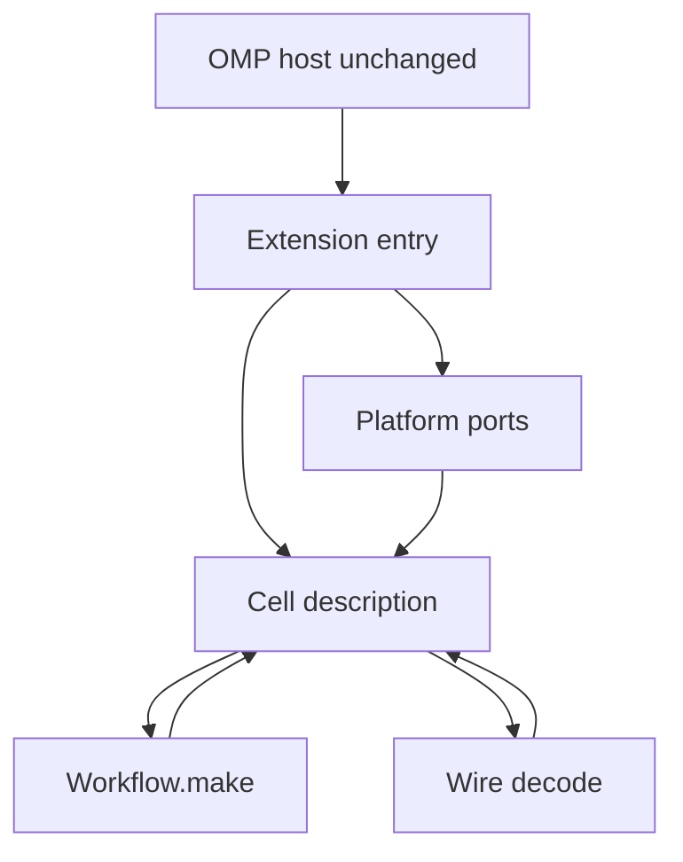
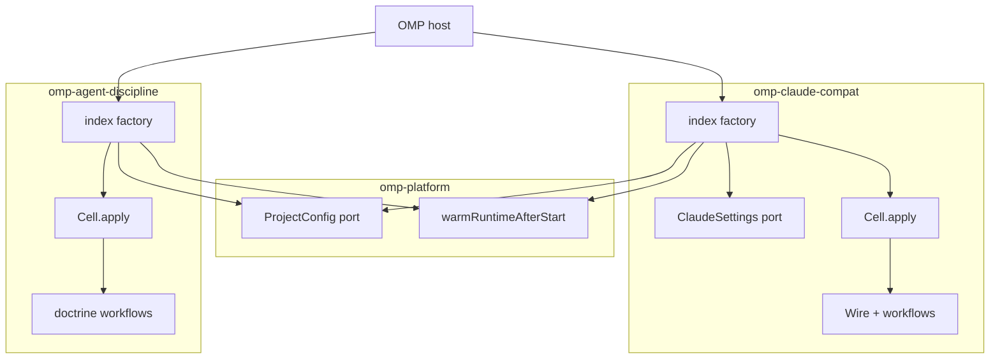

# OMP Plugin Sandwich - Plan

## Goal Capsule

- **Objective.** Replace the OMP host-plugin subsystem with a sandwich: thin extension entries own I/O, decision packages own verdicts, shared host I/O is one platform, Claude settings lookup is a port, and `@systemfsoftware/omp-utils` is deleted.
- **Authority.** Root `AGENTS.md` (`REPO-A1` sandwich, `REPO-A2` Wlaschin test, `REPO-A3` no exported projections, `REPO-A5` adopter-visible surface) > `CONSTITUTION.md` > `@systemfsoftware/effect-cell-types` (`Cell`, `Workflow`, `Wire`) > `omp/plugins/AGENTS.md` (`PLG1`–`PLG4`) > this plan. The July practice plan (`docs/plans/2026-07-20-001-feat-omp-plugin-practice-plan.md`) does not govern this rewrite.
- **Open blockers.** None.
- **Execution profile.** Deep cutover. One PR. `repos/` is read-only.
- **Tail ownership.** Implementer owns verification (`pnpm check:local`, per-package tests, smoke). Human owns merge.

---

## Product Contract

### Summary

Each host-loaded extension becomes a sandwich the cell types library already names: read, decode, decide, encode, write, interpreted rather than hand-wired. Shared host I/O is one platform. Claude settings lookup is a port on the Claude adapter. The utils bag is deleted by sending each export to its owner.

### Problem Frame

The two host extensions mix path knowledge, file reads, subprocess, and verdicts in one bag of per-operation requirement tags. Every hook event re-resolves Claude settings from a hardcoded path list. `@systemfsoftware/omp-utils` is a private grab bag: Claude wire translations used by one product sit next to project-config I/O and session lifecycle used by both. A later session cannot add a host or a settings source without copying that layout again.

### Key Decisions

- KD1. **Sandwich, not RPC.** (session-settled: user-approved — chosen over a settings-port-with-plugin-I/O keep and over an RPC host/plugin contract: these extensions are in-process; a wire protocol waits for a real process split.) Governs R1, R10.
- KD2. **Kill the bag by owner, not by micro-packages.** Shared I/O becomes platform; Claude wire stays with the Claude product. Governs R6, R7, R8.
- KD3. **Use `@systemfsoftware/effect-cell-types` as the sandwich, not as decoration.** Descriptions, `Workflow.make`, and `Wire` are the architecture. Per-operation `*Deps` tags that alias `Scope` are projections, not ports. Governs R1, R2, R3, R4, R5.
- KD4. **Adapter means our extension entry.** The vendored host is not edited. Governs R10, R12.
- KD5. **Both live host extensions take the cutover.** Leaving agent-discipline on the bag recreates it. Governs R9.

### Requirements

**Sandwich**

- R1. Every real I/O sandwich is a `Cell` description interpreted by `Cell.apply`.
- R2. Every decision is produced by `Workflow.make` with a schema command class.
- R3. Foreign payloads — Claude settings JSON, hook stdout, OMP tool input — are `Wire` declarations.
- R4. A pure translation (matcher, tool-name fold) is not wrapped in a description.
- R5. Per-operation requirement tags that project one capability down to one callsite are removed. A port names a substitutable capability.

**Ownership**

- R6. Shared host I/O that two products already share — layered project config and session-runtime lifecycle — lives in one platform.
- R7. Claude wire and Claude settings lookup live with the Claude product. Lookup is a port. Decision code never names a settings path and never reads the filesystem for settings.
- R8. `@systemfsoftware/omp-utils` is deleted. Every current export moves to its owner in the same change. No shim, alias, or “renamed to” residue.
- R9. Both host-loaded extensions — Claude bridge and agent discipline — take the cutover.
- R10. An extension entry registers host events and provides platform layers. It does not decide.

**Lifecycle**

- R11. Process-lifetime wiring stays at module top level. A session event never disposes a shared runtime. Factory registration still completes before the factory promise settles. The factory does not warm the runtime. Per `omp/plugins/AGENTS.md` `PLG1`–`PLG4`.

**Audience**

- R12. An adopter who installs a published extension observes the same host load model and the same hook and guard behaviour. They do not observe utils, path lists, or per-operation tags.

### Actors

- A1. OMP host — loads the extension factory; unchanged.
- A2. Extension entry — our adapter; `pi.on` plus layers.
- A3. Decision modules inside the plugin package — workflows only.
- A4. Platform — project config and session lifecycle.

### Key Flows

- F1. Settings resolve
  - **Trigger:** A Claude-bridge event needs the effective hook set.
  - **Actors:** A2, A3
  - **Steps:** Entry asks the Claude settings port. The port reads and merges. Decode is `Wire`. Merge and coverage are `Workflow.make`. The description returns a snapshot. The decision never sees a path.
  - **Covered by:** R1, R2, R3, R7
- F2. Host event
  - **Trigger:** The host emits a tool, prompt, or session event.
  - **Actors:** A1, A2, A3
  - **Steps:** Entry starts a description. Read gathers host payload and port snapshots. Decode crosses the foreign shape. Decide returns a verdict. Encode maps it to the host result. Write is the host return or a subprocess the adapter owns.
  - **Covered by:** R1, R2, R3, R10

### Acceptance Examples

- AE1. Missing settings file
  - **Covers R7.**
  - **Given:** No Claude settings file exists on any resolved path.
  - **When:** A tool-call event arrives.
  - **Then:** The port returns empty. The decision sees an empty snapshot. No path string appears in decision code or its tests.
- AE2. Managed hooks survive a local disable
  - **Covers R7, R3.**
  - **Given:** Managed settings enable a hook and a project file sets `disableAllHooks`.
  - **When:** Settings are resolved.
  - **Then:** The managed hook remains in the snapshot. Merge stays a decision, not a path compare in the caller.
- AE3. Decision package cannot load settings
  - **Covers R5, R7, R8.**
  - **Given:** The Claude decision package is typechecked alone.
  - **When:** A module in that package would import `FileSystem` or construct a settings path.
  - **Then:** The import is rejected. The only legal settings input is the snapshot type.
- AE4. Utils name is gone
  - **Covers R8.**
  - **Given:** The cutover is merged.
  - **When:** The tree is searched for `@systemfsoftware/omp-utils`.
  - **Then:** Zero hits outside git history. Plugins still load through the existing smoke tool.

### Scope Boundaries

**Deferred for later**

- RPC / `effect/unstable/rpc` as a host/plugin contract, until a second process exists.
- Publishing the platform, unless planning finds an adopter-visible reason.
- The July practice leftovers (marketplace catalog, first-class host tracer on `ExtensionContext`).

**Outside this product's identity**

- Editing `repos/oh-my-pi/`.
- Rewriting `omp-typescript-discipline` — it is a rules package, not a host-loaded extension.
- A new helper bag under a different name.

### Dependencies / Assumptions

- The host still loads one default-export factory per session and cache-busts the entry; chunks stay process-lifetime. Assumed from `omp/plugins/AGENTS.md`.
- `@systemfsoftware/effect-cell-types` remains the published sandwich (`Cell.apply`, `Workflow.make`, `Wire`). Assumed from `packages/core/effect/cell/types`.
- Agent-discipline I/O today is project-config plus runtime warm, not Claude settings. Assumed from current imports.

### Success Criteria

A planner can implement without inventing who owns I/O, what a port is, or whether utils survive. Smoke still loads both host extensions. Decision packages have no settings paths and no filesystem reads for settings. The utils package name is gone.

---

## Planning Contract

### Key Technical Decisions

- KTD1. **Platform package is `@systemfsoftware/omp-platform`, private, bundled.** One consumer-visible reason to publish does not exist (`REPO-A5`). Plugins keep it as a `devDependency` so tsdown inlines it, matching the current utils packaging and `docs/solutions/build-errors/tsdown-private-dependency-bare-import-dist.md`. Instantiates KD2 / R6, R8.
- KTD2. **Claude settings port lives on the Claude adapter, not the platform.** Only the Claude product has a second layout to hide. Platform stays the two-consumer I/O: project config and session lifecycle. Instantiates KD2 / R7.
- KTD3. **Capability ports are `ProjectConfig` and `ClaudeSettings`.** `FileSystem` and `ChildProcessSpawner` stay Effect platform ports. Every `*ExecutorDeps` tag that aliases `Scope` is deleted, not renamed. Instantiates KD3 / R5.
- KTD4. **Claude wire moves into `omp-claude-compat`.** `ToolInput`, `ToolName`, `Matcher`, `PermissionRule`, `Session`, `ContextMode`, `EditTarget` have one consumer. Instantiates KD2 / R8.
- KTD5. **Decisions stay in the same plugin packages.** A second library per product is not earned: one implementation of hook verdicts and one of doctrine. The sandwich is a description inside the package, not a new package. Instantiates KD2.
- KTD6. **AE3 is a type/import gate, not a new test file.** Decision modules must not import `effect/FileSystem` or `SettingsPaths`. Prove it by the import graph and existing typecheck, not a ceremony test. Instantiates R5, R7, AE3.

### High-Level Technical Design

Utils dissolution: platform takes `TomlLoader*` and `RuntimeLifecycle`. Claude-compat takes the wire modules. Then `omp/packages/omp-utils` is removed from the workspace.

### Assumptions

- tsdown still inlines `devDependencies` and externalizes `dependencies` / `optionalDependencies`. Verified by the private-utils solution doc.
- `omp/packages/*` already matches workspace globs, so `omp/packages/omp-platform` is picked up without a new glob.
- Existing hook integration tests remain the behaviour oracle for R12.

### Sequencing

U1 then U2 (independent of each other after the map is fixed) → U3 (needs wire + settings home) → U4 (needs settings port) → U5 (needs platform) → U6 (needs every consumer moved).

---

## Implementation Units

### U1. Stand up `omp-platform`

- **Goal.** Shared host I/O lives in one private package.
- **Requirements.** R6, R11
- **Dependencies.** None
- **Files.** `omp/packages/omp-platform/` (create from moved `TomlLoader*`, `RuntimeLifecycle`); `omp/packages/omp-utils/src/TomlLoader.ts` and siblings (cut); both plugin `package.json` / runtimes (point at platform)
- **Approach.** Move the two-consumer modules. Rename the service to a capability (`ProjectConfig`), not a file format. Keep `TomlLoaderLive` behaviour: user / project / local layers, fail-open empty on parse error. `warmRuntimeAfterStart` moves unchanged (`PLG4`).
- **Patterns.** Current `TomlLoader.ts` and `RuntimeLifecycle.ts`. Plugin runtimes already `Layer.provide` `TomlLoaderLive`.
- **Test scenarios.** Relocate the three existing toml-loader integration tests. Lifecycle: factory still must not await runtime construction.
- **Verification.** `pnpm --filter @systemfsoftware/omp-platform test` and both plugin typechecks resolve the new specifier.

### U2. Move Claude wire into `omp-claude-compat`

- **Goal.** Claude-only translations leave the bag.
- **Requirements.** R4, R8
- **Dependencies.** None
- **Files.** `omp/plugins/omp-claude-compat/src/` (receive `ToolInput*`, `ToolName`, `Matcher`, `PermissionRule`, `Session`, `ContextMode`, `EditTarget` and their tests); delete them from utils
- **Approach.** Keep the functions. Do not wrap them in `Cell`. Update in-package imports. `Wire` conversion of tool input / hook stdout is U3/U4, not this move.
- **Patterns.** Current call sites under `omp/plugins/omp-claude-compat/src/internal/`.
- **Test scenarios.** Relocate `normalize.integration.test.ts`. Existing hook tests stay green.
- **Verification.** `pnpm --filter @systemfsoftware/omp-claude-compat test`

### U3. Claude settings port as a Cell description

- **Goal.** Settings lookup is a port. Decisions see a snapshot.
- **Requirements.** R1, R2, R3, R7
- **Dependencies.** U2
- **Files.** `omp/plugins/omp-claude-compat/src/` settings port + description; `HookSettings.ts` / `HookSettings.schema.ts` (Wire + merge workflow); delete path leakage from `HookDispatcherExecutor.ts`; `omp/plugins/omp-claude-compat/tests/` for AE1/AE2
- **Approach.** `ClaudeSettings` service: `load(cwd) => snapshot`. Live adapter owns the path list. Description: read files → Wire-decode → `Workflow.make` merge/coverage → encode snapshot. Dispatcher yields the port, never `settingsPaths(homedir(), ctx.cwd)`.
- **Patterns.** Existing `mergeSettings` / `hookCoverage`. `Cell.apply` in `RunHooksForEventExecutor.ts`.
- **Test scenarios.**
  - AE1: empty tree → empty snapshot; tool-call does not throw.
  - AE2: managed hook + project `disableAllHooks` → managed hook remains.
  - Decision modules do not mention `/etc/claude-code` or `.claude/settings.json`.
- **Verification.** New composition tests with `@systemfsoftware/effect-memfs`; `pnpm --filter @systemfsoftware/omp-claude-compat test`

### U4. Remaining Claude I/O becomes descriptions; kill `*ExecutorDeps`

- **Goal.** The Claude plugin is a sandwich, not a deps bag.
- **Requirements.** R1, R2, R3, R5, R10
- **Dependencies.** U3
- **Files.** `HookDispatcherExecutor.ts`, `HookRuntime.ts`, `internal/Run*Executor.ts`, `SuperviseForkExecutor.ts`, `InjectInstructions*`
- **Approach.** One description per host event family (tool, prompt, session, inject). Read uses `ClaudeSettings`, `ProjectConfig`, `ChildProcessSpawner`. Decide uses existing `submitVerdict` / inject workflows. Delete every `*ExecutorDeps` class and its `Layer.effect(..., Effect.scope)` row. Scope comes from Effect, not a projection tag.
- **Patterns.** `RunHooksForEventExecutor.ts` `Cell.read/decode/decide/encode/write` bag.
- **Test scenarios.** Existing hook dispatcher and inject integration tests. A removed `*ExecutorDeps` must not remain importable.
- **Verification.** `pnpm --filter @systemfsoftware/omp-claude-compat test` and typecheck

### U5. Agent-discipline cutover

- **Goal.** Doctrine and delegation sit on platform ports, not utils.
- **Requirements.** R1, R2, R5, R9, R10, R11
- **Dependencies.** U1
- **Files.** `omp/plugins/omp-agent-discipline/src/DispatchDoctrineExecutor.ts`, `NoSkillDelegationExecutor.ts`, `Runtime.ts`, `index.ts`, matching tests
- **Approach.** Replace `TomlLoader` with `ProjectConfig`. Each guard is a description: read config → decode → existing workflow → encode host block/allow. Entry still registers doctrine first (`PLG3`). Warm via platform lifecycle.
- **Patterns.** Current handlers and `RunSafePolicy`.
- **Test scenarios.** Existing dispatch-doctrine and no-skill-delegation integration tests. Empty/missing TOML still fail-open.
- **Verification.** `pnpm --filter @systemfsoftware/omp-agent-discipline test`

### U6. Delete `omp-utils`

- **Goal.** The name is gone.
- **Requirements.** R8, R12, AE4
- **Dependencies.** U1–U5
- **Files.** `omp/packages/omp-utils/` (remove); workspace / turbo / knip / leaf docs that name it; both plugin manifests
- **Approach.** `DEL1`: no shim. Search `@systemfsoftware/omp-utils` and `omp-utils` in owned trees. Update `omp/AGENTS.md` / `omp/plugins/AGENTS.md` only where they name the old specifier (`PLG4` warm helper path).
- **Patterns.** `docs/solutions/build-errors/tsdown-private-dependency-bare-import-dist.md` — dists must not bare-import the private platform.
- **Test scenarios.** AE4: `git grep -nI -e '@systemfsoftware/omp-utils' -- . ':!*.lock'` prints zero lines. Smoke both plugin dists. Release dry-run still lists both plugins if that script exists.
- **Verification.** Smoke tool on both dists; `pnpm check:local`

---

## Verification Contract

| Gate             | Command                                                                                                       | Applies to |
| ---------------- | ------------------------------------------------------------------------------------------------------------- | ---------- |
| Platform tests   | `pnpm --filter @systemfsoftware/omp-platform test`                                                            | U1         |
| Claude tests     | `pnpm --filter @systemfsoftware/omp-claude-compat test`                                                       | U2–U4      |
| Discipline tests | `pnpm --filter @systemfsoftware/omp-agent-discipline test`                                                    | U5         |
| Smoke            | `node omp/scripts/smoke-plugin.mjs omp/plugins/omp-claude-compat/dist/index.js` and the agent-discipline dist | U4, U5, U6 |
| Utils gone       | `git grep -nI -e '@systemfsoftware/omp-utils' -- . ':!*.lock'` empty                                          | U6         |
| Local gate       | `pnpm check:local` after the last edit                                                                        | all        |

---

## Definition of Done

- Product Contract R1–R12 hold in the tree, not only in this doc.
- Both host extensions load and register through the smoke tool.
- `@systemfsoftware/omp-utils` has zero owned-tree hits.
- No `*ExecutorDeps` remains under `omp/plugins/`.
- Abandoned scaffolding from discarded approaches is gone.
- `pnpm check:local` exits 0 after the last edit.

---

## Appendix

### Research

- Session grounding quotes: `omp/plugins/omp-claude-compat/src/internal/SettingsPaths.ts`, `LoadSettingsExecutor.ts`, `HookDispatcherExecutor.ts`
- Fake deps bag: `HookRuntime.ts` `Layer.effect(*ExecutorDeps, Effect.scope)`
- Private-package inlining: `docs/solutions/build-errors/tsdown-private-dependency-bare-import-dist.md`
- Software wiki: port width is capability-shaped; a grab-bag is a fourth boundary edge. In-process RPC: no binding ruling. Agent Plugins spec is a different product.
