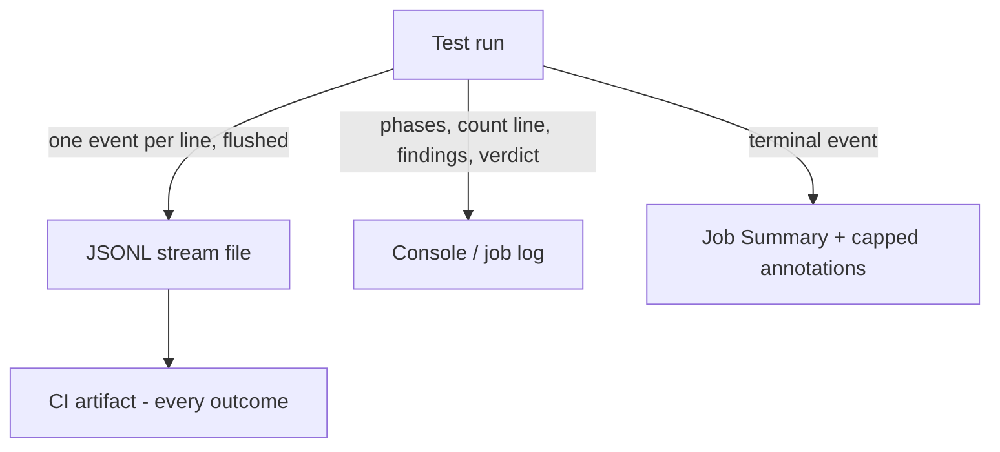

# Agent-Friendly Test Output - Plan

## Goal Capsule

- **Objective:** One output contract for this repo's test tooling — the mutation CLI, the shared vitest base, and the CI wiring that consumes them: machine events to a per-line-flushed JSONL file shipped as a CI artifact, bounded human-readable progress on the console, truthful counters, and stalls that diagnose themselves.
- **Product authority:** User, via brainstorm 2026-08-27 (Camp 1 confirmed; the failing mutation run was the graded evidence).
- **Authority hierarchy:** Product Contract governs behavior; Planning Contract governs how it is built. Repo rules (`AGENTS.md`, `CONSTITUTION.md`) outrank both. Evaluator surfaces (`.github/workflows/mutation.yml`) change in their own commit (CONST-E4).
- **Execution profile:** Six units in dependency order. U1 (silent children) unblocks the flood independently of the sink split.
- **Open blockers:** None. Both Outstanding Questions stay deferred and non-blocking.
- **Stop conditions:** Stop and surface rather than guess if vitest's native agent detection cannot be reconciled with this repo's `AGENT` convention without overriding `reporters`.
- **Tail ownership:** Implement through a PR watched to green. Publishing stays human (REPO-P1).
- **Product Contract preservation:** restructured, no scope change: R1 qualified for hard-kill vs finalizer; R4 caps console findings at 20 so R6 stays true.

---

## Product Contract

### Summary

Test tooling splits its audiences by sink, not by interleaving: machines read a JSONL event stream from a file (uploaded as a CI artifact on every outcome), humans and agents-in-a-hurry read bounded prose progress on the console — phases, a count line, findings, a verdict. Counters count every completed unit, a run that stops advancing says so and stops, and no child test process can print into the parent's log or emit workflow commands.

### Problem Frame

The Mutation job for `packages/lint/oxlint/plugins/cells/effect-workflow` ([run 33021073195](https://github.com/systemfsoftware/systemfsoftware/actions/runs/33021073195)) produced a 56,292,647-byte, 303,102-line job log in 15 minutes, then timed out. The useful signal in it was 97 lines (1 `stream` header, 4 `phase`, 1 `plan`, 91 `tick`); everything else was child test output. At 56MB the log is past the point where agent tooling can fetch it whole — the Actions log endpoint itself serves it truncated at 50MB. Diagnosis required scraping a haystack for a needle that the run never named.

Three verified mechanisms produced this:

- **The flood.** The mutation runner invokes vitest with `reporters: []` and `silent: true` (`packages/testing/mutation/stryker-js/vitest-runner/src/Runner.ts:488,504-505`), but vitest resolves an empty reporters list to its defaults — `['default', 'github-actions']` under `GITHUB_ACTIONS` — and `silent` gates console logs, never reporter emission (measured in the log: 32,682 default-reporter banner lines and 5,918 `::error` workflow commands carrying sandbox paths; the internal defaulting was confirmed against the installed vitest's compiled option resolution — vitest is not vendored). The shared base independently selects the same reporters (`packages/toolchain/vitest-config/lib/base.js:30-32`). The workers' stdout is relayed to the CLI's stdout, and the workflow's turbo invocation forwards it all with `--log-order=stream --output-logs=full` (`.github/workflows/mutation.yml:112`). GitHub's annotation quota (10 per step) was destroyed by 5,918 sandbox-emitted commands.
- **The lying counter.** The tick's `completed` advances only on `mutant` events (`packages/testing/mutation/stryker-js/cli/src/Output.ts:178-180,195`), and the stream emits `mutant` events only for actionable statuses — `Survived`, `NoCoverage`, `Timeout`, `RuntimeError`; `Killed` is counts-only (`packages/testing/mutation/stryker-js/platform-node/src/Reporter.ts:607-610`, `verdict-envelope.ts:33-39`). A run whose mutants all die — the healthy case — reports `completed: 0` forever: all 91 ticks read `completed: 0, total: 2075`. A progress counter was wired to a findings feed.
- **The undiagnosable end.** At the 15-minute step timeout the run was killed with no terminal event and no report; the workflow's no-report error fired correctly but generically, and every distinguishing fact sat buried in noise.

The existing designed contract (`docs/plans/2026-08-05-001-feat-agent-friendly-stryker-cli-plan.md`, R5/R17-R21) put the machine stream on stdout — the build-CLI convention (cargo, Terraform). The test-tool world ships the opposite: pytest-reportlog writes JSONL to a file flushed per line while the terminal keeps human progress; Playwright's CI default is the concise human `dot` reporter with machine JSON to an output file; vitest 4 auto-selects a failures-only `minimal` reporter inside AI agents and a `github-actions` reporter with capped annotations plus an automatic Job Summary — but only when no `reporters` option is configured, which is exactly what this repo's base has been overriding.

### Key Decisions

- **Machines read files, humans read consoles** (session-settled: user-directed — chosen over stdout-NDJSON streaming: the test-tool convention keeps logs human-scannable and agents fetch artifacts instead of scraping megabyte logs; grounded in pytest-reportlog, Playwright, vitest 4, Bazel BEP). Governs R1-R5, R12.
- **Native detection over hand-rolled selection** (session-settled: user-approved — stop overriding `reporters` in the shared vitest base; vitest 4's agent and CI behaviors apply only when that option is unset, so the override is what disabled them). Governs R6-R8.
- **Counters count units; findings feeds filter** (progress and findings are different concerns with different bounds). Governs R9-R10.
- **A program driving children owns their output** (an empty reporters array is not a spell for silence). Governs R5, R11.
- **The prior CLI contract's stdout clauses are superseded** (R5's "machine stream on stdout" and the stdout half of R17-R20 become the file-stream + console-render split of this plan; exit codes, error envelopes with remediation, `--llms`, and the event vocabulary carry over unchanged).

**Actors:**

- **Maintainer (human):** reads the CI job log and check summary in the GitHub UI; reads a terminal locally.
- **Agent (local):** runs test commands under `AGENT=1`; reads bounded console output live and stream/report files on demand.
- **Agent (CI):** fetches the stream artifact and reads the check summary; never scrapes raw logs.
- **CI (GitHub Actions):** hosts the log, annotation quota, Job Summary, and artifacts.

### How the sinks split

### Requirements

**Machine stream**

- R1. A mutation run writes its machine event stream — the existing `stream`/`phase`/`plan`/`mutant`/`tick`/`verdict`/`error` vocabulary — to a JSONL file, one event per line, flushed as written, opening with the schema-version header. When the process can still run finalizers (normal exit, stall, SIGTERM), the file closes with exactly one terminal event; a hard kill may ship a partial file without a terminal (AE4).
- R2. In CI, the stream file is uploaded as an artifact on every outcome — success, red verdict, crash, and timeout — so a killed run still ships its partial stream.
- R3. The console carries no machine serialization: no NDJSON on stdout or stderr; machines are served only by the stream file and surfaces derived from it.

**Console contract**

- R4. The console shows bounded human-readable progress only: phase transitions, at most one count line per 10 seconds carrying elapsed and completed/total with per-status counts, at most 20 actionable finding lines then a remainder count pointing at the stream file, and one terminal verdict or error block.
- R5. Program-driven child test processes are reporterless by construction — neither vitest's empty-list defaulting nor the sandbox's inherited configuration can add a human reporter — and emit no workflow commands.
- R6. Console volume is bounded by the run's duration, not its work size: a 15-minute run at any mutant count produces on the order of a hundred console lines.

**Audience detection**

- R7. Direct test runs stop overriding `reporters` in the shared vitest base; an agent-context run shows failures-only minimal output, and a GitHub Actions run gets capped annotations plus a Job Summary, preferring vitest's native detection with explicit configuration as fallback.
- R8. Classification stays one predicate per variable — `AGENT` presence outranking `CI` presence, TTY for humans — unchanged from the settled convention (`packages/toolchain/vitest-config/lib/base.js:6,10`, `CONCEPTS.md` machine mode).

**Truthfulness and stall diagnosis**

- R9. Progress counts every completed mutant regardless of status; the actionable-status filter applies to listed findings, never to counters.
- R10. A run whose completed count stops advancing for a bounded window self-terminates with an error terminal naming the phase, the age of the last advance, and the counts at that moment.
- R11. On SIGTERM, the run emits its terminal event and flushes the stream file before exiting, so artifact and log agree on why the run ended.

**CI wiring**

- R12. The mutation workflow stops forwarding full child output, derives annotations solely from the run's terminal event within GitHub's per-step cap, and writes the verdict table with top actionable findings to the Job Summary.
- R13. The existing no-report failure keeps failing red and names the stream artifact as the diagnosis path.

### Key Flows

- F1. Mutation run in CI
  - **Trigger:** push or PR triggers the Mutation workflow for a package.
  - **Actors:** CI, Agent (CI), Maintainer.
  - **Steps:** run starts; stream file opens with header; phases and count lines appear on the console; mutants complete and are counted; actionable findings are logged as prose; terminal event lands; artifact uploads on any outcome; summary and annotations derive from the terminal event.
  - **Outcome:** the job log is human-readable and bounded; the artifact is machine-complete; a stall is visible in the log and named in both sinks.
  - **Covered by:** R1-R6, R9-R13.

### Acceptance Examples

- AE1. Healthy CI run: the job log for a 2075-mutant run contains no NDJSON lines, no `::error` commands from sandbox paths, and a verdict block; its line count is bounded by duration, not mutant count; the stream artifact opens with the header, counts all 2075 completions across statuses, and closes with the verdict terminal. Covers R1-R6, R9.
- AE2. All-killed run: count lines advance to `2075/2075` with `killed: 2075`; no per-mutant findings are listed; the verdict is reachable and the run exits on its own verdict. Covers R9.
- AE3. Stall: results stop returning; after the bounded window the run self-terminates; the terminal error names the phase and the last-advance age; the CI step fails red with that reason, not a generic timeout. Covers R10.
- AE4. CI timeout kill: the stream file flushed up to the kill is uploaded; if SIGTERM reached the CLI, a terminal event is its last line; the no-report error names the artifact. Covers R2, R11, R13.
- AE5. Agent-local run: under `AGENT=1`, a direct vitest run prints failures-only minimal output; a mutation run prints phases and count lines; machine data is in files. Covers R4, R7-R8.
- AE6. GitHub Actions direct run: without `reporters` overrides, the log shows concise human progress, annotations are capped and derive from real failures, and a Job Summary appears. Covers R7.

### Scope Boundaries

- No MCP, TOON, or `--llms` surface work — the CLI's existing disclosure carries over.
- No mutation performance work (speed, caching, sharding) beyond what output correctness requires.
- Oxlint output stays as-is: lint scripts already select oxlint's native `agent` format under `AGENT` (44 manifests; format shipped in `repos/oxc/apps/oxlint/src/output_formatter/agent.rs`), and it is not broken.
- No redesign of interactive human TTY output beyond the bounds this contract sets.

### Outstanding Questions

- **Deferred:** whether the failing run's zero mutant events were all-Killed or never-returned — undeterminable from the surviving log; R9's truthful counter makes the difference observable on the next run (U2).
- **Deferred:** whether the stream file also becomes the omp agent loop's programmatic interface to mutation results, or the loop reads the existing report files.

---

## Planning Contract

### Key Technical Decisions

- KTD1. **A non-empty no-op reporter, never an empty array** (session-settled: user-directed — instantiates R5: vitest auto-defaults `reporters: []` to `['default','github-actions']` under `GITHUB_ACTIONS`). Pass a reporter object whose methods are no-ops so the list is non-empty and vitest will not inject defaults. Unsetting `GITHUB_ACTIONS` in the worker is not the fix — it would also hide genuine CI from other code. Governs R5.
- KTD2. **Emit every mutant status onto the file stream; filter only listings.** The live JSONL file records every completion so ticks and counters can advance (R9). The verdict envelope's `mutants` array and the console findings stay bounded to `ACTIONABLE_STATUSES` (`verdict-envelope.ts:33`). The old R20 "no mutant line for Killed" bound existed to keep a stdout verdict under 64 KB; the file sink removes that pressure. Governs R1, R9.
- KTD3. **Stream drain writes the file; a separate human renderer writes the console.** `Output.ts` currently frames NDJSON onto stdout (`makeRunEventStream`). Split: the same `RunEvent` queue drains to `reports/mutation-stream.jsonl` (create/truncate at open, append and flush per line — process-kill durability, not fsync). A human renderer consumes the same events (or the ProgressTally) and prints R4's prose to stderr so a TTY progress bar on stdout stays possible later without mixing. Governs R1, R3, R4.
- KTD4. **Stall window starts at three tick intervals (30 s) with no completed increment after the plan event, then U3 measures the slow-project max inter-advance gap and raises the window if that fixture would false-fire.** Shorter false-fires on checker/instrument phases; longer hides a hung run inside the 15-minute CI step. The window starts after `plan` (total known). Pre-plan silence is covered by existing phase lines, not this tripwire. Governs R10.
- KTD5. **Drop `reporters` from `sharedConfig` entirely** so vitest 4's unset-means-native path fires (agent → `minimal`, GITHUB_ACTIONS → github-actions + Job Summary). Keep `isAgent` / `isCI` / timeouts / `silent: 'passed-only'` / `bail`. If native agent detection does not honor `AGENT=1` (stop condition), set `reporters: ['minimal']` only when `isAgent` — still never set `default` or `github-actions` by hand. Governs R7, R8.
- KTD6. **Evaluator change is its own commit.** `.github/workflows/mutation.yml` is Evaluator (CONST-E4). U6 lands in a commit that contains only the workflow (and any script it newly invokes), observed failing-before / passing-after against a fixture log. Governs R2, R12, R13.

### High-Level Technical Design

Today `selectReporters` (`Reporter.ts:888-914`) keeps `progress-stream` in machine mode and `clear-text`/`progress` in human mode; `makeRunEventStream` writes NDJSON to stdout. After this work:

1. Child vitest (U1) cannot emit reporters.
2. Every mutant completion offers a `mutant` event (U2), so `Output.ts` progress state advances.
3. The event queue drains to a JSONL file; stderr gets the human renderer (U3).
4. A stall fiber watches completed (U4); SIGTERM still runs `emitMachineModeOutput` and `closeAndDrain`.
5. Direct vitest runs use native reporters (U5).
6. CI uploads the JSONL, stops `--output-logs=full`, writes Job Summary from the terminal event (U6).

### Assumptions

- Vitest is not vendored; empty-list defaulting was confirmed against the installed dist this session and against the job log. If a later vitest release changes that default, U1's no-op reporter still holds because the list is non-empty.
- `reports/mutation-stream.jsonl` next to the existing `reports/mutation-report.json` is the stream path (same directory the workflow already artifacts).
- Human TTY progress-bar behavior is out of scope (Scope Boundaries); stderr human lines in non-TTY are the CI/agent console.

### Sequencing

U1 → U2 → U3 → U4, then U5 in parallel with that chain after U1 (independent package). U6 last, own commit, after U3 so the artifact path exists.

### Risks

- Contract-lane CLI tests (`packages/testing/mutation/stryker-js/cli/tests/cli-contract.integration.test.ts`) assert stdout NDJSON kinds (`plan`/`tick`/`verdict`). They must move to the file stream and assert console is non-JSON. A missed assertion leaves R3 unenforced.
- CONST-E4: bundling `mutation.yml` with product code is a review reject. U6 is a separate commit.
- Native vitest agent detection may not see `AGENT=1`. Stop condition in Goal Capsule; fallback in KTD5.

---

## Implementation Units

### U1. Reporterless vitest in the mutation runner

- **Goal:** Program-driven child runs emit no default reporter output and no `::error` workflow commands.
- **Requirements:** R5.
- **Files:** `packages/testing/mutation/stryker-js/vitest-runner/src/Runner.ts`; tests under `packages/testing/mutation/stryker-js/vitest-runner/tests/`.
- **Approach:** Replace `reporters: []` with a non-empty no-op reporter (KTD1). Keep `silent: true` and `onConsoleLog: () => false`. Do not inherit the project's vitest `reporters` from the sandbox config file.
- **Test scenarios:** (1) `createVitest` options under `GITHUB_ACTIONS=true` do not resolve to `default` or `github-actions`. (2) A mutant run against a fixture that would fail tests produces no `::error` on the captured stdout. (3) `silent: true` remains set.
- **Verification:** `pnpm --filter @systemfsoftware/stryker-js-vitest-runner test` covering the new scenarios.
- **Dependencies:** none.

### U2. Count every completed mutant

- **Goal:** Tick and count lines advance for Killed/Ignored/CompileError as well as actionable statuses.
- **Requirements:** R9. Makes AE2 true.
- **Files:** `packages/testing/mutation/stryker-js/platform-node/src/Reporter.ts` (`makeProgressStreamReporter` around 607-610); `packages/testing/mutation/stryker-js/platform-node/src/Run.ts` (1155-1159); `packages/testing/mutation/stryker-js/cli/src/Output.ts` (progress from `mutant` events). Keep `isActionableStatus` on the verdict envelope (`verdict-envelope.ts:196-199`) and on console findings.
- **Approach:** Stop returning early before offering the `mutant` event (KTD2). `completed` in the event is the running total of all statuses. Console renderer (U3) still prints findings only when `isActionableStatus`.
- **Test scenarios:** (1) An all-killed fixture offers N `mutant` events with `completed` 1..N and `status: 'Killed'`. (2) Tick after those events reads `completed === total`. (3) Verdict envelope `mutants` array still excludes Killed. (4) Property: `completed` is monotonic, never exceeds `total`.
- **Verification:** existing CLI contract lane plus platform-node unit/composition tests for the reporter.
- **Dependencies:** none (can land before U3; stdout still noisy until U3).

### U3. File-sink stream and human console renderer

- **Goal:** NDJSON leaves the console; humans see R4 prose; machines read `reports/mutation-stream.jsonl`.
- **Requirements:** R1, R3, R4, R6.
- **Files:** `packages/testing/mutation/stryker-js/cli/src/Output.ts`; `packages/testing/mutation/stryker-js/platform-node/src/Reporter.ts` (`selectReporters`); `packages/testing/mutation/stryker-js/cli/tests/cli-contract.integration.test.ts` and fixtures.
- **Approach:** Drain `RunEvent` to the JSONL file with per-line flush (KTD3). Human renderer on stderr: phase line, count line on the existing 10 s tick (`elapsed`, `completed/total`, per-status counts), at most 20 actionable finding lines then `N more in reports/mutation-stream.jsonl`, one terminal verdict/error block. `selectReporters` no longer treats progress-stream as a stdout reporter. Record slow-project max inter-advance gap for U4 (KTD4).
- **Test scenarios:** (1) Contract lane: stdout/stderr contain zero lines beginning with `{`; the stream file's first line is `stream`, last is `verdict` or `error` on a clean exit. (2) Count lines appear at least every 15 s after `plan` (existing tick margin). (3) Actionable finding prints as prose naming file and mutator; Killed does not; a fixture with >20 actionable findings prints 20 lines plus a remainder. (4) 15-minute-scale fixture produces on the order of a hundred console lines (R6) — characterize with the slow-project fixture rather than a wall-clock 15 min.
- **Verification:** `pnpm --filter @systemfsoftware/stryker-js-cli test test:contract`.
- **Dependencies:** U2 (counters must be honest before the human count line is load-bearing).

### U4. Stall tripwire and SIGTERM flush

- **Goal:** A hung run names itself; a killed run still writes a terminal event and a flushed file.
- **Requirements:** R10, R11. AE3, AE4.
- **Files:** `packages/testing/mutation/stryker-js/cli/src/Output.ts`; CLI teardown / `emitMachineModeOutput`; contract fixtures (`slow-project` or a hung-runner double).
- **Approach:** After `plan`, if `completed` is unchanged for 30 s (KTD4), offer `error` with phase, last-advance age, and counts, then end the run. SIGTERM path already calls `emitMachineModeOutput` + `closeAndDrain`; assert the file's last line is the terminal event and is fully written.
- **Test scenarios:** (1) A runner that never returns mutant results after `plan` emits the stall error within 30 s + margin and exits non-zero. (2) Interrupting a live contract-lane process with SIGTERM leaves a parseable terminal line as the file's last line. (3) Pre-plan ticks do not trip the stall.
- **Verification:** CLI contract lane (real process, no fake timers — existing R33 discipline).
- **Dependencies:** U3.

### U5. Shared vitest base stops selecting reporters

- **Goal:** Direct test runs get vitest 4 native agent/CI reporter behavior.
- **Requirements:** R7, R8. AE5 (direct vitest half), AE6.
- **Files:** `packages/toolchain/vitest-config/lib/base.js`; `packages/toolchain/vitest-config/lib/base.d.ts` if the reporters type is declared.
- **Approach:** Delete the `reporters` key (KTD5). Leave `isAgent`/`isCI`/`isGithubActions`, timeouts, `silent`, `bail`, coverage. If native detection ignores `AGENT=1`, set `reporters: ['minimal']` only when `isAgent` and stop.
- **Test scenarios:** (1) With `reporters` unset and `AGENT` set, a passing test file prints no per-test pass lines (minimal). (2) `isCI` / `isAgent` predicates unchanged (presence, AGENT outranks CI) — characterization of `base.js:6,10`. (3) No `default` or `github-actions` string remains in `base.js`.
- **Verification:** package test if one exists; otherwise a small node assertion in the package or a documented check in `pnpm --filter` of the consuming test run under `AGENT=1`.
- **Dependencies:** none. Do not land before U1 — otherwise mutation sandbox runs inherit native `github-actions` from the package config until U1 forces the no-op.

### U6. Mutation workflow: artifact, logs, summary

- **Goal:** CI log is human and bounded; the stream file is always uploaded; diagnosis names the artifact.
- **Requirements:** R2, R12, R13. AE1, AE4 (workflow half).
- **Files:** `.github/workflows/mutation.yml` only (CONST-E4). A tiny helper under `scripts/tools/` only if the Job Summary cannot be a few lines of shell in the workflow — prefer in-workflow to avoid a second package.
- **Approach:** Upload `reports/mutation-stream.jsonl` alongside the existing report paths, `if: always()`. Replace `--output-logs=full` with turbo's error-only / hash-only log mode so child vitest cannot flood even if U1 regresses. Write Job Summary from the terminal event (score, counts, top actionable). No-report error names the stream artifact path. One annotation from the terminal error, never from children.
- **Test scenarios:** (1) Workflow YAML lists the jsonl path in `upload-artifact`. (2) `--output-logs=full` is absent. (3) Require-report step message includes the stream path. (4) Job Summary step writes score, counts, and top actionable from the terminal event — a fixture terminal with two survivors produces those two names in the summary file. (5) Annotation step emits at most one `::error` from the orchestrator, never from a sandbox path.
- **Verification:** review of the YAML plus the PR's Mutation workflow. Own commit.
- **Dependencies:** U3 (path must exist). Last.

---

## Verification Contract

- `pnpm --filter @systemfsoftware/stryker-js-vitest-runner test` after U1.
- `pnpm --filter @systemfsoftware/stryker-js-platform-node test` after U2.
- `pnpm --filter @systemfsoftware/stryker-js-cli test test:contract` after U3 and U4 (real process, no fake timers on tick/stall/SIGTERM).
- Direct vitest under `AGENT=1` after U5: failures-only.
- `pnpm check:local` after the last product commit (REPO-D1).
- Mutation workflow on the PR: log has no sandbox `::error`, no NDJSON, stream artifact present on timeout or success.
- Changesets: consumer-observable CLI/vitest-config/platform-node behavior → `pnpm change` with bump from what an adopter sees (REPO-R2/R3). `none` only if shipped sources moved with no exported behavior change.

---

## Definition of Done

- Every R1-R13 has a unit that names it and a test scenario that would fail if it were false.
- U1-U5 in product commits; U6 in its own evaluator commit (CONST-E4).
- CLI contract lane asserts: console is not JSON; stream file is JSONL with header first and terminal last; ticks count Killed; stall self-terminates.
- `pnpm check:local` exits 0 after the last product edit.
- PR opened and watched to green (REPO-D1/D2). Mutation job no longer produces a multi-megabyte log.
- Abandoned spikes removed (CONST-S4).
- CONCEPTS.md `machine mode (stryker CLI)` and `progress stream` entries updated to the file-sink split when this ships — not before.
