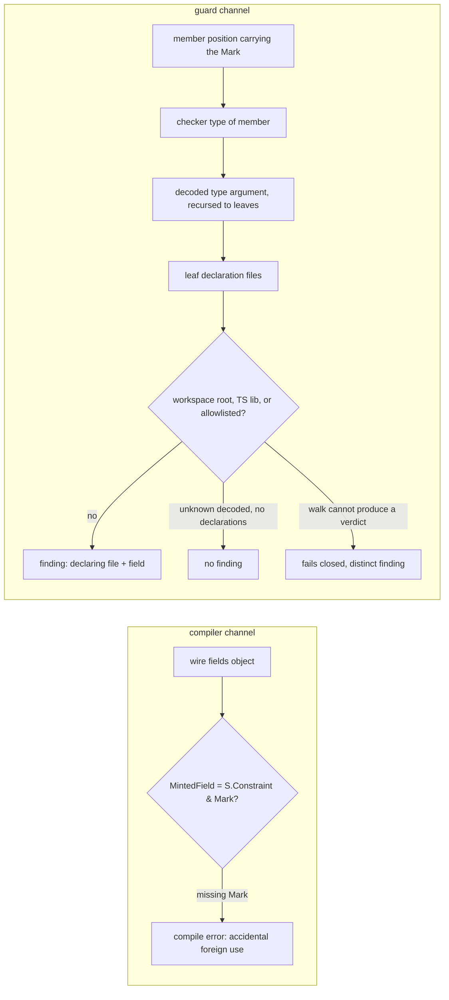

# Wire Declaration Boundary - Plan

## Goal Capsule

- **Objective:** `Wire` carries only its invariant — the phantom `Mark`, the `mint` door, `wire()`'s demand for marked fields — and a declaration-resolving boundary guard discriminates foreign from workspace members in-tree. The mirrored combinator alphabet is deleted.
- **Authority:** Scope confirmed by the repository owner this session; implementation ships as a PR, merge stays human (`REPO-P1`).
- **Stop conditions:** If the guard cannot resolve a member's decoded type to declaration files through the TypeScript API (KTD1, A1), or its addition regresses the `pnpm check:local` median wall-clock by more than 20% (A3), stop and report — do not ship a weakened predicate or a silent cost silently.
- **Execution profile:** Units run sequentially U1→U4 under one executor. U3 lands as its own commit (R5). No agent starts a mutation run (`REPO-D3`).
- **Tail ownership:** Executor delivers the PR and watches checks to green via `xd://github` `run_watch`; merging stays human.

## Product Contract

### Summary

`Wire` shrinks from a 22-symbol mirrored alphabet to its seven-symbol invariant (`Mark`, `Minted`, `AnyMinted`, `MintedField`, `Fields`, `mint`, `wire`), and the never-built enforcement half of the foreign-edge law ships: a boundary guard that resolves each wire member's `Schema.Type` to its declaration site and reports members declared outside the workspace unless allowlisted.

### Problem Frame

Today `Wire` re-exposes fifteen of Effect Schema's combinators as `mint`-wrapped copies (`packages/core/effect/cell/types/src/Wire.ts:78-130`) and publishes all 22 symbols as its public surface (`packages/core/effect/cell/types/etc/effect-cell-types.api.md:17-20`). The mirror pays twice. Every upstream rename reaches it — the v4 migration already forced the `Minted<A, I>` reshaping documented at `Wire.ts:39-43` — and its gaps push workspace-declared members through the door meant for foreign admissions: `packages/testing/mutation/stryker-js/stryker-js/src/Schema.schema.ts:81,96` re-mints `Wire.number.pipe(S.check(...))` because the alphabet has no check-shaped member, so `mint` no longer isolates deliberate foreign admissions. Four combinators (`undefinedOr`, `nullishOr`, `tuple`, `refine`) have no production call site — searched `Wire\.(undefinedOr|nullishOr|tuple|refine)` across `packages/`, hits only in `packages/core/effect/cell/types/test-types/Wire.tst.ts`.

The invariant the mark exists for has no in-tree enforcement. Plan `docs/plans/2026-08-15-001-feat-foreign-edge-boundary-law-plan.md` specced the declaration-resolving rule (KTD3, `:289-306`) and it never shipped: every rule in `packages/lint/` is a single-file AST walk, and `schema-declaration-location` explicitly declines cross-module resolution. The accidental case is refused at the compiler, and nothing at all checks admissibility — the half `CONCEPTS.md` ("Wire declaration") already assigns to "a checker that resolves where a member's type was declared, never how it came to be marked".

### Key Decisions

- **The checker discriminates, not the marking gesture.** Admissibility is decided by resolving where a member's type was declared, never how it came to be marked. Governs R3, R4. (session-settled: user-approved — chosen over gesture-only discrimination: the sanctioned/deliberate distinction is decoration once a checker reads declaration sites)
- **`Wire`'s surface is the invariant, not an alphabet.** Accidental refusal lives in `wire()`'s parameter demand — `Fields = Record<string, MintedField>` (`Wire.ts:132-134`), `MintedField = S.Constraint & Mark` (`:56`) — independent of which members produce marks, so deleting the combinators deletes no refusal. Governs R1, R2, R6. (session-settled: user-approved — chosen over a curated alphabet and over a single brand-adding thunk: the mirror churns with every upstream rename, and a self-applied brand certifies only that its author called it — "provenance rather than a proposition", `docs/solutions/architecture-patterns/constructor-rule-boundary.md:51`)
- **Adopters receive presence, never force.** The mark travels in the published declaration and fires as a missing-member diagnostic in a stranger's compiler; the gate exists only in trees that run the guard. A ceiling set by the package boundary, not a defect to fix. Governs R3.
- **The break is accepted.** Pre-1.0 ALPHA (`REPO-R1`); API stability is not a constraint. Governs R1, R8.

### Requirements

**Surface**

- R1. `Wire`'s public surface is `Mark`, `Minted`, `AnyMinted`, `MintedField`, `Fields`, `mint`, and `wire`; the fifteen combinator exports are deleted.
- R2. `mint`'s documented contract is "marks any schema so `wire()` accepts it"; discrimination of foreign from workspace members is not `mint`'s job.

**Boundary guard**

- R3. A boundary guard resolves each wire-declaration member's `Schema.Type` to its declaration site and reports a member declared outside the workspace root unless it is on a configuration-carried allowlist; the report names the declaring file and the field.
- R4. The guard runs wherever a wire declaration can be written — every package depending on `@systemfsoftware/effect-cell-types` — never one package by hand; files that never import `Wire` are out of its subject set.
- R5. The guard is an Evaluator surface: it lands in its own commit, with a known-bad fixture that produces a non-zero finding count and a known-good that produces zero.

**Migration**

- R6. Every production call site of a deleted combinator is migrated to `mint` over the Schema original — nine files across four packages (`stryker-js` core, `platform-node`, `instrumenter`, `typescript-checker`), all under `packages/testing/mutation/stryker-js/**`.
- R7. The type tests are re-pinned: refusals (unmarked member, vendor schema, workspace-local alias) hold; the forge routes stay pinned as passing; tests of deleted combinators are deleted with them.
- R8. The public API report regenerates to the R1 surface, and a changeset intent ships when the turbo `build` task hash moves (`REPO-R2`).

### Acceptance Examples

- AE1. Foreign member reported
  - **Covers R3, R4.**
  - **Given:** a wire declaration with a member whose `Schema.Type` resolves outside the workspace root
  - **When:** the guard runs
  - **Then:** one finding names the declaring file and the member's field
- AE2. Allowlisted admission passes
  - **Covers R3.**
  - **Given:** the same member, on the configured allowlist
  - **When:** the guard runs
  - **Then:** zero findings
- AE3. Unmarked member still refused at the compiler
  - **Covers R1.**
  - **Given:** `wire({ id: S.String })` with `S.String` unmarked
  - **When:** the file compiles
  - **Then:** the missing-member diagnostic names `__WIRE_MEMBER_IS_NOT_BUILT_FROM_THE_ALPHABET__` — the refusal does not depend on any deleted combinator
- AE4. Workspace member passes both channels
  - **Covers R3, R6.**
  - **Given:** `mint(S.String)` inside a wire declaration in this workspace
  - **When:** compile and guard both run
  - **Then:** no diagnostic and no finding

### Success Criteria

- An Effect v4 rename of any Schema combinator touches zero lines of `packages/core/effect/cell/types/src/Wire.ts`; the residual upstream coupling is the foundational alias type names (`S.Codec`, `S.Top`, `S.Constraint`).
- A laundered foreign member inside a wire declaration fails the in-tree gate, demonstrated by the R5 fixture pair.
- Migration completeness: no reference to a deleted combinator remains in `packages/` outside `docs/`.

### Scope Boundaries

- Deferred: enforcing the wire law on files that never import `Wire` — the adoption hole plan 2026-08-15-001 `:491-493` explicitly leaves open.
- Outside: stronger marks (invariant-payload parameterisation) — a measured half-fix that closes one forge route and leaves `Object.assign` open (`docs/solutions/architecture-patterns/phantom-marks-are-donatable.md:50`).
- Outside: branding the decoded value — measured to force nothing; a schema's own escape hatch and a bare cast each produce a branded value (`CONCEPTS.md`, "Wire declaration").
- Outside: shipping the guard as an adopter-facing oxlint rule — every oxlint authoring rail for the required predicate is closed (KTD2); adopters keep presence, never force.

### Dependencies / Assumptions

- Assumption: the nine consumer files under `packages/testing/mutation/stryker-js/**` are the complete production footprint of the deleted combinators; verified by a full-tree member sweep (`Wire\.(string|number|…|refine)\b` over `packages/`) this session against the branch level with `origin/main`. The sweep's member-form grep is authoritative because every consumer in the tree imports `Wire` as a namespace — no aliased member imports exist.
- Assumption: adopter-facing value of the mark is the compile-time diagnostic only; no gate reaches outside this tree.

### Sources / Research

- `packages/core/effect/cell/types/src/Wire.ts`; `packages/core/effect/cell/types/etc/effect-cell-types.api.md:17-20`
- `docs/solutions/architecture-patterns/constructor-rule-boundary.md`; `docs/solutions/architecture-patterns/phantom-marks-are-donatable.md`
- `docs/plans/2026-08-15-001-feat-foreign-edge-boundary-law-plan.md` — the law this plan completes
- `packages/lint/oxlint/plugins/cells/effect-workflow/src/rules/make-command-schema.ts` — the shipped two-channel pattern whose scope discipline ("only the positions the type bound provably cannot refuse") the guard inherits
- `repos/ttsc/packages/lint/linthost/rules_boundaries_dependencies.go:648-680` — the reference symbol-to-declaration-file resolution sequence (GetSymbolAtLocation → GetAliasedSymbol → Declarations → climb to SourceFile); `:681+` the project-local predicate (node_modules rejection, root escape via filepath.Rel)
- `repos/oxc/apps/oxlint/src-js/plugins/source_code.ts:232-234` — "Oxlint does not offer any parser services", `parserServices: Object.freeze({})`; `repos/oxc/crates/oxc_linter/src/tsgolint.rs:577` with `lib.rs:375` — the type-aware channel admits only Rust-declared `(tsgolint)`-marked rules, exclusively in both directions
- `https://oxc.rs/docs/guide/usage/linter/type-aware.html` — type-aware linting is tsgolint over built-in `typescript/*` rules
- `scripts/guards/check-changeset.ts:1-40` — the guard precedent: deno shebang with exact scopes, lockfile-installed binary verified before any run, selftest recomputes the same pair, "the verdict follows the hash, never a file list"
- `CONCEPTS.md` — "Wire declaration", "Cell constructor", "Cell" (the retired taxonomy; the sandwich as organizing unit)

## Planning Contract

### Key Technical Decisions

- KTD1. **The guard is an in-tree checker script, not a lint rule.** `scripts/guards/check-wire-boundary.ts` builds one TypeScript program per dependent package (each package's own tsconfig) and, in every file importing `@systemfsoftware/effect-cell-types`, walks every member position whose value type carries the `Mark` — `Wire.wire({...})` fields and the field records passed to Schema containers (`S.TaggedClass`, `S.TaggedError`, `S.Struct`, `S.StructWithRest`, `S.Array`, `S.Record`), because the tree's real members live mostly in the latter (`packages/testing/mutation/stryker-js/stryker-js/src/Run.schema.ts:38-43`). The subject set keys on the mark — the invariant that makes a member a wire member — never on one call shape. For each member, the guard resolves the checker type of the member expression, walks to the schema's decoded type argument, and recurses into container and union constituents to the leaves, collecting every leaf's declaration files. A member is foreign iff any leaf declaration lies outside the workspace root (the monorepo root, so cross-package `@systemfsoftware/*` members are workspace-declared) and outside the TypeScript lib/intrinsics and the allowlist (seeded with `effect` and `@effect/*`, the sanctioned building-block layer). A decoded `unknown`/`any` resolves to an empty declaration set and is admissible — the designed admission route for foreign payloads that name nothing (`packages/testing/mutation/stryker-js/platform-node/src/Config.schema.ts:59`). A walk that cannot produce a verdict fails closed as a distinct finding — uncertainty never resolves to a pass, matching the guard precedent's verdict discipline (`scripts/guards/check-changeset.ts:33-34`). Governs R3. (session-settled: user-approved — instantiates the checker-discriminates decision over an AST import-origin rule: a specifier-keyed predicate is blind to the workspace-local alias laundering route, so its message would outrun its predicate (`REPO-A4`))
- KTD2. **Every oxlint authoring rail for this predicate is closed, verified.** JS plugin rules receive no type handle — `parserServices` is a frozen empty object and the Rust→JS bridge passes no semantic model (`repos/oxc/apps/oxlint/src-js/plugins/source_code.ts:232-234`); the tsgolint channel is a compile-time Rust flag and its payload admits only flagged built-ins (`repos/oxc/crates/oxc_linter/src/tsgolint.rs:577`, `lib.rs:375`); the only third-party type-aware delivery is `@effect/tsgo`'s coordinated binary fork, and this repo patches only the compiler binary (`scripts/tools/patch-tsgo-if-needed.mjs:43-44` targets the native `tsc`), not oxlint; vendored ttsc's lint host is Go with module-specifier granularity and the toolchain uses ttsc nowhere; ESLint+typescript-eslint would add a second linter toolchain for one rule. Hence the guard script; `check-changeset.ts` is its shape precedent. Governs R3.
- KTD3. **Wiring follows the root guard chain, cost-gated.** The guard registers as `check:wire-boundary` beside `check:forbidden-lines` in `check:local` and `check:ci` (root `package.json:18-20`), derives its package set from workspace manifests — never a hand list — and carries a `--selftest` that plants the fixture set and asserts the expected finding counts, invoked in CI beside the changeset gate's selftest (`.github/workflows/changeset-check.yml:33-34` precedent). The allowlist is a config file beside the guard, consulted by package name and declaration path prefix, seeded with the TypeScript lib, `effect`, and `@effect/*`. The guard imports the workspace's lockfile-installed `typescript` JS API through node_modules resolution — the same package the `typescript-checker` package drives — and the U3 spike proves that import works under the deno shebang before any wiring; resolution shape diverging from the patched native `tsc` the repo typechecks with is an A1 stop condition, detected by the fixtures. Placement is measured before it is wired: median `pnpm check:local` wall-clock over three runs, base versus guard-wired; a regression beyond 20% moves the guard to `check:ci`-only and is reported (A3). Governs R4, R5.
- KTD4. **Migration is hand-written, landed green twice.** Nine files across four packages migrate `Wire.<combinator>` → `Wire.mint(S.<original>)` with `import * as S from 'effect/Schema'` added where missing, before any deletion — U1 lands with the alphabet still present, U2 deletes it, so each unit compiles and tests green. No codemod: nine files by hand cost less than a codemod and its tests. Governs R6, R7.
- KTD5. **Release intents follow the hash, per package.** `pnpm api:update` regenerates `etc/effect-cell-types.api.md`; `api:check` is embedded in the package build, so the turbo hash moves → `major` intent on `@systemfsoftware/effect-cell-types` (fifteen exports removed), its body mapping each removed combinator to its `mint` analog — the migration an adopter must perform (`REPO-R3`). The four consumer packages' sources change but their exported surfaces and behavior do not → `none` intents, the canonical class for source-internal rewrites. Mutation population is untouched — neither `cell/types` nor `stryker-js` core carries a `stryker.config.json`; only `stryker-js/cli` does and touches none of these files. Governs R8.

### High-Level Technical Design

Two channels, one invariant:

The compiler channel refuses the unmarked; the guard channel judges the marked. Neither inspects the other's ground.

### Assumptions

- A1. The TypeScript API walk (member type → `Schema<A, I>` type argument → `A`'s leaf declarations) is expressible for the repo's Effect Schema v4 class shapes, under the workspace-installed `typescript` JS API imported from the deno guard. The U3 spike settles it before any wiring; if the walk cannot resolve decoded types for schemas the tree actually uses, stop and report — no weakened predicate ships.
- A2. The nine-file footprint holds; verified by a full-tree member sweep this session against the branch level with `origin/main`.
- A3. One program per dependent package (ten packages: `cell/gen`, `daemon-spec`, `oxlint-plugin-cell-vocabulary`, `stryker-js` core, `platform-node`, `html-reporter`, `instrumenter`, `typescript-checker`, `vitest-runner`, `cli`) costs on the order of that package's own typecheck, measured as the median of three `pnpm check:local` runs before and after wiring. Beyond 20%, the guard moves to `check:ci`-only and the regression is reported with numbers.

## Implementation Units

### U1. Migrate Wire consumers to mint form

- **Goal:** Every production wire-declaration member under `packages/testing/mutation/stryker-js/**` composes primitives through `Wire.mint(S.X)`, with the alphabet still present and the tree green.
- **Requirements:** R6.
- **Dependencies:** none.
- **Files:** `packages/testing/mutation/stryker-js/stryker-js/src/Schema.schema.ts` (hotspot; leave the already-minted `:81,:96` untouched), `stryker-js/src/Run.schema.ts` (widest alphabet), `stryker-js/src/Run.workflow.ts`, `platform-node/src/Worker.schema.ts`, `platform-node/src/IncrementalReport.workflow.ts`, `platform-node/src/Config.schema.ts`, `platform-node/src/Config.ts`, `instrumenter/src/Instrument.workflow.ts`, `typescript-checker/src/Checker.workflow.ts` (keeps `Wire.Minted` type refs; `Wire.suspend` → `Wire.mint(S.suspend(...))`).
- **Approach:** Hand migration per KTD4, one rule for every combinator: `Wire.<c>(x)` → `Wire.mint(S.<c>(x))` — `Wire.string` → `Wire.mint(S.String)`, `Wire.optional(x)` → `Wire.mint(S.optional(x))` (the v4 combinator `Wire.ts:98` itself wraps), `Wire.record(k, v)` → `Wire.mint(S.Record(Wire.mint(S.String), v))` with the marked key migrated the same way. Keep `Wire.Fields` type references — `Fields` is invariant surface. Add `import * as S from 'effect/Schema'` where missing.
- **Test Scenarios:** Each touched package's existing suites pass unchanged — the migration is type-identical and value-identical per member.
- **Verification:** `pnpm --filter @systemfsoftware/stryker-js typecheck && pnpm --filter @systemfsoftware/stryker-js test`; likewise `stryker-js-platform-node`, `stryker-js-instrumenter`, `stryker-js-typescript-checker`. `pnpm change --bump none` for each of the four.

### U2. Shrink the Wire surface to its invariant

- **Goal:** `Wire` exports exactly the seven-symbol invariant; module docs and the API report agree with it; type tests pin the refusal and forge routes on the shrunken surface.
- **Requirements:** R1, R2, R7, R8.
- **Dependencies:** U1.
- **Files:** `packages/core/effect/cell/types/src/Wire.ts`, `packages/core/effect/cell/types/test-types/Wire.tst.ts`, `packages/core/effect/cell/types/etc/effect-cell-types.api.md` (regenerated).
- **Approach:** Delete the fifteen combinators (`Wire.ts:78-130`). Rewrite the module JSDoc example to `mint` form and restate `mint`'s contract per R2. In `Wire.tst.ts`: keep the refusal pins (unmarked member, vendor schema, workspace-local alias) and the passing forge pins; delete alphabet tests; keep the mint-acceptance pins. Run `pnpm --filter @systemfsoftware/effect-cell-types api:update`. Author the changeset per KTD5, mapping each removed combinator to its `mint` analog.
- **Test Scenarios:** AE3 (refusal independent of deleted combinators); each refusal pin observed failing once with its expect-error directive removed (package `AGENTS.md` check convention).
- **Verification:** `pnpm --filter @systemfsoftware/effect-cell-types typecheck && … test:types && … test && … api:check && … lint`. Grep for deleted combinators outside `docs/`: zero hits. `pnpm change --bump major` for `@systemfsoftware/effect-cell-types`.

### U3. Ship the wire-boundary guard

- **Goal:** The in-tree gate exists: a checker-based guard that reports foreign decoded types in marked members across every dependent package, with selftest fixtures proving red and green and pinning the predicate's channel.
- **Requirements:** R3, R4, R5.
- **Dependencies:** U2 (fixtures pin the post-shrink surface).
- **Files:** `scripts/guards/check-wire-boundary.ts` (new), its allowlist config (new), `scripts/guards/fixtures/wire-boundary/` (new: known-bad, known-good, and the channel-discriminating pair), root `package.json` (chain wiring), the CI workflow that runs the guard chains (selftest line beside the changeset selftest).
- **Approach:** Per KTD1–KTD3. Begin with the spike (A1): import the workspace `typescript` under the deno shebang, build one real package's program, resolve one real member's decoded type to declarations — STOP and report if not expressible. Resolution walk: marked member positions → per-member checker type → decoded type argument recursed to leaves → leaf declaration files → foreign iff any leaf outside workspace root, TS lib, and allowlist; unknown/any decodes admissible; walker failure fails closed. Derive the package set from workspace manifests. Follow `check-changeset.ts` conventions (shebang permissions, `--selftest`, selftest recomputes what the run computes). Measure A3's wall-clock before wiring into `check:local`. Lands as its own commit, selftest observed failing before the fix and passing after (R5, `CONST-E4`).
- **Test Scenarios:** AE1 (known-bad: a marked member in an `S.TaggedClass` field record whose decoded type comes from a `node_modules` declaration — exercises the real subject set, not only `Wire.wire` — reports declaring file + field); AE2 (allowlisted path passes); AE4 (known-good: `mint(S.String)` — intrinsic leaf — and a workspace-declared schema pass); laundering (a workspace-local const wrapping a vendor schema reports, because the decoded leaf's declaration is foreign); composite smuggling (`mint(S.Union(S.String, VendorSchema))` reports — a foreign leaf in a container is foreign); channel discriminator (a member decoding to a workspace-declared type from a vendor-encoded shape passes — a walker wrongly keyed on the encoded channel would report it); decoded `unknown` passes; a walker inability fails closed.
- **Verification:** `./scripts/guards/check-wire-boundary.ts --selftest` exits 0 (asserts every fixture's expected count); the guard over the real tree exits 0; `pnpm check:local` exits 0 with the guard wired in.

### U4. Final gate pass and release intents

- **Goal:** The whole change satisfies the repo's definition of done and carries its release intents.
- **Requirements:** R8; global DoD.
- **Dependencies:** U1, U2, U3.
- **Files:** `.changeset/*` (audit), no source files.
- **Approach:** Audit that every publishable package whose turbo `build` hash moved carries an intent with the right bump (`cell/types` major with the migration map; the four consumers none). Confirm the changeset bodies name only consumer-observable facts (`REPO-R3`).
- **Test Scenarios:** The changeset gate's own logic concedes the PR (no missing-intent failure).
- **Verification:** `pnpm check:local` exits 0 after the last edit; PR checks watched to green via `xd://github` `run_watch` (`REPO-D1`, `REPO-D2`).

## Verification Contract

| Scope                  | Command                                                                                                                                                                                                                                            | Proves                                                                    |
| ---------------------- | -------------------------------------------------------------------------------------------------------------------------------------------------------------------------------------------------------------------------------------------------- | ------------------------------------------------------------------------- |
| Owning package         | `pnpm --filter @systemfsoftware/effect-cell-types typecheck && pnpm --filter @systemfsoftware/effect-cell-types test:types && pnpm --filter @systemfsoftware/effect-cell-types test && pnpm --filter @systemfsoftware/effect-cell-types api:check` | R1, R2, R7, R8                                                            |
| Consumer packages      | `pnpm --filter @systemfsoftware/stryker-js typecheck && pnpm --filter @systemfsoftware/stryker-js test` (and platform-node, instrumenter, typescript-checker)                                                                                      | R6                                                                        |
| Guard selftest         | `deno run --allow-read=… scripts/guards/check-wire-boundary.ts --selftest`                                                                                                                                                                         | R5 fixture set, including the channel discriminator and fail-closed cases |
| Guard over tree        | root `pnpm check:wire-boundary`                                                                                                                                                                                                                    | R3, R4                                                                    |
| Migration completeness | `grep` for `Wire\.(string                                                                                                                                                                                                                          | number                                                                    |
| Whole repo             | `pnpm check:local` after the last edit                                                                                                                                                                                                             | `REPO-D1`                                                                 |
| PR                     | `xd://github` `run_watch` (commit mode) to green                                                                                                                                                                                                   | `REPO-D2`                                                                 |

No mutation run is started by an agent (`REPO-D3`); the Mutation workflow's merged report stays advisory.

## Definition of Done

- All four units complete; every R1–R8 verification row above exits 0.
- `pnpm check:local` exits 0 after the last edit, with `check:wire-boundary` in the chain (or in `check:ci`-only under the A3 gate, with the measurement reported).
- The guard's own commit carries the selftest and the fixture set; the selftest was observed red before the fix and green after.
- PR open, checks watched to green via `xd://github` `run_watch`; merge left to the human (`REPO-P1`).
- Cleanup: no codemod or scratch scripts remain; no alphabet documentation survives in `packages/`; the guard's fixture files are the only new non-source artifacts.
