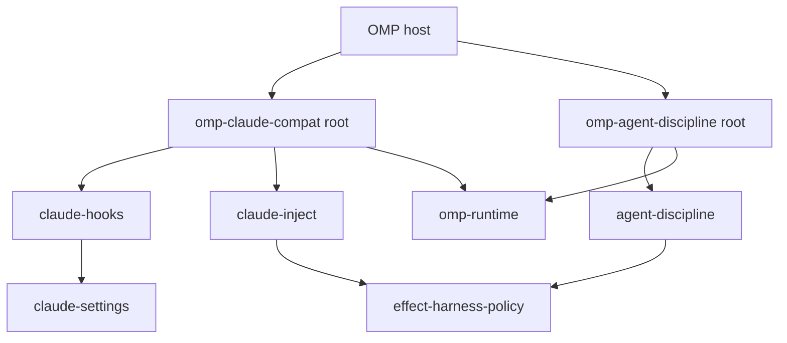

# OMP Plugin Decomposition - Plan

## Goal Capsule

- **Objective.** Decompose the OMP plugin subsystem into composition roots and capability libraries: each plugin is a composition root whose exports map is `.` only; every capability a behaviour test proves is its own library package; the settings lookup is a substitutable policy; the shared runtime kernel and harness policy live in their own packages.
- **Authority.** Root `AGENTS.md` (`REPO-A1`, `REPO-A2`, `REPO-A3`, `REPO-A5`, `DEL1`) > `CONSTITUTION.md` > `omp/plugins/AGENTS.md` (`PLG1`–`PLG4`) > this plan.
- **Execution profile.** Deep cutover on `refactor/omp-plugin-sandwich`. One PR. `repos/` read-only.
- **Tail ownership.** Implementer owns verification; human owns merge.

## Product Contract

### Summary

A plugin is a composition root: the host loads its entry, and its package exports `.` plus `./package.json` — nothing else. The capabilities it composes are library packages with their own names, where package-name and subpath test imports are legitimate. Each unit owns exactly one capability; a unit whose only binder is the producing feature is a module, not a package.

### Unit map (each judged on identity, cohesion, binders)

| Unit                               | Package                                  | Capability                                                                                                                                      | Binds                                                                                |
| ---------------------------------- | ---------------------------------------- | ----------------------------------------------------------------------------------------------------------------------------------------------- | ------------------------------------------------------------------------------------ |
| `packages/core/claude/settings`    | `@systemfsoftware/claude-settings`       | resolve Claude Code settings (events vocabulary, schema, merge workflow, `ClaudeSettings` port + `ClaudeSettingsSources` policy, coverage/gaps) | hooks, plugin root; the policy port has a second implementation in tests (`REPO-A2`) |
| `packages/core/claude/hooks`       | `@systemfsoftware/claude-hooks`          | dispatch configured hooks for a host event and apply their verdicts (schema, verdict + admit workflows, dispatcher, wire translation modules)   | plugin root; real edge to `claude-settings`                                          |
| `packages/core/claude/inject`      | `@systemfsoftware/claude-inject`         | resolve and inject CLAUDE.md @-references                                                                                                       | plugin root; shares nothing with the hook bridge                                     |
| `packages/core/agent/discipline`   | `@systemfsoftware/agent-discipline`      | mechanical discipline enforcement (doctrine gate, delegation gate, xd:// retry guard)                                                           | plugin root; one capability, not three                                               |
| `packages/core/effect/policy`      | `@systemfsoftware/effect-harness-policy` | the harness-policy port; the layered `systemfsoftware.toml` reader is one live adapter                                                          | claude-inject, agent-discipline                                                      |
| `omp/packages/omp-runtime`         | `@systemfsoftware/omp-runtime`           | run an extension's Effect runtime under the host load model (`bootstrapPluginRuntime`, `lazyRunSafe`, `warmRuntimeAfterStart`)                  | both plugin roots (`PLG1`–`PLG4`)                                                    |
| `omp/plugins/omp-claude-compat`    | `@systemfsoftware/omp-claude-compat`     | composition root: registers the hook bridge and inject; owns the layer graph                                                                    | the OMP host                                                                         |
| `omp/plugins/omp-agent-discipline` | `@systemfsoftware/omp-agent-discipline`  | composition root: registers the discipline guards                                                                                               | the OMP host                                                                         |

### Key Decisions

- KD1. **Plugin = composition root.** No subpath exports on plugin packages; the entry file and runtime wiring are the whole plugin.
- KD2. **The kernel is two functions**, not a framework: `bootstrapPluginRuntime` (ManagedRuntime, signal disposal at module top level) and `lazyRunSafe` (event-time delegation). Entries are plain async factories; ordering is the register call order (`PLG3`).
- KD3. **Foreign config files are implementations of ports.** `systemfsoftware.toml` backs `HarnessPolicy`; `.claude/settings*.json` + plugin hooks back `ClaudeSettings` through `ClaudeSettingsSources`. No consumer names a path constant.
- KD4. **Module shape** follows root `REPO-A1`: flat capability modules; the only suffixes are `.workflow.ts` and `.schema.ts`. The dmmf lint laws hold inside every library.
- KD5. **RPC stays deferred** (`REPO-W8`): `effect/unstable/rpc` exists in the pinned `effect@4.0.0-rc.111` (vendored `repos/effect/packages/effect/src/unstable/rpc/`), but in-process there is one implementation and `REPO-A2` refuses the abstraction. The `Workflow.make` command classes are the seam. **Reversing observation:** a second transport (worker host, socket) is the trigger.

### Requirements

- R13. Plugin package exports maps are `.` + `./package.json` only; tsdown builds the single entry.
- R14. Both plugin roots consist of `index.ts` (factory + registration) and `runtime.ts` (layer graph + `bootstrapPluginRuntime`); they own no capability logic.
- R15. `ClaudeSettings.load` and `gaps` both consume `ClaudeSettingsSources`; a fake policy substitutes without touching default paths (proven by a Gherkin scenario).
- R16. `DEL1`: `git grep` for `omp-platform`, `omp-utils`, `RunSafePolicy`, `HookRunner`, `LoadSettingsExecutor`, `defineOmpExtension`, `/api'` and `/inject'` specifiers of both plugins → zero live hits.
- R17. Layer graphs construct each platform layer once.
- R18. Behaviour preserved: every pre-existing scenario passes with import-path changes only (122 claude-side, 66 discipline-side).
- R19. Instruction surface: `omp/AGENTS.md` deleted; `omp/plugins/AGENTS.md` holds only host load-model facts, `PLG1`–`PLG4`, failure modes, and the verify ritual.

### Acceptance Examples

- AE5. Fresh-eyes: `ls` of each unit's `src/` names its capability; `ls omp/plugins/*/src/` shows two files.
- AE7. A fake `ClaudeSettingsSources` yields hooks with no read of default paths.
- AE8. Both plugin dists load through the smoke tool with full handler registration.

---

## Verification Contract

| Gate      | Command                                                                                                                                                                                               |
| --------- | ----------------------------------------------------------------------------------------------------------------------------------------------------------------------------------------------------- |
| Libraries | `pnpm --filter @systemfsoftware/claude-* --filter @systemfsoftware/agent-discipline --filter @systemfsoftware/effect-harness-policy --filter @systemfsoftware/omp-runtime test` + `tsc --noEmit` each |
| Plugins   | `pnpm --filter @systemfsoftware/omp-claude-compat --filter @systemfsoftware/omp-agent-discipline exec tsc --noEmit` + `build`                                                                         |
| Smoke     | `node omp/scripts/smoke-plugin.mjs <each dist>`                                                                                                                                                       |
| Traces    | `git grep -nI` per R16 → zero                                                                                                                                                                         |
| Local     | `pnpm check:local` after the last edit                                                                                                                                                                |

## Definition of Done

- The unit map holds in the tree; R13–R19 green; both dists smoke-load; changesets filed (`none` bumps); `pnpm check:local` exits 0.
