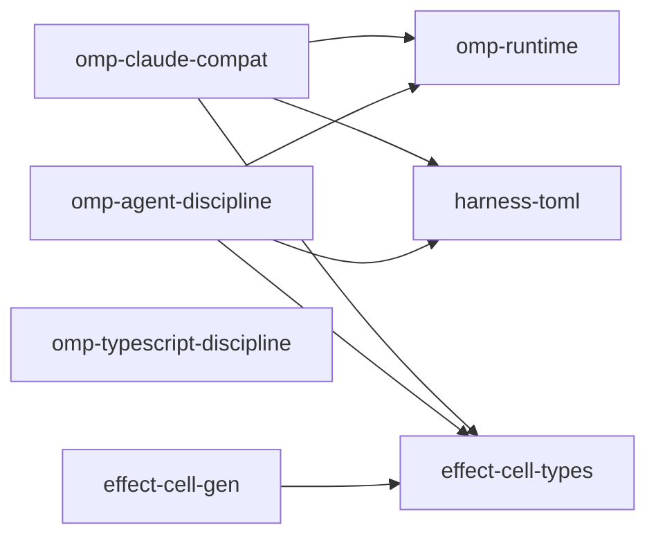

# Refactor omp plugin carving

This plan supersedes the flatten plan named in frontmatter, which proposed the opposite shape (core capability libraries kept as packages, plugins as pure composition roots). An architecture-conformance audit of that tree graded F-: the core "libraries" are sole-binder subpath exports. This plan lands the audited and panel-graded target instead.

## Goal Capsule

- **Objective:** Fold four unearned `packages/core` packages into their producing plugins, replace `effect-harness-policy` with one toml parser package that owns today's layered read contract, and remove acquisition from `claude-inject`'s decision path — with no user-visible config or behavior change.
- **Authority:** repo law (root `AGENTS.md`, `omp/plugins/AGENTS.md`, constitution) over session decisions; session-settled decisions below bind implementation unless they conflict with repo law.
- **Stop conditions:** all units landed and `pnpm check:local` exits 0; or a unit surfaces a contradiction between a settled decision and repo law — stop and report rather than resolve silently.
- **Execution profile:** code, one branch (`refactor/omp-plugin-sandwich`), PR to `main`, CI watched to decided.
- **Tail ownership:** ce-work owns implementation through verification; shipping (merge) stays human.

## Product Contract

### Summary

Re-carve the omp plugin tree so every package is a real unit. The three plugins keep their shape; four private `packages/core` packages become modules inside the plugins that solely bind them; `systemfsoftware.toml` config gains exactly one parser package owning the full layered read; capabilities reach foreign inputs only through substitutable ports.

### Problem Frame

An architecture-conformance audit (branch ref `76092f0b266`, grade F-, 12 SURVIVED findings) proved the four private packages are subpath exports wearing manifests — their sole binders are the plugins that produce them — carrying vendor identity inside the adopter-generic core tree, with one conflated three-actor package and acquisition inside one event-handler decision path.

### Requirements

Carving:

- R1. `packages/core/claude/{hooks,settings,inject}` sources move into `omp/plugins/omp-claude-compat/src/{hooks,settings,inject}`; the three package boundaries are deleted.
- R2. `packages/core/agent/discipline` sources move into `omp/plugins/omp-agent-discipline/src/{doctrine,delegation,xd-retry}` as three modules with their own workflows and state; the package boundary is deleted.
- R3. Post-refactor dependency graph has no plugin-to-plugin edge and no `packages/core` → `omp` edge.

Configuration:

- R4. One new package, `@systemfsoftware/harness-toml`, owns the `systemfsoftware.toml` contract in full: the single-document codec, the pure per-key fail-open merge over decoded documents, and the typed merged record — semantics identical to today's reader (user layer via the home anchor, project layer, `systemfsoftware.local.toml` layer; missing or non-decoding documents resolve to the empty partial).
- R5. The `omp-claude-compat` and `omp-agent-discipline` composition roots each parse the layered config once per session — anchored at the session's project directory at session-start warm, preserving today's per-cwd semantics — and build the partial-settings layers their capability modules declare. `omp-typescript-discipline` consumes no config.
- R6. No toml-config contract exposes a lazy `load()`; toml config arrives as parsed values at layer construction. (The `ClaudeSettings` port is a separate contract and keeps its members.)

Ports and acquisition:

- R7. Folded capabilities keep substitutable ports, judged by the substitution test: a direct-supply adapter can implement every member without environment reads. Subject-identifying parameters are legal — project dir, session id, and a home directory that scopes a per-subject settings suite (a direct-supply adapter keys on it). Storage-naming parameters are not — a file path an adapter must open, an env var name, a connection string. A default adapter shipped beside its port is legal.
- R8. `claude-inject`'s `before_agent_start` decision path contains no environment read, filesystem walk, or path resolution; the referenced-content input reaches it through a port a second adapter could implement.

Preserved:

- R9. `omp-runtime`, `omp-typescript-discipline`, `effect-cell-types`, `effect-cell-gen` keep their names, boundaries, and manifests unchanged.
- R10. `effect-cell-gen` keeps zero inbound edges under this refactor; its deviation from the package-earning criterion is accepted by owner direction; re-check when a second derived consumer appears.

Process:

- R11. Every publishable package whose turbo build hash moves ships a `.changeset/` intent via `pnpm change`; deleted packages get their break recorded; the stale `.changeset/omp-plugins-composition-roots.md` (whose migration guidance names the deleted packages) is rewritten or removed.
- R12. The deleted package names leave zero live references in source, manifests, and CI: `git grep -nI -e '<name>' -- . ':!*.lock' ':!docs/plans/**' ':!.changeset/**'` prints nothing for each. Decision records under `docs/plans/` and unshipped changeset intents are out of the gate's scope.

Key Decisions:

- **Foreign inputs reach capabilities through substitutable ports; the consumer never knows filesystem vs supplied-directly.** Governs R7, R8.
- **Toml config is parsed once per session at the root and injected as values, not lazily loaded through a service.** Governs R5, R6.

### Scope Boundaries

- Outside: `agent-plugins/`, everything in `packages/core` beyond the five touched packages, the OMP host contract (factory model, load model), `omp-runtime` internals.
- Deferred: none.

---

## Planning Contract

### Key Technical Decisions

- KTD1. Fold the four private packages into their producing plugins with separation, rather than relocate them under `omp/` as packages. Moving the mixtures would leave the fictional boundaries standing. (session-settled: user-directed — chosen over relocate-only: sole-binder packages are subpath exports, not units)
- KTD2. Split `agent-discipline` into `doctrine`, `delegation`, `xd-retry` modules inside the plugin; each owns its workflow and state. (session-settled: user-directed — chosen over flat fold: one package conflates three actors with separate state)
- KTD3. Delete `effect-harness-policy`; `@systemfsoftware/harness-toml` at `omp/packages/harness-toml/` owns the toml contract: codec migrated verbatim from `Policy.schema.ts` (`PolicyFromToml`), plus the pure fail-open layered merge migrated from `HarnessPolicy.ts` (`mergeLayers`, `EMPTY_POLICY`), producing the typed merged record. The old unit wrapped one file format in a policy port with no second implementation. (session-settled: user-directed — chosen over port surgery on the existing package: a port exists for substitutability, one config format needs a codec)
- KTD4. Port signatures are judged by the substitution test: a direct-supply adapter implementing every member without environment access. Subject-identifying parameters — including a home directory scoping a per-subject settings suite — are domain data; storage-naming parameters are acquisition. (session-settled: user-directed — chosen over banning environment-locating parameters outright: cwd identifies the subject of a per-project query)
- KTD5. An adapter lives with the composition layer of its binders: the existing `ClaudeSettingsLive` adapter (and `ClaudeSettingsSources`) moves into `omp-claude-compat/src/settings/` with its pinned tests; the toml read ships beside the parser. Nothing moves into a sibling plugin or the kernel. (session-settled: user-directed — chosen over adapter exile to a shared location: co-shipped port+adapter is the standard library shape)
- KTD6. Keep `effect-cell-gen` unchanged. (session-settled: user-directed — chosen over verify-then-delete: its leaf law seeds the derived-consumer lane)
- KTD7. Config is parsed once per session/project directory, anchored at the session cwd at session-start warm. `omp-runtime`'s `ManagedRuntime` is one cached instance shared by the main session and every task subagent — a process-wide parse-once would apply the first project's policy to later sessions — so the parse and the partial-settings layers are built per session, before the session's events flow, not per process and not per event. (session-settled: user-approved — chosen over a lazy policy port: config is read once at the edge; this wording preserves today's per-cwd semantics)
- KTD8. Mutation configs travel with the workflows they mutate: the plugins regain `stryker.config.json` scoped to `src/**/*.workflow.ts` as sources fold in; the two existing core configs (`claude-hooks`, `claude-settings`) are deleted with their packages; `claude-inject` and `agent-discipline` have none today. The tracked `check-stryker-mutate-scope` guard validates the new plugin configs. (session-settled: user-approved — chosen over keeping configs on the composition root: a config keyed on a suffix never fires on the workflows it exists for when they live elsewhere)
- KTD9. `claude-inject` becomes a capability with a `ReferencedContent` port (decide which refs, given resolved values) and an adapter that does the env/fs acquisition; the handler body only decides. (session-settled: user-approved — chosen over declaring the whole unit adapter-shaped: its body makes a real decision, which acquisition must not enter)

### High-Level Technical Design

Target package graph (nodes are packages; edges are manifest dependencies, dependent → dependency):

- `harness-toml` exports the codec (one document → typed values), the pure layered merge (decoded documents → merged record, fail-open per layer), and a layer that reads the three file paths it is handed once and yields the merged record. Path discovery — project dir + `.local` sibling, and the home anchor resolved as `HARNESS_POLICY_HOME` when set, else `os.homedir()` — stays with the composition roots, exactly where `HarnessPolicyLive` resolves it today.
- Each plugin's `src/runtime.ts` discovers the three paths, parses via `harness-toml` at session warm, and builds each capability module's partial-settings layer from the merged record.
- `omp-claude-compat/src/runtime.ts` additionally binds `ClaudeSettingsLive` and supplies `inject` with its `ReferencedContent` adapter.

### Assumptions

- The binder census holds (reviewer-verified this session): every import of the five folded names lives in the two plugins, their own trees, the lockfile, or the two artifacts U5 rewrites.
- The merged record projects to per-module partials without semantic change; decode and merge rules move verbatim, pinned by porting the two existing integration tests unchanged.

### Risks and Dependencies

- **Published-surface break on both plugins** — pre-1.0, breaks allowed (REPO-R1); changesets carry it (R11).
- **Bundling: tsdown auto-externalizes declared dependencies.** Both plugins' `tsdown.config.ts` `alwaysBundle` lists must replace the deleted packages with `/^@systemfsoftware\/harness-toml(\/|$)/`, and the stale `@std/toml` entries leave the plugin manifests (parse ownership moves to `harness-toml`). A dist that externalizes `harness-toml` fails only in the host load — the smoke gate below catches it.
- **Commit scopes referencing deleted packages fail after deletion** — commitlint scope-enum derives from live workspace packages; commits here scope to surviving packages or group scopes.
- **Guard scripts absent from this worktree** — verify `check-workflow-test-adjacency`'s rule and `check-changeset`'s new-package handling against the main checkout before U1 ships its changeset.

### Sequencing

U1 → U2 and U3 (independent) → U4 → U5.

---

## Implementation Units

### U1. `harness-toml` package

- **Goal:** One package owns the `systemfsoftware.toml` codec and layered merge with today's exact semantics (R4).
- **Requirements:** R4, R6.
- **Files:** `omp/packages/harness-toml/package.json`, `tsdown.config.ts`, `oxlint.config.ts`, `src/*.schema.ts` (codec migrated from `packages/core/effect/policy/src/Policy.schema.ts`), `src/*.workflow.ts` (merge + read decision, migrated from `packages/core/effect/policy/src/HarnessPolicy.ts:41-81`), tests ported from `harness-policy-three-layer.integration.test.ts` and `harness-policy-project-only-file` tests.
- **Approach:** Migrate `PolicyFromToml`, `mergeLayers`, `EMPTY_POLICY`, and the fail-open `readLayer` verbatim; the package takes resolved file paths in and yields the merged typed record out — no path discovery, no env reads, no port, no `load()`. Verify before wiring: whether `check-changeset` accepts an intent for a brand-new package (no base turbo hash) and whether the release tooling requires the standard publishable skeleton from `omp/packages/*`.
- **Test Scenarios:** the two ported integration tests pass unchanged (three-layer precedence: user value returned when alone, local wins over project, project array replaces user array whole); a missing or non-decoding layer resolves to the empty partial (fail-open contract); property test on the codec round-trip.
- **Verification:** `pnpm --filter @systemfsoftware/harness-toml typecheck && pnpm --filter @systemfsoftware/harness-toml test && pnpm --filter @systemfsoftware/harness-toml lint`.

### U2. Fold claude hooks/settings/inject into omp-claude-compat

- **Goal:** One plugin, three capability modules, ports intact, handler de-acquired (R1, R7, R8).
- **Requirements:** R1, R7, R8, R9.
- **Files:** `omp/plugins/omp-claude-compat/src/{hooks,settings,inject}/**` (moved from `packages/core/claude/*`), `src/runtime.ts`, `package.json`, `tsdown.config.ts`, `stryker.config.json`; delete `packages/core/claude/{hooks,settings,inject}`.
- **Approach:** Move sources preserving internal structure; rewrite the plugin's workspace-package imports to relative imports; `runtime.ts` binds `ClaudeSettingsLive` (KTD5) and the inject `ReferencedContent` adapter (KTD9); the `before_agent_start` handler receives resolved values only. Port signatures unchanged (`load(cwd, homeDir)` is legal under KTD4). Update `tsdown.config.ts` `alwaysBundle`: drop the deleted packages, keep the remaining bundled workspace deps; drop the stale `@std/toml` dependency entry from the manifest.
- **Test Scenarios:** existing hooks/settings/inject suites pass unchanged after the move; inject's handler test supplies referenced content directly through the port (no env/fs in the test path); settings merge/managed-settings behavior stays pinned by its ported integration tests; plugin mutation config covers `src/**/*.workflow.ts` and passes the `check-stryker-mutate-scope` guard.
- **Verification:** `pnpm --filter @systemfsoftware/omp-claude-compat typecheck && pnpm --filter @systemfsoftware/omp-claude-compat test && pnpm --filter @systemfsoftware/omp-claude-compat lint && pnpm --filter @systemfsoftware/omp-claude-compat attw`.

### U3. Fold and split agent-discipline into omp-agent-discipline

- **Goal:** Three enforcement modules under one root, own workflows and state (R2).
- **Requirements:** R2, R9.
- **Files:** `omp/plugins/omp-agent-discipline/src/{doctrine,delegation,xd-retry}/**` (moved from `packages/core/agent/discipline`), `src/runtime.ts`, `package.json`, `tsdown.config.ts`, `stryker.config.json`; delete `packages/core/agent/discipline`.
- **Approach:** Split the flat barrel by actor: `doctrine/` keeps the flag store and skills cache, `delegation/` its workflow, `xd-retry/` its ledger. Each module declares the config partial it consumes; the root supplies it (U4 wires the source). Drop the `omp-runtime` devDep edge with the package boundary. Same `tsdown.config.ts` `alwaysBundle` treatment as U2.
- **Test Scenarios:** each module's existing tests pass in isolation; no module imports another's state; plugin mutation config covers the three modules' workflows and passes the mutate-scope guard.
- **Verification:** `pnpm --filter @systemfsoftware/omp-agent-discipline typecheck && pnpm --filter @systemfsoftware/omp-agent-discipline test && pnpm --filter @systemfsoftware/omp-agent-discipline lint && pnpm --filter @systemfsoftware/omp-agent-discipline attw`.

### U4. Delete effect-harness-policy; wire both roots to harness-toml

- **Goal:** Config parsed once per session per root, partials injected, the policy package gone (R3, R5, R6).
- **Requirements:** R3, R5, R6.
- **Files:** delete `packages/core/effect/policy/`; `omp/plugins/*/src/runtime.ts` (per-session parse wiring); lockfile regenerated.
- **Approach:** Each root resolves the session cwd at session-start warm, discovers the three paths exactly as `HarnessPolicyLive` does today (project, `.local` sibling, home anchor via `HARNESS_POLICY_HOME` else `os.homedir()`), parses via the `harness-toml` layer once, and builds each module's partial-settings layer from the merged record. Every former `HarnessPolicy` consumer reads its partial from the injected layer. No lazy config fetch anywhere.
- **Test Scenarios:** each root builds layers from a fixture toml without touching the filesystem in any decision path; a test layer supplying partials directly runs the same modules; per-session semantics pinned — two sessions with different cwds get their own projects' config.
- **Verification:** `pnpm -r typecheck`; both plugins' test suites; `git grep -nI -e 'effect-harness-policy' -- . ':!*.lock' ':!docs/plans/**' ':!.changeset/**'` prints nothing (R12).

### U5. Cutover cleanup, changesets, guards

- **Goal:** Tree restartable, releases intentional, no dead references (R11, R12).
- **Requirements:** R11, R12.
- **Files:** `.changeset/*.md` (rewrite `.changeset/omp-plugins-composition-roots.md` — its guidance names deleted packages — and add one intent per affected publishable package), deleted `packages/core/**/AGENTS.md` leaves, `docs/solutions/` entry only if a durable learning emerges.
- **Approach:** `pnpm change --bump` per package whose turbo hash moved (both plugins for the surface change; `harness-toml` as a new package); R12 grep for all five deleted names under its scoped paths; confirm `pnpm map` reflects the new inventory.
- **Test Scenarios:** `changeset-check` passes in CI; `pnpm map` lists the target units and no others.
- **Verification:** `pnpm check:local` exits 0.

---

## Verification Contract

| Gate                              | Command                                                                                                                 | Applies to       |
| --------------------------------- | ----------------------------------------------------------------------------------------------------------------------- | ---------------- |
| Typecheck                         | `pnpm -r typecheck`                                                                                                     | all units        |
| Per-package tests                 | `pnpm --filter <pkg> test`                                                                                              | U1–U4 packages   |
| Lint                              | `pnpm -r lint`                                                                                                          | all units        |
| Surface check                     | `pnpm --filter @systemfsoftware/omp-claude-compat attw` and `pnpm --filter @systemfsoftware/omp-agent-discipline attw`  | U2, U3           |
| Plugin smoke                      | `node omp/scripts/smoke-plugin.mjs omp/plugins/omp-claude-compat/dist/index.js` and the `omp-agent-discipline` dist     | U2–U4            |
| Structural: no plugin↔plugin edge | `git grep -nE '"@systemfsoftware/omp-(claude-compat                                                                     | agent-discipline |
| Structural: no core→omp edge      | `git grep -nE '@systemfsoftware/omp-' -- packages/core` prints nothing                                                  | U4, U5           |
| Structural: names removed         | `git grep -nI -e '<deleted-package-name>' -- . ':!*.lock' ':!docs/plans/**' ':!.changeset/**'` prints nothing, per name | U4, U5           |
| Whole-repo gate                   | `pnpm check:local`                                                                                                      | U5, DoD          |

No mutation run is started by any agent (REPO-D3); a score below 100 is a human decision on the merged report.

## Definition of Done

- All of R1–R12 hold on the landed tree; every unit's verification commands exit 0.
- Both plugin dists smoke-load through `omp/scripts/smoke-plugin.mjs`.
- `pnpm check:local` exits 0 after the last edit.
- Changesets exist for every publishable package whose turbo hash moved; deletions recorded; the stale composition-roots changeset rewritten.
- No dead-end or experimental code from abandoned attempts remains in the diff.
- PR open on `refactor/omp-plugin-sandwich`, CI watched to decided; merge stays human.
