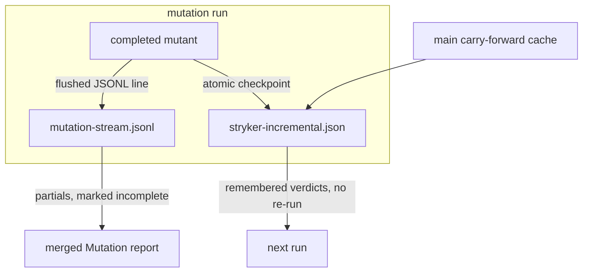

# Mutation Crash Tolerance - Plan

## Goal Capsule

- **Objective:** A mutation run that dies — timeout, cancel, kill — never loses completed work: partial results reach the merged report marked incomplete, and the next run resumes from a mid-run checkpoint instead of restarting from zero.
- **Product authority:** Owns crash tolerance and resume for the in-repo mutation stack (`packages/testing/mutation/stryker-js/*`, the Mutation workflow, the report merge). The remaining units of `docs/plans/2026-08-27-001-feat-agent-friendly-test-output-plan.md` (human renderer polish, stall tripwire, Job Summary) are not active scope.
- **Authority hierarchy:** Product Contract governs behavior; Planning Contract governs how it is built. Repo rules outrank both. Evaluator surfaces (`.github/workflows/mutation.yml`, `scripts/tools/merge-mutation-reports.mjs`) change in their own commit (CONST-E4).
- **Execution profile:** Four units. U1 and U2 in parallel (stream flush vs incremental checkpoint). U3+U4 together in the evaluator commit after U1/U2 so the stream and checkpoint files exist to consume.
- **Open blockers:** none. Cadence is KTD1, incompleteness rendering is KTD3, cache-key shape is KTD4.
- **Stop conditions:** Stop and surface rather than guess if a partial `MutationTestResult` written by U2 is rejected by `incrementalReportWorkflow` (cannot be the resume file). Do not invent a second resume format.
- **Tail ownership:** Implement through a PR watched to green. Publishing stays human (REPO-P1).
- **Product Contract preservation:** Product Contract unchanged.

---

## Product Contract

### Summary

Mutation runs become crash-tolerant: the per-mutant stream survives any kill to the last completed mutant, a dead run's partials appear in the merged report marked incomplete while its job stays red, and the next run resumes from a per-mutant checkpoint of the existing incremental state — locally, on CI re-runs, across PR pushes, and from the main carry-forward cache.

### Problem Frame

The mutation job for `packages/lint/oxlint/plugins/effect/schema` hit the workflow's 15-minute step timeout and was killed mid-run (GitHub Actions run 33121074009, job 98688050593, 2026-08-27). The run had already streamed one JSONL line per completed mutant to `reports/mutation-stream.jsonl` (landed in #264, present on the failing branch), but nothing consumes that file: the merged report is built only from per-package `mutation-report.json`, which is written only at report-readiness (`packages/testing/mutation/stryker-js/platform-node/src/Reporter.ts:1320-1326`), so the killed run contributed zero mutation results. The incremental state that remembers per-mutant verdicts across runs (`reports/stryker-incremental.json`) is likewise written only at report-readiness, so the next run of the package restarts from zero. CI persists no partial state: the cache save requires `main` and a successful outcome (`.github/workflows/mutation.yml`). The cost is triple: wasted CPU on re-running completed mutants, lost signal from survivors found before the kill, and a red job that carries no data.

### Key Decisions

- KD1. **Resume state is the incremental state, checkpointed per completed mutant; the stream stays a display artifact.** (session-settled: user-directed — chosen over stream-as-resume-state and startup-reconcile hybrids: one mechanism, reusing the existing invalidation.) Governs R5, R6.
- KD2. **Partials are shown, never scored as final.** (session-settled: user-directed — chosen over partials-scored and nothing-until-complete: a timeout is an infrastructure failure, not a score outcome.) Governs R3, R4.
- KD3. **Timeouts remain legal and cheap; no run-length bounding is added.** (session-settled: user-directed — chosen over sharding or splitting runs: resume makes a timeout non-destructive.) Governs R7.
- KD4. **Incomplete packages converge at merge; discovery is untouched.** (session-settled: user-directed — chosen over force-rerunning incompletes on every push: no incompleteness signal is added to target discovery.) Governs R7.
- KD5. **Resume is automatic when checkpoint state exists; no new flag.** (session-settled: user-approved — chosen over an opt-in flag: the state's hash invalidation already decides what to reuse.) Governs R6.
- KD6. **The test-contribution gate reads the combined report — fresh plus remembered verdicts — preserving kill attribution.** The transform-hook blindspot (test behavior changed by an injected hook without a source-hash change) is accepted residual risk, the same class of limitation upstream StrykerJS and PIT document for incremental reuse. This supersedes the incremental-off posture of `docs/plans/2026-08-05-001-feat-agent-friendly-stryker-cli-plan.md` for resume and carry-forward; that plan's explicit survivors-only re-run path is unaffected. (session-settled: user-directed — chosen over gate-needs-fresh-kills: the gate's verdict shape stays identical to a complete run.) Governs R9.

<!-- ce-section: work-relationships -->

### How This Work Fits Together

This plan owns crash tolerance and resume. It shares the stream-file surface with `docs/plans/2026-08-27-001-feat-agent-friendly-test-output-plan.md`, whose SIGTERM-flush intent is absorbed here into R2; that plan's renderer, stall-tripwire, and Job Summary units remain separately planned and are not commitments of this plan. Nothing unbuilt is depended on: the stream, the incremental decision logic, and the workflow scaffolding all exist today.

### Requirements

**Durable stream**

- R1. Every mutation run writes `reports/mutation-stream.jsonl` from run start, one line per completed mutant across all statuses. The behavior landed in #264 is pinned as contract, not incident.
- R2. A kill at any instant loses at most the in-flight mutant: every completed mutant's line is already on disk. The current buffered sink makes no such guarantee, so flush semantics are in scope.

**Partial results in the merged report**

- R3. When a package's final report is absent, the merged Mutation report still carries that package's partial mutant data from its stream, marked incomplete, with no final score.
- R4. A run that produced no final report fails its job red regardless of partial data, with zero-progress and partial-progress failures reported distinctly.

**Resume**

- R5. The incremental state file is checkpointed atomically as mutants complete, and a checkpoint preserves entries restored from prior state, so an interruption at any instant leaves a consistent checkpoint that only grows.
- R6. A new run with existing checkpoint state resumes: remembered mutants are not re-executed; their statuses replay into the report with kill attribution preserved and marked remembered.
- R7. Resume covers four interruption scenarios: local interactive cancel, CI timeout re-run on the same tree, cross-commit PR pushes, and main carry-forward via the cache.
- R8. CI persists partial mutation state from PR runs on any outcome — including failure and cancellation — and restores it in later runs of the same PR; main saves on success as today.

**Gate**

- R9. The stryker-test-contribution gate consumes the combined report of fresh and remembered verdicts, preserving its current verdict shape.

### Acceptance Examples

- AE1. Timeout mid-run. **Covers R1, R2, R3, R4.** Given a package whose mutation exceeds the step timeout, when the job is killed at half completion, then the merged report lists that package's tested mutants marked incomplete with no final score, the job is red, and the stream artifact ends at the last completed mutant.
- AE2. Cancel and resume on the same tree. **Covers R5, R6, R7, R9.** Given a run cancelled at roughly half the mutants — locally via interrupt, or a CI re-run of the same commit — when the package's mutation command runs again, then only unremembered mutants execute, the run finishes in roughly the remaining fraction of the time, and the completed run's verdict satisfies the test-contribution gate with remembered kills counted.
- AE3. PR push does not touch the package. **Covers R3, R7.** Given a package partial from push 1, when push 2 changes no path under it, then discovery skips it and the PR report keeps push-1 partials until merge.
- AE4. Merge convergence. **Covers R7, R8.** Given a partial package merged to main, when the post-merge mutation run restores the main state, then remembered mutants are skipped and the completed report is saved to the main cache.
- AE5. Death before the first mutant. **Covers R4.** Given a run that dies before any mutant completes — missing binary or a dry-run crash — when the job reports, then it fails red naming zero progress distinctly from partial progress.
- AE6. Test change invalidates a remembered verdict. **Covers R5, R6.** Given a remembered Killed verdict whose covering test file changed, when the next run executes, then that mutant re-runs rather than replaying the stale verdict.

### Scope Boundaries

- Run-length bounding stays out per KD3: no sharding, splitting, or budget mechanisms; the 15-minute step timeout stays.
- Discovery stays untouched per KD4: `scripts/tools/discover-mutation-targets.mjs` gains no incompleteness signal and no force-rerun of partial packages.
- The remaining units of `docs/plans/2026-08-27-001` (renderer polish, stall tripwire, vitest reporter selection, Job Summary) are out except where R2 absorbs the SIGTERM-flush intent.
- The stream file keeps its per-run truncate-on-open contract: no append history, no rotation, no multi-run schema.
- No resume flag and no upstream-style force-rerun escape hatch (StrykerJS ships `--force` for that; adopting one is a separate decision).

### Dependencies / Assumptions

- Verified against the tree: remembered mutants are never re-run and their statuses replay (`packages/testing/mutation/stryker-js/platform-node/src/IncrementalDiff.workflow.ts:146-151`, `Run.ts:214-228`); invalidation keys on both mutated-file hashes and covering-test-file hashes (`IncrementalDiff.workflow.ts:95-136`); a mutant absent from stored state runs, so a partial checkpoint degrades to first-run behavior for everything it lacks. Shared config already has `incremental: true` (`platform-node/src/config/base.ts:30-31`); survivor re-runs set `incremental: false` (`cli/src/Survivors.ts:381`). The reuse conditions and their limits mirror upstream: StrykerJS incremental mode (https://stryker-mutator.io/docs/stryker-js/incremental/) and PIT incremental analysis (https://pitest.org/quickstart/incremental_analysis/). Mid-execution checkpointing was requested upstream and never landed (https://github.com/stryker-mutator/stryker-js/issues/4886).
- Residual risk accepted by KD6: a test whose behavior changes via a transform hook without a source-hash change keeps a stale remembered verdict.
- Checkpoint state is per-package (`<package>/reports/stryker-incremental.json`); no cross-package state.
- Effect `FileSystem` FileHandle exposes `write`/`writeAll`/`sync` (`repos/effect/packages/effect/src/FileSystem.ts`).

### Outstanding Questions

None blocking. Cadence is KTD1, incompleteness rendering is KTD3, cache-key shape is KTD4.

### Sources / Research

- `.github/workflows/mutation.yml` — step timeout, require-report gate, main+success cache save, stream artifact upload.
- `packages/testing/mutation/stryker-js/platform-node/src/Run.ts`, `Reporter.ts`, `IncrementalDiff.workflow.ts`, `config/base.ts` and `packages/testing/mutation/stryker-js/cli/src/StreamFile.ts`, `Cli.ts`, `Survivors.ts` — current seams.
- `scripts/tools/merge-mutation-reports.mjs` — a part without `mutation-report.json` is dropped (`catch { continue }`).
- `packages/testing/mutation/plugins/stryker-test-contribution/src/test-contribution.ts` — gate already iterates every mutant's `killedBy`/`coveredBy`.
- `docs/plans/2026-08-05-001-feat-agent-friendly-stryker-cli-plan.md` — incremental-off posture KD6 supersedes for resume; survivors-only path stays.
- `docs/plans/2026-08-27-001-feat-agent-friendly-test-output-plan.md` — stream-file design this builds on.
- `docs/solutions/architecture-patterns/machine-stream-is-a-file.md` — missing report is infra failure, not a score.
- `docs/solutions/build-errors/stale-api-report-outlives-toolchain.md` — `stryker-incremental.json` is a gitignored mutation-task input; stale reuse across toolchain drift is a known silent failure mode.
- `docs/solutions/integration-issues/parallel-lanes-race-on-one-immutable-cache-key.md` — actions/cache keys are write-once; disjoint keys for non-equivalent writes.
- `docs/solutions/logic-errors/timeout-kills-credited-to-nobody.md` — Timeout kills have empty `killedBy`; do not invent attribution on replay.

---

## Planning Contract

### Key Technical Decisions

- KTD1. **Checkpoint cadence is per completed mutant, atomic temp-file + rename.** Bounded batching is rejected: a kill between batches would lose a window of completed work, contradicting R5. The write is a slim `MutationTestResult` that satisfies `IncrementalReportSchema` (`schemaVersion`, `thresholds`, `files` with `language`+`source`+mutants including `killedBy`/`coveredBy`, `testFiles` with `source`) — not `mutationTestReport` (`Reporter.ts:1146-1177`), which re-discovers framework dependencies on every call. Closest in-repo rename pattern: `platform-node/src/Sandbox.ts` rename-then-copy. Governs R5. Instantiates KD1.
- KTD2. **Stream drain uses FileHandle write + sync per line, still truncated at open.** `fs.sink` is buffered (`repos/effect/packages/effect/src/FileSystem.ts`). `Cli.ts` SIGINT/SIGTERM path is `interruptUnsafe` and skips `closeAndDrain`, so a buffered sink loses the tail on cancel; per-line `sync` makes the completed tail survive without a signal handler. Truncate-on-open (`flag: 'w'`) stays. Governs R2. Instantiates KD1's "stream stays display."
- KTD3. **A part without `mutation-report.json` is reconstructed from `mutation-stream.jsonl` MutantTested lines; the score cell is `incomplete`, never a number; `verdictOf` still keys on `outcome !== 'success'` so the job stays red.** Zero mutant lines vs some mutant lines is the R4 distinction in the require-report error text. Governs R3, R4. Instantiates KD2.
- KTD4. **Cache save uses a unique-per-run key and `if: always()`; restore-keys prefix stays `${{ runner.os }}-stryker-${{ matrix.package }}-`.** actions/cache keys are write-once (`docs/solutions/integration-issues/parallel-lanes-race-on-one-immutable-cache-key.md`); `${{ github.run_id }}` keeps each save a new key. The current `github.ref == 'refs/heads/main' && outcome == 'success'` guard is what drops PR partials. Governs R8. Instantiates KD5.
- KTD5. **Do not change `incremental: true` in `config/base.ts` and do not add a resume flag.** Resume is the existing incremental read (`Project.ts:325-358`) consuming a file that U2 now writes mid-run. Survivor re-runs keep `incremental: false` (`Survivors.ts:381`). The test-contribution plugin still walks the combined report, but replay must carry `killedBy`/`coveredBy` through `rememberedEntryOf` / `rememberedResultsOf` — today those fields are dropped (`IncrementalDiff.workflow.ts:203-207`, `Run.ts:220-226`), so R6 is false until U2 restores them. Governs R6, R9. Instantiates KD5, KD6.

### High-Level Technical Design

Per-mutant completion in `Run.ts` already calls `reportMutantRunResult` then `offerFinished`. After that pair, U2 writes the accumulated `MutantResult[]` (remembered prefix + completed so far) to `options.incrementalFile` when `options.incremental` is true. `IncrementalDiff` already treats missing stored mutants as `kind: 'run'`, so a partial file is a legal resume input. U1 is independent: the stream fiber writes each framed line through a FileHandle and `sync`s before the next. U3 reads the same stream the workflow already uploads. U4 only changes when and under which key that workflow saves `stryker-incremental.json`.

### Sequencing

U1 ∥ U2. Then U3 and U4 in one evaluator commit (CONST-E4), after U1/U2 so a fixture stream and a fixture checkpoint exist to consume.

### Assumptions

- A slim `MutationTestResult` that omits `framework.dependencies` still decodes through `incrementalReportWorkflow`. If it does not, that is the Goal Capsule stop condition — not a silent schema widening.
- GitHub Actions cache restore-keys prefix match, scoped by branch, returns the newest PR save to a later job on the same PR and the newest main save to a post-merge run.

### Risks

- Turbo's `mutation` task hashes `reports/stryker-incremental.json` as an input (`docs/solutions/build-errors/stale-api-report-outlives-toolchain.md`). A mid-run checkpoint that lands before the task ends does not change that; a restored turbo cache that also restores a stale incremental file is the pre-existing silent-reuse failure, not introduced here. Do not "fix" the turbo key in this plan.
- `interruptUnsafe` on SIGINT/SIGTERM (`cli/src/Cli.ts`) will still drop an in-flight mutant. That is R2/R5's allowed loss. Do not add a signal handler unless U1's per-line sync is shown not to persist completed lines.
- CONST-E4: landing `mutation.yml` or `merge-mutation-reports.mjs` in the same commit as U1/U2 is a review reject.

---

## Implementation Units

### U1. Per-line synced stream file

- **Goal:** A killed run's `reports/mutation-stream.jsonl` contains every completed mutant line.
- **Requirements:** R1, R2. Makes AE1's stream-artifact clause and AE5's zero-line distinction true.
- **Files:** `packages/testing/mutation/stryker-js/cli/src/StreamFile.ts`; contract tests under `packages/testing/mutation/stryker-js/cli/tests/`.
- **Approach:** Replace `fs.sink(file, { flag: 'w' })` with open-truncate, then `write` + `sync` per framed line (KTD2). Keep `STREAM_FILE_DIR` / `STREAM_FILE_NAME`. Do not change event shapes.
- **Test scenarios:** (1) A contract-lane run interrupted after N `mutant` events leaves a parseable file whose last `mutant` line is the Nth completion and whose first line is still `stream`. (2) A clean exit still ends with `verdict` or `error`. (3) Truncate-on-open: a second run in the same cwd does not append to the first run's lines.
- **Verification:** `pnpm --filter @systemfsoftware/stryker-js-cli test test:contract`.
- **Dependencies:** none.

### U2. Mid-run incremental checkpoint

- **Goal:** `reports/stryker-incremental.json` grows with each completed mutant and is a legal input to the next run's differ.
- **Requirements:** R5, R6, R7, R9. Makes AE2, AE6 true.
- **Files:** `packages/testing/mutation/stryker-js/platform-node/src/Run.ts`; `IncrementalDiff.workflow.ts` (`rememberedEntryOf`); `Reporter.ts` (checkpoint writer next to the existing `reportAll` incremental write); tests under `packages/testing/mutation/stryker-js/platform-node/`.
- **Approach:** Carry `killedBy`/`coveredBy` on remembered entries so replayed Killed verdicts still credit covering tests (R6, AE2). Accumulate reported `MutantResult`s. After each completion, atomically write a slim `MutationTestResult` of the accumulation to `options.incrementalFile` when `options.incremental` is true (KTD1, KTD5). Include the remembered prefix so a later kill cannot drop already-reused entries (R5 "only grows"). Leave `reportAll`'s final write in place. Survivor re-runs keep `incremental: false` and write nothing extra.
- **Test scenarios:** (1) Run a fixture of known mutant count, abort after k completions, restart: `IncrementalDiff` returns k remembered and the remainder `kind: 'run'`. (2) Changing a covering test file between runs demotes the remembered Killed to `kind: 'run'` (AE6). (3) `incremental: false` writes no checkpoint. (4) A checkpoint file is replaced via temp+rename, never a torn JSON parse. (5) A remembered Killed mutant keeps `killedBy` through checkpoint → replay → combined report so the test-contribution gate still credits the covering file.
- **Verification:** `pnpm --filter @systemfsoftware/stryker-js-platform-node test`.
- **Dependencies:** none.

### U3. Merge partials from the stream

- **Goal:** A matrix part with a stream and no `mutation-report.json` still contributes mutants to the merged report, marked incomplete, never scored as final.
- **Requirements:** R3, R4. Makes AE1, AE5 true on the report job.
- **Files:** `scripts/tools/merge-mutation-reports.mjs` only.
- **Approach:** In the `withReport` loop, on missing `mutation-report.json`, parse `mutation-stream.jsonl` `mutant` lines into a report-shaped object (file, location, mutatorName, replacement, status; `language: 'javascript'`, `source: ''` — merge uses `mutation-testing-metrics`, not `IncrementalReportSchema`) and keep the part with `outcome` unchanged (KTD3). Skip a trailing unparseable line (torn last write). Score cell `incomplete`. Zero `mutant` lines: no reconstruction, existing `no report` / ⚠️ path. Do not change the script's exit-code-never-depends-on-score contract.
- **Test scenarios:** (1) Selftest: a part dir with `mutation-part.json` (`outcome: 'failure'`), a stream of 3 `mutant` lines, no `mutation-report.json` → merged files contain those 3, score `incomplete`, verdict ❌. (2) Same with an empty/absent stream → `no report` / ⚠️, not mixed into `files`. (3) A complete `mutation-report.json` still wins over a sibling stream. (4) Existing selftest cases stay green.
- **Verification:** `node scripts/tools/merge-mutation-reports.mjs --selftest`.
- **Dependencies:** U1 (stream line shape must be flushed to disk). Evaluator commit with U4.

### U4. Persist partial incremental state from every mutation job

- **Goal:** A timed-out or cancelled matrix job still saves `stryker-incremental.json` under a unique cache key so the next job for that package on the same PR or on main can restore it.
- **Requirements:** R8, R4. Makes AE2's CI half, AE4, AE5 true.
- **Files:** `.github/workflows/mutation.yml` only.
- **Approach:** Cache save `if: always()`, key `${{ runner.os }}-stryker-${{ matrix.package }}-${{ github.run_id }}` (KTD4). GitHub re-evaluates `if` on cancel and continues steps whose condition is true — `always()` is the R8 cancellation path (https://docs.github.com/en/actions/reference/workflows-and-actions/workflow-cancellation). Restore-keys prefix unchanged. Require-report step: if `mutation-report.json` is absent, inspect the stream — zero `mutant` lines vs some — and fail red with the matching R4 sentence. Keep `continue-on-error` on the mutation step (score stays advisory).
- **Test scenarios:** (1) YAML lists `if: always()` on cache save and the run_id key; the `main && success` conjunction is gone. (2) Require-report error text names the stream path and distinguishes zero vs partial. (3) `discover-mutation-targets` invocation is unchanged.
- **Verification:** review of the YAML plus the PR's Mutation workflow. Own commit with U3.
- **Dependencies:** U2 (something to save). Evaluator commit with U3.

---

## Verification Contract

| Gate | When | Command |
| --- | --- | --- |
| Stream durability | after U1 | `pnpm --filter @systemfsoftware/stryker-js-cli test test:contract` |
| Checkpoint / resume | after U2 | `pnpm --filter @systemfsoftware/stryker-js-platform-node test` |
| Merge partials | after U3 | `node scripts/tools/merge-mutation-reports.mjs --selftest` |
| Whole tree | after the last edit | `pnpm check:local` |
| Evaluator observed | U3+U4 commit | require-report red on a missing report (already true); green still requires a final `mutation-report.json` |

No local mutation run (REPO-D3). Changesets: `pnpm change --bump <patch>` for `@systemfsoftware/stryker-js-cli` and `@systemfsoftware/stryker-js-platform-node` if their turbo `build` hashes move; merge-script and workflow hashes are evaluator, no publishable bump.

---

## Definition of Done

- AE1–AE6 hold under the Verification Contract commands above.
- U1 and U2 land in product commits; U3+U4 land in a separate evaluator commit (CONST-E4), observed conceptually red-before (today's merge drops stream-only parts; today's cache save skips PR/failure) and green-after.
- Abandoned-attempt code is absent from the diff.
- `pnpm check:local` exits 0 after the last edit.
- Work is a PR watched to green. Merge stays human (REPO-P1).
