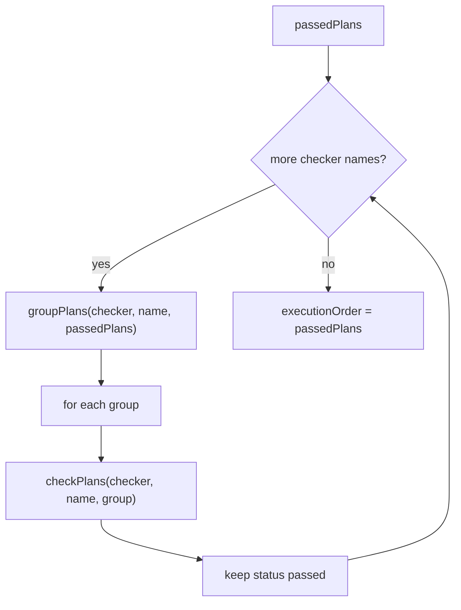

# Group then check mutants

## Goal Capsule

- **Objective:** When `options.checkers` is non-empty, every `checker.check` during a mutation run receives exactly one group from that checker's `group` for the same mutant list.
- **Authority:** GitHub issue 279 over this plan; this plan over implementation guesses; repo law over all.
- **Stop conditions:** U1–U2 verification commands exit 0, or a change would delete the TypeScript checker, empty `checkers`, or raise Mutation `timeout-minutes` — stop.
- **Execution profile:** code, one PR, CI watched to decided.
- **Tail ownership:** LFG / ce-work through CI-decided; merge stays human.

---

## Product Contract

### Summary

Invert the mutation-test checker loop so grouping happens before typecheck. Each `check` sees one non-interfering batch. Empty `checkers` still makes no `check` calls.

### Problem Frame

`mutationTestRun` in `packages/testing/mutation/stryker-js/platform-node/src/Run.ts` (lines 1088–1127 at `941bcca550c0e0fd95452e88d175fb455e05d26e`) calls `checkPlans` on the full remaining plan list, then `groupPlans` only to flatten test-runner order. One `check` applies every mutant and typechecks the combined set. Large packages stall in `tsc` until GitHub kills Mutation at 15 minutes (`timeout-minutes` on `.github/workflows/mutation.yml`), and no report is written.

StrykerJS 6.4 grouped first so one compiler run sees unrelated mutants only ([Announcing faster TypeScript checking](https://stryker-mutator.io/blog/announcing-faster-typescript-checking/), 2023-02-17). The checker plugin API is `group` then `check` on each group ([stryker-js#3450](https://github.com/stryker-mutator/stryker-js/pull/3450)). This tree already implements `group` on `@systemfsoftware/stryker-js-typescript-checker`; the engine never uses those groups as check batches.

### Requirements

Check batches:

- R1. When `options.checkers` is non-empty, every `check` invocation during a mutation run receives exactly the mutants of one inner array from that checker's `group` for the same mutant list.
- R2. A fake checker whose `group` returns two disjoint groups yields two `check` invocations, and each invocation's mutant ids equal one of those groups.
- R3. If `group` returns a single group containing every mutant, one `check` of that set is allowed.

Degenerates:

- R4. `checkers: []` produces no `check` calls.

Preserved:

- R6. Do not delete the TypeScript checker, set `checkers: []` in `stryker.config.base.json`, or raise Mutation `timeout-minutes`.
- R7. A mutant whose check result is not `passed` is still handed to `reportCheckFailure` as today (`Run.ts` 1103–1108) and appears as CompileError in the report ([Mutant states](https://stryker-mutator.io/docs/mutation-testing-elements/mutant-states-and-metrics/)).

### Key Decisions

- **Check batches come from `group`, never from concatenating ungrouped plans.** Governs R1, R5.
- **A one-group-of-all result from `group` is a legal `check` of that set.** Governs R3.
- **Compile-error mutants stay reported; grouping does not swallow them.** Governs R7.

### Acceptance Examples

- AE1. Two-group fake
  - **Covers:** R1, R2
  - **Given:** a recording checker whose `group` returns `[["a","b"],["c"]]`
  - **When:** the mutation-test checker phase runs on plans `a`, `b`, `c`
  - **Then:** `check` is called twice; the mutant-id sets are `{a,b}` and `{c}` in some order; neither call receives `{a,b,c}`
- AE2. Empty checkers
  - **Covers:** R4
  - **Given:** `checkers: []`
  - **When:** the mutation-test checker phase runs
  - **Then:** `check` is not called
- AE3. Degenerate all-in-one group
  - **Covers:** R3
  - **Given:** `group` returns `[["a","b","c"]]`
  - **When:** the checker phase runs
  - **Then:** `check` is called once with `{a,b,c}`
- AE4. Compile-error still reported
  - **Covers:** R7
  - **Given:** `group` returns `[["a"],["b"]]`; `check` of `{a}` returns `compileError`
  - **When:** the checker phase runs
  - **Then:** the helper returns `{a}` paired with `compileError` and `{b}` paired with `passed`

### Scope Boundaries

- Deferred: parallel `check` of several groups on the checker pool; the `needsRetest` checker-result path (separate issue).
- Outside: TypeScript checker's `partitionMutantsForGrouping` / `createGroups` algorithm; Mutation workflow timeout; disabling checkers.

### Sources

- Issue 279: https://github.com/systemfsoftware/systemfsoftware/issues/279
- Current inversion: `packages/testing/mutation/stryker-js/platform-node/src/Run.ts` 1088–1127
- Stryker grouping design: https://stryker-mutator.io/blog/announcing-faster-typescript-checking/
- Checker API: https://github.com/stryker-mutator/stryker-js/pull/3450
- TypeScript checker plugin: https://stryker-mutator.io/docs/stryker-js/typescript-checker/

---

## Planning Contract

### Key Technical Decisions

- KTD1. Extract a checker-phase helper next to `checkPlans` / `groupPlans` in `packages/testing/mutation/stryker-js/platform-node/src/Checker.ts` that, for one checker name and a plan list, calls `groupPlans` then `checkPlans` once per returned group and returns every `[plan, result]` pair in group order. `mutationTestRun` loops `options.checkers` through that helper, calls `reportCheckFailure` for each non-`passed` result, and sets `passedPlans` to the `passed` remainder. It does not call `checkPlans` on the ungrouped list. Do not add the helper to `src/index.ts`.
- KTD2. Check groups sequentially on the single `Pool.get` checker already taken for that checker name. Do not schedule groups in parallel in this fix.
- KTD3. Drop the trailing `groupPlans` that only flattens test-runner order. After the last checker, `executionOrder` is the concatenation of remaining passed plans in the order their groups were checked. `Stream.mapEffect` concurrency in `mutationTestRun` is per-plan (`Run.ts` ~1180), so flattening does not change runner parallelism.
- KTD4. Cover R1–R4 and R7 with a Gherkin integration test and a recording fake `CheckerResourceService` driving the helper. Do not boot checker workers or run `runMutationTest`. Gate: AE1 fails if that helper's `check` receives the full ungrouped id set. `mutationTestRun` wiring is the remaining `checkPlans(` call sites in `Run.ts`: only the helper, never the ungrouped list.

### High-Level Technical Design

`checkPlans` and `groupPlans` stay the Cell shells they are. Only the caller in `mutationTestRun` (lines 1088–1127) changes.

### Assumptions

- A recording fake of `CheckerResourceService` is a legal architectural-boundary double; the real TypeScript checker is not required to prove R1–R4, R7.
- Relative import from `tests/` into `src/Checker.ts` is allowed because the helper is not a public export (`src/index.ts` is the adopter door).

### Risks and Dependencies

- **`mutationTestRun` still bypasses the helper.** Mitigation: after U1, `checkPlans(` in `Run.ts` appears only as the helper call, not on the ungrouped list. Review, not the U2 suite.
- **Test-runner order changes** for survivors that the old trailing `group` would have re-partitioned. Accepted under KTD3; issue 279 does not require a second `group` after compile-error filtering.

### Sequencing

U1 and U2 land in one PR. U2's package test is U1's behavioral gate.

---

## Implementation Units

### U1. Group-then-check checker phase

- **Goal:** Every configured checker checks one `group` at a time and still reports non-passed results (R1, R3, R4, R5, R7).
- **Requirements:** R1, R3, R4, R5, R6, R7.
- **Files:** `packages/testing/mutation/stryker-js/platform-node/src/Checker.ts`, `packages/testing/mutation/stryker-js/platform-node/src/Run.ts`, `.changeset/` via `pnpm change --bump patch` for `@systemfsoftware/stryker-js-platform-node`.
- **Approach:** Add the helper in KTD1. In `mutationTestRun`, replace the `checkPlans(passedPlans)` loop and the later `groupPlans(lastChecker, passedPlans)` with the helper per checker name, `reportCheckFailure` on non-passed pairs, then `executionOrder` from remaining passed plans (KTD3). Keep crash `catchTags` / `Pool.invalidate` on the scoped `Pool.get` as today. Leave typescript-checker grouping code untouched.
- **Test Scenarios:** owned by U2.
- **Verification:** `pnpm --filter @systemfsoftware/stryker-js-platform-node typecheck` exits 0.

### U2. Gatekeeper grouping integration test

- **Goal:** Pin AE1–AE4 so a helper that checks the full ungrouped list fails (R1–R4, R7).
- **Requirements:** R1, R2, R3, R4, R7.
- **Files:** `packages/testing/mutation/stryker-js/platform-node/tests/checker-group-then-check.integration.test.ts`
- **Approach:** Follow `tests/verdict-envelope.integration.test.ts` (`makeFeature` / Given-When-Then). Recording fake implements `CheckerResourceService`: `group` returns the scenario's `string[][]`; `check` records mutant ids and returns the scenario's results. Drive the helper from U1 (not `runMutationTest`). Assert call counts, id sets, and returned pairs. Do not assert `groupPlans` was merely invoked.
- **Test Scenarios:** AE1, AE2, AE3, AE4.
- **Verification:** `pnpm --filter @systemfsoftware/stryker-js-platform-node test` exits 0. Reverting the helper to one `check` of the full list makes AE1 fail.

## Verification Contract

| Gate            | Command                                                             | Applies to |
| --------------- | ------------------------------------------------------------------- | ---------- |
| Typecheck       | `pnpm --filter @systemfsoftware/stryker-js-platform-node typecheck` | U1         |
| Package tests   | `pnpm --filter @systemfsoftware/stryker-js-platform-node test`      | U2, DoD    |
| Whole-repo gate | `pnpm check:local`                                                  | DoD        |

No agent starts a mutation run (REPO-D3).

## Definition of Done

- R1–R7 hold; AE1 fails if the helper's `check` receives the full ungrouped list.
- `pnpm --filter @systemfsoftware/stryker-js-platform-node test` exits 0 after the last edit.
- `pnpm check:local` exits 0 after the last edit.
- A patch changeset exists if turbo `build` hash for `@systemfsoftware/stryker-js-platform-node` moved.
- No dead-end code remains in the diff.
- PR open; CI watched to decided; merge stays human.
