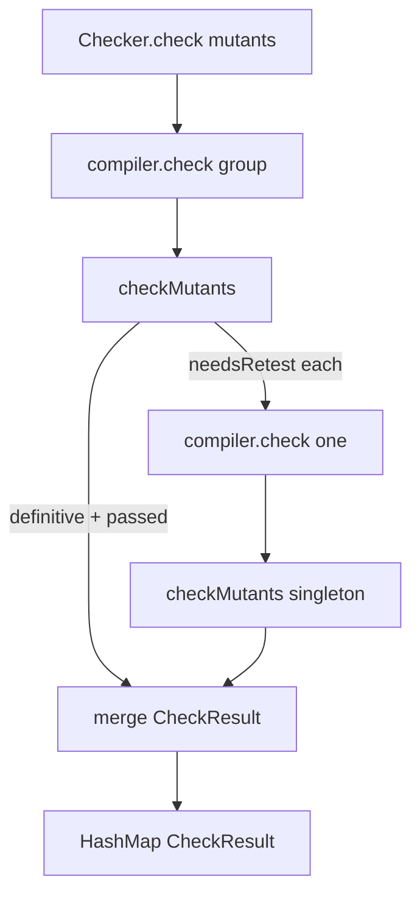

# TypeScript checker ambiguous compile-error mutants

## Goal Capsule

- **Objective:** When `checker.check` is given two or more mutants in the same project file and TypeScript reports a diagnostic that cannot be attributed to exactly one of them, the mutant that typechecks alone is `passed` and the mutant that fails typecheck alone is `compileError`.
- **Authority:** GitHub issue 278 over this plan; root `AGENTS.md` (REPO-A1) and Constitution II.3 over implementation shape; this plan over local invention.
- **Stop conditions:** U1 verification exits 0 and R1–R5 hold; or the live path cannot re-invoke the compiler without putting I/O inside `checkMutants` — stop and report.
- **Execution profile:** code; one PR to `main`; CI watched to decided.
- **Tail ownership:** ce-work through verification; merge stays human.

---

## Product Contract

### Summary

The TypeScript checker classifies group diagnostics into definitive compile errors and mutants that need an isolated recheck. Isolated recheck is a second sandwich on the live `Cell.apply(checkMutants)` path. A mutant that typechecks alone is never reported `passed` together with a mutant that does not.

### Problem Frame

`classifyDiagnosticsPure` already fills `needsRetest` when a diagnostic's related-mutant set for that file has length 0 or greater than 1 (`packages/testing/mutation/stryker-js/typescript-checker/src/Checker.workflow.ts` at `941bcca550c0e0fd95452e88d175fb455e05d26e`, lines 108–129). `buildResult` at lines 147–169 defaults every id to `passed` and overlays only `definitive`. Ambiguous group members reach the test runner as typecheck-clean. Mutation reports understate compile errors. Packages that mutate large files spend the test budget on mutants that should have been compile errors.

### Requirements

Classification:

- R1. For every `checker.check` call with two or more mutants whose files are in the compiler graph, if TypeScript reports a diagnostic that cannot be attributed to exactly one of those mutants, the live path re-invokes the compiler on each `needsRetest` mutant in isolation.
- R2. After that check returns, a mutant that typechecks alone is `passed` and a mutant that fails typecheck alone is `compileError`. Never both `passed`.

Degenerates:

- R3. One mutant in the call: every diagnostic is attributed to that mutant (`compileError` if any, else `passed`).
- R4. No diagnostics: every mutant is `passed`.
- R5. The first mutant's file is outside the compiler graph: every mutant is `passed` (existing early return in `buildResult`).

### Key Decisions

- **Isolate ambiguous members; do not bulk-mark the group `compileError`.** Governs R1, R2.
- **Keep `needsRetest` on the classification result and consume it on the live path.** Governs R1.
- **Live path stays `Cell.apply(checkMutants)` in `Checker.ts`, not the unused `classifyDiagnostics` export.** Governs R1.

### Scope Boundaries

- Outside: disabling `checkers: ["typescript"]`; changing `.github/workflows/mutation.yml` timeouts; Stryker core grouping; diagnostic message formatting beyond status.
- Deferred: none.

### Acceptance Examples

- AE1. Mixed ambiguous pair. Covers R1, R2.
  - **Given:** two mutants in files inside the compiler graph; a group compile yields a diagnostic whose related-mutant set has length not equal to 1; mutant A typechecks alone; mutant B fails typecheck alone.
  - **When:** `makeCheckerService.check([A, B])` returns.
  - **Then:** A is `passed` and B is `compileError`.
- AE2. One mutant, compile error. Covers R3.
  - **Given:** one mutant whose replacement is a type error.
  - **When:** `check` returns.
  - **Then:** that id is `compileError`.
- AE3. Empty diagnostics. Covers R4.
  - **Given:** one or more in-graph mutants that typecheck as a group.
  - **When:** `check` returns.
  - **Then:** every id is `passed`.
- AE4. Outside graph. Covers R5.
  - **Given:** the first mutant's file is absent from `nodes`.
  - **When:** `check` returns.
  - **Then:** every id is `passed`.

### Sources

- Issue: https://github.com/systemfsoftware/systemfsoftware/issues/278
- Classification drop: `packages/testing/mutation/stryker-js/typescript-checker/src/Checker.workflow.ts` lines 108–169 at `941bcca550c0e0fd95452e88d175fb455e05d26e`
- Upstream isolation: `checkErrors` in https://github.com/stryker-mutator/stryker-js/blob/master/packages/typescript-checker/src/typescript-checker.ts (resets with `tsCompiler.check([])`, then `checkErrors([mutant])` per member of `mutantsThatCouldNotBeTestedInGroups`)
- Sandwich: Constitution II.3 — when a second read is required, split into two sandwiches; do not interleave I/O inside one decide

---

## Planning Contract

### Key Technical Decisions

- KTD1. Treat group classification and isolated recheck as two sandwiches, not one decide with a second compiler read inside it. Sandwich 1: `compiler.check(group)` then `checkMutants` → definitive `compileError`s, `passed` for uninvolved ids, and a `needsRetest` list. Sandwich 2, once per remaining mutant, in series (Effect `forEach`/`all` default sequential; do not set `concurrency`): `Cell.apply(checkMutants)` with that singleton. The `mutants.length === 1` arm that attributes is `classifyDiagnosticsPure` in `Checker.workflow.ts` (line 91 at `941bcca`). `Checker.check` reads `needsRetest` from sandwich 1, runs sandwich 2 for each, and merges `results` into `HashMap<string, CheckResult>`. A failed singleton sandwich fails the whole `check` (`CheckerFailed`); remaining ids are not defaulted to `passed`. Chosen over folding the recheck into `Cell.read` or into `buildResult`: Constitution II.3 forbids read → decide → read → decide inside one filling. Sequential because `Compiler.check` mutates `lastMutants` across yields (`Compiler.ts` 758–792); Effect concurrent `forEach` is opt-in (`https://effect.website/docs/concurrency/basic-concurrency/`).
- KTD2. `checkMutants` returns `{ readonly results: Record<string, { readonly status: 'passed' } | { readonly status: 'compileError'; readonly reason: string }>; readonly needsRetest: readonly Mutant[] }`. Ids in `needsRetest` are absent from `results` as `passed`. `CheckPhases.decision` and `output` use that wrapper. `Cell.write` of one sandwich maps `results` only; the shell, not `Cell.write`, iterates `needsRetest`. Chosen over a `Record` with a sibling field: `Object.entries` on the record would see `needsRetest` as a mutant id.
- KTD3. Delete `classifyDiagnostics` and its private `getMutantsWithReferenceToChildrenOrSelf` from `Checker.ts`. The live classifier is `classifyDiagnosticsPure` inside `checkMutants`. Chosen over keeping a second classifier: issue 278 names that export unused by `Cell.apply(checkMutants)`.
- KTD4. Do not add `compiler.check([])` before each singleton if `Compiler.check` already resets `state.lastMutants` then applies the new set (`packages/testing/mutation/stryker-js/typescript-checker/src/Compiler.ts` lines 758–770). Add the empty check only if a singleton overlay still sees the group's replacements. Chosen over copying upstream's extra `check([])` without measuring: extra compile is cost; reset already exists.

### High-Level Technical Design

### Assumptions

- `Compiler.check([one])` resetting `lastMutants` is enough to isolate a group member. Verify on the mixed-pair fixture; if the singleton still typechecks while the group's replacement remains, add `compiler.check([])` before the singleton loop (KTD4).
- The public `CheckResult` union stays `passed` | `compileError`. `needsRetest` does not leave the checker package.

### Risks and Dependencies

- **False compile error on the valid mutant** if isolation is skipped or the filesystem still holds the group. Mitigation: AE1 fails unless A is `passed`.
- **Workflow cyclomatic complexity** if `buildResult` grows new `if` chains. Mitigation: keep classification as data; shell iterates `needsRetest`.
- **Changeset required** if the package `build` turbo hash moves.

### Sequencing

U1 only.

---

## Implementation Units

### U1. Isolate needsRetest on the live check path

- **Goal:** Ambiguous group members are rechecked alone; AE1–AE4 hold (R1–R5).
- **Requirements:** R1, R2, R3, R4, R5.
- **Files:** `packages/testing/mutation/stryker-js/typescript-checker/src/Checker.workflow.ts`, `packages/testing/mutation/stryker-js/typescript-checker/src/Checker.ts`, `packages/testing/mutation/stryker-js/typescript-checker/src/Checker.integration.test.ts` (or colocated name matching `src/**/*.test.ts`), changeset for `@systemfsoftware/stryker-js-typescript-checker`.
- **Approach:** Extend `checkMutants` with KTD2. Point `CheckPhases.decision` at that wrapper. In `makeCheckerService.check`, run sandwich 1, then sequential singleton `Cell.apply(checkMutants)` per `needsRetest` mutant, then convert merged `results` to `HashMap<string, CheckResult>` (KTD1). Delete the unused `classifyDiagnostics` export (KTD3). Drive AE1 from the existing `testResources/single-project` tree (including `src/errorInFileAbove2Mutants/`) through `makeCheckerService` and a real `makeTypescriptCompiler`. Do not stub `compiler.check`.
- **Test Scenarios:**
  - Gatekeeper (critical): two in-graph mutants, ambiguous group diagnostic, A typechecks alone, B does not → A `passed`, B `compileError`. Fails if `buildResult` (or its successor on the live path) defaults both to `passed`, and fails if both are `compileError` without isolation.
  - One mutant with a type error → that id `compileError` (R3).
  - Group or singleton with empty diagnostics → all `passed` (R4).
  - First mutant file absent from `nodes` → all `passed` (R5).
  - Do not add a test whose only coverage is `mutants.length === 1` beyond the R3 degenerate.
- **Verification:** `pnpm --filter @systemfsoftware/stryker-js-typescript-checker test` exits 0 and runs the gatekeeper.

---

## Verification Contract

| Gate                   | Command                                                                                                                                      | Applies to |
| ---------------------- | -------------------------------------------------------------------------------------------------------------------------------------------- | ---------- |
| Package tests          | `pnpm --filter @systemfsoftware/stryker-js-typescript-checker test`                                                                          | U1         |
| Package typecheck      | `pnpm --filter @systemfsoftware/stryker-js-typescript-checker typecheck`                                                                     | U1         |
| Package lint           | `pnpm --filter @systemfsoftware/stryker-js-typescript-checker lint`                                                                          | U1         |
| Unused classifier gone | `git grep -nI -e 'export function classifyDiagnostics' -- packages/testing/mutation/stryker-js/typescript-checker ':!*.lock'` prints nothing | U1         |
| Whole-repo gate        | `pnpm check:local`                                                                                                                           | DoD        |

No agent starts a mutation run (REPO-D3).

## Definition of Done

- R1–R5 hold; AE1–AE4 pass on the live `Cell.apply(checkMutants)` path.
- `classifyDiagnostics` is deleted from `Checker.ts`.
- `pnpm --filter @systemfsoftware/stryker-js-typescript-checker test` exits 0 after the last edit, then `pnpm check:local` exits 0.
- Changeset exists if the package `build` hash moved.
- No abandoned-attempt code remains in the diff.
- PR open; CI watched to decided; merge stays human.
