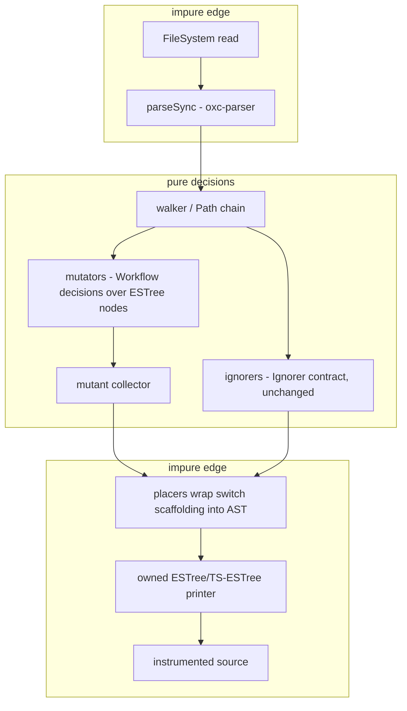

# refactor: Remove Babel — oxc substrate for the instrumenter

## Goal Capsule

- **Objective:** Every workspace-owned Babel dependency is deleted. The mutation instrumenter parses with `oxc-parser`, walks and mutates ESTree/TS-ESTree nodes, and prints with a repo-owned printer. `stryker-plugins` drops its dev-only `@babel/types`. Zero compatibility shims.
- **Authority:** User directive, this session: abolish all Babel dependencies, replace with state-of-the-art oxc libraries, no backwards compatibility. Repo law: `AGENTS.md` (REPO-O1, REPO-W4, REPO-R2, REPO-D1..D3), `CONSTITUTION.md` (CONST-S4, CONST-S1).
- **Execution profile:** `ce-work` pipeline via `lfg`; units are dependency-ordered; every unit type-green before the next starts.
- **Stop conditions:** A unit whose verification gate fails after one evidence-carrying re-dispatch; a printer-fidelity defect that contract fixtures cannot localize; any `settled-decision-invalidated` evidence against KTD1.
- **Tail ownership:** `lfg` owns simplify → review → commit → PR → CI babysit after `ce-work` returns.

---

## Product Contract

### Summary

Two workspace packages carry Babel: `packages/testing/mutation/stryker-js/instrumenter` (runtime: `@babel/core`, `@babel/parser`, `@babel/generator`, `@babel/plugin-proposal-decorators`, `@babel/plugin-transform-explicit-resource-management`, `@babel/preset-typescript`, plus `@types/babel__core`/`@types/babel__generator` in devDependencies) and `packages/testing/mutation/plugins/stryker-plugins` (`@babel/types` in devDependencies only — the two `tstyche` fixtures `tests/effect-schema-ignorer/__fixtures__/AstNode.tst.ts` and `tests/workflow-make-ignorer/__fixtures__/AstNode.tst.ts`, zero runtime imports; measured this session: no other `@babel` declaration or import exists in `packages/`, `omp/`, `agent-plugins/`, `scripts/` — two string-literal mentions survive in the `ban-classes` oxlint rule's doc comment and test fixture, neither a dependency; `repos/` hits are vendored third-party trees, read-only per REPO-S3).

The instrumenter's published surface (`src/index.ts`) already exports nothing Babel-typed: `disableTypeChecks`, `angularIgnorer`, `frameworkPluginsFileUrl`, `strykerPlugins`, and the option/result schemas (Wire-minted `S.Unknown` for plugins/ASTs). The published Ignorer contract (`packages/testing/mutation/stryker-js/stryker-js/src/Ignorer.ts`) is substrate-agnostic — `node: unknown` with structural `is*` guards and a `parentPath` chain.

### Problem Frame

The instrumenter is the mutation gate of every package in this tree and a published engine. Its parse/traverse/print pipeline is the last Babel consumer in the workspace: `Parser.ts` parses via `babel.parseAsync` with `preset-typescript` + decorator and explicit-resource-management plugins (these exist only to enable syntax; oxc parses legacy decorators, Stage-3 decorators, and `using` declarations unconditionally — `repos/oxc/crates/oxc_parser/src/lib.rs`, `crates/oxc_parser/src/js/declaration.rs`); `Transformer.ts` traverses with `NodePath` and places mutant switches into the AST; `Mutator.ts` builds replacements with `babel.types` builders; `Printer.ts` prints the whole mutated AST with `@babel/generator`. Removing Babel therefore means re-porting the substrate under an already-pure decision layer — the seam the effect-restructure plan (docs/plans/2026-08-23-002-refactor-strykerjs-effect-restructure-plan.md, KTD11/U10-U11) deliberately created.

### Requirements

- R1. No manifest under `packages/`, `omp/`, `agent-plugins/`, `scripts/` declares `@babel/*` or `@types/babel__*`. Gate: `git grep -nI -e '@babel' -- ':!repos' ':!*.lock'` over `**/package.json` prints zero lines (read stdout; git grep exits 1 when clean).
- R2. No workspace-owned source or build output imports `@babel/*`. Gate: `git grep -nI -e "from '@babel/ -e "import('@babel/ -e "require('@babel/" -- packages omp agent-plugins scripts ':!*.lock'` prints zero lines after a fresh `pnpm install` and clean rebuild (a stale `dist/` silently re-creates the edge at runtime — sever-plan U4 precedent, docs/plans/2026-08-23-001-sever-strykerjs-org-dependencies-plan.md). Prose mentions that are not imports (the `ban-classes` rule example, `docs/plans` history) are outside this gate — see Scope Boundaries.
- R3. The instrumenter finds and places the same mutant population per fixture project under the new substrate, measured — not asserted: before the swap, run the current instrumenter over the fixture projects and record a (mutatorName × node-kind) population manifest; after the swap, diff against it mechanically. Gate: the manifest diff is empty, the instrumenter vitest suite exits 0 with regenerated goldens, and `pnpm --filter @systemfsoftware/stryker-js-cli test:contract` exits 0 (five fixture projects through the shipped bin — the behavioral proof).
- R4. The published surface changes only by the recorded removals: the instrumenter's parser-`plugins` option (KTD8) and nothing else — export names and kinds are otherwise unchanged. Gate: `pnpm --filter @systemfsoftware/stryker-js-instrumenter attw` and `pnpm --filter @systemfsoftware/stryker-plugins api:check attw` exit 0; the api-extractor report diff names exactly the removed option.
- R5. The plugin-api Ignorer contract is byte-unchanged. Gate: `git diff --exit-code -- packages/testing/mutation/stryker-js/stryker-js/src/Ignorer.ts`.
- R6. HTML and Svelte files still instrument. Gate: `instrumenter.integration.test.ts` and `svelte-parsing.integration.test.ts` exit 0.
- R7. Every new import is declared in the importing package's manifest at the catalog pin. Gate: turbo build succeeds from a fresh install and the workspace boundary audit task exits 0 (turbo-boundary-audit precedent, docs/solutions/tooling-decisions/turbo-boundary-audit-catches-undeclared-deps.md).
- R8. Changeset intents match the turbo-hash verdict and consumer-observable change. Gate: `.github/workflows/changeset-check.yml` (scripts/guards/check-changeset.ts) passes; instrumenter intent bumps **major** with a `BREAKING CHANGE:` footer (the parser-`plugins` option is removed and the Node engines floor rises to oxc-parser's `^20.19.0 || >=22.12.0` — both consumer-observable, REPO-R1 sanctions the break); `stryker-plugins` intent bumps `none` — verified this session against `etc/*.api.md`: the published ignorer surface is `unknown`-typed decision functions and constants, so the internal schema retarget changes no exported name, type, or behavior (REPO-R2's `none` class).
- R9. Package documentation no longer describes the Babel substrate. Gate: `git grep -nI -i babel -- packages/testing/mutation/stryker-js/instrumenter/AGENTS.md packages/testing/mutation/stryker-js/instrumenter/README.md packages/testing/mutation/plugins/stryker-plugins` returns zero. Out of scope: `cli/src/Cli.ts` help prose that mentions `babel/register` as a user-side transpiler example — not a dependency.
- R10. Regenerated characterization goldens are the deliberate spec of intended output under the owned printer. Every golden delta must be one of: formatting-only, printer-fidelity-only (output formatting and rendering, never which nodes are mutated or which mutant kinds a fixture yields), or an admitted comment-placement class (KTD8-era comments are re-associated by span; placement deltas are admitted, comment loss is not). Population or behavior changes go through R3's manifest gate, never through a golden relabel. Gate: review of the golden diff in the PR against these classes; behavioral parity enforced by R3.

### Scope Boundaries

- In scope: `packages/testing/mutation/stryker-js/instrumenter`, `packages/testing/mutation/plugins/stryker-plugins`, shared manifests they own, their changesets and leaf docs.
- Out of scope: `repos/**` (vendored, read-only — REPO-S3); `Cli.ts` option-help prose; prose and example mentions of `@babel` that are not dependencies or imports (the `ban-classes` oxlint rule's doc example and test fixture, `docs/plans/**` history — outside the R1/R2 gates by design); `@eslint-community/regexpp` (regex mutator, not Babel); `angular-html-parser` and `svelte` (HTML/Svelte parsing, not Babel); root `estree-walker` devDependency (Svelte v5 walker resolution — `Parser.ts:608` resolves it from the consumer's install; unrelated to Babel).
- Deferred to follow-up work: renaming `estree`-typed internals beyond what the swap forces; any oxc Rust-native instrumenter port.

---

## Planning Contract

### Key Technical Decisions

- KTD1. Substrate is `oxc-parser` + `@oxc-project/types`, both already pinned in `pnpm-workspace.yaml` `catalog:` (`oxc-parser: ^0.140.0`, `@oxc-project/types: ^0.140.0`). (session-settled: user-directed — chosen over SWC and Babel 8: the workspace vendors `repos/oxc`, its lint gate is oxlint/oxc, and `oxc-parser` is already the catalog-pinned parser in `packages/core/effect/schema/discovery`; SWC would add a second Rust toolchain with no compensating property.)
- KTD2. The instrumenter owns its printer: a new module under `instrumenter/src/print/` that renders the ESTree/TS-ESTree node vocabulary oxc-parser emits, with precedence-driven parenthesization. Rejected: (a) an oxc JS codegen — none exists; `oxc_codegen` is Rust-only, wrapped by no napi binding (verified over `repos/oxc/napi/`: parser, transform, transform-react, transform-relay, minify only); (b) splice-based textual instrumentation — rejected because the HTML/Svelte paths print whole parsed scripts and the placers' AST-decision shape would be discarded for no net surface reduction; (c) `astring`/`escodegen`/`recast` — ESTree-only, no TS-ESTree node support (TS-ESTree node vocabulary per typescript-eslint AST spec, typescript-eslint.io/packages/typescript-estree/ast-spec/); (d) a Rust instrumenter port — rewrites every mutator for no behavioral gain this change requires.
- KTD3. A small owned walker builds a path chain (`node`, `parent`, `parentPath`) from oxc-parser's exported `visitorKeys`, providing ancestors and skip semantics the placers and Ignorer adapters need. Parent/ancestor links live on Path objects, never on nodes — `structuredClone` of a node must not drag an ancestor chain (or a placer re-walk lands on clones); `visitorKeys` has no `Directive` entry, so the walker enumerates directive prologues explicitly from `Program.body` and their literal children are mutant sources only if the pre-swap population manifest says they were. Rejected: oxc's `Visitor` class — callbacks receive the node only, no parent/ancestor context (`repos/oxc/napi/parser/src-js/raw-transfer/visitor.js`); `estree-walker` — no `parentPath` chain and a new dependency where the walker is ~a screen of pure code. Root `estree-walker` stays untouched (Svelte path).
- KTD4. Positions are offsets. oxc-parser nodes carry `start`/`end` numbers and, with `range: true`, a `[start, end]` array; it never emits `loc` objects (verified: `repos/oxc/napi/parser/src-js/generated/deserialize/js_range.js`, `js.js`). Every `loc`-reading site gets a named port on the new substrate: `Mutator.ts` `toApiMutant` and `Instrument.ts` `toApiLocation` translate offsets through `computeLineStarts`/`positionFromOffset`; placer diagnostics (`Transformer.ts` `throwPlacementError`) report from span offsets; `eqNode` compares type + span offsets instead of `loc`. Integration tests asserting `mutant.location` line/column keep passing through the translation, not by carrying a `loc` shim.
- KTD5. Parsing is synchronous `parseSync`, matching the house convention in `packages/core/effect/schema/discovery/src/internal/schema-names.ts` (sync call, error-array/try-catch handling, no Schema decode of parse results). The instrument pipeline stays async at its I/O edges (file reads, Svelte compiler calls); parse calls within it become sync.
- KTD6. The characterization goldens are regenerated once, deliberately, as the spec of intended instrumented output under the owned printer (spec-of-intended-output, not capture-of-whatever-emits; OP12). The behavioral contract they cannot carry is enforced by R3's contract fixtures and per-mutator integration tests.
- KTD7. Node vocabulary shifts from Babel to ESTree/TS-ESTree names. Collapses: `StringLiteral`/`NumericLiteral`/`BooleanLiteral`/`NullLiteral`/`RegExpLiteral` → `Literal` (the runtime `type` discriminant oxc emits is literally `"Literal"` for all of them — `repos/oxc/napi/parser/src-js/generated/deserialize/js_range.js`, confirmed against `@oxc-project/types`; value-type/`regex` fields discriminate). Renames: `ClassProperty`/`ClassPrivateProperty` → `PropertyDefinition` variants; `ClassAccessorProperty` → `AccessorProperty` — a distinct oxc node (`type: "AccessorProperty" | "TSAbstractAccessorProperty"`, `@oxc-project/types`), not a `PropertyDefinition` variant; `ClassMethod`/`ObjectProperty`/`ObjectMethod` → `MethodDefinition`/`Property`. Structural: the Babel `File` wrapper disappears — the AST root is `Program` plus top-level `comments`, so `Syntax.ts` `JSAst/TSAst/TsxAst.root` retypes from `babelTypes.File` to the Program node and every `root.program` consumer flattens. Mutator predicates, the owned builders, and `stryker-plugins`' `AstNode.schema.ts` discriminators retarget to the new names in their own units; a missed discriminator is a silent zero-mutant ignorer, which is why U3's real-parse property test is mandatory.
- KTD8. The instrumenter's parser-`plugins` option is deleted, not kept: oxc has no parser-plugin concept (the syntaxes it gated — decorators, `using` — parse unconditionally), so the field has no consumer. `plugins` is removed from `InstrumenterOptionsSchema`, from `ParserOptions`, and from any config surface feeding it; the unrelated Stryker `plugins`/`appendPlugins` module-loading options (CLI `Flag.string('plugins')`, `setIfPresent(options, 'plugins', …)`) are a different concern and stay. Zero-compat directive applied literally; the surface delta and the engines-floor rise are the `BREAKING CHANGE:` content of R8's major intent.

### High-Level Technical Design

The substrate boundary is the node vocabulary: everything right of the parse boundary speaks ESTree/TS-ESTree (`@oxc-project/types`), everything left of it is oxc or file I/O. The published Ignorer contract and the `Workflow.make` decision layer are untouched by construction.

### Assumptions

- oxc-parser's exported `visitorKeys` covers every node kind TS/TSX files emit (generated per node type — `repos/oxc/napi/parser/src-js/generated/visit/keys.js`, `visitor.d.ts`); U1's corpus property test falsifies this cheaply if wrong.
- `preserveParens` stays at its default (`true`) so parenthesized expressions remain first-class nodes, matching the Babel AST's `ParenthesizedExpression`/`ExtraParen` handling the printer must render anyway.
- Fixture TS in the contract lane parses under oxc's unconditional Stage-3/legacy-decorator and `using` support (cited in Problem Frame). assumed: legacy-decorator parse parity with `@babel/plugin-proposal-decorators { legacy: true }` — unverified at plan time beyond the vendored parser docs; U2's integration tests are the check.

### Risks & Dependencies

- Printer fidelity on TS syntax the corpus does not exercise (exotic modifiers, rare TS node kinds, JSX/TSX — the owned corpus measured zero `.tsx` files). Mitigation is two-layer: U1's corpus property runs over the live owned trees at test time plus a committed vocabulary fixture set (TSX/JSX, decorator combinations, `using`, `accessor` fields, comments/directives/hashbang); R3's manifest diff and contract lane are the behavioral backstop.
- Mutant IDs are positional (`collector.length`) and placement traversal order may shift under the new walker, so golden mutant IDs move. Mitigation: goldens are regenerated once (KTD6); runtime mutant resolution is within-run consistent.
- Ignorer vocabulary semantics (highest-severity risk, adversarial-review finding S1): the `workflow-make-ignorer` discriminates `ImportDeclaration.source` with `S.Literal('StringLiteral')` and the `effect-schema-ignorer` discriminates five tag/class/brand positions the same way — under the old names, every Workflow file's mutants are silently excised (`NOT_INSIDE_WORKFLOW_MAKE`) and the mutation score reads false-perfect. Mitigation is structural, not review: U3's retarget includes a property test that parses a real source with `parseSync` and asserts the ignorers fire their expected reasons on the parsed nodes.
- Upstream-substrate risk: oxc-parser is a native binary; already a resolved dependency in this workspace via `schema-discovery`, so platform availability is proven in-tree.

---

## Implementation Units

### U1. Owned ESTree printer with corpus property tests

- **Goal:** A repo-owned printer renders oxc-parser's ESTree/TS-ESTree ASTs to code, proven before anything depends on it.
- **Requirements:** R3, R7, R10.
- **Dependencies:** none.
- **Files:** `packages/testing/mutation/stryker-js/instrumenter/src/print/**` (new), `packages/testing/mutation/stryker-js/instrumenter/tests/print.property.test.ts` (new), `packages/testing/mutation/stryker-js/instrumenter/tests/print-corpus/` (committed vocabulary fixtures, new), `packages/testing/mutation/stryker-js/instrumenter/package.json` (add `oxc-parser: catalog:`, `@oxc-project/types: catalog:` to dependencies).
- **Approach:**
  - Structural codegen: one render case per node kind in the oxc vocabulary, precedence-aware parenthesization, no reliance on node spans (synthesized nodes have none).
  - Must render: declarations through TSX incl. JSX, TS-ESTree node kinds (`TSAsExpression`, `TSSatisfiesExpression`, `TSImportType`, …), Stage-3 and legacy decorators, `AccessorProperty` fields, `using`/`await using` declarations, `ParenthesizedExpression` (preserveParens default), the small replacement nodes mutators synthesize (operators, literals, empty array/block, call/new expressions, spread elements), `Program.hashbang`, `Directive` prologues (`"use strict"` and friends), and the top-level `comments` array interleaved into the output by span position — oxc attaches comments nowhere else (`Comment { type, value, start, end }` only).
  - Property tests parse real sources with `parseSync` and assert: (1) corpus totality over the live owned trees (globbed at test time, deterministic order, never an enumerated snapshot) plus the committed vocabulary fixtures — parse→print→re-parse yields zero errors; (2) shape equality — after stripping `start`/`end`/`range`, `parse(print(parse(x)))` is shape-equal to `parse(x)` on a canonical serialization of node kinds and non-span fields, with a named tolerance list for benign normalization nodes (this is the precedence-corruption falsifier: `a - (b - c)` misprinted as `a - b - c` re-parses cleanly and re-prints identically, so properties 1 and 2 of the byte world cannot catch it); (3) print idempotence — `print(parse(print(parse(x)))) === print(parse(x))`; (4) replacement fidelity — printing a synthesized replacement per mutator family re-parses cleanly; (5) comment/directive/hashbang survival — every input comment's text, every directive, and the hashbang of a bearing fixture appear in the output.
  - Growth mechanism: the instrumenter package owns printer coverage; a change introducing new syntax extends the fixture corpus in the same change (the property runs in CI forever). Corpus budget: the live glob is bounded to owned product trees (`packages/`, `scripts/` — not `repos/`, not `node_modules`); if runtime exceeds a sane CI budget, pin a sampled manifest rather than dropping coverage.
- **Execution note:** the printer is pure; its property tests are the mutation-scope-eligible decisions — name the file with the repo's property-test suffix so the stryker contribution gate can see it.
- **Patterns to follow:** pure-module style of `Syntax.ts` helpers; test-file placement per `packages/testing/mutation/stryker-js/instrumenter` conventions (integration tests under `tests/`).
- **Test scenarios:**
  - Corpus totality: every owned product-tree `.ts/.tsx/.js` file and every committed vocabulary fixture parses, prints, and re-parses with zero errors.
  - Shape equality: round-tripped AST is shape-equal to the original parse across the same corpus (span fields stripped; tolerance list named in the test).
  - Idempotence: second-generation output is byte-identical to first-generation output on the same corpus.
  - Comments/directives/hashbang: a fixture carrying JSDoc, a `// stryker disable next-line`, a `"use strict"` prologue, and a shebang prints with all of them present.
  - Decorators: fixtures with legacy TS decorators and a Stage-3 decorator print and re-parse with decorators intact.
  - `using` declarations: a fixture with `using`/`await using` prints and re-parses.
  - JSX/TSX: a `.tsx` fixture with JSX elements, fragments, and generics prints and re-parses.
  - `accessor` fields: a class with `accessor` members prints and re-parses.
  - Synthesized nodes: each mutator family's replacement node prints to the expected snippet.
- **Verification:** `pnpm --filter @systemfsoftware/stryker-js-instrumenter test typecheck lint build` exits 0.

### U2. Instrumenter substrate swap — parse, walk, mutate, place, print on oxc

- **Goal:** The instrumenter's pipeline runs end-to-end on oxc: `parseSync` in, owned printer out, no `@babel/*` import left in `src/`.
- **Requirements:** R2, R3, R4, R5, R6, R10.
- **Dependencies:** U1.
- **Files:** `instrumenter/src/Parser.ts`, `Parser.schema.ts`, `Syntax.ts`, `Syntax.schema.ts`, `Transformer.ts`, `Transformer.schema.ts`, `Mutator.ts`, `Instrument.ts`, `Instrument.workflow.ts`, `Printer.ts`, `index.ts`, `src/walk/**` (new — the KTD3 walker module); `tests/**` goldens regenerated; `vitest.config.ts` only if test config referenced babel transforms. Nothing named `src/babel/**` exists (removed in PR #254) — the deletions land where the code lives: the generator interop resolution in `Instrument.ts` and the `declare module '@babel/core'` shim in `Transformer.ts`.
- **Approach:**
  - `Parser.ts`: replace `parseAsync` + preset/plugins with `parseSync(fileName, text, { lang, range: true })`; extension dispatch stays; HTML/Svelte script extraction now calls the sync parse; parse failures become the existing typed `ParseFailed` results from `result.errors`.
  - `Syntax.ts`: AST aliases point at `@oxc-project/types` nodes; the `File` wrapper collapses (KTD7) — `root` becomes the Program node, `comments` and `hashbang` move to the AST record; `BaseAst` carries `lineStarts`; location helpers derive `Position` from offsets (KTD4).
  - New walker module (KTD3): `visitorKeys`-driven walk producing the path chain with ancestors; directive prologues enumerated explicitly (no `visitorKeys` entry); implements the Ignorer `NodePath` shape (`isObjectExpression`, `isCallExpression`, `isClassProperty`, `isClassPrivateProperty`, `isClassAccessorProperty`) over ESTree names (`CallExpression`, `PropertyDefinition`, `PrivateIdentifier`-keyed `PropertyDefinition`, `AccessorProperty`).
  - `Mutator.ts`: Babel builders become owned plain-node builders; predicates retarget to ESTree names (`Literal` value-type discrimination per KTD7, `PropertyDefinition`/`AccessorProperty` for the class-field checks); `deepCloneNode` becomes `structuredClone` (safe because parent links live on Path objects, KTD3); `eqNode` compares type + span; `toApiMutant` translates offsets per KTD4.
  - `Transformer.ts`: traversal moves to the owned walker; placers build wrappers as plain nodes; the instrumentation header is parsed once at module load with `parseSync` into plain nodes (substrate-consistent — not a textual splice, not a babel-parsed AST); the Stryker comment-directive mechanism ports to span reassociation — top-level comments re-attached as leading comments when a comment sits between the previous statement's end and the node's start, `processStrykerDirectives`/`getLine` read offset-translated lines instead of `comment.loc`/`node.loc`; ignorers receive the adapted path chain; `toApiLocation` and placement diagnostics translate offsets per KTD4; the parser-`plugins` pathway is deleted per KTD8.
  - `Printer.ts`/`Instrument.ts`: print through U1's module; delete the generator interop resolution here (its `@babel/generator` reason is gone) and the `declare module '@babel/core'` shim in `Transformer.ts` (its `File` reason is gone).
  - Goldens: regenerate once; per R10 the diff is reviewed against the bounded delta classes (KTD6).
- **Execution note:** land as sub-steps that each typecheck green on their own commit — walker+builders, then mutators, then placers/transformer, then parse swap. A sub-step that only compiles because Babel types and ESTree types coexist in `Syntax.ts` aliases is not green: the alias flip is its own sub-step and mutators/placers move in the same sub-step as the alias they consume.
- **Patterns to follow:** the sever plan's import-map discipline (`grep` completion check); effect-restructure plan's parse→transform→print sandwich naming.
- **Test scenarios:**
  - Population manifest: the pre-swap (mutatorName × node-kind) manifest recorded from the current instrumenter over the fixture projects diffs empty against the post-swap run — this is R3's measured parity, and it catches a silently dead mutator family or a skipped node kind (e.g. directive literals) that count assertions cannot.
  - Integration: every existing instrumenter integration test passes with regenerated goldens (instrument, method-expression, regex, svelte-parsing suites).
  - Directive scoping: a fixture with `// stryker disable next-line` scopes to exactly the next line under span reassociation; a `// stryker disable` block resumes exactly.
  - Walker totality: a property over the corpus asserts every node is visited exactly once (oxc's cached getters must not yield duplicate visits — double visits double-count mutants).
  - Ignorer boundary: a `Workflow.make` decision fixture places mutants only inside the make boundary under the new path chain (mirrors `stryker-plugins`' kernel expectations).
  - Decorator file: a legacy-decorator TS fixture and a Stage-3 decorator fixture each instrument and print valid code that re-parses (the two syntaxes traverse differently).
  - Options pathway: no fixture project or unit test passes a parser-`plugins` value (grep the contract fixtures); the removed option's absence leaves `instrument` runnable with options that omit it.
  - Error path: a syntax-error fixture yields the typed parse-failure result naming position, and other files in the run still instrument.
  - html/svelte: script extraction, `// @ts-nocheck` prefixing, and directive removal behave byte-compatibly at the splice boundaries (existing assertions).

### U3. stryker-plugins retarget — ESTree vocabulary, no @babel/types

- **Goal:** The Effect-Schema AST modelers and their `tstyche` fixtures speak the oxc/ESTree vocabulary; the `@babel/types` devDependency is gone.
- **Requirements:** R1, R2, R3, R9.
- **Dependencies:** U2 (vocabulary must match what the instrumenter now feeds ignorers; between U2's commit and this unit the schema names lag the runtime nodes — an advisory-channel-only window closed before merge, since no agent-run mutation gate exists per REPO-D3 and CI's Mutation workflow is advisory by construction).
- **Files:** `packages/testing/mutation/plugins/stryker-plugins/package.json` (remove `@babel/types`; add `@oxc-project/types: catalog:` devDependency), `src/effect-schema-ignorer/AstNode.schema.ts`, `src/workflow-make-ignorer/AstNode.schema.ts`, `src/in-source-test-ignorer/AstNode.schema.ts`, `tests/effect-schema-ignorer/__fixtures__/AstNode.tst.ts`, `tests/workflow-make-ignorer/__fixtures__/AstNode.tst.ts`, `tests/__fixtures__/WorkflowMakeAst.fixtures.ts`, `tests/__fixtures__/EffectSchemaAst.fixtures.ts`, `tests/__fixtures__/InSourceTestAst.fixtures.ts`, `src/workflow-make-ignorer/MakeBoundaryIgnore.ts` (Babel-era ancestry comments), ignorers' predicate call sites where node names appear.
- **Approach:** retarget the schema discriminators by name — `S.Literal('StringLiteral')` becomes `Literal`-with-string-value everywhere it gates a rule (`workflow-make-ignorer`'s import-source check, `effect-schema-ignorer`'s five tag/class/brand positions), and the same for `NumericLiteral`/`BooleanLiteral` if modeled; rewrite the fixture factories to emit ESTree-tagged nodes — hand-rolled Babel-tagged fixtures would keep the suite green while production receives `Literal` and the ignorers never fire; `tstyche` fixtures assert assignability from `@oxc-project/types` nodes instead of `@babel/types`; update the Babel-era ancestry comments in `MakeBoundaryIgnore.ts` to the span-reassociation reality. The api-extractor baselines do not change (verified: the published ignorer surface is `unknown`-typed decision functions and constants — no `AstNode` type is exported), so no baseline regeneration happens and `api:check` proves the surface untouched.
- **Patterns to follow:** existing schema+predicate pairs in `AstNode.schema.ts`; `schema-laws.test.ts`.
- **Test scenarios:**
  - Type equivalence: each `tstyche` assertion accepts the corresponding `@oxc-project/types` node type.
  - Real-parse ignorer property (mandatory): parse a Workflow-bearing source and a Schema-bearing source with `parseSync`, feed the parsed nodes through `workflow-make-ignorer` and `effect-schema-ignorer`, and assert the expected ignore reasons fire — this is the gate that falsifies a missed discriminator; hand-rolled fixtures cannot.
  - Ignorer behavior: all three ignorer unit tests pass against ESTree-shaped fixtures, including the Program-root search (no File wrapper).
  - Manifest: `git grep -nIi babel -- packages/testing/mutation/plugins/stryker-plugins` prints zero (case-insensitive, matching R9).
- **Verification:** `pnpm --filter @systemfsoftware/stryker-plugins build typecheck lint test test:types api:check attw` exits 0 (api:check confirms the baselines are byte-unchanged).

### U4. Sweep — manifests, lockfile, docs, changesets

- **Goal:** Every trace of the removed dependency is gone from owned trees and the release intents match the hash gate.
- **Requirements:** R1, R2, R4, R7, R8, R9.
- **Dependencies:** U2, U3.
- **Files:** `instrumenter/package.json` (remove the six `@babel/*` dependencies and `@types/babel__core`, `@types/babel__generator`; keep `@types/estree` only if still imported; raise `engines.node` to `^20.19.0 || >=22.12.0` matching oxc-parser), `pnpm-lock.yaml` (regenerated), `instrumenter/AGENTS.md` (the Babel-era notes — interop wrappers, `applied()` plain-node rule — rewritten for the oxc substrate; the wrapper files they describe were removed in PR #254), `instrumenter/README.md` if it names Babel, `.changeset/*` (two intents: instrumenter **major** with `BREAKING CHANGE:` for the option removal + engines floor + dependency footprint, stryker-plugins `none`).
- **Approach:** run the sweep after the code units; regenerate the lockfile with a fresh install; author changeset bodies for a registry consumer only (no module paths, no gate names — REPO-R3): instrumenter body names the removed `plugins` option, the new Node floor, and the Babel→oxc install-footprint change; `stryker-plugins` body states no observable change (internal AST-schema retarget only).
- **Test scenarios:**
  - R1 gate grep over owned manifests prints zero.
  - R2 gate grep over owned trees after fresh install + clean build prints zero.
  - `check-changeset.ts` verdict accepts the two intents.
- **Verification:** `pnpm check:local` exits 0 (run after the last edit — REPO-D1); `pnpm --filter @systemfsoftware/stryker-js-cli test:contract` exits 0.

---

## Verification Contract

| Gate                    | Command                                                                                                                                           | Proves     |
| ----------------------- | ------------------------------------------------------------------------------------------------------------------------------------------------- | ---------- |
| Printer corpus property | `pnpm --filter @systemfsoftware/stryker-js-instrumenter test` (U1 suite included)                                                                 | R3, R10    |
| Package quality         | `pnpm --filter @systemfsoftware/stryker-js-instrumenter build typecheck lint attw`; same for `stryker-plugins`                                    | R4, R7     |
| Type-level contract     | `pnpm --filter @systemfsoftware/stryker-plugins test:types`                                                                                       | R4         |
| Published-surface check | `pnpm --filter @systemfsoftware/stryker-js-instrumenter attw`; `pnpm --filter @systemfsoftware/stryker-plugins api:check attw`                    | R4, R5     |
| Behavioral end-to-end   | `pnpm --filter @systemfsoftware/stryker-js-cli test:contract`                                                                                     | R3, R6     |
| Deletion completeness   | `git grep -nI -e "from '@babel/ -e "import('@babel/ -e "require('@babel/" -- packages omp agent-plugins scripts ':!*.lock'` (expect empty stdout) | R1, R2, R9 |
| Contract integrity      | `git diff --exit-code -- packages/testing/mutation/stryker-js/stryker-js/src/Ignorer.ts`                                                          | R5         |
| Changeset intent        | changeset-check workflow on the PR                                                                                                                | R8         |
| Whole-tree gate         | `pnpm check:local` after the last edit                                                                                                            | REPO-D1    |

Mutation scoring is read from the CI Mutation workflow's merged report and is advisory; no agent starts a local mutation run (REPO-D3).

---

## Definition of Done

- Global: R1–R10 each hold with their named gate run in this session's transcript; `pnpm check:local` exits 0 after the final edit; branch pushed and PR opened, watched to CI-decided (REPO-D1/D2); merging stays human (REPO-P1).
- Per unit: each unit's Verification line exits 0 on the tree as it stood at that unit's completion.
- Cleanup: no transitional shims, no `@babel` imports or declarations in owned trees (R1/R2), no abandoned printer experiments left in the diff; documentation claims describe the oxc substrate only.
