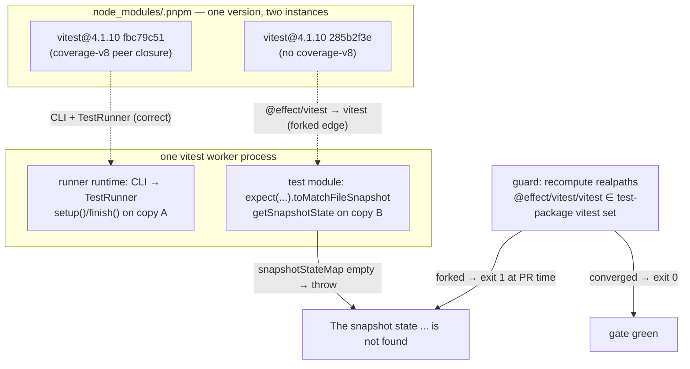

# One vitest instance per install — fix issue #304 at the resolution layer

## Goal Capsule

- **Objective:** Every workspace test run executes against exactly one physical `vitest` copy, so vitest's per-copy state machinery (snapshot state first) works for every test the tree ships, and any change that forks the copy fails the gate at PR time instead of failing tests in ways that look like flakiness.
- **Means:** A recomputing guard gate over the installed tree's resolution graph, plus the durable root-cause record (KTD2). Remediation of already-forked installs is `pnpm dedupe` (KTD3).
- **Authority:** Issue #304 (origin, user-authored boundaries); session directives: kill the read-and-compare workaround, fix the systemic rot; root `AGENTS.md` (REPO-D1/D2, REPO-W8, Surface Classes); `CONSTITUTION.md` (CONST-S4).
- **Stop conditions:** A unit whose verification gate fails after one evidence-carrying re-dispatch; guard selftest cannot be made both red and green on synthetic fixtures; upstream vitest behavior contradicts the measured lifecycle (then re-plan, do not patch over it).
- **Execution profile:** `ce-work` pipeline via `lfg`; two units; guard commit isolated (Evaluator surface class).
- **Tail ownership:** `lfg` owns simplify → review → commit → PR → CI babysit after `ce-work` returns.

---

## Product Contract

### Summary

Issue #304's snapshot failures are not a vitest bug in this tree's usage and not an Effect scheduling bug. They are a dependency-resolution defect: pnpm's peer resolution forked `vitest@4.1.10` into multiple physical copies, and `@effect/vitest` (reached through `@systemfsoftware/effect-gherkin-spec`) loaded a different copy than the runner. vitest's `SnapshotClient` is a per-copy module-global; the runner set up copy A, the matcher read copy B, and copy B throws `The snapshot state ... is not found`. The fix makes the single-copy invariant mechanical: a guard gate that fails any install where the `@effect/vitest`-loaded vitest is not an instance the workspace's test packages themselves resolve, plus the measured remediation (`pnpm dedupe`) documented for trees that already forked.

### Problem Frame

PR #303 (remove-babel) regenerated the lockfile after deleting `@babel/*`. The regeneration flipped an unconstrained pnpm resolution: `@effect/vitest`'s internal `vitest` dependency moved from the coverage-v8 peer instance to a no-coverage-v8 instance. Trunk stayed converged and green; the branch red. The failure presented as "FalseCJS deterministically, others flaky, 15 of 16 pass" — a shape that reads as a timing race and was worked around (commit `ea59847`) with a plain read-and-compare that also dropped the CI-mode refusal to auto-create snapshots. The workaround treats the symptom in one file; the class survives: any test in any package using vitest state-backed machinery under the gherkin runner breaks the same way the next time a lockfile regeneration forks the instance.

Measured root cause, this session (branch `gh-304-diag`, workaround reverted, `SnapshotClient` prototype instrumented):

- `setup()` ran in the worker from `node_modules/.pnpm/vitest@4.1.10_..._fbc79c51.../dist/chunks/test.DNmyFkvJ.js` (TestRunner.onBeforeRunSuite).
- The matcher's `getSnapshotState` threw from `node_modules/.pnpm/vitest@4.1.10_..._285b2f3e.../dist/chunks/test.DNmyFkvJ.js` (toMatchFileSnapshotImpl) — a second physical copy, whose `getSnapshotClient()` singleton was never set up.
- `packages/testing/specs/gherkin/effect` resolves `@effect/vitest` to `.pnpm/@effect+vitest@4.0.0-rc.112_..._vitest@4.1.10`, whose nested `vitest` symlink points at the `285b2f3e` copy; the analysis package's own `vitest` symlink points at `fbc79c51`.
- In `pnpm-lock.yaml`, the `@effect/vitest@4.0.0-rc.112(effect@4.0.0-rc.112)(vitest@4.1.10)` block resolves `vitest` to the coverage-v8 instance on `main` and to the no-coverage-v8 instance on `remove-babel` — the whole delta.
- `pnpm dedupe` on the forked tree re-pointed the block to the coverage-v8 instance; the previously failing file passed 16/16 three consecutive runs.
- `@vitest/snapshot` lifecycle (read from installed 4.1.10 dist): `snapshotStateMap` keyed by filepath; `setup()` at `onBeforeRunSuite`; `finish()` deletes at `onAfterRunSuite`; `clear()` at `onAfterRunFiles`; `toMatchFileSnapshotImpl` reads state synchronously at `expect()`-call time. With one copy, the awaited chain cannot lose state — the two-copy install is the only measured way to produce the error.

Upstream corroborates the constraint: vitest-dev/vitest #7430, #7668, #6494, and PR #8622 ("Vitest expects to be loaded only once at runtime").

### Requirements

Behavior on trunk (the fix branch):

- R1. `CI=true pnpm --filter @systemfsoftware/arethetypeswrong exec vitest run tests/snapshots.integration.test.ts` exits 0 with all 16 recipes asserting through `toMatchFileSnapshot` (state-backed), on the fix branch. Gate: the command, run in this session's transcript.
- R2. No scenario is removed, skipped, or moved off the shared runner: the test file's scenario count stays 16 including the AE7 kind-coverage scenario, and its matcher calls stay `toMatchFileSnapshot`. Gate: `git diff` over the test file on the fix branch is empty.
- R3. The CI-mode guardrail holds: with `analysis/tests/__fixtures__/snapshots/FalseCJS.json` deleted and `CI=true`, the suite fails rather than silently rewriting. Measured this session (snapshot mismatch, no rewrite); re-run as evidence on the fix branch.
- R4. The read-and-compare workaround does not exist on trunk and is not reintroduced: `git grep -nI -e 'read-and-compare' -- packages` prints nothing relevant to the snapshots test, and `ea59847` remains only on `remove-babel`.

Invariant enforcement (the systemic fix):

- R5. A guard gate recomputes the install's resolution graph and exits non-zero when the invariant breaks. The invariant is per-package equality: for every test-chain package that resolves `@effect/vitest`, the realpath of `@effect/vitest`'s nested `vitest` must equal the realpath of that package's own runnable `vitest`. Union membership across packages is insufficient — it passes a cross-package fork where package A's runner and package B's own vitest are different copies. Gate (all must hold): the guard's `--selftest` over synthetic converged/forked/unrecognized-layout fixtures requires pass/fail/loud-fail respectively; the guard run against the `gh-304-diag` worktree at its pre-dedupe commit exits 1; the selftest runs as a `check:ci` direct step so a guard that can no longer fail a forked fixture turns CI red (CHK1: the gate reads realpaths it recomputes, and the selftest proves it can fail).
- R6. The guard runs in the repo's check chain so a PR that forks the instance fails the gate — the remove-babel shape is caught at PR time, not in a test lane. Gate: the guard step and its selftest step appear in the direct step lists that both `pnpm check:ci` and `pnpm check:local` execute, verified by running both chains' entry points.
- R7. The guard's own commit is isolated from the work it judges, and the gate is observed red on a forked fixture before green on trunk's tree (Evaluator surface class, root `AGENTS.md`).

Durable record:

- R8. The convicted layer and evidence are durable in this repo: a `docs/solutions/` entry states the mechanism (per-copy singleton, peer-instance fork, resolution flip), the measured trace, the remediation, and the upstream links.
- R9. The minimal repro is published: branch `gh-304-diag` (matcher restored, lifecycle instrumentation, pre-dedupe lockfile) — CI on that branch fails the snapshot scenario, demonstrating the defect without the fix; the branch body states that a repo-independent repro cannot exist because the defect is a property of the installed tree, not of source code.

### Scope Boundaries

- In scope: the guard script and its chain wiring; the solutions entry; publication of the repro branch and the issue closeout comment.
- Out of scope (non-goals from the issue, preserved): keeping or extending the read-and-compare workaround; deleting, skipping, or special-casing the FalseCJS scenario; restoring matchers for only the passing recipes; patching `SnapshotClient` internals or vitest dist from this repo.
- Deferred to follow-up work:
  - Filing a new issue on the vitest repository — requires user consent per issue #304's boundary (existing upstream issues are linked, not re-filed).
  - Executing the remediation on PR #303 (rebase, `pnpm dedupe`, drop `ea59847`) — that branch's own flow; this work documents the exact steps in the issue comment.

---

## Planning Contract

### Key Technical Decisions

- KTD1. The fix lives in the convicted layer — the install's resolution invariant — not in the test file and not in framework code. The test file on trunk already asserts all 16 recipes through `toMatchFileSnapshot`; it stays untouched. Structural convergence was rejected as infeasible, not merely unchosen: the `@effect/vitest@4.0.0-rc.112(effect@4.0.0-rc.112)(vitest@4.1.10)` parent key carries no optional-peer information, and importer declarations do not decide the nested edge — `packages/core/effect/atom/atom-react` declares `@vitest/coverage-istanbul` yet its vitest resolves to the coverage-v8 instance — so no declaration or override can pin which physical copy `@effect/vitest` loads. The guard is the only available mechanism. (session-settled: user-directed — chosen over keeping or extending the read-and-compare workaround: the user called that workaround a hack and demanded a non-hack fix, total rehaul permitted.)
- KTD2. The invariant is enforced by a guard gate that recomputes realpaths from the installed tree, never by prose. The invariant is per-package equality: for each test-chain package resolving `@effect/vitest`, the realpath of `@effect/vitest`'s nested `vitest` must equal that package's own runnable `vitest` realpath. Union membership across packages is rejected — it passes a cross-package fork. A whole-tree instance count is also rejected: the second `vitest@4.1.10` instance on trunk is third-party transitive state — the `esbuild@0.27.7` pin under `@storybook/addon-vitest`/`@storybook/react-vite`, not a workspace declaration — so a count would red a green tree, and a future storybook major dropping that pin must read as convergence, not a new fork. The edge keyed on `@effect/vitest` is what the failure actually rode.
- KTD4. Upstream vitest issues are linked, not filed. (session-settled: user-directed — chosen over autonomously filing a vitest issue: issue #304's boundary requires asking before public upstream communication.)
- KTD5. The repro is a published branch with `SnapshotClient` lifecycle instrumentation, not a permanent test. A permanent test cannot fork the install without mutating developer `node_modules`; the defect exists only in the installed tree, so no repo-independent repro can exist — stated plainly per the issue's acceptance criteria. Rejected alternative: a self-forking test (mutates the environment it runs in — destructive to the dev install).

### High-Level Technical Design

The guard does not fix a forked tree — it makes the fork visible at the gate. The repair is `pnpm dedupe` (KTD3), which pnpm applies to the lockfile; the guard then proves convergence.

### Assumptions

- The `@effect/vitest` nested-`vitest` realpath edge is a faithful proxy for the runtime failure. Grounds: the measured trace above. The guard is lockfile-anchored, not pnpm-version-anchored: it reads the `@effect/vitest → vitest` child declared in `pnpm-lock.yaml` and realpaths that node, so an identical lockfile resolves identically on developer machines and CI (both install with the `packageManager`-pinned pnpm). A check:local/check:ci divergence under an identical lockfile is a pnpm mismatch, and the resolution is the pinned corepack pnpm.
- An unrecognized `@effect/vitest` layout (vendored vitest, missing nested symlink) fails LOUD with a re-derive-the-invariant message — never silent pass-through in either direction. A disappearing or extra non-edge instance in the store is not a fork and must not fail; only an edge mismatch does.

### Sources

- Measured this session: SNAPTRACE instrumentation output (branch `gh-304-diag`, file `analysis/tests/snapshot-trace.setup.ts`), lockfile blocks for `@effect/vitest@4.0.0-rc.112(effect@4.0.0-rc.112)(vitest@4.1.10)` on `main` vs `remove-babel`, dedupe convergence run, 3× green re-run, fixture-deletion guardrail run.
- Upstream: vitest-dev/vitest issues #7430, #7668, #6494; PR #8622 ("Vitest expects to be loaded only once at runtime").
- Installed-source lifecycle: `@vitest/snapshot` 4.1.10 `dist/index.js` (`SnapshotClient`, lines ~920-950); vitest 4.1.10 `dist/chunks/test.DNmyFkvJ.js` (`getSnapshotClient`, `TestRunner` hooks, `toMatchFileSnapshotImpl`).

---

## System-Wide Impact

The guard joins the `check:ci` and `check:local` **direct step lists** in the root `package.json` — the same place `check-forbidden-lines` and `check-stryker-mutate-scope` run, outside turbo. It must never become a `//#check:*` turbo task: those are cache-keyed on file inputs, `node_modules/.pnpm` is not an input, and a cache hit would skip the resolution read — silently defeating the gate.

The guard is intentionally uncacheable and runs after every install, on every PR (the gate job installs with a frozen lockfile before `check:ci`, and the CI runner carries the Deno the guards' shebangs use). Cost is sub-second realpath reads over the store and one lockfile parse — a small constant added to every gate run, the accepted price of a mechanical invariant.

Maintainability contract: the guard is a canary, not a policy. When it trips, the fix is `pnpm dedupe` or a reviewed lockfile regeneration — not a guard edit. Re-run its `--selftest` whenever the vitest catalog version or `@effect/vitest` changes, and treat an unrecognized-layout loud-fail as a re-derive-the-invariant task against the new layout, owned by whoever changes that dependency.

---
## Implementation Units

### U1. Single-vitest guard gate in the check chain

- **Goal:** A gate that fails any install where `@effect/vitest`'s resolved `vitest` is not the same physical copy a test-chain package itself runs — making the issue-#304 shape impossible to merge silently.
- **Requirements:** R5, R6, R7.
- **Dependencies:** none.
- **Files:** `scripts/guards/check-single-vitest.ts` (new); the direct guard steps in the root `package.json` `check:ci` and `check:local` scripts — the same list that runs `check-forbidden-lines` and `check-stryker-mutate-scope` outside turbo; the script carries its own `--selftest`, following the guard-test precedent.
- **Approach:**
  - Enumerate the test-chain set by a pinned rule, not a hand list: every workspace package whose transitive workspace-manifest closure (walking `workspace:` links to fixpoint) reaches `@effect/vitest`, either by declaring it or by declaring a package that re-exports it. Each package contributes the realpath of its own resolvable `vitest`; a transitive-only consumer (no own vitest declaration) contributes the vitest its link chain resolves.
  - The invariant check is per-package equality (KTD2), never set membership.
  - Anchor on the lockfile: read the `@effect/vitest → vitest` child declared in `pnpm-lock.yaml`, then realpath that node under `node_modules/.pnpm` — identical lockfiles resolve identically locally and in CI.
  - Fail (exit 1) only on an edge mismatch: an `@effect/vitest` nested vitest realpath that differs from a test-chain package's own vitest. Treat extra non-edge instances in the store (storybook's `esbuild@0.27.7` variant), or a package dropping out of the test chain, as non-forks — no failure. An unrecognized `@effect/vitest` layout fails LOUD with a re-derive message.
  - `--selftest`: the guard takes an explicit tree root (default repo root) and reads `<root>/pnpm-lock.yaml` plus `<root>/node_modules/.pnpm`; the selftest builds a temp dir per fixture — synthetic `pnpm-lock.yaml` (converged; forked child; no nested vitest) plus matching `.pnpm` dirs with real symlinks — and invokes the guard's exported verdict function against that root, requiring pass, fail, and loud-fail.
  - `check:ci` gains a direct step running the guard's `--selftest` after the frozen install, mirroring the `check-changeset` CI-side selftest precedent, so a guard that can no longer fail turns CI red.
  - Own commit, isolated from any other change in this plan (Evaluator surface class).
- **Patterns to follow:** `scripts/guards/check-forbidden-lines.ts` and `scripts/guards/check-stryker-mutate-scope.ts` — both carry a `--selftest` arm over planted fixture data; model the selftest on `check-stryker-mutate-scope.ts`'s fixture matrix.
- **Test scenarios:**
  - Selftest converged fixture: `@effect/vitest` nested vitest realpath equals the test-chain package's own vitest realpath → exit 0.
  - Selftest forked fixture: nested realpath differs from the package's own vitest → exit 1.
  - Selftest cross-package shape: two test-chain packages on different vitest copies, each internally consistent → exit 0 (per-package equality, not union).
  - Selftest non-fork noise: extra unrelated vitest instance in the store, test chain unchanged → exit 0.
  - Selftest unrecognized layout: `@effect/vitest` dir without a nested vitest node → exit 1 with the re-derive message.
  - Real tree: guard exits 0 on trunk's install.
  - Real forked tree: guard exits 1 against the `gh-304-diag` worktree at its pre-dedupe commit.
- **Verification:** selftest exits 0 (proving every arm); guard exits 0 on trunk; guard exits 1 on the pre-dedupe `gh-304-diag` worktree; both check chains' direct step lists run the guard and its selftest step.

### U2. Durable record, repro publication, and issue closeout

- **Goal:** The root cause, evidence, and remediation outlive the session and reach the audiences that need them: the repo's learning corpus, the repro branch on the remote, and issue #304's thread.
- **Requirements:** R8, R9, and the documentation half of R3 (the recorded evidence for the guardrail run).
- **Dependencies:** U1 (the solutions entry references the guard; the closeout cites its verification).
- **Files:** `docs/solutions/integration-issues/duplicate-vitest-instances-break-snapshot-state.md` (new; frontmatter per corpus convention); pushed branch `gh-304-diag` (already built locally: matcher restored, `SNAPTRACE` setup, pre-dedupe lockfile); issue #304 comment via the session's GitHub tooling.
- **Approach:**
  - Solutions entry: mechanism (per-copy `SnapshotClient`, peer-instance fork, what flipped), the measured trace, why trunk stayed green, `pnpm dedupe` as the repair, the guard as the gate, upstream links. Problem-type `integration_issue`; keep it to the durable mechanism, not the session narrative.
  - Push `gh-304-diag` as-is (pre-dedupe lockfile); its CI failing the snapshot scenario is the published demonstration. Name the expectation in the issue comment so the red X reads as the repro, not as breakage.
  - Issue comment: convicted layer, the two-instance evidence, remediation steps for PR #303 (rebase, `pnpm dedupe`, drop `ea59847`, restore `toMatchFileSnapshot`), upstream links, and the guard's coverage of the acceptance criteria (state-backed matcher count, scenario count, CI-mode guardrail, repro, conviction). No new upstream filing (KTD4).
- **Patterns to follow:** existing `docs/solutions/` frontmatter and voice (`docs/solutions/logic-errors/`, `docs/solutions/integration-issues/`).
- **Test scenarios:**
  - The solutions entry renders with valid frontmatter and cites only paths and facts recorded this session.
  - `gh-304-diag` is pushed and its head CI run reproduces the snapshot failure (or, if CI is skipped on a branch without a PR, the local pre-dedupe red run is cited in the comment as the demonstration).
  - The issue comment posts successfully and names every acceptance criterion with its disposition.
- **Verification:** solutions doc exists with correct frontmatter; branch pushed; comment posted; `pnpm check:local` exits 0 after the last edit (REPO-D1).
---

## Verification Contract

| Gate                            | Command / check                                                                                                                           | Proves  |
| ------------------------------- | ----------------------------------------------------------------------------------------------------------------------------------------- | ------- |
| Goal command                    | `CI=true pnpm --filter @systemfsoftware/arethetypeswrong exec vitest run tests/snapshots.integration.test.ts` → 16/16 pass                | R1      |
| Scenario + matcher preservation | `git diff --exit-code -- packages/testing/type-testing/arethetypeswrong/analysis/tests/snapshots.integration.test.ts`                     | R2      |
| CI-mode guardrail               | delete `FalseCJS.json`, `CI=true` run fails with snapshot mismatch, restore                                                               | R3      |
| Workaround absence              | `git grep -nI -e 'read-and-compare' -- packages/testing/type-testing/arethetypeswrong/analysis/tests` prints nothing                      | R4      |
| Guard selftest                  | `scripts/guards/check-single-vitest.ts --selftest` → exit 0                                                                               | R5      |
| Guard on forked tree            | guard run against `gh-304-diag` pre-dedupe worktree → exit 1                                                                              | R5, R7  |
| Chain wiring                    | both `pnpm check:ci` and `pnpm check:local` direct step lists name the guard and its selftest step, verified by running both entry points | R6      |
| Whole-tree gate                 | `pnpm check:local` after the last edit                                                                                                    | REPO-D1 |
| CI                              | PR watched to green via `run_watch`                                                                                                       | REPO-D2 |

Mutation scoring is read from the CI Mutation workflow's merged report and is advisory; no agent starts a local mutation run (REPO-D3).

---

## Definition of Done

- Global: R1–R9 each hold with their named gate run in this session's transcript; `pnpm check:local` exits 0 after the final edit; branch pushed and PR opened, watched to CI-decided (REPO-D1/D2); merging stays human (REPO-P1). Issue #304's acceptance criteria are each addressed in the closeout comment with the evidence named above.
- Per unit: each unit's Verification line exits 0 on the tree as it stood at that unit's completion.
- Cleanup: no instrumentation (`SNAPTRACE` setup file, `setupFiles` wiring) lands on the fix branch or trunk; the diagnostic artifacts live only on `gh-304-diag`; no abandoned guard experiments remain in the diff.
