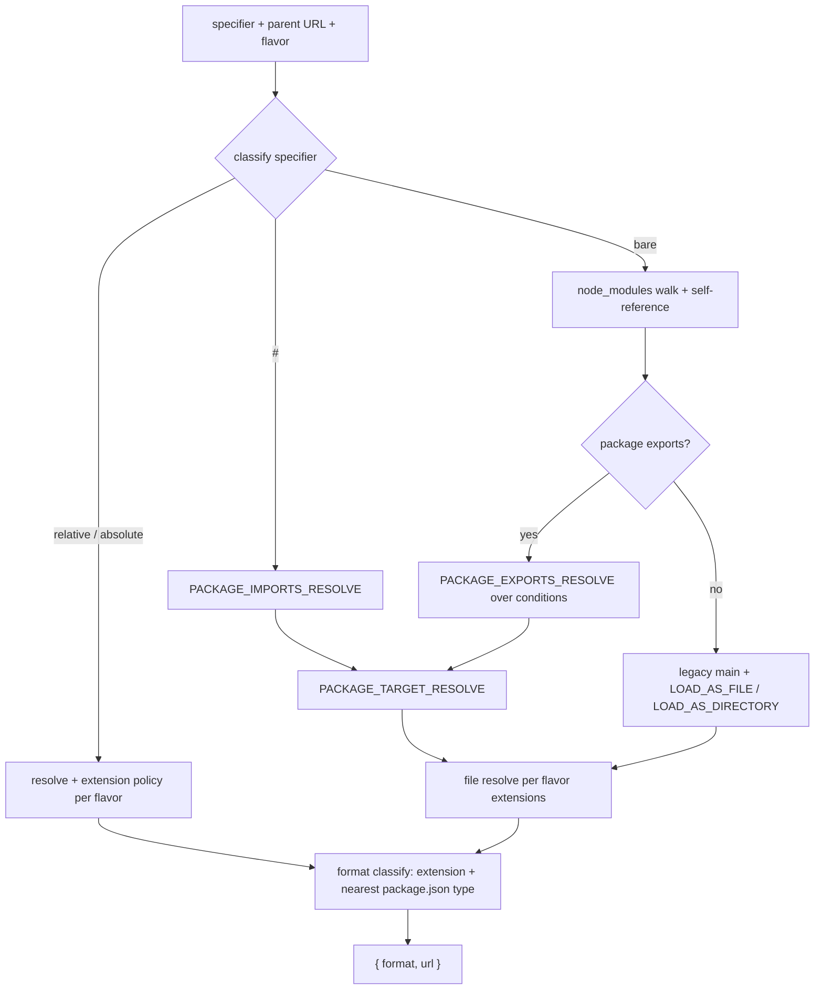

## Goal Capsule

- **Objective:** the published `@systemfsoftware/arethetypeswrong` engine runs with zero third-party runtime dependencies — resolving entrypoints, detecting CJS named exports, classifying version specs, and validating package names all use first-party or workspace-provided code — while every check produces the same problem kinds and verdicts on the same inputs.
- **Means:** version classification moves to `@std/semver`; the package-name validator, the CJS export-binding detector, and the module resolver are replaced by first-party implementations matching the contracts the engine currently consumes.
- **Product authority:** user instruction to remove the four third-party runtime deps (`semver`, `validate-npm-package-name`, `cjs-module-lexer`, `@loaderkit/resolve`) from the analysis package; later directed that the two algorithm packages be completely rewritten — no forks, no vendored adoption, no native bindings.
- **Open blockers:** none.

## Product Contract

_Product Contract preservation: no scope change — R1 clarified to exclude the deliberately-pinned `typescript` compiler (the product authority names exactly four deps); Outstanding Questions OQ1–OQ3 resolved into the Planning Contract during enrichment._

### Summary

The analysis engine ships with zero third-party runtime dependencies: `semver` → `@std/semver`, and the package-name validator, CJS export-binding detector, and module resolver become first-party code that matches the current contracts, verified by a parity harness and the existing recipe corpus.

### Problem Frame

The engine is published (`publishConfig.access: public`) and externalizes exactly four runtime deps via `deps.neverBundle` (`tsdown.config.ts:39-46`), so every adopter of `@systemfsoftware/arethetypeswrong` installs four third-party packages to run one validation tool. Two of the four are single-publisher algorithm packages.

Replacing them is not the usual dependency swap, for a reason the ecosystem survey made concrete. Resolution and CJS export detection are _behavioral contracts with Node's runtime semantics_: `cjs-module-lexer` is the ecosystem's standard because Node's own ESM↔CJS interop reads its output, and the in-tree evidence (`repos/oxc/crates/oxc_codegen/src/cjs_module_lexer.rs`) shows oxc patching its own minifier _around_ the lexer's detection grammar rather than replacing it — a missed syntax shape silently drops exports at runtime. Upstream attw and this engine's core pin TypeScript 6.x because only the JS compiler reproduces its own resolution semantics (`docs/solutions/tooling-decisions/arethetypeswrong-core-requires-js-typescript-api.md`); the same fidelity concern applies to runtime resolution in node10/node16/bundler modes.

The alternatives were examined and rejected in dialogue: fork-and-own, keeping the packages externalized, and a native oxc-resolver swap (which would materialize the in-memory package to disk and add 20 platform binding packages). The directive is first-party rewrite, so the plan's job is to pin fidelity with fixtures: a parity harness during development, and a resolution/binding corpus covering the hard cases. The consumed surface is small — resolution returns `{ format, url }`, bindings return `{ exports, reexports }` — which bounds the rewrite but not its subtlety.

### Requirements

**Elimination**

- R1. The published `@systemfsoftware/arethetypeswrong` tarball declares no runtime dependency outside the workspace except the deliberately-pinned `typescript` compiler (`catalog:attw`), and every runtime import in the emitted `dist` resolves to workspace code or to `@std/semver` inlined into the bundle.
- R2. `semver` leaves the workspace resolution graph: no workspace package manifest declares it, and the vestigial `catalogs.stryker` entry (`pnpm-workspace.yaml:73`, no consumer today) is deleted.
- R3. The dead duplicate `parsePackageSpec` in `packages/testing/type-testing/arethetypeswrong/analysis/src/Utils.ts` is deleted with the `semver` and `validate-npm-package-name` imports only it consumes; the file's live helpers and their importers are unchanged.

**Replacements**

- R4. Package-spec version classification moves to `@std/semver` via the workspace catalog (`jsr:` protocol, matching the `@std/jsonc`/`@std/toml` pattern): exact-version and range classification in the spec parser, and range-to-version selection over the deprecation-filtered candidate list in the package store, keep their observable behavior.
- R5. Package-spec name validation is reimplemented first-party, preserving the current acceptance boundary exactly: only the conditions that make `validate-npm-package-name`'s `errors` non-empty block a spec; warned-but-valid old-style names (e.g. uppercase) keep passing.
- R6. The CJS export-binding detector is reimplemented first-party, producing `{ exports, reexports }` from CJS source and matching `cjs-module-lexer`'s output on the package's recipe corpus and the differential lock (hosts current behavior; the ESM-side walker `getEsmModuleBindings` is already first-party).
- R7. The module resolver is reimplemented first-party for the two flavors the walkers consume — `cjs` (conditions `node, require, module-sync`; extensions `.js/.json/.node`; exports-honoring with legacy main/index fallback) and `esm` (conditions `node, import`; exports-honoring, encapsulated) — returning `{ format, url }` over the in-memory `Package` through the existing file-system-adapter shape; no package content is materialized to disk. node10/bundler mode emulation lives in the TypeScript pipeline (`ts.resolveModuleName` in MultiCompilerHost/GetEntrypointInfo) and is untouched by this rewrite.
- R8. The four deps are removed from the manifest and from `deps.neverBundle` as their replacements land; no straggling reference to any of them remains in the package's source or config.

**Behavior and verification**

- R9. The existing integration suites stay green after each replacement lands — entrypoint-info, check-package (recipes corpus), adapters, package-tree, types-companion — and `pnpm check:local` is green after the last edit.
- R10. The hard resolution and binding cases are pinned as fixtures with or before their rewrite: exports-map condition precedence (`import`/`require`/`default` and custom conditions), subpath patterns, `main`/index field fallbacks, package.json `type`-format classification, self-reference, and CJS transpiler export shapes (TypeScript/Babel/Rollup/esbuild output).
- R11. The range-to-tarball selection contract gains a direct test observer as part of the `semver` migration (`PackageStoreLive`'s `maxSatisfying` path has no test today).
- R12. Resolution-trace and snapshot churn caused by the engine swap is deliberate: snapshots regenerate as part of the change, and churn beyond the pinned seed (compiler-version strings, paths) is reviewed, never silently accepted.
- R13. Changeset intents accompany every publishable package whose turbo build hash moves, per the turbo-hash gate.

### Key Decisions

- KD1. **Completely rewrite `cjs-module-lexer` and `@loaderkit/resolve` first-party; no fork, no vendored adoption, no native binding.** _(session-settled: user-directed — chosen over fork-and-own, keeping them external, and the oxc-resolver native swap: the user rejected third-party code under any name and directed a full rewrite.)_ Governs R6, R7.
- KD2. **`@std/semver` over hand-rolling semver.** Std is Deno's port of node-semver, vendored in-tree (`repos/deno-std/semver/mod.ts:8` "Adapted directly from semver") and tested against node-semver's own commit-pinned fixtures; the OP9 ladder prefers `@std/*`. _(session-settled: user-directed — the user's opening asked for a built-in replacement and the `@std/semver` path was presented and confirmed.)_ Governs R4.
- KD3. **Preserve the current name-validation acceptance boundary.** Only `errors` blocks a spec today; this change must not silently tighten validation. Governs R5.
- KD4. **Fidelity is pinned by fixtures and a differential lock, not by trust in the first-party implementation.** During the rewrite, run old and new engines over the same fixtures and ship only on agreement, with the old engine's verdicts as the baseline where resolver and Node disagree. Governs R6, R7, R10.
- KD5. **Resolution stays over the in-memory file map.** The `Package` model and the adapter shape are preserved, so no I/O enters the pure core and trace paths stay stable. Governs R7.

### Key Flows

Omitted: this is a dependency-replacement change with fixed observable behavior — no multi-step user-facing flow exists to specify, and Requirements, Acceptance Examples, and Scope Boundaries prevent downstream path invention.

### Acceptance Examples

- AE1. **Covers R4, R11. Range spec with deprecation filter** — Given a packument with versions `1.2.0` and `1.2.1` (deprecated), spec `foo@^1.2.0`, `allowDeprecated: false`; when the package store selects the tarball; then `1.2.0`'s tarball ref returns.
- AE2. **Covers R5. Name acceptance boundary** — Given spec `Foo@1.0.0`; when parsed; then it succeeds (uppercase is warning-only today). Given spec `foo bar@1.0.0`; when parsed; then it fails with the package-spec parse error.
- AE3. **Covers R6. CJS binding detection** — Given a CJS source `module.exports = { a, b }; exports.c = 1;`; when bindings are read; then exports are `["a", "b", "c"]` plus reexports as detected. Given a TypeScript-transpiled facade (`__esModule` + `exports.foo = …`); then `foo` is detected.
- AE4. **Covers R7. Condition precedence** — Given `exports: { ".": { "import": "./esm.mjs", "require": "./cjs.cjs", "default": "./fallback.js" } }`; when resolved in node16-ESM mode via an import; then `./esm.mjs` with `format: "module"`. When resolved in node16-CJS mode via a require; then `./cjs.cjs` with `format: "commonjs"`.
- AE5. **Covers R10. Legacy field fallbacks** — Given no `exports` map and `main: "./dist/index.js"`; when resolved through the cjs flavor; then `./dist/index.js` resolves via the main/index directory walk; and with no `main`, `index.js` is the fallback.

### Scope Boundaries

- **Fork-and-own of either algorithm package** — rejected in dialogue; third-party code does not survive under a workspace name.
- **The oxc-resolver native swap** — rejected in dialogue; it would materialize packages to disk and add 20 platform binding packages.
- **Keeping either package externalized with a decision record** — rejected; the directive is zero third-party deps.
- **attw check-semantics changes** — out of scope: the `ProblemKind` set, check outcomes, and resolution traces stay as they are; this change touches no check.
- **The stryker forks' remaining third-party deps** (Babel stack etc.) — a separate workstream; only the `catalogs.stryker` `semver` entry falls in scope (R2).
- **Vendored `repos/` trees** — read-only reference (REPO-S3), untouched.

### Dependencies / Assumptions

- A. `@std/semver` consumed through the pnpm catalog's `jsr:` protocol works in Node/pnpm packages exactly as `@std/jsonc` does today (`pnpm-workspace.yaml:32-34`; consumers `stryker-js/platform-node/package.json:40`, `omp/packages/harness-toml/package.json:45`).
- A. The differential lock is development-only: it runs old and new engines over the same fixtures during the rewrite and is never shipped.
- A. Where the old resolver and Node's runtime disagree, the old engine's verdict is the baseline for the lock — parity with current behavior comes first, Node fidelity second.
- A. The recipes corpus (`packages/testing/type-testing/arethetypeswrong/recipes`) is a sufficient behavioral oracle for the rewrite; fixture additions (R10) close the gaps the corpus does not cover.

### Sources / Research

- `docs/solutions/tooling-decisions/arethetypeswrong-core-requires-js-typescript-api.md` — TS 6.x pin rationale; resolution-behavior fidelity; upstream attw pins `5.6.1-rc` for the same reason.
- `repos/oxc/crates/oxc_codegen/src/cjs_module_lexer.rs` — in-tree evidence of lexer-fidelity traps (missed syntax silently drops exports at runtime).
- `repos/deno-std/semver/` — vendored `@std/semver` source; tests copied from node-semver fixtures commit-pinned.
- `docs/plans/2026-08-23-001-sever-strykerjs-org-dependencies-plan.md` — the fork scaffold that was considered and rejected here.
- Consumption surfaces (verified this session): `internal/esm/Resolve.ts:6-26`, `internal/esm/CjsBindings.ts:1-7`, `internal/esm/EsmBindings.ts:1-67`, `internal/esm/CjsNamespace.ts:1-27`, `internal/esm/EsmNamespace.ts:1-29`, `PackageSpec.ts:1-38`, `PackageStoreAdapter.ts:64-111`, `Utils.ts:1-2,101`.
- Registry metadata (this session): `cjs-module-lexer` installed at 1.4.3 (lockfile-resolved from `^1.2.3`; Node.js Foundation org, zero deps; registry-current 2.2.1), `@loaderkit/resolve@1.0.6` + `@braidai/lang@1.1.2` (zero-dep util), `validate-npm-package-name` installed at 5.0.1 (registry-current 8.0.0: different ruleset, Node ≥22.22 engines).
- `nodejs.org/api/esm.html`, `nodejs.org/api/modules.html`, `nodejs.org/api/packages.html` (Node 26 docs) — resolution algorithm skeleton: ESM_RESOLVE, PACKAGE_EXPORTS_RESOLVE, PATTERN_KEY_COMPARE, PACKAGE_TARGET_RESOLVE, LOAD_AS_FILE/LOAD_AS_DIRECTORY, ESM_FILE_FORMAT.
- `github.com/nodejs/cjs-module-lexer` README — the frozen detection grammar and its explicit non-detection list; the parity baseline is the lockfile-resolved 1.4.3.

---

## Planning Contract

### Key Technical Decisions

- KTD1. `@std/semver` ships as a devDependency inlined by tsdown (`noExternal` + `inlinedDependencies`), never a runtime dep and never in `deps.neverBundle`. A `jsr:` specifier publishes as `npm:@jsr/std__*`, installable only from npm.jsr.io, so a published tarball depending on one is uninstallable for default-registry consumers — measured and verified by tarball install in `packages/testing/mutation/stryker-js/typescript-checker/tsdown.config.ts:9-13`. Inherits KD2. Governs R4, R1.
- KTD2. The name validator, CJS detector, and resolver land as `*.kernel.ts` modules per the cell doctrine (`packages/core/effect/cell/types/README.md`: never-channel decisions move to kernels, not `Workflow.make`). The validator and detector are total; the resolver kernel keeps the old adapter's thrown-error failure contract — walkers catch it (`CjsNamespace.ts:26`) or propagate it (`EsmNamespace.ts:17`) — and the rewire preserves exactly that contract. Governs R5, R6, R7.
- KTD3. One resolver core, two flavors with the old engine's actual defaults — not the Node-doc mode matrix. `cjs` flavor: conditions `['node','require','module-sync']`, extensions `.js/.json/.node`, exports-honoring with LOAD_AS_FILE/LOAD_AS_DIRECTORY fallback. `esm` flavor: conditions `['node','import']`, exports encapsulated — with one verified exception: exports-less packages that are not `"type": "module"` fall back to legacy main/index/loadIndex (read from the installed `@loaderkit/resolve/esm` dist). Shared machinery (PACKAGE_EXPORTS_RESOLVE, PATTERN_KEY_COMPARE longest-prefix rule, PACKAGE_TARGET_RESOLVE — nodejs.org/api/esm.html) serves both. node10/bundler mode emulation is the TypeScript pipeline's job (`MultiCompilerHost.ts:53-56`, `GetEntrypointInfo.ts:160-163`) and is out of scope — building it would be unconsumed surface (CONST-S3) with no old baseline for the lock to arbitrate. Governs R7.
- KTD4. The CJS detector is a token-stream scanner implementing the frozen cjs-module-lexer grammar — exports member/literal assignment, defineProperty value and getter forms, object literal with require spread, `__exportStar`/tslib variants, the `Object.keys(...).forEach` filter matched by variable identity, last `module.exports = require()` winning by parse order — not a TS-AST walk. AST analysis over- and under-detects relative to the lexer's parse-order contract, and parity is the bar (KD4). Governs R6.
- KTD5. Differential lock at the function boundary: the harness (tests only) imports the old implementation directly — `@loaderkit/resolve` subpaths, `cjs-module-lexer` `parse`, `validate-npm-package-name`, npm `semver`, while each remains installed — and the new kernel, over the same fixtures. Agreement is required; the old verdicts are baseline where the Node spec and the old engine disagree. Failure agreement compares throw-vs-return shape, never error messages (messages are a guaranteed diff). The callsite flips once per engine swap; no env-keyed switch or source seam ships. Harness and old deps are deleted in U7. Governs R4, R5, R6, R7, R10, R12.

### High-Level Technical Design

| Flavor | Conditions                 | Exports map               | Legacy main/index | Extensions / dir imports |
| ------ | -------------------------- | ------------------------- | ----------------- | ------------------------ |
| cjs    | node, require, module-sync | honored + legacy fallback | yes (fallback)    | allowed                  |
| esm    | node, import               | honored, encapsulated     | no                | forbidden                |

node10/bundler mode emulation stays in the TypeScript pipeline, outside this rewrite.

### Assumptions

- `minimumReleaseAge: 1440` (`pnpm-workspace.yaml:85`) applies to the new `@std/semver` catalog entry; pin a version at least 24 hours old.
- The package manifest consumes `@std/semver` through `catalog:`; test fixtures import the bare name, never a hand-pinned version — a fixture pin duplicates the catalog decision and drifts (`docs/solutions/test-failures/fixture-pin-duplicates-the-catalogs-decision.md`).
- Run `pnpm why vitest` before trusting snapshot churn; this package is the documented site of the two-vitest-copies snapshot fork (`docs/solutions/tooling-decisions/one-vitest-instance-per-test-chain.md`).
- New fixtures assert schema-keyed problem kinds, never bare non-throwing (`docs/solutions/tooling-decisions/attw-in-memory-fixture-dsl.md`).
- The CJS grammar parity baseline is the lockfile-resolved `cjs-module-lexer@1.4.3`; the upstream README grammar is version-frozen, but the installed version is what parity is measured against.
- Kernels land outside the base stryker `*.workflow.ts` mutate glob; if this package's stryker config opts into the contribution plugin, add property tests for the pattern-compare and condition kernels. No local mutation runs (REPO-D3); the CI Mutation workflow is the oracle.

### Sequencing

U1 first (clean baseline). U2 and U3 are independent of each other and of U4. U4 lands before U5/U6 — the lock must exist before either kernel does. U5 and U6 are parallel. U7 is last.

---

## Implementation Units

### U1. Delete the dead duplicate spec parser

- **Goal:** remove `Utils.ts`'s unused `parsePackageSpec` and its two dep imports before any swap, giving the parity work a clean baseline.
- **Requirements:** R3.
- **Dependencies:** none.
- **Files:** `packages/testing/type-testing/arethetypeswrong/analysis/src/Utils.ts`.
- **Approach:** delete the duplicate function and the `semver`/`validate-npm-package-name` imports; live helpers and their importers are untouched.
- **Test expectation:** none — dead-code deletion; the existing suites passing is the proof.
- **Verification:** package suites green; `parsePackageSpec` resolves only to the live export in `src/PackageSpec.ts`.

### U2. Adopt `@std/semver` through the catalog

- **Goal:** version classification and range selection run on `@std/semver`; the range-to-tarball contract gains its first direct observer.
- **Requirements:** R4, R11, R2 (analysis manifest part). Cites KTD1, KD2.
- **Dependencies:** U1.
- **Files:** `pnpm-workspace.yaml` (catalog entry), `analysis/package.json` (devDependency `catalog:` + `inlinedDependencies`, `@types/semver` devDep removal), `analysis/tsdown.config.ts` (`noExternal: ['@std/semver']`, `semver` out of `neverBundle`), `src/PackageSpec.ts`, `src/PackageStoreAdapter.ts`, `tests/store-selection.integration.test.ts` (new).
- **Approach:** exact-version check via `canParse`; range check via `tryParseRange`; `maxSatisfying` result formatted back to the candidate string. The versionKind fallthrough (exact → range → tag) stays byte-identical.
- **Test scenarios:**
  - `1.2.3` classifies exact; `^1.2.0` classifies range; `latest` classifies tag; `@scope/pkg@1.0.0` keeps the name split.
  - Range selection returns `1.2.0`'s tarball when `1.2.1` is deprecated and `allowDeprecated` is false (Covers AE1).
  - Edge range syntax (`1.2`, `1.x`, `^1.2.3-rc.1`, `1.2.3 - 2.0.0`) classifies identically to the old dep — checked against old `semver` during migration, then landed as permanent assertions in `tests/store-selection.integration.test.ts` so the classification predicate keeps a durable oracle after the parity scaffold is deleted.
  - No satisfying candidate returns an undefined ref; `allowDeprecated: true` selects the deprecated version.
  - After build, `dist` carries no externalized `semver` specifier.
- **Verification:** package suites green; built `dist` inlines the std code (inspect for no bare `semver` import).

### U3. First-party package-name validator

- **Goal:** name validation without `validate-npm-package-name`, same acceptance boundary.
- **Requirements:** R5. Cites KD3, KTD2.
- **Dependencies:** U1; independent of U2.
- **Files:** `src/internal/PackageName.kernel.ts` (new), `src/PackageSpec.ts`, `tests/package-name.integration.test.ts` (new), `package.json` + `tsdown.config.ts` (dep removal, incl. `@types/validate-npm-package-name`).
- **Approach:** reimplement the documented npm name rules with the exact errors/warnings split the installed `validate-npm-package-name@5.0.1` produces — only `errors` blocks. A parity corpus of valid, invalid, and warned-only names runs against the old dep during migration (KTD5 mechanism, module-scoped) and is deleted with it.
- **Test scenarios:**
  - `Foo` passes (warning-only); `foo-bar` passes; `foo bar` fails; leading `.` or `_` fails.
  - `@scope/pkg` passes; bare `@scope` fails; a name over 214 characters fails.
  - Core-module and hostile names (`--x`, `%20`) behave exactly as the old dep does — pinned by the parity corpus.
- **Verification:** parity corpus zero-diff; package suites green; dep import gone.

### U4. Resolution and binding fixture corpus + differential harness

- **Goal:** the fidelity net exists before either kernel is written.
- **Requirements:** R10. Cites KD4, KTD5.
- **Dependencies:** U1.
- **Files:** `tests/resolution-fixtures.integration.test.ts` (new), `tests/cjs-bindings-fixtures.integration.test.ts` (new), `recipes` additions (transpiled CJS shapes), a dev-only harness module.
- **Approach:** one fixture per edge case from the Node algorithm research: exports-string sugar form; condition chosen by insertion order; PATTERN_KEY_COMPARE tie-breaks; `*` substitution producing nested subpaths; segment rejection (case-insensitive and percent-encoded `node_modules`); `#` imports resolving to external packages; self-reference with scoped names; exact key beating a longer wildcard; null target → not exported; `main` without segment validation; missing condition continuing siblings; the `module-sync` condition selecting on cjs-flavor packages; decoded `%2F` rejection; and the CJS grammar shapes — computed-key non-detection, defineProperty value/getter forms, object literal with require spread, last-assignment-wins, the `Object.keys` filter matched by variable identity, `__exportStar`/tslib variants. Failure agreement compares throw-vs-return shape, never messages. The corpus includes the two real call shapes the walkers exercise: absolute-path entry resolution and require-facade reexport specifiers through the cjs flavor (`CjsNamespace.ts:20-26`).
- **Test scenarios:** the corpus is the test — each fixture asserts `{ format, url }` or bindings against the old engine; the harness green against the old implementation proves the harness itself.
- **Verification:** harness green pre-rewrite; fixtures committed.

### U5. First-party resolver kernels

- **Goal:** cjs- and esm-flavor resolution over the in-memory `Package` with zero third-party resolver code, matching the old adapter's defaults.
- **Requirements:** R7. Cites KD5, KTD3, KTD5.
- **Dependencies:** U4.
- **Files:** `src/internal/esm/` resolve kernels (new), `src/internal/esm/Resolve.ts` (rewire, same exported contract), `package.json` + `tsdown.config.ts` (`@loaderkit/resolve` removal), `tests/resolution-fixtures.integration.test.ts` (flip to new-only after the lock).
- **Approach:** implement the shared core per KTD3 over the Package adapter (`directoryExists`/`fileExists`/`readFileJSON`/`readLink`), with defaults drawn from the old adapter's actual behavior (KTD3) and pinned by the lock. Preserve the adapter's `readLink: () => undefined` behavior — symlink resolution stays out of the engine's model. Format classification follows the old engine's behavior — pinned by the lock.
- **Test scenarios:**
  - AE4 condition precedence in both flavors; AE5 legacy field fallbacks.
  - A `module-sync`-conditioned package selects the same target the old cjs flavor selects.
  - Exports null target errors as not-exported (thrown); extensionless CJS resolves via index; scoped self-reference; a `*` substitution containing `/` resolves the nested subpath; absolute-path entry resolution and facade-reexport specifiers match the old engine.
- **Verification:** differential lock zero-diff over corpus and recipes; old adapter deleted; suites and snapshots green.

### U6. First-party CJS binding detector

- **Goal:** `{ exports, reexports }` from CJS source with zero lexer code.
- **Requirements:** R6. Cites KD1, KD4, KTD4, KTD5.
- **Dependencies:** U4.
- **Files:** `src/internal/esm/CjsBindings.kernel.ts` (new), `src/internal/esm/CjsBindings.ts` (rewire), `package.json` + `tsdown.config.ts` (`cjs-module-lexer` removal), `tests/cjs-bindings-fixtures.integration.test.ts` (flip).
- **Approach:** token-stream scanner per the frozen grammar (KTD4), including the deliberate scope-blind over-detections parity requires.
- **Test scenarios:**
  - AE3 in both forms; reexport chains through `getCjsModuleNamespace`.
  - Babel/TS/Rollup/esbuild transpiled fixtures from the recipes corpus.
  - Computed-key non-detection; last-assignment-wins; getter forms and their bail conditions.
- **Verification:** differential lock zero-diff; suites green; old import deleted.

### U7. Removal, cleanup, release

- **Goal:** the published package and the workspace carry zero traces of the four deps; release intents land.
- **Requirements:** R1, R2, R8, R9, R12, R13.
- **Dependencies:** U2, U3, U5, U6.
- **Files:** `analysis/package.json`, `analysis/tsdown.config.ts`, `pnpm-workspace.yaml` (`catalogs.stryker` semver deletion), tests (harness and parity scaffolding deletion), `.changeset/` intents.
- **Approach:** delete the differential harness and any old-path shims (KTD5 cleanup); delete the vestigial `catalogs.stryker` semver entry; regenerate snapshots and review each diff beyond the pinned seed; changeset intents per the turbo-hash gate; pack the tarball and run the attw gate plus a default-registry install smoke, mirroring the typescript-checker precedent.
- **Test scenarios:**
  - The packed tarball installs in a clean container with default-registry reachability only; `checkPackage` runs over a recipe.
  - A dependency-key sweep finds none of the four dep names (or their `@types/*` devDeps) as manifest keys or `pnpm-lock.yaml` resolution entries.
  - Snapshot diffs reviewed: engine-swap churn only, no problem-kind changes.
- **Verification:** `pnpm check:local` exit 0; `pnpm --filter @systemfsoftware/arethetypeswrong-cli test:contract` green; changeset gate green on the PR.

---

## Verification Contract

| Gate            | Command                                                             | Proves                                                                                    |
| --------------- | ------------------------------------------------------------------- | ----------------------------------------------------------------------------------------- |
| Package suites  | `pnpm --filter @systemfsoftware/arethetypeswrong test`              | R4, R5, R6, R7 behavior; R9; R11                                                          |
| Tree gates      | `pnpm check:local` after the last edit                              | R8, R9 (REPO-D1)                                                                          |
| Contract lane   | `pnpm --filter @systemfsoftware/arethetypeswrong-cli test:contract` | R1 — the packed tarball installs and runs with no external dep beyond pinned `typescript` |
| Release intents | changeset guard (`.github/workflows/changeset-check.yml`)           | R13                                                                                       |
| Lockfile sweep  | grep `pnpm-lock.yaml` for the four dep names after install → zero   | R2                                                                                        |

No local mutation runs (REPO-D3); the CI Mutation workflow is the mutation oracle.

---

## Definition of Done

- **Global:** R1–R13 hold with the gates above green; `pnpm check:local` exits 0 after the last edit; the PR is open and watched to green (REPO-D1/D2); the tree is left restartable.
- **Cleanup:** the differential harness, old adapter paths, parity scaffolding, and scratch fixtures are deleted; the dependency-key sweep returns zero for all four dep names and their `@types` across manifests and the lockfile; snapshots are reviewed per R12, not bulk-accepted.
