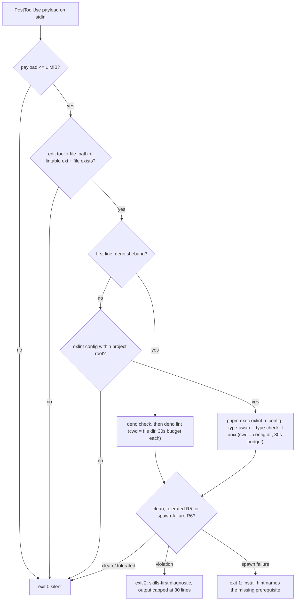

# Oxlint Guard Hook Deno Plugin - Plan

## Goal Capsule

- **Objective:** An agent editing files in a plugin consumer's project is linted after every edit against the project's own oxlint config (or `deno check`/`deno lint` for Deno-shebang files), and every lint failure the agent sees demands new skill invocations before any fixing starts.
- **Means:** A new distributable plugin `agent-plugins/oxlint-guard-hook` — one PostToolUse Deno hook script that ports the origin Bun guard's behavior (KTD1, KTD2).
- **Authority hierarchy:** The invocation request is the product contract: a new agent plugin, Deno runtime, `hooks.json` names the config file. Repo law binds: `agent-plugins/AGENTS.md` (AGT-C1, AGT-D1, AGT-G1, AGT-H1, AGT-L1), root AGENTS.md gates (`pnpm check:local`).
- **Stop conditions:** Changes land only in `agent-plugins/oxlint-guard-hook/` plus the `.claude-plugin/marketplace.json` entry; `deno task check`/`deno task test` green; foreign-cwd smoke exits 0; planted-violation smoke exits 2 with the skills-first diagnostic.
- **Tail ownership:** `ce-work` executes; no npm publish (plugin distribution is marketplace install, per the sibling plugin's contract).

## Product Contract

### Summary

The origin artifact is a Bun PostToolUse hook: after every edit-tool call it lints the edited file — `deno check` + `deno lint` for Deno-shebang files, otherwise `pnpm exec oxlint` against the nearest oxlint config — and on failure exits 2 with a stderr diagnostic whose body orders the agent to invoke skills addressing the failure's root cause before fixing anything. Silence on every skip path; a missing oxlint config is a skip, not a failure. This plan ports that guard to Deno and packages it as an installable plugin so consumers get it via `/plugin install`, with `hooks.json` naming the plugin's own Deno config file.

### Problem Frame

Lint failure feedback only changes agent behavior when it changes the agent's next action. A bare linter dump invites the cheapest local patch; the origin guard's diagnostic instead makes each failure a skills-discipline checkpoint — the fix must start from invoked skills, and already-invoked skills do not count. That behavior exists today only as an un-distributable local script. The monorepo distributes agent plugins, but its only lint-guard plugin (`oxlint-guard`) ships a different doctrine: deny-by-default enforcement plus a PreToolUse config-rewrite veto, with technical (not skills-directed) failure messages. The two guards are distinct domains; this plan ships the missing one.

The port must also carry a measured lesson: a plugin hook's process cwd is the consumer's project, never the plugin root, so Deno's config auto-discovery never finds the plugin's import map (`docs/solutions/conventions/deno-config-discovery-follows-entrypoint.md`; fixed for the sibling plugin by naming `--config "${CLAUDE_PLUGIN_ROOT}/deno.jsonc"` in every hook command). The new plugin bakes that in from its first commit.

### Requirements

Behavior:

- R1. The guard decodes the PostToolUse JSON payload and acts only when `tool_name` is an edit tool and `tool_input.file_path` names an existing file with a lintable extension: `.ts`, `.tsx`, `.js`, `.jsx`, `.mts`, `.cts`, `.mjs`, `.cjs`, plus the framework files oxlint lints by default — `.vue`, `.svelte`, `.astro` (verified against the vendored tool: `repos/oxc/apps/oxlint/src/lint.rs` lints `debugger.vue`/`debugger.svelte`/`debugger.astro` fixtures). Every other payload exits 0 silently.
- R2. Opt-in doctrine: an eligible file with no oxlint config within its project root exits 0 silently — a missing config is never a failure.
- R3. Routing, in precedence order: (a) a file whose first line is a `#!` shebang containing `deno` runs `deno check` then `deno lint` with cwd set to the file's directory — this classification precedes and is independent of oxlint config discovery, so a Deno-shebang file needs no oxlint config to be guarded; (b) every other eligible file runs `pnpm exec oxlint -c <nearest-config> --type-aware --type-check -f unix <file>` with cwd at the found config's directory. Config discovery walks up from the file but is bounded at the project root (`CLAUDE_PROJECT_DIR`, else the enclosing git root), matching the sibling's `findProjectRoot` bound; a config above the project root is never honored.
- R4. Failure contract: a linter run that produced output and exited non-zero (minus R5's tolerances) exits 2 with this stderr diagnostic — header `⛔ <TOOL> FAILED — INVOKE SKILLS FIRST.` (TOOL = `OXLINT`, `DENO CHECK`, or `DENO LINT`), the body `Before fixing anything below, invoke skills that address why these rules fire. You decide which — the hook will not map rules to skills for you. Already-invoked skills do NOT count. Each failure demands NEW invocations.`, then `--- <TOOL> output ---`, then the linter output capped at 30 lines with a `... [truncated — run the linter manually for full output]` marker, then the tail `Find skills for the ROOT CAUSE above. Invoke them, THEN fix.`
- R5. Tolerated skips, all exit 0: oxlint output containing `No files found to lint`; oxlint crash output containing both `panicked at` and `path is expected to be under the root` (an `ignorePatterns`-ignored path); stdin payload over 1 MiB; a linter run exceeding its per-command budget of 30 seconds (worst case inside the 120 s hook cap — a hung run is not evidence of a violation).
- R6. Spawn-failure contract: a runner that fails to spawn (`pnpm` absent, `oxlint` not resolvable, `deno` absent for a shebang file) is an environment problem, not a violation — the hook exits 1 with a stderr hint naming the missing prerequisite and its install path, mirroring the `command -v deno` guard in R7's command. The R4 skills-first diagnostic is reserved for runs that produced linter output.
- R7. `hooks/hooks.json` registers one PostToolUse command hook: matcher `Write|Edit|Update|MultiEdit|Create|morph_mcp_edit-file|morph_edit`; a `command -v deno` guard that exits 1 with an install hint when Deno is absent; shell-form command `exec deno run --quiet --config "${CLAUDE_PLUGIN_ROOT}/deno.jsonc" --allow-read --allow-run --allow-env "${CLAUDE_PLUGIN_ROOT}/src/lint-guard.ts"`; `timeout` 120. No network permission. Spawned linter children receive a minimal allowlisted environment (`PATH`, `HOME`, and the platform's temp/shell variables, per the sibling's `ALLOWLISTED_ENV_VARS`), never the agent's full environment.
- R8. Packaging per `agent-plugins/AGENTS.md`: `plugin.json` (agent-plugins.org manifest, name `oxlint-guard-hook`, version 0.1.0, MIT), comment-free `deno.jsonc` (AGT-C1) holding the AGT-D1 invariants (`nodeModulesDir: "none"`, no package identity, `publish.exclude: ["**"]`), MIT `LICENSE`, a committed `deno.lock` (generated by the first `deno task` run), and a `README.md` stating: install; prerequisites (Deno 2.x, pnpm, `oxlint` as a dev dependency; `--type-aware` requires oxlint's tsgolint companion — its absence degrades the type-aware pass); the exit/skip table including the R5 timeout row and the R6 spawn-failure row; the verbatim skills-first diagnostic as the documented failure message; the whole-file doctrine (the checkpoint fires on any failure in the touched file, including pre-existing ones — the guard lints the file, not the diff) and the Deno graph-level note (`deno check` validates the edited file's whole module graph, so a failure there may name an imported file); a "Relationship to oxlint-guard" section (same PostToolUse trigger surface, opposite missing-config doctrine — enforcement versus silent skip — and co-installation outcome: both hooks run on each edit, the most restrictive result wins); and a try-it step (edit a scratch file with a planted violation, confirm the exit-2 diagnostic). All shipped links absolute (AGT-L1).
- R9. `.claude-plugin/marketplace.json` gains an `oxlint-guard-hook` entry (source `./agent-plugins/oxlint-guard-hook`, category `linting`) whose `description` and `keywords` differentiate the skills-first feedback doctrine from the sibling's enforcement (every existing entry carries both fields; the listing itself must separate the pair).
- R10. A behavior test suite runs under `deno task test`, covering the skip matrix (R1, R2, R5), both routing paths (R3), the diagnostic and its 30-line cap (R4), the spawn-failure class (R6), and the tolerated branches including timeout (R5), using injected fs and runner doubles.

Verification:

- R11. The Verification Contract rows below pass.

### Key Decisions

- KD1. **Ship as a standalone plugin whose doctrine is opt-in lint with skills-first failure feedback, never deny-by-default enforcement.** Governs R2, R4. Rationale: the origin's value is the skills-discipline loop; the sibling `oxlint-guard` owns enforcement doctrine and its shipped exit table must not change.

### Scope Boundaries

- **In scope:** `agent-plugins/oxlint-guard-hook/**` and the `.claude-plugin/marketplace.json` entry.
- **Out of scope:** any change to `agent-plugins/oxlint-guard/` (doctrine, exit table, README); the git-subtrees plugin's `--config` parity defect (tracked as issues #311/#312); npm publishing; retry ladders around oxlint's type-aware backend; diff-scoped linting (reporting only failures the edit introduced).

## Planning Contract

### Key Technical Decisions

- KTD1. **Mint a distinct plugin instead of extending `oxlint-guard`.** A plugin package is scoped to one concern, and a second package every rule treats identically is one package with two names — here the concerns differ (skills-discipline feedback vs enforcement veto), so a new package is the correct unit. Rejected: adding the skills-first message to `oxlint-guard` — it would break that plugin's documented exit table and weld two doctrines into one guard. (session-settled: user-directed — chosen over extending the existing plugin: the request names a new agent plugin.)
- KTD2. **Deno runtime.** The plugin ships `src/lint-guard.ts` run by `deno run`; `node:` specifiers (`node:fs`, `node:path`) are used directly, no Bun APIs, so the shipped script carries no bare `@std/*` imports — the `deno.jsonc` import map serves the test suite (`@std/assert`), and the `--config` flag pins the plugin's own config per KTD3 regardless. (session-settled: user-directed — chosen over Bun: explicit invocation requirement; the repo's plugin convention is Deno-only per `agent-plugins/AGENTS.md`.)
- KTD3. **`hooks.json` names the plugin config.** Every `deno run` passes `--config "${CLAUDE_PLUGIN_ROOT}/deno.jsonc"` because hook cwd is the consumer's project and Deno config auto-discovery walks up from there, never finding the plugin's config. (session-settled: user-directed — chosen over relying on cwd discovery: measured defect and fix precedent, PR #313.)
- KTD4. **`pnpm exec oxlint` for non-Deno files, with a distinct spawn-failure channel.** Faithful to the origin's invocation and simpler to document; prerequisite recorded in the README (R8); when the spawn fails anyway, R6's exit-1 install hint fires instead of a fake violation. Rejected: `node_modules/.bin` walk-up resolution — that is the sibling plugin's package-manager-agnostic hardening, not this guard's contract.
- KTD5. **Config discovery mirrors the tool's own discovery first.** Per-directory priority order: the names current oxlint auto-discovers — `.oxlintrc.json`, `.oxlintrc.jsonc`, `oxlint.config.ts`, `oxlint.config.mts` (`repos/oxc/apps/oxlint/src/lib.rs:61-64`, corroborated by the oxc configuration docs and oxc PR #24357) — then the `-c`-usable fallbacks `oxlint.config.js`, `.mjs`, `.cjs`, `oxlint.json` for older installs. Walk bounded at the project root (R3). Rejected: the origin's `oxlint.config.ts`-only walk (mutes the plugin for every other config class under R2's silent skip) and the sibling README's six-name list taken unverified (it misses `.oxlintrc.jsonc`/`oxlint.config.mts` and includes names oxlint does not auto-discover).
- KTD6. **Single lint attempt, per-command time budget.** `--type-aware --type-check` runs once under a 30-second budget (the sibling's `LINT_COMMAND_TIMEOUT_MS` pattern, sized worst-case inside the 120 s hook cap — the host's own cancel discards output and feeds the agent nothing); a timed-out run is a tolerated skip (R5), never a violation. Rejected: the sibling's retry-without-type-aware fallback — different plugin's hardening; this guard is PostToolUse feedback where the agent can re-run manually.
- KTD7. **1 MiB stdin cap → silent skip.** A payload that large cannot be verified cheaply and the write has already landed (PostToolUse), so there is nothing to veto; mirrors the sibling's overflow doctrine.
- KTD8. **Children get a minimal environment, not the agent's.** The hook process holds `--allow-env` so it can construct an explicit env for spawned linters — an allowlist (`PATH`, `HOME`, temp/shell variables) passed to every child, per the sibling's `minimalEnv`/`ALLOWLISTED_ENV_VARS`. Measured on Deno 2.9.4: a child spawned without `--allow-env` inherits the full agent environment, and passing an explicit env without `--allow-env` throws — so the flag is what makes the allowlist possible, and the README's hermetic statement describes this mechanism rather than overclaiming process-level isolation.

### Assumptions

- A1. Consumers are pnpm projects with `oxlint` installed as a dev dependency; the README states this as the prerequisite (R8), and a consumer that violates it hits R6's install hint, not a fake violation.
- A2. Running `deno check`/`deno lint` with cwd at the file's directory gives the edited file's own Deno config discovery a normal chance to resolve its imports — this replaces the origin's external `denoResolutionFlags` helper, whose source is unavailable.
- A3. The plugin name `oxlint-guard-hook` (the working branch name) keeps the user's chosen label for this guard and stays distinct from `oxlint-guard`.
- A4. The skills-first doctrine's effect on agent behavior rests on the origin script's field use; repo gates verify the emission contract (exit code, stderr shape) only — the README and Definition of Done state this boundary rather than letting mechanical gates stand in for the behavioral outcome.

### High-Level Technical Design



The script separates a pure decision core (payload + fs facts → plan: `skip` | `run-deno` | `run-oxlint`) from impure runners and message builders, so the R10 suite drives everything through injected doubles. Shebang classification precedes config discovery; the config walk exists only on the oxlint route.

### Output Structure

```
agent-plugins/oxlint-guard-hook/
  LICENSE            (MIT, copied from the sibling plugin)
  README.md
  plugin.json
  deno.jsonc
  deno.lock          (generated by the first deno task run; committed)
  hooks/
    hooks.json
  src/
    lint-guard.ts
    lint-guard.test.ts
.claude-plugin/marketplace.json   (modified: new entry)
```

## Implementation Units

### U1. Plugin packaging and marketplace registration

- **Goal:** The plugin exists as an installable, convention-conformant package before any behavior lands.
- **Requirements:** R8 (packaging artifacts: `plugin.json`, `deno.jsonc`, `LICENSE`, `deno.lock`), R9
- **Dependencies:** none
- **Files:** `agent-plugins/oxlint-guard-hook/plugin.json`, `agent-plugins/oxlint-guard-hook/deno.jsonc`, `agent-plugins/oxlint-guard-hook/LICENSE`, `agent-plugins/oxlint-guard-hook/deno.lock` (generated), `.claude-plugin/marketplace.json`
- **Approach:**
  1. Copy `plugin.json`, `deno.jsonc`, and `LICENSE` shapes from `agent-plugins/oxlint-guard/`, renaming identity to `oxlint-guard-hook`; `deno.jsonc` imports only `@std/assert` (test-suite dependency) and keeps AGT-D1 invariants.
  2. Append the marketplace entry to `.claude-plugin/marketplace.json` with the differentiating `description` and `keywords` (R9).
  3. Keep every shipped config comment-free (AGT-C1); all README/repository links absolute (AGT-L1).
- **Patterns to follow:** `agent-plugins/oxlint-guard/plugin.json`, `agent-plugins/oxlint-guard/deno.jsonc`
- **Test scenarios:** `Test expectation: none — pure config and scaffolding; correctness is gated by the AGT-D1 dry-run and the root gates in the Verification Contract.`
- **Verification:** `deno publish --dry-run` from the plugin directory refuses with "Missing 'name' field" (AGT-D1 identity-absence gate); the marketplace entry parses, names the plugin directory, and carries `description`/`keywords`.

### U2. Lint guard script and behavior suite

- **Goal:** The Deno port reproduces the origin guard's decision and message contract, proven by an injected-double suite.
- **Requirements:** R1, R2, R3, R4, R5, R6, R10; doctrine per KD1; runtime per KTD2; invocation per KTD4; discovery per KTD5; budget per KTD6; stdin cap per KTD7; child env per KTD8
- **Dependencies:** U1
- **Files:** `agent-plugins/oxlint-guard-hook/src/lint-guard.ts`, `agent-plugins/oxlint-guard-hook/src/lint-guard.test.ts`
- **Approach:**
  1. Shell layer: read stdin with a 1 MiB cap (over-cap → exit 0), decode JSON, extract `tool_name` and `tool_input.file_path`.
  2. Pure core, in order: eligibility checks (edit tool, lintable extension, file exists) → shebang classification by first line → for the non-deno branch only, project-root-bounded config discovery walk (KTD5 name set, R3 bound) → plan (`skip` | `run-deno` | `run-oxlint`).
  3. Runners: `deno check` then `deno lint` with cwd at the file's directory, a check failure short-circuiting lint; `pnpm exec oxlint` per R3's argument shape with cwd at the found config's directory; both under the 30-second budget, spawned with the KTD8 allowlist env; classify results into clean / tolerated (R5) / spawn-failure (R6) / violation.
  4. Messages: R4's diagnostic assembled verbatim, with the 30-line cap and truncation marker (the marker reads "run the linter manually" — the one deliberate wording adaptation from the origin's oxlint-specific marker, so it is truthful on `DENO CHECK`/`DENO LINT` failures too); R6's install hint names the missing prerequisite.
  5. Exit mapping: skip/clean → 0 with empty stderr; violation → 2 with the diagnostic on stderr; spawn failure → 1 with the install hint; an unexpected script defect crashes to a non-zero exit (non-blocking per the hooks contract).
- **Patterns to follow:** the origin Bun script's message and truncation shape; the sibling's test seams (`agent-plugins/oxlint-guard/src/guard-lint.test.ts` in-memory fs + scripted runner), payload decoding (`agent-plugins/oxlint-guard/src/payload.ts`), `findProjectRoot` bound, `minimalEnv` allowlist, and `LINT_COMMAND_TIMEOUT_MS` budget
- **Test scenarios:**
  - Happy path: eligible `.ts` file, config present, scripted oxlint exit 0 → exit 0, empty stderr; deno-shebang file with scripted `deno check`/`deno lint` exit 0 → exit 0.
  - Skip matrix: non-edit `tool_name`; missing `file_path`; `.md` extension; file absent on disk; no oxlint config within the project root (asserting no runner call) — each exits 0 silently.
  - Routing edges: `#!/bin/sh` shebang routes to oxlint; shebang containing `deno` routes to the deno pair even with no oxlint config present (the R3 precedence case); deno-shebang with failing `deno check` → exit 2 with the `DENO CHECK` header and no lint call (short-circuit); `.vue`/`.svelte`/`.astro` files route like the TS/JS set; a config above the project root is not honored.
  - Failure paths: oxlint exit 1 with 40-line output → exit 2, stderr starts with the `⛔ OXLINT FAILED — INVOKE SKILLS FIRST.` header and carries exactly 30 output lines, the truncation marker, and the tail; `deno check` failure → header names `DENO CHECK`; `deno lint` failure → header names `DENO LINT`.
  - Spawn-failure paths (R6): runner reports `pnpm`/`oxlint`/`deno` spawn failure → exit 1 with a hint naming the missing prerequisite, no skills-first body.
  - Tolerated branches (R5): output containing `No files found to lint` → exit 0; output containing `panicked at` and `path is expected to be under the root` → exit 0; stdin over 1 MiB → exit 0 with no runner call; a runner exceeding the 30-second budget → exit 0, treated as a skip.
- **Verification:** `deno task test` green; `deno task check` green (type-check + lint, resolved through the plugin's own `deno.jsonc`).

### U3. Hook wiring, README, and runtime smokes

- **Goal:** The guard is reachable from a real agent session and its contract is documented for consumers.
- **Requirements:** R7, R8 (README.md)
- **Dependencies:** U2
- **Files:** `agent-plugins/oxlint-guard-hook/hooks/hooks.json`, `agent-plugins/oxlint-guard-hook/README.md`
- **Approach:**
  1. Write `hooks/hooks.json` exactly per R7 — the `--config "${CLAUDE_PLUGIN_ROOT}/deno.jsonc"` flag sits between `--quiet` and the permission flags (including `--allow-env`), mirroring the sibling's merged command shape; matcher and timeout per R7.
  2. Write the README per R8: install, prerequisites, exit/skip table, the verbatim diagnostic, hermetic statement, relationship section, whole-file and Deno-graph notes, try-it step, and the "other hook runners" exit-contract note (0 allow, 2 feedback, 1 non-blocking error), following the sibling README's structure.
- **Patterns to follow:** `agent-plugins/oxlint-guard/hooks/hooks.json` (command shape, deno-on-PATH guard); `agent-plugins/oxlint-guard/README.md` (section structure)
- **Test scenarios:** `Test expectation: none — static configuration and prose; correctness is the Verification Contract's smokes.`
- **Verification:** the three smokes below (foreign-cwd, planted-violation, deno-route) run against the exact command strings from `hooks/hooks.json`; README claims match observed behavior.

## Verification Contract

| Gate                        | Where                                                                                                                                                | Passes when                                                                                                                                                                                                                    |
| --------------------------- | ---------------------------------------------------------------------------------------------------------------------------------------------------- | ------------------------------------------------------------------------------------------------------------------------------------------------------------------------------------------------------------------------------ |
| Plugin type-check + lint    | `deno task check` from `agent-plugins/oxlint-guard-hook/`                                                                                            | exits 0                                                                                                                                                                                                                        |
| Behavior suite              | `deno task test` from `agent-plugins/oxlint-guard-hook/`                                                                                             | exits 0; R10 matrix covered                                                                                                                                                                                                    |
| Foreign-cwd smoke           | from a temp directory outside the plugin, pipe `{}` into each exact `hooks/hooks.json` command with `CLAUDE_PLUGIN_ROOT` set to the plugin directory | exit 0; the run resolves the plugin's own config from a foreign cwd — the KTD3 convention (a plugin hook's cwd is the consumer's project, so the command must name the config) holds regardless of the script's import surface |
| Planted-violation smoke     | pipe a payload naming a scratch file with a planted violation into the same command                                                                  | exit 2; stderr carries `INVOKE SKILLS FIRST` and the linter output                                                                                                                                                             |
| Deno-route smoke            | pipe a shebang-file payload into the same command against a scratch project with non-trivial imports, including one type-broken dependency file      | exit 2 with the `DENO CHECK` header; the message's attribution to the edited file's graph is observable and matches the README's graph-level note                                                                              |
| AGT-D1 identity gate        | `deno publish --dry-run` from the plugin directory                                                                                                   | refuses with "Missing 'name' field"                                                                                                                                                                                            |
| Marketplace + README claims | parse `.claude-plugin/marketplace.json` (entry resolves, carries description/keywords); read the README against the R8 content list                  | entry and every named README section present                                                                                                                                                                                   |
| Formatting + root gates     | `pnpm exec dprint fmt <new files>`; `pnpm check:local` from repo root                                                                                | clean; root chain exits 0                                                                                                                                                                                                      |

## Definition of Done

- Every requirement R1–R11 holds, exercised by the Verification Contract rows and the per-unit verifications above.
- No file outside `agent-plugins/oxlint-guard-hook/` and `.claude-plugin/marketplace.json` changed; `agent-plugins/oxlint-guard/` is untouched.
- No abandoned-attempt code in the diff; the tree restarts cleanly (`pnpm check:local` green after the last edit).
- Boundary stated, not papered over: the gates verify the emission contract (exit codes, stderr shape, skip silence). That the emitted diagnostic changes an agent's next action is the origin script's field-proven premise (A4); it is not measurable by repo gates, and the README presents it as the plugin's doctrine rather than as a verified outcome.

## Sources & Research

- Origin: a user-provided Bun PostToolUse guard script, external to this repository — no commit in this repo's history carries its distinctive strings; it is the port's behavioral specification (R1–R6) and message source (R4).
- Hooks reference (primary, external): https://code.claude.com/docs/en/hooks — PostToolUse exit 2 feeds stderr to the agent even though the tool already ran; exit 1 is non-blocking; a timed-out hook renders no decision; `${CLAUDE_PLUGIN_ROOT}` is substituted in shell-form commands and exported to the process; plugin hooks load from `hooks/hooks.json`; matchers are exact `|`-separated strings; shell form runs via `sh -c`.
- oxlint configuration (primary, external): https://oxc.rs/docs/guide/usage/linter/config.html, with `.mts` auto-discovery corroborated by oxc PR #24357; pinned ground truth read from the vendored tree — `repos/oxc/apps/oxlint/src/lib.rs:61-64` (auto-discovered config names), `repos/oxc/apps/oxlint/src/lint.rs` (`.vue`/`.svelte`/`.astro` lint fixtures), `repos/oxc/apps/oxlint/src/command/lint.rs` (`--type-check` flag, `hide_usage`), `repos/oxc/apps/oxlint/src/lint.rs:519` (tsgolint companion caveat).
- Deno child-environment semantics: measured on this machine's Deno 2.9.4 — a child spawned without `--allow-env` inherits the full agent environment; an explicit env map without `--allow-env` throws (grounds KTD8).
- `agent-plugins/AGENTS.md` — AGT-C1, AGT-D1, AGT-G1, AGT-H1, AGT-L1 with their gates.
- `agent-plugins/oxlint-guard/` — plugin layout, `hooks/hooks.json` command shape, README structure, `findProjectRoot` walk bound, `minimalEnv`/`ALLOWLISTED_ENV_VARS`, `LINT_COMMAND_TIMEOUT_MS`, test seams.
- `docs/solutions/conventions/deno-config-discovery-follows-entrypoint.md` — the hook-cwd config-discovery defect and the `--config` convention (grounds KTD3).
- `docs/plans/2026-08-29-2108-fix-oxlint-guard-deno-config-plan.md` — the shipped `--config` precedent (PR #313).
- `.claude-plugin/marketplace.json` — registration shape (R9).
