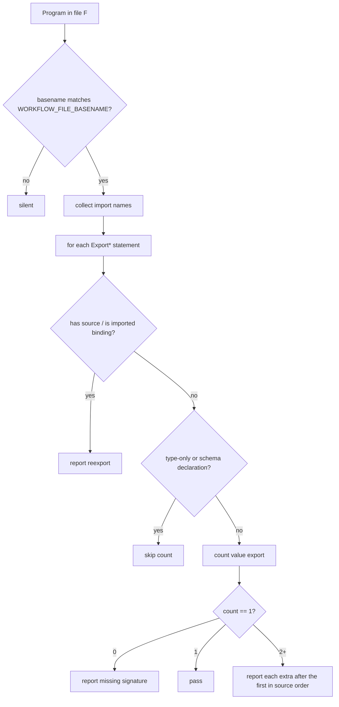

# Workflow File Export Topology - Plan

## Goal Capsule

- **Objective:** A `*.workflow.ts` module cannot leak a helper or relay another module's surface. It publishes exactly one non-schema value.
- **Means:** One oxlint rule in `@systemfsoftware/oxlint-plugin-effect-workflow`, patterned on `schema-file-exports-schemas-only`, enrolled in `configs.recommended` (KTD1, KTD5).
- **Authority:** The implementing run owns the rule, the in-tree cutover, and the PR. Merging to `main` stays human (`REPO-P1`).
- **Stop conditions:** The rule reports extra non-schema value exports and every re-export form on a single-segment `*.workflow.ts`. In-tree files pass it. `pnpm check:local` exits 0. PR watched to green.
- **Execution profile:** Standard plan, four units.
- **Tail ownership:** The run commits, pushes a branch, opens the PR, and watches the checks (REPO-D2).

---

## Product Contract

### Summary

`make-file-location` already forces `Workflow.make` into a single-segment `<stem>.workflow.ts` and at most once per file. It does not judge that file's export list. Helpers and `export … from` still leave the module, so a test or neighbor can depend on a second job the filename was meant to isolate.

The product is the missing converse: the workflow file publishes exactly one non-schema value export, and it never re-exports.

### Problem Frame

A signature cell with one export cannot leak a helper to a test and cannot grow a second job. Re-exporting moves that decision off the gated file: MDN's aggregating forms (`export * from`, `export * as ns from`, `export { name } from`) relay another module's bindings without declaring them here (https://developer.mozilla.org/en-US/docs/Web/JavaScript/Reference/Statements/export). ESLint's `no-restricted-exports` only bans configured names; it does not count exports or ban aggregation (https://eslint.org/docs/latest/rules/no-restricted-exports). The schema plugin already ships the same converse for `*.schema.ts` (`schema-file-exports-schemas-only`). Workflow files have no equivalent.

### Key Decisions

- **Exactly one non-schema value export.** Type-only exports and schema declarations stay. Governs R1, R3, R4.
- **Every re-export form is forbidden**, including an `export { x }` of an imported binding. Governs R2.

### Requirements

**Export count**

- R1. A single-segment `*.workflow.ts` publishes exactly one non-schema value export.
- R3. Exported schema declarations do not count toward R1: a module-scope class extending a Schema factory, or a module-scope const initialized to a `Schema.<member>(...)` combinator, matching the classifier `schema-file-exports-schemas-only` already uses.
- R4. Type-only surface does not count toward R1: `export type`, type aliases, interfaces. Enums count as type vocabulary and do not count toward R1.

**Re-exports**

- R2. The file reports every aggregating form MDN names (`export * from`, `export * as ns from`, `export { … } from`, including type-only and default-from), and `export { x }` of a binding that arrived through `import`.

**Scope of the walk**

- R5. The rule is silent on any file whose basename is not a single-segment `<stem>.workflow.ts` (`WORKFLOW_FILE_BASENAME` in `make-file-location.config.ts`).
- R6. `tests/__fixtures__/<stem>.workflow.ts` is in scope. The rule does not skip test files.

**Delivery**

- R7. The rule is `error` in the workflow plugin's `configs.recommended`. `effect-dmmf`'s `recommendedFrom` picks it up with no hand edit of the aggregate.
- R8. Messages use OX-EF1: `'{{name}} is forbidden. Expected: {{expected}}. Actual: {{actual}}. Fix: {{fix}}.'`
- R9. Every in-tree `*.workflow.ts` that currently exports a helper, factory-adjacent function, or string constant besides the one decision is cut over so `pnpm check:local` is green.

### Scope Boundaries

- `make-file-location` (one `Workflow.make`, filename) stays unchanged.
- `schema-file-exports-schemas-only` stays unchanged.
- No new shared kernel package for `isSchemaDeclaration`.
- The one non-schema export is not required to be a `Workflow.make` binding. Construction site remains `make-file-location` / EW1.
- Package public-surface rules (`no-barrels`, enumerated exports) stay out of this unit rule.

### Deferred to Follow-Up Work

- Requiring the one export to resolve to `Workflow.make` (identity of the binding, not the count).

---

## Planning Contract

### Key Technical Decisions

- KTD1. **One rule, two message families.** Extra/missing non-schema value export and re-export are one walk over `Program.body`, like `schema-file-exports-schemas-only` (`codecExport` / `nonSchemaExport` / `reexportFromSchemaFile`). They share one detection pass. Distinct `messageId`s keep Unique warnings. Do not add options; the policy is fixed.
- KTD2. **Filename-routed, not make-triggered.** `make-file-location` keys on `Workflow.make` so a misfiled construction still fires. Export topology is a property of the workflow file. A non-workflow file with many exports is not this rule's subject (R5).
- KTD3. **Classify schemas in this plugin, do not depend on `oxlint-plugin-effect-schema`.** That package's public export is the plugin object only. Importing its internals would couple domains. Copy the exemption predicates the schema rule already documents (class extending a Schema factory; const initialized to `Schema.*` / `S.*` combinator, including `Union` / `Struct` / `Literals` / `Array`). A codec-use combinator (`encodeSync`, `decodeSync`, `toArbitrary`, …) is not a schema declaration and counts toward R1.
- KTD4. **Imported-then-exported is a re-export.** MDN equates `export { x } from "mod"` with import-plus-export except the name is not local. Treat `export { x }` of a name in the import binding set as R2, even when `x` is a schema.
- KTD5. **Enroll in recommended after the in-tree cutover.** Adding the rule to `configs.recommended` before U2 makes the repo's own lint fail on known extra exports (`restartIndicesFor` in `RestartDecision.workflow.ts`, helper functions in omp hook workflows, `mergeRecords` in `Config.workflow.ts`).
- KTD6. **Zero non-schema value exports is a report.** R1 is exactly one, so the family has an absence obligation (OX-OB1) without duplicating `Workflow.make` (EW1).

### Assumptions

- A function export that closes over test traces and returns `Workflow.make(...)` (e.g. `drawnDecision`, `tracedDecide`) is the one non-schema value export when it is the only one.
- Moving a helper out of a `*.workflow.ts` into a sibling `.ts` is in scope for U2. Callers update imports in the same unit.
- Type-only re-exports (`export type { X } from`) are R2, same as the schema sibling.

### Sequencing

U1 → U2 → U3 → U4.

### High-Level Technical Design

---

## Implementation Units

### U1. Workflow export-topology rule and RuleTester suite

- **Goal:** The plugin reports R1–R6, R8 on fixtures. Recommended is not enrolled yet.
- **Requirements:** R1, R2, R3, R4, R5, R6, R8.
- **Dependencies:** none.
- **Files:**
  - `packages/lint/oxlint/plugins/cells/effect-workflow/src/rules/workflow-file-export-topology.config.ts` (new)
  - `packages/lint/oxlint/plugins/cells/effect-workflow/src/rules/workflow-file-export-topology.ts` (new)
  - `packages/lint/oxlint/plugins/cells/effect-workflow/src/rules/__tests__/workflow-file-export-topology.test.ts` (new)
  - `packages/lint/oxlint/plugins/cells/effect-workflow/src/index.ts` — register the rule on `rules`, not yet on `configs.recommended`
- **Approach:**
  1. Static config in `*.config.ts` (OX-CS1). Messages OX-EF1. `{{fix}}` names deletion of the extra export or the re-export (OX-EF2).
  2. `Program` visitor. Reuse `WORKFLOW_FILE_BASENAME` from `make-file-location.config.ts`.
  3. Pass 1: imported local names. Pass 2: export statements. Follow `schema-file-exports-schemas-only.ts` for re-export arms and `export { local }` resolution.
  4. Schema exemption per KTD3. Do not re-derive `schemaMemberOf` from a second copy of the use-combinator set if the schema plugin's exported constants are unreachable; keep the exemption list in this rule's config.
  5. First non-schema value export in source order is the signature. Later ones report. Count 0 reports missing.
- **Patterns to follow:** `packages/lint/oxlint/plugins/effect/schema/src/rules/schema-file-exports-schemas-only.ts` and its test file. RuleTester setup as `make-file-location.test.ts`.
- **Execution note:** Write the invalid fixtures first so each `messageId` is observed red, then implement.
- **Test scenarios:**
  - A workflow file with one `export const decide = Workflow.make(...)` and two exported `S.TaggedClass` / `S.TaggedError` classes passes.
  - The same file plus `export const helper = () => 1` reports the helper as extra.
  - A file with only schema and type exports, no value export, reports missing.
  - `export type RestartStrategyName = ...` next to the one workflow const passes.
  - `export * from './other.js'` reports re-export. `export { x } from './other.js'` reports. `export type { X } from './other.js'` reports.
  - `import { foo } from './other.js'; export { foo }` reports re-export.
  - `export { Command }` of a local schema class does not count and does not report.
  - `export const codec = S.encodeSync(Model)` counts as a non-schema value (codec use).
  - `foo.workflow.ts` filename is silent even with three exports.
  - `decide.foo.workflow.ts` (multi-segment) is silent.
  - `tests/__fixtures__/decide.workflow.ts` with two value exports reports.
  - `export default` as the sole non-schema value passes; default plus a named value reports extra.
  - Near-miss: `Other.TaggedClass` class is not a schema exemption (OX-CI1).
- **Verification:** `pnpm --filter @systemfsoftware/oxlint-plugin-effect-workflow test` exits 0. Recommended still lists the four existing rules only.

### U2. Cut over in-tree `*.workflow.ts` files

- **Goal:** Every workspace `*.workflow.ts` satisfies R1 and R2 so recommended enrollment cannot fail the repo.
- **Requirements:** R9.
- **Dependencies:** U1.
- **Files:** every `*.workflow.ts` under `packages/`, `omp/`, and test fixtures, plus the sibling modules that receive moved helpers and the importers of those names. Census at execution; known extras include `restartIndicesFor` (`packages/core/effect/daemon-spec/src/internal/RestartDecision.workflow.ts`), `mergeRecords` (`packages/testing/mutation/stryker-js/platform-node/src/Config.workflow.ts`), and helper functions in `omp/plugins/omp-claude-compat/src/hooks/` and `omp/plugins/omp-agent-discipline/src/`.
- **Approach:**
  1. List `*.workflow.ts`. For each, classify exports as schema, type-only, re-export, or value.
  2. Keep schemas, types, and exactly one value export (the workflow or the factory that returns `Workflow.make`).
  3. Move other values to a sibling non-workflow module. Update importers. Do not re-export the moved names from the workflow file (R2).
  4. Do not invent barrels.
- **Test expectation:** none — cutover is proven when U3's recommended enrollment plus `pnpm check:local` is green. Existing property tests of moved helpers must still pass from their new import path.
- **Verification:** `pnpm --filter @systemfsoftware/oxlint-plugin-effect-workflow test` still 0. A local oxlint run over a known former extra (`RestartDecision.workflow.ts`) reports nothing once the helper is gone.

### U3. Enroll recommended, README, api-extractor

- **Goal:** Adopters who spread `configs.recommended` get the rule. Docs and the api report name it.
- **Requirements:** R7.
- **Dependencies:** U2.
- **Files:**
  - `packages/lint/oxlint/plugins/cells/effect-workflow/src/index.ts`
  - `packages/lint/oxlint/plugins/cells/effect-workflow/README.md`
  - `packages/lint/oxlint/plugins/cells/effect-workflow/etc/oxlint-plugin-effect-workflow.api.md` (regenerated)
- **Approach:**
  1. Add the rule to `recommendedRules` at `error`.
  2. Add a Rules-table row. Mention it in the FAQ "nothing is reported" answer so location-scoped vs export-scoped is distinct from `make-file-location`.
  3. `api:update`. Do not hand-edit the report.
- **Test expectation:** none — api-extractor and README are not RuleTester contracts. `packages/lint/oxlint/config/src/__tests__/base-registration.test.ts` already asserts registration generically; if it keys a closed rule-name set, update that set.
- **Verification:** `pnpm --filter @systemfsoftware/oxlint-plugin-effect-workflow api:check` exits 0. `effect-dmmf` recommended includes the new name via `recommendedFrom` with no aggregate source edit.

### U4. Changeset

- **Goal:** Publishable hash change has a consumer-facing note.
- **Requirements:** R7.
- **Dependencies:** U3.
- **Files:** `.changeset/` intent via `pnpm change`.
- **Approach:** `minor` for `@systemfsoftware/oxlint-plugin-effect-workflow` (and any other publishable package whose turbo build hash moved because of U2). Body states the new recommended error and the two refusals. No internal paths, test counts, or review severities.
- **Test expectation:** none — changeset-check owns this.
- **Verification:** `.github/workflows/changeset-check.yml` would accept the file.

---

## Verification Contract

| Gate                                                                     | When               | Signal                                                                                                     |
| ------------------------------------------------------------------------ | ------------------ | ---------------------------------------------------------------------------------------------------------- |
| `pnpm --filter @systemfsoftware/oxlint-plugin-effect-workflow test`      | After U1, after U2 | exit 0; new RuleTester cases distinguish extra, missing, re-export, schema skip, type skip, wrong filename |
| `pnpm --filter @systemfsoftware/oxlint-plugin-effect-workflow api:check` | After U3           | exit 0                                                                                                     |
| `pnpm check:local`                                                       | After last edit    | exit 0                                                                                                     |
| PR checks watched to green                                               | After open PR      | `xd://github` `run_watch` on current HEAD                                                                  |

---

## Definition of Done

- R1–R9 hold on the shipped tree.
- Abandoned census notes and scratch files are gone.
- Per-unit verification above has run.
- Changeset body is consumer-observable only.
- PR is open and CI is decided green.

## Assumptions

Headless inferred bets (not user-confirmed): type-only and schema exports are the R1 exemption; in-tree helper moves are in this PR; the one value export may be a `Workflow.make` factory.
