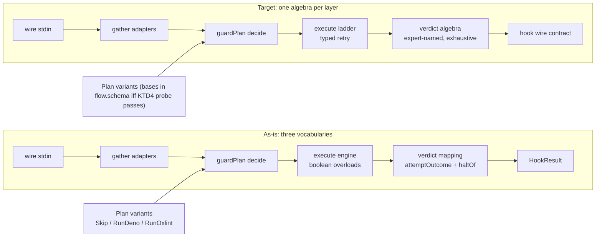

# Oxlint Guard Hook Architecture Rewrite - Plan

## Goal Capsule

**Objective**: The plugin's type-level architecture survives an architecture-audit and the gcanti-tim-smart-style rules: one expert-named outcome algebra per domain layer, retry carried by types, no interface twin of any schema, phases declared per the cell-types source contract. A reader diffs the audit's target graph against the shipped code and finds no divergence.

**Means**: Collapse the verdict vocabularies and replace boolean-overload dispatch with typed retry ladders (KTD1, KTD2), verified by the audit report the plan ships (KTD5).

**Authority hierarchy**: repo CONSTITUTION + lint gates > gcanti-tim-smart-style > architecture-audit doctrine > this plan's remaining choices.

**Stop conditions**: any settled decision invalidated by evidence (report `settled-decision-invalidated`); any gate that cannot go green without rule-weakening (blocked).

**Execution profile**: hands-off pipeline (LFG); ships to branch `oxlint-guard-hook`, PR #325.

## Product Contract

### Summary

Rewrite `agent-plugins/oxlint-guard-hook/src/` so the structure changes substance: the previous pass renamed files and moved code but kept three overlapping outcome vocabularies, boolean-overload retry dispatch, and phases declared by dist-inference. The rewrite collapses these per the style and audit authorities. Guard behavior is locked, not redesigned.

### Problem Frame

PR #325's plugin passed every gate while its internals carried rename-era residue: `AttemptOutcome`/`FinalAttempt`/`HookResult` restate each other across three layers; `runGuarded` dispatches on a boolean via overloads; `GuardPhases` was inferred from lint errors, not read from the owning package source. The user judged the pass "musical chairs". The fix is structural, in place, on the same branch.

### Requirements

Gate/wiring:

- R1. Guard behavior contract unchanged: unknown tool → exit 0 silent; malformed stdin → exit 0 silent; missing file, non-lintable extension, no config → exit 0; spawn-failure or tool-not-found → exit 1 with the skills-first prerequisite hint on stderr; timeout → exit 0 silent; `deno check`/`deno lint`/`oxlint` violation → exit 2 with the skills-first stderr diagnostic. Gate: smoke matrix (skip/garbage/violation = 0/0/2 plus a missing-tool fixture asserting exit 1 + hint) plus the existing 13-test suite and in-source verdict properties stay green.
- R2. One schema-derived, expert-named outcome union per domain layer (process, verdict, hook); every dispatch exhaustive (`Match.exhaustive` or `Option`); verdict variant names are domain verdicts (Pass/Violation/Retry/Unsupported-class vocabulary), not structural names. Gate: `typescript/no-unsafe-*` + `no-manual-tag-member` + a check asserting every verdict-layer exported type is `S.Schema.Type`-derived and every verdict transform is a total `Match`/`Option` dispatch; audit report records the algebra.
- R3. Retry sequencing is carried in the type (a per-tool ladder), not boolean overloads. Gate: `deno check` clean with zero function overloads in `src/execute.ts`.
- R4. `GuardPhases` (and any cell API surface) is verified against the cell-types source at the version the plugin compiles against — `packages/core/effect/cell/types` (workspace path; plugin pins published 5.0.1), never dist inference (REPO-O1/REPO-W4). Gate: U4 falsifies first — member-for-member compare of the current `GuardPhases` against the source `Cell.Phases` — and the audit report cites the source file and line either way; re-declare only on mismatch.
- R5. Architecture audit shipped under `docs/audits/oxlint-guard-hook/`: as-is and target boundary graphs that are regenerable, not narrated — the as-is graph is extracted by script from the source pinned at the pre-rewrite commit SHA, the target graph is extracted by the same script from the final tree, and the close-out diff between them is mechanical. Gate: the script runs clean and its diff against the recorded target graph is empty; the report cites the extraction command.
- R6. All gates green after the last edit: `deno task check`, `deno task lint:oxlint`, vitest (13 tests + in-source properties), the gcanti-tim-smart-style audit script at 0 fail 0 warn (per Verification Contract), CI Mutation 100% on `src/*.workflow.ts`, smoke matrix, `pnpm check:local`.
- R7. Settled constraints hold: no manual `_tag` (S.TaggedStruct/S.Schema.Type only), no `Deno.*` globals outside the platform layer, no invented filename suffixes (plain nouns + `*.schema.ts`/`*.workflow.ts`), no oxlint rule weakened or disabled. Gates: existing config guard, `no-manual-tag-member`, the mutation config, and review.

### Key Decisions

- **Rewrite changes structure, not just names.** Governs R2, R3, R4. (session-settled: user-directed — chosen over the rename-only pass: renames left the same seams and vocabularies standing.)

### Scope Boundaries

In scope: `agent-plugins/oxlint-guard-hook/src/**`, its `deno.jsonc`/`oxlint.config.ts` only if a gate demands it, and the audit report under `docs/audits/`. Out of scope: hook semantics, `hooks/hooks.json` wiring, plugin marketplace metadata, other plugins.

### Deferred to Follow-Up Work

None.

## Planning Contract

### Key Technical Decisions

- KTD1. Collapse the outcome-vocabulary chain (`RunOutcome` → `LintOutcome` → `AttemptOutcome`/`FinalAttempt` → `HookResult`, mapped by `attemptOutcome` + `haltOf`) into one verdict algebra. Disposition: `RunOutcome` and `LintOutcome` survive as schema-derived unions in `agent-plugins/oxlint-guard-hook/src/flow.schema.ts` (they model process and lint reality); the attempt-layer unions fold into one schema-derived verdict algebra with expert-named variants, and the value-level mapping pair (`attemptOutcome`, `haltOf`) is deleted in favor of total `Match` transforms in `verdict.ts`. Variant naming: `proceed`/`retry-plain`/`respond` are structural names; the algebra renames them to the domain's verdicts. The wiki ruling's expert-named clause is convention-band warrant (its own A7/A8 concede this), not canon — the audit report cites it as adopted convention, and plan-variant names (`Skip`/`RunDeno`/`RunOxlint`) are exempt because they name tools and actions, not outcome verdicts. (session-settled: user-directed — chosen over keeping the mapping layer: it is the musical-chairs residue.)
- KTD2. Replace `runGuarded`'s `canRetry: true/false` overload pair with a typed ladder: each tool step returns the attempt outcome; the oxlint step's type-aware→plain retry is encoded as a two-step ladder value, not signature dispatch. (Chosen over overloads: boolean dispatch hides the retry state the caller needs.)
- KTD3. Falsify before re-declaring: member-for-member compare the current `GuardPhases` against the source `Cell.Phases` at the version the plugin compiles against (`packages/core/effect/cell/types`, workspace path; plugin pins published 5.0.1 — the plan does not bump the pin; package.json/deno.lock stay out of scope). Re-declare only on mismatch, citing the source file and line; record the compare result in the audit report either way. The prior account ("dist-inferred") meant: the shape was derived from lint errors surfacing dist-resolved types — one mechanism, stated once here. (Chosen over keeping unverified shape: REPO-W4.)
- KTD4. `planFor`, `PLAN_RULES`, plan-variant classes stay same-file in `guard.workflow.ts` — `make-body-purity` rejects imported decide-body references (measured this session). Probe once whether the `S.TaggedStruct` variant bases can move to `flow.schema.ts` while `planFor` stays same-file; the gate result is recorded in the audit report either way.
- KTD5. The architecture-audit doctrine is the structural gate, and it must be able to fail: the as-is graph is extracted by script (module import edges from the pinned pre-rewrite commit SHA), the target graph is extracted by the same script from the final tree, and the close-out diff is mechanical — never a self-performed narration. Findings carry blast radius; the report ships under `docs/audits/oxlint-guard-hook/` and cites the extraction command. (session-settled: user-directed — the user named the audit as authority.)

### High-Level Technical Design



### Assumptions

- Audit report lives at `docs/audits/oxlint-guard-hook/` (repo has no prior audit dir; location inferred).
- Behavior lock = existing tests + in-source properties only; no new test files. The R1 missing-tool smoke fixture is a stdin input to the existing smoke run, not a new test file. Extending the in-source block for renamed variants is a semantic re-scope, not a mechanical rename: U2 itemizes which properties the merged Retry verdict re-scopes (at minimum the forbidden-retry property) and asserts the intended post-merge observable for each.

### Sources / Research

- Wiki ruling `decision-gate` (B1): choice-keyed decisions, ≥2 expert-named variants, exhaustive dispatch, Error may be `never` — grounds KTD1's variant-naming and totality demands.
- Effect primary docs: Schema basics and pattern matching (`https://effect.website/docs/schema/basic-usage/`, `https://effect.website/docs/code-style/pattern-matching/`) — `Schema.Type` derivation and `Match` exhaustive dispatch idiom.
- gcanti-tim-smart-style reference files (read this session): layering, error modeling, no boolean-dispatch overloads.
- Session-measured gate rulings: `make-body-purity` (decide body = same-file/params/pure-surface), `no-manual-tag-member` (S.TaggedStruct bases, `*.schema.ts` or owning `*.workflow.ts`), cell-types `R = never` phase pins (dist lines 171/198), `import(no-cycle)` (execution engine must not import plan types).

## Implementation Units

### U1. Audit baseline report

**Goal**: Capture the as-is boundary map and findings before any code moves, so the rewrite's delta is measured, not narrated.
**Requirements**: R5
**Dependencies**: none
**Files**: `docs/audits/oxlint-guard-hook/README.md` (as-is graph, findings with blast radius, gate evidence table)
**Approach**: Pin the pre-rewrite commit SHA, then extract the as-is module graph by script (module import edges — `ast-grep` import patterns or `deno info --json`), not by narration; record each KTD target as a finding with the gate that will confirm it (R2–R4 gates). Follow the architecture-audit doctrine's report shape and cite the extraction command.
**Test expectation**: none -- documentation artifact; R5's gate is presence plus the U6 diff.
**Verification**: report exists; every KTD1–KTD4 appears as a finding with its confirming gate named.

### U2. Collapse the verdict algebra

**Goal**: One expert-named, schema-derived outcome algebra; delete the value-level mapping pair and fold the attempt-layer unions.
**Requirements**: R1, R2, R7
**Dependencies**: U1
**Files**: `agent-plugins/oxlint-guard-hook/src/flow.schema.ts`, `agent-plugins/oxlint-guard-hook/src/verdict.ts`, `agent-plugins/oxlint-guard-hook/src/adapters.ts`, `agent-plugins/oxlint-guard-hook/src/execute.ts`, `agent-plugins/oxlint-guard-hook/src/guard.workflow.ts`, `agent-plugins/oxlint-guard-hook/src/main.ts`
**Approach**:

1. Re-declare the verdict unions in `flow.schema.ts` as `S.TaggedStruct` bases with domain verdict names (Pass/Violation/Retry/Unsupported family), exported via `S.Schema.Type`.
2. Rewrite `verdict.ts` as total `Match` transforms over those types; delete the `attemptOutcome` + `haltOf` mapping pair and fold the attempt-layer unions (`AttemptOutcome`/`FinalAttempt`) into the one algebra — they are schema-derived types today, so the deletion target is their separate existence and the mapping, not interface declarations.
3. Update `execute.ts`/`guard.workflow.ts`/`main.ts` to the new names; keep `LintFailure` semantics identical (exit codes 1/2, message shape).
4. Re-scope the in-source property block for the renamed variants, itemizing what the merged Retry verdict changes: at minimum the forbidden-retry property (canRetry=false ⇒ never retry at the classify layer) loses its `retry-without-type-aware` tag discriminator and must assert the intended post-merge observable; existing 13 tests unchanged.
   **Test scenarios**:

- Happy path: typed `LintOutcome` pass through classify yields Pass; violation yields the exit-2 verdict with the diagnostic message verbatim.
- Edge cases: output truncated at the cap still classifies; empty output; spawn-failure reason maps to its hint text.
- Error paths: timeout attempt yields the timeout verdict; unsupported tool error carries the tool name.
- Integration: main.ts exit code for a violation is 2 and for proceed is 0 through the new algebra.
  **Verification**: `deno task check`, `deno task lint:oxlint`, vitest green; the R2 check (every verdict-layer exported type `S.Schema.Type`-derived, every transform total `Match`/`Option`) passes.

### U3. Typed retry ladder in the engine

**Goal**: Retry sequencing as data; zero overloads.
**Requirements**: R3, R7
**Dependencies**: U2
**Files**: `agent-plugins/oxlint-guard-hook/src/execute.ts`
**Approach**: Model each tool step as a ladder value (steps + whether a next step exists); the oxlint type-aware→plain retry is a two-rung ladder; deno pair keeps its fixed sequence. No boolean parameters.
**Test scenarios**:

- Happy path: type-aware pass short-circuits the ladder; retry-plain runs the plain rung.
- Edge cases: plain rung pass and violation both terminal.
- Error paths: spawn failure on any rung yields the spawn verdict with the tool's prerequisite hint.
  **Verification**: `deno check` clean; grep confirms no `function runGuarded(` overload pair; vitest green.

### U4. Phases idiom from cell-types source

**Goal**: `GuardPhases` declared exactly as the owning package's source prescribes.
**Requirements**: R4, R7
**Dependencies**: U1
**Files**: `agent-plugins/oxlint-guard-hook/src/guard.workflow.ts`
**Approach**: Falsify first: member-for-member compare the current `GuardPhases` against the source `Cell.Phases` in `packages/core/effect/cell/types` (the version the plugin pins — published 5.0.1; do not bump). On mismatch, re-declare to the source idiom and adjust `buildGuardCell`'s generics; on match, record that the shape was already correct and cite the source file and line. Either way the audit report carries the compare result.
**Test expectation**: none -- declaration-shape change; behavior covered by the suite and U6 smoke.
**Verification**: audit report cites the source file+line fixing the idiom; gates green.

### U5. Variant-base location probe

**Goal**: Settle where the plan-variant `S.TaggedStruct` bases live, by gate evidence.
**Requirements**: R2, R7
**Dependencies**: U2
**Files**: `agent-plugins/oxlint-guard-hook/src/flow.schema.ts`, `agent-plugins/oxlint-guard-hook/src/guard.workflow.ts`
**Approach**: Move the three bases to `flow.schema.ts`, keep `planFor`/classes same-file, run the lint gate. If `make-body-purity` fires, revert and record; if clean, keep and record. Either way the audit report carries the ruling.
**Test expectation**: none -- location probe; the gate is the lint run.
**Verification**: audit report records the gate outcome; gates green in the settled state.

### U6. Gates, smoke, target-state audit

**Goal**: Prove the rewrite: all gates green, behavior locked, target graph matches the tree.
**Requirements**: R1, R5, R6
**Dependencies**: U2, U3, U4, U5
**Files**: `docs/audits/oxlint-guard-hook/README.md` (target graph + final diff note)
**Approach**: Run the full verification contract; re-run the smoke matrix (now including the missing-tool exit-1 fixture); extract the target graph with the same script U1 used, and diff it mechanically against the recorded target graph — fix the tree or the graph until the diff is empty; never hand-edit the graph to match.
**Test scenarios**:

- Integration (smoke matrix): skip input exits 0; garbage stdin exits 0; violation fixture exits 2 with the skills-first diagnostic on stderr; missing-tool fixture exits 1 with the prerequisite hint on stderr.
- Edge cases: missing target file exits 0; deno-shebang file routes to the deno pair.
  **Verification**: every R6 gate command exits 0; the scripted target-graph diff against the recorded graph is empty.

## Verification Contract

```bash
deno task check                     # plugin typecheck (deno check src/)
deno task lint:oxlint               # oxlint @systemfsoftware/all, type-aware
corepack pnpm exec vitest run       # 13 tests + in-source verdict properties
deno run --allow-read /root/.omp/agent/skills/gcanti-tim-smart-style/scripts/audit.ts --version effect-4.x agent-plugins/oxlint-guard-hook/src/   # 0 fail, 0 warn
pnpm check:local                    # repo-wide chain, after last edit
```

CI: Mutation workflow at 100% on `src/*.workflow.ts`; full run_watch to decided on PR #325. Smoke matrix (U6) exercises the real hook through `src/main.ts` with stdin fixtures.

## Definition of Done

- Per unit: unit's Verification line holds; no abandoned-attempt code left in the diff.
- Global: R1–R7 all true; audit report carries as-is + target graphs with zero divergence; PR #325 head green on every workflow; working tree restartable (`git status` clean after commit).

## Appendix

None.
