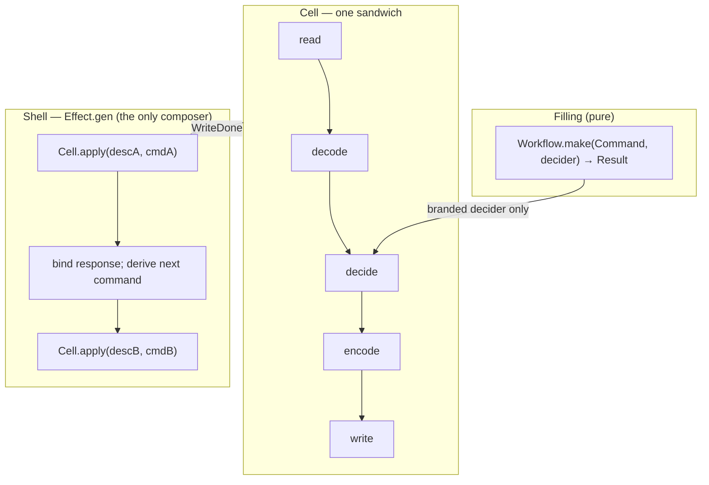

## Goal Capsule

- **Objective:** A description's declared order is its execution order for exactly one sandwich, and composing two sandwiches is ordinary `Effect.gen` code an author can read without learning a cell-specific composition API. The compiler still refuses inverted chains and unbranded decisions; a write's promotion of a decide failure into `Effect.fail` is recorded as executor-owned shell policy, never baked into the phase types. Nothing else is claimed by the types.
- **Means:** Delete the multi-layer machinery from `@systemfsoftware/effect-cell-types` (`Description.layers`, `Layer`, `read(run, previous)`), make `apply` run the one sandwich, and move the only production two-layer site onto two shell-owned values (KTD1, KTD2, KTD4).
- **Authority hierarchy:** CONSTITUTION.md and CONCEPTS.md govern shape; this plan governs the change; the 2026-08-13 phase-order plan is historical record and its KD5 is withdrawn here (KTD6).
- **Execution profile:** deep refactor of one published package plus its generator package and one consumer; all other consumers must compile unmodified.
- **Stop conditions:** any pre-existing single-layer consumer needs a source edit beyond recompilation; `Cell.layer` cannot be implemented without an `as` cast (U6 then ships nothing); a second production two-layer site is discovered (the census in Sources found exactly one).
- **Tail ownership:** doctrine edits (CONCEPTS.md, package AGENTS.md), the regenerated api-extractor report, and the changesets land in U7 after the API settles.

---

## Product Contract

### Summary

`Cell` shrinks to what its evidence supports: one `read → decode → decide → encode → write` chain per `Description`, built by five sentence-branded constructors (plus a conditional object-spec sugar), run once by `Cell.apply`. Everything that sequences two sandwiches — write-then-read, response-becomes-command, fan-out — is written in the `Effect.gen` shell that already exists. The change deletes three constructs (`Layer`, `layers`, `previous`), rewrites one production module (`Sandbox.ts`), and adapts one generator package (`effect-cell-gen`).

### Problem Frame

The 2026-08-13 plan (KD5) sanctioned "one description carrying two layers" for write-then-classify sites, arguing that composing two descriptions by hand would thread an I/O response between two pure fillings and turn both impure. That argument conflates the shell's job with the filling's purity: in `Effect.gen`, an author binds `const a = yield* Cell.apply(descA, cmdA)` and passes `a` into the next command; both decide phases remain pure functions, and the shell is the sanctioned impure seam. Measured against the only production site the mechanism ever gained, the multi-layer design did worse than its alternative: `packages/testing/mutation/stryker-js/platform-node/src/Sandbox.ts` carries a second layer that re-runs layer 1's pure decision on identical input, probes file existence and discards the results, and returns the same `SandboxHandle` layer 1 already returned — bridged by two `let` captures (`capturedInput`, `capturedFileMap`) because no value channel exists between layers. The shared `Phases` bag made the degenerate shape mandatory: both layers must share `decision` and `decoded` types, so a heterogeneous "instrument, then classify" pair — the motivating case — is inexpressible. The types claimed a composition they could not represent, and the one site that used them smuggled the data anyway.

### Requirements

**One sandwich**

- R1. `Description<P>` carries one sandwich's phases directly as `phases: readonly Phase<P>[]`; the exported `Layer` interface and the `layers` member are deleted from the package API.
- R2. `Cell.read` takes exactly one argument; no constructor in the package accepts a `previous` parameter.
- R3. `Cell.apply` runs the description's one sandwich in declared array order and returns its write's response; a decode `Left` fails the effect before any write runs, and a decide `Left` travels to that write as a value. The two-`Left` law is unchanged within the sandwich.
- R4. The sentence-branded stage chain (`ReadDone` → `DecodeDone` → `DecideDone` → `EncodeDone` → `WriteDone`), the `Workflow.make` brand door on `decide`, and the query carve-out (an encode-terminal description compiles; `apply` demands `WriteDone`) are all unchanged.
- R5. `Cell.vocabulary` and `Cell.canonical` keep their exported shape (`module`, `ioCells`, `phases`, `byKind`, `applier`), with content derived by folding the one-sandwich canonical value.

**Composition law**

- R6. Sequencing two sandwiches — including write-then-read and response-becomes-command — is expressed as multiple `Cell.apply` calls in an `Effect.gen` shell that owns the bindings between them. The package exposes no multi-layer composition API: no `previous`, and no `compose`/`then`/`Do` combinator.
- R7. A write phase that promotes a decide `Left` into `Effect.fail` is recorded in CONCEPTS.md as shell policy owned by the executor, not as a phase convention; no `convention` member or phase type changes to express it.

**Conditional sugar**

- R8. `Cell.layer(spec)` ships only if it infers the `Phases` bag from the supplied phase functions with zero `as` casts in its implementation: the short form (`read`, `decide`, `write`) inserts identity decode/encode adapters typed against the inferred bag, where `decoded` is `raw` and `output` is `Result<decision, decisionError>` by construction; the long form takes all five phases. Partial specs (`decode` without `encode`, or the reverse) are rejected for variable-held specs too, via `never`-typed absent members on each overload's spec type — excess-property checks alone only fire on inline literals. Function-parameter contravariance is checked on every call, so the write's first parameter constraint needs no literal. If the overload set cannot be made to infer soundly under those terms, nothing ships and the five dual constructors remain the only API.

**Consumers**

- R9. `effect-cell-gen` draws single-sandwich descriptions; its drawn-failure addressing drops `layerIndex`, and `declaredOrderOf` reads `description.phases`.
- R10. `Sandbox.ts` builds and applies one description; `capturedInput` and `capturedFileMap` are deleted; the write takes its `raw` parameter (the read returns the command, so `raw` is the command) instead of reading a capture; observable behavior at its sole caller (`Run.ts` `instrumentLayer`) is unchanged.
- R11. Every other `Cell.apply` consumer compiles and behaves unchanged with zero source edits: `Checker.ts`, `Config.ts` (platform-node), `Instrument.ts` (instrumenter), `Output.ts`, `Survivors.ts` (cli), `Reporter.ts` (html-reporter), `SupervisorBodyExecutor.ts` (cell/daemon-spec).

**Doctrine**

- R12. CONCEPTS.md describes one sandwich per description and shell composition of sandwiches; the sentence sanctioning "one description carrying two layers" is gone from live doctrine. The 2026-08-13 plan file is not edited — git history owns it.

---

## Planning Contract

### Key Technical Decisions

- KTD1. **One `Description` is one filling; `layers[]` dies as a type and as data.** Chosen over two first-class composition axes (intra-description layers plus shell sequencing): the one-bag `Phases` design cannot type heterogeneous layers, which forced the only production two-layer site to duplicate its decision verbatim; and the inter-layer data channel that site actually used was two `let` captures, the exact smuggle the `write(output, raw)` second argument exists to prevent. Adjudicated this run after a user challenge — the challenge and its evidence are the Problem Frame. The seam is right-sized for the current sites, not a final answer: the composition points the design keeps are the `write(output, raw)` channel inside one sandwich and the `Effect.gen` binding between two applies, and any future typed inter-sandwich composition (a fan-out combinator, a pipeline DSL) is a new exported API to be designed on its own evidence, not a restoration of the deleted machinery. Governs R1, R2, R3, R6.
- KTD2. **`read` loses `previous`; same-command replay is rejected.** Chosen over replaying one command through stacked layers: replay composes side effects keyed by command identity, not values — verified in `Sandbox.ts`, where layer 2's read probed the filesystem and discarded every result (`Effect.orElseSucceed(() => false)` swallows any error and the booleans are never read, so the probe guarded nothing), and its write's promotion branch was unreachable because layer 1's write fails the whole `forEach` first. The two-layer failure routing the test suite pinned was exercised only because the fixture hand-wired a failing read — a behavior the production site never produced. A layer 2 that needs layer 1's _value_ is a second `apply` in the shell. Governs R2, R6, R10.
- KTD3. **`Cell.layer` infers the bag from the spec's functions; identity adapters are typed against that bag by construction.** The sugar composes the existing five sentence-branded constructors, so it is not a second authoring surface: the vocabulary fold and the brand door see five real phase records either way. Chosen over defaults that cast (`(raw) => Result.succeed(raw as P['decoded'])`): an unchecked cast computes nothing and makes an illegal bag representable. The earlier sketch's constrain-the-bag form (`P extends Phases & { raw: P['decoded']; output: Result<…> }`) cannot type the identity encode — the constraint gives `P['output'] ⊆ Result<D,E>` while the adapter needs `Result<D,E> ⊆ P['output']` — so the bag is inferred from the three or five supplied functions instead (`decoded := raw`; `output := Result<decision, decisionError>`), and the short form constrains the write's first parameter to accept that `Result`. Ship condition in R8. Governs R8.
- KTD4. **`Sandbox.ts` becomes one description; the handle is built in the single write, which takes `(outcome, raw)`.** Chosen over keeping the probe layer or building a second description whose command is the handle: layer 2 returned the identical handle and its only reachable branch is dead code; the `WritePhase` type is already `(output, raw) => Effect<…>` today — a unary lambda merely satisfies it — and since the read returns the command unchanged, `raw` IS the command; the Sandbox write's lambda gains the second parameter and destructures it, so both captures are deletable with no type or channel change. Governs R10.
- KTD5. **The third `Left` rule is documented shell policy, not a phase convention.** Chosen over a `convention: 'either-pass-then-fail'` member: promotion is an executor decision made inside a write body — `Sandbox.ts` layer 1's write already does it today with an ordinary `Effect.fail` on the `writeError` channel — and naming it in the types would restate what `WritePhase`'s error channel already permits. Governs R7.
- KTD6. **KD5 of `docs/plans/2026-08-13-002-feat-phase-order-as-description-plan.md` is withdrawn; its rejected alternative becomes the law.** Chosen over keeping KD5: measured drift — the one site that used the sanctioned shape satisfied it by capture-and-replay, and KD5's purity argument conflated the shell's role with the filling's. The software wiki independently lands on the same shape: `entities/composite-operations.md` (B15) rules that an executor never calls another executor, that two decisions compose inside one filling (a fan-in decide — one sandwich), and that two operations sequence in the handler. A two-layer description is two fillings, hence two operations, which the ruling assigns to the shell — the exact law this plan ships. Governs R6, R12.
- KTD7. **Deletion is total, per the repo's removal law.** Every exported or layer-named construct — `Layer`, `layers`, `previous`, `intoOpenLayer`, `runLayer` — is removed in the same change with no aliases, shims, or deprecation markers; the four chaining constructors append to `previous.phases` directly (module-private mechanics, not a successor API). Packages are alpha and breaking changes ship directly (REPO-R1). Governs R1, R2, R12.

### High-Level Technical Design

The end-game architecture has three values and one composition point:



Two composition axes collapse to one. Intra-sandwich order stays compile-enforced by the sentence brands (unchanged). Inter-sandwich sequencing is runtime-ordered generator code — never compile-enforced under either design — and is now honest about it.

`Cell.layer` bag inference (U6), directional:

```text
short form: spec { read, decide, write }
  infer Cmd, Raw, RE   from read:   (command: Cmd) => Effect<Raw, RE, never>
  infer Dec, DE        from decide: (decoded) => Result<Dec, DE>  (& WorkflowBrand)
  infer Resp, WE       from write:  (output, raw) => Effect<Resp, WE, never>
  require: write's first parameter accepts Result<Dec, DE>
  bag := { command: Cmd, raw: Raw, decoded: Raw, decision: Dec,
           decisionError: DE, output: Result<Dec, DE>, response: Resp,
           decodeError: never, readError: RE, writeError: WE }
  insert identity decode/encode typed against bag — no cast, decoded IS raw
long form: spec { read, decode, decide, encode, write }
  infer every member from the five functions; constrain each adjacent pair
  (decode accepts Raw; decide accepts decode's success; encode accepts
   Result<Dec, DE>; write accepts encode's return)
```

### Alternatives considered and rejected

- **Do nothing.** The doctrine stays live in CONCEPTS.md while its only production site carries two `let` captures, a discarded-result probe, and an unreachable promotion branch. Rejected: the evidence already collected refutes the doctrine on its own terms.
- **Document the preference, keep the API.** CONCEPTS.md would recommend one sandwich while `layers` and `previous` stay exported. Rejected: a doc-only change cannot make the two-sandwich order a compile-time fact, and the untyped surface remains for every future author to rediscover.
- **Delete `previous`, keep `layers[]`.** A smaller break that leaves array-literal multi-layer construction available. Rejected: the shape's only measured use was the Sandbox duplicate; a half-break keeps the tax and still forces the same consumer migration.
- **Tuple-of-bags heterogeneous `Description`.** Typeable in principle (`Description<[P1, P2]>`), and it would type the motivating heterogeneous pair. Rejected: `apply`'s fold, the vocabulary walk, and Gen all go heterogeneous to serve a mechanism whose sole measured use was a no-op; the cost is paid by every consumer for a need no site has.
- **Deprecate, don't delete.** Rejected per the repo's removal law: a deprecated shim keeps the old path resolvable, so no caller was migrated and the removal is fictional.
- **Drop the `layer` sugar now, reopen when a caller exists.** Deferred rather than rejected: U6's kill-switch is exactly this outcome, taken the moment the overloads cannot meet R8.

### Assumptions

- The consumer census is complete: repo-wide searches for `Cell.read(`, `Cell.apply(`, `.layers`, and the `Description`/`Layer`/`WriteDone` types found the consumers named in R10/R11 and nothing else. If implementation finds another multi-layer site, the stop condition in the Goal Capsule fires.
- `layer`'s overload set is expressible in current TypeScript without internal casts. If it is not, U6 ships nothing and the plan still completes; this is the only unit with a conditional deliverable.

### Sequencing

U1 lands the type change first. U2, U3, U4, U5, and U6 each depend on U1 alone and may land in any order once U1 compiles. U7 writes doctrine, regenerates the API report, and files changesets last, when the exported surface is final.

---

## Implementation Units

### U1. One-sandwich `Cell.ts`

- **Goal:** The cell seam is exactly one sandwich per description, with multi-layer machinery deleted.
- **Requirements:** R1, R2, R3, R4, R5 — KTD1, KTD2, KTD7.
- **Dependencies:** none.
- **Files:** `packages/core/effect/cell/types/src/Cell.ts` (modify).
- **Approach:**
  1. `Description<P>` gains `phases: readonly Phase<P>[]` in place of `layers`; the `Layer` interface is deleted.
  2. `read` keeps its non-dual starter form with one parameter; the stage interfaces and their sentence members are unchanged except `WriteDone`'s doc line about opening a further layer.
  3. `intoOpenLayer` is deleted outright — each chaining dual spreads `previous.phases` with its new node in place. `runLayer` folds into `apply`, which iterates `description.phases` with the same `convention` switch, the same `raw` threading into the terminal write, and the same die-guards adapted to one array (empty phases or a non-write terminal phase is a module defect, never a domain outcome).
  4. `WALKED_PHASES` maps `canonical.phases` directly; `Vocabulary`, `IO_CELLS`, `DESCRIPTION_MODULE`, `FoldValue`, `isOutcome`, and the two-`Left` routing are unchanged.
  5. Doc comments that describe layers, second layers, or `previous` are rewritten to the one-sandwich statement; the measured TS2741 sentence-brand comment stays.
- **Patterns to follow:** the existing constructor/dual style in the same file; deletion over adaptation per KTD7.
- **Test scenarios:** covered by U2/U3 — this unit's verification is that the package typechecks and the adapted suites run.
- **Verification:** `pnpm --filter @systemfsoftware/effect-cell-types typecheck` exits 0; `git grep -nI -e 'Layer' -e 'previous' -e 'layers' -- packages/core/effect/cell/types/src/Cell.ts` prints only legitimate matches (the `Effect`-adjacent words, none of the deleted constructs).

### U2. Type-test migration (`Cell.tst.ts`)

- **Goal:** The type-level contract pins one sandwich and rejects the deleted shapes.
- **Requirements:** R1, R2, R4 — KTD1, KTD2.
- **Dependencies:** U1.
- **Files:** `packages/core/effect/cell/types/test-types/Cell.tst.ts` (modify).
- **Approach:** rewrite the assertions that read `layers[number]['phases']` to the `phases` shape; keep the brand-order, brand-door, and encode-terminal (query) tests unchanged in meaning.
- **Test scenarios:**
  - Happy: a full five-phase chain compiles and is assignable to `WriteDone` with `phases` in declared order.
  - Happy: an encode-terminal chain compiles (query carve-out) and is rejected by `apply`.
  - Error: `Cell.read(readPhase, someWriteDone)` is a compile error (`@ts-expect-error`) — the deleted second parameter stays deleted.
  - Error: an inverted chain (decide before decode) still fails with the sentence member named.
  - Error: an object literal carrying a `layers` key is not assignable to `Description`.
- **Verification:** `pnpm --filter @systemfsoftware/effect-cell-types test:types` exits 0.

### U3. Interpreter integration-test migration

- **Goal:** The runtime suite pins the one-sandwich interpreter and drops the withdrawn two-layer behavior.
- **Requirements:** R3, R4, R5 — KTD1, KTD2, KTD6.
- **Dependencies:** U1.
- **Files:** `packages/core/effect/cell/types/tests/interpreter.integration.test.ts` (modify), `packages/core/effect/cell/types/tests/__fixtures__/InterpreterDecide.workflow.ts` (modify only if its scenarios reference layers).
- **Approach:** delete `makeTwoLayers` and `makeSecondLayerReadsTheFirst` and their scenarios ("later layer failing leaves earlier layer's write", "later layer reads what an earlier layer wrote") — retired with the feature they pinned: two-sandwich failure routing is now Effect's own generator sequencing, covered at the Sandbox integration lane (U5), not by cell-types. Adapt `axesOf`/declared-order reads to `description.phases`; keep the single-layer scenarios, the vocabulary fold check, and the two-`Left` routing scenarios intact.
- **Test scenarios:**
  - Happy: applying a description runs its phases in declared array order (existing scenario, adapted read).
  - Error: a decode `Left` fails the effect and no write runs (existing scenario).
  - Happy: a decide `Left` arrives at the write as a value and the write's response is the apply response (existing scenario).
  - Integration: the vocabulary fold over `canonical` reports the five phase facts in order (existing scenario, adapted read).
- **Verification:** `pnpm --filter @systemfsoftware/effect-cell-types test` exits 0.

### U4. `effect-cell-gen` single-sandwich draws

- **Goal:** The generator and its four interpreter properties speak one sandwich.
- **Requirements:** R9 — KTD1, KTD6.
- **Dependencies:** U1.
- **Files:** `packages/core/effect/cell/gen/src/Gen.ts` (modify).
- **Approach:**
  1. Every `.layers` read is migrated — all six: the `TEMPLATE` destructure (Gen.ts:49), the failure draw's `drawn.layers.length - 1` bound (:236), the `[firstLayer, ...furtherLayers]` destructure (:270), the `{ ...Cell.canonical, layers: … }` build (:276), and `declaredOrderOf` (:306), plus the drawn recipe itself (:226).
  2. The input arbitrary draws one sandwich recipe instead of `fc.array(minLength: 1, maxLength: 3)` layer recipes: a single phase sequence with a single optional failure addressed by `phaseIndex` (`layerIndex` is deleted from `DrawnFailure`). `substituteLayer` becomes the single-sandwich substitution over the drawn phases.
  3. The built `WriteDone` spreads `Cell.canonical` with `phases:`; the `lastFurther`/`firstLayer` collapse is deleted — the one sandwich's write response is the response.
  4. The four in-source properties keep their claims, restated over one sandwich: phases run in declared order; the apply response is the write's response; a fatal `either-fail` draw aborts before the write; an `either-pass` failure arrives at the encode/write as payload. The declared order is read off the built value (`description.phases`), never off the generator's input, and the trace is appended as each phase runs — so the equivalence the properties assert is the same declaration-vs-execution claim as before.
- **Patterns to follow:** the existing `fc` record/chain style; property docstrings keep their measured-claim wording.
- **Test scenarios:** the four adapted properties are the scenarios; each must still fail when its interpreter claim is broken (spot-check by reasoning, not by mutation runs — REPO-D3).
- **Verification:** `pnpm --filter @systemfsoftware/effect-cell-gen test` exits 0.

### U5. `Sandbox.ts` single-sandwich rewrite

- **Goal:** One description, no captures, identical observable behavior at the sole caller.
- **Requirements:** R10 — KTD2, KTD4.
- **Dependencies:** U1.
- **Files:** `packages/testing/mutation/stryker-js/platform-node/src/Sandbox.ts` (modify).
- **Approach:**
  1. Delete `capturedInput` and `capturedFileMap`; delete the `both` chain and the module comment naming a two-layer chain.
  2. The single write's lambda gains the second parameter the `WritePhase` type already declares: `(outcome, raw)`. It promotes a decide `Left` with the existing `StrykerError` (the shell-policy promotion of KTD5), then destructures `raw` — the command, since the read returns it unchanged — for `options`, `project`, `workingDirectory`, `backupDirectory`, `basePath`, replacing `capturedInput`. The deleted second layer's existence probe guarded nothing: it discarded every `fs.exists` result, and layer 1's write awaits all file writes before returning the handle, so no observer can receive the handle before the tree is written.
  3. The preprocessor, file writes, build command, and node_modules symlink logic are unchanged; the local `fileMap` (already computed in the write) feeds `buildHandle` directly — replacing `capturedFileMap`.
  4. The read keeps the in-place warning and the backup finalizer; it no longer assigns anything outside its own scope.
- **Patterns to follow:** the write's existing structure; `Checker.ts` in the same package for a single-sandwich description with a promoting write.
- **Test scenarios:**
  - Integration: `tests/remembered-attribution.integration.test.ts` drives `makeSandbox` through the full `runMutationTest` pipeline twice and must stay green unchanged — it is the existing behavioral pin, and no new Sandbox test is added (no new observable contract).
- **Verification:** `pnpm --filter @systemfsoftware/stryker-js-platform-node test` exits 0 with the test file unmodified.

### U6. `Cell.layer` object-spec sugar (conditional)

- **Goal:** Authors who prefer one spec object get a constructor that computes the identity skip honestly, or the repo gets nothing new.
- **Requirements:** R8 — KTD3.
- **Dependencies:** U1.
- **Files:** `packages/core/effect/cell/types/src/Cell.ts` (modify), `packages/core/effect/cell/types/test-types/Cell.tst.ts` (modify).
- **Approach:**
  1. Two overloads per the High-Level Technical Design: short form infers the bag from `read`/`decide`/`write` and inserts identity decode/encode typed against that inferred bag; long form infers from all five functions and constrains each adjacent pair.
  2. Both overloads build the description by calling the existing five constructors — the sugar composes the public chain, so the vocabulary fold and sentence brands see five real phase records either way.
  3. Ship condition (R8): the implementation contains no `as` cast and no `as unknown`, and partial specs are rejected for variable-held specs (optional-`never` members), not only inline literals. If the overloads cannot be made to infer soundly under those terms, delete the unit's code and leave the five duals as the API. Decision owner: the implementer of U6, decided before U7 regenerates the API report so the report reflects the shipped surface; the PR body records which overload (short, long, both) was attempted and which TypeScript limitation blocked any dropped arm.
- **Test scenarios:**
  - Happy: a short-form spec where the write's parameter is `Result<Dec, DE>` compiles, and the built description applies to the write's response — the runtime pin for R8, beside the existing integration suite.
  - Happy: a long-form spec with real decode/encode adapters compiles and applies.
  - Error: a short-form spec whose write declares a first parameter that does not accept `Result<Dec, DE>` is a compile error — including when the spec arrives as a typed variable, not only an inline literal.
  - Error: a spec with `decode` but no `encode` is a compile error — literal and variable-held alike (the optional-`never` members of R8).
  - Integration: a `layer`-built description and the equivalent hand-chained description produce identical traces under the Gen property harness — the sugar is proven to be the five constructors, not a second surface.
- **Verification:** `pnpm --filter @systemfsoftware/effect-cell-types test test:types` exits 0; `git grep -nI -e ' as ' -- packages/core/effect/cell/types/src/Cell.ts` shows no new casts in the `layer` implementation.

### U7. Doctrine, API report, and changesets

- **Goal:** Live doctrine and published metadata agree with the shipped seam.
- **Requirements:** R7, R12 — KTD5, KTD6, KTD7.
- **Dependencies:** U1–U6.
- **Files:** `CONCEPTS.md` (modify), `packages/core/effect/cell/types/AGENTS.md` (modify), `packages/core/effect/cell/gen/AGENTS.md` (modify), `packages/core/effect/cell/types/etc/` (regenerate), `.changeset/` (add).
- **Approach:**
  1. CONCEPTS.md `Description` entry: one sandwich; composition of sandwiches lives in the `Effect.gen` shell; the two-`Left` routing paragraph stays per-sandwich; add that a write may promote a decide `Left` to `Effect.fail` as executor-owned shell policy (KTD5). The `Vocabulary` entry's "order within a layer" phrasing becomes order within the description.
  2. Package `AGENTS.md`: reword CELL-T2's "a fold that drops a layer" harm to phases; audit CELL-T1/T3/T4 for layer references.
  3. `packages/core/effect/cell/gen/AGENTS.md`: rewrite the `Cell.canonical.layers[0]` extraction and 1–3-layer draw guidance in terms of `phases` and one sandwich.
  4. Regenerate the api-extractor report (`api:update`) so `api:check` passes on the deleted `Layer`/`layers`/`previous` and any added `layer` export.
  5. Changesets per REPO-R2 via the author-changesets skill: `@systemfsoftware/effect-cell-types` carries the consumer-observable breaking change (bump per the skill's verdict); `@systemfsoftware/effect-cell-gen` is `private: true` and `@systemfsoftware/stryker-js-platform-node` is internal-only, so both file `none`-bump intents at most.
  6. Breaking-change doorman, stated in the changeset body: an external adopter using `Cell.read(run, previous)` rewrites to two `Cell.apply` calls in an `Effect.gen` shell; an adopter referencing the `Cell.Layer` type uses `Cell.Description` directly; an adopter reading `description.layers` reads `description.phases`. The flip of the CONCEPTS.md doctrine sentence is part of the published product surface and is tallied here, not treated as invisible.
- **Test scenarios:** `Test expectation: none — doctrine and metadata; the gates are the api-extractor drift check and the changeset-check workflow.`
- **Verification:** `pnpm check:local` exits 0 end-to-end, including `api:check`, `attw`, and the changeset guard.

---

## Verification Contract

- Per-package lanes: `pnpm --filter <pkg> typecheck`, `test`, `test:types`, `api:check` (after `api:update`), `attw` for the two published cell packages; `typecheck` and `test` for `stryker-js-platform-node`.
- Whole-repo gate: `pnpm check:local` exits 0 after the last edit (REPO-D1). CI is watched to green on the PR.
- Zero-trace checks (KTD7): `git grep -nI -e 'intoOpenLayer' -e 'capturedFileMap' -e 'capturedInput' -- packages/` prints nothing; `git grep -nI 'previous' -- packages/core/effect/cell/types/src/Cell.ts` prints nothing; `.layers` reads remain only where the word means something else.
- No-local-mutation: mutation scores are CI's advisory lane (REPO-D3); no local Stryker runs.

## Definition of Done

- All five requirements groups hold, with R8 allowed to resolve as "not shipped" only with the recorded reason.
- R11 proven by the tree: the seven named consumer files are byte-unchanged in the diff.
- `pnpm check:local` exits 0; the PR's CI is green.
- Abandoned-attempt code (a half-working `layer` overload set, probe scaffolding) is absent from the diff.
- The plan file is unchanged since implementation started; divergence, if any, ships as a new dated plan with this one deleted.

---

## Sources

- `packages/core/effect/cell/types/src/Cell.ts` — the seam being rewritten (539 lines; all signatures verified this run).
- `packages/testing/mutation/stryker-js/platform-node/src/Sandbox.ts:560-822` — the two-layer site; layer-2 handle identity, discarded probes, and unreachable failure branch verified by direct read.
- `packages/core/effect/cell/gen/src/Gen.ts:49,270-306` — multi-layer draws and `.layers` reads.
- `packages/core/effect/cell/types/tests/interpreter.integration.test.ts:99-155` — the two-layer test helpers.
- `docs/plans/2026-08-13-002-feat-phase-order-as-description-plan.md` — KD5/R8/AE3/AE6, the withdrawn doctrine (historical; not edited).
- Software wiki `entities/composite-operations.md` (B15) — executor-never-calls-executor ruling and its warrant that Wlaschin's canon permits multi-layer while the corpus deliberately rules stricter; queried 2026-09-01 with `cell description layers previous composition` plus semantic and hyde variants against the `software-wiki` collection.
- Effect-TS `LLMS.md` (github.com/Effect-TS/effect) — `Effect.gen` + `yield*` as the vendor composition idiom.
