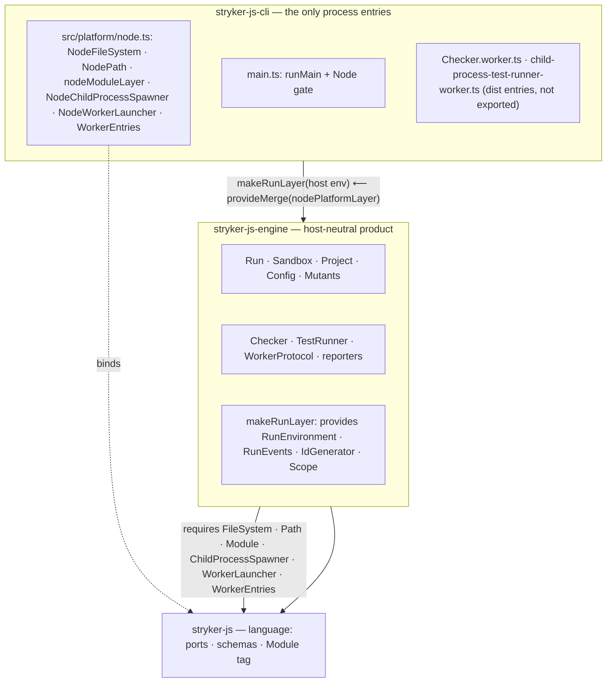

# Split Stryker Engine From Node Host - Plan

## Goal Capsule

- **Objective:** An adopter can install an engine package whose manifest and imports name no host runtime, while the Node `stryker` bin behaves exactly as today — so a future Bun or Deno root is one process entry, not a package fork.
- **Means:** Split `@systemfsoftware/stryker-js-platform-node` into `@systemfsoftware/stryker-js-engine` (host-neutral product) plus Node composition roots moved into `@systemfsoftware/stryker-js-cli`; delete the platform-node name (KTD1, KTD2).
- **Authority:** Session 2026-09-01 user directives (KTD1–KTD4). This plan's Requirements displace any earlier package-layout decision that conflicts with them.
- **Stop conditions (PR failed):** any `NodeSocket` import under `engine/src`; any `@effect/platform-*` entry in the engine manifest; the name `stryker-js-platform-node` still present in live code, manifests, or package docs.
- **Execution profile:** one PR; units in dependency order; no standalone local mutation-testing validation run (behavior is proven by the unit/integration suites and the contract lane); no runtime-support claims beyond Node.
- **Tail:** `ce-work`, then LFG shipping (simplify, review, commit-push-PR, babysit).

---

## Product Contract

### Summary

Three packages, not four, not two:

1. `@systemfsoftware/stryker-js` — the mutation-testing language. Ports, schemas, `Module` tag. Import-pure. No engine, no platform.
2. `@systemfsoftware/stryker-js-engine` — the host-neutral engine: run stages, sandbox, project crawl, config, mutants, checker and test-runner capabilities, reporters, scoring, worker protocol. Requires `FileSystem`, `Path`, `ChildProcessSpawner`, `Module`, `WorkerLauncher`, `WorkerEntries`. Manifest names no `@effect/platform-*` package and carries no `engines` field.
3. `@systemfsoftware/stryker-js-cli` — the only published process entries. Owns `src/platform/node.ts`, the worker entry files, `runMain`, and the Node version gate; passes worker entry URLs into the engine.

No leftover `stryker-js-platform-node` re-export package: a shim keeps the old path resolvable, migrates no caller, and launders the engine into a host package.

### Problem Frame

The engine product lives in a package named after Node. `Run.ts`, `Sandbox.ts`, `Project.ts`, `Config.ts`, `Mutants.ts`, the checker, the test runner, the reporters, the scoring, and the workers are the product; Node is one process that can start it. The package manifest carries `@effect/platform-node`, `@effect/platform-node-shared`, and `engines.node >= 20` (verified: `packages/testing/mutation/stryker-js/platform-node/package.json:23-34,55-57`). A Bun or Deno root today means forking `Sandbox.ts` — a second copy of the product under `stryker-js-platform-bun`. The sandwich is inverted: composition-root code (`Checker.worker.ts`, `child-process-test-runner-worker.ts`, `WorkerSocket.ts`, `NodeModule.ts`) sits in the engine package, and the CLI reaches the engine through a package named after a runtime.

### Key Decisions

- Host-neutral engine package `@systemfsoftware/stryker-js-engine`; the Node host has no package of its own. (session-settled: user-directed — chosen over keeping a platform-suffixed host package and over folding the engine into the language package: a host-named package holds the product, and folding charges the engine's dependency weight to every plugin author.) Governs R1, R2, R7, R8.
- Engine requires ports; the CLI binds them at the process entry. (session-settled: user-directed — chosen over the engine providing Node layers: a Bun or Deno root swaps layers at the process, not forks `Sandbox.ts`.) Governs R3, R4, R5.
- No Bun or Deno entry ships in this work. (session-settled: user-directed — chosen over claiming runtime support: `main.ts` still gates on Node, so such a claim is a non-counting outcome.) Governs R10.

### Requirements

Packaging:

- R1. A new package `@systemfsoftware/stryker-js-engine` at `packages/testing/mutation/stryker-js/engine` owns the engine product moved from `platform-node/src`, excluding the Node adapter and worker composition-root files.
- R2. The engine manifest declares no `@effect/platform-*` package in any dependency block and carries no `engines` field.
- R7. `@systemfsoftware/stryker-js-platform-node` no longer exists: no directory, no manifest entry, no workspace import, no live doc reference. Historical `.changeset/` and `.changelogs/` entries are records, not live surface.

Host-neutrality:

- R3. No file under `engine/src` imports `@effect/platform-*`, a `node:` specifier, or `NodeSocket`.
- R4. `makeRunLayer` provides only run-internal services (`RunEnvironment`, `RunEvents`, `IdGenerator`, run `Scope`) and requires `FileSystem`, `Path`, `Module`, `ChildProcessSpawner`, `WorkerLauncher`, `WorkerEntries` from its caller.

CLI ownership:

- R5. The CLI owns every Node composition root — the two worker entry files, the `node:module` adapter, the Node worker launcher, `runMain`, the Node version gate — and passes the worker entry URLs into the engine.
- R6. The CLI keeps `engines.node` and gates the runtime from its own manifest; the engine exposes no `strykerEngines` export.

Language and behavior:

- R8. `@systemfsoftware/stryker-js` gains no engine or platform code; its role and import purity are unchanged.
- R9. The `stryker` bin surface is unchanged: commands, exit codes, NDJSON run-event framing, verdict-envelope semantics, and the `./config/base` preset path behave as today; the verdict envelope's version now reports the engine package's version.
- R10. No Bun or Deno entry ships; the only published process entry remains the Node CLI root.

Release:

- R11. Every publishable package whose turbo build hash changes ships a changeset intent; the engine's debut intent states the consumer-observable replacement of `@systemfsoftware/stryker-js-platform-node`.

### Scope Boundaries

- In scope: the package split, port extraction, worker/composition-root relocation, consumer migration, changesets, package docs.
- Deferred to follow-up work: a Bun or Deno process root; porting the engine's ambient `process.*` residue (`Reporter.ts` stdout default, `Sandbox.ts` platform/env reads, `unexpected-exit-handler.ts` exit hook) behind dedicated ports.
- Outside this work's identity: any runtime-support claim; any new engine feature; renaming the `stryker` bin.

### Success Criteria

- The three stop-condition greps (Verification Contract) return zero lines.
- `pnpm check:local` exits 0 with the new package graph; the CLI contract lane passes in CI.
- A reader of the engine manifest can tell Node is not assumed, without opening a source file.

---

## Planning Contract

### Key Technical Decisions

- KTD1. Three-package graph; `@systemfsoftware/stryker-js-engine` is the engine's only name; `@systemfsoftware/stryker-js-platform-node` is deleted with no shim. (session-settled: user-directed — chosen over a thin re-export host and over folding into the language package: a shim keeps the old path resolvable and migrates no caller.) Governs R1, R7.
- KTD2. Host-neutrality by required ports: the engine manifest carries no `@effect/platform-*` package and no `engines` field; `makeRunLayer` requires what it today provides (`packages/testing/mutation/stryker-js/platform-node/src/Run.ts:1187-1225` composes `NodeFileSystem.layer`, `NodePath.layer`, `nodeModuleLayer`, `NodeChildProcessSpawner.layer`). (session-settled: user-directed — chosen over manifest-only renaming with platform deps kept: the manifest is the audit surface.) Governs R2, R4.
- KTD3. One `WorkerLauncher` port owns spawn + address + connect: the engine keeps the wire contract — parent and child share one address, NDJSON RPC both sides, bounded connect retry (`Schedule.max([spaced(50), recurs(100)])`), child-exit raced against boot (`ChildProcessCrashedError`); the CLI implementation owns `process.execPath`, the POSIX-path/Windows-pipe address choice, the env-carried endpoint, and `NodeSocket`. (session-settled: user-directed — chosen over the engine keeping `NodeSocket`: an engine that imports `NodeSocket` fails the PR.) Governs R3, R5.
- KTD4. Worker entry URLs become provided data: a `WorkerEntries` service carries the checker and test-runner worker URLs; the CLI builds it from its own dist layout. Today the engine owns them (`platform-node/src/Checker.ts:212`, `platform-node/src/TestRunner.ts:127`, emitted by `platform-node/tsdown.config.ts:3-15`). (session-settled: user-directed — chosen over engine-owned worker files: the engine cannot know a host's dist layout.) Governs R5.
- KTD5. Node-driven engine integration tests move to the CLI `tests/` (`checker-group-then-check`, `exit-code`, `remembered-attribution`, `verdict-envelope`, plus `tests/__fixtures__`): the engine manifest cannot carry `@effect/platform-*` even as devDependencies, and real-I/O tests compose at the process-entry package. Unlabeled planning decision; gate: `pnpm --filter @systemfsoftware/stryker-js-engine test` passes without a platform devDependency.
- KTD6. Plugin-package tests that import `nodeModuleLayer` (`typescript-checker` `tests/Checker.integration.test.ts:4`, `vitest-runner` `tests/__fixtures__/vitest-runner-harness.ts:10`) substitute local `Module` test layers instead, per `packages/testing/mutation/stryker-js/stryker-js/src/Module.ts:18-20` ("tests substitute a layer"). A test requirement alone never widens a surface. Unlabeled planning decision.
- KTD7. Worker-facing engine wiring ships as the enumerated `./worker` entry (protocol groups `CheckerRpcs`/`TestRunnerRpcs`, `loadPlugins`, plugin `create`); CLI worker files import the engine only through that public specifier — no internal subpath is published and no engine internals are relative-imported across the package boundary. Unlabeled planning decision, resolving the moved-worker import route.

### High-Level Technical Design

Sequence: U1 creates the engine package (platform-node untouched, tree green); U2 moves the Node roots into the CLI and rewires it to the engine (platform-node intact, tree green); U3 deletes platform-node and migrates every remaining consumer; U4 ships changesets and runs the gates.

### Assumptions

- The engine debuts at `0.2.0` — the replaced package's version — so `strykerVersion` output does not move backwards.
- The engine's ambient `process.*` residue stays until a non-Node root owns porting it; this work claims no compatibility for it (R10).
- `@systemfsoftware/stryker-test-contribution` declares a runtime dependency on `stryker-js-platform-node` with zero source or test imports (verified by grep over the package); it is dropped.
- The `Project.ts` in-source test block that imports `NodeFileSystem` (`platform-node/src/Project.ts:447-452`) converts to an in-memory `FileSystem` fake so the engine test suite needs no host I/O.
- `engine` is the directory name, matching the sibling kebab-case convention (`platform-node`, `html-reporter`, `typescript-checker`).

### Grounding review

Three assumptions surfaced against the sources; mutation lens **Inversion** applied (first recorded cycle):

1. Publishing `makeRunLayer` stays legal as an inert binding — a lazy `Layer` description is not a composition root (warrant: Seemann, The Composition Root / DI-Friendly Library, via the corpus's inert-composition ruling, canon band). Survived: the target `makeRunLayer` constructs descriptions only.
2. The engine's ports are public because the CLI binds them, and a future Bun/Deno root is the predicted second binder — exactly one supported consumer composition exists today (warrant: port-publicity ruling, convention band over Martin 1996 / Seemann 2014 / Parnas 1972 canon). Survived: `WorkerLauncher`/`WorkerEntries` are consumer-bound; `nodeModuleLayer` is not exported by the engine (KTD6).
3. The `WorkerLauncher` seam fully encloses host specifics (warrant: Effect's own `@effect/platform` / `@effect/platform-node` split, effect.website docs and `packages/platform-node/src/NodeFileSystem.ts`; Deno's `node:net` compatibility layer, docs.deno.com/api/node/net). Survived as assumption: ambient `process.*` residue is recorded, not claimed portable.

Radical alternative tested under the lens — fold the engine into the CLI (two packages): rejected; the engine earns its package by contamination quarantine (instrumenter, hashes, diff, minimatch) and as the future second binder, and the manifest is the audit surface for R2.

---

## Implementation Units

### U1. Create the host-neutral engine package

- **Goal:** `@systemfsoftware/stryker-js-engine` exists with the engine product and a clean manifest; nothing consumes it yet.
- **Requirements:** R1, R2, R3, R4, R8.
- **Dependencies:** none.
- **Files:**
  - create `packages/testing/mutation/stryker-js/engine/package.json` — name `@systemfsoftware/stryker-js-engine`, version `0.2.0`, no `engines`, dependencies `@systemfsoftware/stryker-js`, `@systemfsoftware/stryker-js-instrumenter`, `@systemfsoftware/effect-cell-types`, `@noble/hashes`, `diff-match-patch`, `minimatch`, `mutation-testing-metrics`, `mutation-testing-report-schema`; peer `effect`; devDependencies = platform-node's minus `@effect/platform*`; `exports`: `.`, `./builtin-reporters`, `./config/base`, `./worker`, `./package.json`; keep `inlinedDependencies` for `@jsr/std__jsonc`
  - create `packages/testing/mutation/stryker-js/engine/tsdown.config.ts` (entries `index`, `config/base`, `builtin-reporters`, `worker`; no internal worker chunks) and `engine/oxlint.config.ts`
  - move `platform-node/src/*` to `engine/src/` except `NodeModule.ts`, `WorkerSocket.ts`, `Checker.worker.ts`, `child-process-test-runner-worker.ts`
  - in-source `import.meta.vitest` test blocks move with their sources; every file under `platform-node/tests/` is Node-driven and moves to the CLI in U2
  - create `engine/src/WorkerLauncher.ts` — port service: spawn a worker child, return `{ pid, clientLayer, exited }`; carry `connectRetry` and the crash semantics from `WorkerSocket.ts`
  - create `engine/src/WorkerEntries.ts` — service carrying checker and test-runner worker entry URLs
  - edit `engine/src/Checker.ts`, `engine/src/TestRunner.ts` — consume `WorkerEntries` + `WorkerLauncher` instead of building `new URL('./internal/*.mjs', import.meta.url)`; delete the stale `oxlint-disable no-restricted-imports` at `TestRunner.ts:1`
  - edit `engine/src/Run.ts` — drop the platform imports (`Run.ts:1-2`); every inline Node-layer provide becomes a port requirement: `makeRunLayer` (`Run.ts:1187-1225`) and the reporter-resolution site (`Run.ts:385`, which provides `NodeFileSystem`/`NodePath`/`nodeModuleLayer`) require the six ports from their caller
  - edit `engine/src/Plugins.ts` — drop the `NodeFileSystem`/`NodePath`/`nodeModuleLayer` imports (`Plugins.ts:14,21`); the plugin-loader Cell requires `FileSystem`/`Path`/`Module` from its caller instead of the inline `Layer.mergeAll` provide (`Plugins.ts:303`); `Config.ts` callers of the loader thread the same ports
  - edit `engine/src/Project.ts` — convert the in-source test block to the in-memory `FileSystem` fake
  - edit `engine/src/stryker-package.ts` + `engine/src/index.ts` — keep `strykerVersion`, delete the `strykerEngines` export
  - rename context-tag literals: `Run.ts:108`, `Sandbox.ts:332-333`, `Worker.ts:11-13`, `unexpected-exit-handler.ts:10-12` → `'@systemfsoftware/stryker-js-engine/…'`
- **Approach:**
  1. Copy-adapt sources; fix internal imports; rename tags.
  2. Extract the two new port services; rewire `Checker`/`TestRunner`/`Run`.
  3. Strip every platform import; manifest last, then grep.
- **Patterns to follow:** `docs/solutions/architecture-patterns/a-port-beat-every-exemption-for-banned-imports.md` (Tag in engine, host call in the adapter, composed at entries); `docs/solutions/tooling-decisions/tsdown-manages-publishconfig-during-build.md` (exports via tsdown).
- **Test scenarios:**
  - `pnpm --filter @systemfsoftware/stryker-js-engine build` emits the three declared entries and no `internal/` chunks.
  - Importing `engine` in a fresh process performs no I/O (import-purity property; the manifest already names no platform package).
  - Engine unit tests pass with fake `FileSystem`/`Path`/`Module` layers; the converted `Project.ts` test fails if the fake is removed.
  - Grep `@effect/platform|node:|NodeSocket` over `engine/src` returns zero lines.
- **Verification:** engine manifest greps clean; `pnpm --filter @systemfsoftware/stryker-js-engine test` exits 0; `pnpm check:local` exits 0 with platform-node still present.

### U2. Move Node composition roots into the CLI and rewire it to the engine

- **Goal:** The CLI is the only Node composition root and reaches the engine by its new name; platform-node still exists but has no live CLI consumer.
- **Requirements:** R4, R5, R6, R9.
- **Dependencies:** U1.
- **Files:**
  - create `packages/testing/mutation/stryker-js/cli/src/platform/node.ts` — `nodeModuleLayer` (from `NodeModule.ts`), `nodeWorkerLauncherLayer` (from the `WorkerSocket.ts` body: address choice, env-carried endpoint, `process.execPath`, `NodeSocket` protocol client), `workerEntriesLayer` (URLs into the CLI's own dist), and a merged `nodePlatformLayer`
  - move `Checker.worker.ts`, `child-process-test-runner-worker.ts` to `cli/src/`, rewiring their engine-bound imports (`WorkerProtocol`, `Plugins`, worker schemas) to `@systemfsoftware/stryker-js-engine/worker`; worker files keep `NodeFileSystem`/`NodePath`/`NodeSocketServer` composition
  - edit `cli/tsdown.config.ts` — add the two worker entries and the `customExports` deletion pattern from `platform-node/tsdown.config.ts:18-24`
  - edit `cli/src/main.ts` — keep the Node gate but read `engines` from the CLI's own manifest; compose `nodePlatformLayer`; engine imports by the new name
  - edit `cli/src/Cli.ts` — imports from `@systemfsoftware/stryker-js-engine`; `makeRunLayer(...)` composed with `nodePlatformLayer` (`Cli.ts:1103`, `Cli.ts:1154`); `readCoreEntries` resolves the engine manifest (`Cli.ts:526`); builtin reporters resolve `@systemfsoftware/stryker-js-engine/builtin-reporters` (`Cli.ts:1115`)
  - edit `cli/src/Output.ts`, `cli/src/Output.workflow.ts`, `cli/src/StrykerRun.ts`, `cli/src/Survivors.ts` — engine imports; `Survivors.ts` takes `nodeModuleLayer` from `./platform/node.js`
  - edit `cli/package.json` — dependency swap `stryker-js-platform-node` → `stryker-js-engine`
  - move `platform-node/tests/{checker-group-then-check,exit-code,remembered-attribution,verdict-envelope}.integration.test.ts` + `tests/__fixtures__` to `cli/tests/`, composed over `nodePlatformLayer`
  - edit `cli/global-setup.ts:15-22` — `WORKSPACE_PACKAGES` names the engine
- **Approach:**
  1. Port the Node adapter and worker launcher into `src/platform/node.ts`; wire `WorkerEntries` from the CLI dist layout.
  2. Rewire CLI imports and layer composition; move the integration tests.
  3. Contract invariant preserved: parent and child share one address, NDJSON both sides; worker entries are dist files, not exported specifiers.
- **Patterns to follow:** `docs/solutions/build-errors/composition-root-cannot-self-detect-as-entry.md` (worker entries as dedicated no-export entries); `docs/solutions/tooling-decisions/spawning-a-typescript-worker-in-tests.md` (spawn the built dist entry).
- **Test scenarios:**
  - The moved integration tests pass from `cli/tests/` through `nodePlatformLayer`.
  - `cli-contract`-style probe: importing each declared engine entry from a clean Node process succeeds and `dist/internal/*` worker files are not resolvable as specifiers (`ERR_PACKAGE_PATH_NOT_EXPORTED`).
  - A mutation run through the CLI bin kills a mutant in a fixture (existing integration coverage).
- **Verification:** `pnpm --filter @systemfsoftware/stryker-js-cli build` emits `main` + two worker entries; `pnpm --filter @systemfsoftware/stryker-js-cli test` exits 0; CLI manifest has no `stryker-js-platform-node` reference.

### U3. Delete platform-node and migrate every remaining consumer

- **Goal:** The name `@systemfsoftware/stryker-js-platform-node` is gone from the working tree outside `.changeset/`/`.changelogs/` history.
- **Requirements:** R6, R7, R8, R9.
- **Dependencies:** U2.
- **Files:**
  - delete `packages/testing/mutation/stryker-js/platform-node/`
  - edit `packages/testing/mutation/stryker-js/typescript-checker/tests/Checker.integration.test.ts` — local `Module` test layer; drop the platform-node devDependency from `typescript-checker/package.json`
  - edit `packages/testing/mutation/stryker-js/vitest-runner/tests/__fixtures__/vitest-runner-harness.ts` — local `Module` test layer; drop the devDependency from `vitest-runner/package.json`
  - edit `packages/testing/mutation/plugins/stryker-test-contribution/package.json` — drop the unused dependency
  - edit `packages/lint/oxlint/plugins/meta/recommended/scripts/guard-no-behavior.mjs:15` — package list names the engine
  - edit `packages/testing/mutation/stryker-js/cli/tests/cli-contract.integration.test.ts` — core-manifest path and entry probes target the engine (`:130`, `:157`); the engines-floor probe reads the CLI manifest, the only package keeping `engines.node` (`:168-171`, `:739`)
  - edit docs: `stryker-js/README.md:4-5`, `cli/README.md:87`, `cli/AGENTS.md:7`, `html-reporter/README.md:19`; reword the stale `platform-node` comment in `html-reporter/tests/stryker-plugins.integration.test.ts:13`; create `engine/README.md` and `engine/AGENTS.md` (engine-owned docs, no Node-host claims)
  - create local `Module` test layers for the two plugin packages: a shared-shape fixture in `typescript-checker/tests/` and `vitest-runner/tests/__fixtures__/` implementing the `Module` port with fixed paths
- **Approach:**
  1. Grep-driven consumer sweep (`@systemfsoftware/stryker-js-platform-node` over the workspace, excluding `.changeset/`, `.changelogs/`); migrate each hit; delete the directory last.
- **Patterns to follow:** removal is complete in one change — definition, callers, tests, docs (CONST-S4 discipline; `git grep` gate below).
- **Test scenarios:**
  - `pnpm check:local` exits 0 after deletion (turbo boundary audit re-derives the graph with the new edges).
  - `typescript-checker` and `vitest-runner` suites pass with the local `Module` layers.
- **Verification:** the R7 grep (Verification Contract) returns zero lines; no `.changeset/` history was rewritten.

### U4. Changesets and final gates

- **Goal:** Release intents match the re-hashed publish surface; all stop-condition greps are clean.
- **Requirements:** R2, R3, R7, R11.
- **Dependencies:** U3.
- **Files:**
  - add `.changeset/` intents via `pnpm change --bump …`: the engine debut intent (states the replacement of `@systemfsoftware/stryker-js-platform-node` and the required port set); intents for every publishable package whose turbo build hash changed — expect `stryker-js-cli` (sources + dependency swap), `stryker-js-typescript-checker`, `stryker-js-vitest-runner`, `stryker-test-contribution` (manifest edits), plus any further re-hashed package `pnpm change` reports, at `none` or `patch` per consumer-observable impact
- **Approach:**
  1. Run the verification chain; write intents naming exactly the re-hashed packages (`pnpm change` computes the requirement; per `docs/solutions/build-errors/changeset-gate-transitive-build-hash.md` the intent must name each transitively re-hashed publishable package).
  2. Run the three stop-condition greps and the full gate.
- **Test scenarios:**
  - `.github/workflows/changeset-check.yml` verdict: no missing-intent finding for the diff.
  - `attw --pack .` passes for engine and cli (types resolve through the rollups).
- **Verification:** `pnpm check:local` exits 0; all R2/R3/R7 greps zero; changeset bodies carry consumer-observable facts only.

---

## Verification Contract

| Gate                 | Command / check                                                                                                                           | Proves                                                             |
| -------------------- | ----------------------------------------------------------------------------------------------------------------------------------------- | ------------------------------------------------------------------ |
| Full local gate      | `pnpm check:local`                                                                                                                        | build, lint, typecheck, tests, boundary audit across the new graph |
| Engine isolation     | `grep -rn "@effect/platform" packages/testing/mutation/stryker-js/engine/package.json` → zero                                             | R2                                                                 |
| Engine import purity | `grep -rn "@effect/platform\|node:\|NodeSocket\|platform-node" packages/testing/mutation/stryker-js/engine/src` → zero                    | R3, R7                                                             |
| Name deleted         | `git grep -nI "stryker-js-platform-node" -- . ':(exclude).changeset' ':(exclude).changelogs'` → zero lines (read stdout; exit 1 is clean) | R7                                                                 |
| Engine suite         | `pnpm --filter @systemfsoftware/stryker-js-engine build && pnpm --filter @systemfsoftware/stryker-js-engine test`                         | U1                                                                 |
| CLI suite            | `pnpm --filter @systemfsoftware/stryker-js-cli test`                                                                                      | U2                                                                 |
| Contract lane        | `pnpm --filter @systemfsoftware/stryker-js-cli test:contract` (container; CI watches it)                                                  | R9                                                                 |
| Type resolution      | `pnpm --filter @systemfsoftware/stryker-js-engine attw && pnpm --filter @systemfsoftware/stryker-js-cli attw`                             | published exports resolve                                          |
| Changeset verdict    | CI `changeset-check` job green                                                                                                            | R11                                                                |

---

## Definition of Done

- All units U1–U4 landed in dependency order; every R-ID's gate green.
- The three stop-condition greps return zero; the CLI bin, exit codes, event framing, and verdict semantics verified unchanged by the moved integration tests and the contract lane.
- Engine and CLI package docs exist and describe the new graph; no doc presents the deleted package as live.
- Changeset intents present for every re-hashed publishable package; bodies state consumer-observable facts only.
- No dead code, no compatibility shim, no `.changeset/` history rewrite; the tree is restartable (`pnpm check:local` from a fresh install exits 0).

---

## Sources

- `packages/testing/mutation/stryker-js/platform-node/package.json` — manifest coupling (platform deps, engines pin, exports, worker emission)
- `packages/testing/mutation/stryker-js/platform-node/src/Run.ts:96-109,1185-1225` — `RunEnvironment`, `makeRunLayer` providing Node layers
- `packages/testing/mutation/stryker-js/platform-node/src/WorkerSocket.ts` — spawn + address + `NodeSocket` client; `NodeModule.ts` — the `Module` port adapter
- `packages/testing/mutation/stryker-js/platform-node/src/Checker.ts:211-215`, `src/TestRunner.ts:1,126-132` — engine-owned worker entry URLs; stale lint exemption
- `packages/testing/mutation/stryker-js/cli/src/main.ts`, `src/Cli.ts:522-553,1100-1160` — CLI composition root, engine resolution points
- `packages/testing/mutation/stryker-js/cli/global-setup.ts:15-22`, `tests/cli-contract.integration.test.ts:129-160` — contract-lane package list and entry probes
- `docs/solutions/architecture-patterns/a-port-beat-every-exemption-for-banned-imports.md` — port/adapter precedent and transport invariants
- `docs/solutions/build-errors/changeset-gate-transitive-build-hash.md`, `docs/solutions/tooling-decisions/tsdown-manages-publishconfig-during-build.md`, `docs/solutions/build-errors/composition-root-cannot-self-detect-as-entry.md` — release and packaging gates
- Effect platform split precedent: effect.website/docs/platform/introduction, github.com/Effect-TS/effect `packages/platform-node/src/NodeFileSystem.ts`; Deno `node:net` compatibility: docs.deno.com/api/node/net
- Wiki grounding (session-local corpus, not committed): port-publicity and inert-composition rulings; Seemann composition-root canon — see Grounding review
