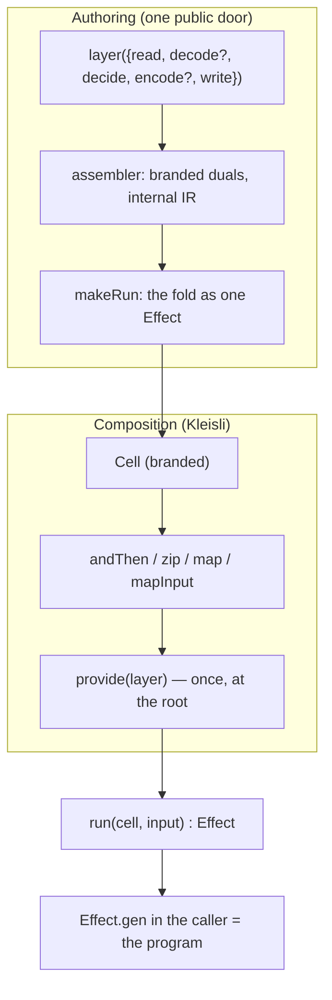

# Cell as a branded Kleisli arrow — the end-game cell-types surface

## Goal Capsule

- **Objective:** a consumer anywhere in this monorepo who imports the cell package holds a `Cell<I, A, E, R>` whose required services are visible on the type and provided exactly once at the composition root. No `Phases`-bag type, no `apply`, and no `Effect.provideContext`/inline-layer laundering exists in any package after this ships.
- **Means:** the Kleisli rewrite specified by the user's design docs (paste-1/paste-2, this session) — `Cell<in I, out A, out E = never, out R = never>` with HKT `TypeLambda`/`Kind`, `layer` as the only public constructor with `R` inferred from bodies, combinators `map`/`mapInput`/`andThen`/`zip`/`provide`/`withPolicy`, and dual `run` replacing `apply` (KTD1, KTD2).
- **Authority hierarchy:** the two user-authored design docs outrank the previous plan (`docs/plans/2026-09-01-0336-refactor-cell-one-sandwich-plan.md`), CONCEPTS.md phrasing, and PR #341's interim surface wherever they conflict; where the docs are silent, this plan's KTDs decide; where the plan is silent, the executor decides and records.
- **Stop conditions:** the pipeline's own gates (blocked plan report, invalid review return); per-unit stop conditions in Definition of Done.
- **Execution profile:** LFG pipeline — `ce-work` executes all units to Definition of Done in one branch and one PR; no synchronous user.

---

## Product Contract

### Summary

`@systemfsoftware/effect-cell-types` currently publishes a phase-bag: `Cell.read … Cell.write` build a `WriteDone
` "description", `Cell.apply` interprets it, and the impure phase types pin their requirements channel to `never`. That pin is the bug: every real consumer needs services, so every site launders them — a `Context` builder parameter with `provideContext` inside each phase (Sandbox, Config), closures over factory params (engine Reporters), inline `Layer.mergeAll` per phase (Survivors), or a `Ref`/`let` smuggling read state to the write. The end game replaces the bag with the computation itself: a `Cell` is a branded Kleisli arrow `(input: I) => Effect<A, E, R>` — the same three channels Effect publishes, with `R` inferred from phase bodies and eliminated once, at the composition root.

### Problem Frame

PR #341 made one sandwich the unit and the shell the only composer. It kept the description as a value with an erased environment, which made every consumer invent a private injection ritual and left read→write state flowing through mutable variables — the exact defects the mutable-state sweep (engine/html reporters, Survivors) was patching one site at a time. The user's verdict: the patch is wrong because the type lies. A third party holding `WriteDone
` holds "an untyped closure with a souvenir bag"; holding `Cell<I, A, E, R>` holds a runnable, composable value whose services they can see.

### Requirements

Core surface

- R1. The published namespace exports `Cell<in I, out A, out E = never, out R = never>` branded with `CellTypeId` (`Symbol.for('@systemfsoftware/effect-cell-types/Cell')`), carrying `readonly run: (input: I) => Effect.Effect<A, E, R>`. Variance: `I` contravariant; `A`, `E`, `R` covariant.
- R2. `TypeLambda` and `Kind` are exported. `CellTypeLambda extends HKTTypeLambda` with `type: Cell<this['In'], this['Target'], this['Out2'], this['Out1']>` — slot map identical to `effect/HKT` (verified verbatim against `repos/effect/packages/effect/src/HKT.ts`: `In` contravariant input, `Out2` errors, `Out1` context, `Target` main). `Kind<I, E, R, A> = HKTKind<TypeLambda, I, E, R, A>`.
- R3. `layer` is the only public constructor. Two overloads — short form `{read, decide, write}` and long form `{read, decode, decide, encode, write}` — returning `Cell<I, A, RE | DE | WE, RR | WR>` / `Cell<I, A, RE | DecE | DE | WE, RR | WR>` respectively. `R` is inferred from the bodies and never written by authors. `decide` must carry the `WorkflowBrand`. Inference uses zero casts and zero `any`.
- R4. `run` is a dual (`(self, input)` / `(input) => (self) => …`) replacing `apply`, which is deleted. A `Run<I, A, E, R>` alias hides `never`-valued `R` from hover: `[never] extends [R] ? (input) => Effect<A, E> : (input) => Effect<A, E, R>`.
- R5. Combinators ship in the same break: `map`, `mapInput`, `andThen` (this Cell's response is the next Cell's input; unions `E` and `R`), `zip` (same input, tuple outputs, unions `E` and `R`), `provide` (`Cell<I, A, E | LE, RIn | Exclude<R, ROut>>` — the one composition-root elimination), `withPolicy` (`Policy.Policy<A, E, R>` wraps `run`).
- R6. The phase machinery — `Phases`, `ReadPhase
`, `WritePhase
`, the node interfaces, `Description
`, `ReadDone`…`WriteDone` — becomes assembler-internal: present in the module, absent from the published surface. The branded duals (`read`/`decode`/`decide`/`encode`/`write`) survive as the assembler's internals; hand-chaining them still eats TS2741. `apply` is gone from the surface (`apply`/`run` share fate per R4).
- R7. `canonical` becomes `Cell<CanonicalCommand, void>`, and `Cell.vocabulary` remains the walk over the assembler's internal IR. `Vocabulary` and `PhaseFact` are deliberately public — they are the frozen plugin contract (KD3): `module`, `ioCells`, `phases: PhaseFact[]`, `byKind`, `composer`. `applier` is deleted (no consumer reads it); plugins never see `R`.
- R8. `decode`/`encode` stay pure (`Result`-returning, no `R`). `Workflow.make` remains the only door into `decide`; `Wire` and `Policy` are unchanged; `withPolicy` wraps `run`.
- R9. Every in-repo consumer is migrated: no `Cell.apply(`, no `Phases`/`WriteDone`/`ReadDone` imports, no per-phase `provideContext` and no inline per-phase `Layer.mergeAll` anywhere. Multi-sandwich sequencing is `andThen`/`zip` in the shell; services are provided once at the composition root.
- R10. `unknown` appears only in inherited `TypeLambda` slot positions — never as an inhabited bag member. An `unknown` in an error-channel slot (e.g. a `decodeError` that resists a closed type) is allowed only with the reason stated at that site; concretize where the failure mode is closed.

Consumer contract

- R11. A phase body that yields a service (`const fs = yield* FileSystem.FileSystem`) publishes that service on the Cell's `R` without annotation. A missing `provide` at the root is a compile error, and the root is the only place one is needed.
- R12. Migration is a clean cutover: no deprecated alias of `apply`, no re-export shim of the bag types, no `readR`-style field (nothing earns a fourth channel).

### Key Decisions

- KD1. The phase bag is not public surface. Governs R1, R6, R12. (session-settled: user-directed — chosen over keeping `WriteDone
` published: a third party holding it holds an untyped closure with a souvenir bag).
- KD2. The `R=never` pin on impure phases was the laundering bug. Governs R3, R9, R11. (session-settled: user-directed — chosen over keeping the pin: every real site laundered via Context params, closures, inline layers, or Ref/let smuggling).
- KD3. The lint-plugin contract is frozen. Governs R7. (session-settled: user-directed — chosen over exposing `R` to plugins: plugins decide purity and I/O classification, never environment).

### Acceptance Examples

- AE1. `Cell.layer({read, decide, write})` (identity decode/encode) infers `Cell<I, A, E>` with `R = never`; hover shows `Run<I, A, E>` without a trailing `never`.
- AE2. A `read` body with `yield* FileSystem.FileSystem` publishes `R = FileSystem.FileSystem` on the Cell. Deleting the root `Effect.provide`/`Cell.provide` is a compile error naming `FileSystem`; adding it exactly once clears the error.
- AE3. `pipe(a, Cell.andThen(b))` where `a: Cell<I, A, E, R>` and `b: Cell<A, B, E2, R2>` type-checks only when `a`'s response is assignable to `b`'s input, yielding `Cell<I, B, E | E2, R | R2>`.
- AE4. `Cell.zip(a, b)` on two `Cell<I, …>` yields `Cell<I, [Aout, Bout], E | E2, R | R2>`; the tuple members appear in declared left-to-right order.
- AE5. `Cell.provide(NodeFileSystem.layer)` on a Cell with `R = FileSystem.FileSystem` yields a Cell whose `R` no longer mentions `FileSystem`; a layer missing a still-required service leaves that service in `R` (visible, not silently erased).

### Scope Boundaries

- Deferred for later: generator-side property redesign beyond drawn-Cell ≡ chain-assembled equivalence; plugin rules walking `andThen`/`zip` chains (rules stay fixture-shape-based until a real need).
- Outside this product's identity: runtime validation of `layer` specs (the type system is the guard); a `Cell.Do` builder; any fourth channel.

---

## Planning Contract

### Key Technical Decisions

- KTD1. `Cell` is a branded Kleisli arrow with HKT `TypeLambda`/`Kind`, and the combinators ship in the same breaking release as `Kind` — shipping `Kind` alone is dead weight, and shipping combinators without it invites a parallel arity. (session-settled: user-directed — chosen over incremental retention of the phase-bag surface: PR #341 stopped before replacing `layers`/`previous` with the actual composition vocabulary).
- KTD2. `apply` is deleted; `run` is a dual and the only entry. (session-settled: user-directed — chosen over a deprecated `apply` alias: clean cutover, the design names `apply` in the what-dies table).
- KTD3. The assembler keeps the internal phase-node IR that `canonical`/`vocabulary` are built from; `layerImpl` chains the branded duals and hands the fold to `makeRun`. Purity of `decide` stays the `WorkflowBrand` conjunct; the walk contract (CELL-T3) is unchanged. Cites R6, R7.
- KTD4. Uncommitted working-tree edits from the mutable-state round (`engine/src/Reporter.ts`, `html-reporter/src/Reporter.ts`, `cli/src/Survivors.ts`) are reverted, not absorbed; the branch restarts from pushed commit `7c8832d2136`. Grounded against the diff (authored this session, read before this plan): engine/Reporter = reports ride the command, held lets deleted (re-authored by U4); html-reporter = pipe migrated to layer plus apply moved into `onMutationTestReportReady` (re-authored by U5); Survivors = a broken half-edit (duplicated `Effect.map`, abandoned `pathService` parameter) with nothing salvageable (re-authored by U5). Nothing else is in the diff.
- **Implementation constraints:** the end-game design outranks lint doctrine — when an oxlint rule (or any gate) blocks a Cell-world construction, the RULE is revised in its own commit (evaluator surface, red-then-green), never worked around in the consumer code. `Effect.gen` remains the body of phases; no `any`/casts in `layer` inference.
- KTD5. Consumer sequencing becomes `andThen` chains. The narrowing rule, one for all sites: where the prior stage's response type IS the next stage's command type (assignable without narrowing), `andThen` is sufficient and the runtime converters (`toPrepareExecutorArgs` where still needed for malformed input, `toPrepareDone`, `toInstrumentDone`, `toDryRunDone`) die — the stages now declare the prior stage's `*Done` as their command; where it is not assignable, the difference is a missing pipeline adapter and the next stage gets an explicit `Schema` decode phase. `zip` is reserved for callers that genuinely fan one command over independent Cells; the engine is sequential and uses `andThen` end-to-end. Inference bet (recorded as assumption): stage responses already are the next stage's commands up to type-level narrowing.
- KTD6. The tstyche suite is rewritten from bag-inference/refusal assertions to Cell assertions, preserving today's load-bearing cases in Cell form: layer short/long inference; `R` publication (a body yielding `FileSystem` widens `R`) and its negative (a body that does not yield a service must not have it in `R`); `Run` hover vanishing; `andThen`/`zip` unions; `provide` elimination (single service, chained provides, `Run` interplay); the write's `(output, raw)` two-parameter shape; the deleted-`layers` literal-key rejection; variance probes (`I` contravariant, `E`/`R` covariant, `A` invariant through `Kind`); and the refusal classes (a spec with decode but no encode; `decide` without `WorkflowBrand`).
- KTD7. Changesets: `@systemfsoftware/effect-cell-types` major. The `none` sweep file for hash-moved consumers is finalized at U6 time, after the per-package surface verdicts above settle — a package whose published surface moves gets its own bump instead.

### High-Level Technical Design

The interpreter fold does not disappear; it stops being an API. `makeRun` is the same left-fold `apply` performed, wrapped so a `Cell` IS the applied form waiting for an input. `vocabulary` walks the internal phase nodes `layer` retains — the only place the bag still exists, and the only place plugins look.

Consumer shape after (paste-2's spine, the engine's real shape):

`pipe(loadProject, Cell.andThen(prepareSandbox), Cell.andThen(makePlan), …, Cell.provide(AppLayer))` — one provide, at the end, for everything.

### Assumptions

- `zip` runs both Cells to completion (both are whole sandwiches with writes) and fails fast on the first failure, matching `Effect.all`'s default concurrency-sequential fail-fast; the spec does not state it.
- Stage converter functions die under `andThen`'s typing (KTD5); where a stage's response needs genuine runtime narrowing (Schema), that narrowing is the `decode` phase of the next Cell.
- The in-flight uncommitted edits carry no unique intent beyond what U4/U5 re-author (KTD4).
- `Policy.Policy<A, E, R>`'s existing shape accepts wrapping `run` without variance changes.

### Sequencing

Types first (core + combinators), then the generator (it consumes the core's construction path), then consumers in dependency order (engine → cli/html → daemon-spec), then doctrine/changesets. Each unit leaves `pnpm check:local` green; no unit imports a later unit's work.

---

## Implementation Units

### U1. Core: `Cell`, HKT, `layer`, `run`, internal assembler

- **Goal:** the published surface of `packages/core/effect/cell/types` is the Cell spine (R1–R4, R6, R7, R10, R12).
- **Requirements:** R1, R2, R3, R4, R6, R7, R10, R12; KD1, KD2; cites KTD1, KTD2, KTD3.
- **Dependencies:** none.
- **Files:** `packages/core/effect/cell/types/src/Cell.ts`, `packages/core/effect/cell/types/src/Workflow.ts` (unchanged), `packages/core/effect/cell/types/src/mod.ts`, `packages/core/effect/cell/types/src/CanonicalDecide.workflow.ts`; tests `packages/core/effect/cell/types/test-types/Cell.tst.ts`, `packages/core/effect/cell/types/tests/interpreter.integration.test.ts`.
- **Approach:**
  1. Declare `CellTypeId`, `Cell<in I, out A, out E, out R>`, `TypeLambda`, `Kind`, `Run` alias per R1/R2/R4.
  2. Keep the phase-node constructors and the fold as `makeRun` internals. `R`/`E` inference strategy: each impure phase lambda's return type is inferred (`Effect<A, E, R>` — `infer R` / `infer E` per phase), each pure phase's from its `Result`; the union accumulates into the overloads' return type `Cell<I, A, RE | DecE | DE | WE, RR | WR>` — no conditional-type accumulator over the bag is needed because the overloads are written per-form (the keyless-union pattern from `docs/solutions/architecture-patterns/typed-overloads-need-a-keyless-union.md`).
  3. Rebuild `canonical` as `Cell<CanonicalCommand, void>` through `layer`; keep `vocabulary` derived from the internal nodes `layer` retains; `Vocabulary`/`PhaseFact` stay public (the plugin contract, R7); `applier` is deleted from the vocabulary literal.
  4. Module split: move the phase machinery (`Phases`, the phase aliases, node interfaces, `Description`, the `*Done` markers) into `src/internal/phases.ts`; `mod.ts` exports only `Cell`, `TypeLambda`, `Kind`, `Run`, `layer`, `run`, the six combinators, `canonical`, `vocabulary`, and the `DESCRIPTION_MODULE`/`IO_CELLS` constants — all under the `Cell.` namespace, no flat exports. `apply` is deleted outright.
  5. `run` dual call-style rule: data-first `Cell.run(cell, input)` inside `Effect.gen` shells; data-last `pipe(input, Cell.run)` reserved for `andThen`-chain tails.
  6. Rewrite `Cell.tst.ts` (KTD6) and the integration suite around `run`.
- **Test scenarios:**
  - Happy: short-form `layer` on a two-channel bag infers `Cell<C, Resp, never, never>`; long form infers the full bag union for `E` and `R`.
  - Happy: `run(cell, input)` returns the write's response; data-last `run(input)(cell)` compiles.
  - Edge: `Run` alias hides `never`-`R` (assignable to `(i) => Effect<A, E>`); a non-never `R` stays visible.
  - Refusal: spec with `decode` but no `encode` fails inference (TS2741, named missing property); `decide` built without `Workflow.make` fails the brand conjunct; a `read` body returning the wrong raw type fails.
  - Variance: `Cell<I, A, E, R>` assignable where a `(I) => Effect<A, E, R>` is expected (co/contravariance probe through `Kind`).
  - Integration: `canonical` answers via `run` exactly as today; `vocabulary` fields byte-identical to the current walk (module, ioCells, phases: PhaseFact[], byKind, composer) with `applier` gone.
- **Verification:** `pnpm --filter @systemfsoftware/effect-cell-types typecheck test build` all exit 0; api-extractor golden regenerated and diffed deliberately.

### U2. Combinators

- **Goal:** `map`, `mapInput`, `andThen`, `zip`, `provide`, `withPolicy` on the Cell type (R5, R8; AE3–AE5).
- **Requirements:** R5, R8, R11; KD1; cites KTD1.
- **Dependencies:** U1.
- **Files:** `packages/core/effect/cell/types/src/Cell.ts` (or a sibling `Combinators.ts` re-exported by `mod.ts`); `packages/core/effect/cell/types/test-types/Combinators.tst.ts`; `packages/core/effect/cell/types/tests/combinators.integration.test.ts`.
- **Approach:**
  1. Each combinator returns `makeRun`-backed Cells; `andThen` is `Kleisli` composition (bind), `zip` sequences both against the same input and tuples.
  2. `provide` takes a `Layer<ROut, LE, RIn>` and narrows `R` via `Exclude<R, ROut>`, unioning `LE` into `E`.
  3. `withPolicy` lifts a `Policy.Policy<A, E, R>` into a combinator on Cell — `pipe(cell, Cell.withPolicy(policy))` — symmetric with the other arrows; the `Policy` type itself already enforces channel preservation.
- **Test scenarios:**
  - Happy: `map` transforms a Cell's response (transformed value reaches the write); `mapInput` feeds a reshaped input.
  - Happy: `andThen` chains two Cells; the second's read receives the first's write response (reference equality in a recording Cell).
  - Happy: `zip` runs both against one input and tuples responses; both writes ran.
  - Edge: `zip` short-circuits when the left Cell fails (right's write never ran) per the fail-fast assumption.
  - Error: `andThen` unions both error channels; a refusal from either surfaces at `run`.
  - Integration: `provide(NodeFileSystem.layer)` on an `R = FileSystem` Cell clears `FileSystem` from `R` and the program runs; removing the provide is a compile error naming the service.
  - Integration: chained provides — a Cell with `R = X | Y | Z`, `provide(layerY)` then `provide(layerZ)`, leaves `R = X`; `Run` hides the `never` after the chain.
  - Integration: `provide` on a Cell whose `R` is a single service (non-union) narrows to `never`; a `Layer.effect` whose build fails flows `LE` into the Cell's `E` at `run`.
  - Integration: `withPolicy` retry policy re-runs a failing read and the trace shows both attempts.
- **Verification:** package typecheck + tests green; the type tests pin every combinator's inferred Cell type; every combinator has at least one behavioural integration scenario above (type pins alone are not the gate).

### U3. Generator rewrite

- **Goal:** the gen package draws and proves Cells (equivalence of drawn and chain-assembled composition), keeping the no-restatement law.
- **Requirements:** R3, R6; KD1; cites KTD6.
- **Dependencies:** U1, U2.
- **Files:** `packages/core/effect/cell/gen/src/Gen.ts`, `packages/core/effect/cell/gen/src/__tests__/DrawnDecision.workflow.property.test.ts`, `packages/core/effect/cell/gen/AGENTS.md` (property-count fields).
- **Approach:** the drawer produces spec objects (the `layer` input) instead of bag records; a `TraceRecorder` `Context.Service` (`packages/core/effect/cell/gen/src/Recorder.ts`: `record(phase)`, `writeObserved(value)`, `encodeObserved(outcome)`) is yielded by the substitute phase bodies; each property provides a fresh `TraceRecorder` layer in its host, so no closure-captured arrays survive. Properties assert drawn-Cell ≡ chain-assembled-Cell on declared order, trace, and response, failure draws included.
- **Test scenarios:**
  - Property: ∀ drawn spec, `run(layer(drawn), cmd)` and `run(chain(drawn), cmd)` share declared order and response.
  - Property: failure draws fail identically through both paths.
  - Edge: a drawn spec using `andThen` of two sub-Cells preserves interleaved trace order.
- **Verification:** `pnpm --filter @systemfsoftware/effect-cell-gen test` exit 0 with every property running; the leaf AGENTS.md counts updated to the real property count.

### U4. Engine migration

- **Goal:** every engine description becomes a Cell; stage sequencing becomes `andThen`; the runtime converters and per-phase provides die (R9, R11; AE2, AE3).
- **Requirements:** R9, R11, R12; KD2; cites KTD4, KTD5.
- **Dependencies:** U1, U2.
- **Files:** `packages/testing/mutation/stryker-js/engine/src/Run.ts`, `Checker.ts`, `Config.ts`, `Mutants.ts`, `Plugins.ts`, `Reporter.ts`, `Sandbox.ts`, plus their tests under `packages/testing/mutation/stryker-js/engine/tests/`.
- **Approach:**
  1. Revert the uncommitted working tree to `7c8832d2136` first (KTD4).
  2. Each `*Layer`/description builder becomes a `Cell.layer` value or builder; phase bodies `yield*` services (`R` flows); the `ctx: Context<…>` parameter and per-phase `provideContext` in Sandbox/Config die — the Cell's `R` carries the services and the shell provides once. New shapes, named: `prepareLayer`, `instrumentLayer`, `dryRunLayer` become Cell values (no `run: Layer<StageServices>` argument) with `R = StageServices`; `runMutationTest(cliOptions, targetMutatePatterns?)` returns `Effect<RunOutcome, StageError, StageServices>`; the composition root is the CLI entry (`cli/src/Cli.ts`), which keeps owning the host layer — the program provides at the Effect level after `run` (`Effect.scoped(runMutationTest(options)).pipe(Effect.provide(hostRunLayer))`), and `Cell.provide` is reserved for tests that want an `R = never` Cell. The engine's `Effect.gen` shell keeps its `Scope.make` and `RunEvents` yields — program scaffolding, not phase concerns.
  3. `Run.ts`: `prepare`/`instrument`/`dryRun` become three Cells composed with `andThen` per the KTD5 narrowing rule; `toPrepareDone`/`toInstrumentDone`/`toDryRunDone` are deleted (the stages declare the prior stage's `*Done` as their command; stage responses remain tagged classes, so downstream `Match.tag` dispatch is untouched — a type test asserts a plain object literal is not assignable at the bind site); `toPrepareExecutorArgs` survives only if a malformed-input guard is still needed, as an explicit `decode`-phase check.
  4. Reporters: the report pair rides the command; the factory takes `fs`/`out` as plain values; no held lets. Each migrated read body documents what its `raw` is (Sandbox: the command unchanged; Config: the gathered config product).
  5. Platform services are provided once at the shell; per-stage `Scope.Scope` remains stage-scoped (each stage's resources close before the next stage starts) — root provide covers cross-cutting services only. `ReporterService` boundary stays (it is the engine's event interface, not a Cell concern).
- **Test scenarios:**
  - Happy: `runMutationTest` executes the three-stage chain; each stage's response feeds the next (existing engine integration coverage re-pointed, including `engine/tests/cell-layer-composition.integration.test.ts` re-pointed to `andThen`).
  - Edge: a stage failure (StageError) surfaces with the stage's error type; downstream stage never ran.
  - Integration: reporter writes fire during `onMutationTestReportReady` with the report pair as command; a second call re-runs the Cell (no held state between calls).
- **Verification:** `pnpm --filter @systemfsoftware/stryker-js-engine typecheck test build` exit 0; grep: no `Cell.apply`, no `Effect.provide*` of any shape inside a phase body, no `Layer.mergeAll` inside a phase, and no phase body whose Cell infers `R = never` despite touching services in this package.

### U5. CLI, html-reporter, daemon-spec migration

- **Goal:** the remaining consumers author Cells with yielded services and one root provide (R9, R11).
- **Requirements:** R9, R11, R12; KD2, KD3; cites KTD4.
- **Dependencies:** U1, U2.
- **Files:** `packages/testing/mutation/stryker-js/cli/src/Output.ts`, `packages/testing/mutation/stryker-js/cli/src/Survivors.ts`, `packages/testing/mutation/stryker-js/html-reporter/src/Reporter.ts`, `packages/core/effect/daemon-spec/src/internal/SupervisorBodyExecutor.ts`, plus package tests.
- **Approach:**
  1. Start `cli` from the pushed state (the broken Survivors WIP is reverted with the tree, KTD4); re-author Survivors from the post-revert `Cell.layer` shape: read yields `Path.Path`/`FileSystem`, returns the gathered product (`resolvedOptions`, `priorReportRaw`, `priorReportFound`, `sourceContentHashes`, `resolveAbsolutePath`) as `raw` with the `priorReportFound: false` short-circuit preserved; write takes `(outcome, raw)` — no `Ref`, no service parameters, no `pathService` builder argument; `runSurvivorsAdmission` keeps `FileSystem | Path` in `R` and its caller provides. Test the not-found path (`priorReportFound: false` admits with an empty prior report).
  2. Output's mode probe becomes a Cell; `detectModeWithProbe` runs it.
  3. html-reporter: the report is the command; `fs`/`path` ride `R` (factory params become provide-at-root); the report is written inside `onMutationTestReportReady` — no `Cell.apply` call or identifier survives in the package.
  4. daemon-spec: `restartDescription` becomes a Cell; the executor's intensity flow runs it.
- **Test scenarios:**
  - Happy: survivors admission admits on a decodable prior report; the verdict emits (existing cli coverage re-pointed).
  - Edge: survivors admission with an undecodable report fails with `SchemaError` before any decision.
  - Edge: html reporter with `options === undefined` writes nothing and succeeds.
  - Integration: restart executor restarts a failed child under the intensity policy and refuses past the threshold (existing daemon-spec suite re-pointed).
- **Verification:** `pnpm --filter @systemfsoftware/stryker-js-cli typecheck test`, `pnpm --filter @systemfsoftware/stryker-js-html-reporter typecheck build`, `pnpm --filter @systemfsoftware/effect-daemon-spec typecheck test` all exit 0; grep clean of `Cell.apply`/bag imports in these packages and of service-instance builder parameters (`pathService:`, `fs:`/`fileSystem:` bound in a layer-builder signature).

### U7. Remaining stryker-runner consumers: instrumenter, stryker-js, vitest-runner, typescript-checker

- **Goal:** the four description-building packages the first census missed migrate to Cells (R9); no package is left importing the deleted surface.
- **Requirements:** R9, R6, R11, R12; KD2; cites KTD4, KTD5.
- **Dependencies:** U1, U2.
- **Files:** `packages/testing/mutation/stryker-js/instrumenter/src/Instrument.ts`, `packages/testing/mutation/stryker-js/stryker-js/src/Run.ts`, `packages/testing/mutation/stryker-js/vitest-runner/src/Runner.ts`, `packages/testing/mutation/stryker-js/typescript-checker/src/Checker.ts`, plus package tests.
- **Approach:**
  1. Same shape as U4: each `interface XPhases extends Cell.Phases` + five-dual chain becomes `Cell.layer({…})` with services yielded (`R` carries them); `Effect.provideContext(…, services)` inside phases (stryker-js/src/Run.ts read+write) is replaced by `R`-publication and one `Cell.provide`/`Effect.provide` at that package's composition root.
  2. vitest-runner's `requireCtx` capture (an opaque `{ provide(mode, value): void }` object closed over at runner construction) is not a Context service and cannot ride `R` as-is: introduce a `VitestHarness` `Context.Service` tag (in the vitest-runner package) exposing the mode toggle, provided by the harness at its shell; the read body `yield*`s it. Alternative rejected: moving the mode into the command — the mode is harness state, not request data.
  3. typescript-checker's `Checker.ts` and instrumenter's `Instrument.ts` follow the Config pattern: builder loses its services parameter, `R` carries them, the caller provides.
- **Test scenarios:**
  - Happy: each package's existing suite re-pointed to `Cell.run` stays green (instrumenter instrument flow; stryker-js run flow; vitest-runner dry-run and mutant-run flows; typescript-checker check flow).
  - Edge: vitest-runner harness without the `VitestHarness` service provided fails to compile at the run site (missing-provide error), not at runtime.
  - Integration: typescript-checker check result flows to its caller unchanged.
- **Verification:** `pnpm --filter <pkg> typecheck test` for all four packages exit 0; the U6 zero-trace grep covers them.

### U6. Doctrine, plugins, changesets

- **Goal:** the doctrine and release artifacts state the new truth; nothing stale survives (R7, R12).
- **Requirements:** R7, R12; KD3; cites KTD7.
- **Dependencies:** U1–U5.
- **Files:** `CONCEPTS.md`, `packages/core/effect/cell/types/AGENTS.md`, `packages/core/effect/cell/gen/AGENTS.md`, `packages/core/effect/cell/types/etc/effect-cell-types.api.md` (regenerated), `.changeset/*`, `docs/solutions/architecture-patterns/typed-overloads-need-a-keyless-union.md` (retirement check — the keyless-union pattern may survive in `layer`'s overloads), plugin test fixtures only if their imported shapes moved.
- **Approach:** rewrite the Description CONCEPTS entry around Cell/Kleisli vocabulary and delete the dead terms outright (DEL1 — no retirement lines, no "renamed to X" tombstones; `git log` recovers history); regenerate the api golden; write the major changeset (consumer-visible: the entire published surface) and the `none` sweep naming every hash-moved package, finalized per KTD7; `Vocabulary.applier` is deleted (zero consumers read it) with the plugin contract fields (`module`, `ioCells`, `phases`, `byKind`, `composer`) untouched.
- **Test scenarios:** `Test expectation: none — doctrine and release-metadata changes only; the zero-trace grep is the check.`
- **Verification:** changeset gate exit 0; the zero-trace grep below returns nothing; `pnpm check:local` exit 0.

---

## Verification Contract

| Gate           | Command                                                                                                                                                                                             | Proves                                                    |
| -------------- | --------------------------------------------------------------------------------------------------------------------------------------------------------------------------------------------------- | --------------------------------------------------------- |
| Package gate   | `pnpm --filter @systemfsoftware/effect-cell-types typecheck test build`                                                                                                                             | the spine compiles, infers, and runs                      |
| Generator      | `pnpm --filter @systemfsoftware/effect-cell-gen test`                                                                                                                                               | drawn ≡ chain-assembled                                   |
| Consumers      | `pnpm --filter <pkg> typecheck test` for engine, cli, html-reporter, daemon-spec, instrumenter, stryker-js, vitest-runner, typescript-checker                                                       | R9 held at every site                                     |
| Whole tree     | `pnpm check:local`                                                                                                                                                                                  | lint (`all` preset), dprint, commitlint, gate tasks, dist |
| Zero trace     | `git grep -nI -e 'Cell.apply' -e 'WriteDone' -e 'ReadDone' -e 'DecideDone' -e 'EncodeDone' -e 'ReadPhase' -e 'WritePhase' -e 'Description
' -e 'applier' -e 'Cell.Phases' -- packages ':!*.lock'` | DEL1 cutover                                              |
| Release intent | `deno run --allow-run=git,"$PWD/node_modules/.bin/turbo" --allow-read --allow-write=/tmp scripts/guards/check-changeset.ts origin/main`                                                             | every hash-moved package named                            |
| Publishability | `attw` via the package gate                                                                                                                                                                         | exports resolve from dist                                 |

The CI lanes (gate, contract, changeset, commitlint) are watched to green on the PR; the advisory Mutation matrix is reported, not gated.

---

## Definition of Done

- Global: every Requirement R1–R12 holds and is exercised by a named test or gate above; `pnpm check:local` exits 0 on the final tree; the zero-trace grep prints nothing; the PR is green on gate + contract + changeset lanes; abandoned-approach code from intermediate attempts is removed, not left in the diff; the tree is restartable (a fresh clone typechecks).
- Per-unit: each unit's Verification line ran in this session with its exit code recorded; a unit is not done on a worker's claim (VER1).
- R11 is proven, not asserted: at least one consumer demonstrates the missing-provide compile error and the one-line fix that clears it (AE2), captured in the type tests.

---

## Sources / Research

- `repos/effect/packages/effect/src/HKT.ts` — `TypeLambda` (`In`/`Out2`/`Out1`/`Target`), `Kind` application; the Cell slot map mirrors Effect's own `Effect<this["Target"], this["Out2"], this["Out1"]>` example.
- User-authored design docs (session pastes, 2026-09-01): the `Cell<I, A, E, R>` contract, constructor, combinators, what-dies table, and the Run/Sandbox Kleisli consumer sketch.
- `docs/solutions/architecture-patterns/typed-overloads-need-a-keyless-union.md` — the zero-cast overload pattern `layer`'s inference reuses.
- `docs/solutions/architecture-patterns/constructor-rule-boundary.md` — a constructor earns existence by computing what the author cannot write; `layer`/`run` are the survivors.
- PR #341 (merged review thread) — the one-sandwich settlement this plan extends; the phase-bag deletion already removed `layers`/`previous`.
- This session's consumer migrations (engine/cli/html-reporter command-carried reporters, Survivors Ref removal) — the laundering inventory motivating KD2.
