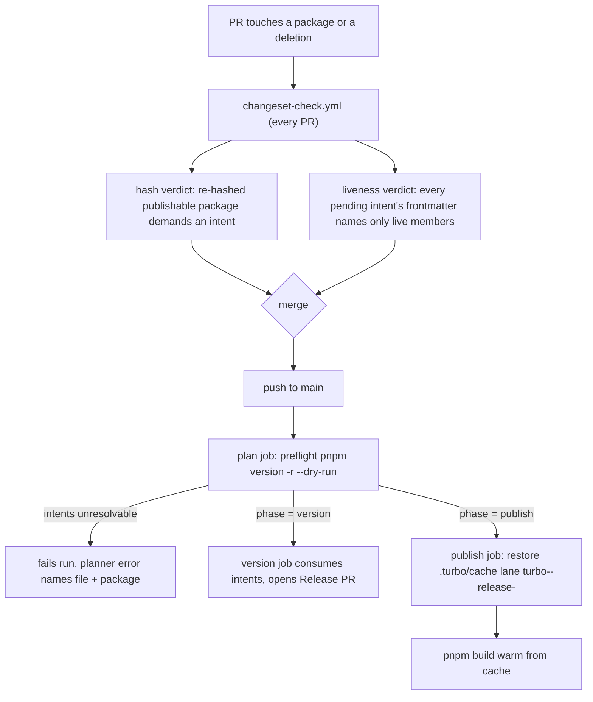

# Release intents liveness — repair, PR gate, turbo cache - Plan

## Goal Capsule

- **Objective:** A push to `main` consumes every pending release intent successfully, and the failure class that broke it — an intent naming a package the workspace no longer contains — fails the PR that introduces it, never the release behind it. The release publish build stops paying a cold turbo cache on every run.
- **Means:** Repair the 38 pending intents that name the deleted `@systemfsoftware/stryker-js-platform-node` (KTD1); widen `scripts/guards/check-changeset.ts` so a PR fails when any pending intent names a non-member (KTD2, KTD3); add a consumption dry-run preflight to the Release `plan` job (KTD4); persist `.turbo/cache` on the Release `publish` job under a lane-distinct key (KTD5).
- **Authority:** Repo law outranks this plan. `docs/solutions/runtime-errors/pnpm-versioning-unknown-package-deleted-intent.md` owns the repair doctrine; `docs/solutions/tooling-decisions/changeset-requirement-keys-on-turbo-build-hash.md` owns the gate doctrine; `.github/AGENTS.md` owns the lane-cache-key invariant.
- **Stop conditions:** A research finding that the repair doctrine cannot consume the surviving intents, or that turbo membership diverges from the planner's, stops the run as blocked with that evidence.
- **Execution profile:** Deterministic, gate-verified. Every unit lands behind an observable exit code.

---

## Product Contract

### Summary

Release run [33546163903](https://github.com/systemfsoftware/systemfsoftware/actions/runs/33546163903/job/99984294806) failed in the `version` job: `corepack pnpm version -r` aborted with `ERR_PNPM_VERSIONING_UNKNOWN_PACKAGE` because 38 pending `.changeset/` intents still name `@systemfsoftware/stryker-js-platform-node`, the package the stryker-js split deleted (plugin-api→`@systemfsoftware/stryker-js`, mutation-run→`@systemfsoftware/stryker-js-engine`, Node process entries→`@systemfsoftware/stryker-js-cli`). The PR-level changeset gate checks only intent _presence_ against build hashes, so the stale names sailed through every PR and detonated on main. The Release `publish` job builds with no turbo cache at all.

### Problem Frame

The planner fails closed — a bump demand with no manifest to carry it is refused, and it refuses the whole release, every push, until the names are gone. That is correct direction applied too late: the class is mechanically detectable at PR time, before merge, using membership the gate already computes. The deletion PR (stryker-js split) violated the recorded invariant "a deletion sweeps its intents in the same change" because nothing at PR time enforced it. This plan enforces it and repairs the backlog.

### Requirements

Release repair:

- R1. Every pending intent in `.changeset/` has frontmatter bump keys naming only live workspace packages — any bump class, `none` included.
- R2. `pnpm version -r --dry-run` exits 0 on the repaired tree and prints a plan listing only live workspace packages.
- R3. Consumer-observable change records survive the repair: a surviving change keeps its intent body and gains a bump line on its surviving owner; a change that died with the deleted package is removed whole. The deletion's own intents (`fine-onions-taste.md`; `concept-modules-platform-node.md`) are untouched.

PR-level gate:

- R4. A PR whose head leaves any pending intent naming a non-member fails `changeset-check.yml`, naming the file and the package.
- R5. The liveness check fails closed — indeterminable membership is a failure, never a pass — and is pinned by the guard's selftest fixtures (red observed before green).

Release preflight:

- R6. The Release `plan` job runs the consumption dry-run before phase jobs, so an unresolvable plan fails the run early with the planner's own error text.

Turbo cache:

- R7. The Release `publish` job restores `.turbo/cache` before its build and its run's cache is saved under the lane-distinct prefix `turbo-<os>-release-`, with restore fallback to existing lane prefixes.

Docs:

- R8. `.github/AGENTS.md` states the widened gate verdict in the same change; no doc claim about the gate is left stale.

### Scope Boundaries

Out of scope, named so they stay out: Vercel remote caching (repo doctrine — no `TURBO_TOKEN`/`TURBO_TEAM`; the verdict binary is lockfile-pinned, no registry or network at verdict time); turbo cache for `mutation.yml` (advisory lane, separate concern); concurrency tuning of `TURBO_CONCURRENCY` defaults; the `INTERNAL_RANGE` intent class beyond what the preflight already catches.

---

## Planning Contract

### Key Technical Decisions

- KTD1. **Repair rule.** For each of the 38 intents naming `@systemfsoftware/stryker-js-platform-node`: drop the dead frontmatter line; if the change survives (per the Appendix map), add a bump line for its surviving owner at the recorded level, unless that owner is already named in the same intent's frontmatter; if the change died with the package, delete the file whole; excise removal clauses whose subject was the dead export. `fine-onions-taste.md` and `concept-modules-platform-node.md` stay byte-untouched. (session-settled: user-directed — chosen over fixing only the error-named file: 38 intents name the dead package and each one fails the next release). Doctrine challenge, resolved: the precedent's "delete intents whose whole subject died" reads on the _change_, not the file — a change that survives in engine/cli has something left to say (REPO-R2: consumer-observable facts ship as changelogs), so only `curly-plants-fold` and the two removal clauses die.
- KTD2. **The liveness gate lives inside `check-changeset.ts`** and takes membership from its existing turbo dry-run enumeration. Parsing `pnpm-workspace.yaml` globs or shelling `pnpm ls -r` would fork membership into a second engine-of-record — the exact defect the gate doctrine bans ("never re-implement an engine's input model").
- KTD3. **The gate judges all pending intents at head**, not only files the PR changed. The release predicate is "the plan is consumable at head"; a PR that deletes or renames a package must sweep the backlog or fail. This is what converts the recorded invariant into a merge-blocking gate.
- KTD4. **Preflight dry-run in the `plan` job.** The PR gate cannot see two residual paths: a direct push to main, and the sibling `ERR_PNPM_VERSIONING_INTERNAL_RANGE` class. The dry-run is the deterministic check the pipeline itself runs, costs one read-only command, and fails with the planner's own legible error.
- KTD5. **Turbo cache only where turbo executes tasks: the `publish` job.** `changeset-check.yml` runs `turbo run build --dry=json` — dry runs execute nothing, so a cache there buys nothing. No remote cache: supply-chain posture keeps the executor lockfile-pinned and network-free at verdict time.
- KTD6. **This PR ships no intent for itself.** Its paths (`.changeset/`, `scripts/guards/`, `.github/`, `docs/`) are not build inputs of any publishable package; no turbo build hash changes. The PR's own `changeset-check.yml` run is the evidence.

### High-Level Technical Design

### Assumptions

Named under the destructive-review lens _source-bytes vs claim_; each carries its falsifier:

- A1. pnpm's planner rejects any intent frontmatter name outside the workspace, `none` included. Warrant: measured — CI run 33546163903 log (`ERR_PNPM_VERSIONING_UNKNOWN_PACKAGE` naming the dead package); `docs/solutions/runtime-errors/pnpm-versioning-unknown-package-deleted-intent.md`; [pnpm.io/versioning](https://pnpm.io/versioning). The `none`-class rejection is the solution doc's assertion, not a separate measurement. Falsifier: the U1 red case reintroduces a dead name in two variants — a `patch` line and a dead-`none` line — measuring the `none`-class assertion; if a dead `none` name proves harmless to the planner, the gate still rejects it (stricter than the planner is safe; the reverse is not) and this assumption line is amended on the PR.
- A2. Turbo dry-run membership matches the planner's membership — both resolve the same `pnpm-workspace.yaml` globs. Residual corner: a tracked manifest turbo does not enumerate (repo R11) is not a member for either engine's purposes here, and the gate already fails closed on an empty member set. Accepted gap, stated: the gate is exactly as total as turbo's enumeration — a stale name turbo does not enumerate passes the PR gate and is caught only by the U3 preflight (the planner's own engine), one job later on main. Falsifier: any release run that rejects a name the gate passed is a blocked report with both enumerations.
- A3. Restoring `.turbo/cache` via actions/cache produces task-cache hits across runs and lanes. Warrant: the turborepo GitHub Actions guide prescribes exactly this pattern, and the repo's own `checks`/`contract` lanes demonstrably hit it (`check:local` output: 229/237 cached). Falsifier: the first post-merge Release publish run log — `FULL TURBO`-class hit counts, or the unit is reworked.

### Sources

- `docs/solutions/runtime-errors/pnpm-versioning-unknown-package-deleted-intent.md` — the repair doctrine for this exact error class (2026-08-20).
- `docs/solutions/tooling-decisions/changeset-requirement-keys-on-turbo-build-hash.md` — gate doctrine: release predicate = cache predicate; membership from the engine; deleted package skipped at head; executor pinned.
- `docs/solutions/integration-issues/parallel-lanes-race-on-one-immutable-cache-key.md` + `.github/AGENTS.md` — lane-distinct immutable cache keys; restore-keys fallback is read-only and race-free.
- `scripts/guards/check-changeset.ts` — `readMembers` (turbo dry-run enumeration + private bit), `declaresBumpFor`, `assertLiveTurboPin`, selftest fixture style.
- `.github/workflows/release.yml`, `changeset-check.yml`, `reusable-checks.yml`, `reusable-contract.yml` — current wiring; cache presence map.
- CI log, run 33546163903 job 99984294806 — the failure, verbatim.
- pnpm Release management (pnpm.io/versioning) and Turborepo GitHub Actions guide (turborepo.com/docs/guides/ci-vendors/github-actions) — primary docs for `pnpm version -r --dry-run` and the actions/cache pattern.

---

## Implementation Units

### U1. Repair the 38 pending intents

- **Goal:** No pending intent names a non-member; every surviving change keeps its record on its surviving owner (R1–R3).
- **Requirements:** R1, R2, R3.
- **Dependencies:** none.
- **Files:** the 38 intent files in `.changeset/` enumerated in the Appendix.
- **Approach:** 1. Per file, apply the Appendix disposition: `drop` (remove the dead line), `re-point` (drop the dead line, add the mapped owner at the recorded level — skip the add when that owner is already named), `excise+re-point` (remove the dead-name body clauses, then re-point), or `delete` (remove the file). 2. Leave bodies otherwise verbatim. 3. Do not touch `fine-onions-taste.md` or `concept-modules-platform-node.md` (the dead name appears in their prose migration notices; the planner reads frontmatter only). 4. Per-row record check before declaring done: for the two delete/excise rows, confirm the excised clause names only an internal symbol (`ChildProcessSpawnerLive` — an unused copy; the five entry points the `only-the-api` body itself calls never-API); for owners that published before the split (`stryker-js-cli` at 4.0.3, `stryker-js` at 0.2.0 — engine is 404-never-published, so engine rows cannot double-record), confirm the mapped symbol is absent from the owner's released CHANGELOG at that version.
- **Test scenarios:**
  - `pnpm version -r --dry-run` exits 0 and the printed plan names only live workspace packages.
  - Red case, two variants (run before declaring done, per the doctrine's verification section): reintroduce one dead `patch` frontmatter line, and separately one dead `none` line, in scratch copies of an intent; each dry-run must exit non-zero with `ERR_PNPM_VERSIONING_UNKNOWN_PACKAGE` naming that file and package.
  - No `.changeset/*.md` frontmatter contains the key `@systemfsoftware/stryker-js-platform-node`; the only remaining occurrences of the name are the two prose migration notices.
  - Every intent still parses as an intent (frontmatter fences intact; no intent left with an empty frontmatter block).
  - Exhaustive sweep: run the U2 liveness verdict (every frontmatter key of every pending intent against live members) against the repaired branch and require it clean — not just absence of the platform-node name, so any other stale name surfaces in-repair instead of failing this PR's own gate.
- **Verification:** dry-run exit 0 on the tree; the guard selftest and verdict (U2) pass against this branch; `pnpm check:local` exit 0; the U1-approach step-4 per-row record checks each observed, not assumed.

### U2. Widen the changeset gate with intent-name liveness

- **Goal:** A PR whose head leaves any pending intent naming a non-member fails `changeset-check.yml`, file and package named (R4, R5).
- **Requirements:** R4, R5.
- **Dependencies:** U1 (the branch's own head must be clean, or the gate correctly fails this PR).
- **Files:** `scripts/guards/check-changeset.ts` (selftest fixtures and verdict), no workflow change (the invocation is unchanged).
- **Approach:** 1. Add a verdict component: every frontmatter bump key of every pending intent at head — enumerated by a filesystem glob of top-level `.changeset/*.md`, skipping `README.md`, independent of the PR-diff set the hash verdict reads (the guard's current changeset list comes only from `git diff --diff-filter=AM`, which cannot see an untouched stale intent; this enumeration is new) — must be in the `readMembers` name set, all bump classes, `none` included. 2. On violation, print one `::error::` per offending file+package and exit non-zero. 3. Fail closed: reuse the existing empty-member-set failure. 4. Extend `--selftest` with fixtures: dead `patch` name fails; dead `none` name fails; live names pass; an intent untouched by the PR but stale at head fails (pins the all-pending scope, KTD3); README/non-intent files ignored. 5. Do not add permissions — the check reads what `--allow-read` already grants.
- **Patterns to follow:** the guard's existing fixture style (`FIXTURES` array, `expectsThrow`), the fail-closed verdict contract, and the CI-log error format used by the sibling guards.
- **Test scenarios:**
  - `--selftest` passes with the new fixtures, each red fixture observed failing before the fix (gate observed red then green — evaluator law).
  - Selftest recomputes expectations from source bytes (existing pattern) — no fixture asserts a hardcoded hash that rots.
  - The gate judged against this PR's own base: hash-clean, liveness-clean, exits 0 (the predicate applied to itself, per the gate doctrine's verification section).
- **Verification:** selftest exit 0; verdict run against the PR base exits 0; a tampered fixture run exits non-zero (spot red).

### U3. Preflight intent consumption in the Release plan job

- **Goal:** An unresolvable plan fails the Release run at the `plan` job with the planner's own error (R6).
- **Requirements:** R6.
- **Dependencies:** none (independent of U1/U2 at code level; merges alongside them).
- **Files:** `.github/workflows/release.yml` (`plan` job, after `install-deps`).
- **Approach:** Add one step running `corepack pnpm version -r --dry-run`. No output parsing: the planner's exit code and error text are the verdict. The step runs before `plan-release.mjs`, so a stale intent fails the run before any phase job starts.
- **Test scenarios:**
  - On the repaired tree the preflight passes and the workflow proceeds to phase derivation.
  - Falsifier inherited from A1's red case: a tree with a stale intent fails this step, not the `version` job.
- **Verification:** workflow YAML parses (`pnpm check:action-provenance` and CI's own workflow lint); observed green on the post-merge Release run.

### U4. Turbo cache on the Release publish job

- **Goal:** The publish build stops paying a cold cache (R7).
- **Requirements:** R7.
- **Dependencies:** none.
- **Files:** `.github/workflows/release.yml` (`publish` job, cache step before `Build`).
- **Approach:** Add an `actions/cache` step mirroring the `checks` lane: path `.turbo/cache`, primary key `turbo-${{ runner.os }}-release-${{ github.sha }}` (lane-distinct prefix — the lane-key invariant), restore keys `turbo-${{ runner.os }}-release-` then `turbo-${{ runner.os }}-` (cross-lane restore is read-only; only the primary key races).
- **Patterns to follow:** the cache blocks in `reusable-checks.yml` and `reusable-contract.yml`.
- **Test scenarios:**
  - `//#check:action-provenance` passes (workflow guard).
  - Post-merge Release publish log shows a restore (or a first-run save) under the `turbo-<os>-release-` prefix and non-zero cache-hit task counts on the next run.
- **Verification:** observed in the Release run logs via the PR babysit/watch.

### U5. Update the gate's doc claims

- **Goal:** Docs state the widened verdict; no stale claim survives (R8).
- **Requirements:** R8.
- **Dependencies:** U2.
- **Files:** `.github/AGENTS.md` (the `changeset-check.yml` line; the cache-lane enumeration gains the `release` lane U4 adds).
- **Approach:** Rewrite the one-line gate description to cover both verdicts: intent presence on hash change, and intent-name liveness against live members. Add `turbo-<os>-release-<sha>` to the lane-cache-key enumeration. Gate-named, no narrative.
- **Test scenarios:** Test expectation: none — doctrine text only; the gate it describes is verified in U2.
- **Verification:** `pnpm check:local` (dprint + forbidden-lines) exit 0.

---

## Verification Contract

| Gate                    | Command                                                                                                                                | Proves                                                                                               |
| ----------------------- | -------------------------------------------------------------------------------------------------------------------------------------- | ---------------------------------------------------------------------------------------------------- |
| Intent liveness         | `pnpm version -r --dry-run`                                                                                                            | R1, R2 — exit 0, plan names only live packages                                                       |
| Red case                | dry-run on a scratch tree with one reintroduced dead name                                                                              | R1, R2 — deterministic non-zero naming file + package (the A1 falsifier; the planner-rejection path) |
| Guard selftest          | `deno run --allow-read scripts/guards/check-changeset.ts --selftest`                                                                   | R4, R5 — fixtures red/green incl. `none` class and all-pending scope                                 |
| Gate verdict on this PR | `deno run --allow-run=git,"$PWD/node_modules/.bin/turbo" --allow-read --allow-write=/tmp scripts/guards/check-changeset.ts <base-sha>` | KTD6 — the gate judges its own PR hash- and liveness-clean                                           |
| Full local chain        | `pnpm check:local`                                                                                                                     | REPO-D1 — exit 0 after the last edit                                                                 |
| CI                      | `changeset-check.yml` + `ci.yml` green on the PR                                                                                       | R4 — the class now fails at PR level                                                                 |
| Release                 | post-merge Release run green; publish log shows cache restore                                                                          | R6, R7 — watched to decided, not assumed                                                             |

---

## Definition of Done

- All five units landed; every gate in the Verification Contract observed passing in this session's own transcript (worker claims re-run, not repeated).
- The PR is open and watched to green; after merge, the next Release run consumes the intents — observed, not predicted. If the Release run has not fired by close of the session, the residual is stated in the report rather than claimed.
- No dead intent name remains in any frontmatter; `pnpm version -r --dry-run` exits 0 on the final tree.
- No scratch files, no leftover red-case fixtures in the working tree; the tree is restartable.

---

## Appendix — per-intent disposition map

`engine` = `@systemfsoftware/stryker-js-engine`, `cli` = `@systemfsoftware/stryker-js-cli`, `lang` = `@systemfsoftware/stryker-js`, `ins` = `@systemfsoftware/stryker-js-instrumenter`, `vit` = `@systemfsoftware/stryker-js-vitest-runner`. "drop" = remove the dead line only (a live line already covers the mapped owner). Behavior evidence per map row lives in `packages/testing/mutation/stryker-js/{engine,cli,stryker-js}/src/` — the owning symbol is named in the row. Publication history (measured on npm, 2026-09-01): engine 404-never-published, cli 4.0.3 and lang 0.2.0 published before the split — engine rows cannot double-record; cli/lang rows carry the U1 approach-4 symbol-absence check. Excise rows verified: both excised clauses name internal symbols only.

| Intent file                               | Action          | Owner line to add                                                                                                                                                   |
| ----------------------------------------- | --------------- | ------------------------------------------------------------------------------------------------------------------------------------------------------------------- |
| a-dropped-worker-frame-fails-the-call     | re-point        | engine patch (`WorkerProtocol.ts` frame delivery)                                                                                                                   |
| an-ignorer-you-did-not-ask-for            | re-point        | engine patch (`Run.ts` ignorer allowlist)                                                                                                                           |
| base-preset-is-published-again            | re-point        | engine minor (`config/base.ts`; keep cli patch)                                                                                                                     |
| breezy-donuts-grin                        | drop            | — (dead `none` line; 15 live names stay)                                                                                                                            |
| checkers-group-then-check                 | re-point        | engine minor (`Checker.ts` grouped plans)                                                                                                                           |
| command-runner-actually-runs              | re-point        | engine major (`TestRunner.ts` command runner)                                                                                                                       |
| config-errors-name-the-setting            | re-point        | engine patch (`Config.ts` remediation; keep cli patch)                                                                                                              |
| crash-tolerant-mutation-runs              | re-point        | engine patch (progress flush + incremental writes; keep cli, lang)                                                                                                  |
| crawl-skips-installed-dependencies        | re-point        | engine patch (`Project.ignore.ts` ALWAYS_IGNORE)                                                                                                                    |
| curly-plants-fold                         | delete          | — (LoggingServerNotTcpError died with the package)                                                                                                                  |
| debut-releases-gain-oidc                  | drop            | — (34 live names stay)                                                                                                                                              |
| effect-rc112                              | drop            | — (live peer-bump names stay)                                                                                                                                       |
| evaluator-answers-with-a-verdict          | drop            | — (lang already named at major; remove the dead `platform-node: minor` line only)                                                                                   |
| failures-name-themselves                  | re-point        | engine patch (`StageError` naming; keep cli patch)                                                                                                                  |
| human-mode-prints-for-humans              | drop            | — (cli minor already named)                                                                                                                                         |
| human-mode-reads-as-prose                 | drop            | — (cli patch already named)                                                                                                                                         |
| id-generator-is-a-service                 | re-point        | engine major (`Worker.ts` IdGenerator service)                                                                                                                      |
| incremental-mode-reuses-results           | re-point        | engine patch (`IncrementalDiff.workflow.ts`)                                                                                                                        |
| inplace-restore-stops-guessing            | re-point        | engine major (`Run.ts`/`Sandbox.ts` restore)                                                                                                                        |
| json-report-is-written                    | re-point        | engine patch (`JsonReport.workflow.ts`; keep cli, html, vit)                                                                                                        |
| log-level-is-per-run                      | re-point        | lang major (`Schema.schema.ts` LogLevel)                                                                                                                            |
| machine-stream-is-a-file                  | drop            | — (cli minor already named)                                                                                                                                         |
| modern-ends-know                          | drop            | — (23 live names stay)                                                                                                                                              |
| mutants-actually-run                      | drop            | — (cli patch + stryker-js patch already named)                                                                                                                      |
| only-the-api-is-a-door                    | excise+re-point | engine major (drop the removal clauses — verified internal-only, consumer import migration already recorded by `concept-modules-platform-node.md`; keep html major) |
| oversized-frames-fail-the-run             | re-point        | engine patch (`WorkerFrameTooLargeError`; keep lang, ins)                                                                                                           |
| package-landing-pages                     | drop            | — (13 live names stay)                                                                                                                                              |
| run-outcome-carries-the-verdict           | re-point        | engine major (`Run.ts` RunOutcome)                                                                                                                                  |
| sandbox-files-carry-nocheck               | re-point        | engine patch (`Sandbox.ts` @ts-nocheck preprocessor)                                                                                                                |
| shared-helpers-move-to-plugin-api         | drop            | — (lang minor + live patches stay)                                                                                                                                  |
| stage-failures-name-themselves            | re-point        | engine major (`Run.schema.ts` StageError)                                                                                                                           |
| stryker-drop-unimported-deps              | drop            | — (6 live patch lines stay)                                                                                                                                         |
| tricky-moments-punch                      | drop            | — (7 live patch lines stay)                                                                                                                                         |
| verdict-carries-its-findings              | re-point        | engine patch (`verdict-envelope.ts`; keep lang, cli)                                                                                                                |
| verdict-reaches-the-exit-code             | re-point        | engine major (`exit-classification.ts`; keep cli minor)                                                                                                             |
| worker-calls-are-declared-not-guessed     | re-point        | engine minor (`WorkerProtocol.ts` declared RPCs; keep lang minor)                                                                                                   |
| worker-calls-no-longer-lose-their-replies | re-point        | engine patch (`WorkerProtocol.ts`/`WorkerLauncher.ts`)                                                                                                              |
| workers-are-group-killed                  | excise+re-point | cli major (drop the `ChildProcessSpawnerLive` clause — verified: an unused internal copy; keep the group-kill body; `platform/node.ts` group kill)                  |
