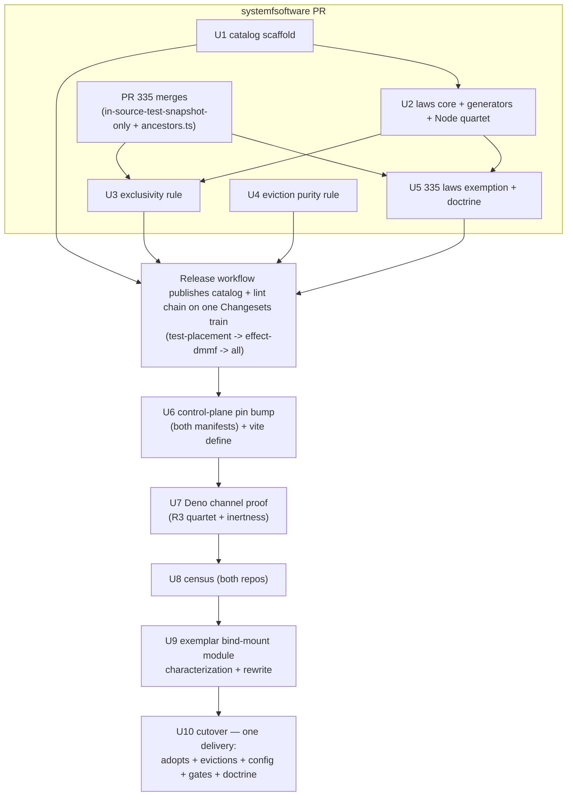
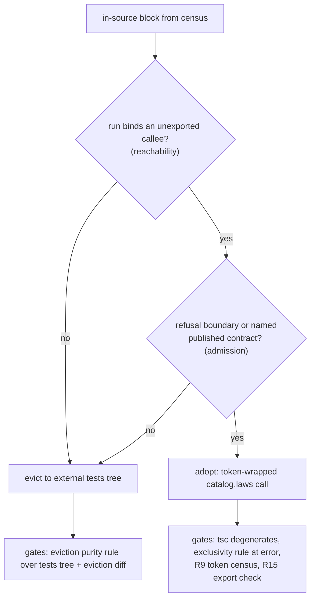

# In-Source Laws Catalog - Plan

**Target repos:** `systemfsoftware` — the catalog package and the lint gates (units U1–U5); `systemfsoftware/control-plane` — census, adoption evidence, and cutover (units U6–U10, cloned fresh at execution; paths below prefixed `control-plane:` are relative to that clone's root). Execution resolves PR 335's merge state before Phase B begins.

## Goal Capsule

- **Objective:** In an adopting package, the default in-source test an agent writes is a real test — a library-generated law suite whose expected values come from a published contract and whose refusal boundary is generator-exercised — and example-assertion ceremony is unrepresentable in-source there.
- **Means:** an org-published `@systemfsoftware/in-source-catalog` exposing `catalog.laws` with library-owned generators, plus a package-scoped exclusivity gate; a census sorts both repos' in-source blocks into adopt vs evict.
- **Product authority:** owner-confirmed 2026-09-03 across two review rounds — the second held every product decision fixed (laws-only adopters, generators as the default next token, census sorts never stretches, behavior evicts, v1 guard token, package config boundary, one-package first ship, 335 for non-adopters) and bound ten execution-readiness requirements, all carried below as R-IDs and gates.
- **Execution profile:** two delivery vehicles — one `systemfsoftware` PR (U1–U5, preceded externally by PR 335's merge and the Release-workflow publish) and one `control-plane` PR (U6–U10, census rendered into its body). Sequencing is a blocker chain (see High-Level Technical Design).
- **Stop conditions:** PR 335 unmerged blocks Phase B; a Deno registration failure falls back per Assumption A2 and re-proves; a census adopt set smaller than the contract/refusal-shaped membership stops the cutover for owner approval — it is not narrowed silently.
- **Open blockers:** none — every readiness item the second round raised is a requirement or gate in this contract, not a deferred spike.

---

## Product Contract

Product Contract preservation: changed: R1 and R15 (gate text only) — R1's exported-callee rejection moved from `tsc --noEmit` to the exclusivity rule's lint arm (export status is not visible to the type system), and R15's workspace leg was scoped to what control-plane's single-repo workspace can decide (a cross-repo import census cannot fail where no other repo-local package exists; that leg ships at shared-toolchain promotion). Requirements and enforcement intent unchanged; only the gate channels were corrected. Outstanding Questions: the three items deferred to planning are resolved in this enrichment (KTD1, KTD2, U2, U8); `merge`/`drop` stays open per the owner.

### Summary

An org-published in-source laws channel with library-owned generators becomes the only in-source authoring surface in adopting packages. A census sorts both repos' in-source blocks into adopt (refusal-boundary or published-contract shaped) and evict (behavior-shaped, relocated to the external test tree). The control-plane app package — home of the exemplar bind-mount module ceremony — is the first and only cutover, gated on a Deno-runtime proof that the channel collects, detects, and stays inert in production.

### Problem Frame

The adopter app package (repo `systemfsoftware/control-plane`, branch `master`) runs clone-derived in-source vitest blocks via `includeSource: ['src/**/*.ts']` (indicative only — the fresh census at U8 is the normative count; reviewer recounts of the clone ran lower). A clone-derived marker-carrying module set holds a dummy-marker idiom — a module-scope const asserted against its own literal — that exists to satisfy the private-target lint gate while testing exported functions. The census recorded 2026-09-03 from a clone of `master` carries this inventory — (module names and sites withheld — recorded in the adopter repo's census; the fresh census at U8 is the normative list) — and its counts are disputed by reviewer recounts; re-derive at execution, since the repo is not readable from this connector.

The exemplar bind-mount module's block is the class exemplar: expected `the derived path field` rebuilt with the module's path-composition helper — the same one the production function calls — a silent `if ('ok' in m) return` standing where refusal assertions belong, and an `includes('a reserved env-file name')` pin no legal mount input can fail. Its `containerPath`/`readOnly` contract exists only inline in production branches — no named table anywhere. The block certifies nothing while passing every current gate.

The enforcement family polices where tests live and which matchers they use, not whether the expected value is independent of the SUT. Open PR systemfsoftware#335 restricts in-source tests to authored inline snapshots but leaves the marker dodge representable and capture-then-commit un-gateable, and reaches control-plane only when it bumps its exact `@systemfsoftware/all` pin. The failure class is measured, not hypothetical: acceptance-shaped laws are roughly 8.6× weaker than refusal-observing ones at a refusal boundary, and same-session LLM-authored oracles default to mirroring the implementation rather than the expected behavior (software-wiki corpus, canon-band warrant, 2026-09-03).

### Key Decisions

- The in-source channel survives; laws replace the example vocabulary, not the location (session-settled: user-directed — chosen over deleting the in-source channel: deletion does not change how agents author). Governs R1, R9.
- Fixed means the default authoring act is a real test with library-owned generators, not a constrained `expect` (session-settled: user-directed — chosen over constraint-only vocabulary: banning shapes does not change the default next token; inexpressibility is a lemma). Governs R1, R2, R3.
- `laws` is licensed only where a refusal boundary or named published contract exists; the census sorts blocks, never stretches the API (session-settled: user-directed — chosen over generalizing laws to every block: unlicensed arms are ceremony with extra syntax). Governs R1, R10, R11.
- Export status is the reachability key and licensing is the admission key, and both hold in adopters: `run` binds an unexported callee because integration tests drive what's exported (session-settled: user-directed — chosen over replacing the export key with licensing alone: the private-only rule is the reachability boundary, not an arbitrary sort). Governs R1, R9, R11, R12.
- Behavior-shaped blocks evict to the external test tree; adopters get no second in-source vocabulary (session-settled: user-directed — chosen over keeping a snapshot channel in adopters: the snapshot door is where agents drift back in). Governs R9, R10, R13.
- v1 collection is the canonical guard token wrapping the laws call; a library vitest plugin is the named successor that retires the token (session-settled: user-directed — chosen over requiring `import.meta.vitest` to leave the file in v1: unsatisfiable until a proven plugin exists; vitest's `includeSource` check is textual). Governs R5, R6, R7.
- An adopting package is its manifest plus its oxlint/vitest config; ambient `ImportMeta` replacement is one available lever, not the definition (session-settled: user-directed — chosen over locking ambient replacement as the only ban: the boundary is config, not TypeScript physics). Governs R8.
- First ship is one package — the adopter app package; every other block stays classified, not rewritten (session-settled: user-directed — chosen over a two-repo migration: whole-package cutover and ask-first cohere only at package scope). Governs R10, R11.
- Eviction is purity-checked relocation, not a byte-move (session-settled: user-directed — chosen over relocating assertions verbatim: that launders ceremony into the legal vocabulary). Governs R13.
- Ship as org-published `@systemfsoftware/in-source-catalog` through the standard publish pipeline (session-settled: user-approved — chosen over control-plane-local helpers: one failure class, one enforcement family across codebases). Governs R1, R8.
- 335's snapshot-only doctrine remains in force for non-adopting packages and is recorded as superseded inside adopters (session-settled: user-approved — chosen over implicit supersession: two doctrines with no recorded boundary drift). Governs R9, R14.
- The published-contract table stands assertion-side only: production keeps its inline literals, and the inversion gate sabotages production and the table separately, so production-pinning and table-reading are independently observable — a table production derives from would make the field assertion circular. Governs R3, R12.
- 335 stays on inside adopters behind a proven `catalog.laws` exemption; the dynamic-import dodge — `await import('vitest')`, `await import('@effect/vitest')`, `effect/testing` inside the guard, the hex-schema house pattern — is an error in adopters. Governs R8, R9, R14.
- Sequencing is a blocker chain, not a convention: catalog published → control-plane's exact pin bumped → inversion and inertness evidence on a Deno `includeSource` run → then the cutover change. Governs R6, R10.
- One registration model: the laws call sits inside the guard, and registration happens only where the guard is truthy; outside a vitest run the guard is falsy and the call never executes. No library no-op fallback ships beside it. Governs R5, R6.
- An exact derived path field is not an oracle this product provides; the library never reimplements the path-composition helper as expecteds — that would move the tautology into the package. The current derived-path-field pin dies as an honest coverage deletion. Governs R1, R12.
- `reserved` is library-owned: refuse-home generators exported by the catalog, never a caller-supplied string list — caller-inlined literals are the same-session oracle again. Governs R1, R3.

### Requirements

**The laws surface**

- R1. `catalog.laws` accepts exactly: `run` bound to an unexported callee — the module's interior decision, never its exported surface, which the external integration suite drives — plus nonempty `reserved` as a library-exported refuse-home generator (callers cannot pass string literals or arrays they authored), optional `published` literals drawn from a named contract, optional `inverse` only when an inverse exists, and optional `merge`/`drop`; no parameter accepts an expected value computed by calling the SUT or a sibling it already calls, and no parameter is an oracle for an exact derived path field. Gate: package typecheck (`tsc --noEmit`) — empty `reserved`, caller-authored input lists, and zero-assertion degenerate calls are type errors — plus the exclusivity rule's exported-callee arm, which sees module scope where the type system cannot (see the Product Contract preservation note).
- R2. Exactly one ceremony shape dies at `tsc`: a call expression in a `published` expected slot is a type error. The rest die structurally or at lint — `expect`/`it`/`describe` destructuring and dynamic vitest imports are lint errors per R8, and the dummy-marker self-assertion, silent early return, and vacuous predicate are unrepresentable because `laws` has no parameter that can express them. Gate: known-bad fixture with four cases — the path-composition-helper-in-`published` case fails `tsc --noEmit`; the destructured-`expect` and `await import('vitest')`-inside-guard cases fail lint; the marker/silent-return/vacuous-`includes` cases do not typecheck as `laws` calls at all.
- R3. The library owns generation: `reserved` refuse homes exercise the refuse arm or arms, `published` literals are asserted against production output, and a present `inverse` is round-tripped, so a claimed inverse that is not one fails the generated suite. Gate: four observations, each red then green — a refuse arm inverted; a production branch's contract literal sabotaged (proves production is pinned to the table); the table's literal inverted (proves the suite reads the table, not its own copy); a claimed inverse broken.
- R4. The package's public surface exports no `expect`, `it`, or `describe`. Gate: the catalog package's export-surface checks in CI (attw plus the workspace api check), not a README claim; the vitest-import ban in adopting src is R8's, not this one.

**Collection and vocabulary**

- R5. v1 collection is the canonical guard token in expression form: the adopting file wraps `catalog.laws(...)` calls in the single canonical `import.meta.vitest` guard statement, destructures nothing from it, and carries no textual `import.meta.vitest` marker in comments — vitest collects on the text even in comments, so a comment-only token beside a top-level laws call is a violation. Registration happens only where the guard is truthy; outside a vitest run the guard is falsy and the call never executes, so Deno production correctness does not depend on a build define, and the adopter's production build demonstrates the guard's elimination or inertness on its Deno/vite path. Gate: exclusivity lint arms with RuleTester cases for any other `import.meta.vitest` use, any destructuring, any guard body that is not laws calls, and the comment-token shape.
- R6. Proven collection precedes the first consumer rewrite, on the adopter's runtime: the R3 quartet is observed on a Deno `includeSource` run of the adopting package (collection, red/green), plus an inertness observation — running the adopting module outside vitest executes no laws. A green Node fixture alone proves nothing about the Deno channel. Gate: the Deno run log and the inertness observation attached to the delivery that precedes the cutover, in the sequencing order the Key Decisions fix.
- R7. In adopting packages `expect`, `it`, and `describe` are absent from the in-source authoring vocabulary; the `import.meta.vitest` collection token remains legal in v1 and is retired only when a library vitest plugin exists and passes R6's gate. Gate: R8's exclusivity rule plus typecheck of the adopting package's src.

**Adoption boundary**

- R8. An adopting package declares adoption in its own manifest and oxlint/vitest config; the exclusivity rule activates only inside an adopting package's config and is inert elsewhere, so non-adopting packages keep the snapshot-only doctrine untouched. Within an adopting package's src it reports at error: vitest imports, dynamic vitest imports inside the guard (`await import('vitest')`, `await import('@effect/vitest')`, `effect/testing` — the hex-schema pattern), in-source snapshot assertions, `describe(`, `it(`, and `expect(` calls, and file-local `declare global` ImportMeta augmentation. Gate: RuleTester cases including the declare-global dodge, a `describe(` call, the dynamic-import dodge, and a non-adopting-package case proving the rule stays inert.
- R9. In-source testing in an adopting package is laws-only; two keys compose and neither is superseded. Reachability: `run` binds an unexported callee, because exported behavior is driven by the external integration suite. Licensing: the block carries a refusal boundary or a named published contract per R1. The snapshot-only channel is the only superseded policy (recorded per R14), and the dummy-marker dodge — a private const smuggled beside tests of exported functions — has no target under either key. Gate: textual census of the adopting package's src returns zero occurrences of `expect(`, `it(`, `describe(`, `assert(`, `expectTypeOf(`, `test.prop`, FastCheck references, and `toMatchInlineSnapshot` anywhere in src — including inside the guard; the canonical guard expression is the sole legal `import.meta.vitest` occurrence.

**Census and first ship**

- R10. First ship is exactly one package, the adopter app package in `systemfsoftware/control-plane`, and it cannot land until the sequencing chain is met (catalog published → exact pin bumped → R6's Deno evidence). In one change: every block in the census's named adopt set becomes a live `laws` call, the behavior-shaped blocks evict, the config adopts the exclusivity rule, and the package's src is clean of all four ceremony shapes per R2's enumeration — marker assertions, SUT-reconstructed expectations, silent early-return guards, vacuous predicates — across every module. An adopt set smaller than the census's contract/refusal-shaped membership requires owner approval before the cutover opens; a cutover of evictions plus one exemplar `laws` call is the deletion outcome the product decisions rejected. Gate: control-plane's root `check` task green (`deno task check`; its AGENTS.md names `check:local` — stale); R9's census clean package-wide; zero `__private*Marker` declarations in src; every adopt-set member contains a live laws call.
- R11. The census is delivered before the cutover diff and classifies every in-source block in both repos as adopt-candidate or evict-candidate; each adopt entry cites its licensing evidence — the refuse-arm symbols or contract literals the block exercises — and the unexported callee its laws will bind, and an adopt entry without both fails the census. No other package's src changes; a second package cutover requires owner approval first. The census re-derives the marker list fresh at execution (this plan's counts are clone-derived, disputed by reviewer recounts, and non-normative). Gate: the census document with per-block verdicts and cited evidence exists before the cutover branch; the delivery diff touches no other package's src.

**Worked example and eviction purity**

- R12. The exemplar bind-mount module's refuse arms and contract consumption extract into a module-private decision core that the module's laws bind under R1; its exported decision wrapper delegates to that core, and its exported behavior stays driven by control-plane's integration suite. The inline `containerPath`/`readOnly` literals are restated as a named assertion-side published contract — module-private like the core, since laws and production share the module — with production keeping its inline literals, so the laws assert table-against-production and R3's two sabotage directions are independently observable. The marker assertion, silent early return, and vacuous reserved-env-file pin die structurally; the path-composition-helper-reconstructed derived-path-field expectation dies as an honest deletion — an exact derived path field has no oracle in this product, and the library must not reimplement the path helpers as expecteds. Gate: the module-private core and named contract exist with no new export per R15; R2's fixture red on the old shapes; R3's quartet green on the rewritten module; the module contains no in-source block other than the token-wrapped laws call.
- R13. Relocated blocks carry none of the four ceremony shapes: expected values reconstructed from the SUT's own derivation, dummy-marker self-assertions, silent early-return guards standing in for refusal assertions, or predicates no legal input can fail; non-circular example assertions may relocate unchanged. Purity is machine-checked, not review-only: an executable check over the adopting package's tests tree and the eviction diff rejects the four shapes. Gate: that check runs in the adopting package's CI with RuleTester cases for the marker self-assertion and the same-callee reconstruction; a byte-identical relocation of a ceremony block fails it.

**Doctrine**

- R14. Doctrine and the exemption land as code in the same delivery: both repos record that adopting packages supersede snapshot-only in-source testing while non-adopting packages keep it, and 335's `catalog.laws` exemption — proven by RuleTester cases whose exemption ends at the laws call's boundary the way `ruleOfSchemas`'s does — ships with the rule, because doctrine edits alone gate nothing. Gate: the doctrine edits and the exemption's RuleTester cases ride the same delivery set as the code they license.

**Export surface**

- R15. An adopting package's module-export surface is load-bearing: a test-only export — a module-level export whose only importers are test files — is the signature of a unit test smuggled out of the laws channel through a widened export. "Production consumer" is not asserted (it is not decidable in a monorepo); the gate keys on what is computable. Test-only is: not reachable from any entry the package's manifest declares (`exports`/`bin`; REPO-S4 territory), and no non-test importer anywhere in the adopting repo — by import-specifier census across the repo's packages, so a fabricated consumer would have to land in another reviewed diff. The cross-repo workspace leg ships when the check is promoted into the shared toolchain (Assumption A3). Gate: that two-part check runs in the adopting package's CI from the cutover onward; the cutover diff itself adds no module-level exports — R12's contract table and decision core stay module-private — and any later export addition lands together with a live consumer.

### Acceptance Examples

- AE1. **Covers R3, R6.** Given the adopting package under a Deno `includeSource` run with a laws call over a refuse arm and a published contract, When the refuse arm is inverted, a production contract literal is sabotaged, the table's literal is inverted, and a claimed inverse is broken — one at a time — Then the generated suite fails for each; When each is restored, Then the suite passes. All eight observations precede the cutover, alongside the inertness observation that running the module outside vitest executes no laws.
- AE2. **Covers R2, R12.** Given the four exemplar bind-mount module ceremony shapes as separate fixture cases, When gates run, Then the path-composition-helper-in-`published` case fails `tsc --noEmit`; the destructured-`expect` and dynamic-import cases fail lint; and the marker, silent-return, and vacuous-`includes` shapes have no expressible `laws` form at all. The module rewritten as `catalog.laws` against the named contract typechecks and passes R3's quartet.
- AE3. **Covers R5, R8.** Given an adopting-package src file that destructures from `import.meta.vitest`, dynamically imports vitest inside the guard, carries only a comment-form token beside a top-level laws call, or declares a file-local ImportMeta augmentation, When lint runs, Then the exclusivity rule reports each at error; a non-adopting package running the same rule stays silent.
- AE4. **Covers R10, R13.** Given the adopter app package's behavior-shaped blocks, When the cutover lands, Then their assertions live in the external tests tree, the purity check over the tests tree and the eviction diff passes, and the relocation diff contains none of the four ceremony shapes.

### Success Criteria

- A cold agent asked to add in-source coverage in an adopting package writes a laws call without being shown the vocabulary — a qualitative bar; its observation point is the next agent-authored in-source change in an adopting package, not a machine gate.
- Machine-checked after cutover: the ceremony census of the adopting package's src returns zero hits for every R9 token; every adopt-set member carries a live laws call; the R3/R6 inversion and inertness evidence is attached; the R13 purity check runs in CI.

### Scope Boundaries

Deferred for later:

- The library vitest plugin that retires the collection token — only after it passes R6's gate.
- Upgrading evicted behavior blocks into property or composition tests beyond relocation and purity — per-module follow-ups.
- A second adopting package, and systemfsoftware-side adoption of laws for its own classified blocks.
- The refuse-home generator combinator surface (which generator families ship in v1) — designed under R1's constraint that callers cannot author input lists.

Outside this product's identity:

- Exact derived-path-field oracles, and any library reimplementation of the path-composition helper as expected values.
- A dual registration model (library no-op fallback beside the guard form).
- Tautology-heuristic lint as the deliverable; PR 335's merge is not this work's completion.
- Coverage quotas or numeric layer widths (repo law CONST-T15 forbids them).
- New mutation surfaces (workflow-only mutation stands).
- Re-exporting vitest vocabulary for compatibility.

### Dependencies / Assumptions

- PR systemfsoftware#335 (open, head `f608ca7`) ships `in-source-test-snapshot-only` into the org preset; the laws channel composes with it by exemption, not by absorption — the guard token is 335's canonical guard form, laws files carry the generated-channel exemption shape `ruleOfSchemas` already has (`packages/core/effect/schema/law/src/RuleOfSchemas.ts:2,62-64` — the `@effect/vitest` import and the two `it.prop` registrations — is the library-owned registration precedent). Planning verifies composition via RuleTester.
- The sequencing chain is load-bearing: control-plane pins `@systemfsoftware/all` at its exact pin, so the cutover cannot see the library or the exemption until a publish and a pin bump land first.
- Deno runtime facts to demonstrate, not assume: `includeSource` collection of the guard-token file, suite execution under `deno task test`, guard falsiness outside vitest, and the production build's handling of `import.meta.vitest` — all named in R5/R6 gates.
- Assumption to re-verify at execution: the adopter app package's in-source block count and marker-carrying module census are clone-derived and indicative only (repo unreachable from the authoring connector); the fresh census at U8 is the normative count — the true sets settle at census.

### Outstanding Questions

Deferred to implementation:

- Whether `merge`/`drop` stay in the v1 parameter surface or are cut until a consumer licenses them — no worked example exercises them today (raised in review, left open by the owner; U2 implements them behind R1's constraints and flags the decision in its delivery).

Resolve Before Planning: none.

### Sources

- Adopter-repo evidence (private; deliberately not reproduced in this public plan): the exemplar module with its marker, ceremony block, and inline contract literals; its consumer import; the app vitest config; the root and app manifest pins. Re-derive from a fresh clone at execution.
- Vitest `includeSource` textual collection and the `tsconfig` `types: ["vitest/importMeta"]` ambient mechanism: https://vitest.dev/config/include-source (read 2026-09-03).
- Dynamic-import house pattern inside the guard (the dodge R8 bans in adopters): `packages/core/hex/hex-schema/src/ColonHex.schema.ts:31-33` and siblings.
- PR systemfsoftware#335 (https://github.com/systemfsoftware/systemfsoftware/pull/335) — rule arms, accepted boundaries (alias evasion, capture-then-commit), `ruleOfSchemas` exemption, file migration; the rule is absent from this worktree's `packages/lint/oxlint/plugins/testing/test-placement/src/rules/`.
- software-wiki corpus (does not ship with the clone; queried 2026-09-03, queries recorded in the Appendix): refusal-observability gap measured by mutation odds (canon band), same-session oracle mirroring and expected-value-source standing policy (canon atoms under a derived page), type-carried enforcement mechanism atoms (canon: brands are compile-time only; declaration merging is consumer-initiated).

---

## Planning Contract

### Key Technical Decisions

- KTD1. **Package home and recipe.** The catalog lives at `packages/testing/in-source-catalog/`, published as `@systemfsoftware/in-source-catalog`, mechanically cloned from the schema-law package's build recipe (`packages/core/effect/schema/law/`): `tsdown.config.ts` with `index` entry to `./src/mod.ts`, `devExports` `@systemfsoftware/source` condition, `injectApiExtractorTypes`, `define` replacing `import.meta.vitest` with `undefined` so the guard is dead in published dist, and the publint/attw/api-extractor task set with provenance publish. Governs U1.
- KTD2. **Value-space brand mechanics.** All three enforcement brands live on values, not schemas: `published` accepts only a branded contract-table value produced by the catalog's own contract constructor (a call expression's `string` return is not assignable to the branded type — this is R2's tsc claim); `reserved` accepts only branded generator values minted library-side (a caller-authored array is not assignable to the opaque branded generator type); `run`'s binding type is derived from the callee value via generics (per `packages/core/effect/cell/types/src/Workflow.ts` — value-position parameters make type-only usage fail TS2693). The `Wire.ts` mint is the brand _pattern_ precedent, not the mechanism — its mark operates in schema space. Inside the contract constructor's argument the literals remain review-guarded rather than type-forced (R3's dual sabotage pins the table to production); the tsc gate holds at the `laws` parameter positions. Export status is enforced by the exclusivity rule's module-scope arm, not the type system (preservation note on R1). Governs U2, U3.
- KTD3. **Registration model.** The library's public types bind to fast-check's `Arbitrary` from day one — the same arbitraries `@effect/vitest`'s `it.prop` consumes (per `packages/core/effect/schema/law/src/RuleOfSchemas.ts`, where `S.toArbitrary(schema)(fc)` produces fast-check arbitraries) — so registration goes through `@effect/vitest` on Node while Assumption A2's fallback swaps only the registration call, never the public API. All calls sit inside the adopting file's guard. The Deno proof is R6's gate, not a design assumption. Governs U2, U7.
- KTD4. **Gate rules ship in `rules` only, never in the recommended set.** Both rules land in `packages/lint/oxlint/plugins/testing/test-placement/` and are exported from the plugin's `rules` map only — NOT added to `configs.recommended.rules`. Reason: effect-dmmf's `recommendedFrom` (`packages/lint/oxlint/plugins/meta/effect-dmmf/src/index.ts:22`) promotes by key _presence_, ignoring the value, so an `'off'` entry would be force-promoted to `'error'` across `@systemfsoftware/all` and every `extends: [all]` consumer — the exact org-wide firing this design forbids. The rules still travel the three-hop publish chain (`rules` is spread at each hop) and are referenceable by name. Adoption is the `'error'` override in the adopting package's own `oxlint.config.ts` under both spellings — bare `in-source-test-laws-only` and prefixed `@systemfsoftware/oxlint-plugin-effect-dmmf/in-source-test-laws-only`. Inertness is observable: a snapshot test asserts the rule keys are absent from `recommendedFrom` output until an adopter override lands. Governs U3, U4, U6, U10.
- KTD5. **Sequencing chain with publish parity.** The catalog package and the lint chain (test-placement, effect-dmmf, `@systemfsoftware/all`) publish on one Changesets release train — a catalog-only publish would let an adopter pin a version whose preset lacks the laws exemption, and 335's snapshot-only rule would then ban the very registrations the channel needs. The pin bump in the adopter repo's root manifest and app manifest waits on that train and carries a precheck: the resolved `@systemfsoftware/all` version must both resolve from the registry and demonstrably contain the new rule exports before the bump lands (a `deno info` resolution smoke plus a preset-content assertion attached to U6's PR). The R6 evidence runs against the consumed, published catalog (tsdown's define strips the guard in dist; a workspace dev build proves nothing about the published artifact). The exclusivity override lands in the cutover change itself, never before. `minimumDependencyAge` excludes `@systemfsoftware/*`, so the bump is immediate once the train lands. Governs U6, U7, U10.
- KTD6. **Characterization-first extraction.** The exemplar bind-mount module's exported behavior is pinned by characterization coverage in the external tests tree before the decision core moves private — the adopter repo's `tests/` currently holds only an excluded e2e file, so an extraction regression is otherwise unobservable (CONST-T5). Governs U9.
- KTD7. **Census lives in the delivery vehicle.** Census results render into the control-plane cutover PR's body — where `ce-work` and review read them — not as a standalone document in systemfsoftware (session-settled: user-directed — chosen over a repo-doc census artifact: the delivery PR is where the sort is consumed). Governs U8, U10.
- KTD8. **Doctrine surfaces.** systemfsoftware records the adopter-supersession doctrine in `docs/solutions/` (a testing-doctrine entry carrying the R14 boundary); control-plane records it in its `AGENTS.md` testing guidance. Both edits ride the same deliveries as the code they license (R14), not their own PR. Governs U5, U10.

### High-Level Technical Design

**Sequencing chain (the blocker chain across repos):**



**The laws call (directional grammar, not implementation specification):**

```text
catalog.laws({
  run:        <unexported callee value>,          // reachability: the module-private decision core
  reserved:   catalog.refuseHomes.<family>,       // branded generator value; authored lists rejected at tsc
  published:  <contract table value>,                   // branded value from catalog.contract({...});
                                                          // call expressions here fail tsc (string is not the brand)
  inverse:    <optional>,                          // only when an inverse exists; round-tripped
  merge, drop: <optional>,
})
// wrapped in the single canonical import.meta.vitest guard statement; nothing destructured
```

**Census sort and gate choreography (per block):**



### Assumptions

- A1. PR 335 merges before Phase B begins. Live state at planning (2026-09-03): OPEN, merge state DIRTY, review required, with an unresolved advisory Mutation-workflow timeout (two package jobs, logs unreachable from the current token, rerun denied) that must be cleared — escalating that rerun is part of this work, not a bystander task. If the PR still stalls past Phase A, the exemption (U5) is authored against its head SHA (`f608ca7`) and lands with it rather than forking the rule family, with the maintenance cost recorded in U5's delivery. A 335 still unmerged at Phase B start is a hard halt, not a workaround.
- A2. If `@effect/vitest` registration does not execute under Deno at U7's gate, the library switches registration to plain vitest plus fast-check with no public API change (KTD3's fast-check binding makes this literal), and the quartet is re-run; the plan does not re-review.
- A3. The R15 export-usage check ships as an adopter-local guard in the adopter repo's scripts/, wired into the root `check` task; promotion into the shared toolchain — which is also when R15's cross-repo leg becomes decidable — waits for a second adopter (CONST-S3).

### Output Structure

New package tree (scope declaration; per-unit `**Files:**` remain authoritative):

```text
packages/testing/in-source-catalog/
├── package.json
├── tsdown.config.ts
├── tsconfig.json
├── README.md
├── src/
│   ├── mod.ts        (public barrel: catalog, refuseHomes, type exports)
│   ├── brand.ts      (unique-symbol brands + mint)
│   ├── laws.ts       (LawsSpec + laws() registration)
│   └── generators.ts (refuse-home generator families)
└── test/             (package suite: Node quartet + degenerate-call fixtures)
```

---

## Implementation Units

| Unit | Phase                 | Delivery           | Repo                       | Summary                                               |
| ---- | --------------------- | ------------------ | -------------------------- | ----------------------------------------------------- |
| U1   | A — Library           | systemfsoftware PR | systemfsoftware            | Catalog package scaffold from the schema-law recipe   |
| U2   | A — Library           | systemfsoftware PR | systemfsoftware            | laws core, branded types, generators, Node quartet    |
| U3   | B — Gates             | systemfsoftware PR | systemfsoftware            | Exclusivity rule (default off)                        |
| U4   | B — Gates             | systemfsoftware PR | systemfsoftware            | Eviction purity rule (default off)                    |
| U5   | B — Gates             | systemfsoftware PR | systemfsoftware            | 335 laws exemption + systemfsoftware doctrine         |
| U6   | C — Adoption evidence | control-plane PR   | control-plane              | Pin bump + vite define                                |
| U7   | C — Adoption evidence | control-plane PR   | control-plane              | Deno channel proof (R6 gate)                          |
| U8   | D — Census + cutover  | control-plane PR   | both (classification only) | Census execution and document                         |
| U9   | D — Census + cutover  | control-plane PR   | control-plane              | exemplar bind-mount module characterization + rewrite |
| U10  | D — Census + cutover  | control-plane PR   | control-plane              | Cutover: adopts, evictions, gates, doctrine           |

### U1. Catalog package scaffold

- **Goal:** `@systemfsoftware/in-source-catalog` exists as a workspace package that builds and passes the publish-shape gates with the recipe cloned from the schema-law package.
- **Requirements:** R4 (surface discipline starts here: no vitest vocabulary in the public API).
- **Dependencies:** none.
- **Files:** `packages/testing/in-source-catalog/package.json`, `packages/testing/in-source-catalog/tsdown.config.ts`, `packages/testing/in-source-catalog/tsconfig.json`, `packages/testing/in-source-catalog/README.md`, `packages/testing/in-source-catalog/src/mod.ts`, `.changeset/` intent (REPO-R2).
- **Approach:**
  1. Copy the build recipe from `packages/core/effect/schema/law/` — entry `index` to `./src/mod.ts`, `devExports` with the `@systemfsoftware/source` condition, `injectApiExtractorTypes`, `define` replacing `import.meta.vitest` with `undefined`, publint/attw/api-extractor tasks, provenance publish.
  2. Empty public barrel; register the package in the workspace (turbo picks it up via glob).
  3. Ship the changeset (bump decided by review per REPO-R2).
- **Patterns to follow:** `packages/core/effect/schema/law/tsdown.config.ts`, its `package.json` script set.
- **Test expectation:** none — scaffolding; the publish-shape tasks (attw, api-extractor, publint) are the unit's verification.
- **Verification:** package builds; the publish-shape task set passes; `pnpm check:local` green with the new package included.

### U2. laws core, branded types, generators, registration

- **Goal:** `catalog.laws` exists with the R1 parameter surface enforced by types, library-owned refuse-home generators, `@effect/vitest` registration, and the R3 sabotage quartet demonstrated on Node inside the package's own suite.
- **Requirements:** R1, R2, R3, R4, R5 (registration shape). Advances AE1 (Node half), AE2 (type half).
- **Dependencies:** U1.
- **Files:** `packages/testing/in-source-catalog/src/laws.ts`, `packages/testing/in-source-catalog/src/brand.ts`, `packages/testing/in-source-catalog/src/generators.ts`, `packages/testing/in-source-catalog/src/mod.ts`, `packages/testing/in-source-catalog/test/` (suite + a licensed fixture module + degenerate-call typecheck fixtures following the repo's type-testing conventions).
- **Approach:**
  1. Brand layer (KTD2): value-space unique-symbol brands — a branded contract-table type produced only by `catalog.contract(...)`, an opaque branded generator type minted library-side, and generic inference from the `run` callee value.
  2. `LawsSpec` type: `run` (callee value; generic inference per KTD2), `reserved` (branded generator value), `published` (branded contract-table value; a call expression's `string` is not assignable — R2's tsc case), optional `inverse`, optional `merge`/`drop` (flag the open v1-surface decision per Outstanding Questions).
  3. Generator families for v1 named from the exemplar bind-mount module's refuse arms (invalid sock path, ssh-parent conflict, a reserved env-file name path, quadlet dir) — each a library-minted fast-check `Arbitrary` (KTD3), never caller-authored lists.
  4. Registration: the guard-truthy path drives `it.prop` registration per KTD3; public types bind fast-check arbitraries.
  5. Package suite: the quartet (four observations, red then green) against the package's own licensed fixture.
- **Execution note:** implement the type layer first; the degenerate-call fixtures are the R1/R2 tsc gate and must be observed red before the types are accepted as green.
- **Test scenarios:**
  - Happy path: a licensed `laws` call registers and runs green under the package suite.
  - Refuse-arm inversion: inverting a refuse arm in the fixture turns the generated suite red; restoring turns it green.
  - Production literal sabotage: changing the fixture's contract literal turns the suite red (production is pinned).
  - Table inversion: changing the fixture's table literal turns the suite red (the suite reads the table).
  - Broken inverse: a claimed inverse that is not one fails the round-trip.
  - Degenerate calls: empty `reserved`, a caller-authored input list, a path-composition-helper call in `published`, and a zero-assertion call each fail `tsc --noEmit`.
  - Guard falsity: with the guard falsy (non-vitest context), no registration executes.
- **Verification:** package typecheck and suite green on Node; a Deno-runtime smoke of the same suite (vitest-over-Deno, mirroring the adopter's lane) green — so an A2 fallback fires at U2 time, not U7; the quartet log attached to the delivery; `pnpm check:local` green.

### U3. Exclusivity rule (default off)

- **Goal:** A test-placement rule that makes in-source authoring laws-only inside adopting packages, reporting at error for every R8 arm including the exported-callee arm R1 assigns here, inert everywhere else.
- **Requirements:** R5 (lint arms), R7, R8, R9 (lint side), R1 (exported-callee arm per the preservation note). Advances AE3.
- **Dependencies:** PR 335 merged (uses `ancestors.ts` for guard-shape walking); U2 (the `catalog.laws` identifier shape is fixed).
- **Files:** `packages/lint/oxlint/plugins/testing/test-placement/src/rules/in-source-test-laws-only.ts` (name follows the family convention; exact identifier settled at implementation), its `__tests__/` RuleTester file, `packages/lint/oxlint/plugins/testing/test-placement/src/index.ts` (export from `rules` only — no `recommendedRules` entry, per KTD4), plus the existing `rules/vitest-guard.ts` (`isVitestGuard`) and 335's `ancestors.ts` when it lands; if 335 ships no such helper, U3 authors a minimal local guard-walk and lists it here.
- **Approach:**
  1. Rule arms: static and dynamic vitest imports (inside or beside the guard), in-source snapshot assertions, `describe(`/`it(`/`expect(` calls, `import.meta.vitest` destructuring, non-canonical guard use, comment-form tokens, `declare global` ImportMeta augmentation, guard bodies that are not laws calls.
  2. Exported-callee arm: the binding passed as `run` has an `export` specifier in the module, or is an imported identifier (an import can only reach another module's exports, so imported ⇒ exported) → error.
  3. Register in `rules` only — no `configs.recommended.rules` entry (KTD4: key presence there would be force-promoted to `'error'` chain-wide) — with the snapshot test asserting absence from `recommendedFrom` output.
- **Execution note:** Evaluator surface — its own commit, with the rule observed red on each known-bad fixture before the fix lands green.
- **Test scenarios (RuleTester):**
  - Adopting-package src: destructured `import.meta.vitest` → error.
  - `await import('vitest')` inside the guard → error; `effect/testing` inside the guard → error.
  - Comment-form token beside a top-level laws call → error.
  - `declare global` ImportMeta augmentation → error.
  - `describe(`/`it(`/`expect(` calls in adopting src → error.
  - `run` bound to an exported function → error; bound to an imported identifier → error (imported is exported at its source); bound to a module-private function → clean.
  - Canonical token-wrapped `catalog.laws` call → clean.
  - Non-adopting package running the same shapes → silent (inertness case).
- **Verification:** RuleTester green; rule default-off confirmed via the plugin's recommended config; `pnpm check:local` green.

### U4. Eviction purity rule (default off)

- **Goal:** A tests-tree-scoped rule that rejects the four ceremony shapes in relocated blocks, with inhabitance and discrimination proven — not a vacuous zero-count gate.
- **Requirements:** R13. Advances AE4.
- **Dependencies:** none (no guard-ancestor machinery; may land before 335 merges).
- **Files:** `packages/lint/oxlint/plugins/testing/test-placement/src/rules/eviction-purity.ts` (working name; family convention governs), its `__tests__/` RuleTester file, `src/index.ts` export from `rules` only (no `recommendedRules` entry, per KTD4).
- **Approach:**
  1. Four shapes detected in `tests/**`: same-callee reconstruction (expected slot calling a helper the SUT calls), dummy-marker self-assertion, silent early-return guards inside test bodies, vacuous predicates (substring pins over values the SUT never writes — keyed on the known-bad fixture shapes).
  2. Scope: tests-tree files only; the rule stays inert until an adopting package's config override enables it (KTD4).
  3. Inhabitation and discrimination per the extraction-strands learning: the suite fails if the known-bad fixture stops being flagged.
- **Execution note:** Evaluator surface — own commit, red before green.
- **Test scenarios (RuleTester):**
  - Marker self-assertion in a tests-tree file → error.
  - Same-callee reconstruction (an expected derived path field built with the module's path-composition helper) → error.
  - Silent `if ('ok' in m) return` inside a test body → error.
  - Vacuous `includes('<reserved env-file name>')` pin → error.
  - Non-circular example assertion → clean.
  - E2e-suffix naming collision: a `*.e2e.integration.test.ts` file's excluded sibling shape is not silently dropped from scope (the vitest exclude must not widen the rule's blind spot).
  - Inhabitant case: removing any arm's detection fails the suite.
- **Verification:** RuleTester green; `pnpm check:local` green.

### U5. 335 laws exemption and systemfsoftware doctrine

- **Goal:** 335's snapshot-only rule recognizes `catalog.laws` calls the way it recognizes `ruleOfSchemas`, with the exemption ending at the call's boundary; the adopter-supersession doctrine is recorded in systemfsoftware in the same delivery.
- **Requirements:** R14.
- **Dependencies:** PR 335 merged; U2.
- **Files:** `packages/lint/oxlint/plugins/testing/test-placement/src/rules/in-source-test-snapshot-only.ts` (extend `classify()` for the member-expression callee), its `__tests__/` RuleTester file, `docs/solutions/testing/` doctrine entry (KTD8).
- **Approach:**
  1. Recover the target first: read PR 335's `in-source-test-snapshot-only.ts` from its head (`f608ca7`) or merged main, locate `classify()` (or the equivalent walk), and pin the member-expression match shape for `catalog.laws`; if 335's merged shape differs from the diff-derived reading, re-baseline before extending.
  2. Extend the classify walk: a call whose callee is the `catalog.laws` member expression sets the exemption flag; the exemption ends at the laws call's function boundary, mirroring the ruleOfSchemas shape. Pre-write the red-then-green RuleTester fixture against 335's actual source before the extension lands.
  3. Doctrine entry records: adopting packages supersede snapshot-only in-source testing; non-adopting packages keep it; the exemption is the code boundary between the two.
- **Execution note:** Evaluator surface — own commit, red before green (the exemption case fails before the classify extension).
- **Test scenarios (RuleTester):**
  - A guard-wrapped `catalog.laws` call in an adopting file → exempt from the snapshot-only rule.
  - A bare `expect(x).toMatchInlineSnapshot(...)` after the laws call in the same guard → still flagged (boundary ends).
  - Existing `ruleOfSchemas` exemption cases stay green (regression).
  - Non-adopting package with an in-source snapshot assertion → still flagged.
- **Verification:** RuleTester green; doctrine entry exists and rides the same PR; `pnpm check:local` green.

### U6. Control-plane pin bump and vite define

- **Goal:** control-plane consumes the published catalog and the published lint chain; the production build's guard handling is set; adoption config is staged but not yet enabled.
- **Requirements:** R5 (production inertness mechanics), R8 (adoption boundary staged).
- **Dependencies:** U1–U5 published (KTD5 publish parity: catalog plus test-placement, effect-dmmf, and `all`).
- **Files:** the adopter repo's root manifest and app manifest (exact pin bump of `@systemfsoftware/all`; add `npm:@systemfsoftware/in-source-catalog`), the adopter app's vite config (define `import.meta.vitest` for the mainview build — DCE polish; correctness is guard falsiness per R5).
- **Approach:**
  1. Run the KTD5 precheck: the resolved `@systemfsoftware/all` version exists on the registry and its preset demonstrably contains the new rule exports; halt rather than pin against a partial release train.
  2. Bump both pins to the version carrying U3–U5.
  3. Add the catalog import mapping.
  4. Add the vite define. Do **not** enable the exclusivity/purity overrides — that lands in the cutover change (KTD5 atomicity).
- **Test expectation:** none — packaging/config; smoke via the root check task.
- **Verification:** `deno task check` green in the clone; published versions resolve (`minimumDependencyAge` exempts `@systemfsoftware/*`).

### U7. Deno channel proof (the R6 gate)

- **Goal:** The R3 quartet and the inertness observation are produced on control-plane's Deno runtime against the published catalog, before any consumer rewrite.
- **Requirements:** R3, R5, R6. Advances AE1.
- **Dependencies:** U6.
- **Files:** a proof module under the adopter app package's src (a minimal module-private decision function with a genuine refuse arm and a named contract, bound by a token-wrapped laws call; exact name and location settled at implementation), evidence attached to the delivery document.
- **Approach:**
  1. Add the proof module satisfying both census keys structurally (unexported callee; refusal boundary plus named contract).
  2. Run the quartet on `deno task test` (the package's vitest-over-Deno lane): four observations, each red then green.
  3. Inertness: execute the module outside vitest; observe no laws execution.
  4. If registration fails under Deno, apply Assumption A2 (plain vitest plus fast-check registration, no API change) and re-run.
- **Execution note:** this is the gate the sequencing chain turns on — the cutover does not open until the log is attached.
- **Test scenarios:** the quartet and the inertness observation, each observed red then green (or absent-then-present for inertness).
- **Verification:** run log plus inertness observation attached to the delivery that precedes the cutover; `deno task check` green.

### U8. Census execution

- **Goal:** Every in-source block in both repos is classified adopt or evict with cited licensing evidence and the named unexported callee; the adopt set is fixed before the cutover diff.
- **Requirements:** R10, R11.
- **Dependencies:** U7 (evidence complete; census precedes cutover).
- **Files:** census tables rendered into the control-plane cutover PR body (KTD7); working notes may live in the clone during execution but the PR body is the delivered artifact.
- **Approach:**
  1. Re-run the census fresh at execution (clone-derived counts are stale by contract; turbo-verdicts learning: fresh runs, no cached verdicts): enumerate `import.meta.vitest` files in the adopter app package and the systemfsoftware-side in-source set.
  2. Apply the two keys per block (reachability, admission); cite refuse-arm symbols or contract literals and the unexported callee for every adopt entry.
  3. Re-derive the marker list fresh (the plan's marker-module figure and every planning-time recount are indicative only); R10's stop condition reads from this fresh census alone — if the adopt set is smaller than the fresh contract/refusal-shaped membership, stop for owner approval, and surface any count delta to the owner in the census document.
- **Test expectation:** none — analysis artifact; its gate is completeness of verdicts with evidence.
- **Verification:** every block carries a verdict; every adopt entry carries both evidence pieces; the cutover diff touches no other package's src.

### U9. Exemplar bind-mount module characterization and rewrite

- **Goal:** The class exemplar converts to the laws channel with its exported behavior pinned first — the module that R12 names.
- **Requirements:** R1, R2, R3, R9, R12, R15. Advances AE2.
- **Dependencies:** U7 (Deno evidence precedes the first consumer rewrite), U8 (the census names it adopt).
- **Files:** the exemplar bind-mount module under the adopter app package's src, characterization suite under the adopter app's tests tree.
- **Approach:**
  1. Characterization-first (KTD6): pin the exported decision wrapper's current observable behavior in the external tests tree before extraction.
  2. Extract the module-private decision core and the named assertion-side contract table (module-private; no new exports — R15).
  3. Replace the in-source block with the token-wrapped laws call binding the core; delete the marker, the silent return, the vacuous pin, and the path-composition-helper-reconstructed derived-path-field expectation as R12 directs.
  4. Run the quartet on the rewritten module.
- **Execution note:** Add characterization coverage before modifying this module; the extraction is a structural rebuild under CONST-T5.
- **Test scenarios:**
  - Characterization suite green before and after extraction (exported behavior unchanged).
  - Quartet on the rewritten module: four observations red then green.
  - The module contains no in-source block other than the token-wrapped laws call.
  - The cutover-known-bad fixture (the four old shapes) fails the gates per AE2.
- **Verification:** `deno task check` green; integration suite (the consumer path through its consumer module) green; no new module-level exports.

### U10. Cutover — adopts, evictions, gates, doctrine (one delivery)

- **Goal:** The R10 one-change cutover: remaining adopt-set conversions, behavior-block evictions, config adoption, gate wiring, and control-plane doctrine — landing together so no lint-enforcing-but-unconverted state exists.
- **Requirements:** R5, R7, R8, R9, R10, R13, R14, R15. Advances AE3, AE4.
- **Dependencies:** U8, U9.
- **Files:** the remaining adopt-set modules under the adopter app package's src (per census), evicted blocks relocated under the adopter app's tests tree, the adopter app's oxlint.config.ts (exclusivity and purity overrides at `'error'`, both spellings per KTD4), the adopter repo's scripts/ export-usage guard script wired into the root check task (Assumption A3), the adopter repo's AGENTS.md doctrine note (KTD8), the adopter app's vitest.config.ts only if the eviction destination requires include changes.
- **Approach:**
  1. Convert each remaining adopt-set module per the census (same shape as U9 minus characterization where no exported behavior changes).
  2. Evict behavior-shaped blocks into the tests tree, purity-checked as they move.
  3. Enable both rule overrides at `'error'` in the app's oxlint config — the adoption declaration — in this same change.
  4. Wire the export-usage check (declared-entry reachability plus repo-wide import census per the corrected R15) into the root `check` task.
  5. Add the control-plane doctrine note; delete every module-scope `__private*Marker` const package-wide — in converted modules with the block, and in evicted modules where the const outlives its block — and verify the R9 token census and zero marker declarations.
- **Test scenarios:**
  - Every adopt-set member carries a live laws call (R10 gate).
  - R9 token census returns zero hits package-wide including inside guards.
  - Purity rule green over the tests tree and the eviction diff; a byte-identical ceremony relocation would fail it (covered by U4's fixtures).
  - Export check green; the cutover diff adds no module-level exports.
  - Root `deno task check` green end-to-end.
- **Verification:** all R10 gate arms green; census rendered in the PR body; both repos' doctrine recorded; the delivery diff touches no other package's src.

---

## Verification Contract

| Scope                     | Command / evidence                                                                                                                                                                            | Units      |
| ------------------------- | --------------------------------------------------------------------------------------------------------------------------------------------------------------------------------------------- | ---------- |
| systemfsoftware workspace | `pnpm check:local` exits 0 after the last edit                                                                                                                                                | U1–U5      |
| Evaluator rule commits    | Each rule's RuleTester observed red on known-bad fixtures before its fix lands (own commit per the repo's Evaluator-surface rule: an evaluator never shares a commit with the work it judges) | U3, U4, U5 |
| New package publish shape | attw, api-extractor, publint tasks pass; tsdown define strips the guard in dist                                                                                                               | U1, U2     |
| R1/R2 tsc gate            | Degenerate-call fixtures fail `tsc --noEmit` (observed red, then green on the legal form)                                                                                                     | U2         |
| control-plane workspace   | `deno task check` exits 0 in the clone (root task; the AGENTS.md `check:local` spelling is stale)                                                                                             | U6–U10     |
| R6 Deno evidence          | Quartet run log (four red-then-green observations) plus the inertness observation, attached to the delivery preceding the cutover                                                             | U7, U9     |
| Census completeness       | Every block verdicted with cited evidence; adopt set equals membership or the run stopped for owner approval                                                                                  | U8, U10    |
| CI                        | `gh pr checks --watch --fail-fast` exits 0 on both delivery PRs (REPO-D1)                                                                                                                     | all        |

## Definition of Done

- Every R1–R15 gate is green in its stated channel, with the R3/R6 quartet and inertness evidence attached before the cutover opened.
- The census is delivered in the cutover PR body; the delivery diffs touch no other package's src; zero `__private*Marker` declarations remain in the adopting package.
- Both delivery PRs are watched to green (REPO-D1) and the trees are left restartable; changesets shipped per REPO-R2 with review-decided bumps and consumer-observable bodies.
- No new mutation surfaces were added; no numeric coverage quotas were introduced; no vitest vocabulary is re-exported by the catalog (R4).
- Cleanup held: the characterization suite is retained as the extraction's regression net; the U7 proof module is retained as the channel smoke; no abandoned scaffolding or commented-out attempts remain in either tree.

---

## Appendix — Review Record

Wiki probe (software-wiki corpus, 2026-09-03): typed queries — lex `in-source tests`; vec `what licenses a generated test law: oracle independence, refusal oracle, type-carried enforcement, agent-authored test policy`; a hyde statement of the licensing thesis. Pages opened: oracle-independence, llm-test-standing-policy, refusal-oracle-complement, type-carried-enforcement-warrant, properties-versus-oracles. Band read: every load-bearing atom is `canon`; page-level syntheses are `derived`; properties-versus-oracles is `posit` and used as support only.

Web: primary read https://vitest.dev/config/include-source — the only load-bearing external claim (textual collection).

Three assumptions surfaced, one per load-bearing claim:

1. Collection: the canonical guard token both satisfies vitest's textual check and composes with the 335-family lint (canonical-guard arm; laws exemption shaped like `ruleOfSchemas`).
2. Licensing: a named contract table authored alongside the code counts as an expected-behavior source — its authority is review as the published contract, not derivation from the implementation — and the inversion gate is the deterministic check that the suite pins production rather than the table.
3. Enforcement: config-scoped exclusivity with canonical-identifier matching suffices; alias and cast evasion remain accepted boundaries because type marks refuse the accidental case, and the failure mode being fixed is agent slop, not adversaries.

Lens: Edge-First (no prior cycle this run; selected by symptom — the contract's value lives at its enforcement edges). Failures probed and reconciled: (a) `as`-cast or indirection dodges R2 — kept, scoped to the accidental case per assumption 3; (b) a comment-form token with an unconditional laws call would execute in production builds — R5 mandates the guarded-expression form and runner-inert laws; (c) nonempty-but-degenerate `reserved` (a one-constant generator) — R1 requires a generator-provided input space, with adequacy discipline deferred to Planning.

Planning enrichment record (2026-09-03): repo-pattern research (package recipes, lint-chain composition `packages/lint/oxlint/all/src/mod.ts`, `@effect/vitest` registration precedent, Workflow/Wire value-position brand templates), institutional-learnings research (`docs/solutions/` gate-design entries), and a process-flow analysis that added the three-hop publish chain (KTD5), characterization-first (KTD6), cutover atomicity (KTD5), and the purity rule's inhabitance-plus-discrimination shape (U4). PR 335's rule text was recovered from the PR diff (head `f608ca7`), not the worktree.

Document review record (2026-09-03, non-interactive, five personas — coherence, feasibility, scope-guardian, adversarial, product-lens; cross-model pass skipped: host serving family un-attestable): 13 findings applied — sequencing-diagram edges reconciled with unit Dependencies (PR335→U1 removed; U2→U3, U2→U5, U1→PUB added); KTD4 rewritten (rules ship in `rules` only — `recommendedFrom` promotes by key presence, verified at `packages/lint/oxlint/plugins/meta/effect-dmmf/src/index.ts:22`); KTD2 rewritten to value-space brands with the Wire.mint citation demoted to pattern; KTD3/A2 bound to fast-check arbitraries; KTD5 gains the one-train publish parity and U6 precheck; A1 carries 335's live DIRTY state and remediation; census counts demoted to indicative; R15's workspace leg scoped to the single-repo decidable core (preservation note); U3/U5 gain 335-shape recovery steps and the imported-⇒-exported callee arm; U2 gains the Deno dual-runtime smoke; marker-const deletion made explicit in U10; the Surface Classes cross-reference inlined. Open decisions returned unapplied: export-check home (`scripts/` per A3 vs a tests-tree integration test); `merge`/`drop` v1 surface (owner-open). FYI observations: cold-adopter ramp (README walkthrough) unbacked by a delivery artifact; the publish-to-override window relies on the override being the adoption declaration; U7 proof-module placement (permanent src resident vs tests-tree fixture); U8's verification line could name the U7 quartet log explicitly; U3's ten arms could split into two rules.
