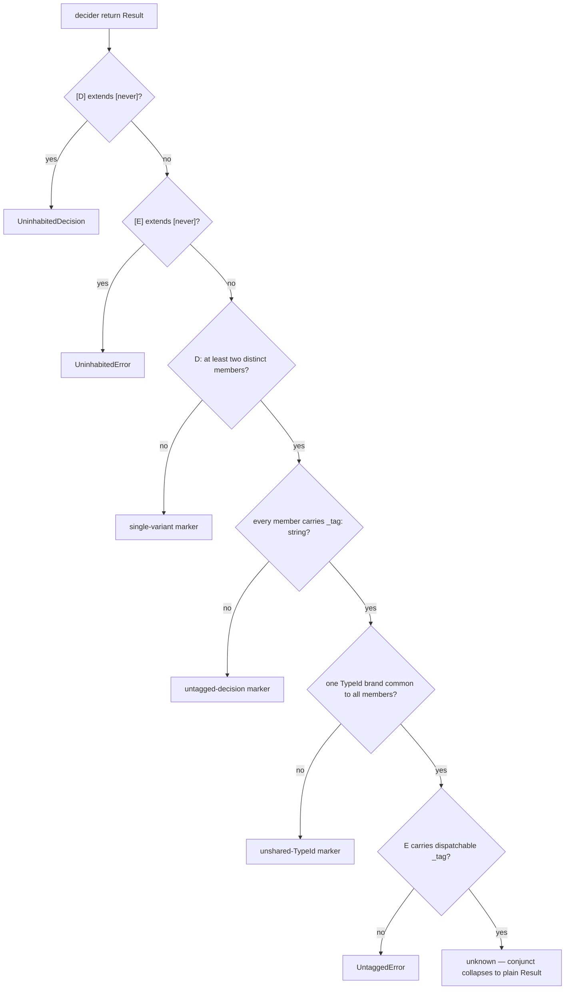

# Workflow Success-Channel Tagged Union - Plan

## Goal Capsule

- **Objective:** A workflow's success channel is a tagged union of at least two schema tagged classes that share one TypeId. The compiler refuses anything else at the `Workflow.make` call, with a marker diagnostic that names the defect.
- **Means:** Extend `Inhabited`'s decision branch with a union-shape conditional (KTD1). The `Workflow<Command, Decision, Error>` alias keeps its shape (KTD5).
- **Authority:** The implementing run owns `@systemfsoftware/effect-cell-types`, its fixtures and docs, and every migrating call site in `omp/plugins/` and `packages/testing/mutation/stryker-js/`; `packages/core/effect/daemon-spec/` is the compliant precedent tree and must only stay green. Publishing is intent-versioned (REPO-R2); merging to `main` stays human.
- **Stop conditions:** every `Workflow.make` call site compiles under the new constraint; every new type claim pinned red-first in `test-types/` (CELL-T2); `pnpm check:local` exits 0; PR watched to green (REPO-D1).
- **Execution profile:** Standard plan, six units, ordered U1 → U2 → U3 → (U4, U5 in any order) → U6.
- **Tail ownership:** The run commits, pushes, opens the PR, and watches checks.

---

## Product Contract

### Summary

`Workflow.make` today constrains only the error channel: `Inhabited<D, E>` resolves a `never` decision, a `never` error, and an untagged error to markers, but leaves the decision channel's shape unpoliced. A workflow may succeed with a bare `number`, a plain interface, or a single class — shapes that are not decisions. The compiler is tightened: the success channel must be a union of at least two variants, each carrying a dispatchable `_tag`, all sharing one TypeId — the decision family's brand. About two dozen of the twenty-seven sites in the research census violate this and migrate in the same change — the compiler sweep at U6, not this count, is the authoritative census; the tree does not compile half-migrated (REPO-D1).

### Problem Frame

The existing markers prove the mechanism: a marker in the decider's return conjunct turns a shape defect into a compiler diagnostic whose property name is the sentence. The decision channel never received that treatment. The cost is visible in the census (`## Sources`): one variant named `DryRunDecision`, a decision typed `number`, a decision that is a plain `{ verdict, code, stdout }` record. Each is a state machine hidden in a field or a scalar — the defect CONST-D4 and CONST-D3 name — and none of them gives `Match.tag` a closed union to exhaust.

Four sites already author the target shape by hand: a module-scope `unique symbol` brand, an instance field per variant class, a runtime law asserting it (`packages/core/effect/daemon-spec/src/internal/RestartDecision.workflow.ts:41-57`, the `Should_CarryTheDecisionBrand_When_DecidingARestart` law). The change makes that idiom the compiler's requirement instead of four authors' discipline.

### Requirements

**The constraint**

- R1. `Workflow.make` accepts a decider only when its success channel `D` is a union of at least two distinct variants; a single-variant decision resolves to the single-variant marker at the `make` call. Gate: tstyche assertions in `test-types/`, each observed red first (CELL-T2); `tsgo` typecheck.
- R2. Every member of `D` carries a `_tag` holding a string; a member without one resolves to the untagged-decision marker. Gate: tstyche; same red-first discipline.
- R3. Every member of `D` carries the same TypeId — one symbol-keyed brand property, one value type, common to all members; divergent brands or a missing brand resolve to the unshared-TypeId marker. Gate: tstyche; red-first.
- R4. The existing channel rules are unchanged: `UninhabitedDecision`, `UninhabitedError`, `UntaggedError` keep firing as today, and marker precedence orders the new markers after the `never` legs. Gate: the `never`-channel and `UntaggedError` claims keep their existing assertions; the inhabited-collapse claims re-anchor to U2's compliant branded fixtures — the current `Inhabited<Dec, Err>` collapse-to-`unknown` assertion pins unbranded interfaces and changes verdict under the new legs, so U2 re-authors it, red-first.

**Shape of the mechanism**

- R5. Markers ride the decider's return conjunct through `Inhabited`, in return position. No marker enters parameter position, where a conditional resolves `D` to `unknown` and collapses. Gate: typecheck; review of the signature.
- R6. `Workflow<Command, Decision, Error>` keeps its current definition; the alias gains no decision-shape conditional. Gate: the existing `Should_BeExactDeciderFunction_When_BothChannelsInhabited` and union-distribution claims stay green.

**Honesty**

- R7. The type-level check is presence, not force: it reads declared shape (`_tag`, the brand property), not provenance. A hand-declared interface that carries both still passes the type layer, and the package documents that boundary by audience — the type refusal ships with the package; a tree that runs the effect-workflow plugin gets no additional check for this constraint, because the plugin's charter delegates channel shape to `make` (`packages/lint/oxlint/plugins/cells/effect-workflow/README.md:25`). Gate: README states it; review.

**Migration**

- R8. Every `Workflow.make` call site complies: the second variant is derived from the site's real outcome space, and every variant keeps at least one producer. A site with genuinely one outcome is not a decision: its file leaves the `*.workflow.ts` surface (kernel or shell ownership) or the hidden outcome is promoted into the union. No producer-less variant is invented to satisfy the count. Gate: `pnpm check:local`; review per site against Gate C.
- R9. Migrations preserve observable behavior: each site's existing property laws and tests hold, with decision-typed assertions updated to the new union. Gate: per-package `test` tasks.

**Release surface**

- R10. The api-extractor report is regenerated (never hand-edited), the package README's diagnostic table and examples are updated, and a changeset ships for `@systemfsoftware/effect-cell-types` with a breaking-change note; packages whose build hash moves carry changesets per REPO-R2. Gate: `api:check`, `attw`, changeset gate in CI.

### Scope Boundaries

- The error channel keeps every current rule; nothing here tightens or relaxes it.
- Workflow files under `tests/__fixtures__/` are census members: a fixture workflow complies like any production site.
- `Cell.decide` is unchanged (KTD6): it keys on `WorkflowBrand`, which only `make` mints, so the success-channel guarantee is transitive at the Cell boundary.
- No lint rule is added (KTD6). The oxlint effect-workflow rules keep their current behavior — they read the `make` boundary structurally, not the channel types.
- Tag distinctness across variants (two variants sharing one `_tag` literal) is not policed; `Match.tag` dispatch is the failing observer there.
- No runtime guard is added to `make`; `make` stays the identity function plus the assertion signature.

---

## Planning Contract

### Key Technical Decisions

- KTD1. The decision-shape check is a conditional over the inferred `D` in `Inhabited`'s inhabited branch: a distributive-membership test answers "at least two distinct members" (the `IsUnion` pattern per `type-fest`'s `source/is-union.d.ts`), and a union-to-intersection step answers "one brand common to all members". Both legs are directional sketches here; the unit pins exact behavior with red-first assertions. Chosen over passing the decision classes as values (which would change every call site's signature for a benefit `Inhabited` already delivers at the same door) and over an AST census rule (which the plugin charter forbids itself: shape is the constructor's business).
- KTD2. "Same TypeId" is the decision family's hand-rolled brand: a module-scope `Symbol.for` const plus a `readonly [T]` instance field on each variant class. Effect v4 cannot supply it — the vendored static `TypeId` is the constant `'~effect/Schema/Schema'` shared by every class in the runtime (`repos/effect/packages/effect/src/internal/schema/schema.ts:8`), and the per-class `ClassTypeId` is an instance getter unique per class (`repos/effect/packages/effect/src/Schema.ts:14532`) — so neither reading is satisfiable, and the repo's own four compliant sites fix the meaning.
- KTD3. Provenance stays un-policed at the type layer. "Schema tagged class" is checked as declared shape (`_tag: string`, the family brand), because a brand is donatable by intersection and the corpus is explicit that a type constraint is presence, not force — force is the harness that consumes the exit code. The plan states this rather than claiming a closed world.
- KTD4. Migration derives variants from the site's real outcome space. A decision with one real outcome is a mis-filed calculation, not a workflow: the hidden second outcome is promoted if it exists, otherwise the file leaves the workflow surface. This keeps Gate C (one producer per variant) intact against the ≥2 floor. Two site shapes need the spelled-out procedure: an **aggregate success channel** (one variant co-producing several fields — Config's merged record, DryRun's counts) has no second outcome to promote; the variant boundary, where one exists, is whatever the consumer's behavior actually branches on, and a site whose consumer branches on nothing declassifies. An **error-channel-first site** (the real verdicts are the error variants — cli/RunOutcome, the interpreter fixtures' refusal) restructures by moving genuinely-decided domain verdicts into the decision union and leaving technical invalidity on the error channel; a success channel still single-outcome after that split declassifies. Never partition fields into variants to satisfy the count — a count-satisfying partition is exactly the gaming the presence-not-force boundary disclaims, and the observer that catches it is the review question "which consumer behavior distinguishes this variant?".
- KTD5. The `Workflow` alias is untouched; all new diagnostics live in `Inhabited`. The alias is a published type consumed in annotation position; the constructor is where authoring is compiled, and the existing markers already live there.
- KTD6. No `Cell.decide` change and no new lint rule. `Cell.decide` demands `WorkflowBrand`, which only `make` applies, so a decision that reaches a Cell was already shape-checked. The plugin's own README reserves channel shape to `make`; a second check there is the duplicate obligation its AGENTS.md forbids.
- KTD7. The corpus's decision-gate convention places its ≥2 floor across both channels and would admit a one-variant success channel beside an expert-named error. This repo strengthens the floor: the success channel itself carries the tagged union. The strengthening is deliberate and recorded here; the four compliant sites and the error-channel gates doc (`docs/solutions/architecture-patterns/workflow-error-channel-gates.md`) already author decisions as closed tagged unions.

### Grounding review

Three assumptions surfaced against the wiki and web sources, attacked under the **Edge-First** lens (first cycle; no prior lens).

1. "Union-member counting is inexpressible in TypeScript" (research finding) — killed: the distributive-membership technique is the published `IsUnion` implementation in `type-fest@5.0.0/source/is-union.d.ts`, and it answers exactly the ≥2-distinct-members question this plan needs. The expressible part survives; the claim is inverted.
2. "Schema's own TypeId satisfies the shared-TypeId leg" — killed by the vendored source: the static `TypeId` is one runtime-wide constant, and the per-class id is an instance getter unique per class. Only the family-brand reading (KTD2) is satisfiable, and it is the reading four production sites already implement.
3. "The ~23-site census is accurate" — survives at inventory scope: file paths and decision shapes were spot-verified against six sites (fixtures, `RestartDecision`, `delegation`, `admit`, `settings`, `DryRun`); the full list is re-verified at execution by the compiler itself, which is the census's failing observer once U1 lands.

Residue carried into verification: `tsgo` (TypeScript 7.0.2) must resolve the new conditionals identically to the prose above — pinned by R1-R3's red-first assertions, not assumed.

### High-Level Technical Design

Resolution order is load-bearing: the `never` legs keep their existing precedence, and each new marker names the first shape defect — so one broken channel yields one sentence, not a conjunction of complaints.

### Assumptions

- "Success channel" means the decision channel `D` of `Result<D, E>` — the decider's success side.
- The constraint is repo-wide in one change: a partially migrated tree does not compile, so no site is left behind by design.
- Pre-1.0 packages take breaking type changes directly (REPO-R1); no compatibility mode for previously accepted decision shapes.

---

## Implementation Units

### U1. Decision-shape machinery in `Workflow.ts`

- **Goal:** `Inhabited` resolves a shape-defective decision channel to a marker that names the defect.
- **Requirements:** R1, R2, R3, R4, R5, R6, R7.
- **Dependencies:** none.
- **Files:** `packages/core/effect/cell/types/src/Workflow.ts`.
- **Approach:**
  1. Add the union-shape conditional helpers as module-internal types, after the existing markers, in the file's established doc-comment style: each marker interface's property name carries the diagnostic sentence, and each helper documents its two-step mechanics the way `DispatchableTag` documents its own.
  2. Wire the decision branch into `Inhabited` after the `never` legs and before `DispatchableTag`, so marker precedence matches the HTD order.
  3. Leave `make`, `assertWorkflow`, and the `Workflow` alias untouched.
  4. State the presence-not-force boundary in the new markers' docs (R7).
- **Execution note:** Land with U2's first assertions written and observed red before the wiring exists, green after.
- **Patterns to follow:** `UninhabitedDecision`/`UntaggedError` marker style; `DispatchableTag`'s two-step `keyof`/indexed-access doc pattern.
- **Test scenarios:** covered by U2 (this unit is the mechanism; the assertions are the proof).
- **Verification:** `pnpm --filter @systemfsoftware/effect-cell-types typecheck test:types` exits 0 with U2 landed.

### U2. Type tests and decision fixtures

- **Goal:** Every claim in R1-R4 is a tstyche assertion, each observed failing once with its expect-error directive removed (CELL-T2).
- **Requirements:** R1, R2, R3, R4, R10.
- **Dependencies:** U1.
- **Files:**
  - `packages/core/effect/cell/types/test-types/Workflow.tst.ts`
  - `packages/core/effect/cell/types/tests/__fixtures__/Decision.schema.ts` (new — a `.tst.ts` may declare no runtime value)
- **Approach:**
  1. Declare compliant decision variants in `Decision.schema.ts` following the family-brand idiom: two `S.TaggedClass` variants carrying one module-scope `unique symbol` brand, plus a compliant `S.TaggedError`.
  2. Extend `Workflow.tst.ts`: a compliant union accepted with the plain-`Result` shape; single variant refused; divergent brands refused; missing brand refused; untagged member refused; marker precedence (`never` decision still wins over shape markers); the existing `never`-channel and `UntaggedError` claims re-run green unchanged.
  3. Negative decision fixtures are `declare`d in the test file, mirroring the command-side convention.
- **Test scenarios:**
  - `Inhabited<TwoVariants, Err>` resolves to `unknown` (the conjunct collapses).
  - `Inhabited<OneVariant, Err>` resolves to the single-variant marker; `Inhabited<TwoVariantsNoBrand, Err>` to the unshared-TypeId marker; `Inhabited<TwoVariantsDivergentBrands, Err>` likewise; `Inhabited<TwoVariantsWithUntaggedMember, Err>` to the untagged-decision marker.
  - The pre-existing `Inhabited<Dec, Err>` collapse-to-`unknown` claim is re-anchored: `Dec | Alt` (unbranded interfaces) now resolve to the unshared-TypeId marker — re-author that assertion against the branded fixtures, observed red-first, and let the old spelling pin the marker instead.
  - A decider over the compliant union is `toBeCallableWith`-accepted at `make`; a single-variant decider is refused.
- **Verification:** `pnpm --filter @systemfsoftware/effect-cell-types test:types typecheck` exits 0.

### U3. `effect-cell-types` self-migration and release surface

- **Goal:** The package's own workflows and its published story comply.
- **Requirements:** R8, R9, R10.
- **Dependencies:** U2.
- **Files:**
  - `packages/core/effect/cell/types/tests/__fixtures__/InterpreterDecide.workflow.ts`
  - `packages/core/effect/cell/types/tests/__fixtures__/InterpreterTracedDecide.workflow.ts`
  - `packages/core/effect/cell/types/tests/__fixtures__/TaggedCommand.workflow.ts`
  - `packages/core/effect/cell/types/tests/__fixtures__/WidenedCommand.workflow.ts`
  - `packages/core/effect/cell/types/tests/interpreter.integration.test.ts`
  - `packages/core/effect/cell/types/src/CanonicalDecide.workflow.ts` (if present; verify its decision shape)
  - `packages/core/effect/cell/types/test-types/Workflow.tst.ts` (fixture-typed assertions)
  - `packages/core/effect/cell/types/README.md`
  - `packages/core/effect/cell/types/etc/effect-cell-types.api.md` (regenerated via `api:update`)
  - `.changeset/` intent for the package
- **Approach:**
  1. Give the interpreter fixtures a compliant decision union. A refusal is a decision outcome in the Cell's semantics — the write phase receives it — so it belongs on the decision channel: `Admitted | Rejected` carrying the family brand. The decider must still name a real error variant and none may be invented: a negative length is a genuinely undecidable command, so the decider fails `Malformed` for it; if the integration test's pinned outcome-vs-failure semantics cannot be kept true under that shape, the fixture declassifies instead (KTD4). Read `tests/interpreter.integration.test.ts` first and keep every pinned assertion true. `InterpreterTracedDecide` follows `InterpreterDecide`.
  2. Re-author `TaggedCommand`/`WidenedCommand` decisions as compliant unions while preserving their command-channel claims (field exposure, `_tag`, widening proof); update the pinned expected types.
  3. Update the README: the diagnostic table gains the new markers; examples show the compliant authoring shape; the presence-not-force sentence lands in the guarantee prose.
  4. Regenerate the api report; write the changeset with the breaking-change note.
- **Test scenarios:**
  - The interpreter integration suite passes with the migrated fixtures, keeping its phase-order and outcome-vs-failure semantics.
  - `test:types` pins the migrated fixture channels.
- **Verification:** `pnpm --filter @systemfsoftware/effect-cell-types typecheck test:types test lint api:check attw` exits 0.

### U4. `omp` plugins migration

- **Goal:** The three non-compliant plugin workflows comply with their real outcome spaces.
- **Requirements:** R8, R9.
- **Dependencies:** U2.
- **Files:**
  - `omp/plugins/omp-claude-compat/src/hooks/hooks.workflow.ts` (decision is a plain interface — the deepest migration)
  - `omp/plugins/omp-claude-compat/src/hooks/admit.workflow.ts` (two variants, no brand)
  - `omp/plugins/omp-claude-compat/src/settings/settings.workflow.ts` (two variants, no brand)
  - `omp/plugins/omp-agent-discipline/src/delegation/delegation.workflow.ts`, `.../doctrine/doctrine.workflow.ts` (compliant — verify only)
  - each migrated site's in-source law/property file and consumers that match on the decision type
- **Approach:**
  1. `admit`/`settings`: add the decision family brand (module-scope symbol + instance field per variant), preserving variant names and fields.
  2. `hooks`: replace the `HookVerdictDecision` record with a closed union of ≥2 `S.TaggedClass` verdict variants carrying a family brand; derive the variant set from the workflow's real verdict space (the exit-code dispatch already names them); migrate the matching consumers and laws in the same commit.
  3. Touch nothing in the compliant `delegation`/`doctrine` workflows beyond the compile check.
- **Test scenarios:**
  - Each migrated workflow's in-source laws keep their claims (decisions asserted by tag now, not by record fields).
  - Consumers that matched on the old record shape match on the union's tags with `Match.tag` + `Match.exhaustive`.
- **Verification:** `pnpm --filter @systemfsoftware/omp-claude-compat typecheck test lint` and the same for `omp-agent-discipline` exit 0.

### U5. `stryker-js` migration

- **Goal:** All stryker-js workflows comply, each second variant derived from the site's real outcome space (KTD4).
- **Requirements:** R8, R9.
- **Dependencies:** U2.
- **Files:** the failing sites from the census, each with its law/property file and direct consumers:
  - `packages/testing/mutation/stryker-js/engine/src/` — `Config`, `DryRun`, `IncrementalDiff`, `IncrementalReport`, `Instrument`, `JsonReport`, `Mutants`, `MutationTest`, `Plugins` (plain-interface decision), `Project`, `Reporter`, `Run`, `Sandbox`, `Checker` (two variants, no brand)
  - `packages/testing/mutation/stryker-js/engine/tests/__fixtures__/admit-order.workflow.ts` (single success variant; census member)
  - `packages/testing/mutation/stryker-js/stryker-js/src/` — `Run`, `ClassifyExit`
  - `packages/testing/mutation/stryker-js/cli/src/` — `Output` (plain object decision), `RunOutcome` (error-channel-first), `Survivors` (compliant — verify only)
  - `packages/testing/mutation/stryker-js/typescript-checker/src/Checker.workflow.ts` (plain-interface decision)
  - `packages/testing/mutation/stryker-js/vitest-runner/src/` — `VitestDryRun`, `VitestMutantRun`
  - `packages/testing/mutation/stryker-js/instrumenter/src/Instrument.workflow.ts`
  - `packages/testing/mutation/stryker-js/html-reporter/src/Reporter.workflow.ts`
- **Approach:**
  1. Per site: read the decider body and its error channel first. Where the workflow already produces a second distinguishable outcome (an early refusal, a no-op path, an empty-selection case currently encoded as a field or an empty array), promote it into a decision variant. Where the outcome space is genuinely one, declassify the file from the workflow surface (KTD4).
  2. Channel restructures, not brand-adds: `cli/RunOutcome` (its real branching lives on the five error variants) and the engine aggregates (`Config`, `DryRun`, `Plugins`, `Mutants`) follow KTD4's spelled-out procedure — decision variants only where consumer behavior distinguishes, technical invalidity stays on the error channel, declassify when no honest split exists.
  3. Two-variant sites (`engine/Checker`) take the family brand only.
  4. Plain-interface sites (`Plugins`, `typescript-checker/Checker`, `cli/Output`) are re-authored as schema tagged classes; fields move into variants per CONST-D4.
  5. Update consumers and laws in the same commit as each site, including cross-package consumers — `ResolvedMode` lives in `packages/testing/mutation/stryker-js/engine/src/output-mode.ts` and is consumed from engine's `Run.ts` and `Reporter.ts`.
- **Execution note:** Migration is behavior-preserving by construction (R9) — mutation scores are CI-judged (REPO-D3); run no local mutation.
- **Test scenarios:**
  - Each promoted variant has at least one producer asserted by an existing or added law (Gate C).
  - Each declassified site's former decision logic keeps its coverage at its new home.
  - `workflow-match-exhaustive` keeps firing on every migrated dispatch — consumers exhaust the new unions.
- **Verification:** per-package `typecheck test lint` exit 0 across the stryker-js tree.

### U6. Sweep, changesets, and release gate

- **Goal:** The whole tree compiles under the new compiler; the release surface is complete.
- **Requirements:** R8, R10.
- **Dependencies:** U3, U4, U5.
- **Files:** `.changeset/` intents for every workspace package whose build hash moved; `docs/solutions/architecture-patterns/workflow-error-channel-gates.md` (see-also line gains the new markers).
- **Approach:**
  1. Census re-run: every `Workflow.make` site compiles — the compiler is the census observer; `pnpm check:local` exits 0.
  2. Write changesets per REPO-R2 (body ships verbatim as CHANGELOG — consumer-observable facts only).
  3. Update the gates solution doc's see-also list.
- **Test scenarios:** `Test expectation: none -- release bookkeeping; the per-package gates ran in U3-U5.`
- **Verification:** `pnpm check:local` exits 0; changeset gate passes in CI.

---

## Verification Contract

| Gate             | Command                                                           | Proves                                 |
| ---------------- | ----------------------------------------------------------------- | -------------------------------------- |
| Type claims      | `pnpm --filter @systemfsoftware/effect-cell-types test:types`     | R1-R4, R6 (each red-first per CELL-T2) |
| Package behavior | `pnpm --filter <pkg> test`                                        | R9 per migrated package                |
| Whole tree       | `pnpm check:local`                                                | R8; REPO-D1 restartable tree           |
| Publish surface  | `pnpm --filter @systemfsoftware/effect-cell-types api:check attw` | R10                                    |
| CI               | `gh pr checks --watch --fail-fast`                                | REPO-D1                                |
| Mutation         | CI advisory Mutation workflow only                                | REPO-D3 — never locally                |

---

## Definition of Done

- Global: every unit's verification exits 0; `pnpm check:local` exits 0 after the last edit; PR open and watched to green; no dead-end code from abandoned approaches left in the diff.
- Per-unit: the unit's gates pass before the next unit starts; U2's assertions each observed red before their claim compiled.
- Cleanup: no leftover compliant-in-name-only variants; every promoted variant has a producer; the census grep over `*.workflow.ts` names no site the compiler does not accept.

---

## Sources

- `packages/core/effect/cell/types/src/Workflow.ts` — current `Inhabited`/`DispatchableTag`/marker machinery; the brand doc citing the family-brand precedent files.
- `packages/core/effect/daemon-spec/src/internal/RestartDecision.workflow.ts:41-93` — the compliant idiom and its runtime brand law.
- `docs/solutions/architecture-patterns/workflow-error-channel-gates.md` — Gate A/B/C; decisions as closed tagged unions dispatched exhaustively.
- `docs/plans/2026-08-22-001-feat-workflow-command-schema-enforcement-plan.md` — the command-channel precedent this change mirrors on the success channel; its scope line deferred exactly this work.
- `repos/effect/packages/effect/src/Schema.ts` (`:14317` Class, `:14444` static TypeId, `:14532` per-class id, `:14720` TaggedClass) and `repos/effect/packages/effect/src/internal/schema/schema.ts:8` — the vendored facts that fix KTD2's meaning.
- `https://unpkg.com/type-fest@5.0.0/source/is-union.d.ts` — the primary source for the ≥2-distinct-members test.
- Census: the per-site inventory was produced by repo research and spot-verified against `InterpreterDecide.workflow.ts`, `TaggedCommand.workflow.ts`, `RestartDecision.workflow.ts`, `delegation.workflow.ts`, `admit.workflow.ts`, `settings.workflow.ts`; U6's compiler sweep is its failing observer.
