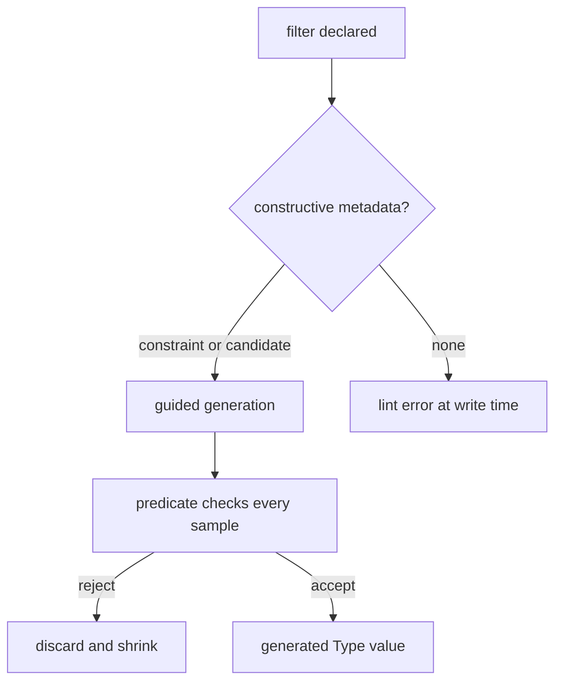
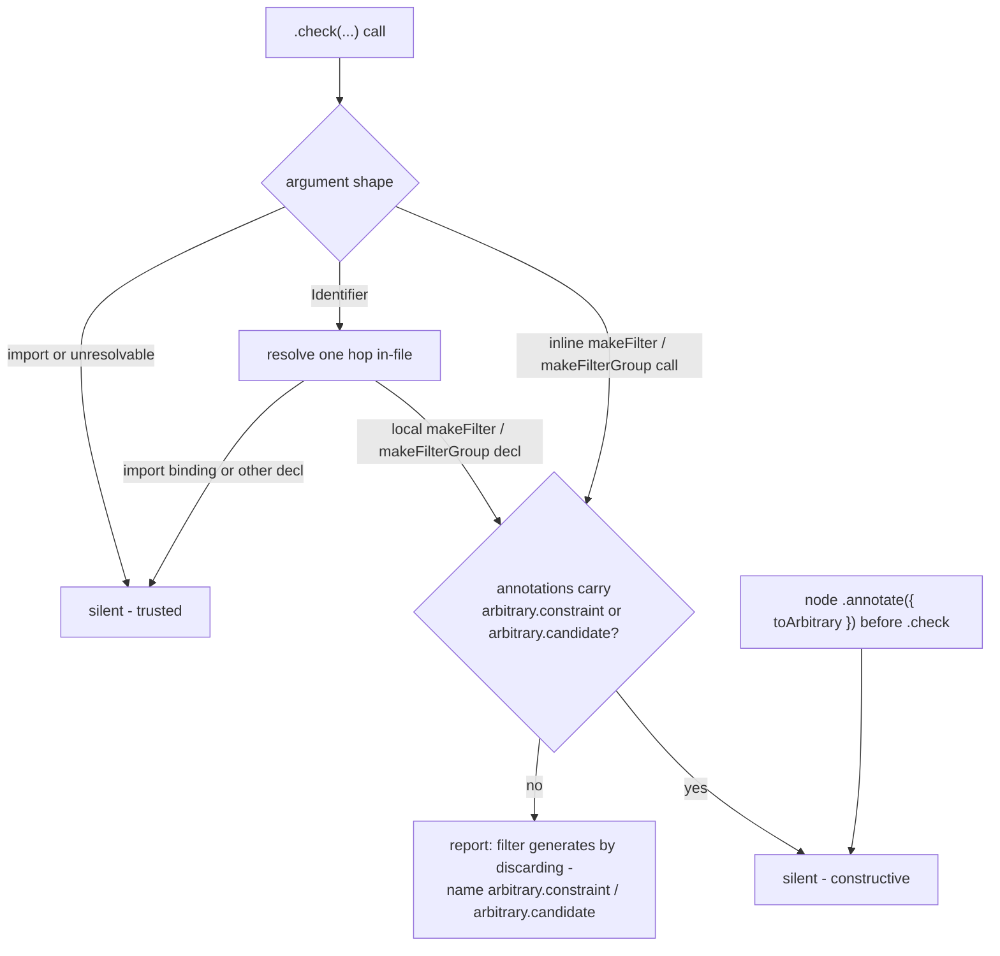

# Schema v4 Constructive Generation Enforcement - Plan

## Goal Capsule

- **Objective:** A coding agent cannot land a schema filter that generates by discarding. Constructive generation is mandatory wherever a predicate exists, so property suites exercise their invariants at full strength and nobody reaches for `numRuns` as a performance fix.
- **Means:** One doctrine — a filter that cannot construct its own samples cannot land — enforced by a write-time lint gate (KTD1–KTD3), with the skill and TTSR window rewritten to match (KTD4).
- **Product authority:** Brainstorm dialogue of 2026-09-04; remaining product decisions delegated to the agent and recorded in Key Decisions.
- **Stop conditions:** Any unit's verification contract fails after two honest attempts, or research invalidates a session-settled decision.

---

## Product Contract

### Summary

Adopt Effect Schema v4's three-hook generation model — `arbitrary.constraint` narrows the base generator, `arbitrary.candidate` adds a weighted constructor, `toArbitrary` replaces the node — as enforced doctrine: a filter without constructive metadata fails lint at write time, and the property-testing skill plus its TTSR rule stop teaching the v3 forms (`Arbitrary.make`, node-replacing `annotations({ arbitrary })`). The predicate always stays law; hints only guide construction.

### Problem Frame

The observed failure: an agent faced with a slow property suite lowered `numRuns` instead of fixing generation, because it did not know constructive generation existed. The window already taught the right rule — the skill's PT10 says lowering `numRuns` to fit a wall-clock budget is the defect — and the agent did it anyway, because prose doctrine has no Reach over an agent that never loads it at the decision point.

Under v3 the discard-heavy path was structural: one `arbitrary` callback replaced the node, and anything not expressible that way became rejection sampling. v4 made generation compositional, but nothing in this repo's gates or window reflects that yet: the TTSR rule still prescribes `Arbitrary.make`, the skill still teaches the v3 replacement annotation, and the lint plugin gates only the FastCheck import. The cost shape is green suites that exercised almost nothing, and derivation hangs that surface in CI with no report.

### Key Decisions

- **Gates plus matching window** (session-settled: user-directed — chosen over gates-only and window-first: the skill already taught "don't lower numRuns" and agents did it anyway; doctrine must be enforced and taught). Governs R4, R6, R7.
- **Schema-side contract is this work's must-ship** (session-settled: user-directed — chosen over shipping schema and test contracts in one plan: the schema contract alone satisfies the stated minimum). Governs R1; the test-side lives in Scope Boundaries.
- **Write-time lint is the constructability gate.** Derivation reports were removed upstream; compile cannot see a missing annotation; tests never fail on one. The static rule is the only always-on check. Governs R1, R4.
- **The predicate is law; candidates are efficiency hints** (session-settled: user-directed — chosen over v3 replace-the-node semantics: v4 makes the filter the owner and the hint disposable, so a bad candidate costs draws, never correctness). Governs R2.

### Requirements

**Generation contract**

- R1. A `.check()` whose filter carries no `arbitrary.constraint`, no `arbitrary.candidate`, and no preceding node `toArbitrary` override is reported by lint at write time. The gate resolves the filter to its declaration, so the sanctioned shared form — `const f = Schema.makeFilter(...)` applied as `.check(f)` — is covered, not only inline checks.
- R2. Candidates and constraints only guide construction; type-side filters check every generated value. Tooling and doctrine never present a candidate as a substitute for the predicate.
- R3. Derivation failures stay loud: impossible constraints, invalid candidate weights, and recursion without a terminal path throw at derivation, and nothing in the toolchain suppresses or downgrades those throws.

**Gate**

- R4. The gate fires on the schema authoring act at `error` severity, and its message names the fix: `arbitrary.constraint` when the filter maps to the constraint vocabulary, `arbitrary.candidate` when it needs a constructor.
- R5. `*.schema.ts` stays declaration-only: constructive metadata rides the filter annotation; no exported arbitrary constants appear to satisfy the gate.

**Window**

- R6. The property-testing skill teaches the three hooks as distinct mechanisms and retires the v3 node-replacing annotation form.
- R7. The TTSR property-test rule names the schema as the input space via v4 derivation and drops the `Arbitrary.make` prescription.
- R8. The window teaches override placement: a node `toArbitrary` goes before the filters; an override placed after a filter it cannot satisfy exhausts the discard budget.

### Acceptance Examples

- AE1. Given `Schema.Struct({...}).check(uniqueSlots)` where `uniqueSlots` is a `Schema.makeFilter` carrying only a boolean predicate, when the author saves the file, then lint reports the check and names the missing `constraint` or `candidate` metadata. **Covers R1, R4.**
- AE2. Given a filter whose candidate constructor emits values the predicate rejects, when the property suite runs, then the predicate still filters those samples — draws are wasted, and no value the Type forbids is ever emitted. **Covers R2.**
- AE3. Given mutually exclusive constraints on one node, when the arbitrary is derived, then derivation throws immediately — no hang, no silent discard-budget burn. **Covers R3.**
- AE4. Given the rewritten window, when an agent authors a refined schema, then the doctrine it loads names `constraint` or `candidate` on the filter and never `Arbitrary.make` or the v3 replacement annotation. **Covers R6, R7.**

### Success Criteria

- A slow property suite is fixed at the generator, never by lowering `numRuns` — the discard-heavy path no longer exists to slow it.
- Every `Schema.makeFilter` in the workspace either carries constructive metadata or is named by the gate.
- The window surfaces contain zero prescriptions of `Arbitrary.make` or the v3 replacement annotation form.

### Scope Boundaries

**Deferred for later**

- The test-side contract — banning `.filter()` on arbitraries, node-replacing `Arbitrary.make` overrides, and `numRuns` literals in test files. A sibling increment; see How This Work Fits Together.
- Migrating existing call sites to the doctrine (the bounded-union package's node-level `toArbitrary` hook).

**Outside this work's identity**

- Changing Effect's derivation semantics.
- Changing the generated schema-law suite's round-trip pair.

<!-- ce-section: work-relationships -->

### How This Work Fits Together

This plan owns the schema-side generation contract: the gate and the window for the schema authoring act. The broader request named three enforcement surfaces; the breakdown below is current understanding, not a committed roadmap.

- Test-side generation contract (`.filter()` bans, `Arbitrary.make`-replacement bans, `numRuns`-literal gates on test files)
  - Depends on this plan's doctrine being in force; can proceed independently once the schema contract lands.
- Existing call-site migration (bounded-union's node-level hook and similar)
  - Follows this plan's doctrine; not gated by it.

### Dependencies / Assumptions

- A1 — the three-hook model (`arbitrary.constraint`, `arbitrary.candidate`, node `toArbitrary`), predicate-always-wins, and throw-on-impossible semantics. Warrant: vendored source, `repos/effect/packages/effect/src/internal/schema/toArbitrary.ts`.
- A2 — derivation reports (`{ report: true }`, `OpaqueFilter`) are removed in the current RC; the lint gate is the only constructability report. Warrant: vendored pre-release changeset, `repos/effect/.changeset/pre/schema-arbitrary-factory.md`. The public docs page still shows `report: true`; per REPO-W4 the vendored tree is authoritative.
- A3 — a lint rule can resolve a `.check(f)` filter to its `Schema.makeFilter` declaration. Warrant: repo precedent for binding resolution in `packages/lint/oxlint/plugins/cells/effect-workflow/src/rules/make-command-schema.ts`.
- Effect v4 is adopted workspace-wide (`catalog:` at `^4.0.0-rc.112`, per `pnpm-workspace.yaml`), so the hooks exist in every enrolled package.

### Sources / Research

- Vendored Effect tree: `repos/effect/packages/effect/src/internal/schema/toArbitrary.ts` (candidate/constraint/filter mechanics), `repos/effect/.changeset/pre/schema-arbitrary-factory.md` (report removal), `repos/effect/packages/effect/SCHEMA.md` (hook placement guidance).
- Effect v4 docs, "Schema to Arbitrary" (secondary; lags the vendored RC).
- Current surfaces this work changes: `packages/lint/oxlint/plugins/testing/property-testing/README.md` (import-only gate today), `packages/lint/oxlint/plugins/effect/schema/README.md` (declaration-vs-use boundary), the user-level TTSR rule `architect-property-tests` (prescribes `Arbitrary.make`), and the property-testing skill's PT2 (teaches the v3 replacement annotation).
- `CONCEPTS.md`: Reach, Generated schema law.
- Institutional learnings: `docs/solutions/architecture-patterns/constraint-reaches-only-via-window-or-gate.md` (registration is not delivery; gate outside the judged party's write scope), `docs/solutions/architecture-patterns/label-routed-rules-are-unfalsifiable.md` (key the rule on what the AST can decide), `docs/solutions/architecture-patterns/an-escape-hatch-is-an-unfalsified-hypothesis.md` (state the claim at its true strength; pin the blind spots as valid cases), `docs/solutions/tooling-decisions/rule-admission-severity-and-accretion.md` (`warn` is silence).

---

Product Contract preservation: unchanged — every R/AE/Key Decision carried verbatim; the Sources section alone gained institutional-learnings entries during research.

## Planning Contract

### Key Technical Decisions

- KTD1. The rule lives in the `effect-schema` plugin. The gate reads the schema authoring act — where filters and checks are declared — which is that plugin's domain; the property-testing plugin owns test files. Plugins stay decoupled: no cross-plugin import (precedent: KTD3 in `docs/plans/2026-08-30-2143-fix-workflow-export-topology-plan.md`). Governs R4; cited by U1.
- KTD2. Detection reads `.check(...)` call arguments and locally-declared `Schema.makeFilter` / `Schema.makeFilterGroup` bindings, resolving an argument identifier to its initializing declaration one hop in-file (adapted from `make-command-schema.ts`'s `localVariable` machinery; that helper stays local to its package — copy-adapt, never import across plugins). An argument that resolves to an import is trusted: every built-in filter carries its metadata upstream, and a filter authored in another repo is invisible to this file's AST. The claim is stated at that strength and the blind spots are pinned as valid cases (learning: `an-escape-hatch-is-an-unfalsified-hypothesis.md`). Governs R1; cited by U1.
- KTD3. Evaluator discipline: the rule, its registration, the `recommended` entry, the api report, and the changeset land in one evaluator commit with observed red before and green after recorded in the commit body (`a85457ec56` shape). Any in-tree violations it exposes are fixed in a separate migration commit, never the same one. Governs R1, R4; cited by U1, U2.
- KTD4. The window surfaces live outside the repo — the user-level skill directory and TTSR rule — so repo gates, changesets, and PR review never cover them. They are rewritten directly and verified by the harness's own trigger test plus a re-read; the plan records them as unversioned work. Governs R6–R8; cited by U3, U4.
- KTD5. No derivation-report surface is built or taught: `Schema.toArbitrary` at `rc.112` is the factory form, `ToArbitrary.Filter` is `{ constraint?, candidate? }`, and the `report`/`OpaqueFilter` mechanism was removed upstream. The static rule is the constructability report; `filter-too_much`-style runtime signals are out of scope. Governs R1, R3; cited by U1.

### Assumptions

- In-tree `makeFilter` usage is near-zero (workspace grep found none outside the vendored tree); U2's migration list is expected to be empty, and a red fixture drives the observed-red evidence instead.
- `Annotations.Filter` (the second `makeFilter` parameter) is where `arbitrary` metadata rides at `rc.112`; if implementation finds it moved, the rule follows the installed d.ts, never the website docs.
- The user-level window files may be replaced by harness updates; they carry no version pin.

### High-Level Technical Design

Sequencing: U1 lands the gate alone and is verified red-then-green; U2 consumes U1's red list; U3 and U4 are independent of U2 and can proceed in parallel once U1 is green.

---

## Implementation Units

### U1. Add the schema filter constructability rule

- **Goal:** A new `schema-filter-constructive-generation` rule in the `effect-schema` plugin reports every locally-declared filter that cannot construct its own samples. Covers R1–R5 (AE1, AE3 as fixtures).
- **Requirements:** R1, R2 (message wording), R4, R5.
- **Dependencies:** none.
- **Files:**
  - `packages/lint/oxlint/plugins/effect/schema/src/rules/schema-filter-constructive-generation.ts` (new)
  - `packages/lint/oxlint/plugins/effect/schema/src/rules/schema-filter-constructive-generation.config.ts` (new — meta, message catalog, no options)
  - `packages/lint/oxlint/plugins/effect/schema/src/rules/__tests__/schema-filter-constructive-generation.test.ts` (new)
  - `packages/lint/oxlint/plugins/effect/schema/src/index.ts` (register + `recommended` at `error`)
  - `packages/lint/oxlint/plugins/effect/schema/README.md` (rule row)
  - `packages/lint/oxlint/plugins/effect/schema/etc/oxlint-plugin-effect-schema.api.md` (regenerate via `pnpm api:update`)
  - `.changeset/schema-v4-constructive-generation.md` (new; plugin minor)
- **Approach:**
  1. Visit `CallExpression` for member calls named `check` whose object chain is alias-tolerant (`Schema`/`S`/`effect` import), mirroring the canonical-path walk in `make-command-schema.ts:47-60`.
  2. For each argument: an inline `makeFilter`/`makeFilterGroup` call inspects its annotations argument for an `arbitrary` property whose value carries `constraint` or `candidate`; an `Identifier` resolves via scope walk (copy-adapt `make-command-schema.ts:89-114`) to its initializing declaration and repeats the inspection; anything else (imports, non-filter declarations) stays silent.
  3. A filter whose `arbitrary` value is a function — the v3 replacement form — is also reported, with a message naming the two-key object form.
  4. Message text names the fix per R4: `arbitrary.constraint` when the predicate maps to the constraint vocabulary (length, range, pattern, integer, unique), otherwise `arbitrary.candidate` with a constructor.
  5. Register the rule, set `recommended` to `error`, regenerate the api report, write the changeset.
- **Patterns to follow:** `schema-declaration-location.ts` + its config file (rule/config split, alias tolerance, `SCHEMA_USE_MEMBERS`-style member tables); `make-command-schema.ts` (canonical path + one-hop scope resolution); the `a85457ec56` commit shape (KTD3).
- **Test scenarios:**
  - Valid: inline `makeFilter(pred, { expected, arbitrary: { constraint: {...} } })` — silent.
  - Valid: inline `makeFilter(pred, { expected, arbitrary: { candidate: { make } } })` — silent.
  - Valid: shared `const f = Schema.makeFilter(pred, { arbitrary: { constraint } })` applied as `.check(f)` — silent.
  - Valid: `.check(Schema.isMinLength(3))` and any imported filter binding — silent (trusted import; KTD2's claim stated at its true strength).
  - Valid: node annotated `.annotate({ toArbitrary: ... })` before `.check(f)` — silent (R1's override arm).
  - Valid: `.check(f)` where `f` resolves to a non-filter local declaration — silent (not this rule's subject).
  - Invalid: inline `.check(Schema.makeFilter(pred))` with no annotations — reported, message names `constraint`/`candidate`.
  - Invalid: shared `const f = Schema.makeFilter(pred)` applied as `.check(f)` — reported at the check site (AE1).
  - Invalid: `makeFilter(pred, { arbitrary: (fc) => ... })` — function-valued form reported with the two-key message.
  - Invalid: `makeFilterGroup(checks)` with no annotations applied via `.check(...)` — reported.
  - Edge: two checks in one `.check(a, b)` where only `b` lacks metadata — one report naming `b`'s site.
  - Edge: `S.` alias and namespace-import forms (`import * as S from 'effect/Schema'`) both fire — mirrors `schema-declaration-location`'s alias arm.
- **Execution note:** This is the evaluator surface — land it in its own commit and observe red before and green after (KTD3); the red list goes in the commit body.
- **Verification:** `pnpm --filter @systemfsoftware/oxlint-plugin-effect-schema test` green with the suite's case count read; `pnpm --filter @systemfsoftware/oxlint-plugin-effect-schema build && pnpm --filter @systemfsoftware/oxlint-plugin-effect-schema api:check` green; a scratch probe file with an unannotated filter reports the new rule id.

### U2. Migrate in-tree filters exposed by the gate

- **Goal:** The workspace passes the new rule with zero suppressions. Covers R1, R5 (success criterion: every makeFilter carries metadata or is named).
- **Requirements:** R1, R5.
- **Dependencies:** U1.
- **Files:** any in-tree file the gate reports (expected: none — the workspace grep found no `makeFilter` usage outside the vendored tree); otherwise one fix per reported site plus its property suite.
- **Approach:**
  1. Run the enrolled lint over the tree.
  2. For each finding, add `arbitrary.constraint` when the predicate maps to the constraint vocabulary, else `arbitrary.candidate` with a constructor; never delete the predicate (R2).
  3. If the red list is empty, record that in U2's commit-free verification — the unit still runs, it just fixes nothing.
- **Patterns to follow:** the v4 shapes in `repos/effect/packages/effect/SCHEMA.md` (prime-number constraint, palindrome candidate).
- **Test scenarios:**
  - Each fixed site's existing property suite stays green with unchanged case counts.
  - For a fixed filter, a candidate still rejects predicate-failing draws where the suite can express it (R2's predicate-is-law) — skip when no suite covers the site.
- **Test expectation:** none — when the red list is empty, this is a verified absence, recorded in the run log, not a skipped unit.
- **Verification:** workspace lint green tree-wide; no `oxlint-disable` added anywhere (root grep unchanged).

### U3. Rewrite the property-testing skill to the v4 hooks

- **Goal:** The skill teaches `constraint` / `candidate` / node `toArbitrary` as three distinct mechanisms, retires the v3 replacement annotation, and teaches override placement (R8). Covers R6, R8 (AE4).
- **Requirements:** R6, R8.
- **Dependencies:** U1 (doctrine must match the shipped gate's message vocabulary).
- **Files (user-level harness state — outside this repo; KTD4):**
  - `~/.omp/agent/skills/architect-property-tests/SKILL.md` — PT2 rewrite, worked example rewrite, anti-pattern rows for the v3 forms.
  - `~/.omp/agent/skills/architect-property-tests/references/schema-arbitrary.md` — the v3 annotation mechanics replaced with the filter-hint model.
  - `~/.omp/agent/skills/architect-property-tests/SKILL.md` Reference Integrity Gate hash table — recompute the hash for every changed reference (the gate reads it before each load).
- **Approach:**
  1. PT2 becomes: pass the Schema to `it.prop`; give every custom filter an `arbitrary: { constraint }` or `arbitrary: { candidate }` at the filter; a node `toArbitrary` override goes before the filters (R8).
  2. Retire everywhere: `S.annotations({ arbitrary })` as a filter's generator, `Arbitrary.make(schema)` as the derivation path (kept only where the test-side contract will ban it later — out of scope here).
  3. Keep PT1/PT3/PT10 intact; the rejection-trap canon now points at the gate instead of `fc.configureGlobal({ verbose: true })` as the first detector.
  4. Update the worked example to the v4 form; add an anti-pattern row for a node `toArbitrary` placed after a filter it cannot satisfy.
  5. Recompute and write the integrity hash for `references/schema-arbitrary.md`.
- **Patterns to follow:** the skill's existing YAML-rule + canon-quote structure; the TTSR rule's Re-issue wording style.
- **Test scenarios:**
  - Grep the skill directory: zero `Arbitrary.make` prescriptions and zero `annotations({ arbitrary })` replacement examples remain (success criterion).
  - The hash table entry for `references/schema-arbitrary.md` matches the file (integrity gate passes on next load).
- **Test expectation:** none — prose doctrine; the greps and hash check are the proof.
- **Verification:** re-read the rewritten skill cold; the PT2 rule names both hook keys; the hash gate passes.

### U4. Rewrite the TTSR property-test rule

- **Goal:** The rule that fires on `*.property.test.ts` writes names v4 derivation and constructive filters instead of `Arbitrary.make`. Covers R7 (AE4).
- **Requirements:** R7.
- **Dependencies:** U1.
- **Files (user-level harness state — outside this repo; KTD4):**
  - `~/.omp/agent/rules/architect-property-tests.md` — the "schema is the input space" bullet and the frontmatter `description` if it names `Arbitrary.make`.
- **Approach:**
  1. Replace the derivation bullet: the schema is the input space — derive via `Schema.toArbitrary(schema)(FastCheck)` or hand the schema to `it.prop`; every custom filter carries `arbitrary: { constraint | candidate }`.
  2. Keep the scope globs, `interruptMode`, and the other bullets untouched.
  3. Probe the rule still fires and still stays silent off-scope.
- **Patterns to follow:** `no-sync-schema-codecs.md`'s self-test invocation comment (`omp ttsr test --json -r <file> --source tool --tool write --path 
 '<content>'`).
- **Test scenarios:**
  - `omp ttsr test -r ~/.omp/agent/rules/architect-property-tests.md --source tool --tool write --path src/x.property.test.ts 'const a = 1'` → Triggered (1).
  - Same probe against `src/x.ts` → No rules triggered.
- **Test expectation:** none beyond the trigger probes — prose rule.
- **Verification:** both probes observed; the rule text contains no `Arbitrary.make` prescription.

---

## Verification Contract

| Gate                | Command                                                                                                                                                                                                       | Proves                                                                                                             |
| ------------------- | ------------------------------------------------------------------------------------------------------------------------------------------------------------------------------------------------------------- | ------------------------------------------------------------------------------------------------------------------ |
| Rule suite          | `pnpm --filter @systemfsoftware/oxlint-plugin-effect-schema test`                                                                                                                                             | U1 fixtures; read case counts, not exit codes                                                                      |
| Package gates       | `pnpm --filter @systemfsoftware/oxlint-plugin-effect-schema build && pnpm --filter @systemfsoftware/oxlint-plugin-effect-schema api:check && pnpm --filter @systemfsoftware/oxlint-plugin-effect-schema lint` | U1 ships clean                                                                                                     |
| Enrollment reach    | `pnpm check:lint-coverage`                                                                                                                                                                                    | 15 production / 0 uncovered — registration is delivery (learning: `constraint-reaches-only-via-window-or-gate.md`) |
| Tree honesty        | workspace lint after U2; root grep for `oxlint-disable` unchanged                                                                                                                                             | U2 fixed or found nothing, no suppressions                                                                         |
| Window (user-level) | the U4 `omp ttsr test` probes; skill hash gate                                                                                                                                                                | R6–R8 doctrine actually loads and triggers                                                                         |
| Full chain          | `pnpm check:local`                                                                                                                                                                                            | REPO-D1                                                                                                            |

Mutation runs stay in CI (`REPO-D3`) — never start one locally.

---

## Definition of Done

- The rule suite, package gates, enrollment reach, and `pnpm check:local` are green after the last edit.
- The evaluator commit's body records observed red before and green after (KTD3); the tree-wide migration, if any, is a separate commit.
- The window surfaces contain zero `Arbitrary.make` prescriptions and zero v3 replacement-annotation examples; the U4 trigger probes pass.
- The changeset intent exists for the plugin (`pnpm change --bump minor`); commits follow REPO-C1/C2; abandoned probe files are deleted.
- The Goal Capsule objective is checkable from outside the component: an agent writing an unannotated filter cannot land it.
