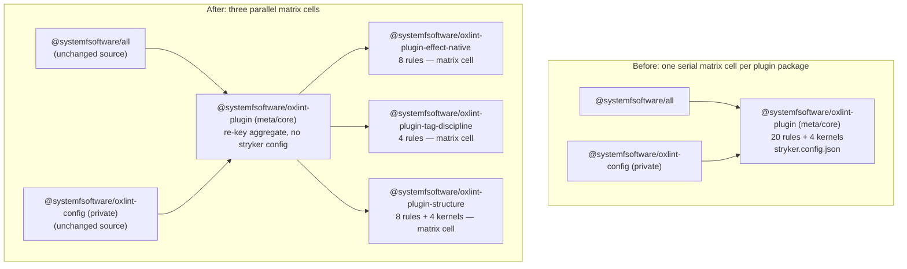

# Split the core oxlint plugin into mutation-budget packages - Plan

## Goal Capsule

- **Objective:** Every oxlint-plugin package enrolled in the CI mutation matrix completes its Stryker job inside the step budget with real mutant coverage — no matrix cell times out at zero completed mutants, and no cell passes vacuously over an empty mutate set.
- **Means:** Split `packages/lint/oxlint/plugins/meta/core` into three domain leaf packages; `@systemfsoftware/oxlint-plugin` remains the consumer-facing plugin by importing the leaves and re-registering their rules under its own namespace (KTD1, KTD2).
- **Authority:** Root `AGENTS.md`; `packages/lint/oxlint/plugins/AGENTS.md`. Every load-bearing rule below names its gate.
- **Execution profile:** Sequential units, one pull request, `pnpm check:local` green after the last edit (REPO-D1).
- **Stop conditions:** Definition of Done. No intermediate yield.

---

## Product Contract

### Summary

The CI mutation gate runs one Stryker job per package that owns a `stryker.config.json`, each on a 25-minute step budget. This change moves the 20 rule implementations of `packages/lint/oxlint/plugins/meta/core` — the largest rule-hosting package — into three domain leaf packages that enter the matrix as separate parallel cells. The published plugin name and every consumer-facing rule id stay byte-identical.

### Problem Frame

Wall-clock cost is per mutant: each mutant reruns the tests that cover it (`coverageAnalysis: perTest` in `stryker.config.base.json`), so package granularity is also parallelism granularity — `.github/workflows/mutation.yml` runs one matrix job per `stryker.config.json` owner with a 25-minute step timeout, discovered by `scripts/tools/discover-mutation-targets.mjs`. The delivery stake is fail-closed: a cell that times out ships no mutation report, and the workflow's require-report step then fails the PR red, blocking the green-PR delivery rule (REPO-D1). The measured incident behind this plan — a 56 MB, 303k-line log killed at the then-15-minute budget reading `completed: 0` of 2075 mutants — was `cells/effect-workflow` (run 33021073195), and the record attributes it to two tooling defects since fixed by the 2026-08-27 output contract: a reporter flood, and a progress counter that never counted Killed mutants (`docs/plans/2026-08-27-001-feat-agent-friendly-test-output-plan.md`, `docs/solutions/architecture-patterns/machine-stream-is-a-file.md`). With honest counters and bounded logs, the remaining cost is structural — mutant count times serial per-mutant runner, concentrated per package — which is the concentration this split removes. Industrial practice scopes mutation for cost (the `--changed` package scoping here mirrors Google's changed-code scoping; Petrović et al., arXiv:2102.11378); the split is complementary — it shrinks every full cell that first runs, cache misses, and toolchain-wide changes still pay.

### Requirements

Packaging

- R1. Three leaf packages own the 20 rules: `effect-native` (8), `tag-discipline` (4), `structure` (8). Each is publishable with the standard package shape — `tsdown.config.ts`, api-extractor report, vitest config. Gate: per-package `typecheck`, `test`, `lint`; `pnpm --filter <leaf> build` green including `api:check`.
- R2. Each leaf owns a `stryker.config.json` with a positive mutate glob over its rule sources, `coverageAnalysis: perTest`, and `*.config.ts` excluded (OX-CS1). Gate: `discover-mutation-targets.mjs` enrolls the leaf; the CI report shows killed > 0.
- R3. `@systemfsoftware/oxlint-plugin` remains the consumer-facing plugin name; every `@systemfsoftware/oxlint-plugin/<rule>` id resolves byte-identically after the split. Gate: the registration-contract test in `packages/lint/oxlint/config/src/__tests__/base-registration.test.ts` passes unchanged in its pre-existing assertions, plus the R6 union assertion.
- R4. `meta/core` sheds its rule implementations and its mutation enrollment: `stryker.config.json` and the mutation script are deleted; a vitest script covering the registration contract remains. Gate: no `stryker.config.json` in the package; `discover-mutation-targets.mjs` no longer enrolls it.

Rules and tests

- R5. All 20 rules keep their implementations and RuleTester suites, moved 1:1 with their rules (a file move is a test move — `docs/solutions/architecture-patterns/extraction-strands-the-origins-gate.md`). Gate: leaf test suites pass; no rule tests remain under `meta/core/src`.
- R6. The registration contract is asserted mechanically: the base config's `@systemfsoftware/oxlint-plugin/*` recommended set equals exactly the union of the three leaves' recommended sets re-keyed under the core namespace, and that union preserves the pre-split membership — 16 of 20 rules, with `ban-classes`, `no-barrels`, `no-inline-destructured-type`, and `no-bodyless-status-assertion` deliberately unrecommended (`packages/lint/oxlint/plugins/meta/core/src/index.ts`, `recommendedRules`). Each leaf's `configs.recommended` excludes its refused rules, so the refusal moves with the rule. Gate: the R6 assertion fails when a rule is dropped from either side (mutation-checked by review of a deliberate negative fixture).

Consumers

- R7. `@systemfsoftware/all` and `@systemfsoftware/oxlint-config` keep working with zero source edits. Gate: both packages' test suites pass unmodified.

Kernels and docs

- R8. The vendored kernels (`ImportOrigin.ts`, `MakeBoundary.ts`, `internal-jsdoc.ts`, `internal-path.ts`) live in the structure leaf; `make-boundary-kernel-drift.test.ts` pins the new canonical home; its stale test-placement mirror claim is corrected in the same edit. Gate: the drift test passes at the new paths.
- R9. Shipped doctrine matches the shipped topology: `packages/lint/oxlint/plugins/AGENTS.md` describes the leaf-plus-aggregate posture, and the stale "mutation gate cannot run today" comment in `packages/lint/oxlint/plugins/oxlint.config.ts` is removed. Gate: review.

Release

- R10. One changeset intent names the three debut leaves plus the re-hashed publishable dependents (`@systemfsoftware/oxlint-plugin`, `@systemfsoftware/all`); no pending intent names a package that does not exist. Gate: `scripts/guards/check-changeset.ts` green.

### Success Criteria

- The three leaf cells appear in the CI mutation report with killed > 0 and zero NoCoverage/Survived rows (OX-MG1), each completing well inside the 25-minute step budget — target ≤ 12 minutes on a full, non-incremental run. A leaf that breaches the step budget or exceeds ~1,000 mutants in its first CI run triggers a further split of that leaf (new unit, next unused number) rather than plan failure.
- `meta/core` no longer appears as a mutation matrix row.
- No consumer-visible rule id changed: zero diff in the set of `@systemfsoftware/oxlint-plugin/*` keys before and after.

### Scope Boundaries

In scope: the core split (R1–R10), the aggregate delisting, the drift-test re-anchor, doctrine and comment corrections, the changeset sweep.

Deferred to follow-up work:

- Splitting `testing/test-placement` or `effect/schema`, if their CI cells later breach budget — no current evidence; test-placement is already tuned (`coverageAnalysis: off`, `vitest.related: false` in its `stryker.config.json`).
- Resolving the jsPlugins-versus-rules delivery asymmetry in `packages/lint/oxlint/all/src/mod.ts` (pre-existing; spans five plugins this change does not touch).
- Having leaves linted by their own rules — leaves stay on the shared `plugins/oxlint.config.ts` baseline; recorded as accepted debt, matching the existing header comment there.

Outside this change's identity: rule semantics, messages, or options; the structure of `meta/effect-dmmf` and `meta/recommended`.

### Assumptions

- A1. The incident cited in the Problem Frame belonged to `cells/effect-workflow`, not `meta/core`; no measured wall-clock exists for a current `meta/core` cell because REPO-D3 forbids local mutation runs and no recent CI run of that cell is in evidence. Core is the split target as the largest rule-hosting package (20 rules, broadest glob) under the user's directive; this PR's own matrix produces the per-leaf measurement that the Success Criteria consume.
- A2. The rule-to-leaf clustering in the mapping table is a planning-time judgment by domain cohesion. Implementation may move a rule between leaves when a helper dependency demands it, keeping the eight-rules-per-leaf bound; the leaf/aggregate boundary is frozen contract. The bound is a cohesion bound, not a wall-clock guarantee — the Success Criteria's re-cluster trigger is the work-side control.

### Open Questions

None.

---

## Planning Contract

### Key Technical Decisions

- KTD1. Retain the name, re-key the rules. `@systemfsoftware/oxlint-plugin` imports the three leaves and re-registers their rules under its own `meta.name`; consumer ids are byte-identical and no consumer wiring changes (R3, R7). Rejected substitute — delete the name and migrate consumers to leaf namespaces (the stryker-js split precedent): rewrites ~20 explicit keys in `packages/lint/oxlint/config/src/oxlint-config.base.ts`, re-keys `packages/lint/oxlint/all/src/mod.ts`, and dead-letters every `oxlint-disable` comment naming a core rule, because a suppression id matches the config key, not the registration constant (`docs/solutions/build-errors/a-disable-comment-names-the-config-key.md`) — all for zero wall-clock gain. Host-contract ground: the oxlint plugin type is `{ meta?, rules }` and the host throws on duplicate plugin names, so an aggregate must re-key under exactly one namespace (observable in the vendored `repos/oxc` tree).
- KTD2. Domain-cluster leaves, not per-rule packages. Three leaves at 8/4/8 rules; bound: no leaf exceeds 8 rules without a further split (A2). Rejected: 20 single-rule packages (package scaffold, api report, and changeset overhead ×20 for marginal parallelism), one 20-rule leaf (recreates the concentration pathology one directory over), and a two-leaf split (larger per-cell mutant populations for less cohesion). The do-nothing baseline — re-running today's single `meta/core` cell under the fixed tooling to see whether it already fits the budget — is declined: REPO-D3 forbids the local run that would measure it, the split is user-directed, and the PR's own matrix yields the per-leaf measurement either way; a breach triggers the re-cluster path in the Success Criteria.
- KTD3. The aggregate is not a mutation target. Its `stryker.config.json` and mutation script are deleted; a surviving config with an emptied mutate glob would pass OX-MG1 vacuously while CI spends a 25-minute job on nothing. The aggregate keeps a vitest script covering the registration contract so its published rules object stays an observed surface (R4, R6).
- KTD4. Per-cluster atomic cutover. Each leaf unit moves one cluster and, in the same unit, core's index drops those rules' own registrations and spreads the leaf plugin under the core namespace. A rule is never registered twice; every intermediate tree state is green.
- KTD5. Leaves are publishable packages. The aggregate's built dist externalizes `dependencies`, so it bare-imports the leaves; private workspace helpers would break the published tarball while staying green locally (`docs/solutions/build-errors/tsdown-private-dependency-bare-import-dist.md`). Rejected: private leaves bundled as devDependencies of the aggregate. The public footprint is accepted deliberately: every plugin package in this tree publishes, so three new public names follow house convention, and the retained aggregate keeps the adoption cost for existing consumers at zero (R3).
- KTD6. Kernels are vendored in the structure leaf; the mirror-pinning drift test re-anchors to it. Rejected: a shared kernel package — it creates the cross-plugin dependency edge the tree avoids (plugin packages ship standalone, the invariant `make-boundary-kernel-drift.test.ts` pins).
- KTD7. One changeset covers the release surface: three debut leaves (minor), `@systemfsoftware/oxlint-plugin` (none), `@systemfsoftware/all` (none); the changeset gate re-hashes transitively through `^build` dependents (`docs/solutions/build-errors/changeset-gate-transitive-build-hash.md`). No package is deleted, so no intent-liveness sweep beyond the new names is needed.

### High-Level Technical Design

Rule-to-leaf mapping (A2 authorizes within-leaf adjustment; leaf/aggregate boundary is frozen):

| Leaf           | Directory                                           | Rules                                                                                                                                                                                                                                                                    |
| -------------- | --------------------------------------------------- | ------------------------------------------------------------------------------------------------------------------------------------------------------------------------------------------------------------------------------------------------------------------------ |
| effect-native  | `packages/lint/oxlint/plugins/meta/effect-native/`  | no-date-now-in-effect, no-native-map-in-effect, no-native-set-in-effect, no-native-setinterval-in-effect, no-native-settimeout-in-effect, no-new-promise-in-effect, no-new-worker-with-wasm-import, no-logging-in-catch                                                  |
| tag-discipline | `packages/lint/oxlint/plugins/meta/tag-discipline/` | no-bodyless-status-assertion, no-context-generic-tag, no-direct-tag-access, no-either-tag-assertions                                                                                                                                                                     |
| structure      | `packages/lint/oxlint/plugins/meta/structure/`      | ban-classes, ban-error-string, no-barrels, no-inline-destructured-type, internal-export-jsdoc, no-internal-jsdoc-outside, no-io-boundary-tests, no-domain-branching-density — plus kernels `ImportOrigin.ts`, `MakeBoundary.ts`, `internal-jsdoc.ts`, `internal-path.ts` |

Dependencies after the split: the aggregate `dependencies` the three leaves (externalized bare imports in its dist); leaves depend on no plugin package (kernels vendored, KTD6). The mutation matrix grows by three rows and loses one.

---

## Implementation Units

### U1. Create the effect-native leaf and move its eight rules

- **Goal:** `@systemfsoftware/oxlint-plugin-effect-native` exists as a publishable, matrix-enrolled package owning the eight native-interop rules.
- **Requirements:** R1, R2, R5; KTD4 cutover.
- **Dependencies:** none.
- **Files:** create `packages/lint/oxlint/plugins/meta/effect-native/` (package.json, tsdown.config.ts, api-extractor.json, `etc/` report, vitest.config.ts, stryker.config.json, src) modeled on `packages/lint/oxlint/plugins/effect/schema/`; move the eight rule files, their `.config.ts` files, and their `__tests__` from `packages/lint/oxlint/plugins/meta/core/src/rules/`; edit `packages/lint/oxlint/plugins/meta/core/src/index.ts` (drop own registrations for the eight, spread the leaf plugin re-keyed under the core namespace).
- **Approach:**
  1. Scaffold the leaf; wire `dependencies` (`@oxc-project/types`, `@oxlint/plugins` catalog) and stryker devDependencies matching a sibling rule package.
  2. `git mv` the cluster; fix imports; leaf `src/index.ts` defines the plugin with its own `meta.name` and `configs.recommended` holding its eight rules minus any the core plugin deliberately left unrecommended.
  3. In core's index, remove the eight rules and add the leaf spread so `@systemfsoftware/oxlint-plugin/<rule>` keys survive (remove own registration before adding the spread — never both).
- **Test scenarios:**
  - Each moved rule's suite passes from its new path, names unchanged (`Should_…_When_…` per OX-TS1).
  - Core namespace integrity: after the unit, every one of the eight ids still appears in the base config wiring; `base-registration.test.ts` passes.
  - No duplicate registration: importing the aggregate builds a plugin object in which each of the eight rules appears exactly once.
  - Leaf lint/typecheck/build pass; leaf `stryker.config.json` mutate glob matches the moved rule files (verify by listing matched files, not by running Stryker — REPO-D3).
- **Verification:** per-package gates for leaf and core; `discover-mutation-targets.mjs` output includes the leaf.

### U2. Create the tag-discipline leaf and move its four rules

- **Goal:** `@systemfsoftware/oxlint-plugin-tag-discipline` exists, owning the four tagged-model rules.
- **Requirements:** R1, R2, R5; KTD4.
- **Dependencies:** none (parallel-safe with U1/U3 by file ownership, executed sequentially).
- **Files:** create `packages/lint/oxlint/plugins/meta/tag-discipline/` (same shape as U1); move the four rules with their `.config.ts` and tests; edit core's index as in U1.
- **Approach:** mirror U1, including the refusal membership in `configs.recommended`; no kernels involved.
- **Test scenarios:** same four scenario classes as U1, for the four rules.
- **Verification:** per-package gates for leaf and core; leaf enrolled in the matrix.

### U3. Create the structure leaf, move its eight rules and the vendored kernels

- **Goal:** `@systemfsoftware/oxlint-plugin-structure` exists, owning the eight structure rules plus the four vendored kernel files; the kernel-drift mirror pins the new home.
- **Requirements:** R1, R2, R5, R8; KTD4, KTD6.
- **Dependencies:** none.
- **Files:** create `packages/lint/oxlint/plugins/meta/structure/` (same shape); move the eight rules, their `.config.ts` files and tests, and `ImportOrigin.ts`, `MakeBoundary.ts`, `internal-jsdoc.ts`, `internal-path.ts`; edit `packages/lint/oxlint/plugins/cells/effect-workflow/src/rules/__tests__/make-boundary-kernel-drift.test.ts` to pin the structure leaf's kernel files and to drop the stale test-placement mirror claim; edit core's index as in U1.
- **Approach:**
  1. Move rules and kernels together; kernel copies stay byte-identical so the drift comparison is a path change, not a content change.
  2. Re-anchor the drift test's relative URL to the structure leaf; correct its comment against what exists on disk.
- **Test scenarios:**
  - The eight moved suites pass; the eight ids still resolve through the core namespace.
  - Drift test: pins structure-leaf kernels byte-identical to the effect-workflow mirrors and passes; deliberately corrupting one mirror byte in a scratch run of the test logic would fail (negative fixture reviewed, not committed).
  - No rule or kernel source remains under `meta/core/src/rules/`.
- **Verification:** per-package gates for structure, core, and effect-workflow.

### U4. Convert meta/core into the re-key aggregate and delist it from mutation

- **Goal:** `meta/core` is a thin aggregate: imports the three leaves, re-registers all 20 rules under `@systemfsoftware/oxlint-plugin`, publishes `configs.recommended` with the pre-split membership; no mutation enrollment.
- **Requirements:** R3, R4; KTD1, KTD3, KTD4.
- **Dependencies:** U1, U2, U3.
- **Files:** `packages/lint/oxlint/plugins/meta/core/src/index.ts` (final shape: leaf spreads + recommended derivation preserving the original recommended membership), `stryker.config.json` (delete), `package.json` (drop mutation script and now-unused devDependencies; add `dependencies` on the three leaves; keep test script), `packages/lint/oxlint/plugins/oxlint.config.ts` (remove the stale "cannot run today" comment — R9).
- **Approach:** the aggregate's `configs.recommended` must reproduce the exact pre-split rule membership re-keyed; compare the generated recommended set against the pre-split set as a check during implementation.
- **Test scenarios:**
  - Importing the published entry yields a plugin whose rules are exactly the 20, keyed `@systemfsoftware/oxlint-plugin/<rule>`.
  - `configs.recommended` keys equal the pre-split set, byte-identical.
  - `discover-mutation-targets.mjs` no longer lists `meta/core`.
- **Verification:** per-package gates; core build produces a dist whose externalized imports are exactly the three leaf packages.

### U5. Assert the registration contract mechanically

- **Goal:** dropping a rule on either side of the re-key fails CI.
- **Requirements:** R6.
- **Dependencies:** U4.
- **Files:** `packages/lint/oxlint/config/src/__tests__/base-registration.test.ts` (extend); `packages/lint/oxlint/config/package.json` (add devDependencies on the three leaf packages so the test can import them).
- **Approach:** assert the base config's core-namespace recommended set equals the union of the three leaves' `configs.recommended` re-keyed under the core namespace; keep the existing namespace-walk assertions intact.
- **Test scenarios:**
  - Positive: the shipped tree passes.
  - Negative: removing one rule from a leaf's recommended (scratch fixture, not committed) makes the assertion fail with a message naming the missing id.
- **Verification:** config package test suite green.

### U6. Docs, lint-coverage exemption, and the changeset sweep

- **Goal:** doctrine, guards, and the release surface match the shipped topology.
- **Requirements:** R9, R10.
- **Dependencies:** U4.
- **Files:** `packages/lint/oxlint/plugins/AGENTS.md` (leaf-plus-aggregate posture; aggregate is re-key-only with no mutation gate — KTD3); the lint-coverage guard's package exemption list (extend to the three leaves if it enumerates plugin packages; its own commit, per Evaluator doctrine, with the gate observed before and after); one `.changeset/` intent naming `@systemfsoftware/oxlint-plugin-effect-native`, `@systemfsoftware/oxlint-plugin-tag-discipline`, `@systemfsoftware/oxlint-plugin-structure` (minor debut), `@systemfsoftware/oxlint-plugin` (none), `@systemfsoftware/all` (none).
- **Approach:** README rule tables move with their packages (each leaf ships the section its rules need); the aggregate's README notes the re-key delivery.
- **Test scenarios:** `Test expectation: none — docs and release-intent changes; verified by the named gates (changeset guard, review).`
- **Verification:** `scripts/guards/check-changeset.ts` green; guard edit landed as its own commit.

---

## Verification Contract

| Check                 | Command / source                                                                                                    | Proves           |
| --------------------- | ------------------------------------------------------------------------------------------------------------------- | ---------------- |
| Package gates         | `pnpm --filter <pkg> typecheck && pnpm --filter <pkg> test && pnpm --filter <pkg> lint` for each touched package    | R1, R5           |
| Root chain            | `pnpm check:local` after the last edit (REPO-D1)                                                                    | Whole tree       |
| Registration contract | `pnpm --filter @systemfsoftware/oxlint-config test` (base-registration + union assertion)                           | R3, R6           |
| Consumer neutrality   | `pnpm --filter @systemfsoftware/all test`                                                                           | R7               |
| Matrix enrollment     | `node scripts/tools/discover-mutation-targets.mjs` lists the three leaves, not `meta/core`                          | R2, R4           |
| Mutation verdicts     | CI Advisory Mutation workflow report per leaf cell (REPO-D3 forbids local mutation runs); watch with `gh pr checks` | Success criteria |
| Release surface       | `scripts/guards/check-changeset.ts` via CI; changeset gate                                                          | R10              |

Exit criterion (optimization-shaped): each new leaf cell's mutation step completes at ≤ 12 minutes with killed > 0 and zero NoCoverage/Survived on a full run — read from the CI report artifacts, never asserted from local runs. A leaf breaching the 25-minute step budget instead triggers the Success Criteria's re-cluster path.

---

## Definition of Done

- Every requirement's gate is green and `pnpm check:local` passes after the final edit.
- The three leaf cells appear in the CI mutation report meeting the Success Criteria; `meta/core` is absent from the matrix.
- The set of consumer-visible `@systemfsoftware/oxlint-plugin/*` ids is unchanged from base.
- Cleanup: no rule sources, rule tests, kernels, or mutation config remain under `meta/core` beyond the re-key aggregate's own module and registration tests; no empty directories introduced; superseded scripts and devDependencies removed from `meta/core/package.json`.

---

## Sources and Research

- `docs/solutions/architecture-patterns/machine-stream-is-a-file.md`, `docs/plans/2026-08-27-001-feat-agent-friendly-test-output-plan.md` — the measured incident (56 MB log, then-15-minute budget, `completed: 0` of 2075) and the two tooling defects behind it, since fixed; the incident package was `cells/effect-workflow`, not `meta/core`.
- `docs/solutions/architecture-patterns/extraction-strands-the-origins-gate.md` — a file move is a test move; empty-set gates certify nothing (R5, R6).
- `docs/solutions/build-errors/tsdown-private-dependency-bare-import-dist.md` — externalization forces publishable leaves (KTD5).
- `docs/solutions/build-errors/a-disable-comment-names-the-config-key.md` — suppress id = config key (KTD1 rejection).
- `docs/solutions/build-errors/changeset-gate-transitive-build-hash.md`, `docs/solutions/tooling-decisions/changeset-requirement-keys-on-turbo-build-hash.md` — changeset sweep shape (KTD7, R10).
- `docs/plans/2026-09-01-0823-refactor-stryker-engine-package-split-plan.md` — the repo's package-split mechanics precedent (scaffold shape; evaluated and rejected as the id strategy).
- `.github/workflows/mutation.yml`, `scripts/tools/discover-mutation-targets.mjs`, `stryker.config.base.json` — matrix discovery, per-cell timeout, perTest coverage, incremental cache.
- Petrović, Ivanković, et al., _Practical Mutation Testing at Scale: A view from Google_, arXiv:2102.11378 (IEEE TSE) — mutation scoping is cost-driven industrial practice.
- StrykerJS docs, `stryker-mutator.io/docs/stryker-js/incremental/` and `/configuration/` — incremental reuse semantics (per-package `reports/stryker-incremental.json`; dry run always required) and `mutate`/`coverageAnalysis` behavior.

Destructive review record: assumptions — (1) host-side id derivation from the registered plugin's `meta.name` plus re-key suffices for id preservation (enforced by U5's mechanical assertion); (2) core's rules are import-self-contained (checked by U1–U3 file moves); (3) the cost is mutant-count-concentration-driven — grounded in the serial per-mutant runner and per-package cell structure, verified by this PR's CI matrix against the Success Criteria. Lens: Substitution — consumer-facing leaf namespaces evaluated and rejected (KTD1); the three surfaced failures resolved as KTD3 (aggregate keeps a test gate), KTD5 (publishable leaves), KTD4 (atomic per-cluster cutover).
