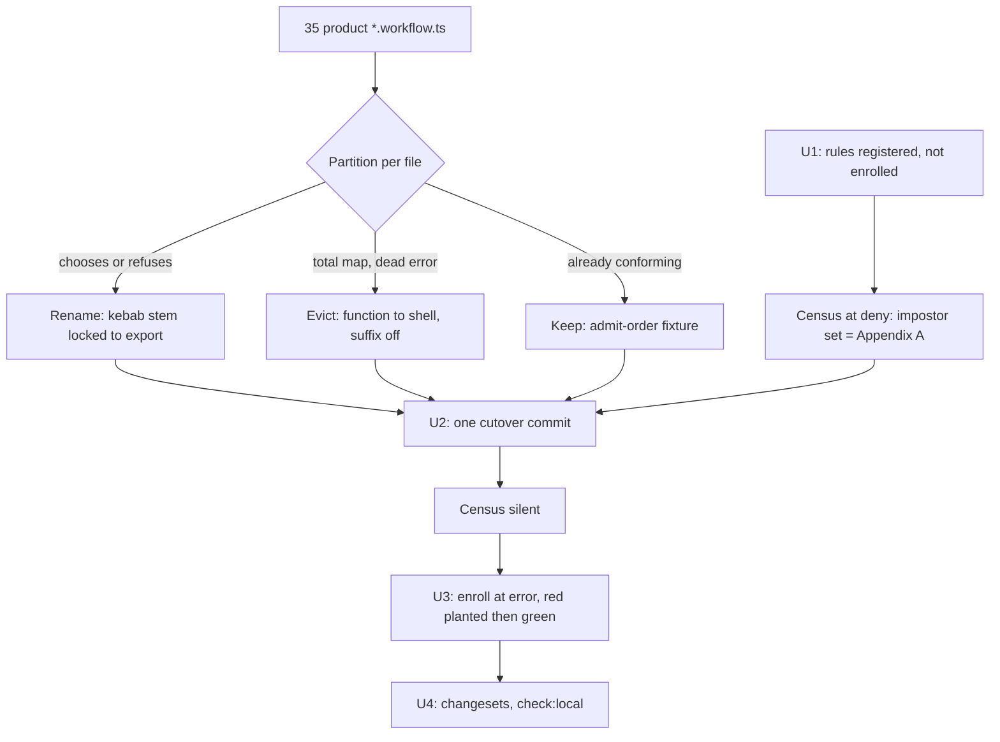

# DAMP workflow stems - Plan

---

## Goal Capsule

- **Objective:** every product `*.workflow.ts` stem is a kebab decision-phrase locked to its file's single value export, and a lint gate at `error` holds the tree to that contract. Stems that read as the decision are the intent the contract serves.
- **Means:** new rules `damp-workflow-stem` and `workflow-file-make-presence` in `@systemfsoftware/oxlint-plugin-effect-workflow`; a partition-then-cutover of all 35 product workflow files; enrollment into `configs.recommended` after the tree is green (KTD6).
- **Authority:** the invoking brief settled the product decisions (KD1–KD5). This plan is the challenge ledger for how-level choices. Repo doctrine (`CONSTITUTION.md`, `CONCEPTS.md`) governs everything it names.
- **Stop conditions:** research produces invalidating evidence against a settled decision; a required gate cannot run. Non-software routing does not apply.
- **Execution profile:** `ce-work`, code. Units are sequential (U1 → U2 → U3 → U4); within U2, per-package work parallelizes.
- **Tail ownership:** the calling pipeline owns commit/push/PR/CI after U4.

---

## Product Contract

### Summary

A workflow file's stem must say what the file decides. Today `Config.workflow.ts`, `Run.workflow.ts`, and 33 siblings carry capability-bucket or noun-pile names, so the claim is invisible without opening the file. A new `damp-workflow-stem` rule makes the stem state the decision and locks it to the file's single value export; a sibling `workflow-file-make-presence` rule strips the suffix from files that never construct a decision. The whole product tree cuts over in one commit, then the rules enroll at `error`.

### Problem Frame

DAMP ("Descriptive And Meaningful Phrases") makes a test title state the claim: "A test's name should summarize the behavior it is testing… a good name describes both the actions that are being taken on the system and the expected outcome" (Software Engineering at Google, ch. 12, https://abseil.io/resources/swe-book/html/ch12.html). The same failure exists one level up: a module name that does not state its decision forces every reader to open the file. Wlaschin's workflow doctrine names workflows as the verbs of the ubiquitous language — typed `Input → Output|Error` functions a domain expert can say out loud ("Place Order"). The repo already brands the role with `Workflow.make`; the stem is the remaining vocabulary surface, and it is unpoliced: `Run.workflow.ts` exports `prepareWorkflow`, `Survivors.workflow.ts` exports `admitSurvivorsRun`, `admit.workflow.ts` is a fragment of its own export.

The remedy is deliberately two-sided. The stem rule polices vocabulary only — "the name is the weakest carrier" (repo doctrine `docs/solutions/architecture-patterns/what-a-filename-suffix-can-enforce.md`; wiki `suffix-taxonomy-reach`): what owns a decision is `Workflow.make`, not the name. Files that wear the suffix without the brand are impostors and get evicted, not renamed.

### Requirements

**Cutover**

- R1. Every product `*.workflow.ts` is classified before any rename: a _real decision_ chooses or refuses on command content; a _vacuous brand_ calls `Workflow.make` with a body that is a total map and a dead error channel. Appendix A records the classification and its evidence for all 35 files.
- R2. Exactly one commit renames every real decision and evicts every impostor across the whole monorepo. Vendored `repos/` is untouched.
- R3. Eviction moves the decision function (and its command/decision schemas) next to the calling shell, returns the decision directly, deletes the dead error class and the `Workflow.make` ceremony, and strips the `.workflow.ts` suffix.
- R4. A renamed stem is a kebab verb phrase a domain expert reads as the decision ("place order" passes; "config" does not).

**Rule surface**

- R5. `damp-workflow-stem` reports a `*.workflow.ts` file whose stem is not 2–5 lowercase kebab tokens, is a single token, starts with a vacant token, is a mechanism stem, or whose stem is not the camelCase of the file's single non-schema value export.
- R6. `workflow-file-make-presence` reports a `*.workflow.ts` file containing no `Workflow.make` call.
- R7. Both rules certify naming and topology only. Error-channel inhabitation stays with `Workflow.make`'s own `Inhabited` refusal and review (EW1 of the package AGENTS.md).

**Enrollment and delivery**

- R8. Both rules enroll at `error` in `configs.recommended` in their own commit, after every product `*.workflow.ts` satisfies them, with red observed before green.
- R9. Every publishable package whose build hash changes carries a changeset intent; breaking export renames take a minor bump (pre-1.0 ALPHA, REPO-R1).
- R10. The plugin README documents both rules — including the missing `make-command-schema` row — and states that the rules are no-ops outside `*.workflow.ts`.

### Key Decisions

- KD1. **Partition first; one commit covers the whole monorepo.** (session-settled: user-directed — chosen over a three-file exemplar pilot: CONST-E8 sequences evaluator and work, it does not license calling the tree done early; the evaluator turns on only over a tree that already satisfies it.) Governs R1, R2.
- KD2. **Impostors are evicted, not renamed.** Eviction is the default when the error channel is theater: a function that cannot fail is a pipeline step, not a workflow. (session-settled: user-directed — chosen over kebab-renaming every `*.workflow.ts`: a rename would launder impostors into the new grammar.) Governs R3.
- KD3. **The suffix grants nothing.** Membership in the cell is `Workflow.make`; the sibling rule reports workflow-named files that never call it. (session-settled: user-directed — chosen over folding into `make-file-location`: that rule only fires when `make` is present in the wrong file, so the no-`make` hole is a different obligation.) Governs R6, R7.
- KD4. **Vendored `repos/` is out of scope entirely.** (session-settled: user-directed — chosen over a whole-tree glob: `repos/effect/**/Workflow.ts` and `repos/oh-my-pi/**/gitlab-duo-workflow.ts` are other products' types.) Governs R2.
- KD5. **The stem states the decision and locks to the export.** No `_When_` clause: DAMP's When observes a condition, but a workflow file _is_ the decision — the command schema already names the situation. (session-settled: user-directed — chosen over mapping `Should_<X>_When_<Y>` into filenames.) Governs R4, R5.

### Scope Boundaries

- In scope: the 35 product files in Appendix A; the two new rules and their fixtures; the plugin README; changesets.
- Out of scope (outside this product's identity): `repos/**`; `.schema.ts` naming (PascalCase type names stay); error-channel inhabitation enforcement (R7); an LLM-as-judge arm for "ubiquitous language"; changes to `damp-test-naming`; enrollment changes in other plugins.

### Open Questions

None blocking.

---

## Planning Contract

### Key Technical Decisions

- KTD1. **Stem grammar:** `^[a-z][a-z0-9]*(-[a-z][a-z0-9]*){1,4}\.workflow\.ts$` — lowercase kebab, hyphen separators only, 2–5 tokens, no extra dots (extra dots already fail `WORKFLOW_FILE_BASENAME`). (session-settled: user-directed — chosen over a `_When_`-style DAMP mapping: the command type names the situation.)
  - _Conflict call-out:_ `docs/solutions/architecture-patterns/label-routed-rules-are-unfalsifiable.md` and the wiki ruling in `suffix-taxonomy-reach` hold that name-keyed rules are the weakest carrier. Resolution: the rule is positioned as a **drift check over edge properties** — stem tokens and export name are both readable from the file's own text; `Workflow.make` and KD3 carry governance. Wiki canon (`names-are-not-type-safety` A1/A2): a name without a constructor enforces nothing, so the rule never claims to — the constructor exists, the rule checks the name against the declaration.
- KTD2. **Denylist, not a verb allowlist.** Vacant first tokens: `handle`, `process`, `do`, `run`, `execute`, `manage`, `perform`, `apply`, `decide`, `work`, `operate`. Mechanism tokens banned as first token or as the entire stem (not in every position): `workflow`, `handler`, `manager`, `service`, `util`, `helper`, `processor`, `cell`, `sandwich`, `make`, `impl`, `logic`, `kernel`, `executor`, `adapter`, `controller`, `config`, `sandbox`, `plugin`, `plugins`, `instrument`, `reporter`, `output`, `settings`, `doctrine`, `delegation`, `hooks`. Later tokens may be nouns (`admit-survivors-run` legal; `run-mutation` not; `write-json-report` legal). (session-settled: user-directed — chosen over a verb allowlist: allowlists rot, the same reason DAMP checks shape and the 13-role suffix taxonomy was retired. Shape: one construct banned through denylist entries — the favorable granularity per `lint-rule-granularity` A4/A11.)
- KTD3. **Stem↔export lock.** The stem must equal the camelCase of the file's single non-schema value export (`admit-loaded-settings` ↔ `admitLoadedSettings`). The lock's realistic catch is the partial rename — a grammar-valid stem whose export kept its old name (`prepare-run.workflow.ts` ↔ `prepareWorkflow`). When the file has zero or multiple value exports, the mismatch check is skipped — `workflow-file-export-topology` owns that violation; rules do not overlap. A single value export that yields no readable identifier (`export default`) violates the lock's named-export contract; after reading `workflow-file-export-topology`'s actual behavior, the U1 author reports it exactly once — in this rule if topology does not already refuse it. (session-settled: user-directed — chosen over stem-grammar-only: the lock is what catches a stem that does not name its export.)
- KTD4. **Message IDs and cascade.** `stemNotKebab` (case, underscores, 6+ tokens), `stemTooShort` (one token), `vacantFirstToken`, `mechanismStem`, `stemExportMismatch`; OX-EF1 shape (`{{name}} is forbidden. Expected: {{expected}}. Actual: {{actual}}. Fix: {{fix}}.`). First failing check wins; grammar failures suppress the stem-derived checks. Messages state what the predicate found, never a semantic verdict ("this stem is not a decision").
- KTD5. **Sibling rule `workflow-file-make-presence`.** Program visitor; on files matching `WORKFLOW_FILE_BASENAME` (reused from `make-file-location.config.ts`), collect `Workflow.make` boundaries via the existing `MakeBoundary` import-origin resolver; zero boundaries → report `workflowFileWithoutMake`. Mirrors `make-file-location`'s inverse. (session-settled: user-directed — chosen over extending `make-file-location`: construction-site and presence are distinct predicates; ESLint uniqueness forbids two rules producing the same warning.)
- KTD6. **Green-then-enroll.** Rules land registered in the plugin `rules` map but not in `configs.recommended` (precedent: introduction commits `9ce96287`/`1435d389`/`cadf230b`, distinct enrollment commit `041b1a8e`, export-topology plan KTD5). Red-before evidence: with the rules at `deny` via the CLI through the package's own oxlint config, the pre-cutover census reports every non-conforming stem — the U2 checklist, all workflow files except `admit-order`; after U2 the same census is silent; the enrollment commit adds two planted known-bad fixture observations — a with-`make` file with a bad stem (for `damp-workflow-stem`) and a no-`make` workflow file (for `workflow-file-make-presence`) — then the clean tree (green), recorded in the commit body. The presence rule's only red evidence is synthetic: every current workflow file calls `Workflow.make`, so its positive is fixture-proven, never tree-proven. No `warn` resting state (`docs/solutions/tooling-decisions/rule-admission-severity-and-accretion.md`).
- KTD7. **Eviction mechanics.** The decide function moves into the calling shell module (Appendix A names the shell), returns the decision directly (no `Result`), and the dead error class is deleted. Command/decision schemas exported by the workflow file move with it (or to a co-located `.schema.ts` where the package already has one). Callers unwrap `Result` no more.
- KTD8. **Rename mechanics.** Imports are extension-ful (`.workflow.js`): every importer listed in Appendix A updates its specifier; `mod.ts` `export * from` lines, in-source dynamic `await import`, engine `src/index.ts` re-exports, and property-test file names (`<stem>.workflow.property.test.ts`, the property cell beside its decision) move with the rename. Property-test files are rule-exempt — their names carry extra dots and fail `WORKFLOW_FILE_BASENAME` — so their renames are consistency, not compliance. Renamed exports regenerate the package's `etc/*.api.md` on build; `pnpm check:local` verifies the attw/api surfaces. Exports rename where the stem demands (`decideRestart` → `chooseRestartStrategy`, `resolveModeWorkflow` → `resolveOutputMode`, `fileSelectionWorkflow` → `selectFiles`).
- KTD9. **Constructor-library fixtures participate.** The four `packages/core/effect/cell/types/tests/__fixtures__/` files rename like any decision. Where the fixture's channel is dead but the fixture needs `Workflow.make` to test the library, make the refusal real and name the decision (option (a)). `WidenedCommand` exists to pin a type-level refusal of an untagged command; it renames to the refusal it pins and its dead runtime channel is declared in the change (CONST-W3), because eviction would destroy the type test.
- KTD10. **Changesets per the gate.** `scripts/guards/check-changeset.ts` compares per-package turbo build hashes base↔head; ship intents via `pnpm change --bump` for every hash-changed publishable package. New recommended rules: minor on the plugin. Breaking export renames: minor (REPO-R1). Transitive re-hash-only packages: `none`.
- KTD11. **Suppression sweep.** Cutover greps for `oxlint-disable` comments naming workflow-plugin rules and verifies each id equals the configured key `@systemfsoftware/oxlint-plugin-effect-workflow/<rule>` (`docs/solutions/build-errors/a-disable-comment-names-the-config-key.md`).

### High-Level Technical Design

Rule check cascade inside `damp-workflow-stem`: basename gate (`WORKFLOW_FILE_BASENAME`) → `stemNotKebab` → `stemTooShort` → `vacantFirstToken` → `mechanismStem` → `stemExportMismatch` (skipped when export topology is already broken).

### Assumptions

- Proposed stems in Appendix A for mechanical exports (`dry-run`, `select-files`, `interpret-vitest-run`, …) are implementation-finalizable under the grammar and the export lock; the lock, not the proposal, is the contract.
- Neither `instrumenter` nor `html-reporter` carries a workspace `stryker.config.json` (verified by workspace glob; the only stryker-js workspace config is `cli/`, and the other carriers — lint plugins, `daemon-spec`, both omp plugins — keep all their workflow files), so eviction touches no mutation-lane config and `scripts/guards/check-stryker-mutate-scope.ts` sees no change.
- Fixture sub-decisions follow the evidence quoted in Appendix A; the `.tst.ts` consumers of renamed fixture exports update in the same commit.

### Pre-write destructive review

Three assumptions probed; one mutation lens applied (**Inversion** — attempt to make each claim fail silently).

1. _A name-keyed rule is lawful as a drift check._ Break attempt: vacancy/mechanism checks are policy, not drift. Survivor — they remain depth-0 text predicates and the message copy states the finding (KTD4), never "this name lies".
2. _Green-then-enroll protects the tree._ Break attempt: enrollment fires on files the census missed because the census ran a different glob than the gate. Survivor — the census must run through the package's own oxlint config path (KTD6 pins this), and U3 adds a planted-violation red observation independent of the census.
3. _The DAMP canon transfers from test titles to module stems._ Break attempt: a stem cannot carry the outcome half of "actions + expected outcome". Survivor — the stem carries the action, the export's `Result` type carries the outcome, and that split is exactly why the stem↔export lock (KTD3) is load-bearing.

---

## Implementation Units

### U1. Author both rules, registered but not enrolled

- **Goal:** `damp-workflow-stem` and `workflow-file-make-presence` exist with fixtures, README rows, and census-red evidence; `configs.recommended` untouched.
- **Requirements:** R5, R6, R7, R10.
- **Dependencies:** none.
- **Files:**
  - `packages/lint/oxlint/plugins/cells/effect-workflow/src/rules/damp-workflow-stem.ts` and `.config.ts`
  - `packages/lint/oxlint/plugins/cells/effect-workflow/src/rules/workflow-file-make-presence.ts` and `.config.ts`
  - `packages/lint/oxlint/plugins/cells/effect-workflow/src/rules/MakeBoundary.ts` (reuse; no change expected)
  - `packages/lint/oxlint/plugins/cells/effect-workflow/src/index.ts` (rules map only)
  - `packages/lint/oxlint/plugins/cells/effect-workflow/src/rules/__tests__/damp-workflow-stem.test.ts`
  - `packages/lint/oxlint/plugins/cells/effect-workflow/src/rules/__tests__/workflow-file-make-presence.test.ts`
  - `packages/lint/oxlint/plugins/cells/effect-workflow/README.md`
- **Approach:**
  1. Mirror `make-file-location`'s rule/config split, `defineRule`, basename gating on `WORKFLOW_FILE_BASENAME`, and in-file RuleTester bridges (`RuleTester.it = vitest.it`), not the schema plugin's shared `_tester.ts`.
  2. Stem rule: derive stem = basename minus `.workflow.ts`; apply the KTD4 cascade; find the single non-schema value export for KTD3 (reuse the export-walk from `workflow-file-export-topology`).
  3. Presence rule: reuse `collectMakeBoundaries`; report `workflowFileWithoutMake` when empty.
  4. Register both in the plugin `rules` map; do not touch `recommendedRules`.
  5. README: add both rows, restore the missing `make-command-schema` row, state the `*.workflow.ts`-only scope.
- **Patterns to follow:** `make-file-location.ts`/`.config.ts` (OXX-EF1 messages, basename constant); `workflow-file-export-topology.ts` (export walk, after-cutover enrollment comment).
- **Test scenarios:**
  - Valid: `admit-order.workflow.ts`/`admitOrder`; `admit-survivors-run.workflow.ts`/`admitSurvivorsRun`; `classify-mutant.workflow.ts`/`classifyMutant`; `write-json-report.workflow.ts`/`writeJsonReport`; `choose-restart-strategy.workflow.ts`/`chooseRestartStrategy`; a 5-token stem; a stem with a numeric second token (`log2-exits`-shape).
  - Invalid `stemNotKebab`: `Config.workflow.ts`, `restart_decision.workflow.ts`, `restartDecision.workflow.ts`, a 6-token stem.
  - Invalid `stemTooShort`: `run.workflow.ts`, `config.workflow.ts` (single mechanism token reports short, not mechanism — cascade).
  - Invalid `vacantFirstToken`: `run-mutation.workflow.ts`, `handle-command.workflow.ts`, `process-data.workflow.ts`, `decide-the-verdict.workflow.ts`.
  - Invalid `mechanismStem`: `handler-workflow.workflow.ts`, `config-settings.workflow.ts`, `instrument-files.workflow.ts`.
  - Invalid `stemExportMismatch` (grammar-passing stems only — earlier cascade checks pre-empt mismatches on bad-grammar stems): `prepare-run.workflow.ts`/`prepareWorkflow` (the partial-rename case), `admit-settings.workflow.ts`/`admitLoadedSettings`; a default-only export reports the named-export refusal (KTD3).
  - No-op: a non-workflow file; a `place.order.workflow.ts` (basename gate excludes it; `make-file-location` owns it); a workflow file with zero value exports (mismatch check skipped).
  - Presence rule: valid single `Workflow.make`; invalid zero-boundary `*.workflow.ts`; no-op `make` in a non-workflow file (already `make-file-location`'s report).
- **Verification:** `pnpm --filter @systemfsoftware/oxlint-plugin-effect-workflow test`; census at `deny` through the package's oxlint config reports every non-conforming stem — the U2 checklist, all workflow files except `admit-order` — with the 11 Appendix A evictions as the impostor subset (red evidence, KTD6).
- **Execution note:** land the predicate and watch it report on the real tree before polishing message copy (`docs/solutions/logic-errors/shared-ast-helper-vacuums-its-consumers.md` — green fixtures cannot detect a rule that matches nothing real).

### U2. Cutover: rename every real decision, evict every impostor

- **Goal:** the tree satisfies both rules with the rules still unenrolled; one commit.
- **Requirements:** R1, R2, R3, R4.
- **Dependencies:** U1.
- **Files:** all 35 rows of Appendix A plus every importer listed there, property-test files, `mod.ts` re-exports, `packages/core/effect/daemon-spec/src/internal/RestartDecision.schema.ts` (dynamic import), `packages/testing/mutation/stryker-js/engine/src/index.ts` (re-export path), `packages/core/effect/cell/types/test-types/Workflow.tst.ts` (fixture export renames).
- **Approach:**
  1. Verify each Appendix A classification by opening the file before acting on it; the census from U1 is the checklist, the quoted evidence is the warrant.
  2. Renames: `git mv` + stem/export edits + importer specifier updates (KTD8); property-test files rename with their decision.
  3. Evictions (KTD7): move the decide function and its schemas into the calling shell, return the decision directly, delete the dead error class, delete the workflow file.
  4. Fixtures per KTD9; `WidenedCommand` exception declared in the change body.
  5. Re-run the census through the same config path: silent.
- **Test scenarios:**
  - Per-package suites pass (engine, cli, stryker-js, typescript-checker, vitest-runner, instrumenter, html-reporter, daemon-spec, cell types, both omp plugins).
  - `admit-order` cell-layer composition integration test green.
  - Renamed property cells green under their new names.
  - `Workflow.tst.ts` type tests green against renamed fixture exports.
  - Census silent; no orphaned `Result`-unwrapping at eviction call sites.
- **Verification:** affected-package test commands (Verification Contract); `pnpm check:local`.
- **Execution note:** parallelize per package; the commit is created once, after all packages are green — atomicity is the contract (KD1).

### U3. Enroll both rules at error

- **Goal:** `configs.recommended` carries both rules at `error`; red-then-green observed.
- **Requirements:** R8.
- **Dependencies:** U2.
- **Files:** `packages/lint/oxlint/plugins/cells/effect-workflow/src/index.ts` (recommendedRules + after-cutover comment, mirroring `workflow-file-export-topology`'s).
- **Approach:** add both entries via the existing `rule('<name>')` helper; the spread chain (`oxlint-config.base.ts` → consumers) propagates with no hand-edits. Red: with enrollment applied, create two throwaway known-bad files — `config.workflow.ts` with a `Workflow.make` (bad stem) and a grammar-valid `scratch-make.workflow.ts` with no `Workflow.make` (absent brand) — observe each rule report its own file, delete both; record the observations in the commit body, noting the presence rule's red is synthetic-only. Green: `check:local` on the clean tree.
- **Test scenarios:** `pnpm --filter @systemfsoftware/oxlint-plugin-effect-workflow test` (recommended-preset assertions if the existing tests pin preset contents — update them).
- **Verification:** planted-file red; clean-tree green; KTD11 suppression sweep over the diff.
- **Execution note:** this is the evaluator's own commit — CONST-E8; never fold it into U2.

### U4. Changesets and full verification

- **Goal:** every hash-changed publishable package carries a changeset intent; the full local chain is green.
- **Requirements:** R9.
- **Dependencies:** U3.
- **Files:** `.changeset/*` (new intents).
- **Approach:** run the changeset gate verdict (KTD10); bump classes: plugin minor (new recommended rules), renamed-export packages minor, transitive re-hash `none`.
- **Test scenarios:** none — packaging only.
- **Verification:** `pnpm check:local` exits 0; changeset guard satisfied.
- **Execution note:** `Test expectation: none — packaging-only unit; the gate is the changeset guard plus check:local.`

---

## Verification Contract

| Gate                 | Command                                                             | Proves                                 |
| -------------------- | ------------------------------------------------------------------- | -------------------------------------- |
| Rule fixtures        | `pnpm --filter @systemfsoftware/oxlint-plugin-effect-workflow test` | U1 rule behavior                       |
| Census red           | rule at `deny` via the package oxlint config, pre-cutover           | KTD6; census = Appendix A impostor set |
| Census green         | same invocation, post-U2                                            | U2 completeness                        |
| Package suites       | `pnpm --filter <pkg> test` for every touched package                | U2 behavior preserved                  |
| Enrollment red/green | planted bad file then clean tree                                    | U3, R8                                 |
| Full chain           | `pnpm check:local`                                                  | everything, last edit wins             |
| Changeset gate       | CI `changeset-check.yml` / `scripts/guards/check-changeset.ts`      | R9                                     |

---

## Definition of Done

- Global: R1–R10 all hold; `pnpm check:local` exits 0 after the last edit; the tree contains no superseded artifacts (no leftover `.changeset` placeholders, no orphaned property-test files, no dead error classes); work ships as a PR watched to green.
- U1 done: both rules' fixtures green; census red matches Appendix A; README rows present; `configs.recommended` unchanged.
- U2 done: census silent; every Appendix A row applied or its classification corrected with quoted evidence; all touched packages' suites green.
- U3 done: preset carries both rules at `error`; red-then-green recorded; suppression sweep clean.
- U4 done: changeset intents cover every hash-changed package; full chain green.

---

## Appendix A: Cutover program

Classification test: a _real decision_ chooses (dispatches command content to differentiated decision variants) or refuses (constructs its error channel). A _vacuous brand_ is a total map with a dead error class. Proposed stems are finalizable under KTD1/KTD3; the export lock is the contract.

### Renames (23)

| Today                                                                                | Becomes                                           | Export after                                    | Evidence / note                                                                     |
| ------------------------------------------------------------------------------------ | ------------------------------------------------- | ----------------------------------------------- | ----------------------------------------------------------------------------------- |
| `omp/plugins/omp-agent-discipline/src/delegation/delegation.workflow.ts`             | `check-no-skill-delegation.workflow.ts`           | `checkNoSkillDelegation`                        | verdict dispatch (choice); error dead — R7                                          |
| `omp/plugins/omp-agent-discipline/src/doctrine/doctrine.workflow.ts`                 | `check-dispatch-doctrine.workflow.ts`             | `checkDispatchDoctrine`                         | verdict dispatch (choice); error dead — R7                                          |
| `omp/plugins/omp-claude-compat/src/hooks/admit.workflow.ts`                          | `admit-loaded-settings.workflow.ts`               | `admitLoadedSettings`                           | RunHooks/SkipHooks choice; `AdmitError` dead — R7                                   |
| `omp/plugins/omp-claude-compat/src/hooks/hooks.workflow.ts`                          | `interpret-hook-result.workflow.ts`               | `interpretHookResult`                           | `HookVerdictError` constructed                                                      |
| `omp/plugins/omp-claude-compat/src/settings/settings.workflow.ts`                    | `merge-effective-settings.workflow.ts`            | `mergeEffectiveSettings`                        | Empty/LoadedSnapshot choice; error dead — R7                                        |
| `packages/core/effect/cell/types/tests/__fixtures__/InterpreterDecide.workflow.ts`   | `admit-decoded-command.workflow.ts` (prop.)       | `admitDecodedCommand`                           | `Refused` constructed ('too short')                                                 |
| `…/__fixtures__/InterpreterTracedDecide.workflow.ts`                                 | `admit-traced-command.workflow.ts` (prop.)        | `admitTracedCommand`                            | make refusal real (KTD9); imports InterpreterDecide                                 |
| `…/__fixtures__/TaggedCommand.workflow.ts`                                           | `accept-tagged-command.workflow.ts` (prop.)       | `acceptTaggedCommand`                           | make refusal real (KTD9); `.tst` consumer updates                                   |
| `…/__fixtures__/WidenedCommand.workflow.ts`                                          | `refuse-widened-command.workflow.ts`              | `refuseWidenedCommand`                          | type-negative fixture; dead runtime channel declared (KTD9)                         |
| `packages/core/effect/daemon-spec/src/internal/RestartDecision.workflow.ts`          | `choose-restart-strategy.workflow.ts`             | `chooseRestartStrategy` (was `decideRestart`)   | `RestartDecisionExhausted` constructed; `decide` first token vacant, export renames |
| `packages/testing/mutation/stryker-js/cli/src/Output.workflow.ts`                    | `resolve-output-mode.workflow.ts`                 | `resolveOutputMode` (was `resolveModeWorkflow`) | `ModeConflictError` constructed                                                     |
| `packages/testing/mutation/stryker-js/cli/src/RunOutcome.workflow.ts`                | `classify-run-outcome.workflow.ts` (prop.)        | `classifyRunOutcome`                            | five `Run*Error` variants constructed                                               |
| `packages/testing/mutation/stryker-js/cli/src/Survivors.workflow.ts`                 | `admit-survivors-run.workflow.ts`                 | `admitSurvivorsRun`                             | `SurvivorsRejection` constructed                                                    |
| `packages/testing/mutation/stryker-js/engine/src/Checker.workflow.ts`                | `admit-checker-answer.workflow.ts` (prop.)        | `admitCheckerAnswer`                            | `CheckerAnsweredUnrequested`/`CheckerSkippedRequested` constructed                  |
| `packages/testing/mutation/stryker-js/engine/src/DryRun.workflow.ts`                 | `dry-run.workflow.ts` (prop.)                     | `dryRun`                                        | `DryRunError` constructed (two stages)                                              |
| `packages/testing/mutation/stryker-js/engine/src/IncrementalReport.workflow.ts`      | `validate-incremental-report.workflow.ts` (prop.) | `validateIncrementalReport`                     | `IncrementalReportError` constructed; `src/index.ts` re-export updates              |
| `packages/testing/mutation/stryker-js/engine/src/Instrument.workflow.ts`             | `plan-instrumentation.workflow.ts` (prop.)        | `planInstrumentation`                           | `InstrumentError` constructed; `instrument` banned first token                      |
| `packages/testing/mutation/stryker-js/engine/src/MutationTest.workflow.ts`           | `admit-mutation-test.workflow.ts`                 | `admitMutationTest`                             | `MutationTestError` constructed                                                     |
| `packages/testing/mutation/stryker-js/engine/src/Project.workflow.ts`                | `select-files.workflow.ts` (prop.)                | `selectFiles` (was `fileSelectionWorkflow`)     | `FileSelectionError` constructed                                                    |
| `packages/testing/mutation/stryker-js/engine/src/Run.workflow.ts`                    | `prepare-run.workflow.ts`                         | `prepareRun`                                    | `PrepareError` constructed                                                          |
| `packages/testing/mutation/stryker-js/stryker-js/src/ClassifyExit.workflow.ts`       | `classify-exit.workflow.ts`                       | `classifyExit`                                  | user-settled rename                                                                 |
| `packages/testing/mutation/stryker-js/typescript-checker/src/Checker.workflow.ts`    | `check-mutants.workflow.ts`                       | `checkMutants`                                  | both diagnostic errors constructed                                                  |
| `packages/testing/mutation/stryker-js/vitest-runner/src/VitestMutantRun.workflow.ts` | `interpret-vitest-run.workflow.ts` (prop.)        | `interpretVitestRun`                            | `VitestMutantRunError` constructed; `run`/`execute` vacant                          |

Unchanged: `packages/testing/mutation/stryker-js/engine/tests/__fixtures__/admit-order.workflow.ts` (`admitOrder`, `OrderRefused` constructed) — already conforming.

### Evictions (11) — function + schemas to the calling shell, decision returned directly, dead error deleted

| Today                                        | Moves into                       | Dead channel              | Evidence                                                         |
| -------------------------------------------- | -------------------------------- | ------------------------- | ---------------------------------------------------------------- |
| `engine/src/Config.workflow.ts`              | `engine/src/Config.ts`           | `MergeError`              | only `Result.succeed(new MergeResult(…))`                        |
| `engine/src/Plugins.workflow.ts`             | `engine/src/Plugins.ts`          | `PluginLoadDecisionError` | only `Result.succeed(buildPluginLoadDecision(…))`                |
| `engine/src/Sandbox.workflow.ts`             | `engine/src/Sandbox.ts`          | `SandboxError`            | only `Result.succeed(new SandboxDecision(…))`                    |
| `engine/src/IncrementalDiff.workflow.ts`     | `engine/src/Mutants.ts`          | `IncrementalDiffError`    | both branches `Result.succeed`; schemas consumed by `Mutants.ts` |
| `engine/src/JsonReport.workflow.ts`          | `engine/src/Reporter.ts`         | `JsonReportError`         | only `Result.succeed(JsonDocument.make(…))`                      |
| `engine/src/Mutants.workflow.ts`             | `engine/src/Mutants.ts`          | `PlanMutantTestsError`    | only `Result.succeed(PlannedMutantTests.make(…))`                |
| `engine/src/Reporter.workflow.ts`            | `engine/src/Reporter.ts`         | `ClearTextReportError`    | only `Result.succeed(ClearTextDocument.make(…))`                 |
| `html-reporter/src/Reporter.workflow.ts`     | `html-reporter/src/Reporter.ts`  | `HtmlReportError`         | only `Result.succeed(HtmlDocument.make(…))`                      |
| `instrumenter/src/Instrument.workflow.ts`    | `instrumenter/src/Instrument.ts` | `InstrumentError`         | only `Result.succeed(InstrumentDecision.make(…))`                |
| `stryker-js/src/Run.workflow.ts`             | `stryker-js/src/Run.ts`          | `PlanMutationRunError`    | only `Result.succeed(MutationRunPlan.make(…))`                   |
| `vitest-runner/src/VitestDryRun.workflow.ts` | `vitest-runner/src/Runner.ts`    | `VitestDryRunError`       | only `Result.succeed` both branches                              |

No eviction touches a mutation-lane config: no evicting package carries a workspace `stryker.config.json` (the carriers are `cli/`, the lint plugins, `daemon-spec`, and the two omp plugins, and none of them loses a workflow file), so `scripts/guards/check-stryker-mutate-scope.ts` is unaffected.

### Importers (rename sites)

- `delegation.workflow.js`: `omp-agent-discipline/src/delegation/delegation.ts`, `delegation/mod.ts`
- `doctrine.workflow.js`: `omp-agent-discipline/src/doctrine/doctrine.ts`, `doctrine/mod.ts`
- `admit.workflow.js` / `hooks.workflow.js` / `settings.workflow.js`: `omp-claude-compat/src/hooks/hooks.ts`, `hooks/mod.ts`, `hooks/__tests__/HookVerdict.workflow.property.test.ts` (renames to `interpret-hook-result.workflow.property.test.ts`); `settings/settings.ts`, `settings/mod.ts`
- `InterpreterDecide.workflow.js`: `cell/types/tests/interpreter.integration.test.ts`, `InterpreterTracedDecide.workflow.ts`; `TaggedCommand`/`WidenedCommand`: `cell/types/test-types/Workflow.tst.ts`
- `RestartDecision.workflow.js`: `daemon-spec/src/internal/SupervisorBodyExecutor.ts`, `RestartDecision.schema.ts` (dynamic import), `__tests__/RestartDecision.workflow.property.test.ts`
- `Output.workflow.js`: `cli/src/Output.ts`, `cli/src/__tests__/Output.workflow.property.test.ts`; `RunOutcome.workflow.js`: `cli/src/Envelope.ts`, `cli/src/Output.ts`, property test; `Survivors.workflow.js`: `cli/src/Cli.ts`, `cli/src/Envelope.ts`, `cli/src/Survivors.ts`, property test
- engine files: each file's `src/<Shell>.ts` importer plus its `__tests__/*.property.test.ts`; `IncrementalReport.workflow.js` also `engine/src/index.ts`; `IncrementalDiff.workflow.js` also `engine/src/Mutants.ts` (schemas)
- `admit-order.workflow.js`: `engine/tests/cell-layer-composition.integration.test.ts` (unchanged)
- `ClassifyExit` / `Run` (stryker-js): `stryker-js/src/Run.ts`; `Checker.workflow.js` (ts-checker): `typescript-checker/src/Checker.ts`; `VitestDryRun`/`VitestMutantRun`: `vitest-runner/src/Runner.ts`

---

## Appendix B: Sources

- DAMP canon: Software Engineering at Google, ch. 12 — https://abseil.io/resources/swe-book/html/ch12.html ("Descriptive And Meaningful Phrases"; test name summarizes behavior).
- Wiki (corpus-local taste): `names-are-not-type-safety` (canon A1/A2 — a name without a constructor enforces nothing); `suffix-taxonomy-reach` (name-keyed rules check drift, not governance); `lint-rule-granularity` (A4/A11 — one construct + denylist entries is the favorable rule shape).
- Repo doctrine: `docs/solutions/architecture-patterns/what-a-filename-suffix-can-enforce.md`; `docs/solutions/architecture-patterns/label-routed-rules-are-unfalsifiable.md`; `docs/solutions/logic-errors/shared-ast-helper-vacuums-its-consumers.md`; `docs/solutions/tooling-decisions/rule-admission-severity-and-accretion.md`; `docs/solutions/build-errors/a-disable-comment-names-the-config-key.md`; `docs/solutions/architecture-patterns/mutation-scoped-to-workflow.md`; `docs/plans/2026-08-30-2143-fix-workflow-export-topology-plan.md` (KTD5 enrollment precedent).
- Enrollment precedent commits: introduction `9ce96287`/`1435d389`/`cadf230b`; registration fix `bd10bad5`; enrollment `041b1a8e`.
- Rule surfaces: `packages/lint/oxlint/plugins/cells/effect-workflow/src/` (`make-file-location`, `workflow-file-export-topology`, `MakeBoundary.ts`, `index.ts`); `packages/lint/oxlint/plugins/effect/schema/src/rules/schema-checked-element-named.ts` (newest-rule conventions, minor changeset).
- Guard surfaces: `scripts/guards/check-stryker-mutate-scope.ts`; `scripts/guards/check-changeset.ts`; `packages/core/effect/cell/types/src/Workflow.ts` (`Inhabited`/`UntaggedError` refusals).
