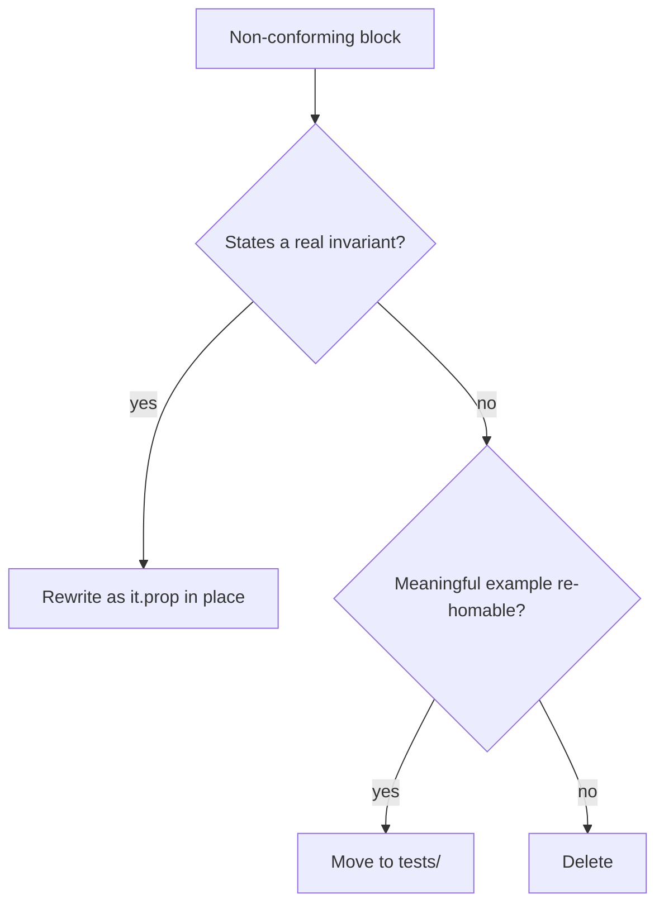

# Ban In-Source Non-Property Tests - Plan

## Goal Capsule

- **Objective:** Every in-source test in the repo is a genuine property test over schema-derived inputs, and everything else that lived in-source is deleted or re-homed.
- **Means:** Big-bang cutover pairing two narrow lint rules (prop-only blocks, schemas-only arbitraries) with delete-by-default triage of all 12 non-conforming blocks.
- **Product authority:** Contributors and agents writing or reviewing tests; no adjacent test-layout work is active scope.
- **Open blockers:** None. The omp/ inventory and the runtime audit are worked in U3/U4 (see Dependencies / Assumptions).

---
## Product Contract

Product Contract preservation note: restructured, no scope change — R4 mechanism detail moved to KTD2; all R/AE IDs stable.

### Summary

In-source `import.meta.vitest` blocks are restricted to `it.prop`/`it.effect.prop` with boolean predicates over schema-derived arbitraries. Four gherkin hybrid blocks are deleted outright. Eight example blocks are triaged with deletion as the default. Diagnostics point at deletion and no fixer launders examples into properties.

### Problem Frame

In-source blocks exist so tests can touch module-private bindings, but the placement guards judge only where a block lives, never what it does. Eight example blocks grew alongside real properties asserting behavior through hand-picked inputs. Separately, properties with hand-fabricated arbitraries stayed green while exercising almost nothing: the generator never emitted the shapes the function actually had to handle, so the suite was smoke wearing a generator. The existing property lint kills only the cheap fraud (missing returns, assertions in predicates, raw runner calls). Nothing judges whether the arbitrary constrains the function.

### Requirements

**Block shape**

- R1. Every `import.meta.vitest` block under package `src/` contains only `it.prop` or `it.effect.prop` member-chain calls (standard modifiers included) whose predicates return boolean on every path; every other callee — bare or member-chain, including `describe`, `it`, `test`, `expect`, `it.effect`, `it.only`, and `vi.*` — fails the gate.
- R2. The four gherkin hybrid blocks are deleted, not rewritten or moved: `packages/effect-daemon-spec/src/Backoff.ts`, `packages/effect-daemon-spec/src/LeaderLock.ts`, `packages/effect-daemon-spec/src/internal/RestartDecision.schema.ts`, `packages/stryker-js/stryker-js-cli/src/Output.ts` (second block).
- R3. The eight example blocks are triaged delete-by-default: each one either becomes `it.prop` in place, is re-homed only through the cell's public export as a test passing the step-0 admission gate (in-process, public surface only, observable outcomes, zero test-only exports — never a new export so a test file can import it), or dies: `packages/effect-daemon-spec/src/internal/Intensity.ts`, `packages/effect-daemon-spec/src/internal/IntensityWindow.ts`, `packages/effect-schema-discovery/src/internal/schema-names.ts`, `packages/stryker-js/stryker-js-engine/src/Mutants.ts`, `packages/effect-gherkin-spec/src/Feature.ts`, `packages/effect-gherkin-spec/src/FeatureRuntime.ts`, `packages/effect-schema-law/src/RuleOfSchemas.ts`, `packages/stryker-js/stryker-js-cli/src/Output.ts` (first block). A re-home candidate failing admission is deleted, not re-shaped until it passes.

**Gate for R1–R3:** `pnpm check:local` (new rules at error severity) plus cutover-diff review confirming per-block disposition.

- R4. Every in-source `it.prop` arbitrary is a Schema reference, a schema-attached `arbitrary` annotation, or a schema-derived chain; a hand-built `fc.*` construction disconnected from a schema fails the gate, and an input with no schema grows one first. Detection mechanism per KTD2. Statically opaque cases fail open into the deferred runtime domain audit.

- R5. Rule diagnostics direct toward deletion of the offending block; no fixer or suggestion rewrites a non-property block into property shape.

**Cutover**

- R6. Triage deletions and error-severity rules land together in one cutover with no warn-first period and no pilot; breaking changes are accepted.
- R7. Each deleted block's behavior coverage is re-pinned before deletion lands, either by a replacement or by an explicit accepted-loss note naming the capability; no capability drops silently.

**Gate for R4–R7:** `pnpm check:local` for R4–R5; cutover-diff review for R6 (single commit, tree green) and R7 (reviewer confirms each pin or named loss).

### Key Decisions

- **Strict prop-only ban** (session-settled: user-directed — chosen over property-plus-schema-laws and RuleTester-carve-out variants: everything non-prop moves or dies). Governs R1, R2, R3.
- **Gherkin hybrids deleted** (session-settled: user-directed — chosen over rewrite-as-prop, generative exemption, and move-to-tests/: the five claimed hybrids correct to four genuine ones plus one misclassified example). Governs R2.
- **Delete-default triage** (session-settled: user-directed — chosen over blanket-delete and blanket-move: a garbage test is a garbage test, survivors prove value). Governs R3.
- **Schemas-only arbitraries with derived chains allowed** (session-settled: user-directed — chosen over custom-with-proof and mutation-gate-only: hand-contrived arbitraries are automatic fail). Governs R4.
- **Big-bang cutover** (session-settled: user-directed — chosen over warn-first and pilot: breaking changes accepted). Governs R6.
- **Two narrow rules over one contract rule or mutation-plus-review** (session-settled: user-directed — chosen for precise errors matching the existing plugin split). Governs R1, R4, R5.
- **Deletion-directed diagnostics with no laundering fixers.** A failing block is wrong; patching it green manufactures fraud. Governs R5.
- **Re-homed tests pass the admission gate or die.** The test-layer gate overrides any re-home the placement rules would allow: a candidate failing it is deleted, and no export is added to serve a test. Governs R3.

### Acceptance Examples

- AE1. **Covers R1.** Given an in-source block calling `describe`, bare `it`, or `expect`, or a guard containing only `it.effect`, the gate errors naming deletion; given `it.prop` with a boolean predicate, it passes.
- AE2. **Covers R4.** Given `it.prop` over a Schema reference or a `pipe`/`map` chain rooted in a schema, it passes; given `it.prop` over a hand-built `fc.record` disconnected from any schema, it fails.
- AE3. **Covers R2, R3.** Given the `Backoff.ts` hybrid block, the disposition is delete; given the `Intensity.ts` example block, the disposition is whichever of rewrite, re-home, or delete its triage examination yields, defaulting to delete.

### Success Criteria

- `pnpm check:local` exits 0 with the new rules at error severity.
- Census reconciles: 10 property-only blocks audited (non-conforming join triage), 4 hybrids deleted per R2, 8 examples disposed per R3, 2 omp/ blocks disposed per U3 routing, each with a per-block record.
- Zero hand-built arbitraries detectable in-source per R4; every fail-open opaque case carries its companion audit.

### Scope Boundaries

- The existing boolean-predicate lint (`no-silent-return`, `no-assert-in-property`, file purity) is untouched.
- The mutation gate and its thresholds are untouched; mutation stays advisory.
- RuleTester suites under `src/__tests__` are not in-source blocks and are out of scope.
- Vitest `includeSource` wiring and the stryker in-source-test-ignorer wiring are untouched.

### Dependencies / Assumptions

- Block census verified against the tree on 2026-09-06: 8 example, 4 genuine hybrid, 10 property-only in `packages/` source, plus 2 unclassified live blocks under `omp/`.
- The 10 property-only blocks are assumed conforming to R4 pending planner audit; any that use contrived arbitraries join the R3 triage.
- Schema-reference static detection edge cases (imported schemas, long `pipe` chains) are assumed soluble inside the two-rule shape; planning proves it.

- Worked in U3: inventory the 2 live `omp/` in-source blocks and route each through R1/R3/R4.
- Worked in U4: runtime generator-subset-of-schema-domain audit as the backstop for statically opaque arbitraries (import-aliased, re-exported, or annotation-customized cases R4 fails open on).

### Sources / Research

- Grounding scout census of placement and property-testing rules plus `import.meta.vitest` classification (dialogue transcript).
- Claim-verifier verdicts correcting the census: seventh and eighth example blocks (`RuleOfSchemas.ts:67`, `Output.ts:48`), four genuine hybrids, property-only count of 10.
- `skill://architect-property-tests` Property Contract (C1–C3) and PT1–PT10 as the fraud taxonomy this work builds on.
- Wiki atoms (superstructure, not law): import-binding pattern for type-blind rules — key on import `source.value`, fail open on opaque cases; properties-vs-oracles verdict (context-dependent) with refusal-shaped properties strongest at refusal boundaries; schema-attached `arbitrary` annotations as the sanctioned customization point (Effect Schema Arbitrary docs, primary).
- Destructive review (Edge-First lens): attacked census completeness (survives — verifier-read every block; planner re-runs census at cutover), static decidability of schema-derivedness (partially survives — binding detection covers direct references, opaque cases fail open per R4 with the audit above as backstop), and silent capability loss (survives — R7 names the capability per deletion).
---

## Planning Contract

### Key Technical Decisions

- KTD1. Block-shape rule lives in test-placement, provenance rule lives in property-testing, per plugin charter (session-settled: user-directed — chosen over single contract rule or mutation-only: precise errors matching the existing plugin split. Governs R1, R4.)
- KTD2. Composite arbitrary detection: syntactic call-shape match per repo precedent plus import-edge confirmation where the binding resolves; fail open on opaque cases. Precedent name-matches with valid-case pins, while derived-key learnings demand more than names; the composite honors both without a type channel. Governs R4.
- KTD3. Uniform rule triple for both rules: message data centralized in `.config.ts`, tester wiring follows the owning plugin. Two triple styles exist today; one shape keeps review cheap.
- KTD4. Presence-only activation: both rules land enabled in recommended at error severity, with severity managed in the strict config and no options or toggles. A second switch drifts from the plugin list. Governs R6.
- KTD5. Diagnostics name the refusing channel per offending block and offer no fixers. Challenged once in planning against the cell-fleet deletion precedent: upheld, and the precedent's per-case ledger requirement is folded into U3. Governs R5.
- KTD6. Merge-over-rebase for the cutover branch; the two rules plus typecheck enumerate residue after deletions. Per-commit rebase replays every collision; one merge collapses them. Governs R6.
- KTD8. Prop-call classification mirrored minimally inside test-placement; the sibling helper is not imported. Plugin packages take no dependencies on each other, so the allow-list walk lives where the rule lives, pinned by valid cases. Governs R1.

### Assumptions

- The 10 property-only blocks are assumed conforming to R4 pending the U3 audit; non-conforming ones join triage.
- Opaque-arbitrary volume is assumed small enough that fail-open plus the deferred audit covers it; U2 valid-cases pin the boundary.
- No parallel refactor landing on the same files mid-cutover is assumed; KTD6 is the mitigation if the assumption breaks.

### Sequencing

- U1 and U2 run independently in either order. U3 depends on U1, U2. U4 depends on U1–U3. The cutover lands as one commit.

### Risks & Dependencies

- Parallel-main collision on triage files: mitigate by KTD6 merge strategy and by letting check:local enumerate residue.
- Opaque-arbitrary residue beyond fail-open budget: mitigate by the deferred runtime audit in U4.
- Re-home hollowness for private-helper tests: mitigate by R3 admission-or-delete, already decided.
- No external dependencies; no new packages.

### System-Wide Impact

- Contributors and agents authoring tests meet two new error-severity rules with deletion-directed messages.
- Six or more packages lose in-source blocks; the shared lint baseline and api-extractor reports regenerate accordingly.

---
## Implementation Units

### U1. Prop-only in-source rule

- **Goal:** A test-placement rule reports any non-property call inside an in-source vitest guard.
- **Requirements:** R1, R5. Enforces AE1.
- **Dependencies:** None.
- **Files:** `packages/oxlint-plugin/oxlint-plugin-test-placement/src/rules/in-source-test-prop-only.ts`, `packages/oxlint-plugin/oxlint-plugin-test-placement/src/rules/in-source-test-prop-only.config.ts`, `packages/oxlint-plugin/oxlint-plugin-test-placement/src/rules/__tests__/in-source-test-prop-only.test.ts`, `packages/oxlint-plugin/oxlint-plugin-test-placement/src/index.ts`.
- **Approach:** Match guard blocks with the shared guard and path recognizers plus a minimal local prop-call classifier (allow-list: `it.prop`/`it.effect.prop` chains; the sibling plugin's helper is not imported — no cross-plugin dependencies); collect at program level and report non-prop calls at exit. Register in recommended at error per KTD4. Centralize message data per KTD3.
- **Patterns to follow:** `packages/oxlint-plugin/oxlint-plugin-test-placement/src/rules/in-source-test-targets-private.ts` for guard collection and scope gating; `packages/oxlint-plugin/oxlint-plugin-test-placement/src/rules/__tests__/_tester.ts` for suite wiring.
- **Test scenarios:**
  - Valid: `it.prop` and `it.effect.prop` with boolean predicates inside a guard under `src/`.
  - Invalid: `describe`, `it`, `test`, and `expect` calls inside a guard, each error naming deletion as the refusing channel.
  - Valid: identical example code outside `src/` or inside a `.test.ts` file, and RuleTester `code` strings containing example text.
  - Invalid known-bad fixture proving the RED run per KTD7.
- **Verification:** Suite green under the package vitest config; perfect kill score on the rule file; package lint green.

### U2. Arbitrary-provenance rule

- **Goal:** A property-testing rule fails hand-built arbitraries disconnected from any schema.
- **Requirements:** R4, R5. Enforces AE2.
- **Dependencies:** None.
- **Files:** `packages/oxlint-plugin/oxlint-plugin-property-testing/src/rules/prop-arbitrary-schema-origin.ts`, `packages/oxlint-plugin/oxlint-plugin-property-testing/src/rules/prop-arbitrary-schema-origin.config.ts`, `packages/oxlint-plugin/oxlint-plugin-property-testing/src/rules/__tests__/prop-arbitrary-schema-origin.test.ts`, `packages/oxlint-plugin/oxlint-plugin-property-testing/src/index.ts`.
- **Approach:** Walk `it.prop` arbitraries per KTD2 composite detection; accept schema references, attached annotations, and derived chains; fail open on opaque cases. Register in recommended at error per KTD4. Centralize message data per KTD3.
- **Patterns to follow:** `packages/oxlint-plugin/oxlint-plugin-property-testing/src/rules/no-silent-return.ts` for predicate-argument reuse; `packages/oxlint-plugin/oxlint-plugin-property-testing/src/rules/prop-call.ts` for callee recognition.
- **Test scenarios:**
  - Valid: schema reference, attached `arbitrary` annotation, and `pipe`/`map`/`oneof` chains rooted in a schema, including an aliased schema import.
  - Invalid: `fc.record`, `fc.constantFrom`, and other hand-built constructions disconnected from any schema.
  - Valid: statically opaque arbitrary (unresolvable binding) failing open, and non-test files out of scope.
  - Invalid known-bad fixture proving the RED run per KTD7.
- **Verification:** Suite green under the package vitest config; perfect kill score on the rule file; package lint green.

### U3. Triage the twelve blocks

- **Goal:** Every non-conforming block deleted, rewritten, or re-homed with a per-block ledger entry.
- **Requirements:** R2, R3, R7. Enforces AE3.
- **Dependencies:** U1, U2.
- **Files:** The twelve blocks named in R2 and R3, any `tests/` re-home targets, plus the 2 live omp/ blocks from Dependencies / Assumptions.
- **Approach:** Examine each block once under delete-default: real invariant becomes authored `it.prop` (refusal-shaped at refusal boundaries, since generated laws cover accept-only); meaningful example re-homes only through the public export passing admission; the rest dies. Record pin-or-named-loss with refusing channel per block. Run the census before and after.
- **Execution note:** Audit the 10 property-only blocks against R4 first; non-conforming ones join this triage rather than passing silently.
- **Patterns to follow:** The per-case refusal ledger precedent for deletions.
- **Test scenarios:**
  - Each of the four hybrids carries a delete entry; each of the eight examples carries rewrite, re-home, or delete with its pin or named loss.
  - Re-home candidates failing admission are deleted, with the failure recorded.
  - `omp/` inventory routed through R1/R3/R4 with dispositions recorded.
- **Verification:** Census shows zero non-property blocks in package `src/`; ledger complete with no silent loss.

### U4. Cutover wiring and proof

- **Goal:** Both rules live at error repo-wide and the cutover proves itself non-vacuous in one commit.
- **Requirements:** R6, Success Criteria.
- **Dependencies:** U1, U2, U3.
- **Files:** `packages/oxlint-plugin/oxlint-config/src/oxlint-config.strict.ts`, recommended configs of both plugins, `packages/oxlint-plugin/oxlint-plugin-effect-dmmf/src/index.ts` re-bundle and regenerated `etc/*.api.md` reports including effect-dmmf's, per-package inhabitance pins, companion audit assertions at each fail-open site.
- **Approach:** Enable both rules in recommended at error with presence-only activation per KTD4. Re-bundle through effect-dmmf so both rules reach packages; regenerate api reports. Deliver the runtime domain audit for fail-open cases: each opaque arbitrary gains a companion assertion sampling the generator and decoding under the consumed schema, failing the suite on mismatch. Run a planted-violation RED probe per rule plus the differential probe of removing the offending input. Pin per-package inhabitance so no emptied suite passes vacuously. Merge, never rebase, per KTD6.
- **Test scenarios:**
  - Planted non-prop block fails the gate; removing it flips the gate green.
  - Planted fabricated arbitrary fails the gate; replacing it with the schema flips the gate green.
  - An opaque arbitrary ships only with a passing companion audit; the audit fails the suite on undecodable samples.
- **Verification:** `pnpm check:local` exits 0; census reconciles to audited prop-only plus 12 packages/ disposed plus 2 omp/ disposed, all with ledger; every fail-open case carries its audit.
---

## Verification Contract

- **Rule suites:** Each new rule's RuleTester suite runs under its package vitest config and must hold a perfect mutation kill score on the rule file.
- **Local gate:** `pnpm check:local` exits 0 with both rules at error severity.
- **RED proof:** Planted-violation runs per KTD7 observed red before green; differential probes confirm each rule is live.
- **Census proof:** In-source block census reconciles per Success Criteria with per-package inhabitance pins; no vacuous green.

---

## Definition of Done

- `pnpm check:local` exits 0 on the cutover commit.
- Census reconciles: prop-only audited, 4 hybrids deleted, 8 examples disposed, 2 omp/ disposed, ledger complete; every fail-open case carries its audit.
- Zero hand-built arbitraries detectable in-source; every fail-open case audited.
- No test-only exports were added; no vacuous suite passes.
- Abandoned-attempt code is removed from the diff.
- Per unit: U1 and U2 suites green with perfect kill scores; U3 ledger complete; U4 RED probes observed and inhabitance pins hold.
