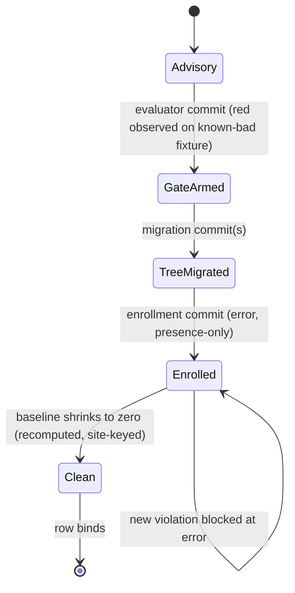

# Endgame Gate Graduation - Plan

## Goal Capsule

- **Objective:** no forbidden shape an LLM authors survives being written — every doctrine rule that was advisory fires as a failing command in this repo, and the published artifacts carry the same gates to whoever installs them. A row already enforced by an existing gate is documented as satisfied, not rebuilt.
- **Means:** gate-first row graduation on the existing enrollment chain, with an in-process published-surface firing suite as the program's acceptance gate (KTD1, KTD5).
- **Authority:** `CONSTITUTION.md` > `STRATEGY.md` > this plan. On conflict the gate is the final word (CONST-E6).
- **Stop conditions:** evidence that a settled decision cannot work (invalidating, per the settled-decision severity ladder); the laundering predicate proves undecidable at acceptable false-positive cost (KTD4).
- **Execution profile:** units are independently landable commits; evaluator surfaces always ship in their own commit (CONST-E8). The tail (simplify, review, ship, CI watch) is owned by the calling pipeline.

---

## Product Contract

### Summary

Promote the endgame's remaining advisory doctrine rows to binding gates, one row at a time, evaluator first. Two gap areas remain after audit: schema boundary enforcement and composition residue. The program's done signal lives at the published surface: a suite that imports the built artifacts the way a consumer resolves them and proves every forbidden shape fails there.

### Problem Frame

An LLM authoring code in this stack can still write shapes the doctrine forbids, and nothing fails: domain schemas built from bare primitives, brands with no runtime filter behind them, sandwiches hand-sequenced where the vocabulary's composer exists, and services laundered onto a Cell run instead of riding its `R` channel. Two rows of the doctrine ledger already bind — generated schema laws are ambient via the effect-schema-vite transform, and the workflow stem grammar is enrolled at error monorepo-wide — and are out of scope. Trust in machine-authored code cannot come from the author or a reviewer of the same kind; it comes from mechanisms that re-fire (STRATEGY.md, Positioning).

### Key Decisions

- **KD1: the stack is the product** — the enforcement machinery is the value proposition; success means the gates fire through the published artifacts, not only in this repo. (session-settled: user-directed — chosen over repo-internal completion: the endgame's worth is what a stranger's install inherits.) Governs R12, R13.
- **KD2: whole-program scope** — this plan owns every remaining advisory row, not one gap. (session-settled: user-directed — chosen over single-gap scoping: the rows share one enrollment chain and one definition of done.) Governs R1–R14.
- **KD3: Effect-TS only** — no plain-TypeScript ports of the gate fleet. (session-settled: user-directed — chosen over a wider-adoption plain-TS port: the Users section binds production Effect-TS.) Governs Scope Boundaries.
- **KD4: no LLM-judge products** — gates are mechanisms, never a second model's opinion. (session-settled: user-directed — chosen over an LLM review service on top of the gates: the model never authors both sides of an observer.) Governs Scope Boundaries.
- **KD5: stryker-js remains the flagship proof** — the engine is held to the doctrine end-to-end. (session-settled: user-directed — chosen over dropping stryker-js: it is the mutator that grades the fleet and the running demonstration of the rules.) Governs R9, R10, R11.

### Requirements

**Graduation discipline**

- R1. Every promoted row lands its evaluator first, in its own commit, observed red on a planted known-bad fixture before the migration it judges (CONST-E8; the known-bad/known-good pair is what converts a silent gate into evidence — CONCEPTS.md "Known-bad fixture").
- R2. Rules enroll presence-only at `error` through the existing chain — leaf `configs.recommended`, `recommendedFrom` in oxlint-plugin-effect-dmmf, the spread in oxlint-config.base.ts — never at `warn`; where the tree still violates, a dated baseline carries the residue.
- R3. A baseline is a recomputed, site-keyed list: an entry whose named site no longer violates (fixed, moved, or deleted) fails the gate. A row is done when its baseline is empty, not when its gate exists (CONST-E5: recomputed, never reported).
- R4. Every rule a plugin ships appears in that plugin's own `configs.recommended` at `error` — a leaf-local self-consistency check closes the registered-not-enrolled silence.

**Schema boundary enforcement**

- R5. A rule refuses bare-primitive fields (`String`, `Number`, `Boolean`, unrefined `Unknown`) in domain-significant schema positions, keyed on derived signals — schema type, refinement presence, import edge — never on a filename.
- R6. A rule refuses a brand with no runtime filter behind it: a `Schema.brand` (or equivalent) whose underlying schema carries no refinement that the brand's claim depends on.
- R7. The refutation kernels land in effect-schema-law — `weaken`, `refutation`, `refutes` per the obligation model in docs/plans/2026-08-05-005-feat-schema-refutation-adequacy-plan.md (kernel requirements R1–R8), re-authored against the current tree (KTD7) — with in-source, schema-derived property tests as their only test form.
- R8. effect-schema-vite's generated laws assert refutes coverage: every exported schema with a specifiable refusal has a `refutes` call reachable, emitted through `generateSchemaLaws` (the plan's R11, including its second-traversal hazard).
- R9. Every diagnostic this program adds follows the message doctrine in packages/oxlint-plugin/AGENTS.md (OX-EF1/OX-EF2): the shared `Expected/Actual/Fix` template, and `Fix` is a decision procedure that may end in deletion.

**Composition residue**

- R10. The engine pipeline is one `andThen` spine — the three stage cells (instrument, dryRun, mutationTest) compose through `Cell.andThen`, each cell's command typed as the prior stage's `*Done` response, with `runPrepare` remaining the outer gather — and the engine composition test's passing shape is that spine, not hand-bound `Cell.run` calls. This executes the unfinished tail of docs/plans/2026-09-01-1448-refactor-cell-kleisli-endgame-plan.md (its U4 and KTD5 narrowing rule are authoritative).
- R11. Per-Cell `provideService` laundering converts to `Cell.provide` or to services declared in the Cell's `R`; legitimate composition-root provisioning stays.
- R12. Gates for both shapes exist and are graph-derived: the sequencing rule reads the run/composition relation, and the laundering rule fires only where the provided service could have ridden the Cell's own `R` (KTD4).

**Consumer carriage**

- R13. A firing suite imports the published surfaces exactly as a consumer's toolchain resolves them — the `@systemfsoftware/all` aggregate's `dist`, the plugin packages' `dist`, and effect-schema-law's `dist`, all through their export maps — and asserts the full forbidden-shape corpus produces the expected diagnostics, in-process, with no spawned processes. The repo-internal `@systemfsoftware/oxlint-config` base preset is private by design and is not a carriage surface.
- R14. The forbidden-shape corpus and the RuleTester invalid cases are one source; a divergence between them fails a gate.

### Acceptance Examples

- AE1. Given the built plugin dist imported through its export map, when the corpus' bare-primitive schema is linted in-process, then the diagnostic names the field, the expected refined form, and the fix (Covers R5, R9, R13).
- AE2. Given a Cell whose `R` declares `FileSystem`, when an author pipes `Effect.provideService(FileSystem, captured)` onto its `run`, then the laundering rule fires; when the same service is provided at the composition root, then the rule stays silent (Covers R11, R12).
- AE3. Given the engine pipeline after cutover, when the composition test runs the spine, then sandwich order is observed through `andThen` with no hand-bound `Cell.run` chain (Covers R10).

### Success Criteria

- Paste-back test: for every promoted row, pasting the forbidden shape into the tree fails a named command — proven once at enrollment by the planted known-bad probe, and continuously by the firing suite's per-row negative case (U6).
- The firing suite is green over the full corpus against the built artifacts (R13).
- Every baseline admitted during the program is empty at close (R3).
- `pnpm check:local` exits 0; the PR's gate lanes are green.

### Scope Boundaries

**Deferred for later**

- The value-side metric for "trust without review" (flagged in STRATEGY.md for revisit).
- A baseline mechanism a consumer repo could adopt for its own pre-existing violations.
- A post-publish smoke job in the release workflow — pack, install into a fresh `node_modules`, run the corpus through the consumer's own `oxlint` invocation. This is a CI job, not a test, so the test-layer admission gate does not refuse it; it is deferred because the in-process firing suite (R13) covers carriage and firing, and install-shape proof is not load-bearing until the first external consumer exists.

**Outside this product's identity**

- Non-Effect TypeScript ports (KD3).
- LLM-as-judge review products (KD4).
- The flagship's audience is plain-TypeScript while the product boundary is Effect-TS (KD3): stryker-js crosses the boundary deliberately, as the demonstration that the doctrine grades code generally — porting the product surface to plain TS to chase that audience is refused.
- The agent harness (omp/, agent-plugins/) as a product surface.
- Every item the endgame picture vacated: a cell-suffix fleet, trophy widths as a gate, a fifth "evals" layer, characterization as a standing duty, blanket properties, `warn` as a migration severity, a two-file constitution, platform-named products, coverage-as-quota, in-source ceremony.

### Dependencies / Assumptions

- Row order: schema boundary before composition residue — the refutation work is already designed, and the flagship migration informs the composition gates' tuning. Recorded as a sequencing default, not a constraint.
- Site classifications settled at planning: Checker.ts's per-group `provideService(TypeScriptCompiler, ...)` onto `Cell.run(checkCell, …)` is laundering — `TypeScriptCompiler` is in `checkCell`'s `R`, so the provide belongs at the checker service's construction (known-bad). Reporter.ts's per-render provides are a per-event handler at an adapter shell — legal (must-stay-silent). Runner.ts's worker-init provides are composition-root provisioning on raw `Effect.gen` values — legal, and outside the rule's scope entirely: the laundering predicate binds `Cell.run` sites only.
- Consumer upgrade contract: pre-1.0 ALPHA (REPO-R1) — a new preset minor may fail a noncompliant consumer's build; no consumer-side baseline ships in this program.
- The laundering predicate's false-negative surface depends on every relevant Cell declaring its full `R`; U4 verifies the four stryker-js packages' Cell declarations before tuning the rule (review residual).
- Three load-bearing assumptions with their warrants, named by the pre-write destructive review (lens: Inversion): (a) mechanical gates bind LLM authors — the channel-ordering figures are posit, the prose-failure and type-error findings are canon; (b) the oxlint jsPlugins API is alpha — accepted risk, version pinned, the rule-triple convention isolates the surface; (c) consumer carriage is provable in-repo only as published-surface carriage plus firing — the stranger's own harness wiring is out of scope.
- Assumption (a) is premise-level and no unit can test it; it is untested as of this program and is revisited after the first external consumer install.

---

## Planning Contract

### Key Technical Decisions

- KTD1. **Gate-first graduation loop.** Per row: evaluator in its own commit (red observed on a planted known-bad fixture) → migration → enrollment in its own commit. This instantiates CONST-E8 and the damp-workflow-stem/ban-insource precedents (docs/plans/2026-09-04-1623-feat-damp-workflow-stem-cutover-plan.md, docs/plans/2026-09-06-1623-feat-ban-insource-non-prop-plan.md). Governs R1–R3.
- KTD2. **Negative-constraint polarity.** Every new gate forbids an outcome; none commands a declaration or ritual. Measured basis: negative constraints shape agent behavior, positive directives distort it (gate-economics study, canon atoms). Governs R4–R6, R12.
- KTD3. **Derived keys, never filenames.** Rules route on schema type, refinement presence, or import edge; the role-suffix taxonomy is retired and label-routed rules are unfalsifiable (docs/solutions/architecture-patterns/label-routed-rules-are-unfalsifiable.md). Governs R5, R6, R12.
- KTD4. **The laundering predicate discriminates by what the Cell's `R` could carry, and binds `Cell.run` sites only.** A provide piped onto `Cell.run(cell, …)` of a service the cell's declared `R` already demands is laundering; composition-root provisioning (decided lexically: the provide sits in a module's top-level scope, not inside a per-call closure) and provides on raw `Effect` values are not the rule's territory. Known-bad fixtures: Runner.ts's per-Cell `VitestHarness` provides and Checker.ts's per-group `TypeScriptCompiler` provide. Must-stay-silent fixtures: the Reporter.ts per-event pattern, composition roots (main.ts, platform/node.ts, Cli.ts), worker-init provisioning. A prohibition must close transitively over the provide/import relation (docs/solutions/architecture-patterns/a-prohibition-must-close-transitively.md). Governs R11, R12.
- KTD5. **Consumer proof is in-process over published surfaces.** Declared waiver (CONST-W3): the container-based stranger-repo fixture (pack → install → drive in testcontainers, the contract-lane shape) collides with the test-layer admission gate — a test that spawns a process fails admission, no exceptions — and the gate's verdict stands over this plan; the conflict is named here so a future plan can find the precedent. The firing suite instead imports the built `dist` of the published packages through their export maps, resolving exactly as a consumer's toolchain resolves them, and drives the corpus in-process. This asserts carriage and firing; it does not assert a stranger's CI wiring or install shape — that proof is the deferred post-publish smoke job (Scope Boundaries). Re-litigate when a consumer reports an install-shape defect the in-process suite cannot detect. Governs R13.
- KTD6. **Baselines recompute.** The baseline gate recomputes each entry against source on every run; an entry naming a site that no longer violates fails. Precedent: the lint-coverage exemption map — with its prose-reason rot vector closed by site-keying (CONST-E5). Governs R3.
- KTD7. **The refutation kernels are re-authored, not re-grounded.** docs/plans/2026-08-05-005-feat-schema-refutation-adequacy-plan.md predates the 2026-09-05 folder restructure, and its kernels were later removed (commit `941bcca550c`): `packages/effect-schema-law/src/` holds only `RuleOfSchemas.ts`, while stale `dist/refutation.*` artifacts survive from the deleted harness. U2 deletes the stale dist first, enumerates every vendored SchemaAST symbol the kernels touch (repos/effect, never node_modules — REPO-W4), then lands the kernel design (R1–R8) and regenerates the api-report golden. Governs R7, R8.
- KTD8. **Corpus and RuleTester share one source, cross-pinned.** The firing suite's forbidden-shape corpus is a shared module the RuleTester invalid cases and the firing suite both import; a divergence gate compares the corpus against each rule suite's invalid cases by name and fails on any entry present on exactly one side. Without this the firing suite is a ritual gate (CONCEPTS.md). Governs R14.

### High-Level Technical Design

The row-graduation state machine — every promoted row walks the same states, and the named gate decides each transition:

### Sequencing

Phase order follows the row order in Dependencies / Assumptions: schema boundary (U1–U3), composition residue (U4–U5), doctrine and release (U7). U6's firing suite scaffolds immediately after U1 — its corpus opens with U1's invalid cases — and grows as each row lands, so the carriage signal observes every phase rather than only the end. Within every row the KTD1 commit order holds: evaluator, migrate, enroll.

---

## Implementation Units

### U1. Schema-boundary rule pair

- **Goal:** the two schema-boundary rules exist, are proven red on planted violations, and are registered but not yet enrolled.
- **Requirements:** R1, R5, R6, R9; KTD2, KTD3.
- **Files:** `packages/oxlint-plugin/oxlint-plugin-effect-schema/src/rules/` (two new rule triples: rule, `.config.ts`, `__tests__/` RuleTester suite), `packages/oxlint-plugin/oxlint-plugin-effect-schema/src/index.ts` (register in `rules`, not `recommendedRules`).
- **Approach:** follow the prop-arbitrary-schema-origin triple shape end to end — verdict lattice with fail-open on unresolvable provenance, OX-EF1 message template. The bare-primitive rule's lattice: refined / branded-with-filter / bare. The brand rule's lattice: brand-over-refined / brand-over-bare. Both key on the schema expression's structure and the identifier's import provenance, never the file's name.
- **Patterns to follow:** `prop-arbitrary-schema-origin` (lattice + fail-open), `schema-filter-constructive-generation` (one template, heterogeneous fix paths).
- **Test scenarios:**
  - Happy path: refined and branded-with-filter schemas stay silent across all binding forms the corpus uses (direct import, namespace import, alias).
  - Edge cases: a schema composed through `pipe` with a refinement anywhere in the chain; a brand applied over a `Struct` of refined fields; stock-schema fields in non-domain positions (fail-open).
  - Error paths: bare `String` in a domain Struct field fires with Expected/Actual/Fix; brand over bare `String` fires.
  - Integration: RuleTester cases double as the known-bad corpus for R14's cross-pin.
- **Verification:** RuleTester suites green; the rule files hold a perfect kill score under the package's mutation run (advisory, reported in CI); planted known-bad probe in a real package observed red, then removed.

### U2. Refutation kernels

- **Goal:** `weaken`, `refutation`, and `refutes` land in effect-schema-law with their obligation model intact against the current tree.
- **Requirements:** R7, R9; KTD7.
- **Dependencies:** none (parallel with U1).
- **Files:** `packages/effect-schema-law/src/` (three new kernel modules, colocated in-source property tests), `packages/effect-schema-law/src/mod.ts` (barrel), `packages/effect-schema-law/etc/effect-schema-law.api.md` (regenerated).
- **Approach:** precondition — delete the stale `packages/effect-schema-law/dist/refutation.*` artifacts left by the removed harness so stale output cannot mask missing source (KTD7). Then execute docs/plans/2026-08-05-005-feat-schema-refutation-adequacy-plan.md R1–R8 as designed. Arms enumerate from the vendored SchemaAST — Refinement `from`, Transformation `from`+`to`, composites including `Declaration.typeParameters`. Only `refutes` touches `it.prop`. The kernels own an explicit unsupported-shape table: an AST shape the walk cannot rebuild (e.g. `Unknown`-rooted positions, which carry no refinement slot) is a named table entry with its coverage route — the U1 bare-primitive rule, not the kernels — so the gap is stated, never silent. In-source property tests are the kernels' only test form: schema-rooted arbitraries, no hand-built `fc.*` (the shipped property-testing rules already enforce this).
- **Patterns to follow:** `RuleOfSchemas.ts` (compiled codec pair built once; flat exported registrar), the refutation plan's KTD1–KTD3.
- **Test scenarios:**
  - Property: weakening an arm's constraint yields a schema whose arbitrary admits the recorded witness.
  - Property: `refutes` adequacy holds iff every obligation node in the reachable set has a registered refusal.
  - Edge: zero-arm schema — adequacy is vacuous and reported as such (the refutation-adequacy hole the program closes).
  - Edge: an `Unknown`-rooted schema resolves to its unsupported-shape table entry, naming the U1 rule as its coverage route.
- **Verification:** the kernels' in-source property suites green; hex-schema's known obligation set (8 nodes) reports adequate.

### U3. Refutes coverage emission and schema-rule enrollment

- **Goal:** generated laws assert refutes coverage; the U1 rules enroll at error; the tree's violating schemas are migrated.
- **Requirements:** R2, R3, R4, R8; KTD1.
- **Dependencies:** U1, U2.
- **Files:** `packages/effect-schema-vite/src/mod.ts` (coverage emission), `packages/oxlint-plugin/oxlint-plugin-effect-schema/src/index.ts` (enrollment commit), `packages/oxlint-plugin/oxlint-config/src/__tests__/base-registration.test.ts` (self-consistency assertion per R4), and every violating schema site a repo-wide census finds — including `packages/npm-package/src/Tarball.schema.ts`, `packages/effect-gherkin-spec/src/StepError.schema.ts`, `packages/storybook-gherkin/src/Errors.schema.ts`, `packages/stryker-js/stryker-js-engine/src/Plugins.schema.ts`, and hex-schema's schemas; the census is mechanical (every `Schema.String`/`Number`/`Boolean`/unrefined `Unknown` in a domain field position), so no violating file is missed.
- **Approach:** the coverage emission is a second, structurally different traversal — call sites can sit inside `import.meta.vitest` bodies, which the export walk never sees (the refutation plan's KTD4). The call-site walk resolves the callee identifier through the local import-binding chain to effect-schema-law's exported `refutes`, descends into `import.meta.vitest` guard blocks, and treats an unresolved, aliased, or shadowed callee as opaque — the schema is then reported un-refuted rather than skipped. Schema migrations convert bare fields to refined or branded forms; any site that cannot resolve in this pass takes a dated, site-keyed baseline entry (KTD6) and the row is not done until the list is empty.
- **Test scenarios:**
  - Happy path: a consumer `schema-laws.test.ts` regenerates with refutes coverage for every refusal-bearing schema.
  - Edge: a schema with no specifiable refusal emits no obligation and no failure.
  - Error path: deleting a `refutes` call fails the regenerated laws file.
  - Integration: base-registration self-consistency fails when a rule is absent from its leaf's recommended set.
- **Verification:** `pnpm check:local` exits 0 with the rules at error; the enrollment commit is standalone with red-before (planted known-bad) and green-after evidence; baselines, if any, are site-keyed and dated.

### U4. Composition-residue gates

- **Goal:** the sequencing and laundering rules exist, graph-derived, proven red on planted laundering, silent on the legal corpus.
- **Requirements:** R1, R12; KTD2, KTD4.
- **Dependencies:** none (parallel with U1–U3).
- **Files:** `packages/oxlint-plugin/oxlint-plugin-cell-vocabulary/src/rules/` (two new rule triples), `packages/oxlint-plugin/oxlint-plugin-cell-vocabulary/src/index.ts` (register, not enroll), `packages/oxlint-plugin/oxlint-plugin-cell-vocabulary/AGENTS.md` (rule descriptions).
- **Approach:** the sequencing rule reads the composition relation — a `Cell.run` whose success binding feeds a second `Cell.run` inside one `Effect.gen` is the forbidden shape; `Cell.andThen` is the fix the message names. The laundering rule implements KTD4's predicate: resolve the Cell's declared `R`; a provide piped onto `Cell.run` of a member of that `R` fires. Composition-root silence is decided lexically, never by a filename list: a provide in a module's top-level `Program` scope is provisioning; a provide inside a per-call closure is the suspect shape. `no-io-in-phase-bodies`'s `Program`-level walk is the implementation precedent.
- **Patterns to follow:** `no-io-in-phase-bodies` (vocabulary-driven rule reading `Cell.vocabulary`), the shared import-origin resolver package (`@systemfsoftware/oxlint-import-origin`).
- **Test scenarios:**
  - Known-bad: per-Cell provide of `VitestHarness` onto `Cell.run` (the Runner.ts pattern) fires; the per-group `TypeScriptCompiler` provide onto `Cell.run(checkCell, …)` (the Checker.ts pattern) fires — `TypeScriptCompiler` is in `checkCell`'s `R`.
  - Must-stay-silent: the Reporter.ts per-render fs/path provide (per-event handler at an adapter shell; no `Cell.run` site).
  - Must-stay-silent: composition-root provides (main.ts, platform/node.ts, Cli.ts).
  - Edge: two `Cell.run` calls whose values are independent (fan-out) stay silent; a response feeding the next command fires.
- **Verification:** RuleTester suites green; planted laundering probe observed red in a real package, then removed; false-positive budget within the fleet's aggregate (docs/solutions/tooling-decisions/rule-admission-severity-and-accretion.md).

### U5. Engine cutover and gate enrollment

- **Goal:** the flagship walks its own doctrine: one `andThen` spine, no laundering, and the U4 gates enroll at error over the clean tree.
- **Requirements:** R2, R10, R11; KTD1, KTD4.
- **Dependencies:** U4.
- **Files:** `packages/stryker-js/stryker-js-engine/src/Run.ts` (the spine), `packages/stryker-js/stryker-js-engine/tests/cell-layer-composition.integration.test.ts` (passing shape becomes the spine), laundering sites at `packages/stryker-js/stryker-js-vitest-runner/src/Runner.ts` and `packages/stryker-js/stryker-js-typescript-checker/src/Checker.ts` (both known-bad per KTD4), `packages/oxlint-plugin/oxlint-plugin-cell-vocabulary/src/index.ts` (enrollment commit).
- **Approach:** this unit executes the unfinished tail of the Kleisli endgame plan's U4 — its KTD5 narrowing rule is authoritative: where the prior stage's response is assignable to the next stage's command, `andThen` composes directly; where it is not, the next stage gains an explicit decode phase. The three stage cells (instrument, dryRun, mutationTest) compose with `Cell.andThen`; `runPrepare` is an `Effect`, not a Cell, and stays the outer gather. `Cell.provide` is not needed at this seam — `StageServices` already rides the cells' `R`. The laundering conversions hoist the `VitestHarness` and `TypeScriptCompiler` provides to each service's construction layer.
- **Execution note:** the composition test is the pin — keep its assertions on observable order and response flow, change only the construction they bless. Before rewriting it, run the existing hand-bound test and the spine side by side on the same published inputs until they agree; only then delete the hand-bound shape (CONST-T9).
- **Test scenarios:**
  - Happy path: the spine runs the four stages in order, response to command, observed through the composition test.
  - Error path: a stage's typed refusal propagates through `andThen` without hand-threading.
  - Integration: the CLI run over the composed engine produces the same observable run outcome as before the cutover (the composition test's existing assertions, re-pointed at the spine).
- **Verification:** engine package typecheck and tests green; the enrollment commit is standalone, red-before (planted laundering), green-after; `pnpm check:local` exits 0.

### U6. Published-surface firing suite

- **Goal:** the program's acceptance gate exists from the first landed row: the forbidden-shape corpus fails against the published artifacts, imported as a consumer imports them.
- **Requirements:** R13, R14; KTD5, KTD8.
- **Dependencies:** U1 (the corpus opens with its invalid cases); grows as U3, U4, and U5 land.
- **Files:** `packages/oxlint-plugin/all/src/` (the suite and the shared corpus module — `all` is the published aggregate that already depends on every plugin, so placement needs no new package), the divergence gate colocated with the corpus module.
- **Approach:** the suite imports exactly the published surfaces — `@systemfsoftware/all`'s `dist`, the plugin packages' `dist`, effect-schema-law's `dist` — through their export maps, the same resolution a consumer's toolchain performs. It drives the corpus in-process through the RuleTester machinery. The corpus module is the single source the RuleTester invalid cases and this suite both consume; the divergence gate fails when any invalid case or corpus entry exists on exactly one side (KTD8). No process spawning, no packing, no containers — the test-layer admission gate's verdict, recorded in KTD5.
- **Test scenarios:**
  - Every corpus shape fires its named diagnostic against the dist-imported rules.
  - Negative: the suite runs with one rule's recommended entry removed and asserts that rule's diagnostic disappears — the silent-deregistration defect is what this catches, and it is what makes the paste-back guarantee suite-resident rather than a one-shot enrollment observation.
  - Divergence: a RuleTester invalid case absent from the corpus (or vice versa) fails the cross-pin.
  - Carriage: a rule absent from the published recommended config fails the suite (the consumer-erasure case).
- **Verification:** the suite fails when any corpus shape lacks its gate (the negative case proves this continuously) and is green on the whole fleet.

### U7. Doctrine, baselines, and release intents

- **Goal:** the record matches the machine; the release carries the new gates to consumers.
- **Requirements:** R3, R4; KTD6.
- **Dependencies:** U1–U6.
- **Files:** `scripts/guards/` (the baseline-recompute guard, if U3 admitted any baseline), `CONCEPTS.md` (gap-fill: the graduation-loop vocabulary), `.changeset/` (intents per REPO-R2: the plugin and preset packages' hash moves), `docs/solutions/` (any learning the program earned).
- **Approach:** the baseline guard recomputes each entry's site on every run and fails on a stale entry (KTD6); changeset bodies name consumer-observable facts only (new rules at error in the preset; new laws coverage); CONCEPTS entries follow the existing glossary form.
- **Test scenarios:** the baseline guard carries an in-process test: a constructed stale entry (naming a site that no longer violates) exits non-zero; a live entry exits zero. This mirrors the planted known-bad shape U1–U6 use for evaluator surfaces.
- **Verification:** the guard observed failing on a hand-staled baseline entry and passing after its removal; the changeset gate exits 0; `pnpm check:local` exits 0 on the final tree.

---

## Verification Contract

| Gate | Command | Proves |
| ---- | ------- | ------ |
| Whole tree | `pnpm check:local` | lint (`all` preset), dprint, commitlint, gate tasks, dist |
| Rule suites | `pnpm --filter <plugin> test` | RuleTester triples green |
| Kernels | `pnpm --filter @systemfsoftware/effect-schema-law test` | in-source property suites green |
| Enrollment | `pnpm --filter @systemfsoftware/oxlint-config test` | base-registration spread and leaf self-consistency |
| Engine | `pnpm --filter @systemfsoftware/stryker-js-engine typecheck test` | the spine composes and runs |
| Consumer carriage | the U6 suite's package test command | corpus fires against dist-imported surfaces |
| Evaluator evidence | per evaluator commit: planted known-bad red, then green after removal | the gate can fail at all |
| CI | `gh pr checks --watch --fail-fast` | gate, contract, changeset lanes green; advisory Mutation matrix reported |

Mutation scores are evaluated by the advisory CI workflow (REPO-D3); no local mutation runs.

---

## Definition of Done

- Global: R1–R14 hold, each exercised by a named gate above; `pnpm check:local` exits 0 on the final tree; the PR is green on its lanes; abandoned-approach code from intermediate attempts is removed, not left in the diff; the tree is restartable.
- Per row: the row is done when its baseline is empty (R3) — a wired gate with a living baseline is enrolled, not done.
- Per unit: the unit's Verification line ran with its outcome recorded; evaluator commits stand alone with their red-before/green-after evidence (CONST-E8).
- The firing suite is green over the full corpus against the built artifacts, and the corpus cross-pin holds (R13, R14).

---

## Sources / Research

- docs/plans/2026-08-05-005-feat-schema-refutation-adequacy-plan.md — the refutation kernels' design (R1–R16, KTD1–KTD4); stale paths re-grounded per KTD7.
- docs/plans/2026-09-01-1448-refactor-cell-kleisli-endgame-plan.md — the `andThen` spine's type rule (KTD5 there: each stage's command is the prior stage's `*Done`).
- docs/plans/2026-09-06-1623-feat-ban-insource-non-prop-plan.md — presence-only enrollment at error (KTD4 there), planted-violation RED probes (KTD7 there).
- docs/plans/2026-09-04-1623-feat-damp-workflow-stem-cutover-plan.md — the register → cutover → enroll commit order.
- docs/solutions/architecture-patterns/label-routed-rules-are-unfalsifiable.md — derived keys, never filenames.
- docs/solutions/architecture-patterns/a-prohibition-must-close-transitively.md — the laundering gate is graph-derived.
- docs/solutions/tooling-decisions/rule-admission-severity-and-accretion.md — error + dated baseline, never warn; false-positive budget.
- docs/solutions/design-patterns/generated-schema-laws-are-tautological.md — why refusals are hand-authored and coverage must be asserted.
- packages/oxlint-plugin/AGENTS.md — OX-EF1/OX-EF2 message doctrine.
- STRATEGY.md — purpose, positioning, users, boundaries, tracks.
- oxlint jsPlugins documentation (oxc.rs) and the 2026-03 alpha announcement — the fleet's host API and its maturity risk (Assumptions, b).
- The gate-economics study (arXiv 2604.11088) — negative-constraint polarity (KTD2); the typed-decoding study (arXiv 2504.09246) — 94% of LLM compilation errors are type errors.
