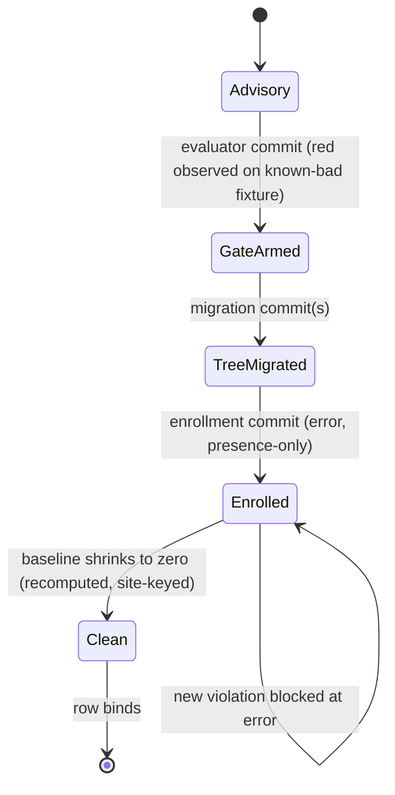

# Endgame Gate Graduation - Plan

## Goal Capsule

- **Objective:** no forbidden shape an LLM authors survives being written — every doctrine rule that was advisory fires as a failing command in this repo, and the published artifacts carry the same gates to whoever installs them. A row already enforced by an existing gate is documented as satisfied, not rebuilt.
- **Means:** gate-first row graduation on the existing enrollment chain, with an in-process published-surface firing suite as the program's acceptance gate (KTD1, KTD5).
- **Authority:** `CONSTITUTION.md` > `STRATEGY.md` > this plan. On conflict the gate is the final word (CONST-E6).
- **Stop conditions:** evidence that a settled decision cannot work (invalidating, per the settled-decision severity ladder); the laundering predicate proves undecidable at acceptable false-positive cost (KTD4).
- **Execution profile:** units are independently landable commits; evaluator surfaces always ship in their own commit (CONST-E8). The tail (simplify, review, ship, CI watch) is owned by the calling pipeline.

---

## Product Contract

### Summary

Promote the endgame's remaining advisory doctrine rows to binding gates, one row at a time, evaluator first. Two gap areas: schema boundary enforcement and composition residue. The program's done signal lives at the published surface: a suite that imports the built artifacts the way a consumer resolves them and proves every forbidden shape fails there.

### Problem Frame

An LLM authoring code in this stack can still write shapes the doctrine forbids, and nothing fails: domain schemas built from bare primitives, brands with no runtime filter behind them, sandwiches hand-sequenced where the vocabulary's composer exists, services laundered onto a Cell run instead of riding its `R` channel, and property tests whose predicates ignore the generated draw. Two rows of the doctrine ledger already bind — generated schema laws are ambient via the effect-schema-vite transform, and the workflow stem grammar is enrolled at error monorepo-wide — and are out of scope.

The refutation-obligation scanner stays deleted. It was removed once (#271, 2026-08-27) after its generated per-consumer suites hung at the test deadline, and the revival's own adoption pass showed the structural defect: satisfying the scanner demands expert per-site judgment about Type-side versus Encoded-side semantics, so the gate manufactures ceremony instead of refusing shapes. The doctrine's requirement is met without it: schemas carry arms because the bare-primitive and brand rules force them (R5, R6), hand-written refusals stay legal where a boundary earns one (CONST-T10, CONST-T14), and the mutation matrix grades tautological laws. A quota over obligation nodes is coverage-as-quota in schema clothes, and coverage quotas are vacated doctrine.

Trust in machine-authored code cannot come from the author or a reviewer of the same kind; it comes from mechanisms that re-fire (STRATEGY.md, Positioning).

### Key Decisions

- **KD1: the stack is the product** — the enforcement machinery is the value proposition; success means the gates fire through the published artifacts, not only in this repo. (session-settled: user-directed — chosen over repo-internal completion: the endgame's worth is what a stranger's install inherits.) Governs R12, R13.
- **KD2: whole-program scope** — this plan owns every remaining advisory row, not one gap. (session-settled: user-directed — chosen over single-gap scoping: the rows share one enrollment chain and one definition of done.) Governs R1–R14.
- **KD3: Effect-TS only** — no plain-TypeScript ports of the gate fleet. (session-settled: user-directed — chosen over a wider-adoption plain-TS port: the Users section binds production Effect-TS.) Governs Scope Boundaries.
- **KD4: no LLM-judge products** — gates are mechanisms, never a second model's opinion. (session-settled: user-directed — chosen over an LLM review service on top of the gates: the model never authors both sides of an observer.) Governs Scope Boundaries.
- **KD5: stryker-js remains the flagship proof** — the engine is held to the doctrine end-to-end. (session-settled: user-directed — chosen over dropping stryker-js: it is the mutator that grades the fleet and the running demonstration of the rules.) Governs R9, R10, R11.
- **KD6: no obligation scanner** — refutation adequacy is enforced by the bare-primitive and brand rules plus earned hand-written refusals, never by a coverage gate over schema arms. (session-settled: user-directed — chosen over reviving the deleted refutation harness: the revival conflicted with the vacated coverage-quota doctrine and its adoption demanded per-site expert judgment.) Governs Scope Boundaries.

### Requirements

**Graduation discipline**

- R1. Every promoted row lands its evaluator first, in its own commit, observed red on a planted known-bad fixture before the migration it judges (CONST-E8; the known-bad/known-good pair is what converts a silent gate into evidence — CONCEPTS.md "Known-bad fixture").
- R2. Rules enroll presence-only at `error` through the existing chain — leaf `configs.recommended`, `recommendedFrom` in oxlint-plugin-effect-dmmf, the spread in oxlint-config.base.ts — never at `warn`; where the tree still violates, a dated baseline carries the residue.
- R3. A baseline is a recomputed, site-keyed list: an entry whose named site no longer violates (fixed, moved, or deleted) fails the gate. A row is done when its baseline is empty, not when its gate exists (CONST-E5: recomputed, never reported).
- R4. Every rule a plugin ships appears in that plugin's own `configs.recommended` at `error` — a leaf-local self-consistency check closes the registered-not-enrolled silence.

**Schema boundary enforcement**

- R5. A rule refuses bare-primitive fields (`String`, `Number`, `Boolean`, unrefined `Unknown`) in domain-significant schema positions, keyed on derived signals — schema type, refinement presence, import edge — never on a filename.
- R6. A rule refuses a brand with no runtime filter behind it: a `Schema.brand` (or equivalent) whose underlying schema carries no refinement that the brand's claim depends on.

**Composition residue**

- R10. The engine pipeline is one `andThen` spine — the three stage cells (instrument, dryRun, mutationTest) compose through `Cell.andThen`, each cell's command typed as the prior stage's `*Done` response, with `runPrepare` remaining the outer gather — and the engine composition test's passing shape is that spine, not hand-bound `Cell.run` calls. This executes the unfinished tail of docs/plans/2026-09-01-1448-refactor-cell-kleisli-endgame-plan.md (its U4 and KTD5 narrowing rule are authoritative).
- R11. Per-Cell `provideService` laundering converts to `Cell.provide` or to services declared in the Cell's `R`; legitimate composition-root provisioning stays.
- R12. Gates for both shapes exist and are graph-derived: the sequencing rule reads the run/composition relation, and the laundering rule fires only where the provided service could have ridden the Cell's own `R` (KTD4).

**Property honesty**

- R15. A rule refuses an in-source `it.prop`/`it.effect.prop` whose predicate suppresses every destructured draw with an underscore, leaves a bound draw unread, or takes `fc.constant`/`fc.constantFrom` as an input space — a property that ignores its generator is a deterministic check in costume and cannot fail on a plausible bug.

**Consumer carriage**

- R13. A firing suite imports the published surfaces exactly as a consumer's toolchain resolves them — the `@systemfsoftware/all` aggregate's `dist`, the plugin packages' `dist`, and effect-schema-law's `dist`, all through their export maps — and asserts the full forbidden-shape corpus produces the expected diagnostics, in-process, with no spawned processes. The repo-internal `@systemfsoftware/oxlint-config` base preset is private by design and is not a carriage surface.
- R14. The forbidden-shape corpus and the RuleTester invalid cases are one source; a divergence between them fails a gate.

### Acceptance Examples

- AE1. Given the built plugin dist imported through its export map, when the corpus' bare-primitive schema is linted in-process, then the diagnostic names the field, the expected refined form, and the fix (Covers R5, R13).
- AE2. Given a Cell whose `R` declares `TypeScriptCompiler`, when an author pipes `Effect.provideService(TypeScriptCompiler, captured)` onto its `Cell.run`, then the laundering rule fires; when the same service is provided at the composition root, then the rule stays silent (Covers R11, R12).
- AE3. Given the engine pipeline after cutover, when the composition test runs the spine, then sandwich order is observed through `andThen` with no hand-bound `Cell.run` chain (Covers R10).
- AE4. Given an in-source pin whose destructured draws are all underscore-suppressed, when oxlint runs, then `no-ignored-draw` reports the pin; given a predicate that reads the draw, it stays silent (Covers R15).

### Success Criteria

- Paste-back test: for every promoted row, pasting the forbidden shape into the tree fails a named command — proven once at enrollment by the planted known-bad probe, and continuously by the firing suite's per-row negative case (U6).
- The firing suite is green over the full corpus against the built artifacts (R13).
- Every baseline admitted during the program is empty at close (R3).
- `pnpm check:local` exits 0; the PR's gate lanes are green.

### Scope Boundaries

**Deferred for later**

- The value-side metric for "trust without review" (flagged in STRATEGY.md for revisit).
- A baseline mechanism a consumer repo could adopt for its own pre-existing violations.
- A post-publish smoke job in the release workflow — pack, install into a fresh `node_modules`, run the corpus through the consumer's own `oxlint` invocation. This is a CI job, not a test, so the test-layer admission gate does not refuse it; it is deferred because the in-process firing suite (R13) covers carriage and firing, and install-shape proof is not load-bearing until the first external consumer exists.

**Outside this product's identity**

- The refutation-obligation scanner: no `refutes` registrar, no adequacy report, no coverage emission over schema arms (KD6). Hand-written refusals at earned boundaries remain legal without it.
- Non-Effect TypeScript ports (KD3).
- LLM-as-judge review products (KD4).
- The flagship's audience is plain-TypeScript while the product boundary is Effect-TS (KD3): stryker-js crosses the boundary deliberately, as the demonstration that the doctrine grades code generally — porting the product surface to plain TS to chase that audience is refused.
- The agent harness (omp/, agent-plugins/) as a product surface.
- Every item the endgame picture vacated: a cell-suffix fleet, trophy widths as a gate, a fifth "evals" layer, characterization as a standing duty, blanket properties, `warn` as a migration severity, a two-file constitution, platform-named products, coverage-as-quota, in-source ceremony.

### Dependencies / Assumptions

- Site classifications settled at planning: Checker.ts's per-group `provideService(TypeScriptCompiler, ...)` onto `Cell.run(checkCell, …)` is laundering — `TypeScriptCompiler` is in `checkCell`'s `R`, so the provide belongs at the checker service's construction (known-bad). Reporter.ts's per-render provides are a per-event handler at an adapter shell — legal (must-stay-silent). Runner.ts's worker-init provides are composition-root provisioning on raw `Effect.gen` values — legal, and outside the rule's scope entirely: the laundering predicate binds `Cell.run` sites only. Runner.ts's dryRun pipe is a raw `Effect.gen` with no `Cell.run` in its subtree — outside the predicate, settled at implementation.
- Consumer upgrade contract: pre-1.0 ALPHA (REPO-R1) — a new preset minor may fail a noncompliant consumer's build; no consumer-side baseline ships in this program.
- The laundering predicate's false-negative surface depends on every relevant Cell declaring its full `R`; the four stryker-js packages' declarations were verified during implementation.
- Three load-bearing assumptions with their warrants, named by the pre-write destructive review (lens: Inversion): (a) mechanical gates bind LLM authors — the channel-ordering figures are posit, the prose-failure and type-error findings are canon; (b) the oxlint jsPlugins API is alpha — accepted risk, version pinned, the rule-triple convention isolates the surface; (c) consumer carriage is provable in-repo only as published-surface carriage plus firing — the stranger's own harness wiring is out of scope.
- Assumption (a) is premise-level and no unit can test it; it is untested as of this program and is revisited after the first external consumer install.

---

## Planning Contract

### Key Technical Decisions

- KTD1. **Gate-first graduation loop.** Per row: evaluator in its own commit (red observed on a planted known-bad fixture) → migration → enrollment in its own commit. This instantiates CONST-E8 and the damp-workflow-stem/ban-insource precedents (docs/plans/2026-09-04-1623-feat-damp-workflow-stem-cutover-plan.md, docs/plans/2026-09-06-1623-feat-ban-insource-non-prop-plan.md). Governs R1–R3.
- KTD2. **Negative-constraint polarity.** Every new gate forbids an outcome; none commands a declaration or ritual. Measured basis: negative constraints shape agent behavior, positive directives distort it (gate-economics study, canon atoms). Governs R5, R6, R12, R15.
- KTD3. **Derived keys, never filenames.** Rules route on schema type, refinement presence, or import edge; the role-suffix taxonomy is retired and label-routed rules are unfalsifiable (docs/solutions/architecture-patterns/label-routed-rules-are-unfalsifiable.md). Governs R5, R6, R12, R15.
- KTD4. **The laundering predicate discriminates by what the Cell's `R` could carry, and binds `Cell.run` sites only.** A provide piped onto `Cell.run(cell, …)` of a service the cell's declared `R` already demands is laundering; composition-root provisioning (decided lexically: the provide sits in a module's top-level scope, not inside a per-call closure) and provides on raw `Effect` values are not the rule's territory. Known-bad fixtures: Runner.ts's per-Cell `VitestHarness` provide and Checker.ts's per-group `TypeScriptCompiler` provide. Must-stay-silent fixtures: the Reporter.ts per-event pattern, composition roots (main.ts, platform/node.ts, Cli.ts), worker-init provisioning, Runner.ts's raw-Effect dryRun pipe. A prohibition must close transitively over the provide/import relation (docs/solutions/architecture-patterns/a-prohibition-must-close-transitively.md). Governs R11, R12.
- KTD5. **Consumer proof is in-process over published surfaces.** Declared waiver (CONST-W3): the container-based stranger-repo fixture (pack → install → drive in testcontainers, the contract-lane shape) collides with the test-layer admission gate — a test that spawns a process fails admission, no exceptions — and the gate's verdict stands over this plan; the conflict is named here so a future plan can find the precedent. The firing suite instead imports the built `dist` of the published packages through their export maps, resolving exactly as a consumer's toolchain resolves them, and drives the corpus in-process. This asserts carriage and firing; it does not assert a stranger's CI wiring or install shape — that proof is the deferred post-publish smoke job (Scope Boundaries). Re-litigate when a consumer reports an install-shape defect the in-process suite cannot detect. Governs R13.
- KTD6. **Baselines recompute.** The baseline gate recomputes each entry against source on every run; an entry naming a site that no longer violates fails. Precedent: the lint-coverage exemption map — with its prose-reason rot vector closed by site-keying (CONST-E5). Governs R3.
- KTD7. **Corpus and RuleTester share one source, cross-pinned.** The firing suite's forbidden-shape corpus is a shared module the RuleTester invalid cases and the firing suite both import; a divergence gate compares the corpus against each rule suite's invalid cases by name and fails on any entry present on exactly one side. Without this the firing suite is a ritual gate (CONCEPTS.md). Governs R14.

### High-Level Technical Design

The row-graduation state machine — every promoted row walks the same states, and the named gate decides each transition:

### Sequencing

All gate-authoring units have landed. Remaining: enrollment of the schema-boundary and composition-residue rules over their baselines (U7), and the firing suite (U6), which scaffolds as soon as the rule suites export their invalid-case corpora. Within every row the KTD1 commit order holds: evaluator, migrate, enroll.

---

## Implementation Units

### U6. Published-surface firing suite

- **Goal:** the program's acceptance gate exists: the forbidden-shape corpus fails against the published artifacts, imported as a consumer imports them.
- **Requirements:** R13, R14; KTD5, KTD7.
- **Dependencies:** the schema-boundary and composition-residue rule suites (landed).
- **Files:** `packages/oxlint-plugin/all/src/` (the suite and the divergence assertion — `all` is the published aggregate that already depends on every plugin), plus the corpus modules each rule package owns (`src/rules/<rule>.corpus.ts`) with the RuleTester suites re-pointed at them.
- **Approach:** the suite imports exactly the published surfaces — `@systemfsoftware/all`'s `dist`, the plugin packages' `dist`, effect-schema-law's `dist` — through their export maps, the same resolution a consumer's toolchain performs. It drives the corpus in-process through the RuleTester machinery. The corpus module is the single source the RuleTester invalid cases and this suite both consume; the divergence gate fails when any invalid case or corpus entry exists on exactly one side (KTD7). No process spawning, no packing, no containers — the test-layer admission gate's verdict, recorded in KTD5.
- **Test scenarios:**
  - Every corpus shape fires its named diagnostic against the dist-imported rules.
  - Negative: the suite runs with one rule's recommended entry removed and asserts that rule's diagnostic disappears — the silent-deregistration defect is what this catches, and it is what makes the paste-back guarantee suite-resident rather than a one-shot enrollment observation.
  - Divergence: a RuleTester invalid case absent from the corpus (or vice versa) fails the cross-pin.
  - Carriage: a rule absent from the published recommended config fails the suite (the consumer-erasure case).
- **Verification:** the suite fails when any corpus shape lacks its gate (the negative case proves this continuously) and is green on the whole fleet.

### U7. Baselines, enrollment, doctrine, and release intents

- **Goal:** every registered-not-enrolled rule enrolls at error over a dated, site-keyed baseline; the record matches the machine; the release carries the new gates to consumers.
- **Requirements:** R2, R3, R4; KTD1, KTD6.
- **Dependencies:** U6.
- **Files:** the baseline artifact (a committed, dated, site-keyed list per enrolling rule), `packages/oxlint-plugin/oxlint-plugin-effect-schema/src/index.ts` and `packages/oxlint-plugin/oxlint-plugin-cell-vocabulary/src/index.ts` (enrollment commits, one per plugin), `packages/oxlint-plugin/oxlint-config/src/__tests__/base-registration.test.ts` (allowlist shrinks as rules enroll), `.changeset/` (intents per REPO-R2), `docs/solutions/` (learnings the program earned).
- **Approach:** the 2026-09-07 census (137 bare-primitive hits across 34 files, 0 brand hits) seeds the baseline for the bare-primitive rule; the brand rule and both composition-residue rules enroll clean (no live violations). Baseline entries name site keys a recompute can check; the recompute guard is the existing lint run itself — the baseline is expressed as per-site `allow` entries, and a stale entry re-reports as an unmatched-allow finding at lint time. Each enrollment commit is standalone with red-before (planted known-bad) and green-after evidence (KTD1).
- **Test scenarios:** the self-consistency assertion (R4) already proves enrollment state; the enrollment commits carry planted-fixture red evidence per rule.
- **Verification:** `pnpm check:local` exits 0 with all four rules at error; the changeset gate exits 0.

---

## Verification Contract

| Gate               | Command                                                               | Proves                                                                   |
| ------------------ | --------------------------------------------------------------------- | ------------------------------------------------------------------------ |
| Whole tree         | `pnpm check:local`                                                    | lint (`all` preset), dprint, commitlint, gate tasks, dist                |
| Rule suites        | `pnpm --filter <plugin> test`                                         | RuleTester triples green                                                 |
| Enrollment         | `pnpm --filter @systemfsoftware/oxlint-config test`                   | base-registration spread and leaf self-consistency                       |
| Engine             | `pnpm --filter @systemfsoftware/stryker-js-engine typecheck test`     | the spine composes and runs                                              |
| Consumer carriage  | the U6 suite's package test command                                   | corpus fires against dist-imported surfaces                              |
| Evaluator evidence | per evaluator commit: planted known-bad red, then green after removal | the gate can fail at all                                                 |
| CI                 | `gh pr checks --watch --fail-fast`                                    | gate, contract, changeset lanes green; advisory Mutation matrix reported |

Mutation scores are evaluated by the advisory CI workflow (REPO-D3); no local mutation runs.

---

## Definition of Done

- Global: R1–R6, R10–R15 hold, each exercised by a named gate above; `pnpm check:local` exits 0 on the final tree; the PR is green on its lanes; abandoned-approach code from intermediate attempts is removed, not left in the diff; the tree is restartable.
- Per row: the row is done when its baseline is empty (R3) — a wired gate with a living baseline is enrolled, not done.
- Per unit: the unit's Verification line ran with its outcome recorded; evaluator commits stand alone with their red-before/green-after evidence (CONST-E8).
- The firing suite is green over the full corpus against the built artifacts, and the corpus cross-pin holds (R13, R14).

---

## Sources / Research

- docs/plans/2026-09-01-1448-refactor-cell-kleisli-endgame-plan.md — the `andThen` spine's type rule (KTD5 there: each stage's command is the prior stage's `*Done`).
- docs/plans/2026-09-06-1623-feat-ban-insource-non-prop-plan.md — presence-only enrollment at error, planted-violation RED probes.
- docs/plans/2026-09-04-1623-feat-damp-workflow-stem-cutover-plan.md — the register → cutover → enroll commit order.
- docs/solutions/architecture-patterns/label-routed-rules-are-unfalsifiable.md — derived keys, never filenames.
- docs/solutions/architecture-patterns/a-prohibition-must-close-transitively.md — the laundering gate is graph-derived.
- docs/solutions/tooling-decisions/rule-admission-severity-and-accretion.md — error + dated baseline, never warn; false-positive budget.
- docs/solutions/design-patterns/generated-schema-laws-are-tautological.md — generated laws cover acceptance only; refusals are hand-written where earned.
- docs/solutions/integration-issues/parallel-lanes-race-on-one-immutable-cache-key.md — the generated per-consumer refutation suites hung at the test deadline (#271).
- packages/oxlint-plugin/AGENTS.md — OX-EF1/OX-EF2 message doctrine.
- STRATEGY.md — purpose, positioning, users, boundaries, tracks.
- oxlint jsPlugins documentation (oxc.rs) and the 2026-03 alpha announcement — the fleet's host API and its maturity risk (Assumptions, b).
- The gate-economics study (arXiv 2604.11088) — negative-constraint polarity (KTD2); the typed-decoding study (arXiv 2504.09246) — 94% of LLM compilation errors are type errors.
