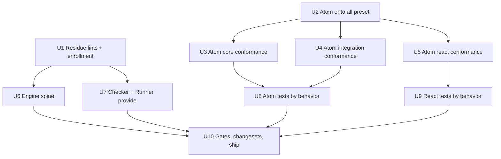
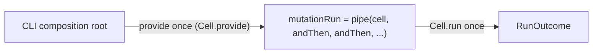

# Effect-atom destination cutover

## Goal Capsule

- **Objective:** Every forbidden shape the systemf destination law names fails a command on the effect-atom tree and its consumers, and both atom packages sit at the production lint bar (`@systemfsoftware/all`) with behavior preserved.
- **Means:** Residue lints authored and activated at error (KTD2), atom packages moved onto the `all` preset (KTD1), the test suite restructured by behavior (KTD3), all lint-red production sites migrated (KTD5–KTD8).
- **Authority:** The destination document (this run's objective), `CONSTITUTION.md`, root/leaf `AGENTS.md`, `CONCEPTS.md`. This plan's KTDs are canonical after write; user rulings this session override any earlier document where they conflict (CONST-G5 resolves by amendment, never by overriding a gate).
- **Stop conditions:** Definition of Done below; a settled decision invalidated by evidence stops the run as blocked (report `settled-decision-invalidated`).
- **Execution profile:** Parallel implementation units with disjoint write scopes; orchestrator verifies every gate; evaluator changes land in their own commit (CONST-E8, `CONCEPTS.md` "Evaluator surface").

---

## Product Contract

### Summary

`packages/atom/effect-atom` and `packages/atom/effect-atom-react` are owned first-party (REPO-O1). This change cuts them over to the destination architecture law: production lint preset, residue gates, tagged failures, single-path decisions, and a test suite organized by behavior through public surfaces.

### Problem Frame

The packages lint on `@systemfsoftware/oxlint-config/base` with `correctness`/`perf` only, so every custom rule — `no-io-in-phase-bodies`, the test-hygiene and test-placement tiers, the `node:*` import ban — is inert here. Two doctrine-named residue gates (`no-two-run-chain`, `no-platform-provide-service-on-run`) exist nowhere in the tree, so pasting the shapes they name back stays green. The atom test files are one-to-one mirrors of source files with `expect` calls outside test blocks — smoke structure, not behavior suites. Each of these is a lossy channel: doctrine exists, no command carries it.

### Requirements

Production lint bar:

- R1. Both atom packages lint green under `@systemfsoftware/all`; no `warn` rests anywhere in their configs or findings (governs: KTD1, KTD4).
- R2. The `import/no-cycle` severity resolves to `error` or removal-with-reason, never `warn` (governs: KTD4).

Residue gates:

- R3. `no-two-run-chain` and `no-platform-provide-service-on-run` exist in `packages/oxlint-plugin/oxlint-plugin-cell-vocabulary` at error in `configs.recommended`, with RuleTester suites and an updated `etc/oxlint-plugin-cell-vocabulary.api.md` (governs: KTD2).
- R4. Pasting each forbidden shape back makes a command red: the `Effect.gen` of chained `Cell.run` in `packages/stryker-js/stryker-js-engine/src/Run.ts`, and each `provideService`-on-`Cell.run` chain in `packages/stryker-js/stryker-js-typescript-checker/src/Checker.ts` and `packages/stryker-js/stryker-js-vitest-runner/src/Runner.ts`, are red before migration and green after (governs: KTD2).

Production migration:

- R5. `stryker-js-engine` exports one composed Cell whose spine is `Cell.andThen`; the CLI provides once and runs once; no `Effect.gen` sequences two `Cell.run` calls on a prior success anywhere (governs: KTD7).
- R6. No `Effect.provideService` sits on any `Cell.run`-rooted chain; the service rides the Cell's `R` channel and is provided at the composition root via `Cell.provide` (governs: KTD8).

Atom source conformance:

- R7. `effect-atom/src` and `effect-atom-react/src` carry no ternaries, no truthiness of nullable values, no `as` type assertions, and no unnecessary conditions; behavior is unchanged (governs: KTD5).
- R8. `decideNodeFate` in `packages/atom/effect-atom/src/internal/NodeLifetime.ts` is one `Match.value(...).pipe(..., Match.exhaustive)` single path; no error channel is invented (governs: KTD6).
- R9. Reachable `throw new Error` on protocol paths in `AtomHttpApi.ts` and `AtomRpc.ts` becomes a tagged failure wired into that module's existing error union; AT5 wire TypeIds are unchanged (governs: KTD9).

Test suite:

- R10. Atom tests are behavior-organized suites through public surfaces: every `expect` sits inside a test block, no test file mirrors one source file one-to-one, pure-law coverage lands as property tests where the surface cannot reach, and placement follows the test-placement rules (governs: KTD3).

### Key Decisions

- **The `all` preset is the production bar for atom.** Governs R1, R2. The preset bundles every custom plugin plus the `node:*` import ban; `base` alone leaves them inert.
- **A forbidden shape must fail a command.** Governs R3, R4. Residue lint is the enforcement channel for exactly the sense the type checker cannot carry (affine use; capture-onto-run).
- **Tests assert behavior through public surfaces.** Governs R10. Authority: the Testing Trophy order the constitution adopts (CONST-T15) and https://kentcdodds.com/blog/write-tests.
- **No resting `warn`.** Governs R1, R2. Destination law §3: never commit `warn`.

---

## Planning Contract

### Key Technical Decisions

- KTD1. Move both atom `oxlint.config.ts` files to `extends: [all]`, keeping the `jsdoc/check-tag-names` tag allowances as overrides and the `AtomRpc.integration.test.ts` ignore until U8 dissolves that file (session-settled: user-directed — chosen over staying on `base` with `correctness`/`perf`: the root law requires production code on the `all` preset).
- KTD2. Author both residue lints in cell-vocabulary (`defineRule`, static config in `<rule>.config.ts`, OX-* conventions), enroll at error in `configs.recommended`, deliver consumer-side only (CELL-D1 — never through `effect-dmmf` or `ox-config`), rebuild the plugin dist, and prove red-then-green on the live sites (session-settled: user-directed — chosen over leaving the gates doctrine-named but unauthored: a row arrives only when the shape fails a command). Enforcement scope warrant: the law's own gate row scopes the forbidden shape to "two `Cell.run` sequenced on the prior success inside `Effect.gen`" — the gen body is the law's chosen surface, not an invention of this plan; the gen-free flatMap-pipe residue class is deferred law amendment (Scope Boundaries).
- KTD3. Restructure the atom suites into behavior domains (registry lifecycle, hydration round-trip, HTTP-API request behavior, RPC behavior, reactive primitives, SSR/boundary behavior for react), one suite per domain through public exports; dissolve the per-source-file mirrors rather than repairing them in place (session-settled: user-directed — chosen over fixing the mirrors in place: a smoke mirror of a source file pins structure, not behavior).
- KTD4. `import/no-cycle` runs at `error` from U2 onward. The `all` preset already carries the `import` plugin and `import/no-cycle: error` (via `oxlint-plugin-recommended` stock rules), so U2 adds no `plugins` key (a `plugins` key replaces the preset's list) and commits the severity now — U3–U5 verify against a stable knob. Warrant: the historical cycle was already broken by the `ResultValues`/`ResultSchema` split (see `docs/plans/2026-08-16-001-fix-effect-atom-no-cycle-plan.md`); if error fires, fix the root cause before considering removal.
- KTD5. Lint-conformance edits preserve evaluation order and laziness; ternaries that select between domain states become `Match.value(...).pipe(Match.when(...), Match.exhaustive)`, trivial picks become direct expressions. No behavior change rides these edits.
- KTD6. `decideNodeFate` stays a total pure function with no error channel. The live `Workflow.make` refuses uninhabited error channels (`Workflow.ts` `UninhabitedError`), and inventing a failure variant for a total choice violates CONST-S3.
- KTD7. Engine spine, committed: the prepare stage folds into the first stage's `read` (`instrumentCell`'s read `yield*`s the prepare gather; its input becomes the CLI request shape) — never an identity `Workflow.make` (tsc refuses `SingleVariantDecision`) and never a shell-side `Effect.gen` of cell runs. The engine exports one Cell spine `pipe(instrumentStage, Cell.andThen(dryRunCell), Cell.andThen(mutationTestCell))`; the CLI's `defaultRunMutationTest` adapts it to the `StrykerRun` function shape the Match arms call, providing once and running once.
- KTD8. Checker and Runner migrations ride the service in `R`: the cell's phases `yield*` it, the module provides `Layer.succeed` once via `Cell.provide`, and per-event loops keep their independent runs. The `Effect.gen`-rooted `provideService` sites (Runner.ts ~1153, init helpers) are legal and untouched.
- KTD9. Untagged protocol failures become `S.TaggedError` variants additive to each module's existing error union, with per-site rulings committed here: `AtomHttpApi` throw sites (271/290/294) swap the bare `Error` union member for the tagged variant additively; the two `AtomRpc` throws (`getRpc` unknown-tag, `callFlat` non-erased-client check) are programmer-API-misuse, unreachable from well-formed callers of the published surface, and stay `throw new Error` as defect encodings — the exempt sites are exactly these two, named here, not an open author-judged class.
- KTD10. Ship shape: evaluator changes (U1) commit alone with red-before/green-after observed; migrations follow; changesets per REPO-R2 keyed on consumer-observable change (additive tagged error variants → `minor`; internal-only → `none`).

### Assumptions

- A1. The plugin's built `dist/` is what `jsPlugins` resolution serves, so a rule added without a rebuild is silently disarmed. Gate: rebuild `@systemfsoftware/oxlint-plugin-cell-vocabulary` and re-prove red after any plugin change.
- A2. Dissolving the mirror suites loses no pinned behavior because each suite's assertions are re-homed by behavior domain before the mirror file is deleted; the re-homed suites are the completeness check. Atom packages carry no mutation gate by leaf law (AT4), so no mutation report backs this unit — the suites, typecheck, and the CI advisory report are the observers.
- A3. Atom's engine core is already host-pure (audit: no `node:*`, no `@effect/platform`, no globals in `Atom.ts`, `AtomCore.ts`, `Registry.ts`, `Result.ts`, `AtomNode.ts`), and the `all` preset's import ban produced no findings on `src/`, so the topology needs no split — only conformance repairs.
- Destructive review record — lens: drift/disarm (what silently disarms or overreaches each settled claim). A1 survived: without the rebuild gate the new lints load stale dist and report nothing (observed failure mode of `jsPlugins` dist resolution). A2 survived: re-homing before deletion plus suite-green is the check. A3 survived: the import-ban sweep is the measurable form of the purity claim. Killed: "the mirror filename itself is the defect" — the assertion shape is the harm; the name follows the behavior (CONST-T12).

### High-Level Technical Design

### Scope Boundaries

- **Deferred to follow-up work:** the `pnpm map` failure on nested workspace globs (pre-existing, unrelated); `CONST-D3`/`CONST-B5` lints (doctrine names no command for them yet); workflow filename grammar at error monorepo-wide; `catalog.laws`; amending the `no-two-run-chain` law surface to the gen-free flatMap-pipe two-run form (a law amendment, not a plan-local choice).
- **Outside this work's identity:** `domain/entities/` or any Evans folder taxonomy; `flow` of Cells; Entity/AggregateRoot/ValueObject classes; converting atom's reactive primitives (Atom, Result combinators) into Cells — they are domain infrastructure, not use cases.

---

## Implementation Units

### Unit Index

| U-ID | Title                         | Key files                                                                       | Depends on |
| ---- | ----------------------------- | ------------------------------------------------------------------------------- | ---------- |
| U1   | Author + enroll residue lints | `packages/oxlint-plugin/oxlint-plugin-cell-vocabulary/src/`                     | —          |
| U2   | Atom packages onto `all`      | `packages/atom/*/oxlint.config.ts`, both `package.json`                         | U1         |
| U3   | Atom core conformance         | `packages/atom/effect-atom/src/` (core files)                                   | U2         |
| U4   | Atom integration conformance  | `packages/atom/effect-atom/src/{AtomHttpApi,AtomRpc,Browser,Hydration}.ts`      | U2         |
| U5   | Atom react conformance        | `packages/atom/effect-atom-react/src/`, `tsdown.config.ts`                      | U2         |
| U6   | Engine run spine              | `packages/stryker-js/stryker-js-engine/src/Run.ts`, `stryker-js-cli/src/Cli.ts` | U1         |
| U7   | provide-on-run migrations     | typescript-checker `Checker.ts`, vitest-runner `Runner.ts`                      | U1         |
| U8   | Atom tests by behavior        | `packages/atom/effect-atom/tests/`                                              | U3, U4     |
| U9   | React tests by behavior       | `packages/atom/effect-atom-react/tests/`                                        | U5         |
| U10  | Gates, changesets, ship       | repo root                                                                       | U6–U9      |

### U1. Author and enroll the residue lints

- **Goal:** The two doctrine-named gates exist, fire at error, and are proven against the live tree.
- **Requirements:** R3, R4.
- **Files:** `packages/oxlint-plugin/oxlint-plugin-cell-vocabulary/src/rules/no-two-run-chain{.ts,.config.ts}` + `__tests__`, `.../no-platform-provide-service-on-run{.ts,.config.ts}` + `__tests__`, `src/index.ts`, `etc/oxlint-plugin-cell-vocabulary.api.md`.
- **Approach:** Follow OX-CS1/OX-EF1/OX-EF2/OX-TS1/OX-TS2/OX-CI1 (`packages/oxlint-plugin/AGENTS.md`). `no-two-run-chain`: inside one `Effect.gen` body, a `Cell.run` whose input references a value bound from an earlier `Cell.run` result (directly, via alias, member root, or object-literal property) reports; single runs, same-input runs, separate generators, and non-canonical aliases stay silent. `no-platform-provide-service-on-run`: `Effect.provideService` applied as a direct argument or pipe argument of a `Cell.run`-rooted chain reports; `Cell.provide`, `Layer.provide`, non-run chains, and intermediate-variable routing stay silent. Enroll both at error; rebuild dist; update the API report.
- **Execution note:** Evaluator surface — own commit; lint observed red on `Run.ts`/`Checker.ts`/`Runner.ts` before the migration units land, green after.
- **Test scenarios:** RuleTester valid: single run; two runs on one input; runs in separate generators; `const Cells = Cell` alias; piped top-level run; `Cell.provide` usage; alias near-misses for both identifiers. Invalid: the engine 3-chain (two reports); 2-chain; alias-through-variable chain; member-root chain; object-literal chain; the checker pipe shape; the runner pipe shape; two-service pipe (two reports).
- **Verification:** `pnpm --filter @systemfsoftware/oxlint-plugin-cell-vocabulary typecheck && test && lint && build` exit 0; the three stryker lints exit 1 with exactly the named sites.

### U2. Move the atom packages onto the `all` preset

- **Goal:** The production preset governs both packages; findings are enumerable.
- **Requirements:** R1.
- **Files:** `packages/atom/effect-atom/oxlint.config.ts`, `packages/atom/effect-atom-react/oxlint.config.ts`, both `package.json` (`devDependencies` only).
- **Approach:** `extends: [all]`; keep `jsdoc/check-tag-names` allowances at `error`; `import/no-cycle` rides the preset's own `error` (KTD4) — add no `plugins` key, since a `plugins` key replaces the preset's list. Add `@systemfsoftware/all: workspace:^` to `devDependencies`. Never edit `package.json#exports` (REPO-S4).
- **Test expectation:** none — config only; the gate is lint itself.
- **Verification:** `pnpm install` clean; both lints run and enumerate findings (expected red here — this unit's output is the finding list U3–U5 repair).

### U3. Atom core source conformance

- **Goal:** Core `src` files carry no lint findings and the one core decision is single-path.
- **Requirements:** R7, R8.
- **Files:** `Atom.ts`, `AtomCore.ts`, `Server.ts`, `AtomRef.ts`, `Result.ts`, `ResultValues.ts`, `ResultSchema.ts`, `Registry.ts`, `AtomNode.ts`, `internal/NodeLifetime.ts`, `internal/NodeLifetime.schema.ts`, `tsdown.config.ts` (under `packages/atom/effect-atom/`).
- **Approach:** KTD5 for ternaries/booleans/assertions; KTD6 for `decideNodeFate`. AT5: no TypeId or module renames. `tsdown.config.ts:21` condition with no type overlap: make the branch honest or delete it.
- **Test scenarios:** covered by the existing suite staying green (U8 re-homes them); `Test expectation: none` for new tests — behavior-preserving conformance.
- **Verification:** `pnpm --filter @systemfsoftware/effect-atom lint` reports no findings for these files; `typecheck` and `test` green.

### U4. Atom integration source conformance

- **Goal:** The HTTP-API and RPC modules carry tagged protocol failures; integration files carry no lint findings.
- **Requirements:** R7, R9.
- **Files:** `AtomHttpApi.ts`, `AtomRpc.ts`, `Browser.ts`, `Hydration.ts` (under `packages/atom/effect-atom/src/`).
- **Approach:** KTD5, KTD9 with its committed per-site rulings: `AtomHttpApi` sites swap the bare `Error` union member for the tagged variant; the two `AtomRpc` sites stay `throw new Error` as named defect encodings. The Browser debounce stays adapter-local — no Policy is invented for a module with no Cell (Block D binds Cell adapters).
- **Test scenarios:** U8 covers the new failure paths (each new variant constructible and dispatchable); here: existing suite green.
- **Verification:** `lint` clean for these files; `typecheck`, `test` green; dts builds (`build && dts:check`, AT1/AT2).

### U5. Atom react source conformance

- **Goal:** React host sources carry no lint findings.
- **Requirements:** R7.
- **Files:** `src/Hooks.ts`, `src/RegistryContext.ts`, `src/ScopedAtom.ts`, `src/ReactHydration.ts`, `tsdown.config.ts` (under `packages/atom/effect-atom-react/`).
- **Approach:** KTD5; `only-throw-error` at `Hooks.ts:301` becomes a real `Error` (or typed subclass) carrying the same diagnostic; AT6/AT7 untouched.
- **Test expectation:** none — behavior-preserving conformance.
- **Verification:** `pnpm --filter @systemfsoftware/effect-atom-react lint` clean for these files; `typecheck` green.

### U6. Engine run spine

- **Goal:** One exported Cell spine in the engine; the CLI provides once and runs once.
- **Requirements:** R5.
- **Files:** `packages/stryker-js/stryker-js-engine/src/Run.ts`, `src/index.ts`, `tests/cell-layer-composition.integration.test.ts` (composition sites only), `packages/stryker-js/stryker-js-cli/src/Cli.ts`.
- **Approach:** KTD7 as committed: fold the prepare gather into the first stage's `read`, compose the three stages with `Cell.andThen` in `pipe` form, export the single Cell spine (replacing the `runMutationTest` function export), and adapt the CLI's `defaultRunMutationTest` to provide once and run once while preserving the `StrykerRun` shape the Match arms call. Keep `shouldKeepTempDir` and all other exports stable.
- **Test scenarios:** the composition test composes via `Cell.andThen` and runs once — same assertions (recorded calls, trace, refusal propagation); CLI still compiles its Match arms unchanged.
- **Verification:** engine and cli `lint`, `typecheck`, `test` green; exactly one `Cell.run` site remains on the run spine path (independent per-group runs elsewhere are out of scope for that count); no `no-two-run-chain` findings repo-wide.

### U7. provide-on-run migrations

- **Goal:** Services ride `R`; no `provideService` on any `Cell.run`-rooted chain.
- **Requirements:** R6.
- **Files:** `packages/stryker-js/stryker-js-typescript-checker/src/Checker.ts`, `packages/stryker-js/stryker-js-vitest-runner/src/Runner.ts` (+ tests only where assertions reference the wiring).
- **Approach:** KTD8. Provide `Layer.succeed` once per module via `Cell.provide`; per-event loops keep independent runs; the legal `Effect.gen`-rooted sites stay.
- **Test scenarios:** existing runner/checker suites green; error mapping unchanged (same `TestRunnerFailed` fields; same checker result map).
- **Verification:** both packages `lint`, `typecheck`, `test` green; no `no-platform-provide-service-on-run` findings repo-wide.

### U8. Atom tests by behavior

- **Goal:** A behavior-organized suite replaces the per-source-file mirrors.
- **Requirements:** R10.
- **Files:** `packages/atom/effect-atom/tests/` (restructure; delete mirrors as they are re-homed).
- **Approach:** KTD3 and the admission gate: every suite runs in-process through the published exports (`import { Atom } ... / Registry / Result / Hydration / AtomHttpApi / AtomRpc`), asserts externally observable outcomes, spawns no process, and names no export that lacks a non-test consumer. Pure laws: Result codec round-trip and AtomRef identity as property tests over the public surface per CONST-T14 (≥100 iterations); `decideNodeFate` totals become an exhaustive truth-table over its bounded input space driven through the registry behavior that consumes it — enumeration beats sampling for a total over ~192 cases, and the fate branches the suites already exercise need no separate test. Registry lifecycle, hydration round-trip, HTTP-API request behavior (client pointed at an in-process server is real I/O, legal), and RPC behavior are composition suites; every `expect` sits in a test block; error paths from U4's new variants are covered. If a mirror pins an implementation detail, that assertion dies with the mirror (CONST-T10: the oracle is not the SUT).
- **Test scenarios:** per domain: happy path, boundary (empty/idle/TTL edges), error path (each U4 variant; decode refusal), integration (registry + hydration through public API).
- **Verification:** `pnpm --filter @systemfsoftware/effect-atom test` green with the restructured suite; `lint` green; no test file maps one-to-one to a source file.

### U9. React tests by behavior

- **Goal:** React suites keep their behavior organization (they already name behaviors) and pass the hygiene tier.
- **Requirements:** R10.
- **Files:** `packages/atom/effect-atom-react/tests/`.
- **Approach:** KTD3 + admission gate; browser mode stays (AT6, playwright chromium); every `expect`/`expect.element` sits inside a test block; ternaries become explicit expectations; SSR behavior covered through the public render surface.
- **Test scenarios:** per suite: primary behavior, pending/error boundary paths, hydration restore path.
- **Verification:** `pnpm --filter @systemfsoftware/effect-atom-react test` green (playwright installed); `lint` green.

### U10. Gates, changesets, ship

- **Goal:** The tree is green end-to-end and shipped as a watched PR.
- **Requirements:** all.
- **Files:** `.changeset/`, root.
- **Approach:** `pnpm check:local` (dprint, forbidden-lines, mutate-scope, gate:tasks, gate:dist) exit 0; `pnpm exec commitlint` conventions (REPO-C1/C2); changesets per KTD10 (`pnpm change --bump ...`); push, open PR, `gh pr checks --watch --fail-fast` (REPO-D1).
- **Test expectation:** none beyond the gates themselves.
- **Verification:** check:local exit 0; PR checks green.

---

## Verification Contract

| Gate         | Command                                                                                           | Applies to                                                        |
| ------------ | ------------------------------------------------------------------------------------------------- | ----------------------------------------------------------------- |
| Local chain  | `pnpm check:local`                                                                                | whole tree, before ship                                           |
| Package lint | `pnpm --filter <pkg> lint`                                                                        | every touched package                                             |
| Types        | `pnpm --filter <pkg> typecheck`                                                                   | every touched package                                             |
| Tests        | `pnpm --filter <pkg> test`                                                                        | atom, atom-react, engine, checker, vitest-runner, cell-vocabulary |
| dts + attw   | `pnpm --filter @systemfsoftware/effect-atom build && ... dts:check && ... attw` (same for -react) | AT1/AT2                                                           |
| Rule suites  | `pnpm --filter @systemfsoftware/oxlint-plugin-cell-vocabulary test`                               | U1                                                                |
| CI watch     | `gh pr checks --watch --fail-fast`                                                                | ship                                                              |
| Mutation     | CI advisory Mutation report; zero Ignored/Survived/NoCoverage on oxlint packages (OX-MG1)         | U1 — never start a local mutation run (REPO-D3)                   |

Test-layer admission: every test U8/U9 writes or keeps passes the in-process gate — published programmatic surface, observable outcomes, zero test-born exports, no process spawns; provider/layer doubles only. The gate overrides any inherited test shape in the vendored suite.

---

## Definition of Done

- Global: `pnpm check:local` exit 0; both atom packages green under `@systemfsoftware/all`; both residue lints fire red on their forbidden shapes (proof retained in the U1 report) and green after migration; no `warn` severity rests in any touched config; PR open and watched to green; tree left restartable.
- Per unit: the unit's Verification row passes in the orchestrator's context (never the maker's claim alone).
- Cleanup: abandoned-attempt code, scratch scripts, and stale dist artifacts from verification are removed before ship; the diff carries no dead ends.
