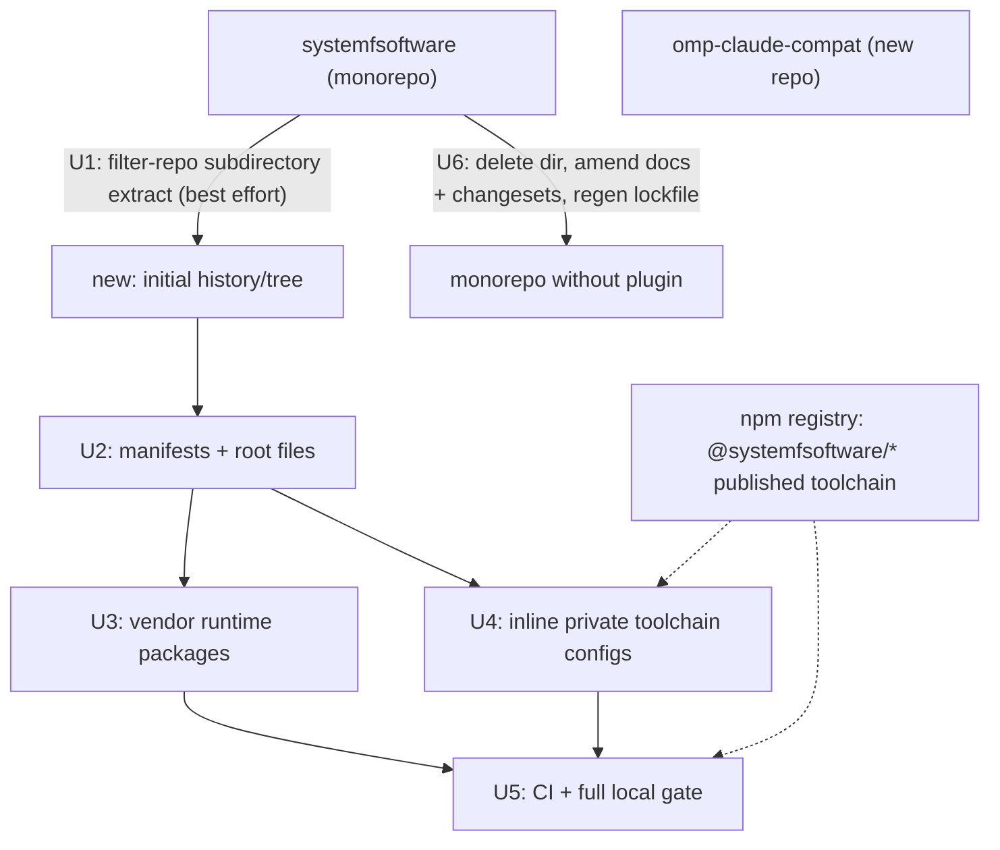

# Extract omp-claude-compat to a standalone repo - Plan

**Target repos:** this document lives in `systemfsoftware` (the removal repo). Work spans two repositories:

- `systemfsoftware` — this repo; the plugin is deleted here.
- `systemfsoftware/omp-claude-compat` — greenfield; the plugin is re-homed here. Paths below prefixed `new:` belong to that repo; all other paths are repo-relative to this repo.

---

## Goal Capsule

- **Objective:** npm and OMP plugin-loader consumers of `@systemfsoftware/omp-claude-compat` keep installing and upgrading with unchanged behavior.
- **Means:** re-home the extension in its own repository — copy the package verbatim into the new repo with standalone build/test/lint/mutation configs (KTD1–KTD4), delete it here, and amend live references (KTD5) so the monorepo carries no live trace.
- **Authority hierarchy:** `CONSTITUTION.md` > root `AGENTS.md` > `omp/plugins/AGENTS.md` > this plan.
- **Stop conditions:** stop and surface a blocker if `pnpm install` cannot resolve the published `@systemfsoftware/*` toolchain the standalone configs need, or if removal breaks a monorepo gate not covered by U6's amendment list.
- **Execution profile:** two repos; packaging/config plus doc amendments. Plugin source under `src/` and `tests/` is frozen — no behavior changes.
- **Tail ownership:** the executor owns verification in both repos; shipping owns pushes and PRs.

---

## Product Contract

### Summary

Move `omp/plugins/omp-claude-compat` out of this monorepo into `systemfsoftware/omp-claude-compat` as a standalone single-package repo. Preserve the npm name and version line, vendor the two private runtime dependencies, inline the private toolchain configs, and delete the plugin here with live docs and changeset intents amended.

### Problem Frame

The plugin was incubated inside this monorepo as one of three OMP plugins. It is a leaf: a repo-wide scan found zero imports of `@systemfsoftware/omp-claude-compat` outside its own directory (no package manifest, script, or test consumes it). Of its 18 `@systemfsoftware/*` workspace dependencies, 13 are published on npm at versions identical to this tree; the remaining 5 are private (recon evidence: `omp/plugins/omp-claude-compat/package.json`, `pnpm-workspace.yaml`, npm registry checks 2026-09-09). Its release cadence is coupled to this repo's pnpm-native release flow, and its docs live in this repo's package table. A standalone repo decouples ownership and release while npm identity continuity protects installed users.

### Requirements

**Extraction**

- R1. `new:` contains the full plugin — every file under `omp/plugins/omp-claude-compat` (source, tests, configs, README, LICENSE) — with `src/` and `tests/` byte-identical; deltas are limited to the declared manifest/config/root adaptations in U2–U4, plus any test deleted under KTD6's admission gate.
- R2. npm identity survives: package name stays `@systemfsoftware/omp-claude-compat`, version continues from 5.0.0 with the first publish no lower than 5.0.1, and a fresh clone of `new:` passes `pnpm install`, build, typecheck, test, and lint.
- R3. The private runtime dependencies `omp-runtime` and `harness-toml` are vendored into `new:` and keep working; they stay in this monorepo untouched (`omp/plugins/omp-agent-discipline` still consumes them).

**Removal**

- R4. This monorepo carries no live trace of the plugin: `omp/plugins/omp-claude-compat/` deleted; `README.md` package row removed; `omp/plugins/AGENTS.md` example command re-pointed; the two `CONCEPTS.md` mentions re-homed; the `systemfsoftware.toml` comment updated.
- R5. No pending `.changeset/*.md` intent names `@systemfsoftware/omp-claude-compat`, so the next `pnpm version -r` cannot hit a missing-package intent.
- R6. Historical records stay byte-identical: `docs/plans/**`, `docs/solutions/**`, `docs/residual-review-findings/**`, `.changeset/ledger.yaml`, `.changeset/changelogs/**`.
- R7. Monorepo gates stay green after removal: `pnpm install` regenerates the lockfile cleanly, turbo build/typecheck/test/lint pass over the remaining workspace, and mutation discovery plus the changeset guard behave unchanged for surviving packages.

### Key Decisions

- KD1. **Clean cutover — no shim, stub, or deprecated re-export.** (session-settled: user-directed — chosen over leaving a deprecation stub: the objective says "rip out"; the zero-consumer scan means a stub protects no one.) Governs R4.
- KD2. **npm identity and version continuity.** The version line continues from 5.0.0 rather than resetting: npm serves `@systemfsoftware/omp-claude-compat` up to 5.0.0, and a reset would offer installed plugins a downgrade. The carried 5.0.0 in the new manifest is the continuity floor, not a publishable version — npm rejects re-publishing an existing version, so the new repo's first publish must bump to 5.0.1 or higher. Governs R2. A wiki-banded market-test doctrine ("a standalone package with near-zero standalone adoption should fold into the monorepo") flags extraction as usually market-losing; the user's direction overrides it here, and OMP's plugin loader consumes the npm tarball by construction, so standalone is the consumed form.

### Scope Boundaries

- **Out of scope (non-goals):** changes to `omp-agent-discipline` or `omp-typescript-discipline` beyond lockfile and docs fallout; `CONCEPTS.md` edits beyond the two plugin mentions; modifications to vendored runtime source.
- **Deferred to follow-up work:** npm publish/release automation for `new:` (OIDC provenance, tag tooling) — the new repo releases manually at first; git-history backfill beyond KTD3's best effort; api-extractor contract surface.

### Success Criteria

- A clean clone of `new:` installs, builds, typechecks, tests, and lints green with no monorepo checkout present.
- `diff -r` between `omp/plugins/omp-claude-compat` at the removal commit and `new:`'s package tree shows zero differences outside the declared adaptation files (the U2–U4 lists, plus any test deleted under KTD6's admission gate).
- This repo's remaining workspace passes its turbo gates on the removal branch, and `scripts/tools/plan-release.mjs` still resolves a release phase without erroring on intents.

---

## Planning Contract

### Key Technical Decisions

- KTD1. **Vendor the two private runtime packages as private workspace members of `new:`** (source byte-identical; manifests adapted per U3 as declared deltas), keeping their `@systemfsoftware/omp-runtime` and `@systemfsoftware/harness-toml` names so plugin imports stay byte-identical. Both are npm-404 and private (`"private": true`), and both are consumed by `omp/plugins/omp-agent-discipline` here — so they cannot be ripped out of the monorepo, and renaming imports would churn every source file for zero behavior. Their combined source is 178 lines across 8 files (`omp/packages/harness-toml/src/`, `omp/packages/omp-runtime/src/`).
- KTD2. **Published toolchain from npm; private toolchain inlined.** Consume from npm at current tree versions: `@systemfsoftware/tsconfig` (1.3.3), `stryker-js-cli` (6.0.0), `stryker-js-typescript-checker` (5.0.0), `stryker-js-vitest-runner` (4.0.0), `stryker-plugins` (3.0.0), `stryker-test-contribution` (2.0.0), `effect-gherkin-spec` (4.0.1), `effect-memfs` (1.3.4), `effect-schema-law` (2.0.2), `effect-schema-vite` (2.0.3), `oxlint-plugin-cell-vocabulary` (2.0.1), `effect-cell-types` (6.0.1), `arethetypeswrong-cli`. Replace every `catalog:`/`catalog:peers`/`workspace:^` specifier that points at this monorepo with its literal value from `pnpm-workspace.yaml` and the owning manifests (`effect` peer: `^4.0.0-rc.112`; `@oh-my-pi/pi-coding-agent`: `^17.0.5`); intra-`new:` `workspace:^` links between the vendored members and the root package are retained (KTD1). Inline as standalone equivalents: `@systemfsoftware/tsdown-config/eager-entry-budget`, `@systemfsoftware/vitest-config` sharedConfig, `@systemfsoftware/oxlint-config/strict` essentials, and the root `stryker.config.base.json` resolved into one complete `new:/stryker.config.json`. Keep `inlinedDependencies` verbatim. Fallback: if the published `@systemfsoftware/tsconfig` does not export `tsc/no-dom/library-monorepo`, inline its resolved `compilerOptions` into `new:/tsconfig.json`.
- KTD3. **History transplant is best-effort, never load-bearing.** Seed `new:` by running `git filter-repo --subdirectory-filter omp/plugins/omp-claude-compat` in a fresh clone of this monorepo, then pushing to the new repo's remote; install `git-filter-repo` (pip) if absent. Path-filtered history captures only commits at the current path — declared limitation; this repo retains full history either way. Fallback: fresh initial commit carrying the tree.
- KTD4. **New-repo CI: one GitHub Actions workflow** (install, build, typecheck, test, lint) on push and PR, pnpm via corepack mirroring this repo's action pins. Release/publish automation deferred per Scope Boundaries.
- KTD5. **Removal mechanics here.** Delete `omp/plugins/omp-claude-compat/`; regenerate the lockfile with `pnpm install`; amend live surfaces: `README.md` packages-table row; `omp/plugins/AGENTS.md` example command re-pointed at `@systemfsoftware/omp-agent-discipline`; `CONCEPTS.md` "Context file" avoid-note and "Injected ref" definition re-worded to name the extension's new home instead of implying a monorepo package; `systemfsoftware.toml` `no_inject_refs` comment updated to name the plugin's new repository. Amend the nine pending changeset intents that name the package (`debut-releases-gain-oidc`, `effect-rc112`, `executors-as-descriptions`, `modern-ends-know`, `package-landing-pages`, `projections-collapsed-into-ports`, `schema-filters-gain-constructive-candidates`, `workflow-brand-forced`, `workflow-constructor-consumers`): strip the `"@systemfsoftware/omp-claude-compat"` front-matter entry; delete a file whose front matter becomes empty; remove prose that describes only the plugin. The turbo `omp/**` input globs stay — surviving plugins match them.
- KTD6. **Test posture: no new tests.** The migrated suite is preserved verbatim. Its gherkin/integration tests pass the in-process admission gate as provider-swapped composition tests — process and filesystem boundaries arrive as injected Effect layers (e.g. `MemoryFileSystem`, stub `ChildProcessSpawner` in `tests/hooks/__fixtures__/`), no test spawns a child process; if execution proves otherwise, that test is refused and deleted with its export hatch purged, overriding this plan. The property suite keeps its Stryker mutation gate (100 killed-or-disposed) through the standalone `stryker.config.json`. Build/typecheck/lint/smoke-load are command-level verification, not tests; packaging/config units carry `Test expectation: none`.

### Assumptions

- The published `@systemfsoftware/tsconfig` exposes the `tsc/no-dom/library-monorepo` export (fallback defined in KTD2).
- npm publish rights and provenance settings for the new repo are account-level, deferred with release automation.
- The migrated gherkin fixtures inject every boundary as an Effect layer (no hidden real-process spawn) — verified during U5 execution.

**Destructive review record.** Lens: Inversion (every "no break" claim assumed false; matched to the recon verdict that the blast radius is silent gate-coverage loss, not hard failure). Assumptions attacked: (1) filter-repo yields complete history — killed: path-filtered extraction captures only current-path history; remediated as best-effort in KTD3. (2) npm availability equals workspace equivalence — killed for private configs; remediated by KTD2's inline set and tsconfig fallback. (3) gate removal is inert — killed once: unamended changeset intents would break the next release cycle, not this PR; remediated as R5/KTD5.

### High-Level Technical Design

---

## Implementation Units

### U1. Seed the new repo

- **Goal:** `new:` contains the plugin tree exactly as it exists here.
- **Requirements:** R1
- **Dependencies:** none
- **Files:** `new:` repo root (currently an empty clone with `origin` set)
- **Approach:**
  1. Fresh-clone this monorepo to a scratch path; run `git filter-repo --subdirectory-filter omp/plugins/omp-claude-compat` (KTD3); push to `new:`'s remote as `main`.
  2. If the tool cannot be installed, init `main` with a single commit of a plain copy of `omp/plugins/omp-claude-compat/**`.
  3. Verify the resulting tree against the source directory.
- **Patterns to follow:** plain copy preserves file modes; no transform during extraction.
- **Test scenarios:** `Test expectation: none -- extraction is verified by the diff check below, not by tests.`
- **Verification:** `diff -r omp/plugins/omp-claude-compat <new-clone>/` reports no differences (excluding `.git`).

### U2. Standalone manifests and root files

- **Goal:** `new:` is a self-describing single-package repo that pnpm can install.
- **Requirements:** R1, R2
- **Dependencies:** U1
- **Files:** `new:/package.json`, `new:/pnpm-workspace.yaml`, `new:/.gitignore`, `new:/README.md`, `new:/LICENSE` (carried), `new:/package.json` `repository` field
- **Approach:**
  1. `package.json`: keep name, version 5.0.0 (KD2), exports, `files`, `omp` block, `publishConfig`, `inlinedDependencies`; replace `repository.url` with the new repo and drop `directory`; rewrite dependency specifiers per KTD2; keep devDependencies that have a standalone role (published toolchain, `effect-gherkin-spec`, `effect-memfs`, `effect-schema-vite`, `oxlint-plugin-cell-vocabulary`, stryker set, tsconfig, `@types/node`, vitest stack, oxlint, tsdown, rimraf, typescript, effect stack) and drop monorepo-only workspace entries replaced by npm or inlined equivalents.
  2. `pnpm-workspace.yaml`: members `packages/*` (vendored runtime) plus the root package; a minimal `catalog` only if shared pins are needed — prefer literals.
  3. README: adapt install/usage sections to the new repo; fix or drop the dead `etc/omp-claude-compat.api.md` link (declared delta).
- **Test scenarios:** `Test expectation: none -- packaging; proven by the install gate.`
- **Verification:** `pnpm install` in `new:` resolves with no workspace/404 errors.

### U3. Vendor the private runtime packages

- **Goal:** `omp-runtime` and `harness-toml` exist inside `new:` under their own names.
- **Requirements:** R3
- **Dependencies:** U2
- **Files:** `new:/packages/omp-runtime/**`, `new:/packages/harness-toml/**` (copied from `omp/packages/omp-runtime`, `omp/packages/harness-toml`)
- **Approach:**
  1. Copy both packages verbatim (source byte-identical); adapt each vendored manifest as a declared delta: set `"private": true`, replace `catalog:` specifiers with literals (`@std/toml` → `jsr:^1.0.11`), replace `workspace:^` specifiers on published packages with npm literals (`@systemfsoftware/tsconfig` 1.3.3, `effect-gherkin-spec` 4.0.1, `effect-memfs` 1.3.4), replace the `effect` peer with `^4.0.0-rc.112`, and drop the `@systemfsoftware/oxlint-config` devDependency (private, never published; its strict config is inlined at the root by U4 — `new:` typechecks the vendored members but does not lint them).
  2. Do not rename imports in plugin source (KTD1).
- **Test scenarios:** `Test expectation: none -- covered by typecheck through the plugin's imports.`
- **Verification:** `pnpm install` in `new:` resolves the adapted vendored manifests with no 404 or unresolved-workspace errors; typecheck resolves `@systemfsoftware/omp-runtime` and `@systemfsoftware/harness-toml` to the vendored members.

### U4. Standalone toolchain configs

- **Goal:** build, test, lint, and mutation configs that need no monorepo checkout.
- **Requirements:** R2
- **Dependencies:** U2 (may run in parallel with U3 — disjoint files)
- **Files:** `new:/tsconfig.json`, `new:/tsconfig.build.json`, `new:/tsdown.config.ts`, `new:/vitest.config.ts`, `new:/oxlint.config.ts`, `new:/stryker.config.json`
- **Approach:**
  1. `tsconfig.json`: extend `@systemfsoftware/tsconfig/tsc/no-dom/library-monorepo` from npm; keep local overrides (`noEmit`, `types`, `customConditions`, language-service plugin). Apply KTD2's fallback if the export is absent.
  2. `tsconfig.build.json`: extend the adapted `./tsconfig.json`, flip emit on, include `src`, exclude tests — mirroring the source file; the KTD2 tsconfig fallback applies transitively; `pnpm build` must emit declarations through it.
  3. `tsdown.config.ts`: port the used surface of `tsdown-config/eager-entry-budget` (budget check + alwaysBundle list) inline; entry, format, minify, devExports unchanged.
  4. `vitest.config.ts`: inline the sharedConfig essentials this package's tests rely on (node env, globals, include patterns `tests/**/*.test.ts` + `src/**/*.property.test.ts` + `src/**/schema-laws.test.ts`, coverage, `resolve.conditions: ['@systemfsoftware/source']` so tests resolve source not dist); keep `inlineSchemaTests` from published `effect-schema-vite`.
  5. `oxlint.config.ts`: standalone config carrying the effective strict rules the code already satisfies, plus the cell-vocabulary plugin from npm; relax in `tests/` as today.
  6. `stryker.config.json`: resolve root `stryker.config.base.json` + the plugin's overrides into one complete file (mutate glob, thresholds 100, ignorer plugins from npm).
- **Patterns to follow:** the current package configs (`omp/plugins/omp-claude-compat/*.config.*`, `stryker.config.json`).
- **Test scenarios:** `Test expectation: none -- config; proven by the gate commands.`
- **Verification:** `pnpm build`, `pnpm typecheck`, `pnpm test`, `pnpm lint`, `pnpm mutation` all green in `new:` with no monorepo path on disk.

### U5. New-repo CI and full local gate

- **Goal:** pushes to `new:` are gated; every gate proven locally.
- **Requirements:** R2
- **Dependencies:** U3, U4
- **Files:** `new:/.github/workflows/ci.yml`
- **Approach:** single workflow: checkout, corepack/pnpm setup mirroring this repo's action versions, `pnpm install`, build, typecheck, test, lint on push + pull_request. Execute the U4 verification once more from a pristine clone to satisfy R2's clean-clone criterion; smoke-load `dist/index.js` to confirm the extension registers handlers.
- **Test scenarios:** `Test expectation: none -- CI scaffolding; verified by workflow run + local gates.`
- **Verification:** local gates green from pristine clone; workflow syntax valid; dist smoke load reports the registered handler set.

### U6. Remove the plugin from the monorepo

- **Goal:** no live trace of the plugin here; gates green; release flow unbroken.
- **Requirements:** R4, R5, R6, R7
- **Dependencies:** none technically (separate repo); sequenced after U5 so the re-home is proven before deletion lands
- **Files:** `omp/plugins/omp-claude-compat/` (delete); `README.md`; `omp/plugins/AGENTS.md`; `CONCEPTS.md`; `systemfsoftware.toml`; the nine changeset intents listed in KTD5; `pnpm-lock.yaml` (regenerated)
- **Approach:**
  1. Delete the plugin directory.
  2. Amend the live surfaces per KTD5 (README row, AGENTS example, CONCEPTS wording, toml comment).
  3. Amend the nine changeset intents: strip the package entry, delete emptied files, remove plugin-only prose (R5).
  4. Touch nothing under `docs/plans/`, `docs/solutions/`, `docs/residual-review-findings/`, `.changeset/ledger.yaml`, `.changeset/changelogs/` (R6).
  5. `pnpm install` to regenerate the lockfile.
- **Patterns to follow:** doc amendments mirror how this repo updated docs when `omp-utils` consolidated into `omp/packages/*` (plan-recorded precedent).
- **Test scenarios:** `Test expectation: none -- removal; verified by the gate matrix below.`
- **Verification:** turbo build/typecheck/test/lint green over the remaining workspace; grep for `omp-claude-compat` across live surfaces returns only the historical set (docs/plans, docs/solutions, ledger, changelogs); `node scripts/tools/plan-release.mjs` exits without error.

---

## Verification Contract

| Repo   | Gate            | Command                                                  | Proves                                                                       |
| ------ | --------------- | -------------------------------------------------------- | ---------------------------------------------------------------------------- |
| `new:` | Install         | `pnpm install`                                           | Dependency graph resolves without monorepo checkout (R2)                     |
| `new:` | Build           | `pnpm build`                                             | Standalone tsdown config + vendored runtime bundle into `dist/` (KTD1, KTD2) |
| `new:` | Types           | `pnpm typecheck`                                         | Published tsconfig + vendored members type-resolve                           |
| `new:` | Tests           | `pnpm test`                                              | Migrated suite green unmodified (R1, KTD6)                                   |
| `new:` | Mutation        | `pnpm mutation`                                          | Mutation gate holds at 100 killed-or-disposed on `src/**/*.workflow.ts`      |
| `new:` | Lint            | `pnpm lint`                                              | Standalone oxlint config accepts the code                                    |
| `new:` | Smoke           | load `dist/index.js` via the plugin smoke runner         | Extension registers its handler set                                          |
| `new:` | Clean clone     | repeat install/build/test from a pristine clone          | R2's clean-clone criterion                                                   |
| here   | Install         | `pnpm install`                                           | Lockfile regenerates without the removed package (R7)                        |
| here   | Workspace gates | `pnpm build`, `pnpm typecheck`, `pnpm test`, `pnpm lint` | Remaining workspace green (R7)                                               |
| here   | Release flow    | `node scripts/tools/plan-release.mjs`                    | No intent names a missing package (R5)                                       |
| here   | Live-trace grep | grep `omp-claude-compat` outside historical dirs         | R4, R6                                                                       |

---

## Definition of Done

**Global**

- Both repos verified against every R: the verification table above run in full, this session, on the final trees.
- `new:` pushed with CI workflow present; this repo's removal branch pushed; PRs open per the shipping step.
- Cleanup: no scratch clones, no throwaway scripts, no commented-out debris in either diff; the plan's declared deltas are the only source differences between old and new package trees.

**Per unit**

- U1: diff check clean; history transplant state recorded in the PR body (transplanted vs fresh).
- U2: install resolves; manifest specifiers contain no `catalog:`/`workspace:` references to this monorepo.
- U3: typecheck resolves vendored specifiers; vendored sources byte-identical to `omp/packages/*`.
- U4: every config in U4's Files list exercised by its gate; tsconfig fallback applied only if the published export is absent (state which path was taken).
- U5: workflow file valid; pristine-clone gate run observed.
- U6: gate matrix green; the nine intents amended; historical records untouched (`git diff --stat` shows zero changes under them).
