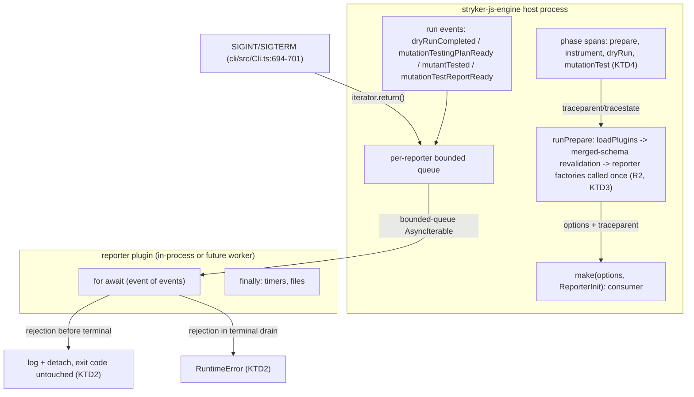

# Reporter Pull-Stream Protocol - Plan

## Goal Capsule

- **Objective:** A reporter plugin author writes a plain factory against the published protocol with no `effect` dependency and no host service handles; the host validates reporter options before any test runs; cancelling a run closes every reporter stream. A consumer outside the process can still run the CLI and read the same reports and exit codes as before.
- **Means:** Pull-stream reporter ABI over `AsyncIterable` with a Standard Schema event contract (KD1, KD2, KTD1-KTD6).
- **Authority:** Issue #372 acceptance criteria (R1-R8) govern product behavior; this plan's KTDs govern mechanism. Conflict on product behavior: the R wins.
- **Execution profile:** Headless pipeline (LFG). No interactive confirmation. Verification is command-gated (see Verification Contract).
- **Stop conditions:** Any R unmet at verification, or `pnpm check:local` red at last edit, blocks completion.
- **Tail ownership:** Commit/push/PR/CI watch owned by the shipping phase, not this document.

---

## Product Contract

### Summary

Replace the in-process reporter plugin surface — today five `Effect`-returning methods (`ReporterService`, `packages/stryker-js/stryker-js/src/Reporter.ts:70-79`) fed through a Layer that carries host `FileSystem`/`Path` services — with a pull-stream protocol: a reporter exports a factory that receives validated options plus W3C trace context and returns an async event consumer. The event protocol is a four-kind tagged union exported from `@systemfsoftware/stryker-js` as a `StandardSchemaV1` object. Built-in reporters are rewritten as factory consumers. Failure containment, bootstrap validation timing, and exit-code semantics are pinned to today's user-visible behavior except where R7 states the delta.

### Problem Frame

Reporters are dynamically imported into the host and receive live host Effect services, coupling every reporter to the host's exact Effect runtime and blocking CLI dependency bundling. Checkers and test runners already cross schema-typed RPC boundaries; reporters do not. The operator settled the replacement design in issue #372 and #376: reporters become protocol consumers, ignorers become data (issue #376, out of scope here).

### Requirements

Plugin protocol:

- R1. `@systemfsoftware/stryker-js` exports `ReporterEventSchema` as a `StandardSchemaV1<unknown, ReporterEvent>` object; `ReporterEvent` is a closed four-kind union — `dryRunCompleted`, `mutationTestingPlanReady`, `mutantTested`, `mutationTestReportReady` — and `ReporterEvent` is inferrable from the export and events validatable via `ReporterEventSchema['~standard'].validate` (issue AC1, AC2).
- R2. The host initializes every reporter via its factory after config validation and before the dry run; invalid reporter options or an unknown reporter name fail at bootstrap with exit class `ConfigError` (issue AC3; gap I5).
- R3. The host delivers events to each reporter as an ordered `AsyncIterable`; end-of-iterable is completion; a consumer returning early is graceful; backpressure is the pull itself (issue AC4).
- R4. Cancelling a run (SIGINT/SIGTERM) invokes `iterator.return()` on every active reporter iterable (issue AC5).

Built-ins and boundary:

- R5. Built-in reporters (`json`, `clear-text`, `progress`, `progress-stream` in the engine; `html` in `stryker-js-html-reporter`) are statically composed factory consumers; the reporter plugin contract carries no host Effect services — a reporter does its own I/O through its own imports (issue AC6; Q8).
- R6. W3C `traceparent`/`tracestate` propagate across the boundary: the host forwards them at factory init; a plugin may start spans sharing the host trace IDs without sharing a Tracer instance; the host emits one span per phase/batch; no mutant diffs, source code, or file contents appear in span attributes (issue AC7, AC8).

Behavior preservation and gates:

- R7. Failure containment is preserved: a reporter consumer rejection before the terminal report phase is logged and that reporter is detached without changing the exit code; the host's own report-computation failure keeps today's fatal `RuntimeError` path (gaps C1, I2, I3).
- R8. `pnpm --filter @systemfsoftware/stryker-js-cli test:contract` exits 0 after the cutover (issue AC9).

### Key Decisions

- KD1. Reporters consume a pull stream; the factory is `make(options) => (events: AsyncIterable<ReporterEvent>) => Promise<void>`. Governs R1, R3, R4. (session-settled: user-directed — chosen over a per-event callback API: the language's pull primitive yields completion, failure, cancellation, and backpressure for free.)
- KD2. The event contract is exported as a Standard Schema, not a raw Effect Schema type. Governs R1. (session-settled: user-approved — chosen over an Effect-typed export: any TypeScript validation library can consume it with zero `effect` dependency on the plugin side; Effect Schema remains the RPC wire format.)
- KD3. In-process transport is the default; an out-of-process Effect-RPC worker is an opt-in crash-containment tier around the same ABI. Governs R5. (session-settled: user-approved — chosen over worker-only: uniformity of contract; the transport is a per-kind cost decision.)

### Scope Boundaries

- Deferred to follow-up work: the out-of-process worker transport implementation. The issue marks it "optional"; no acceptance criterion tests it; the ABI and host plumbing are built transport-agnostic so it can wrap the same `AsyncIterable` without protocol change (KD3).
- Outside this change: ignorer plugins (issue #376 collapses them to rule data); the `--llms` manifest (deleted in #375); any new OTel SDK exporter or collector wiring (R6 is propagation + spans only).

---

## Planning Contract

### Key Technical Decisions

- KTD1. Wire payloads are reduced to what consumers read: `dryRunCompleted` carries timing, capabilities, and test metadata without `mutantCoverage`; `mutationTestingPlanReady` carries the plan count plus reduced descriptors (`mutantId`, `plan`, `netTime`, `reloadEnvironment`); `mutationTestReportReady` carries the full report with sources plus metrics. The built-ins read exactly these fields today (`packages/stryker-js/stryker-js-engine/src/Reporter.ts` `handleDryRunCompleted`/`handleMutationTestingPlanReady`); the full `DryRunResult` coverage map and full `RunPlan.runOptions` never cross the boundary. Breaking for third-party reporters: the changeset enumerates every dropped field — `mutant.{fileName, location, mutator, replacement}` and `runOptions.{testFilter, hitLimit, activeMutant, mutantActivation, sandbox}` — so affected plugin authors can grep for impact. Acceptable pre-1.0 (REPO-R1).
- KTD2. Containment is host policy over the raw ABI, with three classified failures. Per reporter the host keeps a state cell (a `Ref`) that the emitter sets when it offers the terminal `mutationTestReportReady` event: (1) a consumer rejection read from a state cell not yet terminal is logged and that reporter detached — exit code untouched, other reporters unaffected; (2) a rejection read from a terminal state cell (terminal drain) maps to exit class `RuntimeError`, injected as a terminal-drain field on `RunOutcome` that exit classification takes the max of alongside `determineExitCode`'s verdict; (3) a host-side report-computation failure (`mutationTestReport`, `calculateMutationTestMetrics`) throws synchronously before any terminal offer and maps to `RuntimeError` directly, matching today's unguarded call inside `reportAll` (`packages/stryker-js/stryker-js-engine/src/Reporter.ts:1796`). The settled "throw = failed run" sentence (KD1) holds for the bare stream; the host is the failure classifier, matching today's `catchCause` wrapping.
- KTD3. Bootstrap builds the reporter layer exactly once, in `runPrepare` after `loadPlugins` and after unconditional merged-schema revalidation of reporter options (today the layer builds twice, `packages/stryker-js/stryker-js-engine/src/Run.ts:605` and `:863`, and revalidation is conditional, `Run.ts:403-411`). Unknown-name validation runs against the configured reporter names the user typed (pre-`selectReporters`), so the `ConfigError` names the offending configured name; factory invocation uses the post-rewrite list (`selectReporters` rewrites `progress-stream` to `clear-text` in human mode and appends it in machine mode). Today an unknown name is silently dropped at the `selected` filter (`packages/stryker-js/stryker-js/src/Plugin.ts:117-120`).
- KTD4. Trace context: host depends on `@opentelemetry/api` only (API, no SDK, no exporter). The host creates one span per phase (prepare, instrument, dryRun, mutationTest) and per mutant batch, attributes carry counts and identifiers only. The factory init argument carries `traceparent`/`tracestate` strings — taken from the active span context when an SDK is registered, else from `process.env.TRACEPARENT`/`TRACESTATE`, else absent. SDK registration is the embedding application's responsibility by design (API-first OTel): a plugin author who registers an SDK and starts spans from the init context joins the host trace; skipping registration yields non-recording spans and orphan traces by design, documented as expected behavior. Verification registers an SDK in tests only (dev dependency).
- KTD5. `ReporterEvent` is a distinct vocabulary from the machine-stream `RunEvent` (`packages/stryker-js/stryker-js/src/Run.schema.ts`): in-process plugin ABI versus on-the-wire machine stream. An internal host callback bus with the `AsyncIterable` only at the plugin edge was considered and rejected: it duplicates every event dispatch path and ties the machine-stream wire format's evolution to the plugin ABI's. The alphabets stay separate; a test pins the intentional field overlap so a future collapse fails loudly. The protocol carries a version constant following the `STREAM_SCHEMA_VERSION` precedent, placed now because KD3's worker transport is the boundary consumer it versions — in-process it is inert.
- KTD6. Clean cutover (CONST-S4): `ReporterService` and both `broadcastReporter` exports are deleted, not shimmed; `checkpoint` stays an internal `MutationReportingService` write (host persistence, not a reporter event) and per-mutant progress is carried by `mutantTested` counters (`completed`/`total`, the `RunEvent` shape); `wrapUp` is replaced by end-of-stream, with built-ins moving timer/file cleanup into `finally` blocks.

### High-Level Technical Design

Sequence per run: bootstrap calls each factory once → the host feeds a bounded queue per reporter → the consumer drives `for await` (backpressure is the pull) → end-of-iterable completes the reporter → the host awaits consumers' terminal drain before exit-code classification.

### Assumptions

Recorded from headless scoping and a destructive-review pass (lens: Edge-First, first cycle). A1-A3 are the three assumptions that pass surfaced, each with its warrant and break attempt outcome; A4-A5 came from headless scoping.

- A1. The contract is publishable and backward-stable as a versioned Standard Schema export; plugins depend only on published surface (project wiki plugin axioms A2/A5/A6, canon). Break attempt: the vendored adapter does not populate runtime `types` (`repos/effect/packages/effect/src/Schema.ts:1338-1345` assigns only `version`/`vendor`/`validate`) — survives with the wrapper contract pinned: the export is an explicitly annotated `StandardSchemaV1<unknown, ReporterEvent>` wrapper whose TypeScript face carries the inference through the declared generics; at runtime it exposes exactly `version`/`vendor`/`validate`, so JS-only inference tools reading `~standard.types` see `unknown` — out of scope for the pre-1.0 contract, stated here so no consumer assumes otherwise.
- A2. Host and plugin spans can share trace IDs across the boundary with only `@opentelemetry/api` and a forwarded `traceparent`, no shared Tracer or SDK (opentelemetry.io propagation docs; W3C Trace Context). Break attempt: with no SDK registered, API-only spans are non-recording and carry no trace IDs — survives narrowed: trace-ID sharing is real only when an SDK is registered by the embedding application, which is exactly how API-first OTel works; tests register an SDK to verify.
- A3. Consumer-driven pull transfers failure recovery into the consumer; host-side per-event "log and keep feeding" is not implementable under pull (a consumer whose `for await` body threw has exited its loop). Kill: the research default "a non-fatal event delivery that throws is logged and the iterator continues" is incoherent under pull. Replaced by KTD2's state-tracked containment, which preserves today's user-visible behavior (R7) with bounded blast radius (project wiki plugin axiom A10, canon).
- A4. Liveness stays bounded by signal-only interruption; a hung consumer can still hang the process. This equals today's exposure (a hung `wrapUp` hangs the process); no watchdog is added.
- A5. Unknown-reporter-name and payload-reduction behavior changes are accepted product deltas (R2, KTD1), operator-visible in the changeset.

### Risks and Dependencies

- The engine `Run.ts` reporter call sites are load-bearing for exit-code behavior (`classify-run-outcome.workflow.ts` maps classes); regressions surface in the contract lane.
- `@opentelemetry/api` is a new direct dependency of the engine and a types-only reference in the contract package; it has no transitive dependencies.
- Vendored Effect (`repos/effect/packages/effect/src/Schema.ts:1299-1347`) is the authority for the Standard Schema adapter behavior; the effect catalog pin (4.0.0-rc.112) must expose the same shape.

### Sources and Research

- Issue #372 (goal spec, acceptance criteria) and the settled plugin-ABI decisions recorded with the operator (#372 rewritten, #376 filed).
- `packages/stryker-js/stryker-js/src/Reporter.ts:70-99` (service interface, duplicate broadcast), `src/Plugin.ts:117-120, 115-166` (silent unknown-name filter at the `selected` filter, fan-out, `concurrency: 'unbounded'`), `src/Reporter.schema.ts:5-11` (event-name literals), `src/Plugin.schema.ts:10-20` (`PluginContribution` layer typed `S.Unknown`).
- `packages/stryker-js/stryker-js-engine/src/Run.ts:605, 767-771, 863, 953, 1017-1032, 1062` (layer builds, five lifecycle sites with their failure wrappers), `src/Reporter.ts:916, 966, 1017, 1137, 1556-1600, 1796, 1836-1844` (built-in factories, reporting service, unguarded report call, checkpoint), `src/builtin-reporters.ts` (static registration), `src/Config.ts:346-367` (generic dynamic import), `src/Plugins.ts:205-455` (loader), `src/WorkerProtocol.ts` (unary RPC precedent).
- `packages/stryker-js/stryker-js-cli/src/Cli.ts:640-650, 694-701` (plugin module injection, signal interrupt), `src/classify-run-outcome.workflow.ts` (exit classes), `tests/cli-contract.integration.test.ts` (contract lane).
- `packages/stryker-js/stryker-js-html-reporter/src/index.ts` (html as a separate registered plugin).
- Standard Schema interface and semantics: https://standardschema.dev/schema (validate contract, types-only `@standard-schema/spec`, Effect adapter listed since v3.13.0).
- OpenTelemetry propagation: https://opentelemetry.io/docs/languages/js/propagation/ (manual propagation, traceparent, cross-process span correlation).
- Project wiki plugin axioms A2/A5/A6 (contract explicit, versioned, backward-stable) and A10 (blast radius bounded, isolation matches trust) — canon-warrant.

---

## Implementation Units

### U1. Reporter event contract in the public package

- **Goal:** The protocol exists as published, effect-free-to-consume surface: schema, Standard Schema export, factory type, trace-context init type, version constant.
- **Requirements:** R1; advances R6 (init type). Cites KD1, KD2, KTD1, KTD5.
- **Dependencies:** none.
- **Files:** `packages/stryker-js/stryker-js/src/ReporterEvent.schema.ts` (new), `packages/stryker-js/stryker-js/src/Reporter.schema.ts` (event literals replaced by the protocol's kind union), `packages/stryker-js/stryker-js/src/Reporter.ts` (payload event types move or re-export), `packages/stryker-js/stryker-js/src/Plugin.schema.ts` (reporter contribution shape loses the host-service Layer), `packages/stryker-js/stryker-js/tsdown.config.ts` (exports via config only — REPO-S4).
- **Approach:** Define the four events as `S.TaggedClass` variants with the reduced payloads of KTD1; build `ReporterEventSchema` via `Schema.toStandardSchemaV1` and wrap it so the exported face is `StandardSchemaV1<unknown, ReporterEvent>` only (no effect-typed surface leaks). Export `ReporterFactory` and `ReporterInit` (`options`, `traceparent?`, `tracestate?`) as types. Add the protocol version constant. Mirror `Run.schema.ts` naming conventions.
- **Patterns to follow:** `packages/stryker-js/stryker-js/src/Run.schema.ts` (versioned schema union).
- **Test scenarios:**
  - Property: for generated events, `ReporterEventSchema['~standard'].validate` agrees with `Schema.decodeUnknown` — success value deep-equal, issue paths non-empty on rejection (independent-oracle pin; CONST-T10).
  - Property: `validate` result matches the Standard Schema `Result` shape — `issues?: undefined` exactly on success, `value` present only on success.
  - Scenario: `dryRunCompleted` payload without `mutantCoverage` validates; a payload containing `mutantCoverage` is either rejected or stripped — assert the chosen refusal, since the wire contract forbids the field.
  - Scenario: unknown `_tag` event fails validation with non-empty issues whose message identifies the discriminator mismatch; naming the four valid kinds in the message is an implementation freedom (a custom `leafHook`), not a test requirement.
  - Test expectation for published types: the rollup declares `ReporterFactory` and `ReporterInit` with no `effect` types reachable from them — asserted by attw in CI, not a new test.
- **Verification:** `pnpm --filter @systemfsoftware/stryker-js test`; generated schema laws green.

### U2. Host stream plumbing, bootstrap, containment, trace spans (engine)

- **Goal:** The host feeds every reporter through a bounded per-reporter `AsyncIterable`, builds reporter factories once at bootstrap, contains consumer failures per KTD2, forwards trace context, and drops host-service coupling for reporters.
- **Requirements:** R2, R3, R4, R6, R7. Cites KD1, KD3, KTD2, KTD3, KTD4, KTD6.
- **Dependencies:** U1.
- **Files:** `packages/stryker-js/stryker-js-engine/src/ReporterStream.ts` (new: queue fan-out, consumer attach/track, terminal-drain classification, `iterator.return()` on interrupt), `packages/stryker-js/stryker-js-engine/src/Run.ts` (single bootstrap build; five lifecycle sites emit four stream events; phase/batch spans), `packages/stryker-js/stryker-js-engine/src/Plugin.ts` (fan-out replaced by stream attach; `PluginEnvironment` loses `FileSystem`/`Path` for reporters; unknown-name `ConfigError`), `packages/stryker-js/stryker-js-engine/src/Reporter.ts` (`ReporterService`/`MutationReportingService` reshaped onto the stream; `reportAll` computes report + metrics host-side; `checkpoint` stays internal), `packages/stryker-js/stryker-js-engine/src/Config.ts` and `src/Plugins.ts` only if loading needs the factory shape, `packages/stryker-js/stryker-js-engine/package.json` (`@opentelemetry/api` dependency).
- **Approach:** One bounded queue per selected reporter — per-reporter because the KTD2 state cell and detach semantics are per-consumer; a shared queue would couple terminal-event state across reporters. Emission runs on a forked drain fiber per reporter in the shape of the existing machine-stream driver (`packages/stryker-js/stryker-js-cli/src/Output.ts` queue → `Stream.fromQueue` → `Queue.end` → joined drain fiber), so a full queue blocks the forked emitter fiber, never the run loop that feeds mutant results; the bound is a named constant sized so normal json/html write latency cannot fill it. Each queue's async iterator is acquired as a scoped resource (`Effect.acquireRelease`, release calls `iterator.return?.()`) in the stage scope, so fiber interruption from the CLI signal path (`packages/stryker-js/stryker-js-cli/src/Cli.ts:694-701`) releases every iterator without a separate registry. Attach each consumer promise with the KTD2 state cell read in its rejection handler. Span attributes: counts, mutant IDs, phase names only.
- **Patterns to follow:** `Output.ts` queue→drain-fiber driver; `Run.schema.ts` versioned events; `Worker.schema.ts` crash identities; existing `Semaphore`-gated persistence.
- **Test scenarios:**
  - Scenario (composition, in-process): a run with two fake reporters — both receive `dryRunCompleted` before `mutationTestingPlanReady`, `mutantTested` events in mutant order, `mutationTestReportReady` last, then end-of-stream.
  - Scenario: a reporter whose consumer rejects on the first `mutantTested` is logged and detached; the other reporter still receives every event; exit code is unchanged (R7).
  - Scenario: a reporter rejecting during the terminal drain produces exit class `RuntimeError` (KTD2).
  - Scenario: interrupting the run fiber invokes `iterator.return()` on both reporters' iterators and a consumer yielding cooperatively between events observes the close (R4).
  - Scenario: unknown reporter name fails at bootstrap with exit class `ConfigError` before any test runs, naming the configured name (R2).
  - Scenario: consumer reading slowly does not lose events and does not stall the mutation loop — the forked emitter fiber blocks on the bounded queue while the run loop continues (R3, backpressure is the pull).
  - Scenario: `TRACEPARENT` set in the environment reaches the factory init verbatim; unset yields absent fields (R6).
  - Scenario: a fake reporter registering a test SDK, reading `traceparent` from `ReporterInit`, and starting a span produces a span whose trace ID equals the host phase span's trace ID (R6; KTD4).
- **Verification:** `pnpm --filter @systemfsoftware/stryker-js-engine test`.

### U3. Built-in reporters as factory consumers (engine four + html package)

- **Goal:** All five built-in reporters are plain factory consumers owning their own I/O.
- **Dependencies:** U1 for the html package slice; U2 for the engine-side factory cutover (U2 owns `stryker-js-engine/src/Reporter.ts`, so the four engine factory bodies land inside U2's work). Only the html package slice is parallelizable.
- **Files:** `packages/stryker-js/stryker-js-engine/src/Reporter.ts` (the four factory bodies — inside U2's file scope, so this unit's engine-side work lands inside U2's ownership; the standalone slice is the html package), `packages/stryker-js/stryker-js-html-reporter/src/index.ts`, `packages/stryker-js/stryker-js-html-reporter/src/Reporter.ts` (factory + `node:fs` for the element bundle and report write), `packages/stryker-js/stryker-js-html-reporter/package.json` (drop host-service usage).
- **Approach:** Each built-in keeps its output byte-identical (CONST-T9 pin before delete): clear-text/progress write to stdout, json/progress-stream/html write files via their own `node:fs`; timers move to `finally`; the html reporter reads its bundle from its own install. `selectReporters` name rewriting (progress-stream in machine mode) is observed by the factory via the post-selection name.
- **Patterns to follow:** existing factory bodies (`makeClearTextReporter` et al.) — same output logic, new consumption shape.
- **Test scenarios:**
  - Scenario: json reporter output for a fixed run is byte-identical to the pre-cutover output pinned against the published prior behavior (independent oracle: committed fixture, not generated from the new code).
  - Scenario: html reporter writes `index.html` plus report assets from a streamed run and never reads a host-provided path.
  - Scenario: progress reporter cleans up its interval when the stream ends early (early return) and when it is cancelled.
  - Test expectation for `selectReporters` mode rewriting: pinned by U4's CLI machine-mode suite re-pin; U3 carries no independent observable for it.
- **Verification:** `pnpm --filter @systemfsoftware/stryker-js-html-reporter test`; engine-side scenarios run under U2's filter.

### U4. Test surfaces and contract lane re-pin

- **Goal:** Every affected suite asserts the new ABI; the contract lane passes for the right reason.
- **Requirements:** R8; pins R2-R7 observables. Cites KTD2, KTD3, KTD5.
- **Dependencies:** U2, U3.
- **Files:** `packages/stryker-js/stryker-js/tests/` (schema/protocol suites), `packages/stryker-js/stryker-js-engine/tests/` (run/reporter suites — delete tests pinning the deleted service methods), `packages/stryker-js/stryker-js-cli/tests/cli-contract.integration.test.ts` (only its reporter-adjacent assertions move to the new observable behavior), `packages/stryker-js/stryker-js-cli/tests/` terminal-kind suites.
- **Approach:** No new process-spawning tests. The contract lane is the repo's existing process-level gate (CONCEPTS.md, contract lane); this unit updates its assertions where the ABI changed observable behavior and leaves its harness untouched. New coverage stays in-process: composition scenarios through the engine's public run API and property laws through the contract package's published exports.
- **Test scenarios:**
  - Scenario: machine-mode CLI run still emits the `RunEvent` stream unchanged while a reporter consumes `ReporterEvent` (KTD5 overlap pin).
  - Scenario: contract lane exit code 0 on a clean mutation run (R8).
  - Scenario: deleted `ReporterService`/`broadcastReporter` exports break no in-repo importer (compile gate).
- **Verification:** package test filters from Verification Contract; contract lane green.

### U5. Changeset and doctrine sweep

- **Goal:** Consumer-observable deltas ship in the release note; no stale doctrine remains.
- **Requirements:** REPO-R2; R1-R8 documentation surface.
- **Dependencies:** U4.
- **Approach:** Changeset body lists, consumer-observable only: new `ReporterEventSchema`/`ReporterFactory` exports, removed `ReporterService`/`broadcastReporter`, the reduced event payloads with every dropped field enumerated per KTD1 (`mutant.{fileName, location, mutator, replacement}`, `runOptions.{testFilter, hitLimit, activeMutant, mutantActivation, sandbox}`, `mutantCoverage`), unknown-reporter-name now a `ConfigError`, new `@opentelemetry/api` dependency. Bump class decided by the author-changesets gate at ship time.
- **Test scenarios:** Test expectation: none — release-intent and glossary edits only.
- **Verification:** `pnpm check:local` on the final tree.

---

## Verification Contract

| Gate             | Command                                                        | Applies to | Done signal                                                                             |
| ---------------- | -------------------------------------------------------------- | ---------- | --------------------------------------------------------------------------------------- |
| Local chain      | `pnpm check:local`                                             | final tree | exit 0 after last edit (REPO-D1)                                                        |
| Contract package | `pnpm --filter @systemfsoftware/stryker-js test`               | U1, U4     | laws + properties green                                                                 |
| Engine           | `pnpm --filter @systemfsoftware/stryker-js-engine test`        | U2, U3, U4 | composition scenarios green                                                             |
| Html package     | `pnpm --filter @systemfsoftware/stryker-js-html-reporter test` | U3         | output pins green                                                                       |
| Contract lane    | `pnpm --filter @systemfsoftware/stryker-js-cli test:contract`  | U4 (R8)    | exit 0                                                                                  |
| CI               | `gh pr checks --watch --fail-fast`                             | ship       | all green, mutation advisory report reviewed (REPO-D3: never start local mutation runs) |

Test-layer adjudication (choose-test-layer gate): all new coverage is in-process — property laws through the contract package's published exports and composition scenarios through the engine's public run API. Default REFUSE was applied: no planned test spawns a process, a CLI, or a container. The contract-lane command is the repo's pre-existing process-level gate required by R8; this plan updates its assertions but creates no new spawn-based test.

---

## Definition of Done

- Global: every R1-R8 observable demonstrated by a gate above; `pnpm check:local` exit 0 on the final tree; PR opened and watched to green (`REPO-D1`); changeset intent present (`REPO-R2`); tree restartable — no dead exports, no leftover `ReporterService`/`broadcastReporter`, no host-service fields in the reporter plugin contract (CONST-S4 clean cutover).
- Per unit: U1-U5 each name their gate above; a unit is done when its gate passes, not when its code compiles (CONST-E7).
- Abandoned-approach cleanup: any experimental stream-driver variant not carried into U2's design is deleted before done.
