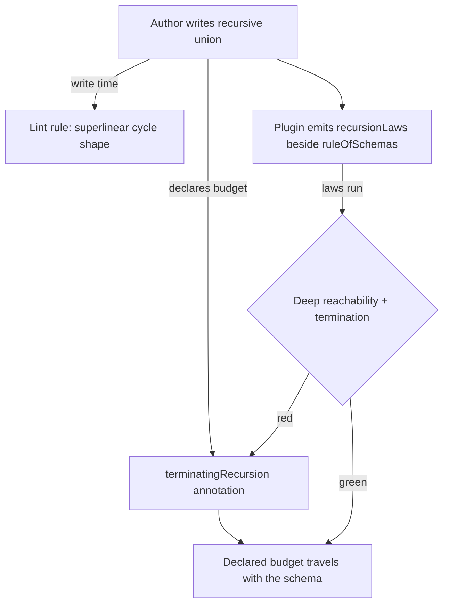
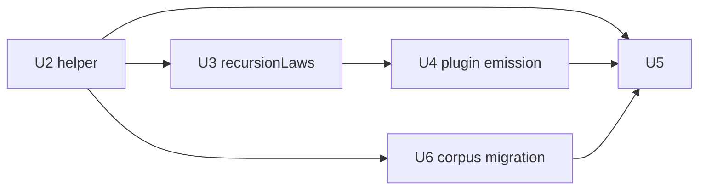

# Declared Recursion Budget for Schema Unions - Plan

## Goal Capsule

- **Objective:** A recursive schema union's generated values terminate inside a budget the schema declares, property suites exercise deep values by default, and recursion policy is visible at the authoring site — with the deprecated wrapper gone from the workspace.
- **Means:** A runtime annotation helper (`terminatingRecursion`) carrying ceiling and shape as declared knobs; `recursionLaws` emitted by the schema-laws Vite plugin beside `ruleOfSchemas` under a strict declared wall-clock budget; a deterministic oxlint rule over recursion shapes; `@systemfsoftware/effect-schema-bounded-union` deleted in the same change.
- **Product authority:** Brainstorm dialogue of 2026-09-11; remaining product decisions recorded in Key Decisions.
- **Stop conditions:** Any unit's verification fails after two honest attempts, or research invalidates a session-settled decision.

---

## Product Contract

### Summary

Recursive schema unions get a declared generation budget — ceiling plus shape — instead of effect's hidden per-suspend constant. The schema-laws plugin auto-generates laws that fail when the budget is missing or unreachably shallow, a lint rule refuses superlinear recursion shapes, and the bounded-union wrapper is deleted.

### Problem Frame

Effect v4 derives arbitrary values for recursive unions through a per-`Suspend` budget hardcoded at `maxDepth: 2` (`toArbitrary.ts:361-364`), with no annotation surface to change it. That constant starves property tests: measured deep-value share at depth ≥ 4 is 0.000 under the stock-equivalent policy. The derivation is also shape-sensitive in a way the API does not express: a cycle carrying N suspend nodes re-walks its terminal branch combinatorially (measured derive 222 ms at N=6, 52.6 s at N=8), and whether the budget is per-node or cycle-wide is an accident of where `S.suspend` sits. Filter hints (`arbitrary.constraint` / `arbitrary.candidate`) cannot express a depth policy — the recursion channel is read-only context, and a finite branch comes only from a `toArbitrary` hook's `terminal` output.

### Requirements

**Generation contract**

- R1. `terminatingRecursion` — an annotation helper in `@systemfsoftware/effect-schema-recursion-budget` accepting `{ identifier, base, recur, maxDepth, depthSize }` with all five parameters required — no signature defaults; the KD3 values (6, `'medium'`) are what callers pass. Returns the union schema annotated so derivation uses one `fc.oneof` carrying `{ depthIdentifier: identifier, maxDepth, depthSize }` with base members first and recur members after. `base` and `recur` are non-empty readonly arrays of member schemas. Member arbitraries derive lazily at derivation time, and the terminal branch past the cap is the base members. Variant coverage counts distinct member shapes — `_tag` for tagged unions, structural shape otherwise.
- R2. Termination: every generated value's nesting depth is at most `maxDepth + 1`. Decode and encode are unchanged — a value encoded deeper than the cap still decodes.
- R3. Deep reachability: every sample drawn under the declared budget contains at least one value at nesting depth ≥ `DEEP_DEPTH` (4) — a share stock derivation cannot produce, whose stock ceiling is 3 — and the annotation declares a ceiling strictly above the stock constant. (Design-time on the balanced reference fixture: deep share 0.249 annotated vs 0.000 stock-equivalent.)
- R4. One identifier per recursive cycle. Two cycles sharing an identifier share one budget.
- R5. Re-entrant derivation — deriving a recursive member while the union's own derivation is in flight — folds to the base branch instead of recursing.

**Law generation**

- R6. `@systemfsoftware/effect-schema-law` exports `recursionLaws(label, schema)` beside `ruleOfSchemas`, emitting three laws for a schema whose root is a recursive union: the termination bound (R2), deep reachability (R3), and variant coverage (every member shape appears in a sample). Each law runs under the four-term admissibility doctrine: a declared draw budget plus a runner-level wall-clock cap (`interruptAfterTimeLimit` with `markInterruptAsFailure: true`) so an overrun fails as an over-budget failure, never as the runner's generic cut-off.
- R7. The declared wall-clock budget is strict and concrete: success is milliseconds (measured ~100–250 ms per 2 000 draws), the runner-level cap is `interruptAfterTimeLimit: 10_000` with `markInterruptAsFailure: true`, and the vitest per-test backstop sits above it so the named over-budget failure always wins the race — above contended success (the repo has measured a 74× wall-clock spread under parallel gates), far below superlinear derivation cost, and an overrun is red. The law package overrides the shared per-test timeout where the shared value would fire first.
- R8. The schema-laws Vite plugin emits a `recursionLaws` call beside every `ruleOfSchemas` line; `recursionLaws` self-guards at runtime — only a schema whose root is a recursive union declaring a budget produces laws, so every other schema gets nothing new. The cycle walk runs on the schema AST — exact, never source heuristics.

**Detection gate**

- R9. A deterministic oxlint rule in the `effect-schema` plugin, enrolled at `error` through `recommended`, reports a recursive union whose cycle carries six or more suspend-wrapped members with no visible `toArbitrary` annotation, unless the union is built by a call to a trusted non-`S.` builder. Detection decides from one file's AST; cycles reaching across files, transforms wrapping members, and trusted builders stay silent — stated as false negatives, never fired as false positives. The rule ships in its own evaluator commit with observed red before and green after, and its non-vacuousness lives in known-bad/known-good fixture pairs (the tree is clean at the threshold: zero findings today).

**Cutover**

- R10. `@systemfsoftware/effect-schema-bounded-union` is deleted from the workspace: package directory removed, root README table row removed, and every live reference updated (historical plan documents are history, not references). The workspace changeset gate demands nothing for a package gone at head — its own self-test pins the verdict — so the removal is recorded by the npm deprecation (R11), not by an intent naming an absent package.
- R11. The migration note — recursive schemas move to `terminatingRecursion` — ships in the successor packages' changeset bodies, and the npm deprecation names it.

### Key Decisions

- KD1. Delete the wrapper in this change. _(session-settled: user-directed — chosen over deprecate-first: one cutover, no dual recursion doctrine.)_ Governs R10, R11.
- KD2. Strict declared wall-clock budget over a generous runner timeout. _(session-settled: user-directed — success is milliseconds; the budget doubles as the hang and cost-regression gate.)_ Governs R6, R7.
- KD3. Ceiling 6 with `'medium'` decay, not the stock constant 2. _(session-settled: user-directed — cap 2 starves property tests of depth.)_ Governs R1, R3.
- KD4. Declared annotation over plugin-injected budget. _(user-approved — the budget travels with the schema; a harness-injected policy would not, and adopters deriving published schemas would get different contracts.)_ Governs R1, R8.
- KD5. Ceiling and decay as separate declared knobs, not a flat cap raise. _(user-approved — depth without divergent tree size; the decay biases toward the first branch as depth grows, which is why base goes first.)_ Governs R1, R3.
- KD6. Lint threshold at 6 suspend members. Design-time measurement: derivation 8 ms at N=4, 222 ms at N=6, 52.6 s at N=8; the tree's two-suspend recursive unions derive in ≤ 4 ms, so a lower threshold would report working schemas. Governs R9.
- KD7. One detection rule, for the superlinear shape only. Terminal-less recursion (no base case) already throws loudly at derivation upstream, so a write-time rule would duplicate a loud signal. Governs R9.
- KD8. The annotation helper is a dependency-free leaf package: `@systemfsoftware/effect-schema-recursion-budget` (effect peer only, no workspace dependencies). The earlier home inside `effect-schema-extensions` is unbuildable in CI: extensions runtime-re-exports `@systemfsoftware/hex-schema`, whose test stack dev-depends on the law and vite packages — any test-time reference from those packages back to extensions closes a package cycle turbo refuses outright, and `peerDependencies` carry no build order, so a fresh checkout runs the consumer's tests against an unbuilt dist. The leaf keeps the helper installable without the law package's test-runner peers (the KD8 split this decision replaces was reaching the same conclusion). Governs R1, R6.
- KD9. The reachability floor is structural, not a fixture-measured share: a nonzero count of depth-≥ 4 values per sample, plus a declared ceiling above the stock constant. An absolute share (15 %) measured on the balanced reference fixture does not generalize to base-heavy unions — the corpus's five-base/two-recur AstNode unions cannot reach it under any honest declared budget — and a rebuilt `S.Union` of the members is not a stock comparison, because suspend closures bind the annotated union and the twin generates through the declared hook. Governs R3, R6.
- KD10. Base-heavy corpus unions migrate with `'small'` decay. The `'medium'` default biases toward the base members as depth grows; on the five-base/two-recur AST unions it starves the deep tail the reachability law requires, so the migration passes the weaker decay explicitly. Governs R1, R3, R11.

### Acceptance Examples

- AE1. **Given** a recursive union without the annotation, **when** the plugin emits its law suite, **then** the reachability law is red — no sample value crosses depth 4 (measured deep-value share 0.000). **Covers R3, R8.**
- AE2. **Given** the annotated union at the defaults, **when** the laws run, **then** termination, reachability, and variant coverage all pass inside the declared budget (measured on the balanced fixture: share 0.249, ~210 ms per 2 000 draws). **Covers R1–R3, R7.**
- AE3. **Given** a freshly authored union with seven suspend members on its cycle, **when** lint runs, **then** the rule reports it and names the fix. **Covers R9.**
- AE4. **Given** the tree's two-suspend recursive unions, **when** lint runs, **then** the rule stays silent. **Covers R9, KD6.**
- AE5. **Given** a union built by a trusted builder call, **when** lint runs, **then** the rule stays silent. **Covers R9.**
- AE6. **Given** an encoded chain deeper than the cap, **when** decoded, **then** it succeeds at full depth. **Covers R2.**

### Scope Boundaries

**Deferred for later**

- Write-time detection of terminal-less recursion (no base case) — upstream derivation already throws; the generated laws surface it in CI.

**Outside this work's identity**

- Plugin-config-injected budgets — policy that does not travel with the schema (KD4).
- Fan-out bounding — owned by the existing unbounded-fan-out rule; a depth cap bounds depth only.
- Upstream effect changes — a suspend-level `maxDepth`/`depthSize` option is the root-cause home; filed as an ask, never implemented against the vendored tree.

No Key Flows section: the work is a policy surface plus gates, not multi-step behavior; the enforcement path is carried by the diagram and the Acceptance Examples.

### Dependencies / Assumptions

- A1. Stock derivation semantics: the per-suspend budget is hardcoded at 2 and annotation-blind; filter hints cannot express a depth policy; a finite branch comes only from a `toArbitrary` hook's `terminal` output. Warrant: `repos/effect/packages/effect/src/internal/schema/toArbitrary.ts:361-364,789-792,808-836`; `repos/effect/packages/effect/src/Schema.ts` (ToArbitrary namespace).
- A2. fast-check `oneof(constraints, ...arbs)` supports `depthIdentifier` (shared depth), `maxDepth` (collapse to the first arbitrary past the cap), and `depthSize` (raises first-arbitrary probability with depth), with weighted entries. Warrant: installed `fast-check@4.9.0` typings `lib/fast-check.d.ts:3195-3212,3223-3263,3286`; vendor `OneOfConstraints` page.
- A3. The corpus is clean at the threshold: recursive production unions are the two two-suspend ignorer AST schemas and three single-suspend self/mutual recursions; all derive in milliseconds. Warrant: workspace grep over `packages/*/src` and per-file reads.
- A4. The changeset gate's verdict for a package absent at head is pinned by its own self-test (`scripts/guards/check-changeset.ts:95-119`, fixture `a package gone at head demands nothing`): no intent is demanded or possible.

**Destructive review.** Lens: the source's claim versus what its bytes assert. Kill: `depthSize` has no documented default — the probe's observation that omitting it matched `'small'` is an observation, not a contract, so R1 declares both knobs explicitly. Survive: base-first ordering is byte-asserted twice (collapse-past-cap and shrink guidance). Named: the budget-gate requirement is repo doctrine (admissibility term 4 — a posit-band local atom), not fast-check documentation; R6 cites it as doctrine.

### Sources / Research

- Vendored derivation: `repos/effect/packages/effect/src/internal/schema/toArbitrary.ts` (`:361-364` budget, `:789-792` union terminal fan-out, `:808-836` suspend handling); `repos/effect/packages/effect/src/Schema.ts` (ToArbitrary filter/candidate/recursion types).
- fast-check: installed 4.9.0 typings; vendor `OneOfConstraints` documentation (depthSize biases toward the first arbitrary with depth; maxDepth collapses to the first arbitrary; depthIdentifier shares depth).
- Plugin surface: `packages/effect-schema-vite/src/mod.ts` (`:17`, `:34-55`, `:91-95`) — generated law file shape and the real-import-edges constraint.
- Corpus: `packages/stryker-js/stryker-plugins/src/{effect-schema-ignorer,workflow-make-ignorer}/AstNode.schema.ts` (two suspend members each), `packages/stryker-js/stryker-js-typescript-checker/src/CheckMutants.schema.ts`, `packages/stryker-js/stryker-js/src/Metrics.schema.ts`, `packages/arethetypeswrong/arethetypeswrong/src/Resolution.schema.ts` (single suspend each).
- Measurements (design-time research): derivation-time curve 2/2/3/8/34/222/2 702/52 609 ms for N=1..8 suspend members; policy distributions at `maxDepth` 2 vs 6 across decay settings; two-suspend corpus unions at 0–4 ms.
- Predecessor: `packages/effect-schema-bounded-union/src/BoundedUnion.ts` and its v3→v4 port (`git show 8a4f0180967`).
- Changeset gate verdicts: `scripts/guards/check-changeset.ts` (`:95-119` effect table; fixture `a package gone at head demands nothing`).
- Admissibility doctrine: the repo wiki corpus, `property-test-admissibility` Gate — a declared draw budget, a wall-clock bound that fails an overrun as over-budget, and survivor completion inside the budget; no fixture-measured share floor is licensed.

<!-- ce-section: work-relationships -->

### How This Work Fits Together

This plan owns the recursion-budget doctrine end to end: the runtime annotation, the emitted laws, the detection rule, the corpus migration, and the predecessor's removal. The one separately plannable area is upstream: a suspend-level `maxDepth`/`depthSize` option in effect would retire the helper's hook mechanics. It can proceed independently of this change and cites it.

- Upstream effect ask — **Depends on** this change landing first, so the ask can point at a shipped declaration contract instead of a proposal.

Product Contract preservation: changed from the 1050 revision — R1's helper home is the dependency-free leaf package `@systemfsoftware/effect-schema-recursion-budget` (KD8); R3's floor is structural (KD9); R10 records the removal by npm deprecation (gate-pinned); R11 names the corpus migration's `'small'` decay (KD10). Scope, the remaining AEs, and KD1–KD7 are unchanged.

---

## Planning Contract

### Key Technical Decisions

- KTD1. **Evaluator sequencing.** The lint rule lands in its own commit, observed red on a fixture before and green after, before any work that must satisfy it. Governs R9.
- KTD2. **Self-guarding laws.** `recursionLaws` walks the schema's AST at runtime, and registers only when the schema's root is that recursive union — an export that merely references the cycle (a suspended member, a struct wrapping it) generates member values whose sample can never cover the union's variants, so it registers nothing. The plugin emits the `recursionLaws` call unconditionally beside `ruleOfSchemas`; the guard makes emission safe for every schema. Governs R8.
- KTD3. **Structural depth measurer.** The termination and reachability laws measure the _generated_ value's structural nesting (deepest object/array chain), schema-agnostic — no per-schema traversal to maintain. Decode-side depth is deliberately unmeasured: AE6's deeper-than-cap decode is a passing case, so no law asserts a bound on decoded depth. Governs R6, R2, R3.
- KTD4. **Budget mechanism.** Each generated law declares its draw budget and a runner-level cap — `interruptAfterTimeLimit` at 10 000 ms with `markInterruptAsFailure: true` — so an overrun fails as an over-budget failure naming the limit. The shared vitest per-test timeout (`packages/toolchain/vitest-config/lib/base.js:12` — 8 s local, 15 s agent, 30 s CI) fires _before_ that cap locally, so the law package overrides its own per-test timeout above the 10 s cap; the named budget failure must always win the race. The number is revisited against CI contention, never loosened to green. Governs R7, KD2.
- KTD5. **Root-entry exports.** `terminatingRecursion` exports from the recursion-budget package's root entry; `recursionLaws` from `effect-schema-law`'s root entry. No new subpath entries — entries are chunking devices, and two exports do not earn one. Governs R1, R6, KD8.
- KTD6. **Fixture provenance.** The rule's known-bad fixtures synthesize the corpus shapes (two-suspend, six-suspend, trusted-builder, annotated); known-good fixtures are live corpus files verbatim. Governs R9, KD6.
- KTD7. **Cutover mechanics.** `.changeset/ledger.yaml` entries for the deleted package's published versions are consumed history and stay untouched; the pending `.changeset/*.md` intents that name the package drop their package line; no intent names the deleted package itself (A4). `pnpm-workspace.yaml` drops the workspace entry and `pnpm install` regenerates the lockfile. The corpus migration annotates the two two-suspend ignorer unions with `terminatingRecursion` — ceiling 6; decay `'small'` per KD10. Live prose that names the old helper as an example — the law package's AGENTS.md line and the property-testing plugin's rule documentation — rewords to the successor. Governs R10, R11.

### Assumptions

- The in-tree corpus stays clean at the threshold; a unit landing code the rule reports migrates it in the same change, outside the evaluator commit.
- `'small'` decay on the two-suspend ignorer unions reproduces deep reachability inside the sample (KD9's structural floor); a distribution shift moves the decay by measurement, not by fiat.
- The 74× contended wall-clock spread bounds the backstop; a flaky budget under parallel gates is tuned by raising the cap with the measurement recorded, never by dropping `markInterruptAsFailure`.

### High-Level Technical Design

Sequencing: U1 is the evaluator surface and lands first in its own commit, independent of everything else. U2 needs nothing and proceeds in parallel with U1. U3 builds its green fixtures on U2's helper. U4 imports U3. U6 annotates the corpus unions on U2. U5 deletes the predecessor only after the successor exists end to end.

## Implementation Units

### U1. Schema recursion-shape lint rule

- **Goal:** A `schema-recursive-union-budget` rule in the `effect-schema` oxlint plugin reports recursive unions whose cycle carries six or more suspend-wrapped members with no visible `toArbitrary` annotation, unless built by a trusted non-`S.` builder call. Covers R9 (AE3–AE5), KD6, KD7, KTD1, KTD6.
- **Requirements:** R9.
- **Dependencies:** none.
- **Files:** `packages/oxlint-plugin/oxlint-plugin-effect-schema/src/rules/schema-recursive-union-budget.ts`, `.../schema-recursive-union-budget.config.ts`, `.../src/rules/__tests__/schema-recursive-union-budget.test.ts`, `.../src/index.ts` (register + `recommended` at `error`), `.../README.md` (rule row), api report, `.changeset/` intent (plugin minor).
- **Approach:**
  1. Build the module-scope schema-const reference graph from initializer identifiers, including references inside `S.suspend` thunks.
  2. Compute strongly connected components; a component is recursive on a self-loop or cycle.
  3. For each recursive component, count members whose initializer's top-level call is an alias-tolerant `S.suspend`; report when a union on the cycle lists six or more of them, no member carries a visible `toArbitrary` annotation, and the union is not built by a trusted non-`S.` builder call.
  4. Trusted-builder arm: a builder call is trusted when its callee resolves through scope analysis to an identifier that is not a member of the imported `Schema`/`S` namespace. Resolution failure is silent (a false negative, per R9's posture); the rule never reports on an unresolvable callee.
  5. Message names the fix: hoist to a single `S.suspend` at the recursion point, or declare the budget with the annotation helper.
  6. Register at `error` via `recommended`; regenerate the api report; changeset.
- **Patterns to follow:** `packages/oxlint-plugin/oxlint-plugin-effect-workflow/src/rules/make-command-schema.ts` one-hop scope resolution and canonical-path walk; `schema-declaration-location` rule/config split and member tables; the evaluator-commit shape recorded in the repo's enforcement doctrine.
- **Test scenarios:**
  - Reports a seven-suspend union on a cycle with no annotation (AE3).
  - Reports at the boundary: a six-suspend union on a cycle with no annotation (KD6's threshold is ≥ 6).
  - Stays silent at five suspend members — the threshold boundary (AE4, KD6).
  - Stays silent on the corpus shapes verbatim (AE4).
  - Stays silent when a member carries a visible `toArbitrary` annotation (AE5's annotated arm).
  - Stays silent when the union initializer is a call to a non-`S.` builder (AE5).
  - Alias tolerance: `Schema.suspend` and `S.suspend` both counted; namespace and named imports both resolved.
  - Recursion carried by `Schema.declare` over a self-referential type parameter stays silent — a stated false-negative edge.
  - Cross-file references resolve nowhere and stay silent — a stated false-negative edge.
- **Verification:** `pnpm --filter @systemfsoftware/oxlint-plugin-effect-schema test` green with the case count read; build, `api:check`, and lint green; a scratch probe with a seven-suspend union reports the rule id on the built plugin. Evaluator commit records observed red and green.

### U2. `terminatingRecursion` annotation helper

- **Goal:** The runtime annotation helper implementing the declared budget: ceiling, shape, base-first oneof, cycle-wide identifier, lazy member derivation, base-members terminal. Covers R1, R2, R4, R5, KD3, KD5, KD8, KTD5.
- **Requirements:** R1, R2, R4, R5.
- **Dependencies:** none (U1 is independent; U3 and U6 consume this).
- **Files:** `packages/effect-schema-recursion-budget/src/terminating-recursion.ts` (helper + in-source schema-derived property tests), `.../src/mod.ts` (export), package manifest, tsdown/vitest/tsconfig/api-extractor configs, README, api report, `.changeset/` intent (minor; first release from `0.0.0`).
- **Approach:** The helper returns the union annotated with a `toArbitrary` hook; member arbitraries derive inside the hook; the terminal branch past the cap is the base members; a shared `depthIdentifier` (the `identifier` argument) scopes the budget to the cycle. Export from the root entry per KTD5. Base member arbitraries derive once per hook call.
- **Patterns to follow:** The v4 hook shape — lazy derivation inside the hook, `Derivation` with an explicit `terminal` — as documented on the vendored `ToArbitrary` types.
- **Test scenarios** (in-source, schema-derived, each under the declared budget):
  - Termination: every generated value's nesting ≤ `maxDepth` + 1, quantified over seeds (R2).
  - Deep reachability: a fixed-seed `fc.sample` of 2 000 values shows deep values at nesting ≥ 4 (R3).
  - Variant coverage: every member shape in `base` and `recur` appears in a sample (R4's cycle stays inhabited).
  - Decode-past-cap: an encoded chain deeper than `maxDepth` decodes at full depth (R2, AE6).
  - Identifier sharing: two unions declared with one identifier under-generate — documents R4's hazard.
  - Re-entrancy: deriving a recursive member inside the hook folds to base instead of recursing (R5).
- **Verification:** `pnpm --filter @systemfsoftware/effect-schema-recursion-budget typecheck && pnpm --filter @systemfsoftware/effect-schema-recursion-budget test && pnpm --filter @systemfsoftware/effect-schema-recursion-budget lint` green; the reachability law measured, not asserted by construction.

### U3. `recursionLaws` in the law package

- **Goal:** A `recursionLaws(label, schema)` export beside `ruleOfSchemas` that registers the termination, deep-reachability, and variant-coverage laws for a schema whose root is a recursive union, each under the declared budget. Covers R3, R6, R7, R8, KD2, KD9, KTD2–KTD4.
- **Requirements:** R6, R7.
- **Dependencies:** U2 (the green-path fixture uses the annotated helper).
- **Files:** `packages/effect-schema-law/src/recursion-laws.ts` (+ tests beside per the law package's placement), `.../src/mod.ts` (export), `.../vitest.config.ts` (per-test timeout above the budget cap per KTD4), api report, `.changeset/` intent (minor).
- **Approach:**
  1. Cycle walk over the schema AST: memoize suspends, mark a union recursive when reachable from its own members.
  2. Register only when the schema's root is that recursive union (KTD2).
  3. Laws measure structural depth on generated values (KTD3) and declare the budget per KTD4.
  4. Failure shape: an overrun fails as an over-budget failure naming the limit, never as the runner's generic cut-off.
- **Patterns to follow:** `ruleOfSchemas`' generated-law shape; the red-fixture discipline — a fixture that proves the reachability law fails under the stock-equivalent cap (AE1).
- **Test scenarios:**
  - A recursive fixture with the annotation emits three laws; a schema without a recursive union at its root emits none (KTD2).
  - Reachability law red under a stock-equivalent fixture, green under the annotated one (AE1 vs AE2).
  - A collapsed annotation (base-only hook) produces a zero deep share — the reachability law holds a verdict of no (KD9's tooth).
  - Laws measure generated values only: a decode of a deeper-than-cap chain inside the suite passes — no law asserts decoded depth (KTD3, AE6).
  - Overrun fails as an over-budget failure (KTD4's mechanism observed).
  - Variant coverage counts every member shape; a dropped member turns it red.
- **Verification:** `pnpm --filter @systemfsoftware/effect-schema-law typecheck && pnpm --filter @systemfsoftware/effect-schema-law test` green; the red fixture observed before the green.

### U4. Plugin emission

- **Goal:** The schema-laws Vite plugin emits `recursionLaws('<label>', schema_N)` beside every `ruleOfSchemas` line in the generated file; the self-guard makes emission safe for all schemas. Covers R8, KTD2.
- **Requirements:** R8.
- **Dependencies:** U3.
- **Files:** `packages/effect-schema-vite/src/mod.ts`, `.../tests/` (the integration suite), `.../README.md`, api report, `.changeset/` intent (minor).
- **Approach:** Extend `generateSchemaLaws` to emit the second call per schema with the same alias and label machinery; keep the real-import-edges property — the generated file must keep the related-file walk working.
- **Patterns to follow:** The existing generation shape in `generateSchemaLaws` (label disambiguation, aliased imports, specifier relativity).
- **Test scenarios:**
  - Generated body carries both calls per schema with matching labels and aliases.
  - Import specifiers stay relative to the law file, not the Vite root.
  - The generated suite's runtime behavior: a recursive schema yields the codec pair plus the three laws; a flat one yields the codec pair only.
- **Verification:** `pnpm --filter @systemfsoftware/effect-schema-vite test` green.

### U6. Corpus migration

- **Goal:** The tree's recursive production unions declare their budget, so the emitted law suites are green and property suites exercise deep values by default. Covers R1, R3, R11, KD3, KD5, KD9, KD10.
- **Requirements:** R1, R3.
- **Dependencies:** U2.
- **Files:** `packages/stryker-js/stryker-plugins/src/effect-schema-ignorer/AstNode.schema.ts`, `.../workflow-make-ignorer/AstNode.schema.ts` (each union wrapped in `terminatingRecursion` with `maxDepth: 6, depthSize: 'small'` per KD10), `packages/stryker-js/stryker-plugins/package.json` (runtime dependency on `@systemfsoftware/effect-schema-recursion-budget` — the bundled ignorer dist imports the helper), `pnpm-lock.yaml`.
- **Approach:** Wrap each recursive union: base members stay the terminal set, the two suspend members become `recur`, the identifier is the schema's own qualified name. The three single-suspend struct recursions (CheckMutants, Metrics, Resolution) are not unions — the laws do not apply to them and the lint rule stays silent below the threshold.
- **Test scenarios:** each migrated union's generated law suite is green: termination at the declared ceiling, nonzero deep share, full variant coverage.
- **Verification:** `pnpm --filter @systemfsoftware/stryker-plugins test` green.

### U5. Cutover: delete the bounded-union package

- **Goal:** `@systemfsoftware/effect-schema-bounded-union` removed from the workspace; migration note shipped; no live reference remains. Covers R10, R11, KD1, KTD7.
- **Requirements:** R10, R11.
- **Dependencies:** U2–U4 and U6 (the successor exists end to end and the corpus is migrated). U1 is independent — it lands in its own evaluator commit and gates nothing here.
- **Files:** `packages/effect-schema-bounded-union/` (delete), `pnpm-workspace.yaml` (drop the workspace entry), `pnpm-lock.yaml` (regenerated by `pnpm install`), root `README.md` (table row), `packages/effect-schema-law/AGENTS.md` (the line routing recursive unions to the old package), `packages/oxlint-plugin/oxlint-plugin-property-testing/README.md` and its rule description/fixtures (the builder example renamed to a neutral local `buildUnion`), `.changeset/` (pending intents drop the package line per KTD7 — ledger history untouched), docs plans are history and untouched.
- **Approach:**
  1. Delete the package directory.
  2. Update the README table and the live prose naming the old helper (KTD7).
  3. Changesets: successor minors (from U2–U4) carry the migration note naming `terminatingRecursion` and the npm deprecate command.
  4. Sweep non-ledger references: the pending `.changeset/*.md` files naming the package, and fixture/builder names in the property-testing plugin's tests.
- **Test expectation:** none — deletion plus documentation; the gates prove it.
- **Verification:** workspace grep finds no live reference to the deleted package outside historical plan documents; `pnpm check:local` green; the changeset gate passes in CI.

## Verification Contract

| Gate               | Command                                                                                                                                                                                                               | Proves                                                   |
| ------------------ | --------------------------------------------------------------------------------------------------------------------------------------------------------------------------------------------------------------------- | -------------------------------------------------------- |
| Rule suite         | `pnpm --filter @systemfsoftware/oxlint-plugin-effect-schema test`                                                                                                                                                     | U1 fixtures; read case counts, not exit codes            |
| Rule package gates | `pnpm --filter @systemfsoftware/oxlint-plugin-effect-schema build && pnpm --filter @systemfsoftware/oxlint-plugin-effect-schema api:check && pnpm --filter @systemfsoftware/oxlint-plugin-effect-schema lint`         | U1 ships clean                                           |
| Helper             | `pnpm --filter @systemfsoftware/effect-schema-recursion-budget typecheck && pnpm --filter @systemfsoftware/effect-schema-recursion-budget test && pnpm --filter @systemfsoftware/effect-schema-recursion-budget lint` | U2 laws green inside the declared budget                 |
| Laws               | `pnpm --filter @systemfsoftware/effect-schema-law typecheck && pnpm --filter @systemfsoftware/effect-schema-law test`                                                                                                 | U3 laws plus the red-fixture proof                       |
| Plugin             | `pnpm --filter @systemfsoftware/effect-schema-vite test`                                                                                                                                                              | U4 emission shape and runtime guard                      |
| Corpus             | `pnpm --filter @systemfsoftware/stryker-plugins test`                                                                                                                                                                 | U6 migrated unions green under their declared budgets    |
| Enrollment reach   | `pnpm check:lint-coverage`                                                                                                                                                                                            | The new rule reaches the tree — registration is delivery |
| Cutover honesty    | Workspace grep: no live reference to the deleted package; no `oxlint-disable` added anywhere                                                                                                                          | R10, R11                                                 |
| Full chain         | `pnpm check:local`                                                                                                                                                                                                    | REPO-D1                                                  |

Mutation runs stay in CI (`REPO-D3`) — never start one locally. The strict budgets ride the laws themselves (KTD4), so a derivation-cost regression surfaces as an over-budget failure in the ordinary test gate.

## Definition of Done

- All six units landed in dependency order; U1's evaluator commit is separate with observed red before and green after recorded in its body.
- `pnpm check:local` exits 0 after the last edit; the PR is opened and watched to green (`gh pr checks --watch --fail-fast` exits 0) — REPO-D1.
- Changesets exist for every publishable package whose build hash changed; the migration note ships in the successor minors; the changeset gate passes.
- No `oxlint-disable` comment was added; the tree carries no live reference to the deleted package.
- The strict budget is observed failing once (the red fixture) before it is observed passing — the timeout is a gate, not a decoration.
- Abandoned-attempt code from any approach tried during implementation is removed before done.
