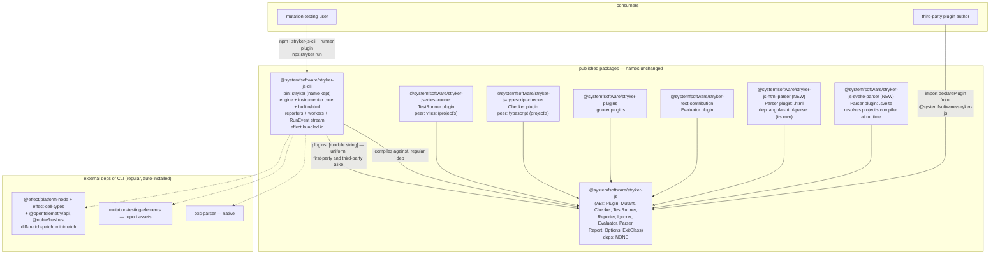
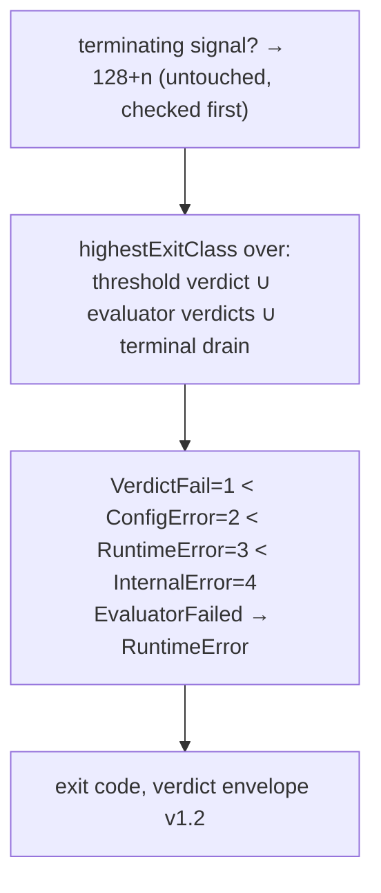

# refactor: re-derive the stryker-js engine's boundaries and lexicon

## Goal Capsule

- **Objective:** A consumer installs one CLI package plus the runner plugin for their stack and runs mutation tests; a third-party author writes a plugin against one tiny effect-free contract package; the family keeps its `stryker-js` names while the version treadmill and the one-infix name collision die. The mutation engine's identity (boundaries, vocabulary) is re-derived from its real consumers instead of inherited from the fork.
- **Means:** Collapse the nine `packages/stryker-js/` packages into eight — the existing `@systemfsoftware/stryker-js` (rebuilt as an effect-free ABI), the existing `@systemfsoftware/stryker-js-cli` (compiling in engine/instrumenter core/builtin + html reporters/workers), the four existing plugin packages (vitest runner, TypeScript checker, equivalence ignorers, contribution-gate evaluator) rewritten onto the ABI, and two new per-substrate parser plugin packages (`@systemfsoftware/stryker-js-html-parser`, `@systemfsoftware/stryker-js-svelte-parser`) ported out of the instrumenter — every plugin loaded through the same uniform `plugins` mechanism as third-party ones — plus wiring the currently-stranded Evaluator kind into the verdict path (KTD1, KTD4, KTD5, KTD6). The `stryker-js` stem and the `stryker` bin keep their names (session-settled: user-directed); the collisions die by deletion (`stryker-js-engine` is folded away, not renamed).
- **Authority hierarchy:** this plan > session-settled decisions (recorded as Key Decisions) > prior plans (history, never warrant — REPO-W7) > upstream Stryker (history, never governance — REPO-O1).
- **Stop conditions:** all R-IDs hold, the cutover sweep table is fully swept, `pnpm check:local` and the contract lane are green on the eight-package tree, or a blocking finding lands in Open Questions.
- **Execution profile:** phased rewrite (ABI → host → cutover) on branch `stryker-refactor`; REPO-D1 delivery as a PR watched green. No local mutation runs (REPO-D3) — the CI Mutation workflow is the oracle.
- **Tail ownership:** plan owned by this session; execution units owned by `ce-work`.

---

## Product Contract

### Summary

The mutation-testing subtree under `packages/stryker-js/` (nine packages, five divergent versions, a shared `effect` peer stringing the family together, a plugin vocabulary whose terms collide — `stryker-js` vs `stryker-js-engine`, `Ignore` vs `Ignorer`, two "reporters", a "runner" that means three things, and an `Evaluator` kind that is published, listed in the base config, and never dispatched) is re-derived into eight packages — six keeping their `stryker-js` family names plus two new per-substrate format-parser plugin packages — with a coherent lexicon and an effect-free plugin ABI. Behavior of a run — stages, NDJSON event stream, exit codes — is preserved byte-for-byte except the deliberate Evaluator restoration.

### Problem Frame

The current shape fails on its own evidence: consumers install only the CLI plus config-named plugins, yet seven packages are published (the html-reporter's own README says "you normally never import this package directly"); the packages version-drift (`^4.0.1` catalog pin vs `7.0.1` local CLI) because one product is split across five version treadmills; the CLI loads first-party plugin packages by module string while declaring them only devDeps — a runtime edge the package graph cannot see; four of five plugin kinds require a plugin author to import `effect` and author an Effect `Layer`, so the "plugin ABI" is actually an internal framework seam; `effect` is a peer across five packages to keep one runtime instance alive for `Context.Service` tag identity; and the `Evaluator` kind — with a real published plugin (`stryker-test-contribution`) listed in `stryker.config.base.json` — is never activated because the engine's only `createAll` call is for `'Ignore'` (`packages/stryker-js/stryker-js-engine/src/Run.ts:459`), making rule TC2 ("listing the plugin activates it") currently false. A prior rename in this exact subtree failed by laundering a product into a runtime-named package (`docs/solutions/engine-package-not-host-package.md`); the discipline from that post-mortem governs this one.

### Requirements

**Publish surface**

- R1. The publish set is exactly eight packages: six keeping their current names — `@systemfsoftware/stryker-js` (the ABI), `@systemfsoftware/stryker-js-cli` (bin `stryker`), `@systemfsoftware/stryker-js-vitest-runner` (TestRunner plugin), `@systemfsoftware/stryker-js-typescript-checker` (Checker plugin), `@systemfsoftware/stryker-plugins` (Ignorer plugins), `@systemfsoftware/stryker-test-contribution` (Evaluator plugin) — plus two new per-substrate parser plugin packages: `@systemfsoftware/stryker-js-html-parser` (`.html`, carrying `angular-html-parser`) and `@systemfsoftware/stryker-js-svelte-parser` (`.svelte`, resolving the svelte compiler from the user's project), both ported from the folded instrumenter. The three folded names — `stryker-js-engine`, `stryker-js-instrumenter`, `stryker-js-html-reporter` — are vacated: deleted in the same change, no re-export shells (session-settled; `docs/solutions/engine-package-not-host-package.md` "vacation beats deprecation"). The `stryker` bin name is unchanged.
- R2. The ABI package carries zero `dependencies` and zero `peerDependencies`, and no exported type mentions `Effect`, `Layer`, `Context`, `Option`, or `HashMap`. A plugin author installs nothing but the ABI package.
- R3. All six kinds are declared through plain-data contributions and plain factories — the existing `ReporterFactory` shape generalized: `(options, init) => ...` returning plain values/Promises/AsyncIterables. Payload schemas are exported as `StandardSchemaV1` objects (the pattern `ReporterEvent.schema.ts` already ships). The contribution fold stays a pure fold over declared arrays with recorded shadowing.

**Distribution**

- R4. The CLI package compiles the engine, instrumenter core, builtin reporters (clear-text/json/progress — in-process presentation, no toolchain substrate), html reporter, workers, and the NDJSON stream into one dist tree. External as regular (auto-installed) dependencies: `oxc-parser` (native binary — never bundle), `mutation-testing-elements` (report asset bundle), `@effect/platform-node(-shared)`, `@systemfsoftware/effect-cell-types`, `regexpp` (regex mutators — core mutation machinery), and the engine's small deps (`@opentelemetry/api`, `@noble/hashes`, `diff-match-patch`, `minimatch`). `effect` and `@std/jsonc` are bundled into the CLI dist. The CLI declares **zero peers** and carries **no extended-format machinery**: core formats (js/jsx/ts/tsx) parse via oxc; `.html`/`.svelte` support arrives only when the matching parser plugin (`stryker-js-html-parser` / `stryker-js-svelte-parser`) is listed in `plugins` — `angular-html-parser` is the html plugin's dep, the svelte compiler resolves from the user's project inside the svelte plugin; any other extension in `mutate` fails as a config fault naming the format and the plugin that provides it.
- R5. Every runner, checker, ignorer, evaluator, and parser — first-party or third-party — is a plugin package loaded by module string from `plugins` and dispatched by the same worker path; config's `"testRunner": "vitest"` selects by name among _loaded_ contributions (load two runners, pick one; swap a first-party adapter for a fork by changing one string in the same list). The built-in registry covers in-process reporters only (where a shipped name-keyed pattern exists). No first-party special-casing, no second activation mechanism, no `import.meta.resolve` hard-wiring (the current html-reporter resolve in `Cli.ts#hostOptionsOf` dies with that package).

**Evaluator**

- R6. The `Evaluator` kind is dispatched by the engine: after the report is assembled, evaluator verdicts fold into the existing `highestExitClass` set upstream of `resolveExitCode` (signals still outrank everything); `EvaluatorFailed` maps to `RuntimeError`; `@systemfsoftware/stryker-test-contribution` activates purely by presence in `plugins` (TC2 becomes true).

**Machine contracts**

- R7. The NDJSON `RunEvent` alphabet, exit-code table, and `STREAM_SCHEMA_VERSION` 1.0 are unchanged. The verdict envelope gains an optional `evaluators` field carrying `{ exitClass, message? }` per evaluator, with `VERDICT_ENVELOPE_SCHEMA_VERSION` bumped 1.1 → 1.2 and both strict decoders updated in the same change; the host renders each evaluator message to stderr beside the verdict line (the evaluator plugin itself never prints).

**Lexicon**

- R8. The ABI is one module per abstraction with screaming names (`Plugin`, `Mutant`, `Checker`, `TestRunner`, `Reporter`, `Ignorer`, `Evaluator`, `Report`, `Options`, `ExitClass`); the kind literal `Ignore` unifies to `Ignorer` everywhere (kind, module, config key `ignorers`); the `RunEvent` machine-stream alphabet, `Module`, `output-file`, `provided-options`, `Metrics`, and `ReporterEvent` leave the published ABI as standalone specifiers (machine stream and plugin-loading port are host-internal; the rest fold into their owning abstractions). The family shares the `stryker-js` stem by design; role-distinctness lives in the suffixes, and the one-infix collision (`stryker-js` vs `stryker-js-engine`) dies by deletion (CONST-N2; session-settled names-scream + stem-kept).

**Cutover**

- R9. Every reference named in the cutover sweep table (Appendix A) is updated or verified in the same change: workspace member lines for the three deleted packages, `catalogs.stryker` re-ranged for the kept packages' breaking majors, the three dead names swept from pending `.changeset/` intents (liveness gate), the preset's published home moving to the CLI subpath, the contract-lane tarball set, and `scripts/tools/bench-mutation.mjs` (pre-existing breakage — fix or delete). The kept names mean no bin migration, no config-name edits, no workflow-filter or folder-glob changes — those rows are verify-only.
- R10. The packaging discipline survives on the eight packages: tsdown-generated `exports` + `publishConfig.exports` from one entry map (REPO-S4), `clean: true`, `import.meta.vitest` define, `attw --pack .` green per package, api-extractor rollup produced by `build` wherever `exports.types` names it, `prepare: tsdown` on the CLI (CLI-B1), `publishConfig: { access, provenance }`, `files: ['dist']`.
- R11. Every surviving test suite is non-vacuous after the fold: each surviving package asserts a non-empty test collection (Extraction Coverage Conservation, `docs/solutions/architecture-patterns/extraction-strands-the-origins-gate.md`), and the mutation enrolment (`stryker.config.json#mutate` globs) moves with the code it enrolls.

### Key Decisions

- **Refactor package boundaries, folder structure, and lexicon together as one redesign** (session-settled: user-directed — chosen over fixing only the worst-named terms: three partial renames leave the collisions and add migration cost).
- **Names must scream the domain — role-distinct, each answering "of what?" — and the `stryker-js` family names stay** (session-settled: user-directed — chosen over both brand-stem drift and a mutation-domain rebrand: "it's obvious what that means"; a rename buys no behavior and costs every external reference).
- **The gcanti/tim-smart house style governs the re-derivation** — boundaries from the abstraction inventory, one module per abstraction, one published package per real external consumer; rename-in-place is an automatic fail (session-settled: user-directed — skill invoked; chosen over incremental renaming: musical chairs preserves the rot).
- **Peer-vs-bundle marks an identified runtime boundary; the CLI bundles its tree; no lazy uniform peer coupling** (session-settled: user-directed — chosen over both "effect peer everywhere" and "zero peers always": the boundary evidence decides each seam).
- **Third-party plugin authorship is a real product requirement** — the ABI is a genuine published external contract, and composability is inviolable: first-party and third-party plugins ride the identical mechanism (session-settled: user-directed — chosen over compiled-in first-party adapters: a second activation mechanism breaks substitution and misplaces toolchain substrates).
- **Publish surface = CLI + config-named plugins; instrumenter, html-reporter, language surface, and engine fold into the CLI** (session-settled: user-directed — chosen over a wider embedder surface: no embedder exists; a new package appears when a real consumer does). Governs R1, R4.

### Success Criteria

- A fresh `npm install @systemfsoftware/stryker-js-cli @systemfsoftware/stryker-js-vitest-runner` + `npx stryker run` works with no other installs (contract lane, containerized, asserts bin existence).
- A third-party plugin compiled against `@systemfsoftware/stryker-js` alone — with its own or no `effect` — loads and runs (in-process kinds in the host; checker/runner kinds in workers) with correct behavior; the repo's own `stryker-test-contribution` proves the evaluator path end-to-end by failing a run it should fail.
- `grep -r "stryker-js-engine\|stryker-js-instrumenter\|stryker-js-html-reporter" -- pnpm-workspace.yaml .github scripts .changeset packages/ stryker.config.base.json` returns zero hits after cutover; the `stryker` bin and the six kept names resolve unchanged and both parser plugins publish.
- No version treadmill: the eight packages' versions move only when their own surface moves — the runner when vitest's API moves, the checker when TypeScript moves, each parser plugin when its format's parser moves, the CLI when the host moves; `catalogs` pins (for the self-hosted oxlint-plugin consumers) name the kept set, re-ranged for the breaking majors (the parser plugins are workspace-linked, not catalog-consumed — no in-repo config mutates html/svelte).

### Scope Boundaries

**Deferred to Follow-Up Work**

- npm deprecation notices for the three folded names (release-time choreography; the deletion intents are the in-repo word).
- A Bun/Deno second host for the engine (the host-neutrality discipline that existed for it is superseded by the fold; reopen only with a real binder).
- Renaming the mutation-testing-elements-derived HTML report content.

**Outside this product's identity**

- Any behavior change to run stages, sandboxing, incremental mode, coverage analysis, or the instrumenter's mutators beyond what the fold forces (the Evaluator restoration is the one deliberate exception, R6/R7).
- Other subtrees (`packages/oxlint-plugin`, `packages/effect-*`, `omp/`, `agent-plugins/`) except the verify-only sweep rows the inventory names.
- Local mutation runs (REPO-D3).

---

## Planning Contract

### Key Technical Decisions

- KTD1. **Eight packages, one ABI — the names stay `stryker-js`.** The topology matches the repo wiki's decided package criterion — _a package boundary is earned by a binder or by substrate contamination, never by size_ (wiki: "Decided Package Topology: Binder or Contamination Earns the Boundary", "A Package Is Earned by a Binder or Contamination, Not Size"): the plugin author is the rootless consumer who must not install the CLI's contamination (oxc, platform-node, effect runtime), which quarantines in the CLI package; the adapter packages earn their boundaries by _substrate contamination_ — `vitest` and `typescript` appear only on their driver's manifest, resolved from the user's project (the 08-25 plan's surviving per-substrate rule); the format substrates earn two more packages by the same clause, **one per substrate** — `angular-html-parser` contaminates `@systemfsoftware/stryker-js-html-parser` (its regular dep) and the svelte compiler is project-side substrate resolved at runtime by `@systemfsoftware/stryker-js-svelte-parser` — so the CLI's instrumenter carries no format substrate beyond oxc, and a user never installs a format they don't mutate; no second binder exists to earn the engine its own package (CONST-S3 — a real Bun/Deno host reopens one then). The ABI package is what a plugin author compiles against and what config vocabulary refers to; it changes rarely and never carries implementation, and once third-party authors exist it versions backward-stably (wiki: "The Contract Is Explicit, Versioned, and Backward-Stable") — pre-1.0 breaks are majors, never silent. The six plugin packages publish because users choose them in config and because the repo dogfoods its own ABI through the same mechanism a third-party author uses (R1, R2).
- KTD2. **Effect-free ABI by generalizing the Reporter pattern, not by inventing one.** Evidence: Reporter is already effect-free (`ReporterFactory` over `AsyncIterable`, `StandardSchemaV1` union); Ignorer is a pure predicate whose Layer is `Layer.succeed`; Evaluator wraps a pure decision whose Effect surface exists only to log; Checker and TestRunner already cross a socket wire whose RPC payload schemas are plain — their in-process `Layer` API is redundant with the wire. Per-kind factory shapes: Ignorer `(node, context) => string | null`; Evaluator `(report, options) => EvaluatorVerdict` (async allowed), where a verdict is the plain record `{ exitClass, message? } | null` — the optional message exists so a gate can say why it failed, and the host renders it (the evaluator's former `Effect.logInfo/logError` channel does not survive the generalization); Parser factory returning `{ extensions: string[], parse: (input) => AST }` (plain data + a sync function — both first-party parsers already are); Checker/TestRunner factories returning `{ init?, dispose?, capabilities?, dryRun?, mutantRun?, check?, group? }` over plain `Record`/union payloads. The host adapts factories to its internal Effect machinery (pools, interruption, fibers) — lifetime stays host-owned. **Cost accepted:** the compiler stops proving a plugin received its services (`PluginEnvironment`); mitigation — the published schema already typed the layer `S.Unknown`, so only in-repo call sites ever had that proof, and the factory's explicit `options`/`init` parameters replace it (R2, R3).
- KTD3. **Tag identity designed out, not deduped.** With no plugin-author-facing `Context.Service`/`Layer`, a third-party plugin's transitive `effect` copy can no longer disagree with the host's — the ABI crosses as plain data. The host bundles its own `effect` into the CLI dist. Host-internal prototype-identity checks (`instanceof RunInterrupted` in `classify-run-outcome.workflow.ts`, `S.TaggedError` discrimination) stay inside the single bundle where one instance is guaranteed (R4; the dual-package hazard `docs/solutions/` has no doc for — reasoned here from first principles, consistent with Effect's `Context` tag mechanics).
- KTD4. **Bundle map — peers are the only fraud vector, and formats are per-substrate plugins:** ownable host code (engine, instrumenter core — js/jsx/ts/tsx via oxc — builtin + html reporters, workers) compiles into the CLI dist; `oxc-parser` stays a regular external dep (native `.node` — bundling the JS half strands the binary; it is the core mutation engine), `mutation-testing-elements` stays external (multi-MB web-component asset the html reporter references), `@effect/platform-node(-shared)` external (Node runtime binding), `@systemfsoftware/effect-cell-types`, `regexpp`, and the engine's small deps (`@opentelemetry/api`, `@noble/hashes`, `diff-match-patch`, `minimatch`) external as regular deps — a regular dependency behind a shipped capability is the product's own machinery and ours to carry; `effect` force-bundled (`alwaysBundle`), `@std/jsonc` force-bundled (uninstallable jsr leaf — existing `inlinedDependencies` precedent). Adapter plugins carry their own substrates: `vitest` peers `@systemfsoftware/stryker-js-vitest-runner`, `typescript` peers `@systemfsoftware/stryker-js-typescript-checker`. The `.html`/`.svelte` parsers are **Parser plugin contributions, one package per substrate**: `angular-html-parser` is the regular dep of `@systemfsoftware/stryker-js-html-parser`; the svelte compiler is project-side substrate resolved at runtime by `@systemfsoftware/stryker-js-svelte-parser` (`requireFromProject` — a project mutating `.svelte` has it) with a named config fault when absent and needed. No package in the tree declares `svelte`; the CLI declares no peers and no extended-format substrate. The vitest setup file remains a standalone emitted artifact of the _runner package_ with no local imports (VR3), opened by URL and copied into the sandbox (R4, R5).
- KTD5. **One plugin mechanism; the built-in registry covers in-process reporters only.** Builtin clear-text/json/progress reporters are already name-keyed and compiled-in (`builtin-reporters.ts` + `select-reporters.ts`) and stay so — they are presentation with no toolchain substrate. Checkers and runners do NOT join that registry: they stay plugin packages dispatched by the existing worker mechanism (workers load plugins by module string, `create(pluginsByKind, kind, name)` name-matches among loaded contributions) — the exact path a third-party runner takes, so first-party and third-party adapters are substitutable one-for-one and the worker wire needs no new factory-transport shape. Extended instrumenter formats ride the same mechanism: the instrumenter parses js/jsx/ts/tsx via oxc (the product core, not a registry) and extends its format table from loaded Parser plugin contributions — `.html`/`.svelte` arrive only when the matching parser plugin is listed in `plugins` (activation by presence, the wiki's gate axiom). The org-directory glob auto-discovery is deleted (with the names kept, the `@systemfsoftware/stryker-js-*` wildcard would silently swallow the first-party plugins; discovery is the explicit `plugins` list — the wiki's discovery axiom, _discovery is explicit and manifest-declared, not magic_). **One activation surface:** for adapters and parsers, presence in `plugins` plus the config name-select among loaded contributions; there is no built-in second switch (`docs/solutions/architecture-patterns/gate-activation-is-plugin-presence.md`) (R5, R6).
- KTD6. **Evaluator dispatch site: `mutation-reporting.ts`, folded into the existing precedence, not a new rule.** After `mutationTestReport(results)`, build evaluator factories from `pluginsByKind`, run them, and fold their verdicts into `highestExitClass([verdict, terminalDrain, ...evaluatorVerdicts])` upstream of `resolveExitCode` — signals (128+n) still outrank everything because they are handled first in `resolveExitCode`/the CLI ladder, which this fold never touches. Evaluators may return any `ExitClass`; the map is `VerdictFail=1 < ConfigError=2 < RuntimeError=3 < InternalError=4` so a broken evaluator (`EvaluatorFailed` → `RuntimeError`) outranks a passing score, matching the deleted-but-still-asserted scenarios in `tests/exit-code.integration.test.ts` (R6, R7).
- KTD7. **Names stay; the collisions die by deletion; two new packages join.** The `stryker-js` stem, the `stryker` bin, and the six kept package names are unchanged (session-settled: user-directed — chosen over a mutation-domain rebrand: a rename buys no behavior and costs every external reference). The one-infix collision (`stryker-js` vs `stryker-js-engine`) resolves because `stryker-js-engine`, `-instrumenter`, and `-html-reporter` are folded into `@systemfsoftware/stryker-js-cli` and deleted. Folders stay under `packages/stryker-js/`; structure changes by deletion plus two new plugin dirs (`stryker-js-html-parser/`, `stryker-js-svelte-parser/`), and the CLI's interior gains role-screaming dirs (`src/run/`, `src/instrument/`, `src/report/`, `src/platform/`, `src/workers/`). The preset (`config/base`) moves from the dead engine package to a CLI subpath (`@systemfsoftware/stryker-js-cli/config`). Keeping the names deletes most of the cutover's blast radius: no bin migration, no catalog renames, no workflow-filter edits, no external-user migration story (R8, R9).
- KTD8. **Why folding the engine into the CLI is right now though the 2026-09-01 plan rejected it.** That rejection rested on contamination quarantine (the engine's deps charging every plugin author) and a future second binder. Both are void: after KTD2 the plugin author depends on the ABI alone — no engine weight reaches them — and no second binder exists (CONST-S3; a real Bun/Deno host reopens a package then). The wiki's package-earned criterion re-derives the same answer: contamination quarantines in the CLI, the binder clause earns nothing today. Precedent is history, not warrant (REPO-W7) (R1, R4).
- KTD9. **Cutover mechanics per recorded failure classes:** intent sweep (liveness gate fails any pending `.changeset/*.md` naming a dead package — sweep in the same change, `pnpm version -r --dry-run` red→green), fresh-clone bin verification (`prepare: tsdown` must survive; local `rm` proves nothing), contract-lane tarball set reduced to the packages that actually publish together, Tarjan SCC pass over lockfile `link:` edges after the graph change (self-hosting cycle class), and `global-setup.ts`'s tarball-set expectation updated to the new nine (R9, R10).

### High-Level Technical Design

Component topology — eight packages, the seams that cross them, and what each external dependency marks:

Solid arrows are package edges; dotted are dependency-category boundary marks. Worker processes (checker worker, test-runner worker, the vitest sandbox) are runtime seams: workers load plugins by module string and speak the NDJSON RPC wire, entry URLs stay CLI-owned (`WorkerEntries`, EN3) — first-party and third-party adapters ride the identical path.

Exit-class precedence after the Evaluator restoration — the fold joins an existing set, never a new ladder:

### Assumptions

- The eight-package split is the _destination_, not a waypoint: two prior central decisions in this subtree were reversed within weeks (subpath-exports-not-packages; platform-host-package) — this plan's derivation is recorded in KTD1–KTD8 so the next session judges it on evidence, not inheritance.
- `docs/solutions/` has no learning on plugin-ABI-as-product or dual-package tag identity; those two are reasoned in KTD2/KTD3 rather than cited. The repo wiki's plugin-axiom and package-topology canon pages are cited where they bear (KTD1, KTD5).
- External research was checked (wiki canon query + web search on plugin-ABI/tag-identity design): no contradicting primary source found; the repo's own wiki canon and recorded solutions are the load-bearing evidence. Nothing in the plan depends on unsettled external options.

### Sequencing

ABI first (it has no dependencies and everything compiles against it), host second (the fold), plugins in parallel with the host, cutover last and atomic. Units are dependency-ordered U1 → U10; U6–U10 are one atomic cutover wave and must land as one PR.

---

## Implementation Units

**Test-layer doctrine for this plan** (choose-test-layer admission, applied): in-process tests run through published programmatic surfaces only — property tests for pure decisions (contribution fold, ignore decisions, gate judgment), composition tests through the public run surface for wiring (evaluator dispatch, adapter selection); process-level facts (bin link, packed-tarball install, NDJSON on a real pipe, worker-entry fork) are proven only in the repo's containerized contract lane (`test:contract` — CONCEPTS.md "Contract lane"), never as vitest unit tests; no unit spawns a process, no export exists only for a test. Property/composition tests are enrolled in the mutation gate via each package's `stryker.config.json#mutate`.

### U1. The ABI package `@systemfsoftware/stryker-js` (rebuilt in place)

- **Goal:** One effect-free contract package with the screaming lexicon, zero deps, publishing all six kinds as plain-data contributions + factories.
- **Requirements:** R2, R3, R8
- **Dependencies:** none
- **Files:** `packages/stryker-js/stryker-js/` (existing package, rewritten in place: `package.json` drops all deps/peers, `tsdown.config.ts` re-enumerated, `.attw.json`, `oxlint.config.ts`, `src/Plugin.ts`, `src/Plugin.schema.ts`, `src/Mutant.ts`, `src/Checker.ts`, `src/TestRunner.ts`, `src/Reporter.ts` (absorbs `ReporterEvent`), `src/Ignorer.ts`, `src/Evaluator.ts`, `src/Parser.ts`, `src/Report.ts` (absorbs `Metrics`), `src/Options.ts` (absorbs `output-file`, `provided-options`), `src/ExitClass.ts`, `src/index.ts`, `AGENTS.md`, tests beside modules)
- **Approach:**
  1. Port the schema/value modules from the existing `src/`, dropping every `effect`-typed surface: `Option<string>` → `string | null`; `Effect<...>` returns → plain/Promise returns; `HashMap` → `Record`; kind literal `'Ignore'` → `'Ignorer'`; `Layer`-typed contributions → factory-typed contributions (reporter/checker/test-runner/ignorer/evaluator/parser factories — all six kinds, Reporter's shape being the existing `ReporterFactory` — per KTD2). The `RunEvent` machine-stream alphabet does **not** stay published — it is host-internal (lands in the CLI with the engine, R8).
  2. Export every wire payload union as `StandardSchemaV1` beside its TS type (`S.toStandardSchemaV1` pattern from `ReporterEvent.schema.ts`) — schemas are devDependency-built artifacts of the package, not a runtime dep on effect.
  3. `tsdown.config.ts` enumerates one entry per module in the file list — thirteen entries (the eleven abstraction modules plus `index` and `Plugin.schema`) — with `devExports: '@systemfsoftware/source'`, `clean: true`, the vitest define; api-extractor rollup for `exports.types` produced by `build` if the rollup path is used.
  4. Keep the pure contribution fold (later same-kind-same-name wins, shadowing recorded) in `Plugin.ts`.
- **Patterns to follow:** `packages/stryker-js/stryker-js/src/ReporterEvent.schema.ts` (StandardSchema export); `packages/stryker-js/stryker-js/tsdown.config.ts` (enumerated exports); `packages/stryker-js/stryker-plugins/api-extractor.json` (rollup mode).
- **Test scenarios** (layer: property for the fold and schema laws; the ABI-purity probe is a build/type gate, not a test):
  - Contribution fold: two same-kind-same-name contributions — later wins and the fold records a `Shadowing` entry (input: two `declarePlugin('Ignorer', 'x', ...)`; expected: one surviving contribution + shadow record). Property over generated kind/name/factory triples.
  - Round-trip + refusal laws for every exported schema (generated schema laws pattern; at least one hand-written refusal per refinement so accept-laws aren't the only oracle).
  - `declarePlugin` rejects an unknown kind literal at compile time and at the schema boundary at runtime (property: every literal outside the six kinds fails decode).
- **Verification:** `pnpm --filter @systemfsoftware/stryker-js build typecheck test lint attw` green; a type-level ABI-purity check (compile a consumer importing every public specifier with `effect` unresolvable) finds no `effect` type leak; `grep -r "from 'effect" src/` returns only schema-construction internals that export StandardSchema objects.

### U2. First-party plugin packages on the new ABI

- **Goal:** The six first-party plugin packages — four existing (`@systemfsoftware/stryker-js-vitest-runner` TestRunner, `@systemfsoftware/stryker-js-typescript-checker` Checker, `@systemfsoftware/stryker-plugins` Ignorers, `@systemfsoftware/stryker-test-contribution` Evaluator) rewritten in place, plus two new (`@systemfsoftware/stryker-js-html-parser`, `@systemfsoftware/stryker-js-svelte-parser`) created from the instrumenter's format code — all onto U1's plain factories, loaded by module string exactly like third-party plugins.
- **Requirements:** R1, R3, R5, R8
- **Dependencies:** U1
- **Files:** the four existing package dirs under `packages/stryker-js/` — `stryker-js-vitest-runner/` (rewrites `src/Runner.ts`, `interpret-vitest-run.workflow.ts`; `stryker-setup.ts` stays this package's standalone emitted entry, zero local imports, VR3), `stryker-js-typescript-checker/`, `stryker-plugins/` (ignorers), `stryker-test-contribution/` — each manifest re-pointed to the ABI, tsdown/attw/AGENTS.md/tests updated; NEW `stryker-js-html-parser/` and `stryker-js-svelte-parser/` (ports of `parseHtml`, `parseSvelte`, and the format tables from `stryker-js-instrumenter/src/Parser.ts`)
- **Approach:**
  1. Port the runner and checker sources onto U1 factories (`{ init?, dispose?, capabilities?, dryRun?, mutantRun? }` / `{ init?, check?, group? }`); re-declare as `declarePlugin('TestRunner', 'vitest', makeTestRunner)` and `declarePlugin('Checker', 'typescript', makeChecker)` — the names config selects.
  2. Each adapter's substrate lands on its own manifest: `vitest` peers the runner, `typescript` peers the checker, both resolved from the user's project (`requireFromProject`); `initStrykerConfig`-style manifest config contributions ride the plugin packages as today.
  3. Port each ignorer's pure `decide…Ignore` functions unchanged (they are already pure); re-declare as `declarePlugin('Ignorer', name, factory)` with `(node, context) => string | null`.
  4. Port `test-contribution.ts` (pure decision) unchanged; re-declare as `declarePlugin('Evaluator', 'contribution-gate', factory)` with `(report, options) => ExitClass | null`; keep the SP1/SP2 proof tests (every ignored mutant proven equivalent) and TC1 semantics (failing gate returns `VerdictFail` on the success channel).
  5. Create the two parser plugin packages — **one substrate per package**: `@systemfsoftware/stryker-js-html-parser` (regular dep `angular-html-parser`; `declarePlugin('Parser', 'html', makeHtmlParser)`) and `@systemfsoftware/stryker-js-svelte-parser` (zero runtime deps; `declarePlugin('Parser', 'svelte', makeSvelteParser)` — the svelte compiler resolves from the user's project at runtime via `requireFromProject`, with a named config fault when a `.svelte` file is in `mutate` and the compiler is unresolvable). Both factories return `{ extensions, parse }` (KTD2). A user mutates html or svelte or neither — never both by necessity, so the substrates never ship together.
  6. All six depend on the ABI package; `effect` may remain a _devDependency_ for internals but never appears in published factory signatures.
- **Patterns to follow:** `packages/stryker-js/stryker-js-vitest-runner/src/Runner.ts` (project-local substrate resolution); `packages/stryker-js/stryker-plugins/src/*` (pure ignore decisions); `packages/stryker-js/stryker-test-contribution/src/test-contribution.ts`.
- **Test scenarios** (layer: property for the pure decisions; composition through each plugin's published entry, in-process, no process spawns):
  - Runner/checker factory declarations decode against the U1 contribution schema; `"testRunner": "vitest"` selects the vitest contribution among a loaded set of two (composition through the plugin-loading public path — name-select among loaded, not a registry lookup).
  - Each equivalence rule ignores its mutant WITH a test demonstrating the mutant is behavior-identical (SP1/SP2 carried over; property where the input space admits it).
  - Contribution gate: a report where a required test file kills no unique mutant → `VerdictFail`; a clean report → `null`; a throwing judge → `EvaluatorFailed`-shaped plain error object (not a throw across the factory boundary).
  - Parser plugins: with `stryker-js-html-parser` loaded, a `.html` fixture parses through the published factory; with no parser plugin loaded, the same extension faults as a config error naming the missing plugin (composition through the plugin-loading path); the svelte plugin's project-side resolution faults by name when the compiler is absent.
- **Verification:** all six packages' `build typecheck test lint attw` green; a smoke import of each published entry succeeds without `effect` installed.

### U3. The CLI package: fold engine, instrumenter, reporters, host

- **Goal:** `@systemfsoftware/stryker-js-cli` — one package whose dist is the whole host: run orchestration, instrumenter, builtin + html reporters, Node platform binding, workers, bin `stryker` (name unchanged).
- **Requirements:** R1, R4, R10
- **Dependencies:** U1
- **Files:** `packages/stryker-js/stryker-js-cli/` (existing package, grown: ports `stryker-js-engine/src/**` (including the `RunEvent` alphabet — R8), `stryker-js-instrumenter/src/**`, `stryker-js-html-reporter/src/**` into role-screaming dirs `src/run/`, `src/instrument/`, `src/report/`, `src/platform/`, `src/workers/` beside the existing CLI sources and `src/main.ts`; `tsdown.config.ts` with entries `main`, `workers/checker-worker`, `workers/test-runner-worker`, `config` preset; `package.json` keeps `bin: { stryker }`, `prepare: tsdown`; `AGENTS.md`; `tests/` including the ported integration suites)
- **Approach:**
  1. Move sources as modules of one package; the engine/instrumenter/language imports become relative imports or the ABI package import. Delete the three folded manifests (`stryker-js-engine`, `stryker-js-instrumenter`, `stryker-js-html-reporter`).
  2. Adapt plugin consumption to U1: host-side adapters turn plain factories into internal services (ignorers → the `readonly IgnorerService[]` the instrumenter already duck-types; evaluators → the KTD6 fold; checker/runner workers call factories directly instead of `Layer.build`) — adapters are NOT ported here (they live in U2's plugin packages).
  3. Wire the bundle map (KTD4) in `tsdown.config.ts`: replace the current `deps: { onlyBundle: false }` (a hint-suppressor, not a bundler) with the explicit modern shape — `alwaysBundle: ['effect', '@std/jsonc']` (recorded in `inlinedDependencies` with reasons) plus regular external deps for oxc-parser / mutation-testing-elements / @effect/platform-node(-shared) / effect-cell-types / regexpp / the engine's small deps. The CLI manifest declares **zero peers and no format substrate**: remove the `svelte` peer and its `peerDependenciesMeta`, and drop `angular-html-parser` from the manifest — both parsers move to U2's per-substrate plugin packages. The instrumenter's built-in format table shrinks to js/jsx/ts/tsx via oxc and extends at runtime from loaded Parser contributions (`pluginsByKind.get('Parser')`); any other extension in `mutate` fails as a config fault naming the format and naming the plugin that provides it (`@systemfsoftware/stryker-js-html-parser` / `@systemfsoftware/stryker-js-svelte-parser`). Mixing the deprecated `noExternal`/`external` pair with the modern `alwaysBundle` throws in tsdown — the final config shape is stated here so the implementer does not derive it.
  4. Keep: one `runMain` (CLI only), worker entries as emitted files opened by URL (re-keyed to the grown dist layout), `WorkerEntries` data injection, `engines.node >= 20` in exactly one manifest, NDJSON stream alphabet, exit-code ladder.
  5. Delete the `pluginModulePaths` dead field with its call sites (`LoadedPlugins`, the `buildChecker`/`buildTestRunner`/`makeCheckerChildProcess`/`makeChildProcessTestRunner` parameters, and the `pluginCount` telemetry that reads it — replace with `pluginsByKind` size).
  6. `stryker.config.json` for the CLI's own mutation enrolment stays in the package; `mutate` glob follows the moved workflow files (SJ-R2).
- **Execution note:** characterization before the move — the ported in-process integration suites (checker-group-then-check, exit-code, verdict-envelope) must be green on the old tree before any source moves, then move with the code and stay green; the fold is the one place "the suite still exits 0" can lie (Extraction Coverage Conservation). Process-level proofs (bin link, worker-entry fork handshake, packed install) run in the contract lane only.
- **Patterns to follow:** current CLI `tsdown.config.ts` (`exports.exclude`, `bin` generation, `dts: false`); `platform/node.ts` (layer wiring — ported, worker entry URLs re-keyed).
- **Test scenarios** (layer: composition through the engine's published in-process surface; process-level facts deferred to the contract lane per doctrine):
  - Ported in-process integration suites green unchanged (checker group-then-check; exit codes; verdict envelope).
  - After the fold, every surviving test command asserts a non-empty test collection (kill the vacuous-green class).
  - Dist scan (build gate, not a test): no bare import of a deleted `@systemfsoftware/stryker-js-engine|-instrumenter|-html-reporter` package survives in `dist/`; a strict-consumer compile (no source condition, no `skipLibCheck`) resolves every public name (dts name-drop hazard).
- **Verification:** `pnpm --filter @systemfsoftware/stryker-js-cli build typecheck test lint attw` green; fresh-clone bin check green (contract-lane/U10 scope).

### U4. Uniform plugin loading — first-party and third-party alike

- **Goal:** One loading and dispatch mechanism for every runner/checker/ignorer/evaluator; the built-in registry covers in-process reporters only; the hard-wired html-reporter resolve dies.
- **Requirements:** R5
- **Dependencies:** U2, U3
- **Files:** `packages/stryker-js/stryker-js-cli/src/run/Plugins.ts` (port of `stryker-js-engine/src/Plugins.ts`), `src/Cli.ts` (host options)
- **Approach:**
  1. Keep `importModule` (createRequire for bare specifiers, dynamic import for paths), the classify/resolve/shadow logic, and the worker-side `loadPlugins` → `create(pluginsByKind, kind, name)` name-match exactly as-is — first-party adapter packages load through the same `plugins` module strings as third-party ones; no new wire shape, no built-in factory transport (KTD5).
  2. Delete the org-dir glob self-hosting (auto-discovery by `@systemfsoftware/stryker-js-*` wildcard is exactly the magic the wiki's explicit-discovery axiom rejects — and with the names kept, the wildcard would silently swallow the first-party plugin packages; discovery is the explicit `plugins` list) and the `import.meta.resolve('@systemfsoftware/stryker-js-html-reporter')` hard-wiring in `hostOptionsOf` (the html reporter joins the builtin in-process reporter set; no first-party reporter needs a module string either).
  3. Absent substrate must fail as a config fault (exit 2, a named plugin-load error naming the missing host tool, emitted by the plugin-load path in `Plugins.ts`/`Config.ts`), never a top-level `ERR_MODULE_NOT_FOUND`; `resolveVitest`'s host-fallback (`import.meta.resolve('vitest/package.json')` in the runner) is removed — there is no host vitest to silently fall back to.
  4. Plugin discovery keeps the union-of-candidate-roots rule with ENOENT distinguished from other errors (`first-populated-directory-is-not-the-install-root` — never short-circuit).
- **Execution note:** the fresh pnpm-isolated install proof (plugin set non-empty) is contract-lane scope — a bare "run exits 0" cannot distinguish empty from correct.
- **Test scenarios** (layer: composition through the config→contribution public path, in-process):
  - `"testRunner": "vitest"` with the runner plugin's module string in `plugins` → the vitest contribution is selected by name among loaded contributions; the same config with the plugin absent from `plugins` → config-fault error naming vitest, not a crash.
  - A fixture third-party plugin module (Reporter kind) loads through `importModule` and its shadowing behavior matches the fold rules — the same path the first-party adapters take.
  - Unknown plugin name in `plugins` → loud config error listing loaded names, never silent omission.
- **Verification:** suites above green; `grep -rn "import.meta.resolve('@systemfsoftware" src/` returns zero; contract lane asserts a non-empty plugin set in a fresh pnpm-isolated install.

### U5. Evaluator dispatch + verdict envelope v1.2

- **Goal:** The stranded kind runs; the gate plugin actually gates; the envelope reports it.
- **Requirements:** R6, R7
- **Dependencies:** U3
- **Files:** `packages/stryker-js/stryker-js-cli/src/run/mutation-reporting.ts` (dispatch), `src/run/verdict-envelope.ts` (field + version bump), the verdict-line schema, `packages/stryker-js/stryker-js-cli/tests/verdict-envelope.integration.test.ts`, `tests/exit-code.integration.test.ts` (re-authored), both strict decoders (`cli-contract.schema.ts`)
- **Approach:**
  1. In `reportAll`, after the report exists: build evaluator contributions from `pluginsByKind` (presence-activated — dispatched iff present in `loaded.pluginsByKind.get('Evaluator')` after `loadPlugins`; note this differs from ignorers, which are additionally gated by the `ignorers` name whitelist at `Run.ts:458-460`), call each factory with `(report, options)`, collect `ExitClass | null` verdicts, fold per KTD6. Define the activation rule as TC2 in the plugin's AGENTS.md.
  2. Map a factory failure to `RuntimeError`; never let it outrank a signal (the fold sits upstream of `resolveExitCode`).
  3. Bump `VERDICT_ENVELOPE_SCHEMA_VERSION` to `1.2`, add optional `evaluators` field (name → verdict), update both decoders; `STREAM_SCHEMA_VERSION` stays `1.0`; the NDJSON alphabet gains no new `kind`.
  4. Delete the stale NOTE header in `verdict-envelope.integration.test.ts`; re-author the two blocked scenarios against the 6-arg builder + new field; **fix the tautological exit-code scenarios** (they hand-construct `evaluatorVerdicts` and test the Set-fold against itself — CONST-T10 violation) — drive a real evaluator plugin through the engine's public run surface instead: a fixture evaluator plugin at `tests/__fixtures__/evaluator-fixture/` declaring `declarePlugin('Evaluator', 'fixture-gate', ...)` returning `VerdictFail` for a known report shape, installed by the test config as a workspace-linked module string (no pnpm-install step).
- **Test scenarios** (layer: composition through the engine's public run surface with a real evaluator plugin in the contribution set — no hand-built verdict sets):
  - Failing evaluator verdict outranks a passing score (observable: run outcome's exit class) — driven through the fixture plugin.
  - Passing score + passing evaluator → exit-0-equivalent outcome.
  - Throwing evaluator → `RuntimeError` class, run completes, envelope notes the failure.
  - Signal during evaluation → signal exit class (signals still outrank — asserted through the classifier's public input, in-process).
  - Envelope decodes under v1.2 (schema decode of the published envelope type; the container NDJSON assertion is contract-lane).
- **Verification:** suites above green; contract lane decodes the verdict line.

### U6. Preset home + config surface verification

- **Goal:** The base preset survives its old home's deletion; every config resolves under the rebuilt ABI.
- **Requirements:** R8, R9
- **Dependencies:** U3, U4, U5
- **Files:** `packages/stryker-js/stryker-js-cli/src/config/base.ts` (preset, exported at `@systemfsoftware/stryker-js-cli/config` — the dead engine subpath's replacement), `stryker.config.base.json` (verify unchanged plugin names), the 16 other `stryker.config.json` files (verify against the new ABI)
- **Approach:** the plugin names, `ignorers` values, and relative `extends` paths in every config are unchanged — the names were kept. What moves: the preset's published home (the `@systemfsoftware/stryker-js-engine/config/base` subpath dies with that package; consumers of that specifier — external only — re-point to `@systemfsoftware/stryker-js-cli/config`). In-repo configs extend `stryker.config.base.json` by relative path and need no edit; verify each still resolves under the rebuilt ABI.
- **Test expectation: none — configuration verification; proven by U8's contract lane and mutation matrix.**
- **Verification:** configs parse; preset resolves in the U8 smoke run.

### U7. Folded packages vacated + release intents

- **Goal:** The three folded names die — directories, workspace members, every `workspace:^` edge — and a liveness-clean intent set remains.
- **Requirements:** R1, R9
- **Dependencies:** U6
- **Files:** delete `packages/stryker-js/stryker-js-engine/`, `packages/stryker-js/stryker-js-instrumenter/`, `packages/stryker-js/stryker-js-html-reporter/`; `pnpm-workspace.yaml` (drop those three member lines, add the two parser-plugin member lines — 9 → 8; re-range `catalogs.stryker` pins for the kept packages' breaking majors); consumer manifests (drop the CLI's `workspace:^` edges on the three dead names); `.changeset/*.md` (sweep pending intents naming the three dead packages; add breaking-major intents for the six kept packages naming consumer-observable facts: ABI break, engine fold, envelope v1.2; add debut intents for the two parser plugins); `.changeset/ledger.yaml` history never rewritten
- **Approach:** ordered so the workspace stays installable at each step — (a) re-range `catalogs.stryker` pins (consumers resolve through the registry route, so ranges move before members do), (b) drop the CLI's dead `workspace:^` edges, (c) delete the three member lines and directories, add the two parser-plugin member lines, (d) sweep intents, then `pnpm install` + `pnpm version -r --dry-run` red→green in this change (KTD9). `packages/stryker-js/AGENTS.md` re-keys its rules to the eight-package tree (SJ-R1 rebuild rule and the config-enrolment rule survive).
- **Test expectation: none — structural deletion and release mechanics; the liveness gate and dry-run are the oracles.**
- **Verification:** `pnpm install` resolves with no dangling workspace edges; `pnpm version -r --dry-run` exits 0; changeset-check green.

### U8. Contract lane on the new family

- **Goal:** The end-to-end proof covers the eight-package set.
- **Requirements:** R9, R10
- **Dependencies:** U7
- **Files:** `packages/stryker-js/stryker-js-cli/tests/global-setup.ts` (tarball set: `stryker-js`, `stryker-js-cli`, `stryker-js-vitest-runner`, `stryker-js-typescript-checker`, `stryker-plugins`, `stryker-test-contribution`, `stryker-js-html-parser`, `stryker-js-svelte-parser`, `effect-cell-types` — nine), `tests/cli-contract.integration.test.ts` (preset specifier re-keyed to the CLI subpath; bin name `stryker` unchanged), `.github/workflows/mutation.yml` (unchanged filter/path — verify only), `turbo.json` (unchanged `packages/stryker-js/**` glob — verify only), `scripts/tools/discover-mutation-targets.mjs` (unchanged predicate — verify only), `scripts/tools/bench-mutation.mjs` (pre-existing breakage: names long-dead `stryker-js-mutation-run` — fix or delete), `.claude/hooks/guard-local-mutation.ts` (SELFTEST fixtures — verify the kept names still match)
- **Approach:** update the editable surfaces from Appendix A in the same change as U7; keep the advisory-step-plus-artifact-assertion pairing (bin existence `test -x` after container install). This unit _is_ the contract lane's home — process-level proofs live here by design (CONCEPTS.md "Contract lane").
- **Test scenarios** (layer: contract lane — packed tarballs, clean container, real binary; the only sanctioned process-spawning altitude):
  - Fresh container installs the nine-tarball set, `.bin/stryker` exists (`test -x`), fixture projects drive exit codes, NDJSON alphabet + envelope v1.2 decode, preset `extends` resolves.
  - Mutation matrix: `discover-mutation-targets` output includes every package owning a `stryker.config.json` after the fold (silent-narrowing check).
  - Fresh pnpm-isolated install asserts a non-empty plugin set (the silent-empty hazard).
- **Verification:** contract lane green in CI; `mutation.yml` report job green on a PR touching the subtree.

### U9. Doctrine, docs, and the sweep tail

- **Goal:** Every prose and doctrine surface names the eight-package architecture; stale references die.
- **Requirements:** R9, R10
- **Dependencies:** U8
- **Files:** `packages/stryker-js/AGENTS.md` + leaf `AGENTS.md`s (re-keyed to the eight-package tree, including the consolidated CLI `oxlint.config.ts` carrying the folded packages' rules and per-plugin oxlint configs for the six plugin packages), the eight packages' READMEs (updated for the effect-free ABI, uniform plugin loading, envelope v1.2 — install/config sections largely unchanged since names kept), `CONCEPTS.md` (add entries for the ABI and uniform plugin loading per the gap-fill rule; the "Reporter event protocol" entry's package name is unchanged — no edit), root `AGENTS.md` (Surface Classes examples re-keyed where they name the folded packages), stale references: the `stryker-js-plugin-api` peer claim in `stryker-plugins/README.md` (fix to name `@systemfsoftware/stryker-js`)
- **Approach:** update the eight READMEs in the repo's README shape (install → configure → machine output). New/ported `AGENTS.md` leaves follow the agent-docs doctrine: every load-bearing rule names the deterministic gate that enforces it (`review` where none exists), one-line rules unless the harm is surprising _and_ the failure silent, a `wrong:`/`right:` pair on every review-gated rule, claims cite their source, detail routed to references rather than inlined.
- **Test expectation: none — documentation.**
- **Verification:** the R9 sweep grep returns zero hits outside `docs/plans/` and `docs/solutions/` (historical records exempt).

### U10. Graph + install verification (the final gate wave)

- **Goal:** Prove the new package graph is acyclic at build level, installs fresh, and links the bin.
- **Requirements:** R9, R10
- **Dependencies:** U8, U9
- **Files:** none new — verification-only unit
- **Approach:** Tarjan SCC pass over the lockfile's `link:` edges (self-hosting cycle class — the oxlint-plugin registry-consumption route must not have re-closed a cycle; name the tool in the PR — a one-off node script is fine); fresh `git clone --no-hardlinks` + `pnpm install --frozen-lockfile` creates `.bin/stryker`, `stryker --help` exits 0; `pnpm check:local`; `gh pr checks --watch --fail-fast` on the delivery PR. Rollback smoke: `git revert -n <merge-sha>` in a scratch worktree restores the folded paths and re-points the sweep; `pnpm install && pnpm check:local` on the reverted tree confirms the sweep was bijective.
- **Test expectation: none — verification.**
- **Verification:** all named checks green; SCC pass prints no cycle containing the CLI or ABI.

---

## Verification Contract

| Check                                                            | What it proves                                                       | Where                      |
| ---------------------------------------------------------------- | -------------------------------------------------------------------- | -------------------------- |
| `pnpm check:local`                                               | whole-tree gates on the eight-package graph                          | repo root, after last edit |
| `pnpm --filter @systemfsoftware/stryker-js … attw` (per package) | exports/types resolve as npm installs them                           | U1–U3                      |
| `pnpm --filter @systemfsoftware/stryker-js-cli test:contract`    | packed-tarball install, bin link, NDJSON + envelope v1.2, exit codes | U8                         |
| `pnpm version -r --dry-run`                                      | intent liveness after the three deletions                            | U7                         |
| dist scan + strict-consumer compile                              | no bare import of a folded package; no dts name drop                 | U3                         |
| fresh-clone install + `.bin/stryker` + `--help`                  | prepare/bin link survives the fold (CLI-B1)                          | U3, U10                    |
| Tarjan SCC over lockfile `link:` edges                           | no build-level self-hosting cycle                                    | U10                        |
| `gh pr checks --watch --fail-fast`                               | CI green incl. Mutation workflow on the kept names                   | delivery PR                |

Release: `release:validate` is not the exit criterion for this refactor; the CI Mutation workflow running on the kept package set is (REPO-D3 forbids local runs). Behavior-skill evaluation: none — no model-facing surface changes.

## Definition of Done

- All R-IDs hold on the merged tree; the Appendix A sweep table shows every row updated or verified.
- Every surviving package's test collection is non-empty (no vacuous green after the fold) and each moved test suite is green in its new home.
- The delivery PR is watched to green (`gh pr checks --watch --fail-fast` exits 0), including a Mutation workflow run whose matrix covers every config-owning package on the kept names.
- Abandoned-attempt code removed: no folded-package directory, manifest, intent, workflow path, or doctrine reference survives outside historical records (`docs/plans/`, `docs/solutions/`, `.changeset/ledger.yaml` history).
- Tree left restartable: fresh clone installs, links `stryker`, and passes `pnpm check:local`.

---

## Appendix

### A. Cutover sweep table (from the reference inventory)

| Surface                                                 | Reference                                                                                                                                                                                                                                                   | Action                                                                                                                                                                                                                      |
| ------------------------------------------------------- | ----------------------------------------------------------------------------------------------------------------------------------------------------------------------------------------------------------------------------------------------------------- | --------------------------------------------------------------------------------------------------------------------------------------------------------------------------------------------------------------------------- |
| `pnpm-workspace.yaml`                                   | `catalogs.stryker` 5 pins; `packages:` 9 member lines                                                                                                                                                                                                       | drop the 3 folded member lines, add 2 parser-plugin members (9 → 8); re-range the 5 kept pins for breaking majors                                                                                                           |
| `.changeset/*.md` (10 pending intents)                  | `debut-releases-gain-oidc`, `effect-rc112`, `executors-as-descriptions`, `generated-suites-cover-recursion`, `modern-ends-know`, `package-landing-pages`, `recursion-generation-laws`, `workflow-brand-forced`, `workflow-constructor-consumers` + one more | sweep the 3 dead names (liveness); add breaking-major intents for the 6 kept packages + debut intents for the 2 parser plugins                                                                                              |
| `stryker.config.base.json`                              | 5 plugin names + reporters                                                                                                                                                                                                                                  | no edit — names kept (verify resolves under rebuilt ABI)                                                                                                                                                                    |
| 16 other `stryker.config.json`                          | extends paths, plugin names                                                                                                                                                                                                                                 | no edit — relative extends + kept names (verify only)                                                                                                                                                                       |
| `.github/workflows/mutation.yml`                        | `--filter=@systemfsoftware/stryker-js-cli`; `node packages/stryker-js/stryker-js-cli/dist/main.mjs merge-reports`                                                                                                                                           | no edit — names/paths kept (verify only)                                                                                                                                                                                    |
| `turbo.json`                                            | mutation task input `packages/stryker-js/**`                                                                                                                                                                                                                | no edit — folder kept (verify only)                                                                                                                                                                                         |
| `scripts/tools/discover-mutation-targets.mjs`           | folder predicate `packages/stryker-js/`                                                                                                                                                                                                                     | no edit — folder kept (verify only)                                                                                                                                                                                         |
| `scripts/tools/bench-mutation.mjs`                      | names dead `stryker-js-mutation-run` (pre-existing breakage)                                                                                                                                                                                                | fix or delete                                                                                                                                                                                                               |
| `.claude/hooks/guard-local-mutation.ts`                 | SELFTEST fixtures name kept pairs                                                                                                                                                                                                                           | no edit — names kept (verify only)                                                                                                                                                                                          |
| CLI `global-setup.ts`                                   | six-tarball pack set                                                                                                                                                                                                                                        | new nine-tarball set (stryker-js, stryker-js-cli, stryker-js-vitest-runner, stryker-js-typescript-checker, stryker-plugins, stryker-test-contribution, stryker-js-html-parser, stryker-js-svelte-parser, effect-cell-types) |
| `scripts/guards/check-changeset.ts`                     | resolves members dynamically                                                                                                                                                                                                                                | no edit (verify only)                                                                                                                                                                                                       |
| `packages/oxlint-plugin/*/stryker.config.json` (10)     | plugin names via base preset                                                                                                                                                                                                                                | no edit — names kept (verify only)                                                                                                                                                                                          |
| READMEs + `packages/stryker-js/AGENTS.md` + leaf AGENTS | `stryker-js-plugin-api` stale peer in `stryker-plugins/README.md`; ABI/loading/envelope changes                                                                                                                                                             | update the eight READMEs; doctrine re-keyed to the eight-package tree                                                                                                                                                       |
| `CONCEPTS.md`                                           | "Reporter event protocol" entry names the kept ABI package                                                                                                                                                                                                  | no edit — name kept (add ABI + uniform-loading entries per gap-fill)                                                                                                                                                        |
| `.github/dependabot.yml`                                | no stryker group (verified)                                                                                                                                                                                                                                 | no edit                                                                                                                                                                                                                     |

### B. Research consolidation

Seven read-only research units ran (prior plans, name inventory, plugin seams, effect boundary, packaging discipline, solutions learnings, flow gaps); consolidated findings land in the KTDs and units above. Load-bearing sources: `docs/solutions/engine-package-not-host-package.md` (rename post-mortem: vacation beats deprecation, manifest+attw gate), `docs/solutions/architecture-patterns/gate-activation-is-plugin-presence.md` (activation semantics), `docs/solutions/build-errors/composition-root-cannot-self-detect-as-entry.md` (worker entry survival under bundling), `docs/solutions/architecture-patterns/first-populated-directory-is-not-the-install-root.md` (plugin discovery under pnpm), `docs/solutions/build-errors/tsdown-private-dependency-bare-import-dist.md` (dependency category as distribution contract), `docs/solutions/runtime-errors/pnpm-versioning-unknown-package-deleted-intent.md` (intent sweep), the repo wiki's package-topology and plugin-axiom canon pages (KTD1, KTD5), plus the per-kind effect-boundary audit (Reporter already effect-free; Checker/TestRunner Layer API redundant with their wire). A five-persona document review ran after the first draft: six mechanical fixes applied inline; its substantive findings (final tsdown deps shape, evaluator fixture, TC2 activation definition, oxlint consolidation, ordered cutover steps, rollback smoke) are folded into U3–U10 as written.

### C. Destructive review (pre-write, per harness rule)

**Assumptions surfaced** (testable structural claims; session-settled decisions are protected invariants):

1. The plugin author is a real external consumer distinct from the CLI user — no third-party plugin exists outside the repo today; if false, the ABI package loses its external consumer.
2. Bundling `effect` into the CLI dist keeps the published surface workable — the CLI ships `dts: false` and no importable exports today, so the bet is that attw stays green and `prepare` stays cheap with a much larger tree.
3. The four policy/adapter plugins earn separate publication — they publish because users choose them in config and because the repo dogfoods the ABI through the same mechanism a third-party author uses.

**Lens:** Scope Challenge (first cycle; symptom: a large derived boundary set where each piece must justify membership).

**Failures under the lens and outcomes:**

1. The original 11-module ABI included `Run` (the `RunEvent` machine alphabet) — author-side need is nil. → **Remediated:** `Run` moved host-internal (R8, U1, U3).
2. Policy-plugin packages could recreate the version-treadmill smell one level down. → **Kept** as plugin packages (uniform composability — session-settled; dogfood rationale in KTD1).
3. Five of eleven units originally carried `Test expectation: none`. → **Remediated:** test-layer doctrine added; the tautological exit-code scenarios (CONST-T10) flagged for re-authoring in U5.

**Diverged draft (rejected):** one package total — CLI as bin, ABI as subpath exports, plugins as built-ins. Fails the wiki's package-earned criterion (the rootless plugin author would install the whole contaminated host) and the settled composability decision.

**Delta:** Kept: effect-free ABI, uniform plugin mechanism, evaluator fold, atomic cutover wave, all session-settled decisions. Replaced: ABI module set 11 → 10 (`Run` host-internal). Added: wiki-canon citations (KTD1, KTD5), ABI backward-stability commitment (KTD1), test-layer doctrine and per-unit layer classification, agent-docs doctrine for AGENTS.md leaves (U9). Post-review, two session corrections reshaped the contract and are stated directly in it: uniform plugin composability for all adapters (KTD5, U2, U4) and the kept `stryker-js` names (R1, R8, KTD7).
