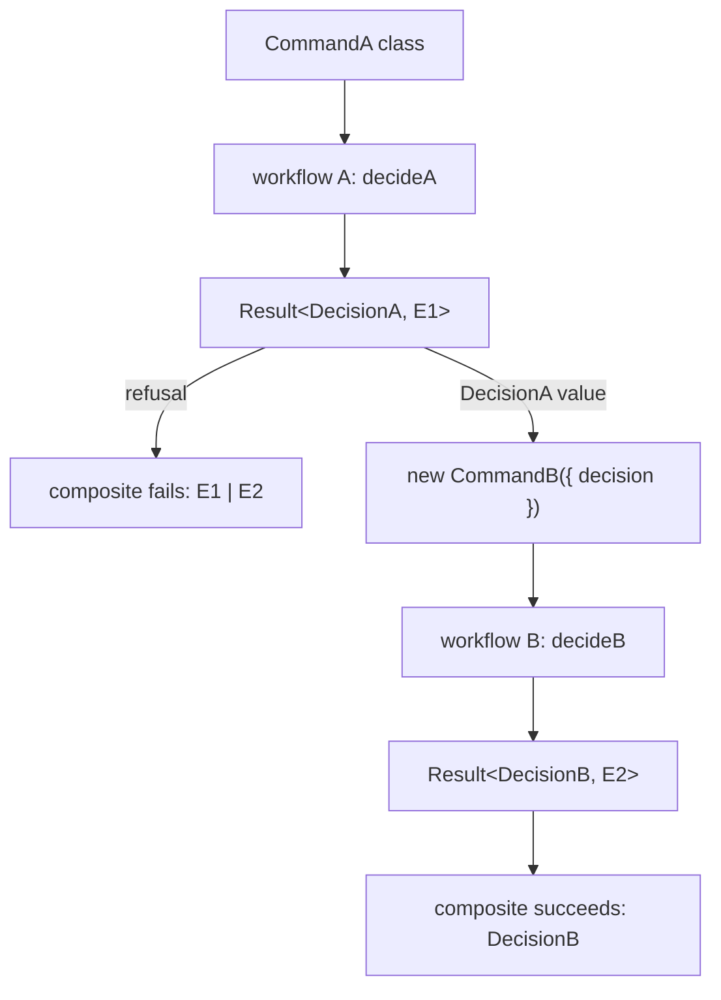

# Cell and Workflow Surface Completion - Plan

## Goal Capsule

- **Objective:** An author migrating an application onto the cell architecture can express conditional execution, per-item aggregation, total decisions, and chained decisions as typed library forms. Separately: the two invariants previously enforced by review alone (variant reachability, run placement) fail CI instead of compiling as costumes.
- **Means:** Extend `packages/effect-cell-types` (KTD1, KTD2, KTD3), widen the make-boundary kernel and ship two lint rules (KTD4, KTD5), and resolve every existing mid-tree `Cell.run` call site — migrate or explicitly designate (KTD6).
- **Product authority:** GitHub issues #393, #394, #395 on `systemfsoftware/systemfsoftware` (amended 2026-09-11), as refined by the Key Decisions below.
- **Open blockers:** none.
- **Stop conditions:** the `UnsharedTypeId` repair exceeding type-level scope (see Risks).

---

## Product Contract

Product Contract preservation: Problem Frame reworded to track the amended issues; R14 added for the user-selected migration scope; OQ2 and OQ3 resolved by planning (KTD3, KTD5); R-IDs R1–R13 unchanged.

### Summary

Complete the cell/workflow type surface and close its two unenforced invariants. `effect-cell-types` gains a total-decision constructor, a composite-workflow constructor, and `gate`/`collect` Cell combinators — all four shapes compile-verified by a spike against the real package source. The oxlint fleet gains variant-reachability and `Cell.run`-placement rules on a widened make-boundary kernel, and every `Cell.run` call site the placement rule fires on is migrated or explicitly designated rather than exempted.

### Problem Frame

The trigger is a real migration: moving `omp-claude-compat` onto the cell architecture hit the type surface's edges in two places. Its referenced-file loader hand-writes a dynamic-N read with per-item skips as bare `null` returns in shell Effect code, because no `collect` or `gate` combinator exists. That hand-written form stays typed through Effect's own channel inference, but it is invisible to every rule and audit that keys off the Cell brand — the shape stops being a node any tooling can see. Its hook-verdict workflow carries three genuinely total sub-decisions as plain if/else string-union functions, because `Workflow.make` rejects a `never` error channel unconditionally — so those decisions get no brand, no `Match.tag` dispatch, and no marker discipline, and the chains between them are wired ad hoc inside the decide body where the composite's signature hides inner refusals.

Separately, two architecture invariants are enforced by review alone: a workflow may declare error variants no code path constructs, and `Cell.run` may be called from any file. The run-placement invariant is a new decree, not an existing one — no constitution rule or package doc states it today. Issue #395's purity claim, amended to credit `make-body-purity`, remains contradicted by verified code: `no-io-in-phase-bodies` already covers the `Cell.layer` decode/decide/encode spec bodies, derives its phase set from `Cell.vocabulary` at load time, and is registered at `error` severity. #395 is therefore rescoped to the two invariants that are genuinely unenforced.

### Key Decisions

- **#395 rescoped to variant reachability and `Cell.run` placement.** The purity invariant the issue asked to enforce is already enforced by the vocabulary-derived `no-io-in-phase-bodies` rule. (session-settled: user-directed — chosen over extending the purity rule or keeping the issue as written: the existing rule already does what the issue's non-counting outcomes demand, vocabulary-sourced.) Governs R9, R10, R11.
- **#394 keeps both halves — total constructor and composite constructor.** The composite completes the Workflow type's algebra the way `andThen` completes Cell's, at the decision altitude: `Cell.andThen` composes sandwiches with their own I/O phases, the composite composes pure decisions inside one decide slot, and the two are not substitutes. (session-settled: user-directed — chosen over cutting the composite as speculative: chains of branded total workflows are unobservable precisely because #394a's absence suppresses them, and the migration already wires such chains ad hoc.) Governs R1, R2, R3, R4.
- **Library and lint only; the omp-claude-compat migration validates downstream.** Acceptance criteria stay package-local as the issues wrote them. (session-settled: user-directed — chosen over migration-shaped acceptance fixtures and a full-arc migration PR: the proving ground lives in the `omp-claude-compat` repo on its own schedule.)
- **The CONCEPTS.md wording correction rides with this arc.** The `Description` entry's claim that the purity rule reads "the call graph reachable from the body" is corrected to the rule's actual "written inside" reach, in its own commit — CONCEPTS.md is a Doctrine surface. (session-settled: user-directed — chosen over leaving it for a docs pass: the arc already touches the rule the line describes, and doctrine drift compounds.) Governs R13.
- **The `Cell.run` rule lands with the existing call sites migrated or explicitly designated, never exempted by default.** The verified inventory: `stryker-js-cli/src/Output.ts:430`, `stryker-js-cli/src/Survivors.ts:213`, `stryker-js-engine/src/Checker.ts:525` and `:576`, `stryker-js-engine/src/Run.ts:1317-1319`, `stryker-js-typescript-checker/src/Checker.ts:127`, `:135`, `:156`, `stryker-js-vitest-runner/src/Runner.ts:1286`, and `effect-daemon-spec/src/internal/SupervisorBodyExecutor.ts:211` and `:295`. (session-settled: user-directed — chosen over a dated baseline and over deferred enrollment: the clean end state, and the rule's first-run failure set becomes the resolution list.) Governs R14.
- **Delivery sequence: #394, then #393, then #395.** The new total constructor changes what the existing make-keyed workflow rules must recognize as lawful, so the lint unit lands last and verifies that recognition. The two library deliveries share a package but ship as separate commits with separate changesets. The two lint rules share no substrate — R9 keys on the workflow-construction boundary, R10 on package entry-point designation — so they may ship as independent deliveries, both as siblings in the existing plugin packages; no new plugin package is created.

### Requirements

**Workflow constructors (#394)**

- R1. A total-decision constructor brands a decide function returning at least two tagged decision variants sharing one TypeId with error channel `never`; it reuses the existing `SingleVariantDecision`/`UntaggedDecision`/`UnsharedTypeId` markers, so a single-variant total function still fails with `SingleVariantDecision`.
- R2. `Workflow.make` behavior is unchanged: a `never` error channel still fails with `UninhabitedError`, covered by a regression type test.
- R3. A composite-workflow constructor wires one workflow's decision output into the next workflow's command by declared dispatch; its error channel is inferred as the union of its components' error channels, and its public signature admits no adapter-lambda parameter.
- R4. Both constructors are accepted by `Cell.layer`'s decide slot without casts, proven by an integration test, not only isolated type tests.

**Cell combinators (#393)**

- R5. A `gate` combinator runs a cell only when a preceding read produces `Option.some`, yielding `Cell<I, Option<A>, E, R>` with the read's E and R channels unioned in; on skip the result is `Option.none` and the inner cell's `read` and `write` demonstrably never execute (runtime test, not type test alone).
- R6. A `collect` combinator maps each item of a collection to a cell and folds all results with an unbranded pure function, yielding `Cell<readonly Item[], B, E, R>` with item-level channels unioned; the fold's signature carries no `WorkflowBrand`.
- R7. Collect's refusal policy ships both named forms per the Key Decision: `collect` as the fail-fast default fails the cell on an item refusal, and `collectAll` (directional name per KTD3) as the accumulate opt-in delivers all per-item results — refusals included — to the fold; each form is tested on an all-success run and a run containing a refusal.
- R8. Neither combinator's public signature nor use sites require `WorkflowBrand`; both match the existing dual curried/data-first style of `map`/`andThen`/`zip`/`provide` and are exported from the package's public surface beside `andThen`/`zip`.

**Lint rules (#395, rescoped)**

- R9. A variant-reachability rule fails lint when a variant declared in a workflow's decision or error union is never constructed in that file, and stays silent when every declared variant is constructed; construction is read from constructor call sites in the file, not from the union declaration. A filename may select which files the rule visits; the construction boundary, widened per KTD4, decides every verdict.
- R10. A `Cell.run` placement rule fails `Cell.run` calls outside a composition root and passes them inside one; the sole composition root is each package's process entry module (`main.ts`), and the designation mechanism is named in the rule's documentation along with the invariant it establishes.
- R11. Both rules ship with RuleTester fixtures that prove the rule fails the lint run on the costume shape and stays silent on lawful shapes — including `andThen` composition, pure Schema transforms, test files, and workflows built with the new constructors; all pre-existing plugin rules still pass, and the existing make-keyed workflow rules are verified to accept the constructors of R1 and R3 as lawful workflow construction.

**Migration**

- R14. Every existing mid-tree `Cell.run` call site — the nine verified sites in `stryker-js-cli` (`Output.ts:430`, `Survivors.ts:213`), `stryker-js-engine` (`Checker.ts:525`, `:576`, `Run.ts:1317-1319`), `stryker-js-typescript-checker` (`Checker.ts:127`, `:135`, `:156`), `stryker-js-vitest-runner` (`Runner.ts:1286`), and `effect-daemon-spec` (`SupervisorBodyExecutor.ts:211`, `:295`) — migrates so the placement rule of R10 passes with the sole composition root being each package's entry module (`main.ts`), with no baseline and no exemption.

**Release and gates**

- R12. Each publishable package whose build hash changes ships a `.changeset/` intent per repo law: `effect-cell-types` and the owning plugin packages as feature bumps, plus the migrated stryker-js packages (the `make-boundary` kernel is `private: true` and ships no intent); each owning package's typecheck, lint, and test scripts exit 0 as the gatekeeper criterion from the issues.

**Doctrine**

- R13. `CONCEPTS.md`'s `Description` entry is corrected so its phase-purity sentence names the rule's actual reach — I/O written inside the body or a same-file module-level helper the body calls, transitively, with closure-captured bindings and imported helpers stated as the honest bound — matching the rule's own scope note, in a commit of its own with no code change beside it.

### Acceptance Examples

- AE1. **Covers R5.** Given a gate whose preceding read yields `Option.none`, when the composed cell runs, then the result is `Option.none` and instrumentation shows the inner cell's `read` and `write` never executed.
- AE2. **Covers R5.** Given the read yields `Option.some(x)`, when the composed cell runs, then the inner cell executes on `x`, the result is `Option.some(a)`, and the read's error and requirement channels appear in the result type.
- AE3. **Covers R7.** Given a fail-fast collect over N items where item k's cell refuses, when the composed cell runs, then the cell fails with item k's refusal and the fold never runs.
- AE4. **Covers R7.** Given an accumulate collect over N items where item k's cell refuses, when the composed cell runs, then the fold receives all N per-item results including item k's refusal as data.
- AE5. **Covers R1, R4.** Given a decide function returning two tagged variants sharing a TypeId with error channel `never`, when branded with the total constructor, then it is accepted by `Cell.layer`'s decide slot with no casts.
- AE6. **Covers R1.** Given a total function returning a single variant, when passed to the total constructor, then compilation fails with the existing `SingleVariantDecision` marker.
- AE7. **Covers R3.** Given a composite of two workflows where the first component refuses, when the composite runs, then the second component never executes, and a consumer matching on the first component's refusal variant compiles without casts.
- AE8. **Covers R9.** Given a workflow file declaring an error-union variant no code path constructs, when linted, then the rule fails the run; the same file with the variant constructed passes.
- AE9. **Covers R10.** Given `Cell.run` called in a package's entry-point module, when linted, then it passes; the same call in a non-root module fails.
- AE10. **Covers R1.** Given a total function returning two tagged variants carrying different TypeIds, when passed to the total constructor, then compilation fails with the existing `UnsharedTypeId` marker.

### How This Work Fits Together

<!-- ce-section: work-relationships -->

This plan owns the library and lint arc across issues #393, #394, and the rescoped #395, plus the call-site migrations that arc's placement rule makes necessary. The broader breakdown below is current understanding, not a committed roadmap.

- **omp-claude-compat migration to the cell architecture** (separate repo: `systemfsoftware/omp-claude-compat`)
  - Depends on this plan: its untyped loader and unbrandable total sub-decisions are the motivating evidence, and it adopts the new forms once published — its adoption is this arc's downstream validation signal, tracked as a follow-up issue in that repo when this plan lands; the arc's own Definition of Done is not gated on it.
  - Can proceed independently of this plan only by continuing to hand-write the shapes this plan types.
- **Phase-purity coverage extension** (`yield*`, `Date.now`, `Math.random` in the existing `no-io-in-phase-bodies` rule)
  - Still to decide: cut from #395 with the rescope; a future audit may reopen it.

### Scope Boundaries

- Changes to `Workflow.make`'s existing markers — R2 pins them as unchanged.
- Per-variant fan-out composition (routing different decision variants to different next workflows) — a different algebra nobody has asked for.

#### Deferred to Follow-Up Work

- The `omp-claude-compat` migration itself — validates downstream in its own repository and PR.
- Any new or extended phase-purity rule — the invariant is already enforced; coverage extension is cut per the #395 rescope.
- A purity rule covering `Effect.*` constructors beyond the vocabulary's `ioCells` classification — same cut.

---

## Planning Contract

### Key Technical Decisions

- KTD1. **Total constructor: marker on the decider's return, command-class arity.** The decider's return type carries `Result<D, never> & DecisionShape<D>` — a parameter-position conditional collapses to `unknown`, a measured trap. The constructor takes the command class value first, exactly like `make`, so the command channel stays pinned to the class rather than an inferred annotation. It ships inside `Workflow.ts`: the brand is module-internal, and a consumer-side brander fails with `not assignable to type 'WorkflowBrand'`. (session-settled: user-approved — chosen over the decider-only arity: the spike proved both compile, and the class arity preserves the command no-leak property.) Governs R1, R2.
- KTD2. **Composite: wrapper-command chain, spike-verified.** The downstream workflow's command class declares a `decision` field over the upstream decision union; the composite receives both command classes and both workflows as values and constructs the wrapper internally — no adapter lambda exists in the signature. The error channel infers as `E1 | E2` and the first component's refusal short-circuits via `Result.flatMap`. Parameters are spelled as expanded intersections (`((command: C) => Result<D, E>) & WorkflowBrand`) because the `Workflow` alias is a deferred conditional and not callable under generic channels. (session-settled: user-approved — chosen over union-as-command, a dispatch table, and a Match-body: union-as-command is proven impossible (TS2739: a union is not a `Schema.Class` value), and an adapter lambda is an unbranded decide.) Governs R3, R4.
- KTD3. **Both combinators ship inside `Cell.ts`; gate is two-cell, collect is one-cell-per-item, sequential.** `Cell`'s `make` is module-private, so no consumer-side assembly exists; both combinators follow the shipped `dual(2, …)` overload template of `andThen`/`zip`. `gate(reader, inner)` takes a reader cell producing `Option<Raw>` and an inner cell consuming `Raw`; a skip propagates `Option.none` and an inner refusal propagates as a failure, never as `none`. `collect(cell, fold)` runs one cell per item in iteration order — sequentially, so the interruption question dissolves; the fail-fast form's fold receives `readonly A[]` and runs only when every item succeeded; the accumulate form's fold receives `readonly Result<A, E>[]`; an empty collection hands the fold `[]`. The accumulate form's name is directional: `collectAll`. Governs R5, R6, R7, R8.
- KTD4. **The make-boundary kernel widens to a declared constructor-member set.** `packages/oxlint-plugin/make-boundary/src/MakeBoundary.ts` hard-codes the member name `make`; it becomes a declared set (`make`, `total`, `andThen`), and every make-keyed rule keeps keying on the boundary — never a filename, which is the retired unfalsifiable key. `workflow-file-make-presence` relaxes to "constructed with a recognized constructor," so a file built purely with the composite is not falsely reported. Governs R9, R11.
- KTD5. **The composition root is the process entry module, `main.ts`, and nothing else.** The placement rule keys on the entry basename exactly as the entrypoint fleet already does (EP1); there is no `compositionRoots` option and no additional-root designation — a `Cell.run` outside `main.ts` fails, full stop. A per-file basename check reads no disk facts, so OX-TS2 is satisfied without configuration. The rule's documentation states the invariant it establishes: run placement is a new decree, not an existing doctrine entry — the `CELL-L4/L6` rules cited in debate do not exist. The EP1 re-pin adds the new rule to the existing entry-designation count. Governs R10.
- KTD6. **Landing choreography: rules at `error`, enrollment after migration.** Both new rules land at `error` severity — `warn` fails no command in this repo. A placement-rule enrollment in a package carrying violating sites happens only after U8 migrates those sites, so no lint run ever goes red on grandfathered debt. (session-settled: user-directed — chosen over a dated baseline and over deferred enrollment: grandfathered debt reads as protection while nothing improves.) Governs R10, R14.
- KTD7. **Test-layer map.** Type claims are tstyche assertions in `test-types/*.tst.ts`; behavior claims are gherkin composition tests through `Cell.run` in `tests/` using the trace-array pattern (observation is a local closure, never a service); lint rules get RuleTester costume/lawful pairs with per-fixture comments naming the mutant each case kills. Symbol-keyed negatives tstyche cannot assert are pinned by the package's own `tsc` compile sweep. Every proposed test runs in-process through a published surface — no process spawns, no test-born exports. Mutation runs in CI only (REPO-D3).

### High-Level Technical Design

The composite's mechanics (KTD2), compile-verified by the spike:



Unit dependencies and delivery order:

```mermaid
flowchart TB
  U1[U1 total constructor] --> U2[U2 composite constructor]
  U2 --> U5[U5 widen make-boundary]
  U5 --> U6[U6 reachability rule]
  U5 --> U7[U7 Cell.run placement rule]
  U9[U9 CONCEPTS.md fix — independent]
  U7 --> U8[U8 resolve Cell.run sites: migrate or designate]

### Sequencing

Four deliveries, per the settled Key Decision: (1) U1 then U2 — issue #394; (2) U3, U4 — issue #393; (3) U5, then U6 and U7 — issue #395; (4) U8, then enrollment of the placement rule in the five packages that carried violating sites. U9 lands at any point as its own `docs:` commit. Each library or plugin delivery ships its own changeset per R12.

### Alternatives Considered

- **Union-as-command for the composite** — rejected, compile-verified: TS2739, a union schema is not a `Schema.Class` value.
- **`Schema.Class`-typed constructor parameter** — rejected, compile-verified: TS2345 twice; the class constructor returns the struct, and its props type is a deferred conditional generics cannot relate.
- **Field name as a type parameter** — rejected, compile-verified: TS2345, a computed generic key yields a string index signature.
- **Caller-side branding (unbranded composer + `make` at each call site)** — rejected: compiles, but `make-body-purity` refuses the composed call, so the constructor must live in the library.
- **Dispatch table or Match-body for the composite** — rejected in dialogue; the wrapper-command chain needs neither.
- **Whole-graph guard script for placement** — rejected: placement is per-file decidable given a configured designation, and a lint rule sits where the fleet's other placement invariants live.

- **Dated baseline for the existing `Cell.run` violations** — rejected by the user in favor of migration.


| Risk | Mitigation |
|---|---|
| The `UnsharedTypeId` marker fired no diagnostic in the spike on two variants with different TypeIds — R1's marker reuse may inherit a toothless marker | U1 pins the marker with a compile-sweep test; if the pin shows it dead, repair the marker (produced by the private `SharedTypeId` helper) inside U1 (type-level only) |
| A migration site proves to be a legitimate composition root | Goal Capsule stop condition: declare it in the rule's configuration and narrow R10 instead of forcing the move |
| `make-boundary` has no test suite of its own (it is a bundled kernel, not a plugin) | Widening is verified through the consumer rules' fixture suites, green before and after; the widening commit is observed red first (a recognition fixture fails pre-widening) |
| The entrypoint plugin's EP1 gate counts the configs carrying the entry designation; a fourth changes that gate expression | The EP1 re-pin is its own commit, observed red then green — Evaluator-surface discipline |
| The new rules sit inside `packages/oxlint-plugin`, which the author of a judged workflow can edit | Standing repo discipline (CONST-E9, Evaluator surface class) already governs; no new mechanism in this plan |

### Sources

- Compile-verified spike (untracked scratch; deleted before the first lint run per Definition of Done): `packages/effect-cell-types/spike/` — `chain-structural-ctor.workflow.ts` is the composite's proven shape, `probe/E2-total.ts` the total constructor's, `expect-fail/` the captured dead ends.
- Rule-authoring law: `packages/oxlint-plugin/AGENTS.md` (OX-TS1/TS2, OX-RT1, OX-MG1, topology) and `packages/oxlint-plugin/oxlint-plugin-effect-entrypoint/AGENTS.md` (EP1).
- Pattern sources: `packages/effect-cell-types/src/Cell.ts:172-243` (the `dual(2, …)` template), `packages/effect-cell-types/test-types/Workflow.tst.ts` (tstyche idiom), `packages/effect-cell-types/tests/interpreter.integration.test.ts` (trace-array composition tests), `packages/oxlint-plugin/oxlint-plugin-cell-vocabulary/src/rules/__tests__/no-io-in-phase-bodies.test.ts` (RuleTester convention).
- Learnings: `docs/solutions/architecture-patterns/constructor-rule-boundary.md` (parameter-position trap; a type retires no rule), `docs/solutions/architecture-patterns/label-routed-rules-are-unfalsifiable.md` (no filename keys), `docs/solutions/architecture-patterns/typed-overloads-need-a-keyless-union.md` (the overload shape), `docs/solutions/architecture-patterns/phantom-marks-are-donatable.md` (marker tests name the resolved type, never assignability), `docs/solutions/tooling-decisions/rule-admission-severity-and-accretion.md` (error, never warn), `docs/solutions/build-errors/composition-root-cannot-self-detect-as-entry.md` (designation canon).
- Migration sites: `packages/stryker-js/stryker-js-typescript-checker/src/Checker.ts:126-158`, `packages/stryker-js/stryker-js-vitest-runner/src/Runner.ts:1285-1292`, `packages/stryker-js/stryker-js-engine/src/Run.ts:1311-1320`; the root/entry exemplar pair is `packages/stryker-js/stryker-js-cli/src/main.ts` (entry) and `packages/stryker-js/stryker-js-cli/src/Output.ts` (root).

---

## Implementation Units

### U1. Total-decision constructor

- **Goal:** `Workflow.total` brands a never-failing multi-variant decision, reusing the existing markers.
- **Requirements:** R1, R2; AE5, AE6.
- **Dependencies:** none.
- **Files:** `packages/effect-cell-types/src/Workflow.ts`, `packages/effect-cell-types/test-types/Workflow.tst.ts`, `packages/effect-cell-types/test-types/Cell.tst.ts` (decide-slot acceptance probe).
- **Approach:** Follow KTD1. Reuse the fixture decision family in `packages/effect-cell-types/tests/__fixtures__/Decision.schema.ts`. The marker chain for this constructor resolves `DecisionError = never` as the accepted case, with `SingleVariantDecision`/`UntaggedDecision`/`UnsharedTypeId` still firing. Ship with a `minor` changeset for `effect-cell-types` per R12.
- **Execution note:** Start from the spike's proven signature (`packages/effect-cell-types/spike/probe/E2-total.ts`) and implement the type tests first.
- **Test scenarios:**
  - Covers AE5. A two-variant total decision brands and is accepted by `Cell.layer`'s decide slot — tstyche plus a `Cell.tst.ts` integration probe.
  - Covers AE6. A single-variant total function fails with `SingleVariantDecision` — tstyche.
  - Untagged variants fail with `UntaggedDecision` — tstyche.
  - `Workflow.make` with a `never` error channel still fails with `UninhabitedError` — regression tstyche assertion (R2).
  - Covers AE10. Two variants with different TypeIds are probed under the package's own `tsc` sweep — this pins the spike's toothless-`UnsharedTypeId` finding; if the pin shows the marker dead, repair the marker (produced by the private `SharedTypeId` helper) in this unit (type-level only).
- **Verification:** `pnpm --filter @systemfsoftware/effect-cell-types typecheck`, `test`, and `test:types` exit 0.

### U2. Composite-workflow constructor

- **Goal:** `Workflow.andThen` chains two workflows with an inferred error-channel union and no adapter lambda.
- **Requirements:** R3, R4; AE7.
- **Dependencies:** U1.
- **Files:** `packages/effect-cell-types/src/Workflow.ts`, `packages/effect-cell-types/test-types/Workflow.tst.ts`, `packages/effect-cell-types/tests/` (runtime short-circuit scenario), `packages/effect-cell-types/test-types/Cell.tst.ts` (decide-slot acceptance probe).
- **Approach:** Follow KTD2 and the spike's `spike/chain-structural-ctor.workflow.ts` shape. The downstream command class declares the `decision` field over the upstream decision union. Parameters are spelled as expanded intersections, not the `Workflow` alias.
- **Execution note:** Type tests first; the spike's `expect-fail/` directory already carries the dead ends to re-derive as negative assertions.
- **Test scenarios:**
  - A two-workflow chain compiles with the error channel inferred as the union — tstyche; a hand-narrowed error-channel annotation is rejected (control).
  - Covers AE7. First-component refusal short-circuits: the second workflow never executes — gherkin composition test with the trace-array pattern.
  - A consumer matching on the first component's refusal variant compiles without casts — tstyche.
  - The composite is accepted by `Cell.layer`'s decide slot — `Cell.tst.ts` integration probe (R4).
  - A downstream command class lacking the `decision` field is rejected — tstyche.
- **Verification:** same three package scripts as U1 exit 0.

### U3. `Cell.gate` combinator

- **Goal:** Conditional cell execution with the skip visible as `Option.none`.
- **Requirements:** R5, R8; AE1, AE2.
- **Dependencies:** none (touches only `Cell.ts`; the Sequencing section ships it with #393 independently of U1).
- **Files:** `packages/effect-cell-types/src/Cell.ts`, `packages/effect-cell-types/test-types/Cell.tst.ts`, `packages/effect-cell-types/tests/interpreter.integration.test.ts` (or a documented sibling).
- **Approach:** Follow KTD3. Two-cell form `gate(reader, inner)`; implement via the module-private `make`, run-wrapping like the six existing arrows. An inner refusal propagates as a failure, never as `none`.
- **Test scenarios:**
  - Covers AE1. Skip: the reader yields `Option.none`; the result is `Option.none` and the trace array shows the inner cell's `read` and `write` never ran — gherkin composition test.
  - Covers AE2. Run: the reader yields `Option.some(x)`; the inner cell executes on `x` and the result is `Option.some(a)` — composition test; the reader's E and R channels union into the result type — tstyche.
  - Inner refusal propagates as the composed cell's failure, not `Option.none` — composition test.
  - Both dual forms compile; no `WorkflowBrand` appears in the signature — tstyche (R8).
- **Verification:** same three package scripts exit 0; changeset per R12.

### U4. `Cell.collect` combinator, both refusal regimes

- **Goal:** Dynamic-N per-item execution with an unbranded fold, in a fail-fast default form and a named accumulate form.
- **Requirements:** R6, R7, R8; AE3, AE4.
- **Dependencies:** none (touches only `Cell.ts`; the Sequencing section ships it with #393 independently of U1).
- **Files:** `packages/effect-cell-types/src/Cell.ts`, `packages/effect-cell-types/test-types/Cell.tst.ts`, `packages/effect-cell-types/tests/interpreter.integration.test.ts` (or the same sibling as U3).
- **Approach:** Follow KTD3. One cell per item, sequential in iteration order. `collect(cell, fold)` fails on the first item refusal and its fold receives `readonly A[]` only on full success; the accumulate form's fold receives `readonly Result<A, E>[]`. An empty collection hands the fold `[]`.
- **Test scenarios:**
  - N items run the inner cell exactly N times and the fold receives all N results — composition test with the trace array.
  - Covers AE3. Fail-fast: item k's refusal fails the cell with that refusal and the fold never runs.
  - Covers AE4. Accumulate: a run containing a refusal delivers all N per-item results to the fold, refusals as data.
  - Empty collection: both regimes hand the fold `[]` — composition test.
  - Item-level E and R channels union into the result type; the fold's signature carries no `WorkflowBrand` — tstyche (R6, R8).
- **Verification:** same three package scripts exit 0; changeset per R12 (one feature bump covering U3 and U4 is acceptable if they ship in one delivery).

### U5. Widen the make-boundary kernel

- **Goal:** Every make-keyed rule recognizes `total` and `andThen` as workflow constructors.
- **Requirements:** R11 (the recognition half); enables R9.
- **Dependencies:** U2.
- **Files:** `packages/oxlint-plugin/make-boundary/src/MakeBoundary.ts`, `packages/oxlint-plugin/oxlint-plugin-effect-workflow/src/rules/__tests__/` (existing suites' lawful fixtures extended, including `make-file-location`'s).
- **Approach:** Follow KTD4. Replace the hard-coded member name with a declared constructor-member set. `workflow-file-make-presence` relaxes to "constructed with a recognized constructor." The kernel's documented bound (re-export chains are not followed) is restated where the member set is declared.
- **Execution note:** Evaluator-surface discipline: this commit is observed red first — a fixture building a workflow with `total` or `andThen` fails `workflow-file-make-presence` before the widening, passes after.
- **Test scenarios:**
  - Pre-widening: a `*.workflow.ts` built only with the composite constructor is falsely reported as missing a construction — captured as the red observation.
  - Post-widening: that file passes; a composite-only file counts as one construction site, and a file constructing with both `make` and `andThen` still holds two decisions and still fails the one-construction-per-file rule.
  - All pre-existing make-keyed rule suites pass unchanged.
- **Verification:** `pnpm --filter @systemfsoftware/oxlint-plugin-effect-workflow test` and `typecheck` exit 0.

### U6. Variant-reachability rule

- **Goal:** A declared decision or error variant that no code path constructs fails lint.
- **Requirements:** R9, R11; AE8.
- **Dependencies:** U5.
- **Files:** `packages/oxlint-plugin/oxlint-plugin-effect-workflow/src/rules/workflow-variant-constructed.ts` and `.config.ts` (names directional), `src/rules/__tests__/`, `src/index.ts` registration and recommended config, the plugin README's rule table.
- **Approach:** Keyed on the widened construction boundary (KTD4), never the filename. Declared variants are read from the named union alias and from the decider's inline `Result.Result<A | B, E>` return annotation — both forms occur in the corpus. Construction is recognized as `new X(…)` and `X.make(…)` call sites in the same file. The message states the rule's exact reach (in-file construction sites only), following the message-discipline pattern of the cell-vocabulary plugin.
- **Test scenarios (RuleTester pairs, each fixture commenting the mutant it kills):**
  - Covers AE8. Costume: a declared error-union variant never constructed fails the run; the same file with the variant constructed passes.
  - Lawful: a decision union declared as a named alias and one declared inline in the decider's return annotation are both read.
  - Lawful: workflows built with `total` and `andThen` (post-U5 recognition).
  - Lawful: a variant constructed via `X.make(…)` counts as constructed.
- **Verification:** the plugin's `test`, `typecheck` (both tsconfig passes), and `lint` scripts exit 0; changeset per R12.

### U7. `Cell.run` placement rule

- **Goal:** `Cell.run` outside the process entry module fails lint.
- **Requirements:** R10, R11; AE9.
- **Dependencies:** U5.
- **Files:** `packages/oxlint-plugin/oxlint-plugin-effect-entrypoint/src/rules/cell-run-placement.ts` and `.config.ts` (names directional), `src/rules/__tests__/`, `src/index.ts`, the plugin README, and the plugin `AGENTS.md` EP1 re-pin.
- **Approach:** Follow KTD5. The rule keys on the entry basename (`main.ts`) exactly as the entrypoint fleet already does; there is no configuration knob — a `Cell.run` outside `main.ts` fails, full stop. Test-file patterns are exempt. The rule's documentation names the designation mechanism and states the invariant it establishes. The EP1 gate expression's re-pin (a fourth config carrying the entry designation) is its own commit, observed red then green.
- **Test scenarios (RuleTester pairs):**
  - Covers AE9. `Cell.run` in `main.ts` passes; the same call in any other module — including a layer-construction module like the CLI's `Output.ts` — fails the run.
  - Lawful: `Cell.run` in a test-file pattern is exempt.
  - Lawful: `Cell.run` inside a composite-built workflow file (boundary recognition per KTD4 does not misclassify it).
- **Verification:** the plugin's `test`, `typecheck`, and `lint` scripts exit 0; changeset per R12. Enrollment in each package carrying violating sites waits for U8 (KTD6).

### U8. Migrate the nine `Cell.run` call sites to their entry modules

- **Goal:** No mid-tree `Cell.run` remains anywhere in the tree; the placement rule enrolls green.
- **Requirements:** R14.
- **Dependencies:** U7.
- **Files:** `packages/stryker-js/stryker-js-typescript-checker/src/Checker.ts`, `packages/stryker-js/stryker-js-vitest-runner/src/Runner.ts`, `packages/stryker-js/stryker-js-engine/src/Checker.ts`, `packages/stryker-js/stryker-js-engine/src/Run.ts`, `packages/stryker-js/stryker-js-cli/src/Output.ts`, `packages/stryker-js/stryker-js-cli/src/Survivors.ts`, `packages/effect-daemon-spec/src/internal/SupervisorBodyExecutor.ts`, each affected package's entry module, and their existing test suites.
- **Approach:** One package per commit, smallest first. Every migration moves the cell invocation into the package's entry module (`main.ts`) or restructures so the entry composes the cell's effect — there is no designation escape; the only root is `main.ts`. Behavior is unchanged: the observable decision flow per package is pinned by its existing suite before the move.
- **Execution note:** Characterization first: run each package's existing suite before touching its call site; the suite's green state is the migration's guard.
- **Test scenarios:**
  - Each package's existing test suite passes unchanged after its migration.
  - With the placement rule enrolled, each migrated package lints green — and the pre-migration tree would have failed (observed during U8, not committed).
- **Verification:** the five affected packages' `test` and `typecheck` scripts exit 0; the placement rule enrolled in all five reports no findings.

### U9. CONCEPTS.md wording correction

- **Goal:** The `Description` entry's phase-purity sentence matches the rule it describes.
- **Requirements:** R13.
- **Dependencies:** none.
- **Files:** `CONCEPTS.md`.
- **Approach:** Rewrite the sentence to the rule's actual reach per R13's wording. Its own commit, no code change beside it; commitlint's `type-matches-diff-shape` forces a `docs:` type.
- **Test scenarios:** Test expectation: none — doctrine text only.
- **Verification:** `pnpm check:local` exits 0 after the edit.

---

## Verification Contract

| Gate | Command | Covers |
|---|---|---|
| Type assertions | `pnpm --filter @systemfsoftware/effect-cell-types test:types` | U1, U2, U3, U4 |
| Composition tests | `pnpm --filter @systemfsoftware/effect-cell-types test` | U2, U3, U4 (AE1–AE5, AE7) |
| Package typecheck | `pnpm --filter @systemfsoftware/effect-cell-types typecheck` | U1–U4 (includes the compile sweep pinning `UnsharedTypeId`) |
| RuleTester suites | `pnpm --filter @systemfsoftware/oxlint-plugin-effect-workflow test` and `pnpm --filter @systemfsoftware/oxlint-plugin-effect-entrypoint test` | U5, U6, U7 (AE8, AE9) |
| Migration guards | `pnpm --filter <migrated stryker-js package> test` and `typecheck` | U8 |
| Repo gate chain | `pnpm check:local` | all units, after the last edit |
| CI | `gh pr checks --watch --fail-fast` exits 0 | the delivery PR |
| Mutation | CI advisory Mutation workflow only; never local runs (REPO-D3) | U5, U6, U7 |

## Definition of Done

Global:

- Every acceptance example AE1–AE9 is evidenced by a passing test named in its unit.
- The three issues' acceptance criteria hold as rescoped by the Key Decisions; R14's migrations leave no mid-tree `Cell.run` in stryker-js.
- `pnpm check:local` exits 0 after the last edit; the delivery PR is watched to green.
- Every touched publishable package carries its changeset per R12.
- The spike directory `packages/effect-cell-types/spike/` is deleted before the package's first lint run; no abandoned-attempt code remains in the diff.
- Evaluator and doctrine surfaces moved in their own commits (U5's kernel widening, U7's EP1 re-pin, U9's CONCEPTS.md correction), each observed red before green where a gate exists.

Per-unit:

| Unit | Done when |
|---|---|
| U1 | `total` brands a total decision, refuses single-variant with the existing marker, and `make` is unchanged |
| U2 | `andThen` chains two workflows with an inferred refusal union and compiles into `Cell.layer`'s decide slot |
| U3 | A skipped gate provably never executes the inner cell |
| U4 | Both collect regimes run N items and fold per their contract, including the empty collection |
| U5 | All make-keyed rules recognize the new constructors; pre-existing suites unchanged and green |
| U6 | The reachability rule fails the costume fixture and passes every lawful fixture at `error` severity |
| U7 | The placement rule passes designated roots and test files, fails non-roots, and names its designation mechanism |
| U8 | All three call sites migrated or declared under the stop condition; placement rule enrolled green in the three packages |
| U9 | The `Description` entry names the rule's actual reach; own `docs:` commit |
```
