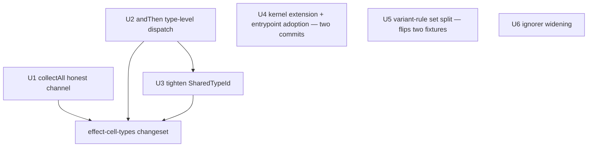

# Cell and Workflow Follow-Up Review Findings - Plan

## Goal Capsule

- **Objective:** The cell/workflow surface shipped in #404 tells the truth to its consumers: a combinator that cannot fail declares `never`, two total workflows compose into a total composite, the family-brand predicate accepts only a genuine shared family TypeId, and the lint fleet's mirrored boundary logic shares one kernel instead of drifting copies.
- **Means:** Repair `collectAll`'s declared error channel, teach `Workflow.andThen` a type-level dispatch on the component error union, tighten the `SharedTypeId` predicate (KTD1–KTD3); extend the import-origin kernel for string-named specifiers and adopt it in the runtime-construction rule as one delivery, split the variant rule's conflated name set (flipping the two fixtures that pinned the conflation), and widen the Stryker ignorer mirror (KTD4–KTD6).
- **Product authority:** the user's unapplied review findings from the #404 review, delivered as this session's invocation brief, with the four open forks settled by the user on 2026-09-12 (Key Decisions).
- **Open blockers:** none.
- **Stop conditions:** the tightened `SharedTypeId` predicate rejects a lawful decision family — in the tree or in the documented `Symbol.for` brand idiom (see Risks — stop and re-surface, do not ship a looser predicate silently).

---

## Product Contract

Product Contract preservation: no upstream contract — this run is `ce-plan-bootstrap` from the review-findings brief.

### Summary

Apply the six unapplied follow-up findings from the merged cell/workflow surface arc. Three repair the `effect-cell-types` type surface: `collectAll`'s declared error channel is dishonest (its `Effect.result`-based body cannot fail), `Workflow.andThen` rejects two total components because routing through `make` maps the `never` error union to `UninhabitedError`, and the repaired `SharedTypeId` predicate accepts two variants sharing any unrelated symbol-keyed, symbol-valued property. Three repair the lint fleet: the import-origin kernel learns string-named import specifiers so the runtime-construction rule can delete its vendored binding-resolution walks, the variant-reachability rule splits its conflated name set (a real behavior change: the two fixtures pinning the conflation flip from report to silence, on a shape the compiler already rejects), and the Stryker-side ignorer mirror widens to the full constructor set.

### Problem Frame

Every finding is already measured and pinned by the #404 review; the debt is that the measurements landed as pins documenting known-wrong or known-loose behavior rather than as repairs. A dishonest error channel misinforms every consumer's `Match.exhaustive`; a composite that rejects total components forces the exact hand-written shapes the arc existed to retire; a loose family-brand predicate certifies families that share nothing; and three lint surfaces carry parallel or vendored copies of resolution logic the shared kernel exists to own. Blast radius is verified package-local: `collectAll`, `Workflow.andThen`, and `Workflow.total` have zero production consumers outside `effect-cell-types`, and the corpus carries zero `total`/`andThen` decision bodies today.

### Key Decisions

- **F4 repair shape: narrow `collectAll`'s declared error channel to `never`; the fold stays a pure total function.** (session-settled: user-directed 2026-09-12 — chosen over a Result-returning fold overload that re-raises: the honest channel is the defect; a re-raising fold is a separate feature nobody asked for.) Governs R1.
- **F5 repair shape: the composite's return type dispatches on the component error union — the total form when the union is `never`, the error-carrying form otherwise.** (session-settled: user-directed 2026-09-12 — chosen over a separate named total-chaining form: one constructor name, no new surface, and the union already decides.) Governs R2.
- **F6: tighten `SharedTypeId` in this slice to name the family TypeId identity.** (session-settled: user-directed 2026-09-12 — chosen over leaving the measured behavior pinned: the pin currently certifies a known-loose predicate.) Governs R3.
- **Lint bundle scope: extend the import-origin kernel and adopt it in the runtime-construction rule, split the variant rule's name set, widen the Stryker ignorer; enrolling the entrypoint plugin in `effect-cell-types`' lint config is excluded.** (session-settled: user-directed 2026-09-12 — chosen over including the enrollment: the `.tst.ts` probes are untouched by the construction rule by construction, and the one-line enrollment stays available.) Governs R4, R5, R6, R7.

### Requirements

**effect-cell-types repairs**

- R1. `collectAll`'s declared error channel is `never`. The fold's parameter still carries the item error type as data (`readonly Result.Result<A, E>[]`); the cell's own error channel no longer declares an `E` its `Effect.result`-routed body cannot produce. `collect` (fail-fast) is unchanged.
- R2. `Workflow.andThen` accepts two total components: when the component error union is `never` the composite's return type is the total-branded form (error channel `never`), and when either component carries errors the composite behaves exactly as today. A hand-narrowed error-channel annotation is still rejected, and the composite remains accepted by `Cell.layer`'s decide slot in both regimes.
- R3. The decision-family check accepts a union only when every variant is a Schema TaggedClass instance and the variants share one symbol key whose per-variant value types are mutually assignable — one identical unique-symbol type, which is what a module-scope `Symbol.for` family brand declared as `readonly [T]: typeof T` on each `S.TaggedClass` variant produces. The pinned unrelated-symbol pair — plain interfaces sharing one unique symbol — is refused with `UnsharedTypeId`; interface-typed unions are refused even when genuinely branded (doctrine's decision variants are `S.TaggedClass`; the predicate now enforces it). Every existing refusal pin stays green and every genuine TaggedClass family in the repo's fixtures and stryker-js consumers stays accepted. A consumer accepted under the loose predicate migrates by declaring its variants as `S.TaggedClass` carrying the shared brand; the in-tree census shows zero such consumers.

**Lint fleet repairs**

- R4. The import-origin kernel resolves a string-named import specifier (`import { 'ManagedRuntime' as M } from 'effect'`) to its imported name. No other resolution arm changes behavior.
- R5. `runtime-construction-placement` resolves bindings through the shared kernel; its vendored binding-resolution walks are deleted. Every existing fixture verdict holds, including the pinned string-named-import costume case.
- R6. `workflow-variant-constructed` separates "a variant class is declared in this file" from "a local is bound to a constructed value" into two sets with separate reads. The split flips exactly the two fixtures that pinned the conflation (a value-bound local named in a `Result` annotation is reported today, silent after) — an intended narrowing: those fixtures annotate a `const` value in type position, a shape the compiler itself rejects (TS2749), so the rule's report defended code that cannot compile. All other fixtures and all corpus verdicts are unchanged.
- R7. The Stryker-side make-boundary ignorer recognizes the full constructor-member set: `total` as a body-bearing boundary like `make`, `andThen` as a composing boundary with no decider body — mirroring the oxlint kernel's two-set distinction. The recognition is forward-looking: the corpus carries zero `total`/`andThen` bodies today, so no ignore verdict changes on current code.

**Release and gates**

- R8. Every publishable package whose build hash changes ships a `.changeset/` intent per repo law: `effect-cell-types` minor (consumer-observable type changes), `oxlint-plugin-effect-workflow` patch (R6's narrowed report surface is a behavior change), `stryker-plugins` minor (R7 adds recognized boundaries — forward-looking, exercised today only by the new fixtures), `oxlint-plugin-effect-entrypoint` `none` (verdict-identical internal dedupe plus a private devDependency). `import-origin` and `make-boundary` are private and ship no intent.

### Acceptance Examples

- AE1. **Covers R1.** Given a `collectAll` over items whose cells refuse, when the composed cell's type is inspected, then its error channel is `never`, the fold receives every refusal as `Result` data, and the existing all-success and refusal-containing behavior tests stay green.
- AE2. **Covers R2.** Given two `Workflow.total` components, when composed with `Workflow.andThen`, then the composite carries error channel `never` and the total brand, and is accepted by `Cell.layer`'s decide slot; the current refusal pin flips to an acceptance.
- AE3. **Covers R3.** Given two plain-interface variants sharing one unique symbol with identical self-typed values (the pinned unrelated-brand pair), when branded with `Workflow.total` or `Workflow.make`, then compilation fails with `UnsharedTypeId` — the pins certifying today's acceptance flip to refusals, on TaggedClass membership, not on brand identity (identity alone cannot distinguish the pair from a genuine family).
- AE4. **Covers R4, R5.** Given `import { 'ManagedRuntime' as Managed } from 'effect'` followed by `Managed.make` inside a function body, when linted after the kernel adoption, then the rule still fails the run — the pinned costume fixture stays red against the kernel-resolved binding.
- AE5. **Covers R6.** Given a `const accepted = new Admitted({})` local named in a `Result.Result<accepted, never>` annotation, when linted after the split, then the rule is silent — the two fixtures pinning today's report flip to valid.
- AE6. **Covers R7.** Given a `Workflow.total` decider body containing a mutant, when the Stryker ignorer evaluates it, then the mutant is ignored exactly as a `make`-body mutant is; an `andThen` composite contributes no body and therefore nothing to ignore. The proof is the hand-built equivalent-mutant pair — the corpus carries no `total`/`andThen` bodies to observe.

### Scope Boundaries

- `collect`'s fail-fast semantics — unchanged (R1 names it).
- The `Workflow.make` markers (`UninhabitedError`, `SingleVariantDecision`, `UntaggedDecision`) — unchanged; R2 adds a type-level dispatch, not a marker change.
- The kernel's other resolution arms — R4 names the single arm that changes.
- The variant rule's class-declared and constructed reads beyond the split — R6 names the one set boundary that moves.

#### Deferred to Follow-Up Work

- Enrolling the entrypoint plugin in `effect-cell-types`' lint config — a one-line config change, excluded by the user this slice.
- A Result-returning fold overload for `collectAll` that re-raises — the rejected F4 alternative; revive only if a consumer asks for re-raising.
- The recorded residual: a package-root module imported from source that builds wiring per call escapes the scoped runtime-construction rule. The repo census shows no such module, so this stays a documented residual rather than a guarded one.

---

## Planning Contract

### Key Technical Decisions

- KTD1. **`collectAll` narrows E to `never` in both dual overloads and the `make` instantiation; the fold parameter is unchanged.** The item error type survives only inside the fold's `Result` data. (session-settled: user-directed — chosen over the re-raising fold overload; see Key Decisions.) Governs R1.
- KTD2. **`andThen`'s dispatch lives entirely in the return type; the runtime body does not branch — and no longer routes through `make`.** The return type becomes a conditional on `[E1 | E2] extends [never]`, yielding the total form (`((command: SelfA) => Result<D2, never>) & WorkflowBrand`) or today's `Workflow<SelfA, D2, E1 | E2>`. The decider cannot be handed to `make` in the never regime: `make`'s parameter carries `& Inhabited<D, E>`, which maps a `never` error channel to `UninhabitedError`, so the implementation constructs the same `flatMap` chain and returns it directly under the conditional return type, branded the way `total` brands. `assertWorkflow` and `assertTotal` are compile-time assertion functions with empty bodies, so no runtime dispatch exists or is needed; one internal type assertion at the implementation edge is the standard pattern for a conditional generic return (not outside data — CONST-B5 untouched). The parameters are unchanged — no adapter lambda, no new arity. (session-settled: user-directed — chosen over a separate named form; see Key Decisions.) Governs R2.
- KTD3. **The tightened predicate requires every union member to be a Schema TaggedClass instance AND one shared symbol key whose per-variant value types are mutually assignable.** The identity half is grounded in the language: no two distinct `unique symbol` types are assignable or comparable to each other, so mutual `extends` across the union at a shared symbol key accepts exactly the identical-shared-brand case. The TaggedClass half is what refuses the pinned unrelated pair: that pair is structurally identical to a genuine brand (one shared unique symbol, `readonly [T]: typeof T` on both), so identity alone cannot distinguish it — but its variants are plain interfaces, and doctrine's decision variants are `S.TaggedClass` (CONCEPTS.md), so the predicate enforces the declared variant shape alongside the brand. Interface-typed unions are refused even when genuinely branded — enforcement of the existing doctrinal shape, and the census shows every in-tree family is already class-based. (session-settled: user-directed 2026-09-12 — chosen over identity-only tightening, which the document review proved cannot refuse the pinned pair, and over leaving the measured predicate pinned.) Governs R3.
- KTD4. **Kernel extension and entrypoint adoption ship as one delivery in two ordered commits.** Commit one extends the kernel's `ImportSpecifier` arm to accept a `Literal` `imported` node, resolving its string value as `importedName` — the kernel ships no tests of its own (its AGENTS.md grades it through consumer suites), so the arm lands unexercised for one commit by design, immediately consumed by commit two. Commit two adopts the kernel in `runtime-construction-placement`, deletes the vendored binding-resolution walks, and adds the kernel as a private devDependency (matching `make-boundary`'s consumption — never a runtime dependency). The adoption commit is the Evaluator-surface change and carries the observed-red record: the string-named costume fixture's verdict under kernel-resolved bindings was already measured failing against the unextended kernel in the reverted #404-era attempt and is re-observed on this branch. Walks that answer rule-semantic questions the kernel does not (enclosing-function and module-closure classification are the grain table's, not import origins) stay rule-local — the dedupe targets binding resolution only. The string arm's mutation kill re-homes with the arm: post-dedupe the mutant lives in the kernel, which carries no mutation enrollment of its own — its grading law (IO4) reads the arm through the entrypoint suite's behavioral verdict, and the costume fixture's comment is updated to say so. Governs R4, R5.
- KTD5. **The ignorer widening reproduces the kernel's two-set distinction, not just the member names.** `WORKFLOW_CONSTRUCTOR_MEMBERS = { make, total, andThen }` and `COMPOSING_MEMBERS = { andThen }`: a composing boundary has no decider body, so only `make` and `total` contribute ignorable mutant populations. The Stryker side has no dependency on the oxlint kernel (its own Effect-Schema AST model; the kernel's single-home rule MB1 forbids vendoring), so the widening re-derives the distinction in that vocabulary. Corpus grep shows zero `total`/`andThen` bodies today — no production ignore verdict changes; the widening is forward-looking and arrives with SP2-equivalent-mutant tests. Governs R7.
- KTD6. **Test-layer map follows the packages' standing conventions (CELL-T2, OX-TS1/TS2, SP1–SP3).** Type claims are tstyche assertions; symbol-keyed negatives tstyche cannot assert go through the package's own `tsc` compile sweep; behavior claims are gherkin composition tests with trace-array observation; lint rules get RuleTester costume/lawful pairs run in-process through the rule's published entry; the Stryker ignorer gets gherkin integration scenarios through the plugin's exported selector proving the ignored mutant is equivalent. Every proposed test runs in-process against a published surface — no process spawns, no test-born exports. Mutation runs in CI only (REPO-D3).

### Sequencing

Three independent workstreams; the lint workstream lands every change red-first (fixture at its new verdict, observed failing, then the repair):

U2 and U3 touch the same file (`Workflow.ts`) and serialize; U1 touches only `Cell.ts` and may land in any order within the library workstream. The three library units share one `effect-cell-types` changeset if they ship in one delivery.

### Alternatives Considered

- **Separate named total-chaining form for the composite** — rejected by the user (F5 fork): a second constructor name for a distinction the error union already expresses.
- **Result-returning fold overload that re-raises** — rejected by the user (F4 fork): the defect is the dishonest channel, not a missing feature.
- **Leave `SharedTypeId` pinned as measured** — rejected by the user (F6 fork): the pin certifies a known-loose predicate.
- **Adopt the kernel in the entrypoint rule without extending it** — measured and reverted in the #404 review: the kernel does not resolve string-named import specifiers, and the adoption flipped that pinned fixture's verdict.
- **Kernel extension as its own standalone delivery, adopted later** — rejected in this plan's destructive review: the kernel is graded through consumer suites and ships no tests of its own, so a standalone extension commit lands an arm nothing observes; folding extension and adoption into one delivery makes the red-green arc continuous.
- **Share the oxlint kernel with the Stryker ignorer as a dependency** — rejected by the kernel's own law (MB1/MB2: single home, never a runtime dependency of a plugin); the Stryker side re-derives the two-set distinction in its own AST vocabulary.
- **Preserve the two conflation-pinning fixtures as invalid** — rejected: they annotate a `const` value in type position (TS2749 — a shape the compiler rejects), so the report they pin defends code that cannot compile; the split flips them to silence intentionally (R6).

### Risks

| Risk                                                                                                                                                                                                                                       | Mitigation                                                                                                                                                                                                                                                                                                            |
| ------------------------------------------------------------------------------------------------------------------------------------------------------------------------------------------------------------------------------------------ | --------------------------------------------------------------------------------------------------------------------------------------------------------------------------------------------------------------------------------------------------------------------------------------------------------------------- |
| The tightened `SharedTypeId` predicate rejects a lawful decision family — in the tree or in the documented `Symbol.for` brand idiom (a descendant class re-declaring the same brand, a consumer shape the tree's fixtures do not exercise) | Stop condition on the Goal Capsule: U3 runs the package's full tstyche + `tsc` sweep over every genuine TaggedClass family fixture and the stryker-js consumers, and the Risk row names the documented idiom as the acceptance contract; a lawful family failing stops the unit and re-surfaces — no silent loosening |
| A recorded learning (`grain-table-identifier-three-fates.md`) marks an earlier shape of this predicate as dead (never fired)                                                                                                               | U3's pins demonstrate the tightened predicate fires in both directions before the unit is done — TaggedClass membership refuses the pinned interface pair and mutual assignability accepts every genuine family; a predicate that only accepts is the dead shape returning                                            |
| The kernel extension perturbs `make-boundary`'s other consumers (the kernel is graded through consumer suites, having none of its own)                                                                                                     | U4's first commit runs every consumer plugin suite (`effect-schema`, `effect-workflow` via `make-boundary`) green before the adoption commit starts                                                                                                                                                                   |
| The U5 fixture flip masks a third, unpinned shape that relied on the conflation                                                                                                                                                            | The flip is enumerated exactly (the two value-bound-local fixtures); the full suite plus a corpus grep for value-locals in type position runs before and after, and any third flip is a stop-and-examine, not a re-pin                                                                                                |
| The ignorer widening has no corpus coverage to validate against                                                                                                                                                                            | U6's hand-built fixtures carry SP2's equivalent-mutant proof; the corpus-zero state is recorded so a future `total`/`andThen` adoption re-validates                                                                                                                                                                   |

### Sources

- Review brief: this session's invocation input (the six unapplied findings, F4–F6 plus the three lint-side items), each carrying its measurement.
- Verified surfaces: `packages/effect-cell-types/src/Cell.ts` (`collectAll` at 268–287, `Effect.result` at 284), `packages/effect-cell-types/src/Workflow.ts` (`SharedTypeId` at 46–48, `andThen` routing through `make` at 106–127, markers at 11–39, empty assertion bodies at 129–135), `packages/oxlint-plugin/import-origin/src/ImportOrigin.ts` (string-named rejection at 304), `packages/oxlint-plugin/oxlint-plugin-effect-entrypoint/src/rules/runtime-construction-placement.ts` (native string-named handling at 107–110; ~8 vendored walks), `packages/oxlint-plugin/oxlint-plugin-effect-workflow/src/rules/workflow-variant-constructed.ts` (`declaredNames` at 84, populated at 94 and 104–108, read at 149 and 207), `packages/oxlint-plugin/oxlint-plugin-effect-workflow/src/rules/__tests__/workflow-variant-constructed.test.ts` (the two conflation-pinning fixtures at 524–559), `packages/oxlint-plugin/make-boundary/src/MakeBoundary.ts` (member sets at 33–44), `packages/stryker-js/stryker-plugins/src/workflow-make-ignorer/MakeBoundaryIgnore.ts` (`MAKE_MEMBER_NAME` at 31).
- Pins to flip: `packages/effect-cell-types/test-types/workflows-surface.tst.ts` (the two-total refusal at 167–172; the unrelated-brand acceptance at 197–199 and the constructor acceptance at 205–207), `packages/effect-cell-types/test-types/cells-surface.tst.ts` (the `collectAll` channel assertion at 281).
- External grounding for KTD3: TypeScript handbook, Symbols — `unique symbol` is produced only by `Symbol()`/`Symbol.for()` const declarations and `readonly static` properties, and no two distinct `unique symbol` types are assignable or comparable to each other (https://www.typescriptlang.org/docs/handbook/symbols.html).
- Learnings: `docs/solutions/architecture-patterns/grain-table-identifier-three-fates.md` (the dead-predicate shape U3 must not reproduce), `docs/solutions/architecture-patterns/workflow-success-channel-tagged-union.md` (the marker channel and the tstyche deferral gap), `docs/solutions/architecture-patterns/shared-kernel-mirrors-drift-where-unpinned.md` (kernel/mirror drift), `docs/solutions/architecture-patterns/dynamic-import-blinds-static-provenance-rules.md` (blind input models degrade to no-op), `docs/solutions/logic-errors/shared-ast-helper-vacuums-its-consumers.md` (a shared helper is the reach of every importing rule), `docs/solutions/architecture-patterns/make-boundary-owns-a-decision.md` (the constructor set), `docs/solutions/architecture-patterns/phantom-marks-are-donatable.md` (pin the forge routes), `docs/solutions/architecture-patterns/typed-overloads-need-a-keyless-union.md` (dual overload shape), `docs/solutions/tooling-decisions/rule-admission-severity-and-accretion.md` (error, never warn).
- Governance: `packages/effect-cell-types/AGENTS.md` (CELL-T1–T4), `packages/oxlint-plugin/AGENTS.md` (OX-TS1/TS2, OX-RT1, OX-MG1), `packages/oxlint-plugin/import-origin/AGENTS.md` (IO1–IO4), `packages/oxlint-plugin/make-boundary/AGENTS.md` (MB1–MB4), `packages/oxlint-plugin/oxlint-plugin-effect-entrypoint/AGENTS.md` (EP1–EP5), `packages/stryker-js/stryker-plugins/AGENTS.md` (SP1–SP3).

---

## Implementation Units

### U1. `collectAll` declares the honest channel

- **Goal:** `collectAll`'s error channel is `never`; the fold stays a pure total function over per-item `Result`s.
- **Requirements:** R1; AE1; KTD1.
- **Dependencies:** none.
- **Files:** `packages/effect-cell-types/src/Cell.ts`, `packages/effect-cell-types/test-types/cells-surface.tst.ts`, `packages/effect-cell-types/src/__tests__/admit-decoded-command.workflow.property.test.ts`, `packages/effect-cell-types/tests/cell-combination.integration.test.ts`, `.changeset/` (minor intent for `effect-cell-types`, per R8 — shared with U2 and U3 when they ship together).
- **Approach:** Follow KTD1. Both dual overloads and the `make<readonly I[], B, never, R>` instantiation narrow E; the fold parameter keeps the item error type as `Result` data. The runtime body is already honest (`Effect.result` never fails) — only the declared channel changes.
- **Execution note:** Type-test-first: flip the channel assertion in `cells-surface.tst.ts` (the pin asserting the item error type today) to `never`, observe red, then narrow the signature.
- **Test scenarios:**
  - Covers AE1. The composed cell's type carries error channel `never` while the fold receives `readonly Result.Result<A, E>[]` with the item error type visible as data — tstyche.
  - Existing behavior scenarios stay green unchanged: all-success run, refusal-containing run delivering every refusal to the fold, empty collection handing the fold `[]` — the gherkin composition suite and the property suite are re-run, not rewritten.
  - A consumer `Effect` wrapping a `collectAll` cell does not inherit the item error channel — tstyche.
- **Verification:** `pnpm --filter @systemfsoftware/effect-cell-types typecheck`, `test`, `test:types`, and `lint` exit 0; the consumer-census row of the Verification Contract runs before the pin flips.

### U2. The composite dispatches on the error union at the type level

- **Goal:** `Workflow.andThen` composes two total workflows into a total-branded composite; error-carrying chains are byte-identical in behavior.
- **Requirements:** R2; AE2; KTD2.
- **Dependencies:** none.
- **Files:** `packages/effect-cell-types/src/Workflow.ts`, `packages/effect-cell-types/test-types/workflows-surface.tst.ts`, `packages/effect-cell-types/tests/decision-chaining.integration.test.ts`, `packages/effect-cell-types/tests/__fixtures__/` (a total-pair fixture beside the existing `total-admit-tagged-command.workflow.ts`).
- **Approach:** Follow KTD2. The return type becomes a conditional on `[E1 | E2] extends [never]`. The decider is no longer handed to `make` — `make`'s `& Inhabited<D, E>` parameter constraint maps the `never` union to `UninhabitedError` — so the implementation constructs the same `flatMap` chain and returns it directly under the conditional return type, branded the way `total` brands (a plain function plus a compile-time assertion; both assertion functions are runtime no-ops, so there is no runtime dispatch to implement). The `Cell.andThen` cell-level combinator is untouched.
- **Execution note:** Type-test-first: flip the two-total refusal pin (`workflows-surface.tst.ts:167-172`) to an acceptance, observe red, then implement the conditional.
- **Test scenarios:**
  - Covers AE2. Two `Workflow.total` components compose; the composite's error channel is `never`, it carries the `WorkflowBrand`, and `Cell.layer`'s decide slot accepts it without casts — tstyche plus the `Cell.tst.ts` decide-slot probe pattern.
  - An error-carrying chain still infers the union and behaves as today — the existing T13 assertions stay green unmodified.
  - A total upstream with an error-carrying downstream (and vice versa) infers the carried channel, not `never` — tstyche.
  - The first component's refusal still short-circuits: the downstream never executes — existing gherkin scenario stays green.
  - A hand-narrowed error-channel annotation on a total-total composite is rejected — tstyche control.
- **Verification:** same four package scripts as U1 exit 0; the consumer-census row of the Verification Contract runs before the pin flips.

### U3. `SharedTypeId` names the family TypeId identity

- **Goal:** The family-brand check refuses plain-interface variants sharing one unique symbol and accepts only TaggedClass variants sharing one identical unique-symbol value type.
- **Requirements:** R3; AE3; KTD3.
- **Dependencies:** U2 (same file; lands after).
- **Files:** `packages/effect-cell-types/src/Workflow.ts`, `packages/effect-cell-types/test-types/workflows-surface.tst.ts`, `packages/effect-cell-types/tests/__fixtures__/` (the unrelated-brand fixture families).
- **Approach:** Follow KTD3. Replace the key-remapping predicate with a two-part check: every union member is a Schema TaggedClass instance type, and the members share one symbol key with mutually assignable per-variant value types. The marker's message and name (`UnsharedTypeId`) are unchanged.
- **Execution note:** Sabotage after green per the package's marker-test discipline: the pinned interface pair must fail, the string-valued shared key must fail, and every genuine TaggedClass family in the tree (fixtures and stryker-js consumers) must still be accepted. A lawful family failing — in the tree or in the documented brand idiom — is the Goal Capsule's stop condition: re-surface, do not loosen.
- **Test scenarios:**
  - Covers AE3. The unrelated-brand acceptance pins flip to refusals — the `Inhabited` acceptance (`workflows-surface.tst.ts:197-199`) and the constructor acceptance (`:205-207`) — tstyche.
  - Every existing refusal pin (no shared property, divergent TypeIds, string-valued shared key, unrelated key with string literals) stays green — tstyche, unmodified.
  - Genuine family brands — the repo's own TaggedClass decision fixtures and the stryker-js families — remain accepted — tstyche plus the package `tsc` compile sweep over the consumers.
  - A genuinely branded interface-typed union (the TaggedClass brand shape hand-written as interfaces) is refused — tstyche; documents the new refusal class R3 names.
  - `Workflow.total` and `Workflow.make` refuse the unrelated-symbol pair at the constructor — tstyche (the flipped constructor pin).
- **Verification:** same four package scripts exit 0; the consumer-census row of the Verification Contract runs before the pins flip; the sabotage check is recorded in the commit.

### U4. Kernel string-named specifiers + entrypoint adoption (one delivery, two commits)

- **Goal:** `resolveIdentifierOrigin` resolves `import { 'ManagedRuntime' as M } from 'effect'` to imported name `ManagedRuntime`, and `runtime-construction-placement` resolves bindings through the shared kernel with its vendored binding-resolution walks deleted.
- **Requirements:** R4, R5; AE4; KTD4.
- **Dependencies:** none.
- **Files:** `packages/oxlint-plugin/import-origin/src/ImportOrigin.ts`; `packages/oxlint-plugin/oxlint-plugin-effect-entrypoint/src/rules/runtime-construction-placement.ts`, `packages/oxlint-plugin/oxlint-plugin-effect-entrypoint/package.json` (private devDependency on the kernel, matching `make-boundary`'s consumption; the rule's existing recommended-config enrollment is unchanged), `packages/oxlint-plugin/oxlint-plugin-effect-entrypoint/src/rules/__tests__/runtime-construction-placement.test.ts` (fixtures unchanged; verdicts re-proven), `.changeset/` (`none` intent for the entrypoint plugin, per R8).
- **Approach:** Follow KTD4 — two ordered commits in one delivery. Commit one: the kernel's `ImportSpecifier` arm accepts a `Literal` `imported` node and resolves its string value; every other arm is untouched; all consumer plugin suites (`effect-schema`, `effect-workflow` via `make-boundary`) run green before commit two. Commit two: replace the vendored walks (`bindingsOf`, `dynamicImportBindingsOf`, `originOf`, `trackedCallOf`, and the capture/memoization resolution walks) with kernel calls; rule-semantic classification walks the kernel does not carry (enclosing-function, module-closure — the grain table's questions) stay rule-local.
- **Execution note:** The adoption commit is the Evaluator-surface change and is observed red first: the string-named costume fixture (`runtime-construction-placement.test.ts:307-315`) fails against the unextended kernel — measured once in the reverted #404-era adoption attempt, re-observed on this branch before the kernel commit lands.
- **Test scenarios:**
  - Covers AE4. Red-first observation: the string-named-import costume fixture (`runtime-construction-placement.test.ts:307-315`) fails against the unextended kernel; after the kernel extension and adoption it reports through the kernel-resolved binding exactly as before — the fixture's expected error is unchanged (R5).
  - Every pre-existing costume and lawful fixture is verdict-identical — the full RuleTester suite re-run, not re-pinned.
  - Aliased imports, namespace imports, and dynamic imports resolve as before — the existing fixtures covering each form stay green.
  - All existing kernel consumer suites pass unchanged after commit one (the kernel's verdicts are read through its consumers).
- **Verification:** `pnpm --filter @systemfsoftware/oxlint-import-origin typecheck` and `lint` exit 0; `pnpm --filter @systemfsoftware/oxlint-plugin-effect-entrypoint test`, `typecheck`, and `lint` exit 0; `pnpm --filter @systemfsoftware/oxlint-plugin-effect-schema test` and `pnpm --filter @systemfsoftware/oxlint-plugin-effect-workflow test` exit 0 after commit one; changeset per R8 (`none` for the entrypoint plugin).

### U5. The variant rule splits its conflated name set

- **Goal:** `workflow-variant-constructed` reads "variant class declared here" and "local bound to a constructed value" from two separate sets, and the two conflation-pinning fixtures flip to silence.
- **Requirements:** R6; AE5; KTD6.
- **Dependencies:** none.
- **Files:** `packages/oxlint-plugin/oxlint-plugin-effect-workflow/src/rules/workflow-variant-constructed.ts`, `packages/oxlint-plugin/oxlint-plugin-effect-workflow/src/rules/__tests__/workflow-variant-constructed.test.ts`, `.changeset/` (patch intent, per R8).
- **Approach:** Split `declaredNames` into a class-declaration set and a value-binding set; the union-recursion guard (`declaredVariantsOf`) consumes the class set, so a value-bound local named in a `Result` annotation no longer registers as a declared variant and the rule goes silent on that shape. The two pinning fixtures (`workflow-variant-constructed.test.ts:524-559`) move from invalid to valid with a comment naming the change: they annotate a `const` value in type position, which the compiler already rejects (TS2749), so the report they pinned defended code that cannot compile.
- **Execution note:** Red-first: reclassify the two fixtures to valid against the unsplit rule, observe them fail (the conflated rule still reports), then land the split to green. Run the full 20-fixture suite and a corpus grep for value-locals in type position before and after — any flip beyond the two named fixtures is a stop-and-examine, not a re-pin.
- **Test scenarios:**
  - Covers AE5. The two value-bound-local fixtures (bound with `new`; bound with an assertion) are silent after the split — reclassified to valid.
  - The remaining 18 fixtures are verdict-identical — RuleTester suite re-run, unmodified.
  - A class declared and named in the union but never constructed is still reported — the primary costume cases stay red.
- **Verification:** `pnpm --filter @systemfsoftware/oxlint-plugin-effect-workflow test`, `typecheck`, and `lint` exit 0; changeset per R8 (patch).

### U6. The Stryker ignorer mirrors the full constructor set

- **Goal:** The Stryker-side boundary selector recognizes `total` as a body-bearing boundary and `andThen` as a composing, body-less boundary.
- **Requirements:** R7; AE6; KTD5.
- **Dependencies:** none (the Stryker side re-derives the distinction in its own AST vocabulary; no dependency on the oxlint kernel).
- **Files:** `packages/stryker-js/stryker-plugins/src/workflow-make-ignorer/MakeBoundaryIgnore.ts`, `packages/stryker-js/stryker-plugins/src/workflow-make-ignorer/AstNode.schema.ts` (only if new node shapes need schemas), `packages/stryker-js/stryker-plugins/tests/workflow-make-ignorer/workflow-make-boundary.integration.test.ts`, `packages/stryker-js/stryker-plugins/tests/__fixtures__/WorkflowMakeAst.fixtures.ts`, `.changeset/` (minor intent, per R8).
- **Approach:** Follow KTD5. Replace the single `MAKE_MEMBER_NAME` constant with the two-set distinction (constructor members; composing members with no decider body). `total` contributes its decider body to the ignorable population exactly as `make` does; `andThen` contributes no body. Corpus grep shows zero `total`/`andThen` bodies today, so no production ignore verdict changes.
- **Execution note:** SP2 governs: every new ignore pattern arrives with a test showing the equivalent mutant. Red-first: the `total`-body equivalent-mutant scenario fails against the unwidened selector, then the widening turns it green. No corpus evidence exists to borrow — the fixtures are hand-built.
- **Test scenarios:**
  - Covers AE6. A mutant inside a `Workflow.total` decider body is ignored exactly as the equivalent `make`-body mutant — gherkin integration scenario with the hand-built fixture.
  - An `andThen` composite's arguments contribute no ignorable body — scenario proving a mutant in the composition arguments is NOT ignored (the composing boundary has no decider).
  - Every existing `make` scenario stays green unmodified.
  - Aliased and namespace `Workflow` imports resolve for the new members as they do for `make` — fixture variants.
- **Verification:** `pnpm --filter @systemfsoftware/stryker-plugins typecheck`, `test`, and `lint` exit 0; changeset per R8 (minor).

---

## Verification Contract

| Gate                                                     | Command                                                                                                                                                            | Applies to                        |
| -------------------------------------------------------- | ------------------------------------------------------------------------------------------------------------------------------------------------------------------ | --------------------------------- |
| Package typecheck / lint / tests                         | `pnpm --filter @systemfsoftware/effect-cell-types typecheck`, plus its `test`, `test:types`, and `lint` scripts                                                    | U1, U2, U3                        |
| Consumer census                                          | a repo-wide identifier search for `collectAll`, `Workflow.andThen`, and `Workflow.total` over tracked first-party source returns in-package and fixture sites only | U1, U2, U3 — before the pins flip |
| Kernel consumer suites (kernel graded through consumers) | `pnpm --filter @systemfsoftware/oxlint-plugin-effect-schema test` and `pnpm --filter @systemfsoftware/oxlint-plugin-effect-workflow test`                          | U4 commit one                     |
| Entrypoint plugin                                        | `pnpm --filter @systemfsoftware/oxlint-plugin-effect-entrypoint test`, plus its `typecheck` and `lint` scripts                                                     | U4 commit two                     |
| Workflow plugin                                          | `pnpm --filter @systemfsoftware/oxlint-plugin-effect-workflow test`, plus its `typecheck` and `lint` scripts                                                       | U5                                |
| Stryker plugins                                          | `pnpm --filter @systemfsoftware/stryker-plugins typecheck`, plus its `test` and `lint` scripts                                                                     | U6                                |
| Repo gate                                                | `pnpm check:local`                                                                                                                                                 | all, after last edit              |
| CI                                                       | `gh pr checks --watch --fail-fast`                                                                                                                                 | the delivered PR                  |

Mutation runs in CI only (REPO-D3); OX-MG1's zero-survivor bar applies to the lint-plugin diffs there.

## Definition of Done

- Every unit's Verification row exits 0, `pnpm check:local` exits 0 after the last edit, and the delivered PR's checks are green.
- Each Evaluator-surface change (U4's adoption commit, U5, U6) landed with its red-first observation recorded in the commit.
- The flipped pins read as their new truthful verdicts — U1's channel assertion, U2's two-total refusal, U3's unrelated-symbol acceptances, U5's two value-bound-local fixtures — and no other fixture was re-pinned to fit.
- Every publishable package whose build hash changed carries a `.changeset/` intent at the bump R8 names.
- No scratch, spike, or abandoned-attempt code remains in the diff.

---

## Appendix

### Destructive review record

- **Lens:** Inversion (cycle 1; the plan's sequencing landed machinery before its observer — the kernel extension preceded the only consumer that could grade it).
- **Assumptions surfaced:** (1) the kernel/rule boundary in U4 is clean — binding-resolution walks are kernel-carriable while enclosing-function and module-closure classification stay rule-local; (2) every genuine decision family in the tree declares its brand with an identical value type across variants (`readonly [T]: typeof T`), so the mutual-assignability predicate accepts them; (3) the ignorer can reproduce the composing/body-bearing distinction in its own Effect-Schema AST vocabulary without new node-shape schemas beyond what `AstNode.schema.ts` already models.
- **Delta:** Replaced — the standalone kernel-extension unit folded into one two-commit delivery with the entrypoint adoption (an unobserved arm no longer lands alone); R6/U5's "no verdict changes" claim replaced with the enumerated two-fixture flip (verified against the rule's read path at lines 149/207 and the fixtures at 524–559); KTD2's runtime-dispatch phrasing replaced with a type-only conditional (the assertion functions are compile-time no-ops, verified at `Workflow.ts:129-135`). Added — red-first execution notes on every lint-side unit; the TS-handbook grounding for KTD3's mechanism. Kept — the four session-settled Key Decisions (protected invariants), U1–U3's design, the three-workstream independence.
- **Document review addendum:** the persona review proved the original identity-only tightening mechanism infeasible (the pinned unrelated pair is structurally brand-identical, so mutual assignability alone accepts it) and KTD3's mechanism was re-settled user-directed to TaggedClass membership plus brand identity; KTD2's claim that the body still routes through `make` was corrected (`make`'s `Inhabited` parameter constraint rejects the never regime); the Verification Contract's multi-script invocations were split into one script per invocation; the census claim moved from prose to a Verification Contract row.
