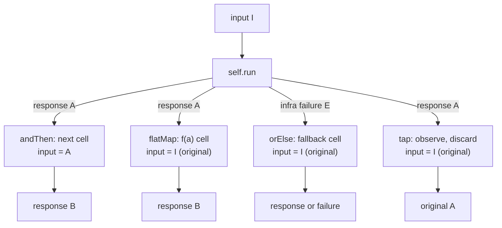
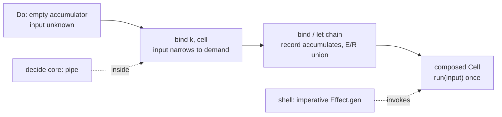

# Cell ADT Parity - Plan

## Goal Capsule

- **Objective:** A library author using `@systemfsoftware/effect-cell-types` gets a Cell that behaves like a first-class Effect-TS data type — values pipe directly, the standard constructor/combinator/destructor vocabulary is present with Effect's channel semantics, and the `TypeLambda` admission is load-bearing machinery rather than a decorative claim. The Cell composes as a Do chain: an adopter expresses a full pipeline — construct, branch, recover, fold — as `pipe(Cell.Do, Cell.bind(...), Cell.let(...))`, with imperative `Effect.gen` reserved for the shell and pipeable code for the pure decide core.
- **Means:** Extend the Cell module per the vendored Effect v4 conventions and the planning-time compile spike's verified recipe (KD1–KD3, KTD1–KTD5): a `Pipeable` instance, constructor arrows, error-channel arrows, sequencing completion, a `match` destructor, and the `Do`/`bind`/`bindTo`/`let` chain typed over `Kind` positions on the existing TypeLambda — preceded by the forcing cutover (U0, KTD11): `make` becomes module-internal and the spec compiler is renamed `layer` → `sandwich`, so every pipeline-shaped Cell is a sandwich by construction.
- **Product authority:** the user's request in this session ("claims to be an ADT but isn't actually pipeline nor … proper goodies … Fix now"), scope confirmed **Full** at the scoping synthesis; the Do-chain mechanism and register split (shell `Effect.gen` / core pipe / Cell as Do chain) directed by the user mid-planning.
- **Stop conditions:** the variance annotations cannot survive the Pipeable extension after the KTD5 probe; or a decide refusal ever reaches `match`'s failure arm (KTD3 falsified at the run outcome). The Do-chain typing was verified at planning time by the compile spike (KTD2) and carries no remaining stop condition.
- **Execution profile:** one PR on `cell-adt`; package-local gates plus `pnpm check:local`, watched green per REPO-D1. Finished by the implementer this arc (via `ce-work` or equivalent).

---

## Product Contract

### Summary

Promote the Cell module of `packages/effect-cell-types` from "claims the ADT shape" to a real Effect-TS data type, and make its architecture compiler-enforced rather than conventional. The forcing cutover lands first: `make` (the sandwich-free constructor) becomes module-internal and the spec compiler is renamed `layer` → `sandwich` with `vocabulary.composer` flipping in the same commit, so the only public pipeline constructor is the sandwich itself. The package then gains: a pipeable instance (every Cell value pipes through the dual combinators), constructor arrows (`succeed`, `fail`, `fromEffect`, `suspend`, `id`), error-channel arrows (`mapError`, `orElse`, `tap`), sequencing completion (`flatMap` with the same-input law, `zipWith`, a dynamic `andThen` overload), a `match` destructor over the run outcome, and the Do chain — `Do`, `bind`, `bindTo`, `let` typed over `Kind` positions on the existing TypeLambda — the machinery that makes the HKT admission real. Generator-style `Cell.gen` is declined: imperative generator syntax is the shell's register (`Effect.gen`), and the Cell itself composes as a Do chain. The layer sandwich law, the Workflow surface, the vocabulary table, and the shipped lint rules are untouched. The change is additive apart from the U0 rename and removal: the eight existing arrows keep their names and signatures.

### Problem Frame

The Cell module ships the costume of an Effect ADT without the body. It declares a `TypeLambda`/`Kind` HKT admission and eight dual combinators — but in Effect v4 the only consumers of `Kind`/`TypeLambda` are the do-notation machinery (`repos/effect/packages/effect/src/internal/doNotation.ts`, `Utils.ts`), none of which Cell uses, so the admission certifies nothing. Cell values are not pipeable the way every Effect data type is (`extends Pipeable` — `repos/effect/packages/effect/src/Pipeable.ts`), so pipelines must thread module-level duals by hand. And the algebra is missing the vocabulary an Effect author reaches for: no constructors to lift constants or effects into arrows, no `mapError`/`orElse`/`tap` over the error channel, no `flatMap`, no destructor, no `gen`. A consumer hits every branch, recovery, or fold point and drops to raw Effect — exactly the invisibility to brand-keyed tooling that the cell architecture exists to prevent.

### Key Decisions

- **KD1. Full Effect-module parity, not a minimal pipeline fix.** (session-settled: user-approved — chosen over a pipeline-only core: the user answered **Full** to the breadth call-out at the scoping synthesis.) Governs R1–R6.
- **KD2. Pipeline shape is a pipeable instance plus the dual combinators.** (session-settled: user-approved — chosen over module-dual-only: same confirmation; matches every vendored Effect data type and the in-repo Atom precedent.) Governs R1, R4.
- **KD3. The `TypeLambda` admission is made real by the Do chain — `Do`/`bind`/`bindTo`/`let` typed over `Kind` positions — not by generator-style `Cell.gen`.** (session-settled: user-directed — chosen over generator gen with a marker `[Symbol.iterator]` protocol: imperative generator syntax belongs to the shell's `Effect.gen`, the pure decide core stays pipeable, and the Cell ultimately composes as a Do chain; the decoration the plan removes is the unused admission either way.) Governs R6.

### Requirements

**Pipeline and instance**

- R1. The Cell interface extends `Pipeable`, every Cell value pipes its combinators through the instance method, and the variance annotations (`in I`, `out A`, `out E`, `out R`) survive the extension — proven by extending the existing variance assertion family, not by inspection.

**Constructors**

- R2. The module ships constructor arrows with Effect's channel semantics: `succeed` (constant response, any input, `E`/`R` never), `fail` (constant infra failure), `fromEffect` (lift an Effect, channels carried), `suspend` (lazy cell construction), and `id` (the Kleisli identity arrow). Constructors are plain exports, excluded from `dual` per house style.

**Error-channel and sequencing arrows**

- R3. `mapError`, `orElse`, and `tap` operate on the infrastructure `E` channel only. A decide refusal is an outcome inside the sandwich and must pass through every recovery arrow untouched — `orElse`'s fallback runs only on an `Effect` failure, and a refusal-outcome run never triggers it.
- R4. `flatMap` threads the response value with the input channel fixed (both cells observe the same original input; `E`/`R` union); `zipWith` combines two cells over one input with `zip`'s fail-fast semantics; `andThen` gains a function overload whose returned cell is fed the response as its input (dynamic arrow composition).

**Destructor and gen**

- R5. `match` folds the run outcome — success arm over `A`, failure arm over `E` — yielding a cell whose error channel is `never`.
- R6. The Do chain composes cells as pipeable do-notation: `Do` (the empty accumulator cell), `bind`, `bindTo`, and `let`, typed over `Kind` positions on the existing TypeLambda. The input channel is fixed across the chain — a `bind` demanding an incompatible concrete input is a compile error at the bind naming both input shapes, and a chain started from `Do` soundly narrows to the demanded input — `A` values thread through the accumulated record, and `E`/`R` union across the chain. The TypeLambda becomes load-bearing: every combinator signature is expressed through `Kind`.

**Doctrine and release**

- R7. `packages/effect-cell-types/AGENTS.md` CELL-T1 is rewritten to name the full lawful runtime inventory (layer, the complete arrow set, constructors, gen machinery, `match`, arrow application, `layerRunner`); CELL-T2's every-claim-is-a-type-assertion rule extends to the new surface; the `vocabulary` table and its four frozen read paths are untouched.
  **Forced shape**

- R9. The sandwich is the only public pipeline constructor: `make` is module-internal, the public constructor set is `sandwich` (the spec compiler, renamed from `layer`) plus the constant/lift arrows, and `vocabulary.composer` carries the new name so the derived lint walks the new call shape by construction (KTD11).

### Acceptance Examples

- AE1. **Covers R1.** Given a layer-built cell, when piped through `map` and `zip` via the instance method, then the composed run produces the same response as the equivalent module-dual composition and the variance assertions still compile.
- AE2. **Covers R3.** Given a layer-built cell whose decide refuses (the refusal reaches `write` as an outcome), when wrapped in `orElse` with a fallback, then the refusal outcome passes through and the fallback demonstrably never runs.
- AE3. **Covers R3.** Given a cell whose read fails with an infra error, when wrapped in `orElse`, then the fallback runs on the same input and its response or error replaces the failure.
- AE4. **Covers R4.** Given two cells over one input type, when composed with `flatMap` selecting the second from the first's response, then both observe the identical original input and the channels union.
- AE5. **Covers R4.** Given `andThen` with a function that builds the next cell from the response, then the response is fed to that cell as its input.
- AE6. **Covers R6.** Given a Do chain over one concrete input type, when a `bind` demands a different, incompatible input, then the chain compiles for same-input binds with `E`/`R` unioned and the incompatible bind is a compile error at the bind site naming both input shapes; a chain bound directly onto `Do` narrows its input to the demanded type soundly.
- AE8. **Covers R9.** Given a consumer importing `make` from the published surface, the import does not compile (api-report absence is the pin); given a `sandwich` spec with I/O in a pure phase body, the derived lint reports it exactly as it reported the same body under the old composer name.

### Scope Boundaries

Out of scope for this plan:

- The Workflow surface (`make`, `total`, composite) — completed by the 2026-09-12 arc; untouched here.
- The layer sandwich law: phase order stays literal text in `layerRunner` (CELL-T3); no phase machinery, no spec-shape changes.
- The `vocabulary` table and the derived lint consumer's behavior (`packages/oxlint-plugin/oxlint-plugin-cell-vocabulary` reads four frozen paths; this plan adds no vocabulary fields and edits no plugin code).
- `collectAll`'s error stance (per-item infra failures ride the fold as `Result` data; `collect` is the fail-fast grain) — adjudicated in the #409 arc and carried as settled project history.
- Declined parity items, with reasons: generator-style `Cell.gen` with a marker `[Symbol.iterator]` protocol (imperative generator syntax is the shell's register — `Effect.gen` — while the pure decide core stays pipeable and the Cell composes as a Do chain; also removes any `Symbol.iterator`/`Unify` yield-admission question outright); a forced `Cell.do(...)` wrapper as the only composition door (researched against the lineage's primary sources and absent from all of them: gcanti's own do-notation guide is `pipe(T.Do, T.bind(...), ...)` — Do as a value, bind as a dual combinator; Wlaschin presents the block form as one of four equal styles over a shared `bind`, calling computation expressions "just a way to create nice syntax for something that we could do ourselves"; the vendored Effect ships `Do` as a value in all six modules with `gen` opt-in; and the package's birth commit chains dual constructors, not a wrapper — a forced entry point would hide the bind substrate the spike verified, not replace it); `compose` (redundant — `andThen` plus `id` complete the arrow category); `@since`/`@category` JSDoc vocabulary (the package's house style is plain doc comments; introducing the docs vocabulary mid-package is inconsistent churn); further Result-style exports beyond R1–R6 — `zip` tuple helpers, `ap`, getters, `Equivalence` (the surface is a carrier: every export bills every consumer at every writing act, wiki: library-public-api-surface, so parity stops at the algebra's needed set, not at upstream's full export list).
- Effect version movement (pinned `4.0.0-rc.112` by catalog; the vendored tree is the reference, read-only per REPO-S3).

### Deferred to Follow-Up Work

- A real-consumer migration showcasing the new surface (the `omp-claude-compat` cell migration validates on its own schedule, as the #393/#394/#395 arc established).
- The type's own name (`Cell` versus a domain-role name — `Handler`, `UseCase`, or `Sandwich` — or no branded type at all): the lineage would not call it Cell (gcanti names by algebra — a Kleisli arrow over Effect, or no new type; Wlaschin names by domain role — a command handler or use case), but the word is load-bearing across the package name, the vocabulary table, plugin identities, CELL-T1..T4, the CONCEPTS grain table, and a dozen plans; a rename is its own arc and belongs in an ADR (CONST-G5), not inside the parity PR.

---

## Planning Contract

### Key Technical Decisions

- KTD1. **`flatMap` threads the value with the input fixed; `andThen` remains the response-fed arrow composition.** In Effect, `flatMap` sequences a computation with the environment fixed and threads the value; Cell's input channel is that fixed environment, so `flatMap`'s function returns a cell over the _same_ input, run on the original one. `andThen` has no Effect counterpart because it is arrow composition — the response becomes the next cell's input — and it stays as shipped. The lineage is Reader-transformed: fp-ts' `ReaderTaskEither.chain` threads the value with the environment fixed, so `flatMap` carries its canonical name — and because two composition laws now share a module, the export's own doc comment states the same-input law, answering the name's ambiguity at the point of use rather than only in the README. The law is doc-level and test-pinned (AE4's property), not compiler-pinned: contravariance lets a function returning a cell over a _wider_ input satisfy the signature soundly, and no phantom brand is added to forbid that — exact-type input identity is not expressible without one, and the widening substitute is semantically safe. Governs R4.
- KTD2. **The Do chain is the do-notation payoff, and its typing is verified — a planning-time compile spike against the workspace's `effect@4.0.0-rc.112` proved the recipe before this plan landed.** The recipe is the repo's own `packages/effect-gherkin-spec/src/DoNotation.ts` shape: precise function-declaration overloads (`A extends object`, `NoInfer<A>`, return `A & Record<K, B>`) over a loose implementation signature taking tuple-union args with an unannotated return, accumulating via the direct spread `({ ...a, [k]: b })` — no casts, no `any`, no `Object.assign` (all three dead ends measured: upstream's `as any` at `internal/doNotation.ts:50,116` fails the no-any regime; the narrowing assertion trips `no-unsafe-type-assertion`; `Object.assign` fails the `Record<K, B>` assignability wall). Spike verdicts: the strict same-`I` `flatMap` carries `Do` chains soundly (`Do`'s `unknown` input is a legal contravariant supertype; the composed cell narrows to the demanded input); incompatible concrete binds error at the bind site naming both shapes; the whole family compiles identically when expressed over `Kind<TypeLambda, I, E, R, A>` positions — the TypeLambda is load-bearing in every signature. Generator-style `Cell.gen` is declined per KD3; `effect/Utils`'s public `Gen`/`Variance` (Utils.ts:133,173) are the type-level surface that machinery would have used. Governs R6.
- KTD3. **`match` folds the run outcome, not any inner refusal.** `run` returns `Effect<A, E, R>`; the layer's decide refusal never escapes `layerRunner` (it is handed to `write` as an outcome), so no `matchOutcome` destructor exists at Cell altitude — there is no such type to fold. Governs R5.
- KTD4. **Recovery and observation arrows see only the infra `E` channel.** `mapError`/`orElse`/`tap` wrap `run`; a decide refusal is a success-channel value by the time `run` answers, so it passes through untouched. Pinned by AE2's refusal-preservation test, not by prose. Governs R3.
- KTD5. **Pipeability via `extends Pipeable` plus a proto spread in `make`, with a probe-first variance step.** The Atom package is the in-repo precedent (`packages/atom/effect-atom/src/AtomCore.ts`: `PipeInspectableProto` + `pipeArguments`); Effect's own data types do the same (`Pipeable.ts`, `internal/core.ts`). A conditional member broke `out R` once (TS2636 — `docs/solutions/architecture-patterns/conditional-member-type-breaks-variance-annotations.md`), so the variance assertions extend _before_ the interface changes. Governs R1.
- KTD6. **Overload discipline: function-declaration overloads plus a discriminated implementation helper.** For spec-shaped unions the keyless-union pattern governs (`docs/solutions/architecture-patterns/typed-overloads-need-a-keyless-union.md`); the `andThen` function overload is a different shape — a value-vs-function union — and discriminates at runtime on the function check, with its own probe under the no-cast regime before it lands. No casts, no `any`, in either shape. Governs R3, R4.
- KTD7. **Constructor cells are outside the phase-body lint walk by construction, and that is documented, not patched.** `no-io-in-phase-bodies` walks `Cell.layer` spec bodies; constructor arrows have none. The gap is stated in the package README's surface section; the vocabulary table and the plugin are untouched. Governs R7.
- KTD8. **Docs stay in the package's house style.** Plain JSDoc comments matching the existing arrows; no `@since`/`@category` vocabulary (per gcanti-tim-smart-style G5, the host style governs). Every new export lands in the regenerated api report. Governs R7, R8.
- KTD9. **No bake-off was run because no fork survived research with two viable mechanisms.** Gen machinery must be in-package either way (Effect's is internal); the pipe shape has one in-repo precedent and one upstream convention that agree; the remaining choices are judgment-settled by cited evidence, which these KTDs record.
- KTD10. **Dual where idiomatic, plain elsewhere — a kinded split, never uniform.** Receiver-bearing arrows ship `dual`; constructors and the gen entry stay plain data-first. A manufactured data-last branch with no receiver masquerades as pipeable and fails at runtime by arity (wiki: call-signature-uniformity, verdict "torch"; Effect's dual doc keys the two overloads on self position). Governs R2–R5.
- KTD11. **FCIS and the sandwich are compiler facts, not conventions — and existence becomes one by closing `make`.** Purity is already forced per phase by return type (the core slots admit `Result`/plain values only; the bread slots admit `Effect` only), wiring/order by generic unification across the spec (`Raw`/`Dcd`/`Dec`/`Out` thread read→decode→decide→encode→write), and decision provenance by the `WorkflowBrand` on the decide slot (attachable only through the lint-gated `Workflow.make`). The one hole is `make`: public, it builds a sandwich-free Cell from any run-shape, making the architecture optional. Unexporting it leaves `sandwich` plus the constant/lift arrows as the only constructors — constants are sandwich-free by nature (no phases to order; they are the category's units), so nothing lawful is lost. The rename rides the same commit as the `vocabulary.composer` value flip; the derived consumer reads the value at load, so it walks the new call shape by construction and its word-census invariant stays green. Governs R9.

### High-Level Technical Design

Two shapes prose alone carries poorly: the difference between the composition paths (what each thread keeps fixed), and the Do chain's register split — the shell writes imperative `Effect.gen`, the pure decide core stays pipeable, and the Cell composes as a Do chain:

Channel laws for the new surface (prose laws, not signatures):

| Export                     | Kind                                 | Channel law                                                                                           |
| -------------------------- | ------------------------------------ | ----------------------------------------------------------------------------------------------------- |
| `succeed`                  | constructor                          | any input; constant response; `E`/`R` never                                                           |
| `fail`                     | constructor                          | any input; constant infra failure                                                                     |
| `fromEffect`               | constructor                          | any input; lifted effect's `A`/`E`/`R` carried                                                        |
| `suspend`                  | constructor                          | construction deferred until first run                                                                 |
| `id`                       | constructor                          | response = input; identity for `andThen`                                                              |
| `mapError`                 | dual                                 | `E` remapped; `I`/`A`/`R` unchanged                                                                   |
| `orElse`                   | dual                                 | fallback runs on `E` only, same input; `E` narrows to fallback's                                      |
| `tap`                      | dual                                 | observes `A`, discards; `E`/`R` union                                                                 |
| `flatMap`                  | dual                                 | same input; `E`/`R` union (KTD1)                                                                      |
| `zipWith`                  | dual                                 | one input; fail-fast like `zip`; `E`/`R` union                                                        |
| `andThen` (fn overload)    | dual                                 | response selects and feeds the next cell (KTD1)                                                       |
| `match`                    | dual                                 | folds run outcome; resulting `E` is `never` (KTD3)                                                    |
| `Do`/`bind`/`bindTo`/`let` | do-notation (overloads, KTD10 split) | `I` fixed (sound narrowing from `Do`; incompatible bind errors); record threads; `E`/`R` union (KTD2) |

### Sequencing

U0 closes the doors every later unit's docs and tests name; U1 lands the instance every other unit's tests pipe through; U2 (constructors) lands next; U3 and U4 are parallel branches on U1/U2 (U3 needs only U1; U4 needs U1 and U2); U5 builds the Do chain on U4's `flatMap`; U6 closes doctrine, docs, and release once the full inventory is known.

---

## Implementation Units

### U0. Close the doors: `sandwich` rename, `make` internal

- **Goal:** Every pipeline-shaped Cell is a sandwich by construction, and the composer carries a domain-true name; no consumer can build a Cell that skips the sandwich.
- **Requirements:** R9 (KTD11).
- **Dependencies:** none.
- **Files:** `packages/effect-cell-types/src/Cell.ts` (symbol, doc comments, `vocabulary.composer` value); `packages/effect-cell-types/README.md`; `packages/effect-cell-types/AGENTS.md` (CELL-T1 wording); `CONCEPTS.md` (the "Cell.layer spec" phrasings); call sites — `packages/effect-daemon-spec/src/internal/SupervisorBodyExecutor.ts`, `packages/stryker-js/stryker-js-cli/src/Output.ts` and `Survivors.ts`, `packages/stryker-js/stryker-js-engine/src/Checker.ts` and `Run.ts` plus `tests/cell-layer-composition.integration.test.ts`, `packages/stryker-js/stryker-js-typescript-checker/src/Checker.ts`, `packages/stryker-js/stryker-js-vitest-runner/src/Runner.ts`; package tests and type pins (`src/__tests__/`, `test-types/cells-surface.tst.ts`, `test-types/workflows-surface.tst.ts`, `tests/`); plugin fixtures (`packages/oxlint-plugin/oxlint-plugin-cell-vocabulary/src/rules/__tests__/no-io-in-phase-bodies.test.ts`, `packages/oxlint-plugin/oxlint-plugin-effect-entrypoint/src/rules/__tests__/runtime-construction-placement.test.ts`); `packages/effect-cell-types/etc/effect-cell-types.api.md`.
- **Approach:**
  1. Rename the exported symbol `layer` → `sandwich` repo-wide via the language server (symbol rename, not text), then sweep the non-symbol occurrences: doc comments, plugin fixture strings, doctrine prose.
  2. Flip `vocabulary.composer` to `'sandwich'` in the same commit; the derived consumer reads the value at load, so its walk follows by construction.
  3. Unexport `make` (module-internal; the combinators keep using it); migrate the README example to `sandwich`.
  4. Regenerate the api report: `make` absent, `sandwich` present — that diff is the published-contract pin.
- **Patterns to follow:** the Workflow side's gated-`make` precedent (`make-body-purity`/`make-file-location` rules) as the rejected alternative — a lint gate on a public `make` is strictly weaker than an internal one and adds machinery; `shared-vocabulary-derives-from-one-runtime-value.md` for the value-flip safety.
- **Test scenarios:**
  - The renamed composer infers exactly what the old pins asserted (existing tstyche scenarios, renamed).
  - The derived lint reports I/O in a pure phase body under the new composer name (existing plugin scenarios, renamed) (Covers AE8).
  - No consumer imports `make` (api-report absence; a `make` import in a scratch file fails to compile).
  - Consumer packages' gates green after migration.
- **Verification:** `pnpm check:local` exits 0 across all consumer gates; api diff names exactly the rename and the removal.

### U1. Pipeable instance and variance probe

- **Goal:** Every Cell value pipes; the variance annotations survive; instance piping and module duals are proven equivalent.
- **Requirements:** R1 (KD2).
- **Dependencies:** U0.
- **Files:** `packages/effect-cell-types/src/Cell.ts`; `packages/effect-cell-types/test-types/cells-surface.tst.ts`; `packages/effect-cell-types/tests/cell-pipeline.integration.test.ts` (new); `packages/effect-cell-types/etc/effect-cell-types.api.md` (regenerated).
- **Approach:**
  1. Extend the variance assertion family (the T8 house block) to cover the interface as it will stand with `Pipeable` — before touching the interface.
  2. Add `extends Pipeable` to the Cell interface; spread a module-local proto carrying the `pipe` method over `pipeArguments` inside `make`, mirroring `packages/atom/effect-atom/src/AtomCore.ts`.
  3. Keep the `CellTypeId` field and the plain `run` member untouched (no conditional members — KTD5's cited history).
  4. Regenerate the api report; confirm the diff shows only the `Pipeable` base.
- **Execution note:** Probe-first: the variance assertions land before the interface change, so a regression is a named red test rather than a surprise.
- **Patterns to follow:** `packages/atom/effect-atom/src/AtomCore.ts` (proto + `pipeArguments`); `repos/effect/packages/effect/src/Pipeable.ts` (interface shape).
- **Test scenarios:**
  - Instance-pipe equivalence: a `.pipe` chain over `map` and `zip` produces the same response as the module-dual composition of the same arrows (Covers AE1).
  - Nested piping: a piped result pipes again; the brand still gates (the piped value satisfies the Cell type where a plain object does not — type pin).
  - Variance: the four existing directions hold unchanged with `Pipeable` present.
  - No-regression: existing data-last dual call sites compile untouched.
- **Verification:** `pnpm --filter @systemfsoftware/effect-cell-types typecheck && test:types && test && lint && api:check` all exit 0.

### U2. Constructor arrows

- **Goal:** Constants, failures, lifted effects, laziness, and the identity arrow exist as first-class cells.
- **Requirements:** R2.
- **Dependencies:** U1.
- **Files:** `packages/effect-cell-types/src/Cell.ts`; `packages/effect-cell-types/src/__tests__/cell-arrows.property.test.ts` (new); `packages/effect-cell-types/test-types/cells-surface.tst.ts`; `packages/effect-cell-types/tests/cell-pipeline.integration.test.ts`; `packages/effect-cell-types/etc/effect-cell-types.api.md`.
- **Approach:** Add `succeed`, `fail`, `fromEffect`, `suspend`, `id` as plain (non-dual) constructors beside `layer`. `id` is generic in the input type; `succeed`/`fail`/`fromEffect` accept any input (contravariance makes the returned cell assignable wherever a cell over a concrete input is demanded — pin that with an assertion).
- **Patterns to follow:** `repos/effect/packages/effect/src/Result.ts` constructor section (naming and channel semantics); the existing `layer` JSDoc style.
- **Test scenarios:**
  - `succeed` run returns the constant; `fail` run fails with the given error (channels pinned `never`).
  - `fromEffect` carries the lifted effect's success, failure, and services end to end.
  - `suspend` defers: a construction counter increments only on first run, not on wrap.
  - Law: `id` is both-sided identity for `andThen` over generated cells (property, per the Test Layer Classification).
  - Input-agnostic assignability: `succeed`'s cell is accepted where `Cell<ConcreteInput, …>` is demanded.
- **Verification:** package gates exit 0; api report diff names exactly the five constructors.

### U3. Error-channel arrows

- **Goal:** Recovery and observation over the infra `E` channel, with the refusal-preservation law pinned by a test.
- **Requirements:** R3 (KTD4).
- **Dependencies:** U1.
- **Files:** `packages/effect-cell-types/src/Cell.ts`; `packages/effect-cell-types/src/__tests__/cell-arrows.property.test.ts`; `packages/effect-cell-types/test-types/cells-surface.tst.ts`; `packages/effect-cell-types/tests/cell-pipeline.integration.test.ts`; `packages/effect-cell-types/etc/effect-cell-types.api.md`.
- **Approach:** Add `mapError`, `orElse`, `tap` as dual combinators over `run`'s `Effect` outcome. `orElse`'s fallback runs on the same original input. `tap` accepts an observing function returning an `Effect` and preserves the response. Follow KTD6's overload pattern where a combinator needs more than one form.
- **Patterns to follow:** `repos/effect/packages/effect/src/Result.ts` error-handling section; existing dual shape of `map`/`zip` in `Cell.ts`.
- **Test scenarios:**
  - `mapError` remaps `E`, leaves `A` (Covers the R3 channel law).
  - `orElse` on an infra failure runs the fallback on the same input and replaces the failure (Covers AE3).
  - `orElse` around a decide-refusing layer cell: the refusal outcome arrives intact and the fallback never executes — trace-order evidence in the house Gherkin style (Covers AE2).
  - `tap` observes then continues: response unchanged, both cells' effects observed in order.
  - Law: for generated cells, `orElse`'s fallback runs exactly when the wrapped run fails with `E` — never otherwise (property, per the Test Layer Classification).
- **Verification:** package gates exit 0; the refusal-preservation scenario fails if `orElse` is (sabotage-checked) implemented over the inner `Result`.

### U4. Sequencing completion and the match destructor

- **Goal:** The algebra's remaining arrows — `flatMap` with the same-input law, `zipWith`, dynamic `andThen`, `match`.
- **Requirements:** R4, R5 (KTD1, KTD3).
- **Dependencies:** U1, U2.
- **Files:** `packages/effect-cell-types/src/Cell.ts`; `packages/effect-cell-types/src/__tests__/cell-arrows.property.test.ts`; `packages/effect-cell-types/test-types/cells-surface.tst.ts`; `packages/effect-cell-types/tests/cell-pipeline.integration.test.ts`; `packages/effect-cell-types/etc/effect-cell-types.api.md`.
- **Approach:** `flatMap` runs the function's cell on the original input (KTD1); `zipWith` combines with `zip`'s fail-fast; `andThen` gains the function overload as a value-vs-function union discriminated at runtime on the function check, probed under the no-cast regime before it lands (KTD6); `match` wraps the run outcome and yields `E = never` (KTD3).
- **Patterns to follow:** the existing `andThen` overload pair in `Cell.ts`; `repos/effect/packages/effect/src/Result.ts` `match`/`flatMap` semantics.
- **Test scenarios:**
  - `flatMap`: both cells observe the identical input instance; channels union (Covers AE4).
  - `zipWith`: first refusal stops the second write (fail-fast inherited).
  - `andThen` function overload: the response reaches the returned cell as input (Covers AE5).
  - `match`: failure arm on infra `E`, success arm on `A`, resulting `E` is `never` (Covers AE7).
  - `match` around a decide-refusing layer cell: the write's response is a success-arm value — the refusal never reaches the failure arm.
  - Law: for generated cells and inputs, `flatMap`'s inner cell observes the original input (property, per the Test Layer Classification).
  - Composition-altitude proof for `match`: a matched cell (`E` never) feeds a further combinator (`zip`), so the fold's value is composition, not a run-time convenience.
- **Verification:** package gates exit 0; every new overload has a type pin in the house assertion verbs.

### U5. The Do chain over the TypeLambda

- **Goal:** `Do`/`bind`/`bindTo`/`let` as the Cell's composition surface — the payoff that makes the HKT admission load-bearing, typed per the planning-time spike's verified recipe (KTD2).
- **Requirements:** R6 (KTD2, KD3).
- **Dependencies:** U4.
- **Files:** `packages/effect-cell-types/src/Cell.ts`; `packages/effect-cell-types/src/__tests__/cell-arrows.property.test.ts`; `packages/effect-cell-types/test-types/cells-surface.tst.ts`; `packages/effect-cell-types/tests/cell-pipeline.integration.test.ts`; `packages/effect-cell-types/etc/effect-cell-types.api.md`.
- **Approach:**
  1. Implement `Do`, `bind`, `bindTo`, `let` in the `packages/effect-gherkin-spec/src/DoNotation.ts` shape: precise function-declaration overloads (`A extends object`, `NoInfer<A>`, return `A & Record<K, B>`; `bindTo` returns `Record<K, A>`) over a loose implementation signature taking tuple-union args with an unannotated return, accumulating via the direct spread — no casts, no `any`, no `Object.assign` (dead ends in KTD2).
  2. Express every signature through `Kind<TypeLambda, I, E, R, A>` positions so the TypeLambda is computed in each public type.
  3. Desugar `bind` to U4's `flatMap`; `let` and `bindTo` to `map`.
- **Patterns to follow:** `packages/effect-gherkin-spec/src/DoNotation.ts` (the verified overload recipe, in-repo); `repos/effect/packages/effect/src/Result.ts` do-notation section (naming and channel semantics); `repos/effect/packages/effect/src/internal/doNotation.ts` (read-only reference).
- **Test scenarios:**
  - Chain inference: `pipe(Do, bind(...), bind(...), let(...))` infers the exact composed `Cell` — input narrowed to the demanded type, record accumulated, `E`/`R` unioned (KTD2's verified shape).
  - A `bind` demanding an incompatible concrete input onto a concrete-input chain is a compile error at the bind naming both input shapes; a bind directly onto `Do` narrows soundly (Covers AE6).
  - Data-first arm: `bind(bindTo(cell, "v"), "w", ...)` infers the exact composed type.
  - Runtime: the composed cell's `run` feeds the identical input instance to every bound cell; a failing cell short-circuits the rest of the chain (fail-fast); trace-order evidence in the house style.
  - Law: `Do` plus `bind` builds the same composed cell as the equivalent `flatMap` chain (property, per the Test Layer Classification).
  - Cast-free pin: the shipped source contains no type assertion in the do-notation family (the spike's gate-checked property).
- **Verification:** package gates exit 0; api report diff names exactly the four exports.

### U6. Doctrine, docs, and release

- **Goal:** The doctrine row names the shipped truth; adopters can read the new surface; the release intent exists.
- **Requirements:** R7, R8.
- **Dependencies:** U1–U5.
- **Files:** `packages/effect-cell-types/AGENTS.md`; `packages/effect-cell-types/README.md`; `.changeset/` (new intent); `packages/effect-cell-types/etc/effect-cell-types.api.md` (final regeneration check).
- **Approach:**
  1. Rewrite CELL-T1's runtime inventory to the full lawful surface (layer; the arrows `map`, `mapInput`, `andThen`, `zip`, `gate`, `collect`, `collectAll`, `provide`, `mapError`, `orElse`, `tap`, `flatMap`, `zipWith`, `match`; the constructors `succeed`, `fail`, `fromEffect`, `suspend`, `id`; the Do chain `Do`/`bind`/`bindTo`/`let`; the pipeable instance; arrow application; `layerRunner`). CELL-T1's gate (no stryker config, no mutation script) is untouched.
  2. Extend CELL-T2's wording if needed so "every claim about the Cell surface is a type assertion" visibly covers the new exports.
  3. Add a README surface section: the parity set; the register split (shell writes imperative `Effect.gen`, the pure decide core stays pipeable, the Cell composes as a Do chain); the two composition laws (`flatMap` same-input vs `andThen` response-fed); recovery-on-`E`-only; and the constructor/lint-scope note (KTD7).
  4. Ship the changeset: `pnpm change --bump minor`, body stating the consumer-observable additions (pipeable cells, new arrows, constructors, the Do chain) — verbatim CHANGELOG facts only.
- **Test scenarios:** Test expectation: none -- doctrine, docs, and release intent; the package gates and review decide.
- **Verification:** `pnpm check:local` exits 0; changeset check accepts the intent; `gh pr checks --watch --fail-fast` exits 0 once the PR is open.

---

## Verification Contract

| Gate                    | Command                                                       | Applies                                  |
| ----------------------- | ------------------------------------------------------------- | ---------------------------------------- |
| Package typecheck       | `pnpm --filter @systemfsoftware/effect-cell-types typecheck`  | every unit                               |
| Type-surface assertions | `pnpm --filter @systemfsoftware/effect-cell-types test:types` | every unit (CELL-T2)                     |
| Composition tests       | `pnpm --filter @systemfsoftware/effect-cell-types test`       | every unit                               |
| Lint                    | `pnpm --filter @systemfsoftware/effect-cell-types lint`       | every unit                               |
| Api report              | `pnpm --filter @systemfsoftware/effect-cell-types api:check`  | every unit (report regenerated per unit) |
| Publish-shape check     | `pnpm --filter @systemfsoftware/effect-cell-types attw`       | U1 and U6                                |
| Root local chain        | `pnpm check:local`                                            | after last edit (REPO-D1)                |
| CI watch                | `gh pr checks --watch --fail-fast`                            | PR open through merge (REPO-D1)          |
| Changeset intent        | `pnpm change --bump minor` + changeset-check workflow         | U6 (REPO-R2)                             |

No mutation runs locally (REPO-D3); the advisory Mutation workflow report owns scores.

### Test Layer Classification

Every test this plan proposes, admitted through the test-layer gate (default refuse):

- **Type-surface assertions** — extensions to `test-types/cells-surface.tst.ts` (tstyche). Admitted: the package's established compile-time lane for public-surface claims (CELL-T2; classification by what the test calls).
- **Law property tests** — `packages/effect-cell-types/src/__tests__/cell-arrows.property.test.ts` (new). Admitted and required: the arrows are execution combinators, whose permitted layer is law properties over generated input — identity (`andThen`/`id` both sides), input-fixing (`flatMap`'s inner cell observes the original input for every generated input), error-confinement (`orElse`'s fallback runs exactly when the wrapped run fails with `E`). Generators build cells from the constructor arrows over fast-check values.
- **Composition integration tests** — `packages/effect-cell-types/tests/cell-pipeline.integration.test.ts` (new). Admitted: in-process through the public surface, no doubles, no process spawning; carries the scenario and trace-order observables (AE1–AE7) that generated laws cannot express.

Refused: unit tests of `make`/proto/`layerRunner` internals (covered transitively at composition altitude); e2e (no seam-only behavior changes); mock-based tests (no doubles required — real cells are cheap). The package carries no mutation config by CELL-T1's own design; no local mutation runs (REPO-D3).

---

## Definition of Done

- **Global:** every unit landed on `cell-adt`; all Verification Contract gates green; CELL-T1 names exactly the shipped runtime inventory; the README surface section and changeset intent exist; the tree is restartable (`pnpm check:local` green from the merged result); no dead-end or scratch code remains in the diff — abandoned attempt shapes are deleted, not commented out.
- **Per-unit:** the unit's gates exit 0, its api report diff names exactly its new exports, and its test scenarios (or its `Test expectation: none` justification) are satisfied.

---

## Appendix

### Risks

- **Overload walls.** The package has a measured history of two-wall overload failures on contravariant-plus-error-covariant shapes (`docs/solutions/architecture-patterns/typed-overloads-need-a-keyless-union.md`). Mitigation: KTD6's pattern on every overloaded arrow; a type pin per overload.
- **Variance regression from the Pipeable extension.** A conditional member broke `out R` once (TS2636). Mitigation: probe-first variance assertions (U1 step 1); no conditional members on the interface.
- **Stale api report.** A cached pass can outlive the toolchain (`docs/solutions/build-errors/stale-api-report-outlives-toolchain.md`). Mitigation: regenerate per unit and diff the export set before accepting.
- **CELL-T1 letter drift mid-arc.** Intermediate commits on the branch temporarily outgrow the row's inventory. Mitigation: the row is rewritten in U6 before merge; the PR body notes the sequencing.
- **Do-chain inference walls.** The accumulator overloads sit on the package's measured two-wall overload history. Mitigation: the planning spike's verified recipe (KTD2) — precise overloads over a loose unannotated impl, direct spread — plus a type pin per arm and the mismatch scenario as a negative compile test.
- **Rename churn across five consumer packages.** Roughly forty `Cell.layer(` call sites plus plugin fixture strings. Mitigation: language-server rename for the symbol, one fixture sweep, and `pnpm check:local` over every consumer gate before U1 begins.

### Sources

- Vendored Effect v4 (read-only, REPO-S3/W4): `repos/effect/packages/effect/src/HKT.ts` (TypeLambda/Kind contract and consumers), `Pipeable.ts` and `internal/core.ts` (pipe declaration shapes), `Result.ts` and `Stream.ts` (module vocabulary, dual discipline, gen/do-notation), `Option.ts`/`Layer.ts` (value-pipeable object precedent), `internal/doNotation.ts` and `Utils.ts` (Kind consumers — the machinery that makes a TypeLambda real).
- Constitutional provenance of the phase order (untouched surface, cited not re-derived): CONST-B3's law body is the three-bite sandwich (`read → transform → write`) and its five-name flow (`read → decode → decide → shape → write`) is the rule's example — the constitution's own synthesis, cited by nobody in its own text. External lineage by shape and term: Gary Bernhardt, _Boundaries_ (2012, destroyallsoftware.com) for functional core / imperative shell (CONST-B1); Mark Seemann, the impureim sandwich (blog.ploeh.dk, named post 2020-03-02; term carried from earlier posts and _Dependency Injection Principles, Practices, and Patterns_, Manning 2019) for the sandwich title and three-bite law; Scott Wlaschin, _Domain Modeling Made Functional_ (2018) / ROP (2014) for validate-at-the-boundary (the `decode` phase, CONST-B5) — the repo takes Wlaschin's reading explicitly at CONCEPTS:388. The example's split of Seemann's single transform into decode/decide/shape follows DMMF's boundary/core/boundary and borrows Effect Schema's codec vocabulary; the package doctrine then names the fourth phase `encode` (CONCEPTS.md lines 182 and 228). The three-phase grain is CONST-B3's no-pass-through-layer clause applied; CONST-B6 supplies the order's typing (chained phantom members at birth commit `640dc64f4e6`, record-spec generic threading today); CONCEPTS lines 216-218 record why the phases take a composer while the cell sequence takes a constructor chain (the Do chain). No external lineage ships a five-phase spec: Effect models I/O via services; Wlaschin's boundary/core/boundary is the general ancestor only.
- In-repo precedent: `packages/atom/effect-atom/src/AtomCore.ts` (pipeable instance via proto spread).
- Institutional learnings: `docs/solutions/architecture-patterns/grain-table-identifier-three-fates.md` (run-alias deletion; arrow application lawful), `conditional-member-type-breaks-variance-annotations.md` (variance trap), `shared-vocabulary-derives-from-one-runtime-value.md` (frozen vocabulary shape), `typed-overloads-need-a-keyless-union.md` (overload pattern), `docs/solutions/build-errors/stale-api-report-outlives-toolchain.md` (api report hygiene).
- Prior arc: `docs/plans/2026-09-12-0325-feat-cell-workflow-surface-plan.md` (settled grain ruling, collect/collectAll semantics, arrow-application law).
- Current surface and pins: `packages/effect-cell-types/src/Cell.ts`, `AGENTS.md` (CELL-T1..T4), `test-types/cells-surface.tst.ts`, `tests/`, `tsdown.config.ts`, `api-extractor.json`; derived consumer `packages/oxlint-plugin/oxlint-plugin-cell-vocabulary/src` (frozen reads).
- Design-taste corpus and primary docs: software-wiki `concepts/call-signature-uniformity.md` (dual-where-idiomatic verdict), `concepts/library-public-api-surface.md` (surface-as-carrier; functions-plus-one-pipe-method doctrine), `concepts/adt-algebra-service-spine.md`; Effect docs — `effect.website/docs/v3/code-style/dual` and the v4 `Function`/`Pipeable` API references (dual overload shape keyed on self position; `Pipeable` current in v4); gcanti's own do-notation guide (`fp-ts/Do.md`: `pipe(T.Do, T.tap(...), T.bind(...), T.flatMap(...))` as the canonical form); Wlaschin, "Introducing 'bind'" (fsharpforfunandprofit.com, 2013: computation expressions as sugar over a standalone bind; four equal composition styles); vendored `Do` values (`Array.ts:4773`, `Channel.ts:7614`, `Effect.ts:1278`, `Option.ts:2314`, `Result.ts:1544`, `Stream.ts:10164`) and opt-in `gen` (`Effect.ts:1433`, `Option.ts:2351`, `Result.ts:1490`); package birth commits `640dc64f4e6` (five phase constructors chained by a `previous` parameter — order carried by types), `8e602f68e56` (phases made dual "so a description reads in order"), `48c69471250`/`5e0c858baf2` (response-threading tried at birth and reverted unused).
