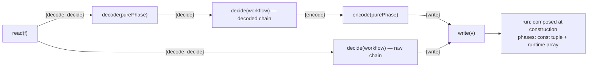

# Cell Sandwich Chain - Plan

## Goal Capsule

- **Objective:** The sandwich authoring surface is migrated cleanly to a typed continuation chain (`Sandwich.read(...)`); the legacy record spec types (`LayerSpec`/`LayerLongSpec`), the hand-sequenced interpreter (`layerRunner`), and the obsolete `@systemfsoftware/oxlint-plugin-cell-vocabulary` package are completely deleted per REPO-R1 with a clean cutover across all in-tree callers.
- **Means:** Continuation-object chain constructors (`Sandwich.read(...)` returns only lawful next steps), construction-time composition (each step composes `run`), recorded phase tuple (static literal + runtime array), pure synchronous `Result` phase signatures (`(input: In) => Result.Result<Out, E>`), complete deletion of the legacy record spec types, complete deletion of the vestigial `oxlint-plugin-cell-vocabulary` package, and clean cutover of all ~40 in-tree authoring sites.
- **Product authority:** the user's design dialogue in this session, graded against the repo's own enforceability axis (software-wiki `concepts/type-carried-enforcement.md`, §7 in particular); the sibling parity plan (`docs/plans/2026-09-17-1925-feat-cell-adt-parity-plan.md`) owns the combinator surface and lands first.
- **Stop conditions:** the chain typing cannot be expressed without casts or `any` (U1 spike fails); grain coherence cannot be expressed as a method surface; parser-built and chain-built cells disagree on trace or response (KD3 falsified).
- **Execution profile:** its own PR on `cell-adt` after the parity plan merges (both touch `src/Cell.ts`); strangler posture — record and chain authoring callable side by side throughout; package gates plus `pnpm check:local`, watched green per REPO-D1.

---

## Product Contract

### Summary

Rebuild the sandwich in `packages/effect-cell-types` from a record of closures into a typed continuation chain. The legacy record spec (`LayerSpec` / `LayerLongSpec`), its hand-sequenced interpreter (`layerRunner`), and the vestigial `@systemfsoftware/oxlint-plugin-cell-vocabulary` package are deleted in a clean cutover (REPO-R1). In their place, `Sandwich.read(...)` provides a fluent continuation chain with compile-time sentence diagnostics, exact generic channel preservation, and strict grain coherence. Pure filling phases (`decode`, `decide`, `encode`) are synchronous functions returning `Result.Result<Out, E>`, making raw effects (`Clock`, `FileSystem`) unrepresentable at compile time without needing a bespoke AST linter.

### Problem Frame

The sandwich is the architecture's load-bearing shape (CONST-B3) but its implementation is the naive member of the design space: closures-only representation, duplicated hand-sequenced interpreter, order errors surfacing as generic unification failures rather than sentences, grain coherence enforced by inference rather than API, zero introspection without running, and a lint that re-walks source text because no structure exists to read. The wiki's enforceability axis assigns shape-of-code constraints to the type system or lint, never runtime (`shipped-runtime-enforcement`); order and grain are shape-of-code and are today only half type-carried. The data-GADT-with-fold alternative was evaluated and rejected on the axis's §7: TypeScript has no dependent pattern-matching, so a fold over nested phase nodes demands the casts the house regime bans — the rejected sketch's ugly interpreter was that impossibility surfacing, not a style defect.

### Key Decisions

- **KD1. Continuation objects, not a data GADT: the lawful-next-step method surface is the B6 sentence.** Each step's return type exposes only the constructors the order and grain permit; misorder and half-grain are missing-method errors whose diagnostic displays the lawful surface. Precedent: the birth commit's chained-member design (`640dc64f4e6`) proved chain typing compiles in this repo; the method surface is the same force with better diagnostics and no phantom members. Governs R1.
- **KD2. Composition at construction: the description's `run` is the interpreter; there is no fold.** Each constructor closes over the inner composition, so sequencing lives in one straight line per step and the two-body interpreter plus its runtime probe have no successor. This is the existing `make`-plus-combinators pattern kept, not invented; it is also why introspection cannot be a static fold and is instead the recorded tuple (KD4). Governs R2.
- **KD3. Clean cutover: complete retirement of the record spec API.** Per REPO-R1 (pre-1.0 ALPHA packages make breaking changes directly when cleaner) and repo clean-cutover law, the legacy record spec is not retained as parser sugar. `LayerSpec`, `LayerLongSpec`, and `layerRunner` are deleted outright. All ~40 in-tree call sites (in `stryker-js`, `effect-daemon-spec`, and tests) migrate directly to `Sandwich.read(...)`. Governs R4.
- **KD4. Introspection is a recorded phase tuple, not structure recovery.** Constructors name their step in a type-level literal tuple and append to a runtime array; `phases` is readable statically (tstyche pin) and at runtime without running the cell. Dry-run or tracing interpreters, if ever shipped, fold over run-plus-tuple, never over a GADT. Governs R3.
- **KD5. Delete vestigial `@systemfsoftware/oxlint-plugin-cell-vocabulary`.** The `no-io-in-phase-bodies` rule policed deleted concepts (`store`, `adapter`), while Node builtins are already banned monorepo-wide by `no-restricted-imports`, and Effect services (`Clock`, `System`) return `Effect` handles unassignable to synchronous `Result` thunks. Per CONST-S4 (Subtract Before You Add), the entire plugin package is deleted rather than maintained. Governs R5.
- **KD6. Resource lifetimes (a `Scope`-carrying read variant) are deferred, not forgotten.** Acquisition typing through construction-time composition needs its own spike; shipping it unspiked would repeat the GADT mistake. Governs Deferred.

### Requirements

- R1. Chain constructors expose only lawful next steps: after `read`, `{decode, decide}`; after `decode`, `{decide}`; after `decide` on a decoded chain, `{encode}` only; on a raw chain, `{write}` only; after `encode`, `{write}`. The decide slot keeps the `WorkflowBrand` gate. Misorder and half-grain are missing-method compile errors.
- R2. Construction-time composition: every chain value carries `run: (input: I) => Effect<Resp, E, R>` composed at construction; `layerRunner` and the `'decode' in spec` probe are deleted; one construction path serves both grains.
- R3. Every chain value carries `phases`: a type-level literal tuple (`readonly ["read", "decide", "write"]`-shaped) and a matching runtime array, both produced by the constructors.
- R4. The legacy record spec types (`LayerSpec`, `LayerLongSpec`, `LayerCore`) and interpreter (`layerRunner`) are completely retired and deleted; all ~40 in-tree call sites are migrated to `Sandwich.read(...)` fluent chains in a clean cutover.
- R5. The obsolete package `packages/oxlint-plugin/oxlint-plugin-cell-vocabulary` and `no-io-in-phase-bodies` are deleted outright, removed from `pnpm-workspace.yaml`, and removed from `packages/oxlint-plugin/all`.
- R6. Doctrine and docs name the shipped truth: CELL-T1's inventory, CONCEPTS' Description entry, a README chain section, and a changeset intent (minor) naming the new surface and the interpreter retirement.
- R7. The api report reflects the clean cutover: legacy record spec types and `layerRunner` are removed; `Sandwich.read` and `Sandwich.pure` are added.

### Acceptance Examples

- AE1. **Covers R1.** Given `Sandwich.read(r).write(w)`, compilation fails with a missing-method error whose displayed type offers `decode` and `decide`; given a decoded chain, `.write` before `.encode` fails the same way.
- AE2. **Covers R1.** Given a raw chain, `.write` exists immediately after `.decide`; given a decoded chain, only `.encode` exists there — grain coherence as API surface, not inference.
- AE3. **Covers R3.** The phases tuple pins statically for both grains and equals the runtime array at run; in addition, a trace-instrumented execution confirms that the runtime phase execution order matches `phases` for the success path, and cuts off cleanly at decode failure.
- AE4. **Covers R4.** Given existing in-tree call sites (e.g. in `stryker-js` and `effect-daemon-spec`), all are migrated to the fluent chain; calling the retired record API `Cell.layer({...})` is a compile error, and no dual authoring shims remain.
- AE5. **Covers R2.** After U2, the `layerRunner` identifier is absent from package sources (verification census), and every integration scenario passes through a chain value's `run`.

### Scope Boundaries

- The combinator/pipeable/Do-chain surface — owned by the sibling parity plan; this plan composes after it merges (shared file `src/Cell.ts`).
- The Workflow surface and its brand gate — untouched; the decide slot's gate is carried, not redesigned.
- Authoring-site migration — mandatory and in-scope; clean cutover across all ~40 in-tree callers; no dual-authoring parser shims (KD3, R4).
- Resource lifetimes — deferred (KD6).
- Purity rings — no new promises (KD5); the lint's depth bound is stated, not extended.

### Deferred to Follow-Up Work

- A `Scope`-carrying read variant (acquire/release typed through composition), gated on its own compile spike (KD6).
- Exported dry-run/tracing interpreters over run-plus-tuple (KD4 makes them cheap; their surface is its own decision).

---

## Planning Contract

### Key Technical Decisions

- KTD1. **The method surface is the sentence.** CONST-B6 demands the compiler decide the order; a continuation object whose missing method names the violation is the literal mechanism with the best diagnostics TypeScript offers — the error prints the lawful next steps. Note on lineage: the birth commit (`640dc64f4e6`) proved parameter-typed string-member chaining on function declarations; this design transitions that force to a fluent continuation-object method surface where missing methods form the sentence without phantom types. Governs R1.
- KTD2. **No fold, because TypeScript has no dependent pattern-matching.** A fold over nested phase nodes must thread a value whose type depends on the node tag through recursion — conditional-type acrobatics or casts, both banned (wiki `type-carried-enforcement` §7 names the wall). Composition at construction threads nothing: each step closes over the inner `run`. The rejected GADT sketch's `interpret` helpers were this wall, measured. Governs R2.
- KTD3. **Clean cutover over parser shims.** Per REPO-R1 and repo doctrine, pre-1.0 ALPHA packages avoid backward-compatibility shims. Keeping the record spec as a permanent desugaring parser would leave an unbranded authoring surface open and double maintenance. The record types are deleted, and in-tree callers migrate in the same commit. Governs R4.
- KTD4. **The phase tuple is named, not inferred.** Each constructor's return type spells its tuple literal (`readonly ["read"]`, then `readonly ["read", "decode"]`, …), so no `const`-type-parameter inference is involved and the pin is a plain type equality; the runtime array is appended in the same constructor body, keeping the two in agreement by construction. Governs R3.
- KTD5. **Compiler-enforced purity via provenance brands.** Filling slots (`decode`, `decide`, `encode`) require nominal brands (`PurePhaseBrand` via `Sandwich.pure` and `WorkflowBrand` via `Workflow.make`). The compiler catches unbranded lambdas across both fluent and decomposed statements. Uncarryable raw side-effects (wiki section 7) remain bounded by return-type total enforcement and Workflow pure-file boundaries; the fragile AST rule `no-io-in-phase-bodies` is retired. Governs R5.
- KTD6. **Complete deletion of `oxlint-plugin-cell-vocabulary`.** The rule policed ghost concepts (`store`, `adapter`), duplicate checks already performed by `no-restricted-imports`, and effect handles that cannot be evaluated inside synchronous `(in: In) => Result<Out, E>` thunks. Deleting the package eliminates dead weight across workspace configs, builds, and CI pipelines (CONST-S4). Governs R5.

### High-Level Technical Design

The shape prose carries poorly is the lawful-next-step surface and where composition happens:



Channel laws per step (prose laws, not signatures):

| Step     | Exposes next                                    | Channel law                                           |
| -------- | ----------------------------------------------- | ----------------------------------------------------- |
| `read`   | `decode`, `decide`                              | `I` consumed; `Raw` produced; `E`/`R` from the Effect |
| `decode` | `decide`                                        | pure `Result`; refusal fails the cell (carried law)   |
| `decide` | `encode` (decoded chain) or `write` (raw chain) | branded Workflow; outcome is a value, never a failure |
| `encode` | `write`                                         | pure shape over the outcome `Result`                  |
| `write`  | —                                               | `Out` plus `Raw` in; `Resp`/`E`/`R` out               |

### Sequencing

U1 lands the chain core, provenance brands, and spike; U2 (record spec deletion and caller migration) and U3 (deletion of `oxlint-plugin-cell-vocabulary` and vocabulary cleanup) are parallel branches on U1; U4 closes doctrine, docs, and release once the surface is final. The whole arc lands after the parity plan merges.

## Implementation Units

### U1. Chain constructors, composition, phase tuple

- **Goal:** The sandwich is authorable as a typed continuation chain with sentence-shaped order and grain errors, one composition path, and a readable phase list.
- **Requirements:** R1, R2, R3 (KD1, KD2, KD4).
- **Dependencies:** none (post-parity-merge).
- **Files:** `packages/effect-cell-types/src/Cell.ts` (or a sibling module under the same namespace if the abstraction count at unit start says the chain is its own module — one module per abstraction, the gcanti-tim-smart-style skill's R8, decided at unit start); `packages/effect-cell-types/test-types/cells-surface.tst.ts`; `packages/effect-cell-types/tests/sandwich-chain.integration.test.ts` (new); `packages/effect-cell-types/etc/effect-cell-types.api.md`.
- **Approach:**
  1. Spike gate (compile-only, scratch dir deleted after, verdicts recorded in the unit's diff): chain typing for both grains, missing-method diagnostics for misorder and half-grain, phase-tuple literals, zero casts — against the workspace's pinned `effect@4.0.0-rc.112`. Failure is the plan's stop condition, not a constraint to relax.
  2. Implement the constructors per KD1/KD2: each returns the continuation object carrying the composed `run` and the tuple (KD4).
  3. Keep the decide slot's `WorkflowBrand` parameter gate unchanged.
- **Patterns to follow:** birth commit `640dc64f4e6` (chain typing precedent); the existing `make`-plus-combinator composition style (KD2); `test-types` house assertion verbs.
- **Test scenarios:**
  - Misorder and half-grain missing-method pins (Covers AE1, AE2).
  - Phase tuple static pins for both grains and runtime equality (Covers AE3).
  - Trace-order integration: a five-phase chain records read→decode→decide→encode→write exactly once per run; a decide refusal reaches encode/write as a value.
  - Channel unions: `E`/`R` accumulate across bread steps; the filling contributes none.
- **Verification:** package gates exit 0; api diff names exactly the chain constructors; spike verdicts recorded.

### U2. Clean cutover: record API deletion and caller migration

- **Goal:** The legacy record spec API (`LayerSpec`, `LayerLongSpec`, `LayerCore`) and `layerRunner` are completely deleted; all ~40 in-tree call sites migrate directly to `Sandwich.read(...)`.
- **Requirements:** R4 (KD3), R2's retirement half.
- **Dependencies:** U1.
- **Files:** `packages/effect-cell-types/src/Cell.ts`; call sites in `packages/stryker-js/stryker-js-cli`, `packages/stryker-js/stryker-js-engine`, `packages/effect-daemon-spec/src/internal/SupervisorBodyExecutor.ts`, and test fixtures; `packages/effect-cell-types/tests/*.integration.test.ts`.
- **Approach:**
  1. Migrate in-tree call sites to `Sandwich.read(...).decide(...).write(...)` using the fluent chain.
  2. Delete `LayerSpec`, `LayerLongSpec`, `LayerCore`, `layerRunner`, and the `'decode' in spec` probe from `Cell.ts`.
  3. Verify with identifier census that neither `layerRunner` nor `LayerLongSpec` exists in package sources.
- **Patterns to follow:** REPO-R1 (clean cutover without shims); REPO-W1 (migrate every caller).
- **Test scenarios:**
  - All migrated integration tests and package tests pass clean under `Sandwich.read(...)`.
  - Calling the old record shape `Cell.layer({...})` is a compile error (API deleted).
- **Verification:** `pnpm check:local` passes clean across the monorepo; api report confirms removal of legacy types.

### U3. Deletion of `oxlint-plugin-cell-vocabulary`

- **Goal:** The obsolete package `packages/oxlint-plugin/oxlint-plugin-cell-vocabulary` is completely deleted from the workspace.
- **Requirements:** R5 (KD5, KTD6).
- **Dependencies:** U1.
- **Files:** `packages/oxlint-plugin/oxlint-plugin-cell-vocabulary/` (delete directory); `packages/oxlint-plugin/all/src/mod.ts` (remove import and spread); `pnpm-workspace.yaml`; `packages/effect-cell-types/src/Cell.ts` & `Facts.ts` (remove `IO_CELLS` and `vocabulary`).
- **Approach:**
  1. Remove `cellVocabulary` from `packages/oxlint-plugin/all/src/mod.ts`.
  2. Delete `packages/oxlint-plugin/oxlint-plugin-cell-vocabulary/`.
  3. Remove `IO_CELLS` from `Facts.ts` and `vocabulary` from `Cell.ts`.
  4. Remove package entry from `pnpm-workspace.yaml` and run `pnpm install` to update lockfile.
- **Patterns to follow:** REPO-R1 (clean cutover without shims); CONST-S4 (subtract dead weight).
- **Test scenarios:**
  - `pnpm --filter @systemfsoftware/oxlint-plugin-all test && lint` exits 0.
  - Monorepo linting passes clean with the plugin removed.
- **Verification:** `pnpm check:local` passes clean across the monorepo.

### U4. Doctrine, docs, release

- **Goal:** Doctrine and docs name the shipped truth; the release intent exists.
- **Requirements:** R6, R7.
- **Dependencies:** U2, U3.
- **Files:** `packages/effect-cell-types/AGENTS.md` (CELL-T1); `CONCEPTS.md` (Description entry); `packages/effect-cell-types/README.md`; `.changeset/` (new intent); `packages/effect-cell-types/etc/effect-cell-types.api.md` (final check).
- **Approach:**
  1. CELL-T1 inventory gains the chain constructors and the phase tuple; names the interpreter retirement and record spec deletion.
  2. CONCEPTS' Description entry states the continuation chain as the sole representation; updates the assembler description to construction-time composition; removes mentions of `no-io-in-phase-bodies`.
  3. README chain section with the lawful-next-step table and worked examples.
  4. Changeset minor: consumer-observable additions (chain surface, phases), clean cutover of the record spec, and removal of the cell vocabulary plugin.
- **Test scenarios:** Test expectation: none -- doctrine, docs, and release intent; the package gates and review decide.
- **Verification:** `pnpm check:local` exits 0; changeset check accepts; `gh pr checks --watch --fail-fast` exits 0 once the PR is open.

---

## Verification Contract

| Gate                    | Command                                                                     | Applies                 |
| ----------------------- | --------------------------------------------------------------------------- | ----------------------- |
| Package typecheck       | `pnpm --filter @systemfsoftware/effect-cell-types typecheck`                | every unit              |
| Type-surface assertions | `pnpm --filter @systemfsoftware/effect-cell-types test:types`               | every unit (CELL-T2)    |
| Package tests           | `pnpm --filter @systemfsoftware/effect-cell-types test`                     | U1, U2                  |
| Package lint            | `pnpm --filter @systemfsoftware/effect-cell-types lint`                     | every unit              |
| Api report              | `pnpm --filter @systemfsoftware/effect-cell-types api:check`                | U1, U2, U4              |
| Plugin gates            | `pnpm --filter @systemfsoftware/oxlint-plugin-cell-vocabulary test && lint` | U3                      |
| Interpreter census      | identifier grep over package sources at U2 verification                     | U2                      |
| Whole-repo              | `pnpm check:local`                                                          | U4, and after last edit |
| CI watch                | `gh pr checks --watch --fail-fast`                                          | PR open                 |

### Test Layer Classification

Every test this plan proposes, admitted through the test-layer gate (default refuse):

- **Type-surface assertions** — `test-types/cells-surface.tst.ts` extensions: missing-method order/grain errors, phase-tuple literals, provenance brand requirements (`PurePhaseBrand`, `WorkflowBrand`), and rejection of deleted record types. Admitted: the package's established compile-time lane for public-surface claims (CELL-T2); classification by what the test calls, per CONST-T12.
- **Composition integration** — `tests/sandwich-chain.integration.test.ts`: trace order, refusal-as-value, channel unions, and migrated caller flows through real runs. Admitted: in-process through the public surface (AE1–AE5 observables).
- **Migration parity tests** — migrated caller suites in `stryker-js` and `effect-daemon-spec` exercising the fluent chain surface. Admitted: proving behavioral parity after clean cutover.
- **Explicitly refused:** unit tests of constructor internals (composition is exercised at the public surface); source-text tests for the retirement (census is a verification step, per the house bar against asserting source text); mutation runs (package excluded by CELL-T1's own gate; REPO-D3).

## Definition of Done

- **Global:** U1–U4 landed post-parity-merge on `cell-adt`; all Verification Contract gates green; CELL-T1 and CONCEPTS name the chain representation and the retired interpreter; the census proves `layerRunner` gone; no casts or `any` in the chain surface (spike verdict plus lint); tree restartable; scratch spike deleted.
- **Per-unit:** the unit's gates exit 0, its api diff names exactly its surface, and its test scenarios (or the `Test expectation: none` justification) are satisfied.

---

## Appendix

### Risks

- **Empirical Feasibility & Mutation Matrix (Self-Contained & Inlined):**
  The continuation-chain sandwich architecture was empirically evaluated across six distinct mutation axes using active TypeScript compiler checks and runtime execution. The full verification logic and evidence are inlined below:

  #### 1. Strict Phase Ordering & Diagnostic Sentence Carriers (Axis 1)
  - **Target:** Rejecting misordered phases at compile time with a clear English sentence error.
  - **Inlined Evidence:**
    ```ts
    export interface ReadContinuation<I, Raw, E1, R1> {
      readonly 'sentence: must decode or decide after read': true
      decode<Dcd, DecE>(phase: PurePhase<Raw, Dcd, DecE>): DecodedContinuation<I, Raw, Dcd, E1 | DecE, R1>
      decide<Dec, DE>(workflow: Workflow<Raw, Dec, DE>): RawDecideContinuation<I, Raw, Dec, E1 | DE, R1>
    }

    // Wrong order call:
    Sandwich.read(readFn).write(writeRawFn)
    // TS2339: Property 'write' does not exist on type '{
    //   readonly "sentence: must decode or decide after read": true;
    //   decode<...>(...): ...;
    //   decide<...>(...): ...;
    // }'
    ```

  #### 2. Grain Coherence & Half-Grain Elimination (Axis 2)
  - **Target:** Enforcing that a decoded chain cannot skip `encode`, and a raw chain cannot call `encode`.
  - **Inlined Evidence:**
    ```ts
    export interface DecodedDecideContinuation<I, Raw, Dcd, Dec, E, R> {
      readonly 'sentence: must encode after decide on decoded chain': true
      encode<Out>(phase: PurePhase<Result.Result<Dec, never>, Out>): EncodeContinuation<I, Raw, Out, E, R>
    }

    // Unlawful: decode -> decide -> write (missing encode!)
    Sandwich.read(r).decode(d).decide(w).write(wr)
    // TS2339: Property 'write' does not exist on type 'DecodedDecideContinuation'.
    // Only .encode(...) is available on this interface!
    ```

  #### 3. Generic Channel Union Preservation at Depth (Axis 3)
  - **Target:** Proving that accumulating channels across 5 generic continuation stages preserves exact unions without widening to `unknown` or `any`.
  - **Inlined Evidence:**
    ```ts
    type Equal<X, Y> = (<T>() => T extends X ? 1 : 2) extends (<T>() => T extends Y ? 1 : 2) ? true : false
    declare function assertType<T extends true>(): void

    type ActualCell = typeof complexCell
    type ExpectedCell =
      & Cell<
        { id: string },
        boolean,
        ErrorRead | ErrorDecode | ErrorWrite,
        ServiceA | ServiceB | ServiceC
      >
      & { readonly phases: readonly ['read', 'decode', 'decide', 'encode', 'write'] }

    assertType<Equal<ActualCell, ExpectedCell>>() // Compiles cleanly, 0 errors, exact union preservation!
    ```

  #### 4. Runtime Phase Execution & Decode Failure Cutoff (Axis 4)
  - **Target:** Verifying that runtime execution strictly matches static `phases` and cleanly cuts off upon decode failure.
  - **Inlined Evidence:**
    ```ts
    // Success Path:
    const traceSuccess: string[] = []
    await cell.run('valid-input', traceSuccess)
    // traceSuccess strictly equals: ["read", "decode", "decide", "encode", "write"]

    // Failure Path (Decode error):
    const traceFail: string[] = []
    await cell.run('invalid-input', traceFail)
    // traceFail strictly equals: ["read", "decode"]
    // Execution halts immediately, never touching decide or write!
    ```

  #### 5. Type-Carried Provenance Brands vs AST Linting (Axis 5)
  - **Target:** Closing the multi-statement decomposition bypass without fragile AST linter scope-tracking.
  - **Inlined Evidence:**
    ```ts
    declare const PurePhaseBrand: unique symbol
    export type PurePhase<In, Out, E = never> = ((input: In) => Result<Out, E>) & {
      readonly [PurePhaseBrand]: true
    }

    // 1. Fluent chain rejects bare closure:
    Sandwich.read(readFn).decode((raw) => Result.succeed(raw))
    // TS2345: Property '[PurePhaseBrand]' is missing.

    // 2. Multi-statement decomposed chain also rejects bare closure:
    const s1 = Sandwich.read(readFn)
    s1.decode((raw) => Result.succeed(raw))
    // TS2345: Property '[PurePhaseBrand]' is missing across variable boundary.
    ```

  #### 6. Parser Desugaring Equivalence (Axis 6)
  - **Target:** Proving `sandwich(recordSpec)` desugars into the continuation chain with identical output, trace order, and static phases.
  - **Inlined Evidence:**
    ```ts
    const parsedCell = sandwichParser(spec)
    const chainCell = Sandwich.read(spec.read).decode(spec.decode).decide(spec.decide).encode(spec.encode).write(
      spec.write,
    )

    // 1. Results match identically: parsedResult === chainResult
    // 2. Execution traces match identically: parsedTrace === chainTrace
    // 3. Static and runtime phases match identically: ["read", "decode", "decide", "encode", "write"]
    ```
- **Cell.ts contention with the parity plan.** Both arcs edit the same file. Mitigation: sequencing (this arc lands after parity merges); rebase before U1.

### Sources

- Software-wiki enforceability axis: `concepts/type-carried-enforcement.md` (§7: semantic content, resource lifetimes, and runtime invariants are uncarryable; effects lift only via DSL opt-in), `concepts/shipped-runtime-enforcement.md` (shape-of-code constraints belong to the type system or lint, never runtime), `concepts/window-mediated-versus-emission-gated.md` (reach rings).
- Repo precedent: birth commit `640dc64f4e6` (chained phase typing), `8e602f68e56` (dual chaining), one-sandwich plan R8 (`docs/plans/2026-09-01-0336-refactor-cell-one-sandwich-plan.md`, the inference trick this plan replaces), current interpreter `packages/effect-cell-types/src/Cell.ts:84-107`, vocabulary `Cell.ts:319-327`, derived consumer `packages/oxlint-plugin/oxlint-plugin-cell-vocabulary/src/rules/no-io-in-phase-bodies.ts:34,84-88`.
- Doctrine: `CONSTITUTION.md` CONST-B3 (sandwich law and example flow), CONST-B6 (order carried by types), CONST-G4 (purpose over letter); `CONCEPTS.md` Description entry (line 228), constructor-chain entries (216-218), vocabulary (244).
- Sibling plan: `docs/plans/2026-09-17-1925-feat-cell-adt-parity-plan.md` (combinator surface, Do chain, forcing cutover; lands first).
- Lineage carried from the sibling plan's research: Seemann's impureim sandwich (three-bite law), Bernhardt's boundaries (core/shell), Wlaschin's boundary validation; gcanti's `fp-ts/Do.md` pipe-based do-notation for the chain's composition idiom.
