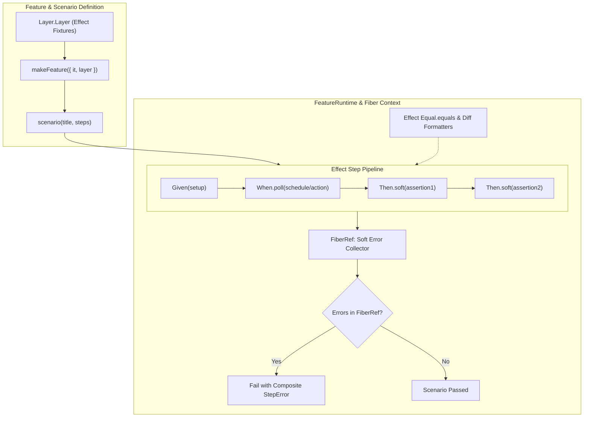
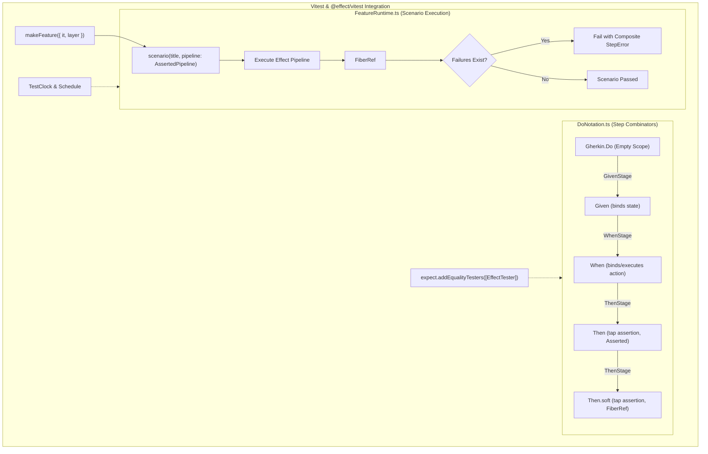

## Goal Capsule

- **Objective**: Elevate `@systemfsoftware/effect-gherkin-spec` into a state-of-the-art BDD framework powered by modern Vitest 3+ capabilities, integrating first-class Vitest fixtures with Effect layers, non-aborting soft step assertions, resilient polling/retry step combinators, and custom Effect equality matchers.
- **Means**: Reconcile the Vitest fixture contract onto the existing Layer-backed builders (`withLayer` / `withScenarioLayer`, owned by U7), `Then.soft` / `And.soft` for multi-failure scenario collection, `When.poll` / `Then.poll` for eventual-consistency assertions, and custom Vitest matchers/equality testers (`Equal.equals`, `StepError`, Schema decoding).
- **Product Authority**: Author and maintainers of `@systemfsoftware/effect-gherkin-spec`.
- **Open Blockers**: None.

---

## Product Contract

### Summary

This proposal establishes **Effect-native** BDD testing by grounding every Gherkin step, fixture, and assertion in Effect-TS primitives (`Effect`, `Layer`, `Scope`, `FiberRef`, `Equal.equals`, `Schema`), using compile-time and runtime forcing functions to prevent AI models and engineers from writing degraded tests:

1. **Effect Layer & Scope as the Sole Fixture Model**: Vitest test context and fixtures are reconciled into typed Effect `Layer`s (`Layer.scoped`, `Layer.fresh`, `Layer.mergeAll`). No untracked mutable closures or `async/await` fixture callbacks.
2. **First-Class Effect Assertion Combinators**: Assertions inside `Then` / `Then.soft` / `Then.poll` are typed Effect programs (`Effect<AssertionResult, StepError, R>`). No unhandled promise rejections, no stock JavaScript `===`, and no raw `expect()` statements.
3. **The Pure Effect BDD Sandwich**: `Gherkin.Do` transitions through strictly typed pipeline stages (`GivenStage -> WhenStage -> ThenStage`), enforcing `Given* -> When+ -> Then+` at compile time and requiring the `Asserted` brand before `scenario()` will compile.
4. **FiberRef Error Accumulator for Soft Assertions**: Soft step failures collect within a scoped `FiberRef<Chunk<StepAssertionFailure>>`, executing subsequent assertions without crashing the fiber and surfacing all failures via `Cause.fail` at scenario exit.
5. **TestClock & Schedule Integration for Polling**: `Then.poll` uses Effect's `Schedule` and virtual `TestClock` (from `@effect/vitest`), running instant, deterministic polling without burning real wall-clock time.

### Problem Frame

Existing BDD tools (`cucumber-js`, `jest-cucumber`, `vitest-cucumber`) and standard test scripts in AI agents introduce three fatal anti-patterns when applied to Effect codebases:

1. **Bypassing the Effect Runtime**: AIs drop out of Effect into raw JavaScript (`async/await`, `expect(...)`, mutable variables). They perform assertions outside the Effect fiber, losing fiber interruption, structured concurrency, typed error channels, and scoped resource finalizers.
2. **False Positives & Negatives from Stock Equality**: Vitest's default `expect().toEqual()` inspects prototype chains and internal hidden properties. Effect's immutable data types (`Data.struct`, `Data.TaggedClass`, `Chunk`, `Option`, `Either`, `HashMap`) require `Equal.equals`. Without native equality integration, AIs either get spurious failures or work around them with loose structural approximations (`expect.objectContaining`).
3. **Untracked Fixture Resources**: Fixtures that spawn services, background fibers, or database connections must be bound to Effect's `Scope`. Standard Vitest fixtures run outside the Effect composition root, risking orphaned fibers and resource leaks between tests.
4. **Wall-Clock Polling**: AIs write polling assertions with `setInterval` or `Effect.sleep` on real time, making CI suites slow and flaky instead of leveraging Effect's `TestClock.adjust`.

### Key Decisions

- **Comprehensive v5 Elevation**: Elevates the library into an Effect-first BDD framework combining Layer-backed Fixtures, Soft Assertions via FiberRef, Schedule-driven Polling, and Effect Equal Value Assertions. Governs R1, R2, R3, R4, R5, R6, R7, R8, R9, R10, R11, R12, R13, R14, R15, R16, R17, R18, R19, R20, R21, R22.
- **Layer & Scope as the Sole Fixture Abstraction**:
  Instead of wrapping raw Vitest callbacks, `Feature.layer()` and `Feature.scenarioLayer()` remain the canonical fixture mechanisms. For Vitest `test.extend` compatibility, fixtures are represented as typed `Layer.Layer<R, E, Scope.Scope>` instances. Scoped resources acquire and release within Effect's `Scope`, ensuring deterministic fiber finalization. Governs R1, R2, R21.
- **Equivalence & Effect Equality as the Sole Value Comparison Law**:
  All value assertions must evaluate equality strictly via Effect's `Equal.equals` and algebraic `Equivalence<A>` contracts. Ad-hoc custom assertion parsers are excluded; step verification must accept standard `Equivalence<A>` instances or Schema-derived equivalences (`Schema.equivalence(schema)`) and register them into Vitest's custom equality tester pipeline (`expect.addEqualityTesters`). Governs R7, R16, R17, R20.
- **FiberRef Soft Error Accumulation**:
  Soft step failures accumulate in an ambient `FiberRef<Chunk<StepAssertionFailure>>` inside `FeatureRuntime`. Failed soft assertions do not interrupt the fiber, allowing subsequent independent checks to run. At scenario completion, all collected failures are squashed into a composite `StepError` with full diffs. Governs R3, R4.
- **TestClock & Schedule Virtual Time Polling**:
  `Then.poll` combinators integrate directly with Effect's `Schedule` and `@effect/vitest`'s `TestClock`. When running with `TestClock`, time advances deterministically without waiting on real wall-clock delays, preventing flaky async test suites. Governs R5, R6.
- **Type-Level BDD Sandwich Grammar**:
  Compile-time stage transitions enforce `GivenStage -> WhenStage -> ThenStage`. Scenarios without assertions, binding variables inside `Then`, or calling `When` after `Then` are rejected at compile time. Governs R11, R12, R13, R14, R15.
- **Native Vitest Annotations Integration**:
  Step execution progress and soft assertion failure tables are emitted directly to Vitest reporters using `task.annotate()`. Governs R22.

### Destructive Review & Assumption Stress-Testing

- **Assumptions Surfaced**:
  1. _Assumption 1 (Fixture Coupling)_: Vitest fixture lifecycles (`test.extend({ db: async ({}, use) => ... })`) can be bridged seamlessly into Effect's fiber runtime and `Scope` without tearing down resources prematurely or causing unhandled fiber leaks.
  2. _Assumption 2 (Soft Step Error Accumulation)_: Executing subsequent steps after a failed soft `Then` step will not cause uncaught exceptions or type violations downstream when later steps assume invariants established by the failed step.
  3. _Assumption 3 (Global Matcher Contamination)_: Extending Vitest's global `expect` with Effect custom equality testers (`Equal.equals`) will not alter standard Vitest equality semantics for non-Effect objects in the broader test runner.
- **Mutation Lens Applied**: _Inversion_ (Rotate from direct step extension to runtime interceptor / fiber supervisor).
- **Radical Alternative Evaluated**: Rather than altering `DoNotation.ts` step combinators directly, implement soft assertions and retry loops entirely at the fiber supervisor/runtime level (`FeatureRuntime.ts`), keeping step combinators pure and delegating aggregation to an ambient Scenario Context fiber ref.
- **Reconciliation**: We adopt the fiber-context accumulator in `FeatureRuntime` for soft step aggregation to keep `DoNotation.ts` step combinators composable and functional without stateful mutation.

- **Vitest-Native Alternatives Evaluated (added in review)**: Vitest 3+ ships `expect.soft` (non-aborting assertions) and `expect.poll` (built-in retry-until-pass). Both were rejected as the primary mechanism: `expect.soft` reports through Vitest's assertion channel, bypassing the typed `StepError`/`Cause` pipeline that composite Gherkin failure reporting depends on, and `expect.poll` polls on the wall clock with no `TestClock` integration, reintroducing the flaky real-time behavior R6 exists to eliminate. The Effect-native FiberRef accumulator and `Schedule`-driven polling are retained because they keep failures inside Effect's typed error channel while remaining composable with Vitest's reporter; `expect.soft`/`expect.poll` remain available to users inside step bodies but are not the library's aggregation mechanism.

### Test Layer Classification & Admission (per test-layer-selection)

| Component / Surface                                             | Permitted Test Kind                   | Permitted Location                                 | Rationale & Invariants                                                                                                              |
| :-------------------------------------------------------------- | :------------------------------------ | :------------------------------------------------- | :---------------------------------------------------------------------------------------------------------------------------------- |
| Layer-backed Fixture Bridge (`withLayer` / `withScenarioLayer`) | In-process Sociable Integration       | `tests/feature-fixtures.integration.test.ts`       | Proves fixture allocation and teardown through the existing Layer builders runs in-process with Effect `Scope`. No child processes. |
| Soft Assertion Steps (`Then.soft`)                              | In-process Sociable Integration       | `tests/gherkin-soft-steps.integration.test.ts`     | Proves multiple step failures accumulate and fail at scenario boundary with full diffs.                                             |
| Polling Steps (`When.poll`, `Then.poll`)                        | In-process Sociable Integration       | `tests/gherkin-polling-steps.integration.test.ts`  | Proves retry semantics against in-memory async delays; strictly deterministic timing.                                               |
| Custom Matchers (`Equal.equals`, `StepError`)                   | Colocated Unit / Sociable Integration | `tests/vitest-effect-matchers.integration.test.ts` | Tests custom equality tester registration and diff formatting on Effect Data/Equal structures.                                      |

### Requirements

#### Vitest Fixtures & Test Context Integration

- R1. Vitest fixtures must be reconciled into the existing Layer-backed builders (`withLayer` / `withScenarioLayer`): fixture values are represented as typed `Layer.Layer<R, E, Scope.Scope>` instances exposed to the Gherkin step scope or Effect Layer environment. No raw Vitest `test.extend` fixture-callback paradigm is added.
- R2. Resources acquired via fixtures (including fixtures with cleanup teardowns) must be safely released when the scenario finishes, integrated with Effect's `Scope`. The bridge from a Vitest `use()` cleanup callback to an Effect `Scope` finalizer is specified in U7.
- R21. Fixture Layer registration must support both shared and per-scenario lifetimes: suite/`file`-level fixtures map to outer shared Effect layers and per-`test` fixtures map to per-scenario fresh layers (`Layer.fresh`), mirroring Vitest's `test` vs `file`/`worker` fixture scopes.

#### Soft Step Assertions

- R3. The step DSL must export `Then.soft`, `And.soft`, and `But.soft` variants that execute assertion effects without terminating the remaining scenario steps upon failure.
- R4. If any soft step fails during a scenario, the scenario must fail at its completion boundary, reporting all collected assertion failures and diffs in the scenario summary.

#### Polling & Retryable Steps

- R5. The step DSL must export `When.poll` and `Then.poll` combinators to continuously evaluate an action or assertion until it succeeds or reaches a timeout.
- R6. Polling steps must support configurable `timeout`, `interval`, and optional exponential backoff via Effect `Schedule` or Vitest-style options.

#### Effect Custom Matchers & Equality

- R7. The library must provide a Vitest setup hook or exportable plugin extending `expect` with custom equality testers adhering to Effect `Equal.equals` for `Data.Case`, `Chunk`, `Option`, `Either`, and branded types.
- R8. Custom asymmetric matchers must be provided for Effect results: `expect.effectSuccess(valueOrMatcher)` and `expect.stepError(filter)`.
- R9. Assertion failures on Schema-decoded types must render rich decoding issue tree diffs rather than raw internal error objects, delivered via custom asymmetric matchers (`expect.extend`) — equality testers return only `boolean | undefined` and cannot carry diff payloads.

#### Type-Level Forcing Functions (BDD Grammar & Assertion Laws)

- R11. The Gherkin pipeline type contract must enforce grammatical BDD progression: a pipeline must progress through valid stage transitions (`Given`* -> `When`+ -> `Then`+), forbidding out-of-order calls such as `When` after `Then` or `Given` after `When`.
- R12. `Then` steps must strictly be tap operations with assertion return contracts; attempting to bind values to scope inside a `Then` step must be rejected at compile time.
- R13. The `scenario` runner must require a pipeline branded with an `Asserted` contract (carrying at least one `Then` / `Then.soft` step); attempting to pass a headless pipeline (only `Given` or `When`) must be rejected with a descriptive TypeScript compiler error (`'sentence: scenario must verify outcomes with at least one Then step'`).
- R14. Step text types must statically reject banned patterns (such as empty strings, single-token names, or imperative test names starting with `Should_` / `it_`) using template-literal types.
- R15. Assertion step bodies in `Then` / `Then.soft` must not be empty/no-op callbacks (`() => {}`); a body performing no assertion is rejected. Synchronous bodies containing real assertions (e.g. `expect(...)` calls returning `void`) remain valid per R10.

#### Equivalence & Value Assertion Laws

- R16. Step assertions must evaluate value equality strictly via Effect `Equal.equals` and algebraic `Equivalence<A>` contracts rather than raw JavaScript prototype comparisons.
- R17. The library must provide first-class combinators to assert against standard or Schema-derived equivalences (`Schema.equivalence(schema)`), integrating with Vitest's `expect.addEqualityTesters`.
- R18. The step verification engine must support semantic Effect outcome verifiers: asserting typed success values, verifying typed failure tags (`Cause.failureOption`), and Schema decode validation with formatted issue tree diffs.
- R19. Oxlint custom rules (delivered by extending `oxlint-plugin-test-hygiene` with a gherkin-shaped selector — no new plugin package) must statically forbid raw `expect(true).toBe(true)`, empty `Then` callbacks (`() => {}`), and unasserted effect blocks within Gherkin integration tests.
- R20. Assertion failure reporting must output native diffs formatted for Effect data structures (e.g. displaying diffs between `Chunk` elements or Schema decoding issue trees rather than internal prototype properties), delivered via the custom matchers in R8/R9 — equality testers cannot carry diff payloads.

#### Reporter & Runner Integration

- R22. The test runner integration must hook into Vitest's `task.annotate()` (on the current task obtained from the Vitest test context) to publish structured step execution events (duration, step keyword, soft failure counts) visible in Vitest HTML/JSON reporters.

#### DX & Backward Compatibility

- R10. Existing `makeFeature`, `Given`, `When`, `Then`, and `scenario` callsites must continue to function without breaking changes.

### Key Flows

- F1. **Scenario with Soft Assertions & Multi-failure Reporting**
  - **Trigger:** Scenario developer wants to verify multiple independent UI or domain state attributes after a single action.
  - **Steps:**
    1. Developer writes `Given('initial state')`, `When('action occurs')`, followed by multiple `Then.soft('field A is valid')` and `Then.soft('field B is valid')`.
    2. Step 1 executes; field A fails its expectation; the runtime captures the failure in an internal soft error collector and continues.
    3. Step 2 executes; field B also fails its expectation; failure captured.
    4. Scenario concludes; runtime checks the soft error collector, detects 2 failures, formats a composite `StepError` with both step texts and stack traces, and fails the Vitest test.
  - **Outcome:** Developer sees all mismatches in a single test run instead of fixing them one-by-one.
  - **Covered by:** R3, R4.

- F2. **Eventually Consistent Step with Polling**
  - **Trigger:** When step initiates an asynchronous task that takes variable time to reflect in domain read models.
  - **Steps:**
    1. Developer defines `Then.poll('order status becomes completed', { timeout: 3000, interval: 100 })((s) => checkStatus(s.orderId))`.
    2. The runtime repeats the assertion effect at the specified interval using Effect's scheduling until the expectation succeeds.
    3. If the timeout expires before succeeding, the step fails with a clear timeout `StepError` detailing the last observed state.
  - **Covered by:** R5, R6.

- F3. **Vitest Fixture Injection via Layer-Backed Builders**
  - **Trigger:** Test suite requires shared databases, mock servers, or browser instances managed through Vitest test context fixtures.
  - **Steps:**
    1. Developer represents the fixture as a typed Layer: `const dbLayer = Layer.scoped(DatabaseTag, Effect.acquireRelease(openDb, (db) => db.cleanup()))` and registers it via the existing `Feature.withLayer(dbLayer)` (shared) or `Feature.withScenarioLayer(dbLayer)` (per-scenario fresh) builders.
    2. Inside `Feature('Database tests').body(({ scenario }) => ...)`, scenario steps access `db` through the Effect environment (`yield* DatabaseTag`) or a pre-bound scope field.
    3. Fixture teardown runs automatically as an Effect `Scope` finalizer when the scenario (or suite, for shared layers) finishes. Where a raw Vitest `use()` cleanup callback must be honored, U7 specifies the bridge that converts it into a `Scope` finalizer.
  - **Covered by:** R1, R2, R21.

### Acceptance Examples

- AE1. **Soft step failure aggregation**
  - **Covers R3, R4.**
  - **Given:** A scenario with two `Then.soft` steps where both assertions throw `AssertionError`.
  - **When:** The scenario is executed by Vitest.
  - **Then:** Both steps are executed, the Vitest test fails, and the error report contains descriptions and diffs for both failed steps.

- AE2. **Polling step success on retry**
  - **Covers R5, R6.**
  - **Given:** A state counter that starts at 0 and increments every 50ms asynchronously.
  - **When:** A `Then.poll('counter reaches 3', { timeout: 1000, interval: 20 })` step executes.
  - **Then:** The step polls until counter is 3 and succeeds without failing the scenario.

- AE3. **Effect Equal.equals Custom Equality**
  - **Covers R7.**
  - **Given:** Two separate instances of an Effect `Data.struct({ id: 1, name: 'Alice' })` or `Chunk.make(1, 2)`.
  - **When:** `expect(actual).toEqual(expected)` is invoked inside a `Then` step.
  - **Then:** The assertion succeeds based on value equality defined by Effect `Equal.equals`.

- AE4. **Fixture lifecycle with Effect Scope**
  - **Covers R1, R2.**
  - **Given:** A fixture that allocates a temporary directory and deletes it on teardown.
  - **When:** A scenario using this fixture completes (whether succeeding or failing).
  - **Then:** The fixture teardown function is guaranteed to run, deleting the temporary directory.

- AE5. **Compile-time rejection of assertionless scenario (forcing function)**
  - **Covers R11, R13.**
  - **Given:** A pipeline containing only `Given('setup')` and `When('action')` steps without any `Then` assertion.
  - **When:** Passed into `scenario('A scenario without assertions', pipeline)`.
  - **Then:** TypeScript compilation fails with type error `'sentence: scenario must verify outcomes with at least one Then step'`.

- AE6. **Compile-time rejection of out-of-order BDD grammar (forcing function)**
  - **Covers R11, R12.**
  - **Given:** A pipeline attempting to call `When` or `Given` after a `Then` step, or attempting to bind a new scope variable in `Then`.
  - **When:** The pipeline is authored in TypeScript.
  - **Then:** TypeScript type-check rejects the pipeline at the illegal combinator callsite.

### Scope Boundaries

- **Deferred for later**:
  - Visual snapshot diffing inside Gherkin steps (handled by separate Storybook/visual regression tools).
  - Automatic distributed sharding orchestration across remote Vitest clusters (relies on native Vitest CLI `--shard`).
- **Outside this product's identity**:
  - Non-Effect testing integrations (this library strictly targets Effect-TS and Vitest).
  - Replacing Cucumber CLI or supporting non-TypeScript feature file runners (gherkin-in-code DSL is the core design).

### Dependencies / Assumptions

- Target Vitest version: Vitest >= 3.0.0 (catalog:vitest).
- Target Effect version: Effect >= 3.13.0 (catalog:peers).
- Fixtures rely on Vitest's `test.extend` API semantics for acquisition timing only; fixture values are always represented as typed Effect Layers (R1).

### Outstanding Questions

- **Resolved in review (2026-09-20)**: Fixtures are exposed exclusively as typed Layers via the existing `withLayer` / `withScenarioLayer` builders; no raw Vitest fixture-callback paradigm is added. Ownership: U7.
- **Deferred to Planning**: Determine the exact error aggregation report formatting (e.g. whether to format as a Gherkin scenario failure table or standard Vitest multi-assertion stack).

### Sources / Research

- [Epic Web Dev: Advanced Vitest Patterns](https://github.com/epicweb-dev/advanced-vitest-patterns)
- [Vitest Test Context & Fixtures Documentation](https://vitest.dev/guide/test-context.html)
- [Vitest Soft Assertions](https://vitest.dev/guide/features.html#soft-assertions)
- `@systemfsoftware/effect-gherkin-spec` codebase: `src/Feature.ts`, `src/DoNotation.ts`, `src/FeatureRuntime.ts`.

---

## Planning Contract

### Key Technical Decisions

- KTD1. **Directly-Registered Effect Equality Testers + Matcher-Based Diffs**
  Implement hand-written Vitest equality testers and register them by calling `expect.addEqualityTesters([...])` directly from this package's `vitest.setup.ts`. Do NOT delegate to `@effect/vitest`'s `addEqualityTesters()` helper: its vendored body registers an empty tester array and its signature accepts no testers (`repos/effect/packages/vitest/src/internal/internal.ts`). Each tester probes both sides for `Equal.symbol` and returns `Equal.equals(a, b)` only when BOTH sides carry it; otherwise it returns `undefined` to defer to default Vitest equality — never `false` — so mixed pairs (Effect `Chunk` vs plain array) and non-Effect values in other workspace packages are untouched (resolves Assumption 3). Rich diffs (R9, R20) are NOT delivered here: testers return only `boolean | undefined`, so Schema issue-tree diffs ship via a separate `expect.extend({...})` matcher block in the same setup file. Registration is worker-scoped: only suites loading this package's setup file see the testers. Governs R7, R16, R17.

- KTD2. **Type-Level BDD Stage Transitions via a Scope-Carried Stage Tag (The Gherkin Sandwich)**
  Thread the BDD stage as a tag carried on the scope record (`GherkinScope<A & { readonly stage: Stage }>` with `Stage = GivenStage | WhenStage | ThenStage | AssertedPipeline`) — the only discrimination mechanism that keeps `bindStep`'s runtime-discriminated tap/bind overload union intact without casts (a phantom fifth generic would be erased by the unannotated implementation signature; the repo's no-cast constitution forbids the `as never` escape). The change is ADDITIVE: `Given`/`When` advance the stage tag; `Then` requires `WhenStage | ThenStage` and keeps its tap-only arity (binding inside `Then` is already rejected by arity today — the stage tag's net-new enforcement is stage ORDERING and the `AssertedPipeline` brand on `scenario()`). The stage brand must also be threaded through `extensions/Pairwise.ts` (`bindPairwise`) and `Gherkin.startWith`, or every Pairwise/pre-seeded pipeline fails to compile against the new `scenario()` contract. `FeatureRuntime.ts` is touched only where the brand mechanically requires it. Governs R11, R12, R13, R14, R15.

- KTD3. **FiberRef Soft Error Collector with Sync-Throw Capture**
  Implement `Then.soft`, `And.soft`, and `But.soft` in `DoNotation.ts`. The step body is wrapped in `Effect.try` so that SYNCHRONOUS throws (including `AssertionError` from plain `expect(...)` calls — the dominant style in the existing suite) are converted into `StepAssertionFailure` records appended to a `FiberRef<Chunk<StepAssertionFailure>>` instead of escaping the fiber; the step then returns the current scope, allowing subsequent steps to run. Without this wrap, a sync `expect` failure aborts the scenario at the first soft step — the exact behavior soft assertions exist to prevent. `FeatureRuntime` inspects the `FiberRef` at the end of the scenario and fails with a composite `StepError` if any failures accumulated. U3 must verify FiberRef inheritance across `Layer.fresh` / `Layer.mergeAll` (per-scenario isolation: siblings never share the collector). Governs R3, R4.

- KTD4. **Schedule Polling Combinators on the Inherited TestClock**
  Implement `Then.poll` and `When.poll` using `Effect.retry` / `Effect.schedule` with an Effect `Schedule`. Virtual time is inherited, not wired: `@effect/vitest` already merges `TestClock.layer()` into its default `TestEnv` (see `repos/effect/packages/vitest/src/internal/internal.ts` — `TestEnv = Layer.mergeAll(TestConsole.layer, TestClock.layer())`) and provides it to every `it.effect` scenario, so no TestClock integration is built in this unit. The existing `liveClock()` builder toggle remains the escape hatch for wall-clock polling. Governs R5, R6.

- KTD5. **Oxlint Anti-Slop Rules via `oxlint-plugin-test-hygiene` Extension**
  Do NOT create a new `oxlint-plugin-gherkin` package: `oxlint-plugin-test-hygiene` already ships `no-behaviourless-assertion` (bans inert `expect(true).toBe(true)` calls) and `damp-test-naming` (bans `Should_`/`it_` formats), covering every anti-pattern this plan names. The net-new work is one gherkin-shaped selector added to `no-behaviourless-assertion` so an empty `Then('...')(() => {})` callback — currently allowed because the callback has no `expect` subject — is flagged inside Gherkin integration tests. Governs R14, R19.

- KTD6. **Vitest Test Annotations via Captured Task Context**
  Hook scenario and step execution into `task.annotate()` to report step timings, keywords, and soft-failure diffs to Vitest's native reporters (HTML/JSON). The Vitest task handle is NOT reachable from the Effect-side context (`@effect/vitest`'s `TestContext` is `TestConsole | TestClock` — no `task` member), so `makeFeature` captures the Vitest `TestContext` from the `it.effect` closure at scenario registration and threads it into the step runtime via an Effect `Context.Reference` holding the current task; step combinators read that reference to annotate. Governs R22.

### High-Level Technical Design

---

## Implementation Units

### U1. Effect Equality Tester and Assertion Foundation

- **Goal**: Implement Effect's `Equal.equals` and `Equivalence<A>` as a Vitest custom equality tester and register it with `expect.addEqualityTesters`.
- **Requirements**: R7, R8, R9, R16, R17, R18, R20
- **Dependencies**: None
- **Files**: `packages/effect-gherkin-spec/src/EqualTester.ts`, `packages/effect-gherkin-spec/vitest.setup.ts`
- **Approach**: Create a `makeEffectEqualityTester` function matching the `EqualityTester` interface from `@vitest/expect`. Register it by calling `expect.addEqualityTesters([...])` DIRECTLY from `vitest.setup.ts` — never via `@effect/vitest`'s `addEqualityTesters()` helper, whose vendored body registers an empty array. Discrimination predicate: probe both sides for `Equal.symbol`; return `Equal.equals(a, b)` only when BOTH carry it, otherwise return `undefined` (never `false`) to defer to default Vitest equality. Rich diffs for R9/R20 ship via a separate `expect.extend({...})` matcher block in the same setup file.
- **Test scenarios**:
  1. Two separate `Data.struct({ id: 1 })` instances pass `expect(a).toEqual(b)`.
  2. `Chunk.make(1, 2)` vs `Chunk.make(1, 3)` fails with formatted diff.
  3. Standard non-Effect objects fall through to default Vitest equality.
  4. Mixed pair (`Chunk.make(1, 2)` vs plain `[1, 2]`) falls through to default equality rather than returning a spurious `false` from the Effect tester.
- **Verification**: `pnpm --filter @systemfsoftware/effect-gherkin-spec test` passes.

### U2. Type-Level BDD Stage Transitions (Gherkin Sandwich)

- **Goal**: Refactor the step combinators to enforce compile-time BDD stage transitions (`Given* -> When+ -> Then+`).
- **Requirements**: R11, R12, R13, R14, R15
- **Files**: `packages/effect-gherkin-spec/src/DoNotation.ts`, `packages/effect-gherkin-spec/src/extensions/Pairwise.ts`, `packages/effect-gherkin-spec/src/FeatureRuntime.ts` (only where the brand mechanically requires it)
- **Approach**: Carry the stage as a tag on the scope record (`GherkinScope<A & { readonly stage: Stage }>`, `Stage = GivenStage | WhenStage | ThenStage | AssertedPipeline`) per KTD2 — additive brands, no phantom-generic refactor of the overload wall. Update `Given`/`When` to advance the tag; `Then` requires `WhenStage | ThenStage` and keeps tap-only arity. Update `scenario` to require `AssertedPipeline`. Thread the same brand through `bindPairwise` (`extensions/Pairwise.ts`) and `Gherkin.startWith` so extension and pre-seeded pipelines still compile.
- **Test scenarios**:
  1. Type-check succeeds for `Given -> When -> Then` sequence.
  2. Type-check fails for `When -> Given`.
  3. Type-check fails for `Then('...')('bind', ...)` (binding in Then).
  4. Type-check fails for scenario with zero `Then` steps.
  5. A Pairwise pipeline and a `Gherkin.startWith` pipeline both type-check against the new `scenario()` contract.
  6. Regression: `tests/gherkin-step-combinators.integration.test.ts` passes UNMODIFIED (R10).
- **Verification**: `pnpm --filter @systemfsoftware/effect-gherkin-spec typecheck` exits 0. Type-level tests in `tstyche` or `expect-type` pass.

### U3. FiberRef Soft Assertion Steps

- **Goal**: Implement `Then.soft`, `And.soft`, and `But.soft` combinators using a `FiberRef` accumulator.
- **Requirements**: R3, R4
- **Dependencies**: U2
- **Files**: `packages/effect-gherkin-spec/src/DoNotation.ts`, `packages/effect-gherkin-spec/src/FeatureRuntime.ts`
- **Approach**: Implement `Then.soft` to wrap the step body in `Effect.try` so synchronous throws (including `AssertionError` from plain `expect(...)` bodies) are caught and appended as `StepAssertionFailure` records to the `FiberRef`, then return the scope. Update `FeatureRuntime` to check the `FiberRef` after the scenario finishes and fail with a composite error if the ref is not empty. Verify the `FiberRef` is isolated per scenario across `Layer.fresh` / `Layer.mergeAll`.
- **Test scenarios**:
  1. A scenario with two failing `Then.soft` steps runs both and fails once with two error messages.
  2. A scenario with one failing `Then.soft` and one passing `Then.soft` fails with only the failing error.
  3. A synchronous `expect(...)` failure inside `Then.soft` does NOT abort subsequent `Then.soft` steps (both failures appear in the composite error).
- **Verification**: `pnpm --filter @systemfsoftware/effect-gherkin-spec test` passes.

### U4. TestClock and Schedule Polling Steps

- **Goal**: Implement `When.poll` and `Then.poll` using Effect `Schedule` and `TestClock`.
- **Requirements**: R5, R6
- **Dependencies**: U2
- **Files**: `packages/effect-gherkin-spec/src/DoNotation.ts`, `packages/effect-gherkin-spec/src/FeatureRuntime.ts`
- **Approach**: Wrap step effects with `Effect.retry` and `Schedule.spaced(interval)`. TestClock availability is inherited from `@effect/vitest`'s default `TestEnv` (no implementation work); polling advances virtual time deterministically without wall-clock sleeps. Live-clock contract: under the `liveClock()` builder toggle, poll steps run against the real wall clock — permitted by design for integration scenarios, documented in the step's TSDoc with a warning that `timeout`/`interval` consume real time; no silent fast-path is taken.
- **Test scenarios**:
  1. A `Then.poll` step succeeds when the condition flips after 3 virtual ticks.
  2. A `Then.poll` step fails with a timeout error after virtual time expires.
- **Verification**: `pnpm --filter @systemfsoftware/effect-gherkin-spec test` passes.

### U5. Oxlint Anti-Slop Rules

- **Goal**: Extend `oxlint-plugin-test-hygiene` with a gherkin-shaped selector preventing low-quality assertions in Gherkin specs. NO new plugin package is created — `no-behaviourless-assertion` and `damp-test-naming` already cover `expect(true).toBe(true)` and `Should_` naming.
- **Requirements**: R14, R19
- **Dependencies**: None
- **Files**: `packages/oxlint-plugin/oxlint-plugin-test-hygiene/src/rules/no-behaviourless-assertion.ts` (+ its `.config.ts` and tests)
- **Approach**: Add a gherkin-shaped selector to `no-behaviourless-assertion` so an empty `Then('...')(() => {})` callback — currently allowed because the callback has no `expect` subject — is flagged inside Gherkin integration tests.
- **Test scenarios**:
  1. Lint fails on `expect(true).toBe(true)` inside a test file (existing rule, regression check).
  2. Lint fails on `Then('empty')(() => {})` (new gherkin selector).
- **Verification**: `pnpm --filter @systemfsoftware/oxlint-plugin-test-hygiene test` passes.

### U6. Vitest Test Annotations Integration

- **Goal**: Integrate step execution reporting into Vitest's `task.annotate()` API.
- **Requirements**: R22
- **Dependencies**: U2, U3
- **Files**: `packages/effect-gherkin-spec/src/Feature.ts`, `packages/effect-gherkin-spec/src/FeatureRuntime.ts`
- **Approach**: `makeFeature` captures the Vitest `TestContext` from the `it.effect` closure at scenario registration and threads it into the step runtime via an Effect `Context.Reference` holding the current task (the Effect-side `TestContext` has no `task` member). Step combinators read the reference and call `task.annotate()` when each step begins and completes, including duration and soft-error status.
- **Test scenarios**:
  1. `task.annotations` includes `Step: Given ... completed` entries after a scenario runs.
  2. Soft failures are recorded in the annotations.
- **Verification**: `pnpm --filter @systemfsoftware/effect-gherkin-spec test` passes.

### U7. Fixture Contract Reconciliation (Layer-Backed Builders)

- **Goal**: Reconcile the fixture requirements onto the existing Layer-backed builders and prove the bridge; no new fixture API is built.
- **Requirements**: R1, R2, R10, R21
- **Dependencies**: None
- **Files**: `packages/effect-gherkin-spec/tests/feature-fixtures.integration.test.ts`, TSDoc on `withLayer` / `withScenarioLayer` in `packages/effect-gherkin-spec/src/Feature.ts`
- **Approach**: Document the canonical fixture model (fixtures as typed `Layer.Layer<R, E, Scope.Scope>` via `withLayer` shared / `withScenarioLayer` per-scenario fresh) and specify the bridge from a raw Vitest `use()` cleanup callback to an Effect `Scope` finalizer (`Effect.acquireRelease` / `Scope.addFinalizer`). Prove both lifetime mappings (shared outer layer vs `Layer.fresh` per scenario) through the existing builders.
- **Test scenarios**:
  1. A fixture acquired through `withScenarioLayer` releases its `Scope` finalizer when the scenario finishes (success and failure paths).
  2. A fixture acquired through `withLayer` is shared across scenarios in the suite and released at suite teardown.
- **Verification**: `pnpm --filter @systemfsoftware/effect-gherkin-spec test` passes.

---

## Verification Contract

- **Unit tests**: `pnpm --filter @systemfsoftware/effect-gherkin-spec test`
- **Type-level tests**: `pnpm --filter @systemfsoftware/effect-gherkin-spec test:types` (via `tstyche` or `expect-type`)
- **Linting**: `pnpm --filter @systemfsoftware/effect-gherkin-spec lint` and `pnpm --filter @systemfsoftware/oxlint-plugin-test-hygiene test`
- **Build**: `pnpm --filter @systemfsoftware/effect-gherkin-spec build`

---

## Definition of Done

- All implementation units (U1-U7) are executed and verified.
- `pnpm check:local` passes across the workspace.
- No regressions in existing Gherkin test suites (`packages/effect-gherkin-spec/tests/*.integration.test.ts`).
- Documentation updated to reflect the new Effect-native assertion DSL and fixture model.
