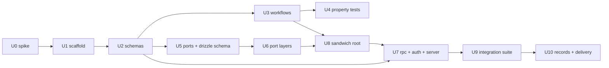

## Goal Capsule

- **Objective**: Prove that the Cell Architecture compound pack rules remain expressive, robust, and non-brittle when applied to a complex, real-world domain by creating a fully working e-commerce inventory fulfillment example package under `examples/inventory-fulfillment` — served over a real `effect/unstable/rpc` HTTP backend, persisted through drizzle-orm into Postgres (PGlite in tests), and guarded by better-auth.
- **Means**: Implement an end-to-end executable example package (`examples/inventory-fulfillment`) in the workspace demonstrating multi-warehouse allocation, priority credit checks, optimistic concurrency conflict compensation, and SKU bundle/perishable expiration logic behind a real RPC wire — with zero mocks, strict cyclomatic complexity 1 pure workflows, and typed Sandwich continuation pipelines.
- **Product Authority**: The repository owner via `ce-brainstorm` dialogue, with a post-brainstorm scope redirect (session-settled): the backend must be a real `@effect/rpc`-line backend using drizzle-orm (Effect integration) and better-auth — "full SOTA". This supersedes the brainstorm's original exclusion of live DB infrastructure and HTTP server frameworks.
- **Open Blockers**: None. Compatibility facts verified against the vendored tree and the npm registry (see Backend Stack Contract).

## Product Contract

### Summary

An end-to-end executable example package under `examples/inventory-fulfillment` that stress-tests the Cell Architecture compound pack (`compound-packs/cell-architecture/`). It verifies that high-complexity domain requirements — multi-warehouse allocation, VIP credit checks, optimistic concurrency compensation, and perishable bundle routing — execute cleanly within the pure-core single-path constraints (`Workflow.make`, cyclomatic complexity = 1, exhaustive dispatch) and typed I/O continuation chains (`Sandwich`), behind a real authenticated RPC backend with real persistence, without developer friction or typing workarounds.

### Problem Frame

The Cell Architecture compound pack defines strict architectural mandates:

1. Pure core functions must have Cyclomatic Complexity = 1 and use exhaustive dispatch (`pure-decision-core.md`).
2. Every workflow must be instantiated via `Workflow.make` with branded tagged unions and `S.TaggedError` errors (`workflow-constructor-boundary.md`, `workflow-channel-contracts.md`).
3. Every external interaction must follow the I/O sandwich (`read -> decode -> decide -> encode -> write`) with zero interleaved I/O (`io-sandwich-sequence.md`).
4. Capability ports must be declared separately from concrete `Layer` implementations (`ports-separate-from-layers.md`).
5. External data must be decoded via Schemas, never cast (`decode-never-cast.md`).

When developers encounter these strict rules, the common skepticism is: _"Can you actually write realistic, sophisticated business logic under these constraints without the code becoming brittle, convoluted, or unmaintainable?"_

Without a concrete, production-grade example showcasing sophisticated real-world domain challenges, developers and AI agents may assume the rules only work for trivial toy problems or attempt to introduce escape hatches and suppression comments.

A pure in-memory demonstration would leave the strongest form of the skepticism unanswered: that the rules hold only while the shell is a toy. The redirect makes the shell real — RPC wire, database, auth — so the example proves the core survives a production-shaped shell untouched.

### Destructive Review

#### Phase 1: Assumptions Surfaced

1. **Multi-warehouse allocation state is small enough to pre-fetch entirely in the initial `read` phase without unbounded memory bloat.**
2. **SKU bundle decomposition and perishable expiration filtering can be expressed as pure `map`/`fold` transformations without exceeding Cyclomatic Complexity 1 or requiring procedural loops.**
3. **Optimistic concurrency conflicts can be modeled purely as decision outcomes (`ConflictRollback`) that the writer handles, rather than catching and retrying inside the pure filling.**

#### Phase 2: Mutation Lens

- **Selected**: _Scope Challenge_ (rotated from Naivete).
- **Rationale**: The proposed example package risks trying to solve all fulfillment edge cases simultaneously or conversely degrading into isolated toy helper functions that avoid the hardest sandwich/purity seams.

#### Phase 3: Divergence & Radical Alternative

- **Failures Identified**:
  1. If pre-fetching reads all warehouse stock globally, the sandwich read phase becomes unscalable for high-SKU catalogs.
  2. If bundle explosion produces multi-phase cascading decisions, a single sandwich cannot represent order-dependent stock reallocation without interleaving I/O.
  3. If compensation events require database updates across separate storage engines, the `write` phase could perform implicit nested workflows.
- **Radical Alternative**: Structure the inventory allocation as a multi-stage deterministic state fold: pre-fetch _only_ the specific order's SKU inventory partitions across candidate warehouses, execute bundle explosion as a pure schema transformation codec, fold allocation purely across candidate lots using deterministic priority queues, and emit an atomic reservation batch payload for the single `write` phase.

#### Phase 4: Convergence (Delta & Remediation)

- **Kept**: Strict pack rule compliance, zero mocks, pure `Workflow.make` decisions with CC=1, typed Sandwich pipelines.
- **Replaced**: Unbounded catalog pre-fetching replaced with targeted partition pre-fetching bounded by the order's explicit SKU set.
- **Added**: Explicit test layer placement according to `skill://test-layer-selection`: colocated `*.property.test.ts` for pure workflows, and in-process sociable integration tests for the sandwich shell. Zero unit tests for middle cells.
- **Removed**: Out-of-scope external network delivery gateways and UI dashboards.

#### Scope Amendment (post-brainstorm redirect)

- **Changed by product authority**: the shell is no longer in-memory. The backend is a real `effect/unstable/rpc` server on `@effect/platform-node`, persistence is drizzle-orm over `@effect/sql-pg` (production path) and `@effect/sql-pglite` (test path), and authentication is better-auth with its official Drizzle adapter.
- **Unchanged**: the four pure decision workflows, the Sandwich shape, the test layer allocation, and zero-escape-hatch compliance. The redirect swaps the shell; the core must not notice. That invariance is itself the acceptance proof.
- **Amended record rows**: Scope Boundaries (live DB infra and server transport are now in scope; docker remains out).

### Key Decisions

- **Domain Model: Sophisticated E-Commerce Inventory & Order Fulfillment**: Exercises 4 concurrent complexity dimensions in a single cohesive flow rather than multiple disconnected toy examples.
  - (session-settled: user-directed — chosen over distributed lease or webhook ingestion: provides the richest multi-entity branching, pre-fetching, and compensation scenarios).
  - Governs R1, R2, R3, R4, R5.
- **Packaging: Self-Contained Workspace Package under `examples/`**: Located at `examples/inventory-fulfillment/` with its own `package.json`, `tsconfig.json`, source files, and test suite, integrated into the pnpm/turbo monorepo; `private: true` so it can never demand a changeset intent.
  - (session-settled: user-directed — chosen over placing directly inside `packages/effect-cell-types/tests/`: demonstrates the full standalone authoring experience for external consumers).
  - Governs R6, R7, R9.
- **Strict Pack Compliance with Zero Escape Hatches**: No oxlint suppression comments, no `as` casting, no `any`, and no cyclomatic complexity rule overrides.
  - (session-settled: user-approved — chosen over relaxing rules for examples: only genuine compliance validates the compound pack).
  - Governs R8, R9, R14.
- **Test Layer Allocation**: Pure decision workflows earn property tests (`*.property.test.ts`), while the operational sandwich shell earns sociable in-process integration tests (`*.integration.test.ts`) that boot a real server on an ephemeral port against a real in-process Postgres. Dedicated unit tests for middle steps or intermediate functions are strictly forbidden per `skill://test-layer-selection`.
  - (session-settled: user-approved — chosen over mock-based unit tests; redirect reinforced: no docker, no testcontainers — the embedded engine is PGlite).
  - Governs R10.
- **Backend Stack: Effect-v4-native RPC + drizzle + better-auth** (redirect-settled):
  - Transport: `effect/unstable/rpc` shipped by the pinned `effect@4.0.0-rc.116`. The npm `@effect/rpc@0.76.2` is the Effect v3 line (peers `effect ^3.22.1`) and is unusable at this pin; v4 ships RPC in-tree. Source of truth: vendored `repos/effect/packages/effect/src/unstable/rpc/` (REPO-W4).
  - Persistence: `drizzle-orm@1.0.0-rc.5-5935859` (rc.5 canary; REQUIRED — rc.4 calls `Schema.TaggedErrorClass`, removed from the effect line after `4.0.0-beta.105`, and dies at runtime on rc.116; rc.5 peers `effect >=4.0.0-beta.105 || >=4.0.0`) via `drizzle-orm/effect-postgres` over `@effect/sql-pg@4.0.0-rc.116`, with `drizzle-kit` for migration generation. Drizzle's `createInsertSchema` effect-schema codegen is v3-oriented and is NOT used: domain contracts stay hand-authored `S.Class`, rows decode via `S.decodeUnknown` at the port.
  - Test engine: `drizzle-orm/effect-pglite` over `@effect/sql-pglite@4.0.0-rc.116` (rc dist-tag matches the pin exactly) — in-process Postgres through the same Effect SqlClient/drizzle session machinery as production, no TCP socket server, no docker. Migrations run through `effect-pglite/migrator` in tests.
  - Auth: better-auth with its official Drizzle adapter; framework-agnostic `auth.handler` mounted at `/api/auth/**` on the same `HttpRouter` that serves `/rpc`; RPC routes guarded by an `RpcMiddleware` calling `auth.api.getSession` wrapped in `Effect.tryPromise` mapping to a typed `Unauthorized` `S.TaggedError`. Community Effect wrappers (`effectful-better-auth`, `effect-better-auth`) were surveyed and declined as unvetted third-party boundaries (REPO-W8 record owed).
  - Governs R11, R12, R13, R15.
- **Version Pinning: catalog-exact, no floating aliases**: `drizzle-orm: 1.0.0-rc.5-5935859` pinned exactly (the U0 spike proved rc.4 is runtime-incompatible with the effect rc.116 line, promoting the canary from fallback to required pin). Effect-line deps ride the existing `4.0.0-rc.116` pin. No `@rc`/`@next` alias resolution anywhere.
  - (assistant-proposed, user-confirmed during scope synthesis).
  - Governs R12.
- **Conflict Handling: shell compare-and-set with bounded re-run**: optimistic concurrency is enforced by a version-column CAS (`UPDATE ... WHERE version = $expected`) inside the drizzle write transaction; on zero affected rows the shell re-runs the sandwich (re-read, re-decide, re-write) up to a bounded constant (3), then surfaces `ConflictRollback`. The retry loop lives only in the shell; the pure core stays one-shot.
  - (session-lean, user-confirmed during scope synthesis — chosen over a one-shot `ConflictRollback` decision: exercises the shell re-entry seam without burdening the core).
  - Governs R14.
- **Bundle Decomposition: pure explode-before-allocate**: kit SKUs explode into child components as a pure schema transformation (`Workflow.total`) before allocation runs; allocation then folds over physical lots only. No internal resolution phases, no interleaved reads.
  - (session-lean, user-confirmed during scope synthesis).
  - Governs R2, R3.
- **Property Depth: one invariant family per workflow**: each workflow's `*.property.test.ts` pins a single named invariant family (not broad sweeps), with generators from the domain schema contract.
  - (session-lean, user-confirmed during scope synthesis — chosen over broad property sweeps: keeps mutant-killing dense where the domain is densest; per `docs/solutions/design-patterns/generated-schema-laws-are-tautological.md`, rejection properties derive from the domain contract, never the pattern literal).
  - Governs R10.

### Backend Stack Contract

Compatibility facts verified against the installed package exports map, the npm registry, and the vendored tree (REPO-W4). These are load-bearing for every backend unit:

| Dependency              | Pinned Version                      | Verified Fact                                                                                                                                                                                                                                                                                                                                                                                  |
| ----------------------- | ----------------------------------- | ---------------------------------------------------------------------------------------------------------------------------------------------------------------------------------------------------------------------------------------------------------------------------------------------------------------------------------------------------------------------------------------------- |
| `effect`                | `4.0.0-rc.116` (repo catalog)       | Exports `./unstable/rpc` in the installed package's exports map; source vendored at `repos/effect/packages/effect/src/unstable/rpc/`.                                                                                                                                                                                                                                                          |
| `@effect/platform-node` | `4.0.0-rc.116` (repo catalog)       | Already in catalog; serves `HttpServer`/`HttpRouter` for the RPC handler and auth routes.                                                                                                                                                                                                                                                                                                      |
| `@effect/sql-pg`        | `4.0.0-rc.116`                      | `rc` dist-tag is exactly `4.0.0-rc.116`; vendored at `repos/effect/packages/sql/pg/`. Production `PgClient` path.                                                                                                                                                                                                                                                                              |
| `@effect/sql-pglite`    | `4.0.0-rc.116`                      | `rc` dist-tag is exactly `4.0.0-rc.116`. In-process test engine.                                                                                                                                                                                                                                                                                                                               |
| `drizzle-orm`           | `1.0.0-rc.5-5935859` exact          | rc.5 canary — REQUIRED by the U0 spike verdict: rc.4 calls `Schema.TaggedErrorClass`, removed from the effect line after `4.0.0-beta.105`, and fails at runtime on rc.116. Peers `effect >=4.0.0-beta.105                                                                                                                                                                                      |
| `drizzle-kit`           | rc line, exact at install time      | Generates SQL migrations from the drizzle schema.                                                                                                                                                                                                                                                                                                                                              |
| `better-auth`           | `1.7.5` exact, spike-validated      | Official Drizzle adapter; framework-agnostic request handler; `auth.api.getSession({ headers })` for RPC guard. Spike verdict: the adapter is promise-based and cannot drive the Effect session — it receives its own promise-mode drizzle view (`drizzle({ client })`) over the shared client. `signUpEmail` returns no headers; sessions are minted via `signInEmail({ asResponse: true })`. |
| `@electric-sql/pglite`  | per `@effect/sql-pglite` peer floor | Embedded Postgres WASM backing the test engine.                                                                                                                                                                                                                                                                                                                                                |

**Maintenance contract for the `unstable/*` surface**: the entire transport and persistence surface (`unstable/rpc`, `unstable/sql`, `unstable/http`) rides `effect@4.0.0-rc.116` with no cross-release compatibility commitment. Effect-line pins are frozen at the workspace catalog — the example package cannot bump them unilaterally. Any future effect-line bump must re-run the U0 spike (all roundtrips, including the transactional CAS) before the catalog change lands.

### Requirements

#### Domain Core & Schemas

- **R1**: The domain commands, decision outcomes, and domain errors must be modeled using Effect Schema classes (`Schema.Class`, `Schema.TaggedClass`, `Schema.TaggedError`) with branded unique-symbol family TypeIds. `(pack: cell-architecture, workflow-constructor-boundary.md, workflow-channel-contracts.md)`
- **R2**: The order fulfillment workflow must model 4 concurrent real-world complexity dimensions:
  1. _Multi-Item, Multi-Warehouse Allocation_: Partitioning line items across regional warehouses with partial reservations and backorder triggers.
  2. _Priority & Credit Pre-Checks_: Evaluating customer tier (VIP vs Standard), fraud risk threshold, and credit account limits.
  3. _Optimistic Concurrency & Conflict Compensation_: Detecting inventory version mismatches and producing compensating rollback events.
  4. _SKU Bundles & Expiration_: Exploding bundled kit SKUs into child components and applying FIFO / expiration-date matching for perishable stock.
- **R3**: All domain decision logic must be implemented as pure workflows constructed with `Workflow.make`, mapping strongly-typed command schemas to branded tagged decision unions or tagged domain errors. `(pack: cell-architecture, workflow-constructor-boundary.md)`
- **R4**: Pure workflows must maintain Cyclomatic Complexity = 1 with zero imperative control flow (`if/else`, `switch`, `for`, `while`, `?:`, `&&`/`||` branching banned); all choice must be expressed as single-path functional composition using `Match.value(...)` / `Match.type(...)` terminating in `Match.exhaustive`. `(pack: cell-architecture, pure-decision-core.md)`
- **R5**: Decision refusals (e.g. `InsufficientStock`, `CreditLimitExceeded`) must be modeled as first-class decision variants or typed domain errors, never swallowed into `null`, `undefined`, or booleans. `(pack: cell-architecture, workflow-channel-contracts.md)`

#### Imperative Shell & I/O Sandwich

- **R6**: The execution pipeline must be structured as a typed `Sandwich` continuation chain (`Sandwich.read -> decode -> decide -> encode -> write`) where phase ordering is type-enforced. `(pack: cell-architecture, io-sandwich-sequence.md, cell-pipeline-composition.md)`
- **R7**: All external inputs (customer order payloads, warehouse stock snapshots, credit balances) must be pre-fetched in the `read` step or decoded in `decode`, guaranteeing zero interleaved I/O during decision execution. `(pack: cell-architecture, io-sandwich-sequence.md, decode-never-cast.md)`
- **R8**: Capability ports (`InventoryStore`, `CreditLedger`, `ReservationLog`, `NowClock`, `AuthContext`) must be declared as lean `Context.Tag`/`Context.Service` interfaces in separate declaration modules from their drizzle-backed `Layer` implementations; production and test Layers differ only in which Effect SqlClient feeds the drizzle session. `(pack: cell-architecture, ports-separate-from-layers.md, dependencies-point-inward.md)`

#### RPC Transport & Auth

- **R11**: The backend must expose the fulfillment operations as an `effect/unstable/rpc` `RpcGroup` (request/response schemas as `S.Class`, failures as `RpcSchema` errors mapped from domain `S.TaggedError`s), mounted on an `HttpRouter` served by `@effect/platform-node`'s `HttpServer`; clients connect via `RpcClient`. The npm v3 `@effect/rpc` package is prohibited (peer-incompatible). `(pack: cell-architecture, dependencies-point-inward.md)`
- **R12**: Persistence must run through `drizzle-orm@1.0.0-rc.5-5935859`'s Effect integration: `drizzle-orm/effect-postgres` over `@effect/sql-pg` for the production path and `drizzle-orm/effect-pglite` over `@effect/sql-pglite` for the test path, both pinned via the workspace catalog to exact versions; every database row entering the domain decodes through `S.decodeUnknown` at the port boundary — drizzle row types never cross into the core. `(pack: cell-architecture, decode-never-cast.md, dependencies-point-inward.md)`
- **R13**: Authentication must use better-auth with its official Drizzle adapter: the framework-agnostic handler mounted at `/api/auth/**` on the same `HttpRouter`, and every RPC handler guarded by an `RpcMiddleware` that resolves the session via `auth.api.getSession` (wrapped `Effect.tryPromise`) and yields a typed `Unauthorized` `S.TaggedError` on absence; no community Effect wrapper packages. `(pack: cell-architecture, ports-separate-from-layers.md)`
- **R14**: Optimistic concurrency must be enforced in the shell's `write` phase via a version-column compare-and-set inside a drizzle transaction; on conflict the shell re-runs the whole sandwich (read -> decode -> decide -> encode -> write) up to a bounded retry constant (3) before surfacing `ConflictRollback`. The retry loop never enters the pure core. `(pack: cell-architecture, io-sandwich-sequence.md)`
- **R15**: Every authenticated RPC operation must scope data access by the session's caller identity: `getReservation` loads the reservation and returns a typed `Forbidden` `S.TaggedError` unless the row's owner matches the session user; `submitOrder` overrides the request's customer identifier with the session user at the port boundary before the sandwich reads credit; `listStock` remains unscoped public catalog data. `Forbidden` joins the RPC failure union alongside `Unauthorized`.

#### Packaging & Verification

- **R9**: The example must be packaged in `examples/inventory-fulfillment/` as a valid private workspace member complying with monorepo linting (`pnpm check:local`), TypeScript standards, and zero linter disable directives.
- **R10**: The package must include an executable test suite adhering to `skill://test-layer-selection`:
  1. _Schema Codec Laws_: non-error domain schemas earn law tests in colocated `*.schema.property.test.ts` — round-trip identity plus rejection properties whose generators come from the domain contract, never the pattern literal (per `docs/solutions/design-patterns/generated-schema-laws-are-tautological.md`).
  2. _Workflow Property Tests_: `*.property.test.ts` testing pure decision invariants over arbitrary generated orders and stock states (one invariant family per workflow).
  3. _Sociable Integration Sandwich Tests_: in-process integration tests booting a real `HttpServer` on an ephemeral port against a real PGlite database, driven through `RpcClient`, with zero mocks.
  4. _Zero Unit Tests for Middle Cells_: No isolated mock tests for intermediate transformers or decoders; stores, handlers, middleware, and the sandwich root verify only through the sociable integration suite.

### Key Flows

#### End-to-End Authenticated Fulfillment over RPC

```mermaid
sequenceDiagram
  autonumber
  actor Client as RpcClient (caller)
  participant Router as HttpRouter (@effect/platform-node)
  participant Auth as RpcMiddleware (better-auth)
  participant Read as Sandwich.read (Impure)
  participant Decode as Sandwich.decode (Pure)
  participant Decide as Workflow.make (Pure Core)
  participant Encode as Sandwich.encode (Pure)
  participant Write as Sandwich.write (Drizzle CAS)

  Client->>Router: RPC SubmitOrder(OrderRequest)
  Router->>Auth: resolve session (auth.api.getSession)
  Auth-->>Router: AuthContext | Unauthorized
  Router->>Read: guarded fulfillment cell
  Note over Read: Pre-fetch Order, Customer Credit,<br/>Warehouse Stock & Expiration Tables<br/>(drizzle via InventoryStore port)
  Read-->>Decode: Raw State & Inputs
  Note over Decode: S.decodeUnknown into branded<br/>OrderFulfillmentCommand
  Decode-->>Decide: Validated Command
  Note over Decide: Single-path Match.exhaustive<br/>(AllocatedSplit | AllocatedWithOverdraft | Backordered | CreditHold)
  Decide-->>Encode: Decision Outcome Result
  Note over Encode: Transform Decision into<br/>InventoryReservationEvents & AuditPayload
  Encode-->>Write: PersistPayload
  Note over Write: Atomic tx: CAS UPDATE ... WHERE version=$expected;<br/>on 0 rows: shell re-runs sandwich (<= 3),<br/>then ConflictRollback
  Write-->>Client: Execution Completed (RPC response)
```

### Scope Boundaries

- **In Scope**:
  - Full domain model for multi-warehouse, priority credit, SKU bundles, and FIFO lot tracking.
  - Pure `Workflow.make` decision functions with Cyclomatic Complexity = 1.
  - Typed `Sandwich` execution pipeline connecting read, decode, decide, encode, and write.
  - `effect/unstable/rpc` `RpcGroup` backend served by `@effect/platform-node` `HttpServer`; `RpcClient` consumer.
  - drizzle-orm persistence (`effect-postgres` production path; `effect-pglite` in-process test path) with drizzle-kit-generated migrations.
  - better-auth authentication with the official Drizzle adapter, guarding RPC handlers.
  - Executable property tests for workflows and sociable integration tests for the sandwich over the real wire.
- **Out of Scope**:
  - Docker, testcontainers, or any containerized database (PGlite is the embedded engine; per `skill://test-layer-selection` and the dead-docker-socket learning).
  - External message brokers or caches (Kafka, Redis).
  - The npm v3 `@effect/rpc` package (peer-incompatible with `effect@4.0.0-rc.116`).
  - Web UI or graphical operational dashboards.
  - Production deployment manifests, TLS termination, horizontal scaling.

### Acceptance Examples

- **Scenario 1: Multi-Warehouse Partial Allocation & Split Shipment**
  - _Given_: An order with Line Item A (quantity 10) and Line Item B (quantity 5).
  - _And_: Warehouse East has 6 of Item A, Warehouse West has 8 of Item A and 5 of Item B.
  - _When_: An authenticated client submits the order through `RpcClient`.
  - _Then_: The pure core decides `AllocatedSplit` routing 6 of Item A from East, 4 of Item A from West, and 5 of Item B from West.
  - _And_: Zero interleaved database calls occur during decision calculation.
- **Scenario 2: VIP Credit Bypass vs Wholesale Credit Hold**
  - _Given_: A customer order exceeding current credit balance by $500.
  - _When_: The customer has `VIP` tier with pre-authorized overdraft privilege.
  - _Then_: The pure workflow emits `AllocatedWithOverdraft` decision and reserves inventory.
  - _When_: The customer has `Standard` tier without overdraft.
  - _Then_: The pure workflow emits `CreditHold` decision with required downpayment details, allocating zero stock.
- **Scenario 3: Optimistic Concurrency Conflict & Rollback Compensation**
  - _Given_: Concurrently allocated stock where the warehouse row version has changed since read time.
  - _When_: The writer's CAS `UPDATE ... WHERE version = $expected` affects zero rows.
  - _Then_: The shell re-runs the sandwich up to the bounded retry constant.
  - _And_: If conflict persists, the flow produces `ReservationRolledBack` events without corrupting inventory balance.
- **Scenario 4: Perishable Lot FIFO Matching & Bundle Decomposition**
  - _Given_: An order for Kit "SurvivalPack" containing 1 Flashlight and 2 RationPacks.
  - _And_: RationPacks in stock have Expiration Dates [2026-10-01 (Lot 1), 2026-12-01 (Lot 2)].
  - _When_: Fulfillment executes.
  - _Then_: The kit is decomposed into child items and Lot 1 is allocated first under strict FIFO.
- **Scenario 5: Authenticated Roundtrip over the Real Wire**
  - _Given_: A server booted on an ephemeral port with migrations applied to a fresh PGlite database.
  - _When_: A client signs up via the better-auth HTTP handler at `/api/auth/**` and submits an order through `RpcClient`.
  - _Then_: The RPC response carries the decoded decision and the reservation is queryable in the database.
- **Scenario 6: Unauthenticated Rejection**
  - _When_: An unauthenticated client calls the fulfillment RPC.
  - _Then_: The response carries the typed `Unauthorized` schema error — never a 500, never an untyped throw.
- **Scenario 7: Concurrent Client Race**
  - _Given_: Two authenticated clients racing to allocate the last stock unit.
  - _When_: Both submit near-simultaneously.
  - _Then_: Exactly one allocation succeeds; the loser either re-runs to success or receives `ConflictRollback`; inventory never goes negative.

- **Scenario 8: Cross-Caller Access Denied**
  - _Given_: Two authenticated clients, each having submitted an order.
  - _When_: Client B requests Client A's reservation through `getReservation`.
  - _Then_: The response carries the typed `Forbidden` schema error; Client B can only read its own reservations.

## Implementation Plan

### Unit Inventory

Units are verifiable work packages. Order encodes the dependency DAG; every unit lists its verification. Per-unit discipline: no formatters/linters/test-suites beyond the unit's own verification until the final gate.

#### U0 — Backend Compatibility Spike (throwaway)

- **Files**: `examples/inventory-fulfillment/spike/spike.ts` (deleted when U1 lands; the directory never ships).
- **Change**: One script booting, in order: (1) PGlite via `@effect/sql-pglite` + `drizzle-orm/effect-pglite` session running a trivial `CREATE TABLE` + roundtrip; (2) a transactional CAS roundtrip — `BEGIN -> UPDATE ... WHERE version = $expected -> COMMIT` returning the affected-row count — proving the drizzle session composes with effect rc.116's transaction surface; (3) `effect/unstable/rpc` `RpcGroup` with one echo handler behind an `RpcMiddleware`, mounted on an `HttpRouter` served by `@effect/platform-node`, exercised by an in-process `RpcClient`, with the drizzle session in context — the full composition stack in miniature; (4) better-auth initialized against the drizzle adapter with a signup + `getSession` roundtrip.
- **Verification**: `pnpm --filter <pkg> exec tsx spike/spike.ts` exits 0 with all four roundtrips printed, including the affected-row count from the CAS leg. Any failure here rewrites the affected Key Decision before code units start.
- **Risk retired**: drizzle dev-targets `effect 4.0.0-beta.83` vs our `4.0.0-rc.116`; `unstable/rpc` is an unstable surface; better-auth ↔ drizzle-rc adapter compatibility.

#### U1 — Package Scaffold & Workspace Registration

- **Files**:
  - `examples/inventory-fulfillment/package.json` (name `@systemfsoftware/example-inventory-fulfillment`, `private: true`, scripts `lint`/`test`/`typecheck`, catalog deps from the Backend Stack Contract).
  - `examples/inventory-fulfillment/tsconfig.json` (extends `@systemfsoftware/tsconfig/bundler/dom/library-monorepo` + `/effect`, `customConditions: ["@systemfsoftware/source"]`).
  - `examples/inventory-fulfillment/oxlint.config.ts` (`extends: [all]`).
  - `examples/inventory-fulfillment/vitest.config.ts` (`sharedConfig`, `src/**/*.test.ts`, setup file).
  - `examples/inventory-fulfillment/README.md` (what the example proves, how to run it).
- **Modified**: `pnpm-workspace.yaml` — add `examples/*` to the packages list; add catalog entries: `drizzle-orm: 1.0.0-rc.5-5935859`, `drizzle-kit: 1.0.0-rc.4`, `@effect/sql-pg: 4.0.0-rc.116`, `@effect/sql-pglite: 4.0.0-rc.116`, `better-auth: 1.7.5`, `@electric-sql/pglite: 0.5.8`, `pg`, `@types/pg`, `tsx` (all exact, supply-chain-cutoff-safe).
- **Verification**: `pnpm install` resolves with zero peer warnings on `effect`; `pnpm --filter @systemfsoftware/example-inventory-fulfillment lint` passes on an empty `src/`; `pnpm check:local` stays green.
- **Note**: No `tsdown.config.ts` — nothing is published; `typecheck` replaces `build`. Private bit means no changeset intent can ever be demanded (per `docs/solutions/tooling-decisions/changeset-requirement-keys-on-turbo-build-hash.md`).

#### U2 — Domain Schemas

- **Files**: `src/domain/order.schema.ts`, `src/domain/inventory.schema.ts`, `src/domain/credit.schema.ts`, `src/domain/decision.schema.ts`.
- **Change**: `S.Class` commands (`OrderFulfillmentCommand`), branded primitives (`SkuId`, `WarehouseId`, `LotId`, `Version`, `Money`), stock snapshots (`WarehouseStockPartition` with `StockLot` carrying `expiresAt: option`), credit views (`CreditAccount`, `CustomerTier` literal), and the canonical decision family — core decisions `AllocatedSplit`, `AllocatedWithOverdraft`, `Backordered`, `CreditHold` as the `Workflow.make` success union, plus `ConflictRollback` in the same family module sharing `Symbol.for('@systemfsoftware/example-inventory-fulfillment/FulfillmentDecision')` but constructed only by the shell's retry-exhaust path, never by the pure core. `ReservationRolledBack` is a compensation event in the event schema, not a decision. Domain errors (`InsufficientStock`, `Unauthorized`, `Forbidden`) extend `S.TaggedError`, never `S.TaggedClass`.
- **Verification**: Typecheck clean; spot-check that every error variant has a producer in the decision workflows (Gate C of `docs/solutions/architecture-patterns/workflow-error-channel-gates.md`); schema law tests (U4) pass.

#### U3 — Pure Decision Workflows

- **Files**: `src/domain/explode-bundle.workflow.ts`, `src/domain/allocate-stock.workflow.ts`, `src/domain/check-credit.workflow.ts`, `src/domain/settle-fulfillment.workflow.ts`.
- **Change**:
  - `explode-bundle`: `Workflow.total` pure schema transform exploding kit SKUs into child components (explode-before-allocate; fold via schema combinators, CC=1).
  - `allocate-stock`: `Workflow.make` folding allocation across candidate lots per warehouse partition — deterministic priority (FIFO, earliest expiration first), partial reservations, backorder remainders.
  - `check-credit`: `Workflow.make` tier/fraud/credit dispatch — `Match.type<CustomerTier>()` to `Match.exhaustive`.
  - `settle-fulfillment`: composition root chaining the three via `Workflow.andThen` (precedent: `packages/effect-cell-types/tests/__fixtures__/chain-admit-decisions.workflow.ts:14`), emitting the branded decision family.
  - All four: zero `if/else`, `switch`, loops, ternaries, `&&`/`||` branching; `Match.exhaustive` terminals only.
- **Verification**: `pnpm --filter <pkg> exec vitest run src/domain` green (property tests from U4); oxlint CC gate green; grep-clean for banned control flow in `*.workflow.ts`.

#### U4 — Property & Schema Law Tests (one invariant family per workflow)

- **Files**: colocated `src/domain/*.workflow.property.test.ts` and `src/domain/*.schema.property.test.ts` for every non-error schema.
- **Change**: `it.prop('<invariant>', [SchemaAsArbitrary], ([x]) => boolean)` per the repo convention (`packages/effect-daemon-spec/src/internal/__tests__/choose-restart-strategy.workflow.property.test.ts:61`); predicates return booleans, never call `expect`. Families:
  - explode-bundle: child-component multiset of the explosion equals the kit definition folded across all kits (conservation).
  - allocate-stock: allocated quantity never exceeds partition stock, and backorder + allocated = requested (conservation under split).
  - check-credit: VIP overdraft permitted iff tier is VIP and overdraft within privilege ceiling (tier implication).
  - settle-fulfillment: every emitted decision carries the family brand and exactly one `_tag` (channel shape).
  - schema laws: round-trip identity (`ruleOfSchemas`) for every non-error schema, plus rejection properties for branded refinements whose generators derive from the domain contract — never the pattern literal.
- **Verification**: `vitest run src/domain` green; predicates hold across the default run budget.

#### U5 — Ports & Drizzle Schema

- **Files**:
  - Ports (declaration only): `src/ports/InventoryStore.ts`, `src/ports/CreditLedger.ts`, `src/ports/ReservationLog.ts`, `src/ports/NowClock.ts`, `src/ports/AuthContext.ts` — `Context.Service<...>()('...')` per `packages/effect-daemon-spec/src/LeaderLockAdapter.ts:12`; no Layer lives beside a tag.
  - Persistence: `src/store/schema.tables.ts` (drizzle `pgTable`s: `warehouses`, `stock_lots` with `version` integer column, `reservations`, `audit_events`, better-auth tables via its drizzle adapter generator), `src/store/drizzle.config.ts` inputs, `drizzle/` migrations directory (generated).
- **Change**: Table-to-domain decode codecs in `src/store/decode.ts`: every row type decodes through `S.decodeUnknown` into U2 brands before crossing into any port consumer. drizzle row types never appear in domain signatures.
- **Verification**: `drizzle-kit generate` produces migrations; typecheck proves no `as` casts (decode-never-cast) — oxlint zero-suppression run green.

#### U6 — Port Layers (production + test)

- **Files**: `src/store/InventoryStoreDrizzle.ts`, `src/store/CreditLedgerDrizzle.ts`, `src/store/ReservationLogDrizzle.ts`, `src/store/ClockLive.ts`, `src/store/PgTest.layer.ts`, `src/store/PgProd.layer.ts`, `.env.example` (required keys, no values).
- **Change**: One drizzle-backed implementation per port, reading the drizzle session from context. `PgTest.layer` provides `@effect/sql-pglite`'s client + runs migrations via `drizzle-orm/effect-pglite/migrator`; `PgProd.layer` provides `@effect/sql-pg`'s `PgClient.layer` + runs migrations via `drizzle-orm/effect-postgres/migrator`. Port code is driver-agnostic — the Layer swap is the only difference. `PgProd.layer` reads `DATABASE_URL` from `process.env` and fails closed (layer construction dies) when unset; better-auth is initialized with `secret: process.env.BETTER_AUTH_SECRET` under the same fail-closed rule; `src/main.ts` is the sole composition root and contains no credential-like string literals; the env contract is documented in `.env.example` and the package README.
- **Verification**: Typecheck clean only — stores are forbidden their own test files; boot correctness is proven by U9's integration suite through the in-process PGlite engine.

#### U7 — RPC Protocol, Auth Middleware, Server

- **Files**: `src/rpc/inventory-fulfillment.rpc.ts` (RpcGroup: `submitOrder`, `getReservation`, `listStock` — request/response `S.Class`, failures from `RpcSchema` mapped off domain `S.TaggedError`s), `src/rpc/auth.middleware.ts` (`RpcMiddleware`: `Effect.tryPromise(() => auth.api.getSession({ headers }))` → `AuthContext` or typed `Unauthorized`), `src/http/auth.routes.ts` (`/api/auth/**` → better-auth handler), `src/http/server.ts` (HttpRouter: auth routes + `RpcServer.layerHttp({ group, path: '/rpc' })` — the Layer registering the RPC POST route on the current router; `HttpServer` from `@effect/platform-node` on a configurable port), `src/rpc/client.ts` (RpcClient factory for tests and the example entrypoint).
- **Change**: Handlers invoke the fulfillment cell (U8) — handlers stay thin wiring, all decision authority in the core. better-auth is initialized against a promise-mode `drizzle({ client })` view over the shared raw client/pool (spike-validated: the adapter cannot drive the Effect session). `AuthContext` carries the session's userId; `getReservation` enforces the owner match (R15) returning `Forbidden`; `submitOrder` overrides the customer identifier with the session user before the sandwich runs. `src/main.ts` boots the production composition root (`PgProd.layer` + server) as the runnable example.
- **Verification**: `pnpm --filter <pkg> typecheck` green; vendored-source API conformance spot-checks against `repos/effect/packages/effect/src/unstable/rpc/RpcGroup.ts` and `RpcMiddleware.ts` (REPO-W4: read, don't recall).

#### U8 — Sandwich Composition Root

- **Files**: `src/fulfillment.cell.ts`.
- **Change**: `Sandwich.read` (order + credit + stock partitions + now, via ports) `.decode` (`S.decodeUnknown` into `OrderFulfillmentCommand`) `.decide` (`settleFulfillment` — brand demanded by the slot) `.encode` (decision → reservation events + audit payload) `.write` (drizzle transaction: CAS `UPDATE ... WHERE version = $expected`; zero rows ⇒ conflict signal). The full chain returns the `phases: readonly ['read','decode','decide','encode','write']` witness (per `packages/effect-cell-types/src/Sandwich.ts:49`).
- **Verification**: Typecheck proves the phases tuple; oxlint confirms no I/O imports in `src/domain/**`.

#### U9 — Sociable Integration Suite (real wire, real DB)

- **Files**: `src/fulfillment.cell.integration.test.ts`, `src/test/server.fixture.ts` (boots `PgTest.layer`, applies migrations, starts `HttpServer` on port 0, yields base URL + `RpcClient`, tears down).
- **Change**: Scenarios 1–8 from Acceptance Examples, each seeded via SQL through the drizzle session (no mock ports). Scenario 7's race runs two concurrent `RpcClient` submissions with `.forEach`-free parallelism via `Effect.all`; because PGlite serializes every statement behind a single semaphore permit, genuine races cannot observe stale versions — the conflict path is exercised deterministically by a test seam that bumps the stock row's version via real SQL between the sandwich's read and write phases, covering both retry-to-success and retry-exhaustion to `ConflictRollback`, and it runs automatically in every CI pass (it mutates real state through the real engine — not a mock). Auth flows use the real better-auth HTTP endpoints for signup/signin with per-run generated emails and passwords (no fixed credentials in test source); the PGlite data directory lives under `examples/inventory-fulfillment/.pglite/`, is gitignored, and is torn down after the suite completes.
- **Verification**: `pnpm --filter <pkg> exec vitest run` green, repeated 3x locally for determinism; conflict-path scenarios (retry and exhaustion) pass without manual triggers; no fixed credential strings in test source; the PGlite data directory is absent after the run; suite boot time budget sanity-checked (PGlite in-process, no network beyond loopback).

#### U10 — REPO-W8 Decision Records & Delivery

- **Files**: `docs/solutions/tooling-decisions/inventory-fulfillment-backend-stack.md` — three alternative matrices recorded: drizzle (vs raw `@effect/sql-pg` resolvers vs Prisma), `effect/unstable/rpc` (vs `unstable/httpapi` vs v3 `@effect/rpc` — infeasible at pin), better-auth hand-port (vs `effectful-better-auth` vs `effect-better-auth`).
- **Change**: Record the evaluated alternatives, the decision, and the incompatibility evidence (peer ranges, dist-tags) from the Backend Stack Contract.
- **Verification**: `./bin/dprint fmt`; `pnpm check:local` green; commit series lands as a PR watched to green (`gh pr checks --watch --fail-fast`).

### Execution Order



U4 may interleave with U5–U7 once U3 lands. No unit starts before its predecessors verify.

### Risk Register

| Risk                                                         | Likelihood | Impact         | Mitigation                                                                                                                                                                                                                                |
| ------------------------------------------------------------ | ---------- | -------------- | ----------------------------------------------------------------------------------------------------------------------------------------------------------------------------------------------------------------------------------------- |
| drizzle rc.4/rc.5 effect-API drift                           | Low        | Blocks U5–U9   | Settled by the U0 spike verdict: rc.4 is unusable on the effect rc.116 line (`Schema.TaggedErrorClass` removed); `1.0.0-rc.5-5935859` is the required catalog pin and the spike roundtrips it green.                                      |
| `effect/unstable/rpc` API churn across rc bumps              | Medium     | Breaks U7      | Catalog pins the whole effect line at `4.0.0-rc.116`; vendored source read for every API touch (REPO-W4); unstable namespace documented in the README as the v4 reality.                                                                  |
| better-auth ↔ drizzle adapter mismatch on the Effect session | Medium     | Blocks U7 auth | Settled by the U0 spike verdict: the adapter is promise-based, so it binds a promise-mode `drizzle({ client })` view over the shared raw client/pool — one database, two dialect views; signup + getSession roundtrip green in the spike. |
| PGlite in-process engine slow under CI                       | Low        | Suite timeout  | Ephemeral per-file DB, migrations applied once per fixture; no containers (mandatory per test-layer-selection).                                                                                                                           |
| `examples/` workspace glob surprises turbo task graph        | Low        | CI red         | U1 verifies `pnpm check:local` immediately after registration; no turbo.json edits expected (root governs tasks).                                                                                                                         |
| CC=1 allocation fold fights drizzle transaction shape        | Medium     | Redesign U8    | Fold stays pure over pre-fetched snapshots; transaction only executes the encoded batch — the radical-alternative shape from the destructive review exists precisely to keep these decoupled.                                             |

### Verification Plan

1. **Per-unit**: each unit's own Verification clause, run at unit completion.
2. **Package gate**: `pnpm --filter @systemfsoftware/example-inventory-fulfillment lint && pnpm --filter @systemfsoftware/example-inventory-fulfillment test && pnpm --filter @systemfsoftware/example-inventory-fulfillment typecheck` after U8.
3. **Repo gate**: `pnpm check:local` after the last edit of every phase; zero linter disables anywhere in the example.
4. **Determinism**: integration suite run 3x consecutively with zero flakes before U10.
5. **Pack conformance**: final pass confirming all 8 `compound-packs/cell-architecture/` rules hold — pure core imports nothing from shell/transport/db; ports and layers in separate files; decisions branded; errors `S.TaggedError`; sandwich phases typed; decode-never-cast; composition via sanctioned `Cell`/`Sandwich` combinators.
6. **CI gate**: PR watched with `gh pr checks --watch --fail-fast`.

### Open Questions

None blocking. The three REPO-W8 matrices (U10) record alternatives evaluated, not alternatives still open.
